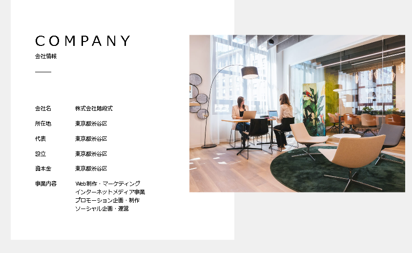
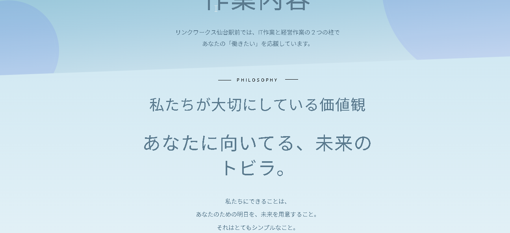
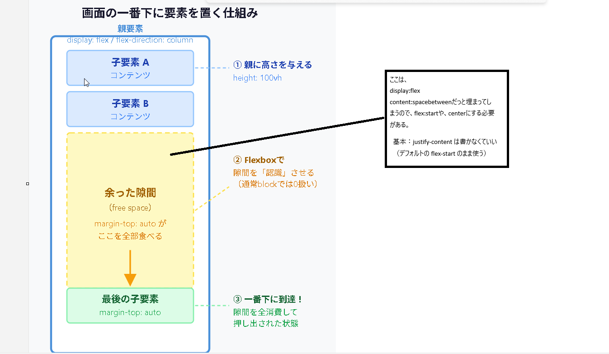

## 2026-04-13
- Copilot Edits でツール実行が確認される場合は `github.copilot.chat.edits.instructions` にも同様の自動承認指示が必要（ `github.copilot.chat.codeGeneration.instructions` とは別設定）。

## 2026-03-30

- `get_categories()` → 全カテゴリを取得(全てだから、そのではないのでtheはつかない。)

- `get_the_category()` → ループ内で使う・その特定記事につけた全カテゴリを取得


- `wp_title('|', true, 'right')` → ページごとのタイトル表示・`bloginfo('name')` と組み合わせて「ページ名 | サイト名」になる
/* ✨ポイント✨ */
`wp_title('|', true, 'right')`**: 現在表示しているページの名前（例：会社概要）を取得し、後ろに「|」を付けます。
`bloginfo('name')`**: 設定で決めた「サイト名（例：〇〇株式会社）」を取得します。

これらを組み合わせることで、**「会社概要 | 〇〇株式会社」**という形式で、ページごとに正しいタイトルが自動的に表示される仕組みです。


- wp_head()にCSSが自動で出るのを不思議に思ったが（つまりCSSの一覧がWEB出力時に設定される） → functions.phpのwp_enqueue_style()で登録したものがwp_head()から出てくる2段階の仕組み

- `esc_html()` → テキストを表示するとき（カテゴリ名・タイトル・著者名など）
- `esc_url()` → URLを表示するとき（hrefの中など）
- `esc_attr()` → HTML属性の値を表示するとき（class・id・valueの中など）

- PHPでHTMLタグを書くとき → `'` で囲む（外が `'` なら中に `"` を書ける）
- `href=""` の `"` が使えるのも外を `'` で囲んでいるから

[プレビュー](http://localhost:54321/preview-20260330-114258.svg)

- echoのコード分解：


　【以下の構文の解析】
 echo '<li><a href="' . esc_url( get_category_link($cate) ) . '">' .esc_html($cate->name) . '</a></li>' ;
　
  - `'<li><a href="'`         → HTMLタグは ' で囲む→　　なお。"　が必要なのは、通常のHTMLもa hrefのあとに、　""をかくから。最初に
  ""タグの文字列の内部にいれる

  - `esc_url( get_category_link($cate) )` → URLを取得（hrefの中）　→<a href="' . esc_url( get_category_link($cate) ) . '">ここはサイドの"" でかこまれているる
  
  - `'">'`                    → " を閉じてタグを閉じる
  - `esc_html($cate->name)`   → テキストは "" 不要（タグの外のテキスト）
  - `'</a></li>'`             → 閉じタグ


- `get_queried_object_id()` → 今のページのID（数字） / `get_the_category()` → 記事のカテゴリ配列（これはカテゴリだけではない。今いるページによって取得するＩＤがかわってくる。　記事ページ(single.php)ならば記事ＩＤ）

・ `get_queried_object_id()` ようするにID取得するか配列か。シンプルにIDを利用すると、比較しやすい。　
カテゴリを表示するときなどは、配列からカテゴリ名を取り出す必要がある。　なので、IDで比較して、表示するときは、配列からカテゴリ名を取り出すのがベスト。


例）その投稿に対して、全カテゴリを回して一致したものの色を変える（class）そのときでは、配列で比較すると大変なので、get_queried_object_id()でカテゴリのＩＤを
取得し、比較をすると便利。


- タグごと出力する関数（この3つだけ覚える）：
  - `the_post_thumbnail()` → `` ごと出る
  - `the_category()` → `<ul><li><a>` ごと出る
  - `wp_list_categories()` → `<ul><li><a>` ごと出る
  - それ以外の `the_` 系 → テキストだけ（自分でタグを書く）
基本的にどちらも画面に表示されているカテゴリであるのはかわれない。IDか、配列あの違い。　なので表示でなければ、get_queried_object_idをつかう

- justify-content: space-between → 子要素が3つのとき、2つめが自動的に中央にくる（1つめ=左端 / 3つめ=右端）

- クラス名のハイフン（`-`）禁止 → アンダースコア（`_`）に統一（例: `global-nav` → `header_nav`）
- `font-size: calc(10 / 1400 * 100vw)` → 横幅が狭いとremが小さくなり全体が縮む（1400px幅で正常サイズ）


- 「項目名＋内容」（会社情報とか）の組み合わせ → `dl dt dd` + `display:flex` + `flex-wrap:wrap` がベスト
- `table` → 比較・集計データ用 / `ul` → 順序なしリスト用 / `div` → 意味なし
- `dt { width: 20% }` + `dd { width: 80% }` → 合計100%で自動折り返し

会社情報サンプル


## 2026-03-31


- get_template_directory_uri() はURLを返す（物理パスではない）→ src="" や href="" に使う★画像やＵＲＬにつかう。　
- get_template_directory() は物理パスを返す → require / include に使う（_uri なし）

ブラウザに渡すもの（HTML）か、サーバー（php）が使うものかで決まります！


- wp_footer() は </body> 直前に必ず書く（WordPressのお決まり）
CSSを読み込む

- wp_head() は </head> 直前に書く（wp_footer() は </body> 直前・セットで覚える）

- ローカルHTMLのWordPress化 → ①style.css ②header/footer.php ③index.php ④functions.phpの4ステップ

- wp_enqueue_styleのハンドル名が重複すると2つ目が無視される → それぞれ別名にする

- HTML属性の中（datetime=""など）→ get_the_date() + echo / タグの外の表示 → the_date()　つまりなぜ、<time datetime= get_the_date> the_date</time>
→これはよくわからないのでそういうものだとおもっておく！
- the_category()はaタグを自動出力 → 親のCSSのcolor:whiteが効かない。なぜなら、<li>タグであればそのなかに<a>タグがつくられるので、

.news_category a { color: white; } で上書きが必要
（  - `the_post_thumbnail()` → `` ごと出る
  - `the_category()` → `<ul><li><a>タグででる` ごと出る
  - `wp_list_categories()` → `<ul><li><a>` ごと出る　要注意）

## 2026-04-01


- わき余白は padding、要素間の隙間は margin（marginをwidth:100%と組み合わせると横スクロールの原因）

- pタグは細かく分けすぎない → 話題が変わらなければ1つの<p>にまとめる


- セクション余白：上・サイドはpadding、下だけmargin-bottom → モバイルで修正しやすい
- <ul>直下に<a>を置いてしまった → 正しくは<li>の中に<a>を入れる
- href=""を空のままにした → href="<?php the_permalink(); ?>"を入れる
- target="blank" と書いてしまった → 正しくは target="_blank"（アンダースコアが必要）
- カテゴリーURLの取得：get_category_link(get_cat_ID('カテゴリー名')) をセットで使う
- position: absolute は横並び・SPで調整大変 → 横並びは flexbox を使う
- SP切り替え時に新変数を作らない → @media内で既存の --side-width の値を上書きする
- position: absolute する要素は親の子にしない → 兄弟要素にするとSP切り替えで static に戻すだけで縦並びになる(子要素にするとあとでSPのとき、分けて処理できないのでやっかい。)


- position: fixed に margin-left: auto は効かない → left プロパティで位置指定する
- サイドバーありパララックス: left: var(--left-side-width) + width: calc(100% - サイドバー幅) + z-index管理（背景1・セクション10・ヘッダー100）
z-index サイドバーは200
z-index トップ画像は10
z-index contentsは100（margin-top 100vh）

こうすることで、背景を固定したまま、セクションとヘッダーはスクロールに合わせて動くようになる。　サイドバーは常に最前面に表示される。


-   background-image: url("../img/project1.jpg");(3点セット)は,DIVタグに記載する

  background-image: url("../img/fashion.jpg");
  background-size: cover; /* 要素いっぱいに広げる */
  background-position: center; /* 中央基準で表示 */


## 2026-04-04
・専門用語
- セクションラベル

✅outline = paddingの外側に線（レイアウトに影響しない） / border = レイアウトに影響する

- 幅を文字+paddingに自動で合わせる → width: fit-content

✅- 角を完全に丸くする（カプセル型）→ border-radius: 100px
- border-radius: 50% = 完全な丸（縦横が同じ正方形のときだけ丸。長方形だと楕円になる）

✅- margin: 0 auto はインライン要素（span）に効かない → display: block を追加する


✅- clip-path で切り取られた部分は描画ごと消える → 別要素を margin-top マイナスで潜り込ませる




✅- overflow: hidden 削除後に position: absolute; right: マイナス値の要素がはみ出す → overflow-x: hidden を body に追加

✅- タブボタンの余白は gap でなく padding → gap だと tab_line（position: absolute の下線）がズレるリスクあり
- box-sizing: border-box → paddingかけてもコンテンツ幅はひろがらない。でもpaddingの合計がwidthをこえるとひろがってしまう
- CSSの継承は子（下方向）にしか流れない → 兄弟・親には継承されない
- 継承される: color / font-size / font-family など / されない: width / padding / margin など

✅- JavaScript概要 → HTML/CSSだけでは動かせない「動き・操作・タイミング制御」を担当する言語。スクロール検知・クラスの付け外し・値の書き換えなどをする

- CSSアニメーションの使い分け → 単純な動きはCSS / スクロールや操作が絡むときはJS / 複雑な連続アニメはライブラリ（GSAP等）

- transition → 値が変わるときになめらかに動かす。transition: プロパティ名 時間 イージング の形
✅- ease → ゆっくり始まって速くなってゆっくり終わる（自然な動き）/ linear → 一定速度

## 2026-04-05

- tab_line に span を使うのは装飾用だから → flex から外れているのは position: absolute のおかげ（spanかどうかは関係ない）
```html
<div class="tab_list"> <!-- flex & position:relative -->
  <button class="tab_btn is-active" data-tab="news">軽　作　業</button>
  <button class="tab_btn" data-tab="press">ＩＴ作業</button>
  <span class="tab_line"></span> <!-- position:absolute 下線-->
</div>
```


- タブUIは flex（横並び）+ position:absolute（下線の自由配置）+ JS（クリックで動かす）の3役割分担

- CSS transition → 値が変わるときになめらかにする / JS → 実際に値を書き換える役割　
transition: プロパティ名 時間 イージング の形で書く。　


- ブラウザはデフォルトで body に margin: 8px が付く → リセットCSSで * { margin: 0; padding: 0; box-sizing: border-box; } を先頭に書く


- セクションwidthの選択基準：背景を全幅に伸ばしたい → width:100% + padding / コンテンツだけ中央に収めたい → width:70% + margin:0 auto。背景も考慮して選ぶ

- flexで段差レイアウトにするには align-items: flex-start が必要（ないとflex が全カードを同じ高さに揃えてしまい margin-top が効かない）

## 2026-04-07

- 疑似要素の縦位置を fixed 値（rem/px）で合わせると、フォントサイズ変更でズレる → vertical-align: middle か top:50- 疑似要素の縦位置を固定値（rem/px）で合わせると、フォントサイズ変更でズレる → vertical-align: middle か top:50%+translateY(-50%) を使う

## 2026-04-07

- border-radiusは特定の角だけ指定できる → border-radius: 左上 右上 右下 左下（時計回り）

- margin-bottomが効かないときはDevToolsで取り消し線チェック → 上書き・親のoverflow・flexが原因

- :nth-last-child は () と数字が必須 → 最後の要素だけなら :last-child がシンプル
- border shorthand は border-bottom を上書きする → 書く順番に注意

## 2026-04-08

- gridで段差が出る → voice_quote（HP作成で使段差のアイテム）にmin-heightを設定して高さを揃える
（Gridカードの高さが揃わないときは min-height を指定するheight 固定ではなく min-height にすると、文字が多くても伸びる）

- grid-template-columns: 1fr 1fr → 1frの数が列数、frは残りスペースを比率で分ける単位

fr = fraction（フラクション）
「分数・割合」という意味の英語です。


※基本２列
.parent {
  display: grid;
  grid-template-columns: 1fr 1fr; /* 1fr = 「残りの幅を1等分」 */
  gap: 20px; /* 列の間隔 */
}

- JS で行頭が function 以外 → 変数名で始まる行は「使う」操作。function で始まる行だけが「作る（定義）」

- ::before/::after は flex の子アイテムになれる → position:absolute なしで align-items:center で縦位置が自動で揃う

- align-items: center は flex の子全員に効く → 疑似要素・div 問わず、子の数や種類に関係なく縦中央に揃う

h2 {
  display: flex;
  align-items: center;
}
h2::before {
  content: '';
  width: 4px;
  height: 1em;  /* 文字と同じ高さ */
  background: blue;
  margin-right: 8px;
}

※display: flex を使うと、position: absolute を使わなくても疑似要素を縦中央に揃えられる


- WordPressテーマを別フォルダからコピーしたとき → style.css の先頭に `/* Theme Name: テーマ名 */` が必要

- テーマフォルダをコピー後は WordPress管理画面「外観→テーマ」で有効化し直す
流れとしては、以下の通りです：

1. テーマをフォルダに入れる
2. CSSを書く
3. style.cssに書く
4. テーマを有効化する

## 2026-04-10

- WordPressはURLとPHPが直結していない → テンプレート階層でWordPressが自動選択する

- Contact Form 7 導入フロー
  1. 管理画面 → プラグイン → Contact Form 7 インストール＆有効化
  2. お問い合わせ → フォーム一覧 → ショートコード `[contact-form-7 id="xxx"]` をコピー

  3. フォームテンプレートはラベルと入力欄を分けて書く（labelの中にショートコードを入れると崩れる）
     ✅ `<label>氏名</label>` + `[text* your-name]`
     ❌ `<label>氏名 [text* your-name]</label>`
  
  // page-contact.php
  4. PHPに `<?php echo do_shortcode('[contact-form-7 id="xxx"]'); ?>` を書く
  
  5. reset.cssでinputが消える場合 → functions.phpでcontact7.cssを登録して上書き。そのCSSで上書き。

- ブラウザのURLバーのドメイン（〇〇.local）とLocal Sitesのフォルダ名が一致しているか確認する → 別サイトを見ていないかチェックできる

- while のコロン構文: `while (have_posts()) : the_post();` ～ `endwhile;` → `{}` と同じ意味・WordPressでよく使う

- `get_the_category()` は配列で返る → 1件だけ取るときは `get_the_category()[0]->name` / 全件は `foreach` で回す


## 2026-04-11

- 【the = 出す / get = もらう】the_○○() → HTMLごと直接出力（echo・esc_html不要）/ get_the_○○() → 値を返すだけ（echo esc_html() がセット）
- the_content() 
/ the_post_thumbnail() 
【出す系】に esc_html() を使うと HTMLタグが文字化け 
→ WordPress内部で安全処理済みなので不要（getするときは、echo & エスケープ $ get th～ ）

- the_content() は自動で <p> タグ付き出力 → 余白を消すには margin: 0 だけでは不十分・display: inline も必要

- 加工・条件分岐したいときは get_the_○○() を使う（値として受け取れる）

- the_post_thumbnail() にクラスを付けるには第2引数に配列で渡す → `the_post_thumbnail('post-thumbnail', ['class' => 'クラス名'])`

- margin-top: auto は flexbox なしでは効かない → 「余ったスペースという概念がない」から（ゼロではなく概念なし）
(そもそも隙間がないときにはマージン０,autoはきかないことを理解する。)

以下の２番目で/mainにフレックス１を設定してない場合は、margin-top: autoする必要がある。mainにflex1を設定すれば伸びるので
margin-top: autoせずに自動的にフッターは↓にいく。
[プレビュー](http://localhost:54321/preview-20260411-103245.svg)


- フッター下固定 → body に `display:flex; flex-direction:column; min-height:100vh` + main に `flex:1`


- single.php のループは「記事があるか確認」より「the_post() を呼ぶための儀式」→ the_post() なしだと the_title() 等が動かない
- have_posts() + the_post() のセットはWordPressの慣習・公式テンプレートに合わせて書く

- 「一覧へ戻る」に `get_permalink()` 引数なし → 同じ記事URLに戻るだけ / `get_post_type_archive_link()` は通常投稿では false → トップに飛ぶ / `get_term_link()
` はカテゴリが存在しないと WP_Error → Fatal Error / URLがわかっているなら `home_url('/news/')` が一番シンプル・確実

- テーマに `front-page.php` があると `home_url('/')` はフロントページに飛ぶ（投稿一覧ではない）

- アーカイブページのURL（`/news/`） のURLがどこから来るか → 
functions.php の set_post_archiveメソッドの
`has_archive = 'news'` で設定している（カテゴリではなく投稿タイプのアーカイブ）

'''php
/*====================================
 * 投稿のアーカイブページを作成
====================================*/
function set_post_archive($args, $post_type)
{ // 設定後に（パーマリンク更新すること）
  if ('post' == $post_type) {
    $args['rewrite'] = array('with_front' => false);
    $args['has_archive'] = 'news';
    $args['label'] = 'お知らせ';
  }
  return $args;
}
add_filter('register_post_type_args', 'set_post_archive', 10, 2);

'''

- `/news/` = カテゴリでしぼった一覧ではなく「全投稿の一覧」→ `get_term_link()` は使えない / `get_post_type_archive_link('post')` か `home_url('/news/')` が正解

- WordPressのアーカイブ2種類：
  - カテゴリアーカイブ → 特定カテゴリの投稿だけ 
  / URL: `/category/news/` / ※functions.php の has_archive = 'news' の 'news' の部分を変えれば、URLが変更
  関数: `get_term_link('news', 'category')`
  
  
  - 投稿タイプのアーカイブ → 全投稿の一覧 
  / URL: `/news/` / 
  関数: `get_post_type_archive_link('post')`

---
## 2026-04-12

- `img { height: 100%; }` のグローバル指定は全画像に影響する → `main { flex: 1; }` と組み合わさると画像が縦に巨大化 → 個別クラスで `height: auto` を上書きして解決

- CSSが効かないときはまずF12でHTMLを確認 → クラスが存在するか・スペルが合っているかを先に確かめる
- WordPressの関数によって出力されるHTMLが変わる → `paginate_links(type=>'list')` は `<ul class="page-numbers">` / `the_posts_pagination()` は `<nav><div class="nav-links">` が出る

- `min-height` だけでは要素を下に固定できない → 

WordPressなどで要素を一番したにもってきたい場合。
親に `flex-direction: column` + 
対象要素に `margin-top: auto` がセット
flex-direction: columnをかけることによって、隙間が発生する。



（body/footer も section/pagination も同じパターン）
- `height: 100vh` vs `min-height: 100vh` → 固定か・伸びるかの違い / フッター固定なら `min-height` が安全（伸びる可能性あり） 
/ 中間要素不要なら直接 `margin-top: auto` でOK（伸びる可能性がないため）


※height = 固定 / 
min-height = 最低保証（中に要素などあれば伸びる）

`※フッターを下に固定する方法は2パターンあります。`

パターンA：main { flex: 1 } を使う（中間要素あり）

```css
body { 
  display: flex; 
  flex-direction: column; 
  min-height: 100vh; }

main { flex: 1; }  
← main が余白を全部使う → footer が下へ
```

パターンB：

footer に margin-top: auto だけ（中間要素なし）

```css
body { 
  display: flex; 
  flex-direction: column; 
  min-height: 100vh; }
footer { margin-top: auto; }  ← footer 自
```

身が余白を全部使う → 下へ
どちらも結果は同じです。

「中間要素不要」= main に flex: 1 を書かなくてもできる、という意味です。

## 2026-04-13

- flexbox でフッターが下に来ないとき → `img { height: 100%; }` のグローバル指定を疑う（画像が親の高さを引き継いで膨らみ、flex: 1 / margin-top: auto が効かなくなる）
- `margin-top: auto` は直接の flex 子でないと効かない → section が間にあると 0 扱い（親も flex にするか、pagination を section の外に出す）
- ページネーションは section の外が一般的 → コンテンツ（section）とナビゲーション（pagination）は分けて書く

- `section { flex: 1 }` + `pagination` が同じ flex コンテナにあると section が全スペースを取って pagination がはみ出す → section から `flex: 1` を削除する
- 開発中の「記事0件」白い空白は本番では起きない → デザインカンプは記事がある状態で設計されているため気にしなくてよい


- 検証ツールで対象要素を確認 → 正しいセレクタに `display: flex` を当てることで正確な位置に配置できる

- ブラウザのデフォルトスタイル（`ul/li` は縦・点つき）は検証ツールで取り消し線で確認できる → `display: flex` + `list-style: none` で上書きする

- `get_categories()` はデフォルトで空カテゴリーを非表示 → `array('hide_empty' => false)` を渡すと全表示　「空カテゴリー」というのは、存在しているが、そのカテゴリが付与されている投稿がないということ。


- 選択中カテゴリーのクラス付与 → `get_queried_object_id()` でID取得してループ内で比較
- `archive.php` はカテゴリーURL（`/category/スラッグ/`）でアクセスしたときに呼ばれる
- memo-all 高速化：`last_config.json` に `last_memo_line` を保存 → wc -l と Read末尾が不要になり約5秒短縮
- 手書きで 01_memo.md を編集したら `wc -l` で行数を確認して `last_memo_line` を手動更新する
- カスタムタクソノミー = カスタム投稿タイプ専用の分類機能 → CPT UI で「タクソノミーを追加」から作成
- カスタム投稿タイプのテンプレートは `archive-スラッグ.php` / `single-スラッグ.php` → テーマ直下に置くだけ

【特定のカテゴリを絞る際の書き方】


- WP_Query でカテゴリ絞り込み → ループの**前**（クエリ）で絞る・ループ中のif絞りはページネーションがズレる➡要するに、
➀最初は WP_Query に特定の値を詰め込んで、※これはループの前が大前提　ページネーションがずれてしまうので。
➁それを引数としてオブジェクトを作成し、
➂そのオブジェクトのメソッドを利用することによって、

特定のカテゴリの投稿名であったり、カテゴリを取得したりすることができる、ということを言いたいわけです。
・クエリ
```php
  <?php
  ✅
  $args = array(
    'category_name' => 'これがでればOK', // カテゴリースラッグを指定
    'posts_per_page' => 5, // 表示する記事数を指定
  );

  $query = new WP_Query($args);

  if ($query->have_posts()) {
    echo '<ul class="archive_category_query">';
    while ($query->have_posts()) {
     ✅
      $query->the_post();
     ✅
      // カテゴリー名を取得する。そのカテゴリ―が複数ある場合は最初のものを表示する。
      the_title();
    }
    echo '</ul>';
    wp_reset_postdata();
  } else {
    echo '記事が見つかりませんでした。';
  }

  ?>
```
　

- `WP_Query` 使ったら必ず `wp_reset_postdata()` を最後に呼ぶ
- `$query->have_posts()` の `->` は「変数の中にある機能を使う」記号・WP_Query使用時は必須
- `var_dump($query)` は量が多すぎる → `var_dump($query->posts)` で記事だけ見る
- `the_` 系は自分でecho → `echo the_title()` は二重になるNG・`get_` 系はechoが必要

つまり今回はthe_postを使っているので、The Titleっていうのが使える。

## 2026-04-14
- AIへのskeleton/kanpu依頼 → セクション単位でJSONを渡す・「HTMLのコメントも参考に」と一言添えると作業ミスが減る
- `width: 100%` はブロック要素（div・p・h1等）には書かなくていい（デフォルトで親幅いっぱい）→ `img` `a` `span` などインライン要素には必要
