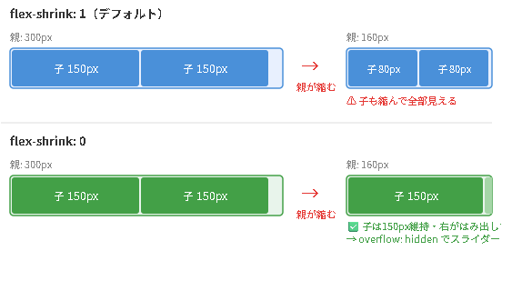
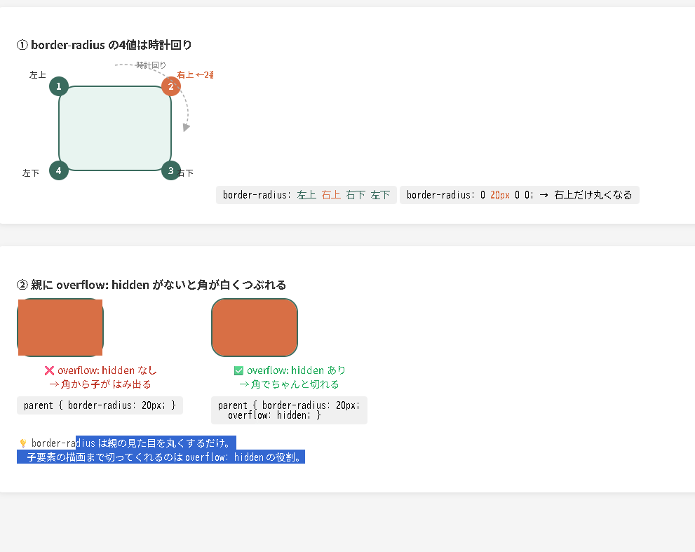
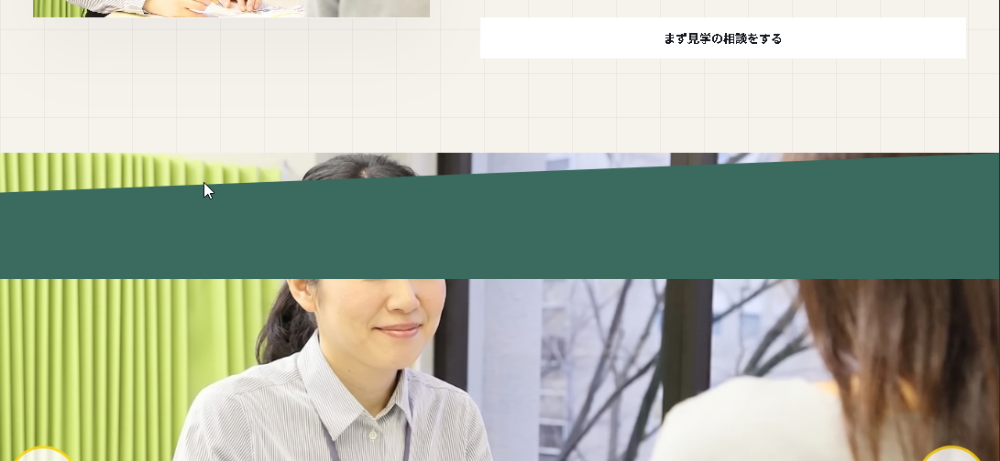

## 🗺 メモリーパレス記録
※ 番号だけ言えばOK（① いま　メモリ / ② 家の前 / ③ 八軒小路付近 / ④ ボイス付近）

| 場所 | 語呂合わせ・内容 | チェック | 更新日 |
|---|---|---|---|
| ① いま　メモリ | - | - | - |
| ② 家の前 | - | - | - |
| ③ 八軒小路付近 | - | - | - |
| ④ ボイス付近 | - | - | - |

---

## 📊 クイズ履歴
| 日付 | 出題数 | 正解 | 残り（❌+未出題） | 完了済み（✅） |
|---|---|---|---|---|
| 2026-04-19 | 10問 | 8問 | - | - |
| 2026-04-20 | 14問 | 10問 | - | - |
| 2026-04-20② | 10問 | 6問 | - | - |
| 2026-04-20③ | 10問 | 6問 | 175問 | - |
| 2026-04-22 | 10問 | 8問 | 153問 | - |
| 2026-04-22② | 10問 | 7問 | 150問 | - |
| 2026-04-22③ | 10問 | 5問 | 148問 | - |
| 2026-04-26 | 9問 | 6問 | 208問 | - |
| 2026-04-29 | 10問 | 6問 | 219問 | - |
| 2026-04-29② | 5問 | 3問 | 220問 | - |
| 2026-04-29③ | 5問 | 3問 | 220問 | - |
| 2026-04-29④ | 9問 | 4問 | 207問 | 67問 |
| 2026-04-30 | 7問 | 4問 | 182問 | 71問 |

---

## 2026-04-13
- Copilot Edits でツール実行が確認される場合は `github.copilot.chat.edits.instructions` にも同様の自動承認指示が必要（ `github.copilot.chat.codeGeneration.instructions` とは別設定）。

## 2026-03-30

- ✅ `get_categories()` → 全カテゴリを取得(全てだから、そのではないのでtheはつかない。)

- ✅ `get_the_category()` → ループ内で使う・その特定記事につけた全カテゴリを取得


- `wp_title('|', true, 'right')` → ページごとのタイトル表示・`bloginfo('name')` と組み合わせて「ページ名 | サイト名」になる
/* ✨ポイント✨ */
`wp_title('|', true, 'right')`**: 現在表示しているページの名前（例：会社概要）を取得し、後ろに「|」を付けます。
`bloginfo('name')`**: 設定で決めた「サイト名（例：〇〇株式会社）」を取得します。

➡　これを使う。wp_titleは非推奨➡　❌ add_theme_support('title-tag')　
これを書くだけで、WordPressが自動でタイトルを <title> タグに出力してくれます。


これらを組み合わせることで、**「会社概要 | 〇〇株式会社」**という形式で、ページごとに正しいタイトルが自動的に表示される仕組みです。


- ✅ wp_head()にCSSが自動で出るのを不思議に思ったが（つまりCSSの一覧がWEB出力時に設定される） → functions.phpのwp_enqueue_style()で登録したものがwp_head()から出てくる2段階の仕組み

✅
- ✅ `esc_html()` → テキストを表示するとき（カテゴリ名・タイトル・著者名など）
- ✅ `esc_url()` → URLを表示するとき（hrefの中など）
- ✅ `esc_attr()` → HTML属性の値を表示するとき（class・id・valueの中など）


- ✅ PHPでHTMLタグを書くとき → `'` で囲む（外が `'` なら中に `"` を書ける）
- `href=""` の `"` が使えるのも外を `'` で囲んでいるから

[プレビュー](http://localhost:54321/preview-20260330-114258.svg)

- echoのコード分解：


　【以下の構文の解析】
 echo '<li><a href="' . esc_url( get_category_link($cate) ) . '">' .esc_html($cate->name) . '</a></li>' ;
　
  - `'<li><a href="'`         → HTMLタグは ' で囲む→　　なお。"　が必要なのは、通常のHTMLもa hrefのあとに、　""をかくから。最初に
  ""タグの文字列の内部にいれる

  - `esc_url( get_category_link($cate) )` → URLを取得（hrefの中）　→<a href="' . esc_url( get_category_link($cate) ) . '">ここはサイドの"" でかこまれているる
  
  - `'">'`                    → " を閉じてタグを閉じる
  - `esc_html($cate->name)`   → テキストは "" 不要（タグの外のテキスト）
  - `'</a></li>'`             → 閉じタグ


- ✅ `get_queried_object_id()` → 今のページのID（数字） / `get_the_category()` → 記事のカテゴリ配列（これはカテゴリだけではない。今いるページによって取得するＩＤがかわってくる。　記事ページ(single.php)ならば記事ＩＤ）
archive.php→archive.phpのIDなど

$cat_id = get_queried_object_id();
$cat = get_category( $cat_id );
echo $cat->name;

説明文
$id = get_queried_object_id();  // → 5 （数字が返る）
$cat = get_category( $id );     // → IDからカテゴリー情報を取得
echo $cat->name;                // →「WEB制作」（名前が出る）


だから条件分岐が必要→すべてのページのＩＤがかえってくるのでカテゴリに絞ってだすようにする。
if ( is_category() ) {
    $id = get_queried_object_id();  // カテゴリーIDが返る
    $cat = get_category( $id );
    echo $cat->name;
}

➡つまり、すべてのカテゴリが混ざった投稿を表示する画面じゃなく、特定のカテゴリに絞った投稿を出す画面のみだよね？


・ `get_queried_object_id()` ようするにID取得するか配列か。シンプルにIDを利用すると、比較しやすい。　
カテゴリを表示するときなどは、配列からカテゴリ名を取り出す必要がある。　なので、IDで比較して、表示するときは、配列からカテゴリ名を取り出すのがベスト。


例）その投稿に対して、全カテゴリを回して一致したものの色を変える（class）そのときでは、配列で比較すると大変なので、get_queried_object_id()でカテゴリのＩＤを
取得し、比較をすると便利。


- ✅ タグごと出力する関数（この3つだけ覚える）：
  - `the_post_thumbnail()` → `` ごと出る
  - `the_category()` → `<ul><li><a>` ごと出る
  - `wp_list_categories()` → `<ul><li><a>` ごと出る
  - それ以外の `the_` 系 → テキストだけ（自分でタグを書く）
基本的にどちらも画面に表示されているカテゴリであるのはかわれない。IDか、配列あの違い。　なので表示でなければ、get_queried_object_idをつかう

- ✅ justify-content: space-between → 子要素が3つのとき、2つめが自動的に中央にくる（1つめ=左端 / 3つめ=右端）

- ✅ クラス名のハイフン（`-`）禁止 → アンダースコア（`_`）に統一（例: `global-nav` → `header_nav`）
- `font-size: calc(10 / 1400 * 100vw)` → 横幅が狭いとremが小さくなり全体が縮む（1400px幅で正常サイズ）


- ✅ 「項目名＋内容」（会社情報とか）の組み合わせ → `dl dt dd` + `display:flex` + `flex-wrap:wrap` がベスト
- ✅ `table` → 比較・集計データ用 / `ul` → 順序なしリスト用 / `div` → 意味なし
- ❌[0429] `dt { width: 20% }` + `dd { width: 80% }` → 合計100%で自動折り返し・display:inline-block必須

会社情報サンプル


## 2026-03-31


- ✅ ➀get_template_directory_uri() はURLを返す（物理パスではない）→ src="" や href="" に使う★画像やＵＲＬにつかう。　
- ✅ ➁get_template_directory() は物理パスを返す → require / include に使う（_uri なし）→つまり他のPHPをよぶ


ブラウザに渡すもの（HTML）か、サーバー（php）が使うものかで決まります！


// ➁functions.php から別ファイルを読み込む
require get_template_directory() . '/inc/custom-post-types.php';
require get_template_directory() . '/inc/widgets.php';


✅wp_footer() は </body> 直前に必ず書く（WordPressのお決まり）
CSSを読み込む

- ✅ wp_head() は </head> 直前に書く（wp_footer() は </body> 直前・セットで覚える）

- ✅ ローカルHTMLのWordPress化 → ①style.css ②header/footer.php ③index.php ④functions.phpの4ステップ

✅wp_enqueue_styleのハンドル名が重複すると2つ目が無視される → それぞれ別名にする

- ✅ HTML属性の中（datetime=""など）→ get_the_date() + echo / タグの外の表示 → the_date()　つまりなぜ、<time datetime= get_the_date> the_date</time>
→これはよくわからないのでそういうものだとおもっておく！

- ✅ the_category()はaタグを自動出力 → 親のCSSのcolor:whiteが効かない。なぜなら、<li>タグであればそのなかに<a>タグがつくられるので、


.news_category a { color: white; } で上書きが必要
（  - `the_post_thumbnail()` → `` ごと出る
  - `the_category()` → `<ul><li><a>タグででる` ごと出る
  - `wp_list_categories()` → `<ul><li><a>` ごと出る　要注意）


  ※なお基本以下の通りthe_XXXだが例外がある。サムネイル
the_title()           ← the_ だけ
the_permalink()       ← the_ だけ
the_content()         ← the_ だけ
the_post_thumbnail()  ← the_post_ が付く（アイキャッチのみ）

★また、the_title() 系はエスケープも、echoも不要。
※唯一の例外

`つまりHTMLタグを自分でかいちゃうと、getにしないといけないってことね。単独ならthe_title()だけで十分ってことね`


## 2026-04-01

- ✅ わき余白は padding、要素間の隙間は margin（marginをwidth:100%と組み合わせると横スクロールの原因）

✅pタグは細かく分けすぎない → 話題が変わらなければ1つの<p>にまとめる


✅セクション余白：上・サイドはpadding、下だけmargin-bottom → モバイルで修正しやすい

✅<ul>直下に<a>を置いてしまった → 正しくは<li>の中に<a>を入れる
- ✅ href=""を空のままにした → href="<?php the_permalink(); ?>"を入れる

✅target="blank" と書いてしまった → 正しくは target="_blank"（アンダースコアが必要）

- カテゴリーURLの取得：get_category_link(get_cat_ID('カテゴリー名')) をセットで使う
  └ get_cat_ID('ニュース') → カテゴリー名をIDに変換 → get_category_link(ID) → URLに変換
  └ カテゴリーアーカイブページ = そのカテゴリーの記事がズラッと並ぶ一覧ページ（ニュース1・2・3…が出る）
  └ 図解：D:/50_knowledge/svg/get_category_link_flow.svg（「図を見せて」と言えば表示）

  [プレビュー](http://localhost:54321/preview-20260429-023126.svg)

※カテゴリーごとにURLをもっている。
管理画面できめる。　カテゴリーURL = /category/スラッグ/ の形


- get_the_category_list() の特徴
// こういうHTMLの文字列を返してくれる
<a href="/category/news/">ニュース</a>, <a href="/category/event/">イベント</a>

echo get_the_category_list(', '); 
// ニュース, イベント

手っ取り早くリンク付きカテゴリーを表示したいときは get_the_category_list() が一番ラクです！


【似ている関数】
似ている関数との違い
関数	返すもの
・get_the_category_list()	HTML文字列（リンク付き）
・get_the_category()	配列（自分でループして使う）
・the_category()	そのまま出力（echoなし）

手っ取り早くリンク付きカテゴリーを表示したいときは get_the_category_list() が一番ラクです！

【get_theで配列をかえすもの】
配列を返す get_the_ 系
関数	返すもの（タクソノミー（分類）系だけが配列です！）
get_the_category()	カテゴリーの配列
get_the_tags()	タグの配列
get_the_terms()	タクソノミー全般の配列


✅position: absolute は横並び・SPで調整大変 → 横並びは flexbox を使う。それか子要素としてポジションあぷソリュートはつかわない。スマホで縦に並べると、うまくならべれない。兄弟関係にすること


✅SP切り替え時に新変数を作らない → @media内で既存の --side-width の値を上書きする

✅position: absolute する要素は親の子にしない → 兄弟要素にするとSP切り替えで static に戻すだけで縦並びになる(子要素にするとあとでSPのとき、分けて処理できないのでやっかい。)


- ✅ position: fixed に margin-left: auto は効かない → left プロパティで位置指定する

fixed は親から切り離れるから、親基準の margin が効かない。

left / top など画面基準のプロパティで動かす。


/* ❌ 効かない */
.fixed-box {
    position: fixed;
    margin-left: auto;
}

/* ✅ 正しい書き方 */
.fixed-box {
    position: fixed;
    left: 50%;
    transform: translateX(-50%);  /* 真ん中に持ってくる */
}


- サイドバーありパララックス: left: var(--left-side-width) + width: calc(100% - サイドバー幅) + z-index管理（背景1・セクション10・ヘッダー100）
z-index サイドバーは200
z-index トップ画像は10
z-index contentsは100（margin-top 100vh）

こうすることで、背景を固定したまま、セクションとヘッダーはスクロールに合わせて動くようになる。　サイドバーは常に最前面に表示される。


-   background-image: url("../img/project1.jpg");(3点セット)は,DIVタグに記載する

  background-image: url("../img/fashion.jpg");
  background-size: cover; /* 要素いっぱいに広げる */
  background-position: center; /* 中央基準で表示 */


## 2026-04-04
・専門用語
- セクションラベル

✅outline = paddingの外側に線（レイアウトに影響しない） / border = レイアウトに影響する

- ✅ 幅を文字+paddingに自動で合わせる → width: fit-content

✅- 角を完全に丸くする（カプセル型）→ border-radius: 100px
- ✅ border-radius: 50% = 完全な丸（縦横が同じ正方形のときだけ丸。長方形だと楕円になる）

✅- margin: 0 auto はインライン要素（span）に効かない → display: block を追加する


✅- clip-path で切り取られた部分は描画ごと消える → 別要素を margin-top マイナスで潜り込ませる


✅- overflow: hidden 削除後に position: absolute; right: マイナス値の要素がはみ出す → overflow-x: hidden を body に追加

✅- タブボタンの余白は gap でなく padding → gap だと tab_line（position: absolute の下線）がズレるリスクあり


- ✅ box-sizing: border-box → paddingかけてもコンテンツ幅はひろがらない。でもpaddingの合計がwidthをこえるとひろがってしまう

- ✅ CSSの継承は子（下方向）にしか流れない → 兄弟・親には継承されない

- ✅ 継承される: color / font-size / font-family など / されない: width / padding / margin など

✅- JavaScript概要 → HTML/CSSだけでは動かせない「動き・操作・タイミング制御」を担当する言語。スクロール検知・クラスの付け外し・値の書き換えなどをする

- ✅ CSSアニメーションの使い分け → 単純な動きはCSS / スクロールや操作が絡むときはJS / 複雑な連続アニメはライブラリ（GSAP等）

- ✅ transition → 値が変わるときになめらかに動かす。transition: プロパティ名 時間 イージング の形
✅- ease → ゆっくり始まって速くなってゆっくり終わる（自然な動き）/ linear → 一定速度

## 2026-04-05

- ✅ tab_line に span を使うのは装飾用だから → flex から外れているのは position: absolute のおかげ（spanかどうかは関係ない）
```html
<div class="tab_list"> <!-- flex & position:relative -->
  <button class="tab_btn is-active" data-tab="news">軽　作　業</button>
  <button class="tab_btn" data-tab="press">ＩＴ作業</button>
  <span class="tab_line"></span> <!-- position:absolute 下線-->
</div>
```


- ✅ タブUIは flex（横並び）+ position:absolute（下線の自由配置）+ JS（クリックで動かす）の3役割分担

- ✅ CSS transition → 値が変わるときになめらかにする / JS → 実際に値を書き換える役割　
transition: プロパティ名 時間 イージング の形で書く。　


- ✅ ブラウザはデフォルトで body に margin: 8px が付く → リセットCSSで * { margin: 0; padding: 0; box-sizing: border-box; } を先頭に書く


- ✅ セクションwidthの選択基準：背景を全幅に伸ばしたい → width:100% + padding / コンテンツだけ中央に収めたい → width:70% + margin:0 auto。背景も考慮して選ぶ

- ✅ flexで段差レイアウトにするには align-items: flex-start が必要（ないとflex が全カードを同じ高さに揃えてしまい margin-top が効かない）

## 2026-04-07

- ✅ 疑似要素の縦位置を固定値（rem/px）で合わせると、フォントサイズ変更でズレる → vertical-align: middle か top:50%+translateY(-50%) を使う

## 2026-04-07

- ✅ border-radiusは特定の角だけ指定できる → border-radius: 左上 右上 右下 左下（時計回り）

- ✅[0429] margin-bottomが効かないときはDevToolsで取り消し線チェック → ほぼ「上書き（他のCSSが勝っている）」が原因。overflow:hiddenはmarginは効いてるが見えないだけ。flexもmarginは効く。

- ✅ :nth-last-child は () と数字が必須 → 最後の要素だけなら :last-child がシンプル
  - :nth-last-child は「後ろから○番目」を指定する関数なので数字が必要
  - :last-child = 後ろから1番目（最後）/ :nth-last-child(2) = 後ろから2番目
- ✅ border shorthand は border-bottom を上書きする → 書く順番に注意

## 2026-04-08

- gridで段差が出る → voice_quote（HP作成で使段差のアイテム）にmin-heightを設定して高さを揃える
（Gridカードの高さが揃わないときは min-height を指定するheight 固定ではなく min-height にすると、文字が多くても伸びる）

- ✅ grid-template-columns: 1fr 1fr → 1frの数が列数、frは残りスペースを比率で分ける単位

fr = fraction（フラクション）
「分数・割合」という意味の英語です。


※基本２列
.parent {
  display: grid;
  grid-template-columns: 1fr 1fr; /* 1fr = 「残りの幅を1等分」 */
  gap: 20px; /* 列の間隔 */
}

- ✅[0429] JS で行頭が function 以外 → 変数名で始まる行は「使う」操作。function で始まる行だけが「作る（定義）」

- ✅ ::before/::after は flex の子アイテムになれる → position:absolute なしで align-items:center で縦位置が自動で揃う

- ✅ align-items: center は flex の子全員に効く → 疑似要素・div 問わず、子の数や種類に関係なく縦中央に揃う

h2 {
  display: flex;
  align-items: center;
}
h2::before {
  content: '';
  width: 4px;
  height: 1em;  /* 文字と同じ高さ */
  background: blue;
  margin-right: 8px;
}

※display: flex を使うと、position: absolute を使わなくても疑似要素を縦中央に揃えられる


- ✅ WordPressテーマを別フォルダからコピーしたとき → style.css の先頭に `/* Theme Name: テーマ名 */` が必要

- ✅ テーマフォルダをコピー後は WordPress管理画面「外観→テーマ」で有効化し直す
流れとしては、以下の通りです：

1. テーマをフォルダに入れる
2. CSSを書く
3. style.cssに書く
4. テーマを有効化する

## 2026-04-10

- ✅ WordPressはURLとPHPが直結していない → テンプレート階層でWordPressが自動選択する

- Contact Form 7 導入フロー
  1. 管理画面 → プラグイン → Contact Form 7 インストール＆有効化
  2. お問い合わせ → フォーム一覧 → ショートコード `[contact-form-7 id="xxx"]` をコピー

  3. フォームテンプレートはラベルと入力欄を分けて書く（labelの中にショートコードを入れると崩れる）
     ✅ `<label>氏名</label>` + `[text* your-name]`
     ❌ `<label>氏名 [text* your-name]</label>`
  
  // page-contact.php
  4. PHPに `<?php echo do_shortcode('[contact-form-7 id="xxx"]'); ?>` を書く
  
  5. reset.cssでinputが消える場合 → functions.phpでcontact7.cssを登録して上書き。そのCSSで上書き。

- ブラウザのURLバーのドメイン（〇〇.local）とLocal Sitesのフォルダ名が一致しているか確認する → 別サイトを見ていないかチェックできる

- while のコロン構文: `while (have_posts()) : the_post();` ～ `endwhile;` → `{}` と同じ意味・WordPressでよく使う

- ✅ `get_the_category()` は配列で返る → 1件だけ取るときは `get_the_category()[0]->name` / 全件は `foreach` で回す


## 2026-04-11

- ✅ 【the = 出す / get = もらう】the_○○() → HTMLごと直接出力（echo・esc_html不要）/ get_the_○○() → 値を返すだけ（echo esc_html() がセット）
- the_content() 
/ the_post_thumbnail() 
【出す系】に esc_html() を使うと HTMLタグが文字化け 
→ WordPress内部で安全処理済みなので不要（getするときは、echo & エスケープ $ get th～ ）

- the_content() は自動で <p> タグ付き出力 → 余白を消すには margin: 0 だけでは不十分・display: inline も必要

- 加工・条件分岐したいときは get_the_○○() を使う（値として受け取れる）

- ✅ the_post_thumbnail() にクラスを付けるには第2引数に配列で渡す → `the_post_thumbnail('post-thumbnail', ['class' => 'クラス名'])`

- ✅[0430] margin-top: auto は flexbox なしでは効かない → 「余ったスペースという概念がない」から（ゼロではなく概念なし）
(そもそも隙間がないときにはマージン０,autoはきかないことを理解する。)

以下の２番目で/mainにフレックス１を設定してない場合は、margin-top: autoする必要がある。mainにflex1を設定すれば伸びるので
margin-top: autoせずに自動的にフッターは↓にいく。
[プレビュー](http://localhost:54321/preview-20260411-103245.svg)


- ✅ フッター下固定 → body に `display:flex; flex-direction:column; min-height:100vh` + main に `flex:1`


- ✅ single.php のループは「記事があるか確認」より「the_post() を呼ぶための儀式」→ the_post() なしだと the_title() 等が動かない
- ✅ have_posts() + the_post() のセットはWordPressの慣習・公式テンプレートに合わせて書く

- 「一覧へ戻る」に `get_permalink()` 引数なし → 同じ記事URLに戻るだけ / `get_post_type_archive_link()` は通常投稿では false → トップに飛ぶ / `get_term_link()
` はカテゴリが存在しないと WP_Error → Fatal Error / URLがわかっているなら `home_url('/news/')` が一番シンプル・確実

- テーマに `front-page.php` があると `home_url('/')` はフロントページに飛ぶ（投稿一覧ではない）

- アーカイブページのURL（`/news/`） のURLがどこから来るか → 
functions.php の set_post_archiveメソッドの
`has_archive = 'news'` で設定している（カテゴリではなく投稿タイプのアーカイブ）

```php
/*====================================
 * 投稿のアーカイブページを作成
====================================*/
function set_post_archive($args, $post_type)
{ // 設定後に（パーマリンク更新すること）
  if ('post' == $post_type) {
    $args['rewrite'] = array('with_front' => false);
    $args['has_archive'] = 'news';
    $args['label'] = 'お知らせ';
  }
  return $args;
}
add_filter('register_post_type_args', 'set_post_archive', 10, 2);

```


- `/news/` = カテゴリでしぼった一覧ではなく「全投稿の一覧」→ `get_term_link()` は使えない / `get_post_type_archive_link('post')` か `home_url('/news/')` が正解

- WordPressのアーカイブ2種類：
  - カテゴリアーカイブ → 特定カテゴリの投稿だけ 
  / URL: `/category/news/` / ※functions.php の has_archive = 'news' の 'news' の部分を変えれば、URLが変更
  関数: `get_term_link('news', 'category')`
  
  
  - 投稿タイプのアーカイブ → 全投稿の一覧 
  / URL: `/news/` / 
  関数: `get_post_type_archive_link('post')`

---
## 2026-04-12

- ✅ `img { height: 100%; }` のグローバル指定は全画像に影響する → `main { flex: 1; }` と組み合わさると画像が縦に巨大化 → 個別クラスで `height: auto` を上書きして解決

- ✅ CSSが効かないときはまずF12でHTMLを確認 → クラスが存在するか・スペルが合っているかを先に確かめる
- WordPressの関数によって出力されるHTMLが変わる → `paginate_links(type=>'list')` は `<ul class="page-numbers">` / `the_posts_pagination()` は `<nav><div class="nav-links">` が出る

- `min-height` だけでは要素を下に固定できない → 

WordPressなどで要素を一番したにもってきたい場合。
親に `flex-direction: column` + 
対象要素に `margin-top: auto` がセット
flex-direction: columnをかけることによって、隙間が発生する。


（body/footer も section/pagination も同じパターン）
- ✅ `height: 100vh` vs `min-height: 100vh` → 固定か・伸びるかの違い / フッター固定なら `min-height` が安全（伸びる可能性あり） 
/ 中間要素不要なら直接 `margin-top: auto` でOK（伸びる可能性がないため）


※height = 固定 / 
min-height = 最低保証（中に要素などあれば伸びる）

`※フッターを下に固定する方法は2パターンあります。`

パターンA：main { flex: 1 } を使う（中間要素あり）

```css
body { 
  display: flex; 
  flex-direction: column; 
  min-height: 100vh; }

main { flex: 1; }  
← main が余白を全部使う → footer が下へ
```

パターンB：

footer に margin-top: auto だけ（中間要素なし）

```css
body { 
  display: flex; 
  flex-direction: column; 
  min-height: 100vh; }
footer { margin-top: auto; }  ← footer 自
```

身が余白を全部使う → 下へ
どちらも結果は同じです。

「中間要素不要」= main に flex: 1 を書かなくてもできる、という意味です。

## 2026-04-13

- flexbox でフッターが下に来ないとき → `img { height: 100%; }` のグローバル指定を疑う（画像が親の高さを引き継いで膨らみ、flex: 1 / margin-top: auto が効かなくなる）
- ✅[0429] `margin-top: auto` は flex/grid コンテナの直接の子でないと垂直方向に効かない（通常ブロックは0扱い）→ section が間にあると効かない / 親も flex にするか要素を外に出す。※左右の margin: auto は通常ブロックでも効く（別の話）
- ページネーションは section の外が一般的 → コンテンツ（section）とナビゲーション（pagination）は分けて書く

- `section { flex: 1 }` + `pagination` が同じ flex コンテナにあると section が全スペースを取って pagination がはみ出す → section から `flex: 1` を削除する
- 開発中の「記事0件」白い空白は本番では起きない → デザインカンプは記事がある状態で設計されているため気にしなくてよい


- 検証ツールで対象要素を確認 → 正しいセレクタに `display: flex` を当てることで正確な位置に配置できる

- ✅[0429] ブラウザのデフォルトスタイル（`ul/li` は縦・点つき）は検証ツールで取り消し線で確認できる → `display: flex` + `list-style: none` で上書きする

- `get_categories()` はデフォルトで空カテゴリーを非表示 → `array('hide_empty' => false)` を渡すと全表示　「空カテゴリー」というのは、存在しているが、そのカテゴリが付与されている投稿がないということ。


- 選択中カテゴリーのクラス付与 → `get_queried_object_id()` でID取得してループ内で比較
今表示中のページのID | IDを返す | ✅ 必要 | ループ外 |
「今どのカテゴリーページを見ているかID知りたい（ハイライトなど）」
  → get_queried_object_id()


- `archive.php` はカテゴリーURL（`/category/スラッグ/`）でアクセスしたときに呼ばれる
- memo-all 高速化：`last_config.json` に `last_memo_line` を保存 → wc -l と Read末尾が不要になり約5秒短縮
- 手書きで 01_memo.md を編集したら `wc -l` で行数を確認して `last_memo_line` を手動更新する
- カスタムタクソノミー = カスタム投稿タイプ専用の分類機能 → CPT UI で「タクソノミーを追加」から作成
- カスタム投稿タイプのテンプレートは `archive-スラッグ.php` / `single-スラッグ.php` → テーマ直下に置くだけ

【特定のカテゴリを絞る際の書き方】


- ✅ WP_Query でカテゴリ絞り込み → ループの**前**（クエリ）で絞る・ループ中のif絞りはページネーションがズレる➡要するに、
➀最初は WP_Query に特定の値を詰め込んで、※これはループの前が大前提　ページネーションがずれてしまうので。
➁それを引数としてオブジェクトを作成し、
➂そのオブジェクトのメソッドを利用することによって、

特定のカテゴリの投稿名であったり、カテゴリを取得したりすることができる、ということを言いたいわけです。
・クエリ
```php
  <?php
  ✅
  $args = array(
    'category_name' => 'これがでればOK', // カテゴリースラッグを指定
    'posts_per_page' => 5, // 表示する記事数を指定
  );

  $query = new WP_Query($args);

  if ($query->have_posts()) {
    echo '<ul class="archive_category_query">';
    while ($query->have_posts()) {
     ✅
      $query->the_post();
     ✅
      // カテゴリー名を取得する。そのカテゴリ―が複数ある場合は最初のものを表示する。
      the_title();
    }
    echo '</ul>';
    wp_reset_postdata();
  } else {
    echo '記事が見つかりませんでした。';
  }

  ?>
```
　

- ✅ `WP_Query` 使ったら必ず `wp_reset_postdata()` を最後に呼ぶ
- `$query->have_posts()` の `->` は「変数の中にある機能を使う」記号・WP_Query使用時は必須
- `var_dump($query)` は量が多すぎる → `var_dump($query->posts)` で記事だけ見る
- `the_` 系は自分でecho → `echo the_title()` は二重になるNG・`get_` 系はechoが必要

つまり今回はthe_postを使っているので、The Titleっていうのが使える。

## 2026-04-14
- AIへのskeleton/kanpu依頼 → セクション単位でJSONを渡す・「HTMLのコメントも参考に」と一言添えると作業ミスが減る

- `width: 100%` はブロック要素（div・p・h1等）には書かなくていい（デフォルトで親幅いっぱい）→ `img` `a` `span` などインライン要素には必要

- フッターがずれている → フッター自体より「すぐ上の親要素の `height` 固定」を疑う → 検証ツールで確認

- 検証ツールでクラスがわからないとき → ↖で要素を選んで左パネルの親をさかのぼる → 右パネルでheightを確認
(親要素からでもいい。縦がおかしいときは明らかにheightが大きいものなど調査する)

- CPT UI = プラグインで「投稿タイプ」と「タクソノミー」を管理画面のボタン操作だけで追加できる（PHPコード不要）
- `get_queried_object_id()` = 今見ているページの主役のID（カテゴリーページならカテゴリーID・記事ページなら記事ID）→ カテゴリーに限定したいときは `is_category()` と組み合わせる


- `get_queried_object_id()` → 今のページのID（数字） / `get_the_category()` → 記事のカテゴリ配列（これはカテゴリだけではない。今いるページによって取得するＩＤがかわってくる。　記事ページ(single.php)ならば記事ＩＤ）
archive.php→archive.phpのIDなど

$cat_id = get_queried_object_id();
$cat = get_category( $cat_id );
echo $cat->name;

説明文
$id = get_queried_object_id();  // → 5 （数字が返る）
$cat = get_category( $id );     // → IDからカテゴリー情報を取得
echo $cat->name;                // →「WEB制作」（名前が出る）


- `get_queried_object_id()`の使い方

以下など
// 今表示しているカテゴリーのIDを取得
$current_id = get_queried_object_id();

// ナビのカテゴリーと一致したら「現在地」クラスをつける
foreach($categories as $cat) {
    $active = ($cat->term_id == $current_id) ? 'active' : '';
    echo '<a class="' . $active . '">' . $cat->name . '</a>';
}


だから条件分岐が必要→すべてのページのＩＤがかえってくるのでカテゴリに絞ってだすようにする。
if ( is_category() ) {
    $id = get_queried_object_id();  // カテゴリーIDが返る
    $cat = get_category( $id );
    echo $cat->name;
}

➡つまり、すべてのカテゴリが混ざった投稿を表示する画面じゃなく、特定のカテゴリに絞った投稿を出す画面のみだよね？


- archive-works.php = archive.phpをコピーしてファイル名を変えるだけ・命名ルール: `archive-{スラッグ}.php` / タクソノミーは `taxonomy-{スラッグ}.php`

- PHPブロックの中 → `.` で文字結合 / HTMLの中にPHPを混ぜる → `<?php ?>` で挟む

- 会社Git（Backlog）運用 → mainから自分の名前ブランチを切る → 毎日commit&push・朝pull（TortoiseGit）
- グローバル `.gitignore`（`~/.gitignore_global`）に書けば会社に届かない → プロジェクト内の `.gitignore` は届く・見られる


- ✅ `wp_title()` は WordPress 4.1 以降 非推奨 → `add_theme_support('title-tag')` を使う

➡　<title> タグをWordPressに自動で出力させるための設定です。　// functions.php に書くだけ
add_theme_support('title-tag');

<title>ページ名 | サイト名</title>
を出力してくれます。header.php に <title> タグを自分で書かなくていいです。

なお、
・bloginfo('name') はサイト名を表示するだけの関数で

- カスタムタクソノミーのターム取得 → `get_the_terms(記事ID, スラッグ)` で記事のターム・`get_terms(['taxonomy' => スラッグ])` で全ターム取得
- 投稿タイプとタクソノミーの関係 → 「ぶら下がる」のではなく横並びでCPT UIで紐付け・記事にタームを設定する


## 2026-04-15

✅メインクエリ → WordPressがアクセス時に自動で記事取得する仕組み・`have_posts()` はこれを使っている
✅条件分岐タグ → `is_front_page()` `is_single()` `is_tax()` `is_post_type_archive()` でページ種類を判定できる
✅`get_the_ID()` → ループ中に `the_post()` が記事をセットするから自動で今の記事IDを返す・手動でID不要

✅- カスタム投稿タイプ → 記事を入れる専用フォルダ・見出しではない・CPT UIで作る
※制作実績、物件情報、ニュース

- タクソノミースラッグ間違い → `'works-tag'` と書いたがデータは `'works-category'` に入っていた → CPT UIで必ず確認
CPT UIで作成した、カスタム投稿タイプ（メニュー）と、タクソノミー（カテゴリ、タグ等）にはスラッグをつけれる

archive-work3.php・・・
ファイル名、`work3`はcustom投稿タイプのスラッグ、
ファイル内のメソッドのお引数`works-category`が`タクソノミー`のスラッグ


```php
<!-- /それぞれに記事タイプに紐づく記事のそれぞれのタームを取得する/ -->

get_the_ID() = 今の記事のID番号を取得する関数（つまりカスタム投稿タイプごとにIDがつく）

<?php
$terms = get_the_terms(get_the_ID(), 'works-category'); 
foreach ($terms as $term) {
  echo '<li>' . esc_html($term->name) . '</li>';
}

※WorkCategoryはタグの大分類です。例えば「果物」で言ったら「甘さ」という大分類があり、その下に「甘さ10」「甘さ20」「甘さ30」が付随するような、紐付きのイメージです。


その投稿に紐づいている「ターム（分類の値）」を取得します。
ターム・・・ウェブ制作・デザイン

例えばカスタム投稿タイプが「果物」だとして、
「リンゴ一覧」や「スイカ一覧」といった記事が2つあったとします。
それにカスタムタクソノミー（タグのようなもの）として「甘さ」という項目があり、
その下にタグ付けとして「甘味10」「甘味20」「甘味30」が紐付いている、という構成イメージで合っていますでしょうか。
```


✅`<main>` をループ内に書いた → 記事の数だけ出力される → ループの外に出す
- ファイル間違い → `page-contact.php` に制作実績のタームを書いた → `archive-works.php` に書く
例外（固定ページ）、すべて動詞といか、メインが先頭のくるが、pageだけは先に、形容詞が先にくる。

- ループが1回しか回らない → WordPress「設定 → 表示設定 → 1ページに表示する最大投稿数」が1になっていた → 件数を増やす

✅`$teams` とタイポ → `$terms` が正しい変数名
✅`foreach` を書き忘れ・`<li>echo teams->name</li>` は無効 → `foreach ($terms as $term) { echo '<li>' . esc_html($term->name) . '</li>'; }` が正しい
✅get_terms()` をループ内に書いた → 記事の数だけ出力される → `endwhile` の外に出す

## 2026-04-17
- 余白がバラバラで「リズムがない」と指摘 → 8ptグリッド（8の倍数px）に統一するだけで改善

- wp_nav_menu のリンク先はPHPに書くのではなく管理画面「外観 → メニュー」で設定する

wp_nav_menu() を使うと、ナビゲーションのリンク先をPHPに直書きせず、管理画面「外観 → メニュー」から設定できる。

【具体例】
```php
wp_nav_menu(array(
  'theme_location' => 'header-menu', // functions.php で登録した名前
  'container'      => false,          // ulの外にdivを付けない
  'menu_class'     => 'header_nav_list', // ulに付くクラス名
));
```


- CPTスラッグ変更時にチェックボックス「移行しますか？」を入れないと新規追加扱いになり重複が増える → チェックを入れてから保存する
- 記事URLに使われるのは「タイトル」ではなく「スラッグ」→ 日本語タイトルだとURLが文字化けする → 英数字スラッグに手動変更する

- テンプレートファイルの prefix を `about-` と間違えやすい → 一覧は `archive-スラッグ.php` / 詳細は `single-スラッグ.php` / 固定ページは `page-スラッグ.php`


- テンプレートファイルを手動で指定しようとした → 不要。命名規則に従ったファイルをテーマに置くだけでWordPressが自動選択する（テンプレート階層）
- 投稿ごとにPHPファイルが必要と思った → archive/singleは1ファイル共通。WordPressがループで中身を差し替える
- archive.php と archive-スラッグ.php を同じものと思いがち → archive.php はお知らせ（デフォルト投稿）用、archive-スラッグ.php はカスタム投稿タイプ専用
  - スラッグ = 投稿タイプのスラッグ（個別記事のスラッグとは別物）
  - archive-works.php がなければ archive.php にフォールバック → 見た目を変えたいときだけ作る
- CPTのアーカイブをメニューに追加しようとして投稿タイプ欄を探した → 個別投稿しか出ない → カスタムリンクに `http://サイトURL/CPTスラッグ/` を入力して追加する
- ローカルのカスタムリンクに https:// を入れたらプライバシーエラー → http:// を使う
- CPT全体フロー：CPT UI作成 → 投稿登録 → archive-スラッグ.php作成 → カスタムリンクでメニュー追加 → 一覧表示
- 一覧ページで the_content() を使った → 本文まるごと表示される → 一覧は the_title() + the_permalink() が基本
- the_content() / the_post_thumbnail() / the_category() だけ HTML タグ込み出力。それ以外はテキストのみ
- the_content() の p タグにクラスをつけようとした → 直接は無理 → 外側を div で囲んで .クラス名 p {} で指定する

## 2026-04-18
- Contact Form 7 のショートコードとテーマのファイル名は無関係 → ショートコードはプラグインが処理するので `page-contact.php` などファイル名は何でもOK
- CF7 を使うには `the_content()` があるページ本文にショートコードを貼るだけ
- ✅ CF7はpタグを自動挿入してレイアウトが崩れる → functions.phpに以下を書いて削除する
```php
function wpcf7_p_remover(){ return false; }
add_filter('wpcf7_autop_or_not', 'wpcf7_p_remover');
```
- get_template_part() は「複数ページで使い回すとき」に使う → 1ページだけなら直接PHPファイルに書いてOK
- CF7導入フロー: ➀スラッグを `contact` にする → ➁固定ページ本文にショートコードを貼る → ➂ `the_content()` が展開して表示
- the_title() はループで投稿を1件ずつ出すもの・ショートコードは管理画面の本文に貼るプラグイン機能 → 全然別物
- CSSが反映されない → functions.php の wp_enqueue_style のパスと実際のファイルの場所がズレていた → パスを合わせて解決
- archive.php はカテゴリ・タグ・日付・CPTすべての一覧を受け取る汎用テンプレート → 見た目を変えたいときだけ archive-{スラッグ}.php を追加すればOK
- /memo-all + auto-memo MCPサーバーの動作テスト → 4ファイル一括書き込み成功

- デフォルト投稿（お知らせ/post）にはスラッグがない → アーカイブURLは /post にならない → 実務ではカスタム投稿タイプで作るほうが多い
- サブクエリのループは $query->have_posts() / $query->the_post() → メインクエリと違い、変数名を前につける
- register_post_type() と CPT UI は同じ結果 → 学習はCPT UIだけでOK・本番納品ではfunctions.phpに直書きも

- 実務では納品先のリスクに応じてfunctions.phpに直書きすることもある（基本はCPTUI）
```php
register_post_type('news', [
    'public'      => true,
    'has_archive' => true,
    'labels'      => ['name' => 'ニュース'],
    'supports'    => ['title', 'editor'],
]);


- WP_Query の post_type は CPTのスラッグ or 'post'（デフォルト投稿・お知らせ　archive.php）を指定 → スラッグ名が一致していないと記事が取得できない

要するに「お知らせ」じゃない画面で投稿を取得したいときに使う、3件だけ表示するとか


【具体例】
<?php
// ① クエリ準備はまとめてPHPブロック
$query = new WP_Query
(['post_type' 　　 => 'sweets', 
　'posts_per_page' => 1]);
?>

<!-- ② 表示はHTMLに混ぜる -->
<main>
  <?php while ($query->have_posts()) : $query->the_post(); ?>
    <a href="<?php the_permalink(); ?>">
      <?php the_title(); ?>
    </a>
  <?php endwhile; wp_reset_postdata(); ?>
</main>
```

【実務でつかう場面】

TOPページ
├ 最新ニュース 3件（post）
└ 制作実績 3件（works）← メインクエリと別に取得


- ✅ サブクエリのループ後に wp_reset_postdata() を忘れた → endwhile の直後に必ず書く（忘れるとメインクエリが壊れる）

- wp_reset_postdata() の正しい位置は endif の外側（ループとifブロックの両方が終わった後）


- PHPで全体を囲むと echo だらけになる 
→ `クエリ準備はPHPブロック・表示はHTMLに混ぜるのが読みやすい`- 

❌ register_nav_menus(ヘッダーPHPに記載するメソッド。これがあると管理画面のメニューが反映) のキー名は自由に決める 
→ functions.php と header.php の theme_location を同じ名前に揃える

```php
// functions.php
register_nav_menus([
    'header-menu' => 'ヘッダーメニュー',  // キー名 => 管理画面に表示される説明
]);

// header.php
wp_nav_menu(['theme_location' => 'header-menu']);
```


## 2026-04-19
✅ bloginfo('name') → WordPress関数でサイト名を表示。変数に入れたいときは get_bloginfo('name')


- VS Code で WordPress関数に青線（intelephense警告）→ エラーではない・WordPressのスタブがないだけ → ブラウザでは正常動作する


- デフォルト投稿のアーカイブをメニューに追加したい → 設定 → 表示設定 → 投稿ページに固定ページを割り当ててから外観 → メニューで追加する

※推奨：
➀固定ページ「お知らせ」を作成（スラッグ: news）→ 
➁設定 → 表示設定 → 投稿ページに割り当て → 
➂/news/ がアーカイブになる → 
➃外観 → メニューで固定ページとして追加

・デフォルトはスラッグ/newsがデフォルト。しかしカスタム投稿タイプは任意！

※// カスタム投稿タイプを登録するとき（自動でアーカイブが作られる）
register_post_type('news', [
    'has_archive' => true,
]);

カスタム投稿タイプだ。ってことはCPT！！！


- Claude Code の確認が何度も出る → settings.json の Bash が個別登録になっていた → Bash(curl*) などワイルドカードにまとめて解決


- functions.php に書くもの → CSS/JS以外に「アイキャッチ有効化・title-tag・メニュー登録」が優先度高・CPT登録は中

`set_post_archive()`      │ 「投稿」アーカイブURLを設定 │
```php
function set_post_archive($args, $post_type) {
    if ('post' == $post_type) {
        $args['has_archive'] = 'news';  // ← /news/ というURLにする
        $args['label'] = 'お知らせ';
    }
    return $args;
}

add_filter('register_post_type_args', 'set_post_archive', 10, 2);
```

※デフォルト投稿のアーカイブを作る方法
管理画面（表示設定）で設定する
        OR
set_post_archive() でコードで設定する

- ★※つまりまとめると：

1. デフォルトのアーカイブは、functions.php（set_post_archive）
でも管理画面からでも登録できる
2. カスタム投稿タイプも、functions.php（register_post_type） 
でも管理画面(CPTUIメニュー登録)からでも登録できる登録できる
　　　　　　　　　　　　registerーーー「登録する」


`add_theme_support('title-tag')` | `<title>``<title>` タグをWordPressに管理させる |
※例：タブに「会社概要 | 株式会社〇〇」と表示される部分

`add_theme_support('post-thumbnails')` | アイキャッチ画像を有効化する


- add_theme_support('title-tag') → WordPressがページ種類に応じて <title> を自動出力してくれる（記事タイトル・カテゴリ名・サイト名など）→ header.php に <title> を手書きしなくてよい

 `register_nav_menus([...])` | ヘッダー・フッターなどメニューの場所を登録する |

## 2026-04-19

- SCF導入フロー
（既にある固定ページに、新たな情報を動的に付け加えることができる、クライアントが行う操作） 
➀フィールドグループ追加・設定 → 
・テキストか、フィールド名等（フィールド名はあとでコードで指定する）
<td><?php the_field('company_name'); ?></td>
（繰り返す　the_sub_field）


➁ロケーションルール（どの固定ページに紐づけるか）設定 → 固定ページなどに追加　会社概要等

➂MetaBoxで内容入力（固定ページメニュー）


- Scfの役割
SCFは 「PHPを触らずに、管理画面から内容を更新できるようにする仕組み」 です！


- CPTUIメニュー登録：

カスタム投稿タイプの枝葉の方じゃなくて、メニューを登録したい場合
カスタムリンク（URL手打ち）は現在地クラスが効かないことがある → 
・CPT UIの「アーカイブあり」から追加した「投稿タイプアーカイブ」の方が正しい


- ✅ SCF繰り返しフィールド: have_rows('フィールド名') + the_row() + the_sub_field() のセットで使う → 新しいグループを作らず既存グループに追加する
```php
<?php if (have_rows('company_info')) : ?>
  <?php while (have_rows('company_info')) : the_row(); ?>
    <tr>
      <th><?php the_sub_field('items'); ?></th>
      <td><?php the_sub_field('contents'); ?></td>
    </tr>
  <?php endwhile; ?>
<?php endif; ?>
```


- PHPの文字列は `''` で囲む → HTML属性値の `""` と混在しないためエスケープ不要
```php
// ✅ シングルクォートで囲めば " をそのまま書ける
echo '<span class="cat-label">' . $category->name . '</span>';

// ❌ ダブルクォートで囲むと \" とエスケープが必要になる
echo "<span class=\"cat-label\">" . $category->name . "</span>";
```


- セミコロンは文の最後だけ → `.` でつないでいる間は文の途中(phpで全てかこまず、通常のHTMLに埋め込むパターン)

```php
echo '<span>' . $category->name . '</span>';
//        　↑タグは文字列            　　　　　↑ここだけ（文の最後）
```


- `get_the_category()` は配列で返る → `foreach` で回す
```php
$categories = get_the_category();
foreach ( $categories as $category ) {
    echo '<span class="cat-label">' . $category->name . '</span>';
}
```

## 2026-04-20
- SCF(Secure Custom Fields・カスタムフィールドをスマートに拡張できる) 画像フィールド → the_sub_field('logo') でURLが返る → 

```php
" >
``` 
に入れる
※サブフィールド（フィード）全体はフィールドグループ・


- SCFのカスタムフィールドが表示されないとき → 
①固定ページのスラッグとPHPファイル名が一致しているか確認（page-{スラッグ}.php）
②繰り返しフィールドは the_sub_field() 
/ 通常フィールドは the_field() を使い分ける


- シンプルにSCFの繰り返しを自分で書いてみた
<?php if(have_rows('フィールド名')):?>
  <?php while(have_rows('フィールド名')):the_row(); ?>
※まちがったポイント
・フィールド名がなかった
・the_rows()とかいていた　the_row


- the_sub_field() はエスケープ不要 → SCF内部で処理済み（get_the_○○() と違い esc_url/esc_html 不要）


- 繰り返しフィールドの中身はサブフィールド → 固定のものは個別フィールド・増やすものは繰り返しに入れる


- SCFフィールドグループを作っただけでは管理画面に出ない → ロケーションルールで「固定ページ→会社概要」に紐づけが必要

- SCF 画像フィールドの「返り値の形式」が「画像ID」だと src="" に数字が入る → SCF管理画面で「画像URL」に変更する

- get_template_directory_uri() はHTMLに書くURL全般に使う → 画像（src）・CSS（href）・JS（src）すべて対象
※　template = theme（も基本・同じ）

画像をとりだすとき、
✅ ❌（間違い） <?php echo esc_url(get_template_directory_uri("img/aaa.jpg")); ?>
🙆‍♂️（正しい）<?php echo esc_url(get_theme_file_uri('img/aaa.jpg') ); ?>


- ✅[0430] 投稿タイプアーカイブ（カスタム投稿タイプ）のURL取得 → 
・get_post_type_archive_link('news') or 
・home_url('/news/')
💡覚え方：get(取得) _ post_type(投稿タイプ) _ archive(一覧) _ link(URL) → 関数名を日本語に読み替えると意味がつかめる *

・通常の投稿一覧画面取得
管理画面「設定 → 表示設定」
  └── 投稿ページ：「ブログ一覧」← このページのIDを保存
         ↓
get_option('page_for_posts') でIDを取得
         ↓
get_permalink( ID ) でURLに変換

- // header.php のナビゲーション部分でget_post_type_archive_linkが使われる

<nav>
  <a href="<?php echo get_post_type_archive_link('works'); ?>">制作事例</a>
  <a href="<?php echo get_post_type_archive_link('news'); ?>">ニュース</a>
</nav>
🎯 実務では wp_nav_menu() が主流

・wp_nav_menu()	選択中のコード	管理画面でメニューを自由に編集できる
・get_post_type_archive_link()	直接URLを書く	PHPに直書き・固定


- ❌[0430] カテゴリーアーカイブのURL取得 → get_term_link('スラッグ', 'category') [プレビュー](http://localhost:54321/preview-20260429-072010.svg) svg/get_term_link_vs_category_link.svg
- ✅[0429] get_term_link も get_category_link も、どちらも返すのは「カテゴリーの記事一覧ページのURL」（リンク先のURLを作るだけ・ページを表示するわけではない）[プレビュー](http://localhost:54321/preview-20260429-072010.svg) svg/get_term_link_vs_category_link.svg

- ❌[0429] get_term_link('news', 'category') → カテゴリー・タグページへのリンクURL取得（href="" に入れて使う） * [プレビュー](http://localhost:54321/preview-20260429-072010.svg) svg/get_term_link_vs_category_link.svg

- ✅[0430] カテゴリーアーカイブページのテンプレートファイル優先順位 → category-{スラッグ}.php → category-{ID}.php → category.php → archive.php → index.php

※【使い方】
// single.php で記事のカテゴリーリンクを表示
$cats = get_the_category();
foreach($cats as $cat) {
    echo '<a href="' . get_term_link($cat) . '">' . $cat->name . '</a>';
}

　　関数	　　　　　　　　　　　　　　　　　　何の一覧？
※　get_post_type_archive_link('works')	投稿タイプの一覧（- // header.php のナビゲーション部分で使われる・基本つかわない）
）

※　get_term_link('news', 'category')	カテゴリーの一覧
// カテゴリー「news」の一覧ページへのリンク


- get_post_type_archive_link('post') → 投稿タイプ一覧ページへのリンクURL取得（href="" に入れて使う）

- アーカイブ設定2つ → 
①functions.phpのset_post_archive() 
②設定→表示設定→投稿ページに固定ページ割り当て

- SCF 繰り返しフィールドはサブフィールドのタイプが変わっても have_rows → the_row → the_sub_field の構造は同じ- ❌ CF7 はフォームに自動で `<p>` タグを挿入 → functions.php に `add_filter('wpcf7_autop_or_not', '__return_false')` で削除できる


✅ SCFインストール「目的のフォルダーはすでに存在しています」エラー → wp-content/plugins/secure-custom-fields/ を削除してから再インストール

フィールドグループ名はPHPでは使わない（管理画面の整理用）→ the_field() / get_field() に渡すのはフィールド名（英語）

- company_info はフィールドグループ名ではなく繰り返しフィールドのフィールド名 → グループ名はPHPに出てこない

✅ フィールドグループ → タイトルのみ / フィールド → ラベル名・フィールド名・タイプ / サブフィールド（繰り返し内）→ 同じくラベル名・フィールド名・タイプを持つ

- SCFのカスタムフィールドが表示されないとき → （たとえばトップ画面にニュースみっつとか）
①固定ページのスラッグとPHPファイル名が一致しているか確認（page-{スラッグ}.php）
②繰り返しフィールドは the_sub_field() 
/ 通常フィールドは the_field() を使い分ける

- min-height: 0 = flex の main を「コンテンツより小さく縮めていい」と許可する → 通常ページには書かない・削除するとコンテンツ高さが守られてフッターが正しい位置に来る

※てことはmin-height: 0  にすることによって、mainが画像（コンテンツ）より縮むことがあるていうこと。逆に１にすればかならず画像のサイズをひろげてもmainの幅も大きくなる


- CF7導入でスラッグを news にしてしまった → お問い合わせページのスラッグは contact・news はお知らせ用


- CF7のフォーム表示は `the_content()` で行う → 固定ページ本文にショートコードを貼り、PHPで the_content() を呼ぶ（問い合わせページ・page-contact.phpでつかう）


- require_once get_template_directory() . '/debug_helper.php' は開発用 → 本番前に削除する
()

- ✅ CF7 ショートコード → [text* フィールド名 class:クラス名 "プレースホルダー"] の順だが、**WP管理画面のGUIから挿入できるので暗記不要**
  → フィールド名   = HTMLの name 属性になる（メール本文の []タグにも使う）
  → class:クラス名 = inputタグに付くクラス名（CSSで装飾できる）
  → "テキスト"     = プレースホルダー（入力欄の薄い文字ヒント）

  【具体例】
  [text* your-name class:contact_input "お名前を入力してください"]
  → name="your-name"（メール本文に [your-name] と書くと入力値が入る）
  → class="contact_input"（CSSで .contact_input { } と書いて装飾できる）
  → placeholder="お名前を入力してください"（未入力時の薄い文字）

  name = サーバにデータを送るときのラベル。受け取る側がこの名前で値を取り出す


- functions.phpに書くもの = WordPressと連携が必要なもの（CSS/JS/メニュー/アイキャッチ等）→ header.phpやアーカイブPHPはファイルを置くだけで登録不要- CF7メールタグ = フォームのname属性と [ ] で囲むだけ・name属性名は自由に決めてよい


- CF7 Multi-Step Forms のプラグインは「Contact Form 7 Multi-Step Forms」（webheadcoder）→「Multi Step Form」（Mondula）は CF7 と連携しない別物・3つのボタンが追加されない


- [multiform] = 確認ページで前ステップの入力値を表示するだけのタグ（編集不可）
　入力ページで「田中太郎」と入力
      ↓
　確認ページで [multiform] が「田中太郎」と表示
      ↓
「送信」ボタンで完了

- [previous] = 確認ページに置く「戻るボタン」タグ

- タグの番号（例: previous-110）= タグジェネレーターが自動付与する識別番号・任意の数字でOK

- CF7 Multi-Step Forms はフォームが2つ必要（入力フォーム + 確認フォーム）・固定ページも confirm と thanks の2つ作る

- page-confirm.php / page-thanks.php は page-contact.php をコピーして作る

- メール確認は Local → Tools タブ → Mailpit で行う
テストメール確認
Local アプリ
└── サイト選択
    └── Tools タブ
        └── Mailpit → 開くと受信メール一覧が見える

## 2026-04-20（追記）
- ✅★ the_sub_field() vs the_field() の使い分けはCPT（カスタム投稿タイプ）かどうかではなく、**SCFで繰り返しフィールドを設定したかどうか**で決まる
  - SCFで繰り返しフィールドを設定 → have_rows → the_row のループの中 → the_sub_field()
  - SCFで通常フィールドを設定 → the_field()
  - 固定ページでもCPTでも同じルール


-functions.phpでregisterを文字の先頭につけるのが
register_nav_menu（header.phpの　wp_nav_menu とペア） と 
register_post_type（カスタム投稿タイプをfunctions.phpで設定する場合） を  で使うの。

## 2026-04-21
- CF7 Multi-Step Forms の3タグ復習 → multistep（次ページ設定）/ multiform（前ステップの入力値表示）/ previous（戻るボタン） → 詳細は01_memo.md「CF7 Multi-Step Forms で確認画面を作る」参照
- CF7の `autocomplete:email` → ブラウザの自動補完ヒント。`autocomplete="email"` に変換される。name / email / tel / off が使える
- `[multiform フィールド名]` のフィールド名はクラス名ではなく入力フォームの `[text* フィールド名 ...]` と一致させる
- 確認フォームの btn_wrap は `last_step send_email "/thanks"` → 入力フォームの `first_step "/confirm"` と混同しない

- 固定ページは contact / confirm / thanks の3つ作る → thanks を忘れやすい

- the_content() → 固定ページの本文エリアを出力 → 管理画面から文言変更できる。echo でハードコードすると管理画面から変更不可


- All in One SEO 設定場所 → サイトタイトルは「設定→一般」・区切り文字とメタは「AIOSEO→Search Appearance」で設定する- label の `for` と input の `id` をペアにする（同じ値）→ ラベルクリックでfocusが移る。`name` はサーバー送信用で別の用途

- 📌 reset.cssに詳細度で勝つには → IDセレクタを使うのが入門レベルの自然な解決策 HTML CSS


- `margin: 0 auto` が効かない → input はデフォルト `inline-block` なので `display: block` を追加する

- `textarea` の縦サイズがデフォルトで大きい理由 → ブラウザが「複数行入力用」として最初から縦幅を大きく設定しているため
  → `height` で上書きして調整する。右下の三角でユーザーがリサイズできるので、固定したい場合は `resize: none` も追加する

- `<link rel="icon">` は `` ではなくブラウザへのファビコン設定 → タブに出るがページ上には表示されない・`<head>` 内に書く

・ファビコン（favicon）とは、**Webサイトのシンボルマーク**のことです。

ブラウザのタブやブックマーク一覧、スマホのホーム画面などで、サイト名と一緒に表示される小さなアイコンを指します。ユーザーが目的のサイトを見分けやすくするための目印です。


- `get_theme_file_uri()` は返すだけ → 出力するには `echo esc_url(get_theme_file_uri(...))` の3点セット


- `is_home() || is_front_page()` でトップページ判定 → ロゴを h1 or div に動的切り替え（SEO対策）
- `is_home()` = 投稿一覧ページ・`is_front_page()` = 表示設定の表紙ページ → 設定パターンによって true/false が変わるため `||` で両方チェックが必要
- h1 は1ページ1つ → 「各ページに h1 が必要」= ヘッダーロゴではなく本文の見出し（記事タイトル・カテゴリー名）のこと。ロゴのh1はトップだけ


- `<meta>` タグは閉じタグなし・`name`=情報の種類・`content`=中身。`<head>` 内に書く・画面に出ない

- `bloginfo('description')` → 管理画面「設定 → 一般 → キャッチフレーズ」の値を出力する

- WordPress header.php の `<head>` 内（DOCTYPE〜`wp_head()`）はどのテーマでもほぼコピペ → 変えるのはファビコンの画像パスだけ・`<?php wp_head(); ?>` は消してはいけない（CSSやJSが読み込まれなくなる）

## 2026-04-22
- flex-shrink: 1（デフォルト）→ 親が縮むと子も縮む / flex-shrink: 0 → 親が縮んでも子は元のサイズ維持・
- テンプレートファイル3種：archive.php=全投稿一覧 / category.php=カテゴリー一覧（汎用） / category-{スラッグ}.php=特定カテゴリーだけの一覧（見た目を変えたいときだけ作る）

※　スライダーのときは０にしろってこと。
そうしないとただおさまっちゃうから

flex-shrink: 1（デフォルト）
→ 子が親に収まろうと全部縮む
→ 4枚が75pxずつになって全部見えてしまう ❌

flex-shrink: 0
→ 子は300pxを維持してはみ出す
→ overflow: hiddenで隠れる → 1枚だけ見える ✅
→ JSでずらす → スライダー完成！
スライダーで必須（overflow: hidden とセットで使う）

flex-shrink 


✅git ブランチ名 master のまま push してもGitHubに届かない → `git branch -M main && git push -u origin main` で解決

- wp_title() は非推奨（deprecated）→ wp_head() の中に自動で含まれるので <title> タグは書かなくてよい

- wp_title() と bloginfo('name') は別物 → wp_title()=ページタイトル（ページごと変わる） / bloginfo('name')=サイト名（常に同じ）
- body_class() はbodyに自動でページ種別クラスを付ける → 同じCSSで `.home .site-header {}` のようにページごとにスタイルを分けられる。慣習として書くもので必須ではない

- bloginfo('description') = 管理画面「設定 → 一般 → キャッチフレーズ」の内容を出力 → サイト全体で1つだけ。ページごとに変えたい場合はSEOプラグイン（All in One SEO等）が必要
- rel属性はクラス名ではなくファイルの役割をブラウザに伝えるHTML属性 → rel="stylesheet" でCSS / rel="icon" でファビコン

- wp_enqueue_script の第5引数 true を省略すると → スクリプトが `<head>` に読み込まれる → DOMが準備される前に実行されてエラーになる可能性あり → `wp_enqueue_script('handle', $src, [], null, true)` で `</body>` 直前に移動する
- functions.php の CSS読み込み順 → reset.css を先頭にする → footer.css を reset より前に書くと reset が後から上書きしてスタイルが効かなくなる
- WordPress フック関数名（mytheme_setup 等）は自由に決めてOK → ただし他テーマ・プラグインとかぶらないよう `テーマ名_` などプレフィックスをつけるのがマナー
- wp_nav_menu() の引数で触れるのは <ul>（menu_class）まで → <a> タグのクラスは子孫セレクタ `.site_nav ul li a {}` か nav_menu_link_attributes フィルターで指定する
- list-style: none は <li> のデフォルトの「・」を消すプロパティ → <li> か <ul> どちらに書いてもOK（reset.cssで最初から消えている場合もある）
- img タグはデフォルトで元のサイズで表示 → 親より大きいと横スクロール発生 → `max-width: 100%; height: auto; display: block;` を全体CSSに入れておくと防げる
- wp_title() は非推奨 → functions.php に `add_theme_support('title-tag')` があれば header.php の `<title>` タグを丸ごと削除してOK → WordPress が wp_head() の中で自動出力する
- Flexbox 縦中央（align-items: center）は高さがないと効果が見えない → height 固定 or 上位で高さが決まっているなら height: 100% を指定する
(おれがやったときは、設定・一般設定のサイトのタイトルが表示された。・bloginfoと同じような印象をうける)
## 2026-04-22
- footer.php 必須3点セット → `wp_footer()` を `</body>` 直前・`</body>`・`</html>` の順。wp_footer() がないと enqueue_script で登録したJSが読み込まれない
- フッターメニュー追加は3ステップ → ➀ functions.php の register_nav_menus() に footer-menu 追加 → ➁ footer.php に wp_nav_menu(['theme_location' => 'footer-menu']) を書く → ➂ 管理画面 外観→メニュー で割り当て
- wp_nav_menu() フォールバック → theme_location に管理画面のメニューが割り当てられていないと全ページが自動表示される → 'fallback_cb' => false で無効化できる
- メニューに表示されるのはページが存在するからではなく、管理画面のメニュー構造に追加したから
## 2026-04-23
- page-{スラッグ}.php はテンプレートだけ → 管理画面で固定ページ（スラッグ一致）を作らないと表示されない。テンプレート作成≠ページ作成
- wp_nav_menu のクラス命名 → _list→_item→_link の順。flexはulに。aタグは子孫セレクタで（WordPressが自動生成するため直接クラス指定不可）
- 中央配置の余白は padding より max-width + margin: auto → padding は画面が狭いとコンテンツが潰れる。max-width はコンテンツ幅を守りながら自動縮小する
- CSSデバッグ手順① → パーツを1つずつ消して残りで確認。全部消しても問題が残るなら全体HTMLのmargin等の共通スタイルが原因
- the_content() を <p> タグで囲まない → CF7など内部でdivを使うフォームの場合、HTML構造が崩れる原因になる
- page.php がない場合は page-contact.php を作る → get_header() / the_content() / get_footer() の3点セット。CF7のショートコードは固定ページ本文に貼る- the_content() を <p> タグで囲んだ → <p> 禁止。CF7など内部でdivを使うフォームはHTML構造が崩れる。div で囲む
- 静的HTMLにフォームを書かなくていいと思っていた → 書く。デザイン確認・クライアント承認・CSSの設計図として必要。WordPressに移行したら捨てる前提だが書く
- CF7移行後の流れ → 静的HTMLのフォームをCF7に差し替え → CF7が出力するクラス名（.wpcf7-form等）に合わせてCSSを修正してデザインカンプに近づける
- register_nav_menus（s付き）→ 配列で複数同時登録OK / register_nav_menu（単数）→ 1つだけ → ヘッダー＋フッターを同時登録したいなら register_nav_menus を使う
- archive.php は functions.php への登録不要 → WordPressのテンプレート階層でファイル名から自動認識。テーマ直下に置くだけでOK
- `<main>` が必要な理由 → header.php は `<body>` と `<header>` で終わり、footer.php は `<footer>` から始まる → その間を埋めるのが各テンプレートの `<main>` タグ（ないとヘッダーとフッターの間が空）
- archive.php の置き場所 → テーマ直下（index.php と同じ階層）。css/ フォルダの中に置いてもWordPressが認識できない- the_archive_title() → アーカイブタイトルはWordPressが自動表示（カテゴリー名・タグ名・日付など）ベタ書きしない
- 投稿のタイトルは自由 → スラッグは functions.php の has_archive 等と合わせる必要がある場合あり- 投稿ページ（表示設定）は home.php が使われる → archive.php ではない（WordPressの唯一の例外ルール）


- - archive.phpを使う場合。基本カテゴリー/タグ/日付で絞れる汎用的なPHP。
　今回使わなかった理由。すでに「category-news.php」という
　カテゴリ専用ファイルがあるので、archive.phpは不要だった。

　カテゴリーが複数（ニュース・イベントなど）に増えたら
　archive.php 1つにまとめるほうが管理しやすい。

【archive.php で表示するときの正規手順】
① テーマ直下に archive.php を作成（index.php と同じ階層）
② 投稿エディタでカテゴリーを新規作成（例：news）
③ 投稿にカテゴリーをチェック → 公開（※投稿0件だとURLが存在しない）
④ 外観 → メニュー → 「カスタムリンク」で /category/news/ を入力してメニューに追加（例）http://iwa.local/category/news/）

（例）

カテゴリー一覧にリンクしたい → /category/news/
タグ一覧にリンクしたい      → /tag/php/
日付一覧にリンクしたい      → /2026/04/

つまり、archive.phpでもURLは絞る、URLでつくらないといけない。
（投稿にカテゴリーをつけて公開
  ↓
/category/news/ が自動でできる
  ↓
そのURLをカスタムリンクに入力するだけ）


   ※固定ページと違い、自分でページを作らなくてもWordPressが自動でURLを生成する
⑤ メニューのリンクをクリックして表示を確認


⚠ ハマりやすいポイント
- archive.php を css/ フォルダに入れると認識されない → テーマ直下に置く
- 投稿を公開する前にURLを踏んでも404になる → 先に投稿を1件以上公開する
- メニューに /category/news/ を追加しても投稿0件だとページが存在しない


- カテゴリで絞った投稿を表示
カテゴリーアーカイブのメニュー追加フロー 
→ 「外観ーメニューで」カスタムリンクで /category/スラッグ/ を設定 （例）http://iwa.local/category/news/）
②投稿エディタのカテゴリーパネルから新規作成 （最初カテゴリがuncategorizedしかないので追加）
③投稿にチェック→公開 → 投稿0件だとURLが存在しない
(なお,この場合ファイル名は、category-スラッグ.php にする（例）category-news.php）

投稿０件だと表示されない- single_cat_title() → カテゴリー名だけ出力（例：ニュース）/ the_archive_title() → 「カテゴリー: ニュース」と接頭語が自動でつく
- category-news.php はarchive.phpより優先される → ①category-news.php ②category.php ③archive.php の順。カテゴリーが1つなら専用ファイル、複数なら archive.php 1つで管理が楽
- the_time('Y.m.d') は「現在日付」ではなく「投稿日」を表示する → クライアントが投稿時に日付を自由に設定できる（過去日・未来日・予約投稿も可）

## 2026-04-24

- Codexで `/memo-all` を使う場合 → auto-memo MCPが未接続なら、MCP関数名を直接呼ぶのではなく `update_plan` とPowerShellの読み書きに置き換える。Git管理されているフォルダがあることと、MCPとして接続されていることは別。

## 2026-04-26

- アーカイブURL取得関数の使い分け → 一覧ページ=`get_post_type_archive_link('news')` / カテゴリ・タグ=`get_term_link('スラッグ','category')` / 個別記事=`get_permalink()`。主に header.php のナビ・TOPの「一覧へ」ボタン・single.php のカテゴリリンクで使う。
- `wp_title()` の代わりに `add_theme_support('title-tag')` を functions.php に書くと、WordPressが自動で`<title>`タグを出力してくれる。header.php に自分で `<title>` を書かなくてOK。書く場所は `function my_setup(){ add_theme_support('title-tag'); } add_action('after_setup_theme','my_setup');` のセット。

### 個別記事ページから「一覧」に戻る2つの導線（よく混同する）

**前提のサイト構造（カスタム投稿タイプ「news」の例）**
- 投稿タイプ：news（お知らせ）
- カスタム分類：news_category（新製品 / イベント / 営業案内 など）

**① お知らせ一覧へ戻る（全記事）→ `get_post_type_archive_link()`**
- 飛び先：archive-news.php
- 表示される記事：news 投稿タイプの**全部**（カテゴリ問わず）
```php
<a href="<?php echo get_post_type_archive_link('news'); ?>">
  お知らせ一覧へ戻る
</a>
```

**② カテゴリ一覧へ戻る（絞り込み）→ `get_term_link()`**
- 飛び先：taxonomy-news_category.php
- 表示される記事：そのカテゴリの記事**だけ**
```php
<a href="<?php echo get_term_link('shinseihin', 'news_category'); ?>">
  新製品の記事一覧へ
</a>
```

**実務でよく見るsingle.php末尾のUI**
```
カテゴリ：[ 新製品 ]   ← get_term_link（カテゴリ絞り一覧へ）
タグ：[ 春 ] [ スイーツ ] ← get_term_link（タグ絞り一覧へ）

      ┌─────────────────────┐
      │  お知らせ一覧へ →    │  ← get_post_type_archive_link（全記事一覧へ）
      └─────────────────────┘
```

**第2引数（タクソノミー名）の使い分け**
- 通常投稿のカテゴリ → `'category'`
- 通常投稿のタグ → `'post_tag'`
- カスタム投稿のカスタム分類 → `'news_category'` などの独自名

**今の記事のカテゴリリンクを表示する一番楽な方法 → `the_category()`**
```php
<p>カテゴリ: <?php the_category(', '); ?></p>
<!-- 自動で <a href="..."> が出る。複数カテゴリはカンマ区切り -->
```
- `the_` 始まり = echo付き・自動表示（楽）
- `get_` 始まり = 値を返すだけ・echo必要（自由度高い）

## 2026-04-28
- `width` は固定命令でスマホで横スクロール発生／`max-width` は上限ガードで画面幅に合わせて縮む。文章ブロックや画像は基本 `max-width: 100%` か `width:100% + max-width` の組み合わせを使う。

- max-width の目的は2つあると気づいた → ①スマホで崩れない（レスポンシブ） ②PCで広がりすぎない（読みやすさ・1行60〜80文字で改行されるよう制限）。レスポンシブ目的だけだと思ってたけど、PCでの可読性も大きな理由

- セクションレイアウトの設計指針 → ヒーローは画像と並ぶ構造で半分幅、他セクションは全幅。役割が違うから幅違ってOKで違和感じゃない。

今後の新規セクションは position: absolute を避けて grid/flex で組む。これで画像とテキストの重なり問題を根本回避できる


- border-radius 4値は時計回り（左上→右上→右下→左下）→ 2番目が右上。

※親に overflow: hidden がないと角が白くつぶれる
あくまでも親の形を◯くするだけど子（要素は）そのままなのでoverflow: hiddenで隠す




- mix-blend-mode: multiply → PNG画像の白い背景を消すのに使う。白×カード色=カード色の原理。screen（黒を消す）の逆

- filter: brightness() → background-imageを持つdivにも直接かけられる。imgタグ限定じゃない。スライドごとに個別調整できる


- backdrop-filter は要素自体ではなく「うしろ」にエフェクト。background: rgba()（半透明）とセットで使わないと見えない
　・つまりrgbaだけでもすけるけど、後ろはクッキリすける。　backdrop-filter　blur()　があると　透けて＆ゆがむ


- rgba の a = 透明度（0〜1）。#ffffff では透明度指定できないので透かしたいときは rgba に切り替える

- background: グラデーション, url() → カンマ区切りで複数背景。前に書いたほうが上に重なる。写真の上に色をかぶせるテクニック

- display: grid + gap のみ（grid-template-columns なし）→ flex-direction: column + gap と同じ縦並べになる

## 2026-04-29
- animation ショートハンドの数値2つ → 最初がduration（速さ）、後半がdelay（読み込み後に動き始めるまでの待機時間）。

`animation: name duration timing delay fill-mode` の順番


/* まとめて1行（ショートハンド） */
margin: 10px 20px;


- video を枠いっぱいに表示
  → 親に position: relative + min-height（基本は height と width を指定する）
  → 子に position: absolute
       + inset: 0（親の四隅に張り付く → 結果的に親と同じサイズになる）
       + object-fit: cover（縦横比を保ったまま黒帯をトリミング）
  height: 100% は親に height がないと効かないので使わない


- セクション間の仕切りをなくして画像を置きたい時

clip-path は子要素（img）も一緒に切り取る → 背景だけ斜めにしたいときは ::before（疑似要素） に背景を分離。
つまり疑似要素に、insertでかぶせて、クリップパスをかける。疑似要素にすることで、疑似要素が子要素になるから、なにも(img)切り取らなくなる

```css


/*高さだけ確保　*/
.home_bridge {
  position: relative;
  overflow: visible;
  height: 16rem;
  z-index: 1;
}

/* ::before で緑の斜め背景を作る（clip-path で斜めに切り取り） */
※　つまり疑似要素で表示させているというよりきりとっている！！
.home_bridge::before {
  content: "";
  position: absolute;
  inset: 0; /* 親と同じ位置 */ 
  background: var(--green);
  clip-path: polygon(0 5rem, 100% 0%, 100% 100%, 0 100%);
}
```

<div class = "home_bridge">
  img
</div>

::before に background + clip-path を書く → img は自由にはみ出せる


- 装飾目的の画像（セクション橋渡しなど）に矢印が出る → imgタグ → divタグ + background-image に変えるとブラウザ矢印が消える。divは中身なしだとheight: 0になるのでaspect-ratioかheightを必ず指定する

## 2026-04-30


- `clip-path` → 要素を好きな形に切り抜くCSS。以下の4種類がある

  | 値 | 形 | 書き方例 |
  |---|---|---|
  | `polygon()` | 多角形（頂点を複数指定） | `polygon(0 0, 100% 0, 100% 100%, 0 100%)` |
  | `circle()` | 円 | `circle(50%)` |
  | `ellipse()` | 楕円 | `ellipse(60% 40% at 50% 50%)` |
  | `inset()` | 四角形（内側に削る） | `inset(10px 20px 10px 20px)` |


- `polygon()` の引数は **「x y」のセット** をカンマ区切りで並べる
  - 第1引数 = 左上 / 第2引数 = 右上 / 第3引数 = 右下 / 第4引数 = 左下（時計回りが基本）
  - 1点だけずらすだけで斜め・台形が作れる

  ```css
  /* 左上だけ下げて斜め帯にする例 */
  clip-path: polygon(0 5rem, 100% 0%, 100% 100%, 0 100%);
  /*                 左上↑    右上↑   右下↑     左下↑  */
  ```

※　第一引数の説明
・XYだから、　０➡はいつも０　Yは規定値　より↓でひだり上はへこむんでいる
・ほかは、問題ない。端っこ

① 0 5rem → 左端・上から5rem下
② 100% 0% → 右端・一番上
③ 100% 100% → 右端・一番下
④ 0 100% → 左端・一番下


- `clip-path` は `::before` に書くと、子要素（画像など）を切り抜かずに背景だけ斜めにできる


✅background-imageのファイル名に()カッコがある場合はurl()を"ダブルクォート"で囲む

✅ position: absolute; inset: 0 の子（動画など）は親のpaddingを増やすと一緒に大きくなる → テキストだけ下にずらしたいときは親ではなくinner要素？？にpadding-topをつける

## 2026-04-30

- `translate(-50%, -50%)` は `top: 50%; left: 50%` とセットで使う中央配置補正。位置が変わったら不要


- `setInterval(処理, ミリ秒)` → 第一引数が実行する処理（関数）、第二引数が繰り返す間隔。1秒=1000ms。setTimeout は1回だけ、setInterval はずっと繰り返す トップ画面での画面の切り替えなどで利用する

- `::before` の `content: "FLOW"` でセクション背景にうっすら大文字ウォーターマークを作れる。font-size を大きく、colorを rgba で薄くするのが定石

- ✅未使用CSS（デッドコード）→ HTMLに存在しないクラスのルールは削除してOK。.nav / .home_hero_panel / .home_work_gallery などが対象だった

- 動画ファイル自体の黒帯は `object-fit: cover` では消えない → `transform: scale(1.08)` で拡大して黒帯を画面外に追い出す（親に `overflow: hidden` が必要）


✅疑似要素オーバーレイ → `::after` に `content: ""; position: absolute; inset: 0; z-index: 1; background: ...` の5点セット。テキストは z-index: 2 以上にする

- `position: fixed` の主な使いどころ → ヘッダー（最多）/ 右下の固定CTAボタン / モーダルの暗幕 / トースト通知 / サイドナビ

  - 共通の判断基準：「スクロールしても消えてほしくない」→ fixed
  - セクション内だけ止めたい → sticky（fixed との使い分け）
  だから基本短い間だけ背景がとまるいめーじ？
そうです！

「ここのセクションだけ止めたい」→ sticky（テーブルのヘッダ・・あまり使わないなど）
「ずっと画面に出しておきたい」 → fixed(ヘッダーなど)


[プレビュー](http://localhost:54321/preview-20260502-081608.html)


親要素の高さ分だけ止まって、親が終わったら一緒に流れていく感じです。

## 2026-05-01
- home.php = 全投稿トップ（全記事一覧）/ archive.php = 絞り込み系（カテゴリ・タグ・日付）→ 同じ「一覧ページ」でも絞り込みがあるかどうかでテンプレートが変わる

archive-{post-type}.php	特定のカスタム投稿タイプのアーカイブ

⇀archive-{post-type}.phpが見つからない場合、archive.php
にフォールバックする

- WordPressのURL取得関数まとめ（何のURLか → 使う関数）
  - CPT全一覧ページ → get_post_type_archive_link('スラッグ')
  - カスタムタクソノミー（カテゴリー）ページ → get_term_link($term)
  - デフォルトカテゴリーページ → get_category_link(カテゴリーID) ※カスタムタクソノミーには使えない

  - デフォルト投稿の一覧ページ → get_permalink( get_option('page_for_posts') )

- デフォルト投稿の一覧ページを表示させるフロー
  1. 固定ページ「ニュース一覧」を管理画面で作成（スラッグは何でもOK）
  2. 設定 → 表示設定 → 「投稿ページ」に 「1」 の固定ページを割り当て
  3. (デフォルト投稿（投稿 → 投稿を追加）が 「1」 のURLに一覧表示される)
  4. そのURLを取得するには get_permalink( get_option('page_for_posts') )
     → get_option('page_for_posts') が固定ページのID（数値）を自動で返してくれる


- ナビメニューにお知らせリンクを追加する方法 → 外観 → メニュー → 固定ページから追加して保存するだけ（PHPは触らない）
  → wp_nav_menu() が自動でリンクを出力 / クリックすると home.php が表示される
  


  
  - スクリーンリーダー → HTMLの要素を音声で読み上げる仕組み。装飾要素（動画・アイコン）にはaria-hidden="true"をつけてスキップさせる（視覚が不自由な人装飾画像などよみあげてしまうのをふせぐ）


- autoplay muted playsinline → 3つセットで書く。muted がないとブラウザにブロックされ、playsinline がないとiPhoneで全画面になる

✅ min() → 2つの値のうち小さい方を使うCSS関数。コンテナの上限幅と左右余白の確保を1行で両立できる

  - 例: width: min(112rem, calc(100% - 12rem));
  ・大画面: 100%-12rem が 112rem より大きい → 112rem で止まる（広がりすぎない）
  ・小画面: 100%-12rem が 112rem より小さい → そちらを使う（左右に余白が残る）

  つまり、コンテンツ幅と、このサイトで指定されているパディングをひいたものを指定する（大きくなっても、１１２０はこえない（大きくなりすぎない）。小さくなっても）


✅ ヘッダー透明化 → ヒーロー上のヘッダーをページ初期に background: transparent にして画像と一体化させる。JSでスクロール量を判定してheader_scrolledクラスを付け外しし、スクロール後に background を半透明で復活させる

## 2026-05-02
✅ TinyPNG → Web用画像の一括圧縮ツール（https://tinypng.com/）。最大20枚ドラッグするだけ、ファイル名変わらず、見た目ほぼ劣化なし。1枚500KB以上なら圧縮推奨✅ position: sticky → 親に overflow: hidden があると動かなくなる（bodyのスクロールが見えなくなるため）。角丸は border-radius: 6px 6px 0 0（上だけ）で代替## 2026-05-04
- IntersectionObserver → 要素が画面に入ったら `isIntersecting` が true になり、クラスを付与。`unobserve` で監視解除すると1回きりの発動になる（往復スクロールで繰り返さない）
- jQuery $(window).scroll() → スクロールのたびに全要素チェック → 重い。IntersectionObserver に置き換えると jQuery不要・計算式不要・コード激減
- scrollIntoView() → 指定要素の位置まで画面をスクロールする1行命令。ボタンクリックなどをきっかけに、ブラウザが自動で縦スクロールしてくれる。`behavior: "smooth"` で滑らか・なしだと瞬間移動。関数全体はAIに任せてOK
- text-wrap: balance → 見出しの改行位置をブラウザが自動調整。`<br>` 手書きは幅が変わると崩れるので、こちらを使う
- WordPress化の準備 → 共通クラスは style.css にまとめる（js_soft_reveal など）。ページ固有は work.css / business.css に残す。HTML段階から分けておくと後の enqueue が楽になる
- カスタム投稿タイプのアーカイブ（一覧）をメニューに追加する正規手順 → CPT UIで「アーカイブあり（has_archive）」をON → 外観メニューの「表示オプション」でCPT名にチェック → 左パネルにアーカイブが出る → 選んで追加。カスタムリンクでURL手打ちは非推奨（スラッグ変更時に手動修正が必要になる）
- CPT メニュー追加は実質2パターン（表示オプション推奨・カスタムリンク非推奨）。functions.php への register_post_type 直書きは「登録手段」の違いで追加方法（表示オプション）は同じ。CPT UI 使用中は functions.php に書かなくてOK
- class属性を2回書くと最初だけ有効 → `class="A" class="B"` はNG、`class="A B"` とスペース区切りで1つにまとめる
- animation に opacity 直書き → @keyframes の from が opacity: 1 になりアニメーション無効。解決は opacity 削除 + fill-mode: both + @keyframes に from 明示
- アニメーション表示されないデバッグ → F12で is_visible クラスを確認 → なければ js_soft_reveal クラスが HTML で正しく書かれているか確認（class二重指定バグの可能性）- IntersectionObserver threshold: 0.4 → 要素が縦に長いと下が見える前にアニメーション完了。threshold: 0.1 にすると画面に入った瞬間に発火して自然
- レスポンシブブレークポイントは 768px が一般的（iPad miniの横幅）。700px は少し狭め。絶対値ではなく「デザインが崩れ始める幅」に合わせる
- calc(10/375*100vw) → スマホで html の font-size に使う。375px 画面で 1rem=10px。画面幅に比例して rem が自動スケール。375=iPhone基準幅- object-fit: cover は切り方のルールだけ → どこを見せるかは object-position で別指定。right center / left center / 60% center など。スマホで人物が切れるときはセットで調整する- モバイルで `height: 60svh` を設定しても PC の `min-height: 92vh` は消えない → `min-height: 0` も一緒に書く（`height` と `min-height` は別プロパティ・`min-height` の方が優先）
- `::before { content: "STEP " }` → CSS だけで文字を前付けできる。HTML には数字だけ書いてCSSで "STEP " を追加するパターン
- `white-space: nowrap` → `::before` の追加テキストで STEP ラベルが2行になるときにも有効
## 2026-05-05
- `align-self: flex-start` と `margin-right: auto` はどちらも flex 内で左寄せになるが仕組みが違う。`align-self` は配置の命令（flex/grid専用）、`margin-right: auto` は右余白を食べて間接的に左に追いやる汎用技。width が決まっていれば見た目は同じ
- CSS Grid の `grid-template-columns: 1fr 1fr` で `gap` を入れると、gap を先に引いた残りの幅を fr で分割する。gap を変えても列幅が自動再計算されるので `calc()` の手計算が不要
- テキストマーカーアニメーション → `background-image`（1色のlinear-gradient）+ `background-size: 0%→100%` でマーカーが左から伸びる。`background-position: left 84%` で縦位置をテキスト下部に調整。線の太さは `0.28em`