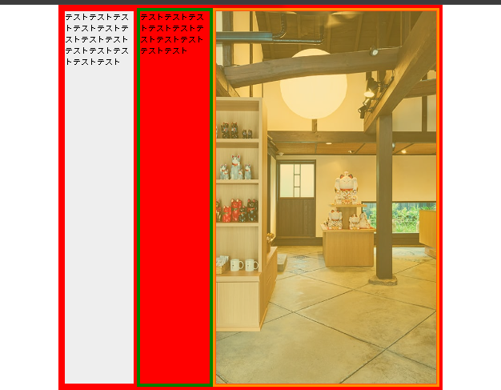
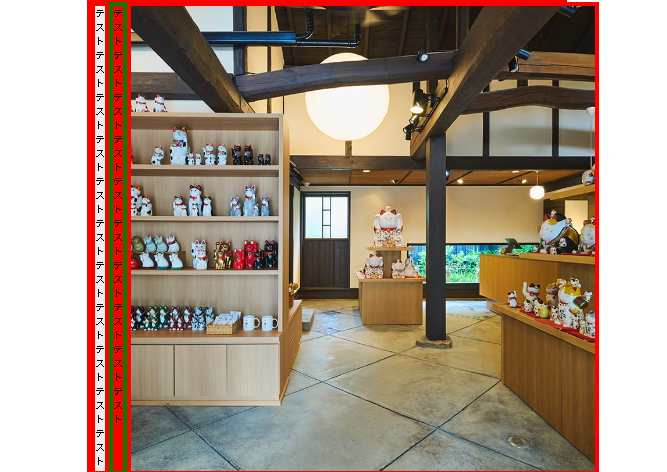
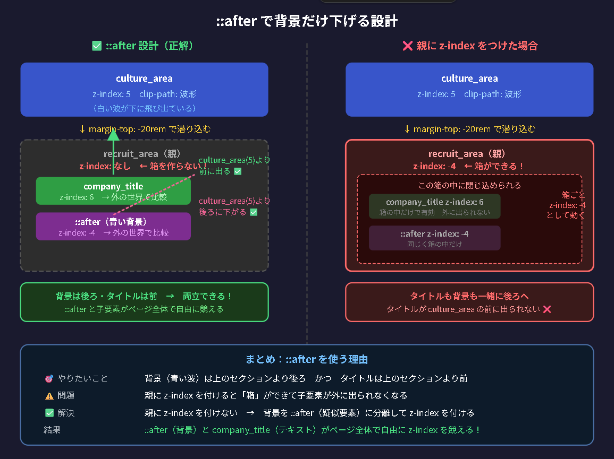
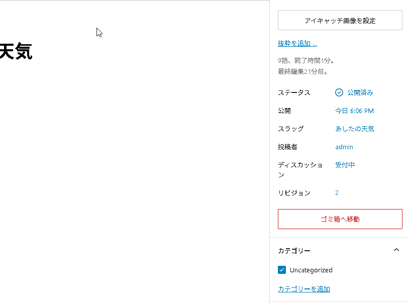
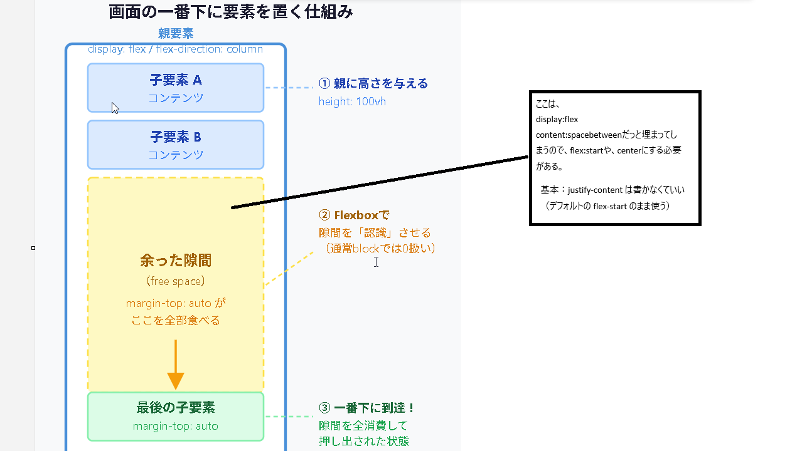
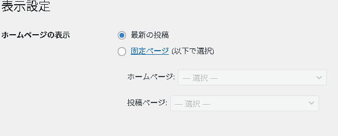
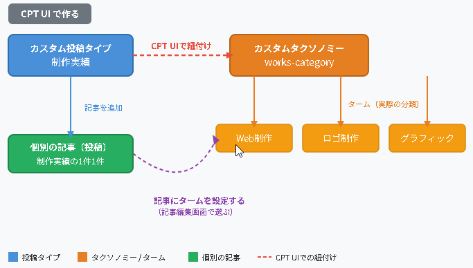
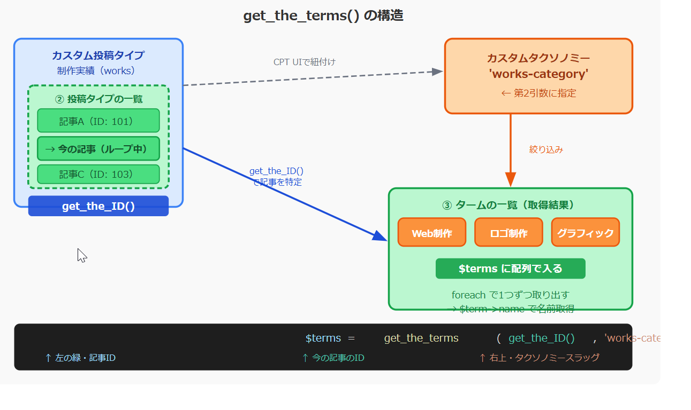
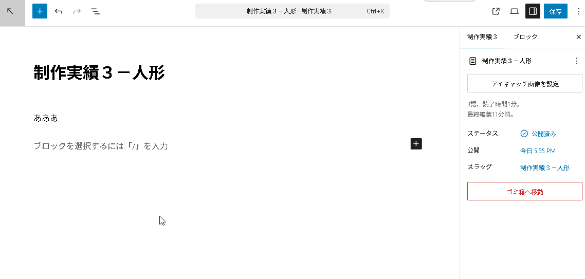
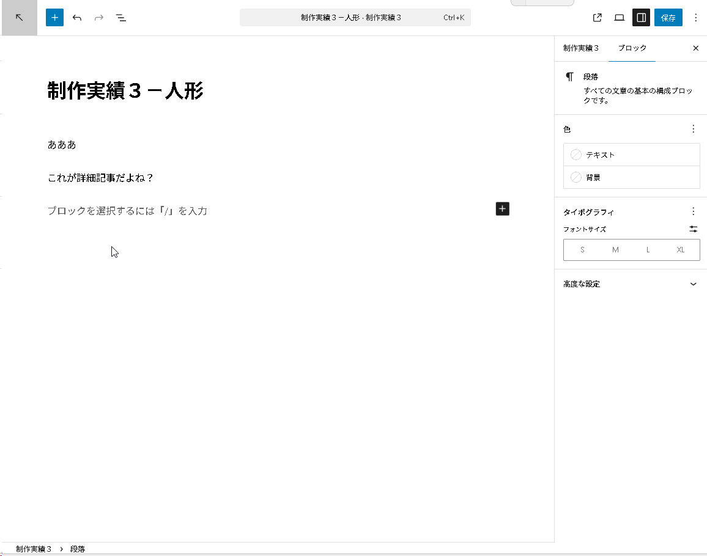

# 📌 `transition` vs `animation` ― CSSアニメーションの使い分け

【結論】
- `transition`：A→B の**直線的な変化**を滑らかにする「演出方法」の設定
- `animation`：A→B→C など**複数ステップ**の変化シナリオを定義

【transition の役割】
変化をどう見せるか（速
度・時間・タイミング）を設定するだけ。変化自体は作らない。

```css
transition: background 0.3s ease;
/* backgroundが変わったとき、0.3秒かけて滑らかに変化させる */
```


【できること・できないこと】

| | できる例 | できない例 |
|---|---|---|
| **transition** | `opacity: 0→1` | `opacity: 1→0→1`（消えて再表示） |
| **animation** | `opacity: 0→1` | ← これも可能 |

【比較表】

| | transition | animation |
|---|---|---|
| **きっかけ** | `:hover` などの状態変化が必要 | 自動再生可能 |
| **経路** | A→B の直線のみ | A→B→C→A など複数ステップOK |
| **役割** | 変化の「演出方法」 | 変化の「シナリオ」 |

【@keyframes で複数ステップを定義する例】
```css
@keyframes blink {
  0%   { opacity: 1; }
  50%  { opacity: 0; } /* 途中で消える */
  100% { opacity: 1; } /* 再表示 */
}
.element {
  animation: blink 1s;
}
```

【覚えるべきポイント】
- `transition` = 変化に「なめらかさ」を加える設定（直線のみ）
- `animation` + `@keyframes` = 複数ステップの変化シナリオを書ける
- 0%→1% の超短区間で「瞬時消去」も表現可能

---

## 📌 `要素.style.transform` でJSからCSSを直接操作できる（CSSプロパティはキャメルケースに変換） HTML

【結論】
JavaScriptから `要素.style.プロパティ名` で、CSSを直接書き換えられる。
CSSのハイフン付きプロパティは、JSではキャメルケースに変換する。

【具体例：ボタンを押すと箱が右に動く】
```html
<div id="box" style="width:100px; height:100px; background:red;"></div>
<button onclick="move()">動かす</button>
```

```js
function move() {
  const box = document.getElementById("box");
  box.style.transform = "translateX(200px)";  // ← 右に200px移動
}
```

【CSSプロパティ → JSでの書き方 対応表】
| CSS | JS（style.〇〇） |
|---|---|
| `transform` | `style.transform` |
| `background-color` | `style.backgroundColor` |
| `font-size` | `style.fontSize` |
| `z-index` | `style.zIndex` |

ルール：ハイフンを消して、次の文字を大文字にする

【補足】
- `style.transform` はインラインスタイルとして適用される（CSS詳細度より強い）
- テンプレートリテラルで動的に値を入れられる：`` style.transform = `translateX(-${値}px)` ``
- CSSクラスの付け外しで制御する方法もあるが、**細かい数値の制御**にはstyle直接操作が便利


## 📌 CSSセレクタ `~` で兄弟選択 → スペースで子孫に降りる（jQueryの nextAll + find と同じ発想） HTML

【結論】
`~`（兄弟セレクタ）で選んだ後、スペースで子孫要素に降りることができる。
jQueryの `.nextAll().find()` と同じ考え方。

【具体例】
```css
/* .open がついたら、後ろの兄弟 .nav の中の .link を全部表示 */
.hamburger.open ~ .nav .link {
  opacity: 1;
}
```

```html
<div class="hamburger open"></div>   ← 起点
<div class="other"></div>            ← スキップ
<nav class="nav">                    ← ~ で兄弟選択
  <a class="link">リンク1</a>        ← スペースで子孫に降りる
  <a class="link">リンク2</a>        ← これも対象
</nav>
```

```js
// jQuery で同じこと
$('.hamburger.open').nextAll('.nav').find('.link')
```

【補足】
- `~` = 後ろの兄弟**全部**（`+` は直後の1つだけ）
- `~` の後にスペースを入れると子孫に降りられる
- jQuery の `nextAll()` + `find()` と対応づけると覚えやすい


## 📌 Flexboxの子要素は min-width: 0 を付けないとはみ出す（デフォルトの min-width: auto が縮小を拒否する） HTML
【日付】2026-03-12


基本は以下の条件時におきる
【条件】
・親要素・display:flex
・子要素　２０％　２０％　３番目のみ「flex　1」
⇁（正常 min-widthあり）
⇁（問題あり min-widthなし）


【どんな時に使う】
flex子要素の中身が親の幅を突き破って出てくる時だけ
min-width: 0 をつける。

普通に収まっている時はつけなくてOK。


つけないイメージ1

【条件】
・親要素・display:flex
・子要素　２０％　２０％　３番目のみ「flex　1」

⇁　画像のサイズによって、３番目のみ大きくなる 


つけないイメージ2


【結論】
Flexboxの子要素はデフォルトで `min-width: auto` が適用されており、中身のテキストや画像の幅より小さくならない。
`min-width: 0` を指定すると「縮んでいいよ」と許可を出せる。
[プレビュー](http://localhost:54321/preview-20260222-172314.html)


- 自分がはみ出すだけでなく、**隣の要素のスペースも奪う**のが本当の怖さ
- テキストが潰れて汚くなるので `overflow: hidden` + `text-overflow: ellipsis` とセットで使う

【具体例：長いテキストと画像の横並び】
```css
/* ❌ ダメな例：テキストが縮まず画像が押し潰される */
.text { flex: 2; }              /* min-width: auto がデフォルト */
.image { flex: 1; }             /* 残りスペースほぼ0になる */

/* ✅ 正しい例 */
.text {
  flex: 2;
  min-width: 0;              /* 縮小を許可 */
  overflow: hidden;           /* はみ出しを隠す */
  text-overflow: ellipsis;    /* 「…」で省略表示 */
  white-space: nowrap;        /* 1行に保つ */
}
.image { flex: 1; }
```

【補足】
- `min-width: auto` = 「中身より小さくならない！」→ はみ出す
- `min-width: 0` = 「小さくなってOK！」→ ちゃんと縮む
- `overflow: hidden` 系は `min-width: 0` とセットで使うのが実践的
- 同じ問題は `flex-direction: column` のとき `min-height: 0` でも起きる


### min-width 0 の活用方法 HTML
### min-width: 0 とは HTML
Flexboxの子要素には「中身（画像や文字）の大きさより小さくならない」というルール（`min-width: auto`）が最初からついています。これのせいで、**親の枠を超えてはみ出してしまう**ことがあります。
`min-width: 0` を書くと、そのブレーキを解除して「枠に合わせて小さくなっていいよ」と指示できます。

### どんな時に使う？ HTML
*   Flexboxで横並びにした要素が、中身のせいで枠からはみ出る時。
*   文字や画像が大きすぎて、隣の要素のスペースを奪って押し潰している時。

### 具体的な書き方 HTML
はみ出したくない子要素に以下のセットを書くのが基本です。

```css
.child {
  min-width: 0;           /* 小さくなる���可を出す */
  overflow: hidden;        /* はみ出した分は見えないようにする */
  text-overflow: ellipsis; /* 文字が長すぎたら「…」にする */
  white-space: nowrap;     /* 文字を折り返さず1行にする */
}
```

### ポイント HTML
*   **普通に収まっている時は書かなくてOK**です。
*   中身のサイズを無視して、親の枠に合わせて強制的に縮めたい時にだけ使う「最後の手段」のようなものです。
## min-height 0 の活用方法 HTML


Flexboxの並びを「縦方向（column）」にしたとき、要素の中身（高さ）が親からはみ出して崩れるのを防ぐために使います。

*   **なぜ必要なのか？**
    *   縦並びのとき、子要素にはデフォルトで `min-height: auto` がかかっています。
    *   これは「中身の高さより小さくならないで！」という命令です。
    *   そのため、中身が長いと親の枠を超えてはみ出してしまいます。

*   **どう解決するか？**
    *   `min-height: 0` を指定することで、「中身が大きくても、親の枠に合わせて縮んでいいよ」と許可を与えます。

*   **セットで使うと便利なもの**
    *   はみ出した部分を隠す：`overflow: hidden;`

*   **具体例（縦並びのカードなど）**
```css
.container {
  display: flex;
  flex-direction: column; /* 縦並びにする */
  height: 300px;
}

.item {
  flex: 1;
  min-height: 0;          /* これを書くと、親の高さに収まるように縮む */
  overflow: hidden;       /* はみ出した分は見えないようにする */
}
```

*   **まとめ**
    *   「横並び（row）」なら `min-width: 0`
    *   「縦並び（column）」なら `min-height: 0`
    *   どちらも「中身が大きすぎて枠が壊れる時」に使う魔法のコードです。


## 📌 CSS maskプロパティはbackgroundと同じ構造（mask-image / size / position / repeat）　左上から右下にかけてカーテン上にアニメーション表示 HTML

[プレビュー](http://localhost:54321/preview-20260312-080035.html)

【結論】
`mask` は要素の「見える・見えない」を制御するプロパティ。
`background` と同じ4つのサブプロパティがあり、同じ感覚で使える。

| mask | background | 役割 |
|---|---|---|
| `mask-image` | `background-image` | 形・模様 |
| `mask-size` | `background-size` | 大きさ |
| `mask-position` | `background-position` | 位置 |
| `mask-repeat` | `background-repeat` | 繰り返し |

- マスクの黒い部分 → 見える
- マスクの透明な部分 → 見えない
- Safari対応のため `-webkit-` 付きも併記する

【具体例：左上から斜めにふわっと現れるマスク】
```css
.diagonal-reveal {
  mask-image: linear-gradient(135deg, black 50%, rgba(0,0,0,0.3) 65%, transparent 80%);
  mask-size: 0% 0%;        /* 最初は見えない */
  mask-position: 0% 0%;    /* 左上から */
  mask-repeat: no-repeat;
}

.diagonal-reveal.is-visible {
  animation: diagonalReveal 3.3s forwards;
}

@keyframes diagonalReveal {
  from { mask-size: 0% 0%; }
  to   { mask-size: 300% 300%; }  /* マスクが広がる → 見えるようになる */
}
```

【補足】
- `linear-gradient` の角度・%の細かい数値は覚えなくてOK。使うときに調整する
- `mask-size: 0%→300%` のアニメーションで「ふわっと現れる」表現ができる
- JSの `IntersectionObserver` でスクロール時に `is-visible` を付けてアニメーション発火

---


## 📌 JSでアロー関数の`this`はwindowになる（e.targetを使え） HTML
【日付】2026-03-12

【結論】
アロー関数 `() => {}` の中で `this` を使うと、イベント対象の要素ではなく**windowオブジェクト**を指す。
イベント対象の要素を取得するには `e.target` を使う。

【具体例：ホバーでアンダーライン】
```js
// ❌ ダメな例（thisがwindowになる）
elem.addEventListener("mouseover", (e) => {
  this.style.textDecoration = "underline";  // エラー！
});

// ✅ 正しい例（e.targetで対象要素を取得）
elem.addEventListener("mouseover", (e) => {
  e.target.style.textDecoration = "underline";
});
```

【補足】
- `function() {}` なら `this` はイベント対象要素を指す
- アロー関数は親スコープの `this` を引き継ぐ（＝大抵window）
- 迷ったら `e.target` を使えば安全

---

## 📌 querySelectorAllで複数要素にイベントをつける（forEachが必要） HTML

【結論】
`querySelectorAll` で取得した複数要素にイベントをつけるには `.forEach()` でループが必要。
`querySelector`（単数）だと1つ目しか取れない。

【具体例：全カードにホバーイベント】
```js
// ❌ 1つしか取れない
const desc = document.querySelector(".case_description");
desc.addEventListener("mouseover", ...);  // 最初の1つだけ

// ✅ 全部に適用
document.querySelectorAll(".case_description").forEach((desc) => {
  desc.addEventListener("mouseover", (e) => {
    e.target.style.textDecoration = "underline";
  });
});
```

【補足】
- `querySelector` → 1つ目だけ返す
- `querySelectorAll` → 全部返す（NodeList）
- NodeListには `.forEach()` が使える

---

## 📌 flex-shrink: 0 はスライダーに必須（カードが縮まないようにする） HTML

【結論】
`flex-shrink: 0` は「親が狭くても縮めるな」という指定。スライダーでカード枚数を制御するには必須。

- デフォルト `flex-shrink: 1` → 親に収まるよう自動で縮む → カードが5枚6枚全部見えちゃう
- `flex-shrink: 0` → 指定幅を維持 → overflow:hidden で4枚だけ表示される

★つまり、widthが５００だとして、width: calc((100% - 6rem) / 4);→「４枚のcardをだしたい」、を正確に計算しても、flex space-betweenする。そうするおと５枚ある場合、自動で500oxに縮める仕様なので、５枚で画面に表示される。

`flex-shrink: 0` は「親が狭くても縮めるな」とい指示で、指定した枚数を画面にいあてはめる。

※以下は実は５枚カードがあるが、４枚だけだすようにしている。


【具体例：4枚カードスライダー】
```css
.case_list {
  overflow: hidden;          /* はみ出た分を隠す */
}

.case_track {
  display: flex;
  gap: 2rem;
  transition: transform 0.5s ease-out;  /* JSでスライド */
}

.case_item {
  width: calc((100% - 6rem) / 4);  /* gap2rem×3を引いて4分割 */
  flex-shrink: 0;                   /* ← これがないと全部縮んで表示される */
}
```


【補足】
- `overflow: hidden` + `flex-shrink: 0` はスライダーのセット
- JSで `translateX` を使ってスライドさせる仕組みと組み合わせる
- `width: calc()` でgap分を引いて計算するのがポイント

---


### flex-shrink: 0ってなに？ HTML
### `flex-shrink: 0` とは？ HTML

「親の枠からはみ出しても、**カードを絶対に縮ませないで元のサイズのままにする**」という命令です。

*   **なぜ必要なのか？**
    *   Flexboxは、子要素が親の枠からはみ出そうとすると、自動的にギュッと縮めて全部を無理やり収めようとする性質（デフォルト値 `flex-shrink: 1`）があるからです。
    *   スライダーを作るとき、この自動的な縮小が邪魔をして、見せたい枚数以上のカードが表示されてしまいます。

*   **`flex-shrink: 0` を使うとどうなる？**
    *   親が狭くなってもカードは縮みません。
    *   はみ出た部分は `overflow: hidden` で隠れるため、意図した枚数だけをきれいに並べて表示��きます。

**コードのポイント**
```css
.card {
  width: calc((100% - 6rem) / 4); /* カードのサイズを計算 */
  flex-shrink: 0;                 /* 「絶対に縮むな」と命令する */
}
```

**まとめ**
*   `flex-shrink: 1`（初期値）：親に合わせるために**縮む**。
*   `flex-shrink: 0`：親の事情を無視して**元のサイズを維持する**。
## ★ アニメーション一覧 HTML

### スクロール・フェードイン HTML

| アニメーション | 概要 | プレビュー |
|---|---|---|
| AOS スクロールアニメーション | スクロールで下から表示・スライド・ズーム等。シンプル〜多機能版4パターン | [▶](http://localhost:54321/preview-20260214-082619.html) |
| フェードイン（最新版） | スクロールで要素が下から上に浮き上がる。一度表示した要素を除外してパフォーマンス向上 | [▶](http://localhost:54321/preview-20260215-112528.html) |
| フェードイン（旧版） | スクロール連動で下から上にfadeIn。jQuery + scroll event | [▶](http://localhost:54321/preview-20260215-111256.html) |
| 後ろに引き込まれる | スクロールで画面内に入った瞬間、scale()で縮小しながら奥へ吸い込まれる | — |
| スクロールで画像を拡大 | PC: 画像拡大 / SP: 縮小。ウィンドウ幅900px基準で切替 | — |

### スライダー・スライドショー HTML

| アニメーション | 概要 | プレビュー |
|---|---|---|
| Swiper 基本 | フェード切替・オートプレイ | [▶](http://localhost:54321/preview-20260216-001945.html) |
| Swiper サムネイル連動 | サムネイルクリックでメイン切替 | [▶](http://localhost:54321/preview-20260216-002046.html) |
| Swiper 自動再生+プログレスバー | 残り時間をバーで表示 | [▶](http://localhost:54321/preview-20260216-002406.html) |
| Swiper 多機能版 | 上記全機能の組み合わせ | [▶](http://localhost:54321/preview-20260216-002459.html) |
| 無限スクロール（すき間あり） | Slick.jsで3枚同時表示。padding+centerPaddingでチラ見せ | — |
| 無限スクロール（すき間なし） | CSSの@keyframesだけで左から右へ無限スクロール。ライブラリ不要 | — |
| スライドショー（同じ場所で切替） | 3枚をposition: absoluteで重ねて、animation-delayでタイミングずらし | — |

### テキスト・文字系 HTML

| アニメーション | 概要 | プレビュー |
|---|---|---|
| clip-path 文字リビール | clip-path inset()で上から下へ文字が現れる。縦書きに最適 | — |
| ShuffleText 文字シャッフル | 文字がランダムに変化→最終テキストへ収束。ハッカー風UI | — |
| 縦書きメニュー 順次表示 | clip-path + writing-mode: vertical-rl。右から左へ順次リビール | — |

### インタラクション（メニュー・開閉） HTML

| アニメーション | 概要 | プレビュー |
|---|---|---|
| アコーディオン（flex対応） | slideToggle()使用。display: blockをflex上書きするコールバック必須 | — |
| アコーディオン ＋－切替 | 開閉に＋/－を同時切替。.text()とtoggleClass()の組み合わせ | — |
| ハンバーガー 左スライドメニュー | 左からナビがスライドイン。pointer-events: noneでオーバーレイ透過 | — |

### 画像・レイアウト HTML

| アニメーション | 概要 | プレビュー |
|---|---|---|
| 画像ギャラリー（小→大切替） | サムネクリックで大画像切替。attr("src")で画像パス変更 | — |
| 画像を階段式に２列配置 | nth-child(odd/even)で左右交互。text-align制御 | — |
| 動画を画面に配置 | videoタグのautoplay/muted/playsinline属性。object-fitでアスペクト比維持 | — |
| パララックス | data-speed属性でスクロール速度を要素ごとに制御。背景固定+手前スクロール | [▶](./その他/00_サンプルソース/★パララックス.html) |

### 視覚効果 HTML

| アニメーション | 概要 | プレビュー |
|---|---|---|
| シャボン玉アニメーション | background-positionをアニメーションで移動。GIFが画面内を落下する演出 | — |
| 吹き出し・会話バルーン | ::beforeで三角形。IntersectionObserverでscale(0.1)→scale(1)の膨張アニメ | [▶](http://localhost:54321/preview-20260215-120351.html) |
| ぼかし・立体など各種 | box-shadow: insetで内側ぼかし。border-bottomで立体感など | — |

---

## 📌 スキル: `/mockup` - スクショからSVG設計図を生成する HTML

【結論】
`/mockup` にスクリーンショットを渡すと、CSS配置情報をアノテーションしたSVG設計図を生成してくれる。HTMLを書く前に構造を整理するために使う。

【具体例】
```
/mockup → 「スクリーンショットを渡してください」
→ スクショを渡す
→ mockup_01_concept.svg が生成される
```

【補足】
- ファイル名は連番: `mockup_01_xxx.svg`（既存ファイルを確認して番号を提案してくれる）
- 色コード: 橙(#ff8800)=relative / 青(#0055ff)=absolute / 緑(#007722)=flex/grid
- 装飾写真はすべてabsolute、通常フローテキスト + absolute写真のシンプル構成が基本
- コメント内に `--` を書くとXMLエラーになるので注意

---

## 📌 HTML ハンバーガーメニューは `<button>` タグを使う HTML

【結論】
クリックして何かを「実行する」要素は `<button>`。`<div>` でも動くが `<button>` にする理由がある。

【具体例】
```html
<!-- ❌ よくある間違い -->
<div id="hamburger_btn" class="hamburger_menu">
  <span class="bar"></span>
</div>

<!-- ✅ 正しい -->
<button type="button" id="hamburger_btn" class="hamburger_menu" aria-label="メニューを開く">
  <span class="bar"></span>
</button>
```

```css
/* button のデフォルトスタイルをリセット */
.hamburger_menu {
  padding: 0;
  font: inherit;
  background-color: transparent;
  border: none; /* 不要なら */
  cursor: pointer;
}
```

【補足】
- `<a>` → 遷移するもの（リンク）
- `<button>` → クリックして何かを実行するもの（ハンバーガー・送信など）
- `<div>` でも `cursor: pointer` は付けられるが、キーボード操作・スクリーンリーダー対応ができない
- `type="button"` を付けないと `form` の中でsubmitとして動くことがあるので明示する

---


### buttonタグに遷移先設定できるの？ HTML
いいえ、buttonタグ自体には遷移先を設定する属性（hrefなど）はありません。遷移させたい場合は、<a>タグを使用するか、JavaScriptでクリックイベントを検知して location.href を書き換える必要があります。

/* ✨

### button タグじゃないとできないこと？ HTML
`button` タグを使うことで、以下のことができるようになります。

* **キーボードだけで操作できる**
  * `Tab` キーでフォーカスが当たり、`Enter` や `Space` キーでクリックと同じ動きができます（`div` ではできません）。
* **「ここがボタンであること」を機械に伝えられる**
  * スクリーンリーダー（目の不自由な人が使う読み上げソフト）が、「これはボタンです」と自動で伝えてくれます。
* **ブラウザが勝手に便利機能をつけてくれる**
  * 押した時の反応や、操作のしやすさがブラウザ側で自動的に調整されます。
* **不用意な送信を防げる**
  * `type="button"` と書くことで、フォームの中にあっても、勝手に送信ボタンとして動くのを防げます。

```html
<!-- buttonならキーボード操作も標準対応 -->
<button type="button" onclick="alert('実行！')">
  クリックしてね
</button>
```

### ハンバーガーメニューの作り方 HTML
### ハンバーガーメニューの作り方 HTML

#### 1. HTMLの作成
クリックしてメニューを開閉する役割なので、必ず `<button>` タグを使います。

```html
<button type="button" id="hamburger_btn" aria-label="メニューを開く">
  <span class="bar"></span>
  <span class="bar"></span>
  <span class="bar"></span>
</button>

<!-- 開いた時に表示されるメニュー -->
<nav id="menu">
  <ul>
    <li><a href="#">メニュー1</a></li>
    <li><a href="#">メニュー2</a></li>
  </ul>
</nav>
```

#### 2. CSSで見た目を整える
`button` の標準デザイン（枠線など）をリセットし、メニューの動きを作ります。

```css
/* ボタンの初期設定を消す */
#hamburger_btn {
  background: none;
  border: none;
  cursor: pointer;
}

/* メニューの表示・非表示 */
#menu {
  display: none; /* 最初は隠す */
}

#menu.is-active {
  display: block; /* クラスがついたら表示する */
}
```

#### 3. JavaScriptで動きをつける
ボタンを押した時に、メニューに「表示するクラス（is-active）」を付け外しします。

```javascript
const btn = document.getElementById('hamburger_btn');
const menu = document.getElementById('menu');

btn.addEventListener('click', () => {
  // メニューの表示・非表示を切り替える
  menu.classList.toggle('is-active');
  
  // ボタンの見た目（アクセシビリティ対応）を更新
  const isExpanded = btn.getAttribute('aria-expanded') === 'true';
  btn.setAttribute('aria-expanded', !isExpanded);
});
```

#### なぜ `<button>` を使うのか
* **キーボード操作に対応できる**: `Tab`キーで移動し、`Enter`キーでメニューを開閉できるようになります。
* **機械に伝わる**: 目が見えない人向けの読み上げソフトなどが、「これはボタンである」と正しく認識してくれます。
* **誤作動を防ぐ**: `type="button"`と書くことで、フォームの送信ボタンとして誤って動くのを防げます。
# buttonタグで遷移させる具体例

## 1. aタグを使う方法��推奨） HTML
<a href="https://example.com">
  <button type="button">ページへ移動</button>
</a>

## 2. JavaScriptを使う方法 HTML
<button type="button" onclick="location.href='https://example.com'">
  ページへ移動
</button>

## 3. formタグを使う方法 HTML
<form action="https://example.com" method="get">
  <button type="submit">ページへ移動</button>
</form>

**注意点:**
- 単純なリンクなら`<a>`タグの方が適切
- buttonは主にフォーム送信やJavaScript処理用
*/


## 📌 CSS 親に transform（アニメーション含む）があると position: fixed が壊れる HTML

【結論】
`position: fixed` の要素は、祖先に `transform` が適用されている要素があると、viewportではなくその要素を基準に配置される。
アニメーションで `transform` を使い `forwards` で状態を保持している場合も同様。

【具体例】
```css
/* ❌ 壊れるパターン */
.header_nav {
  animation: dropDown 1.5s forwards; /* transform: translateY() を使用 */
}
.hamburger_menu {
  position: fixed; /* ← header_nav が基準になってしまう */
}
```

```css
/* ✅ 正しいパターン：transformのない親の直下に置く */
.header_inner {
  position: relative; /* transformなし */
}
.hamburger_menu {
  position: fixed; /* ← viewportが基準になる ✅ */
  animation: dropDown 1.5s forwards; /* 個別にアニメを付与 */
}
```

```html
<!-- ✅ 構造 -->
<div class="header_inner">
  <nav class="header_nav">         <!-- transformアニメあり -->
    <div class="header_nav_list">...</div>
  </nav>
  <!-- fixedにしたい要素はnavの外に出す -->
  <div class="hamburger_menu">...</div>
</div>
```

【補足】
- `transform` を持つ祖先要素は「containing block」になる（viewportの代わり）
- `animation: ... forwards` で終了後もtransformが残り続けるので注意
- `transform: translateY(0)` のゼロ移動でも同様に壊れる
- 解決策：固定したい要素をtransformのない祖先の直下に移動し、個別にアニメを付与する

---

## 📌 CSS Flexbox で要素内を中央配置する鉄板パターン HTML

【結論】
要素の中身を縦横中央に配置したいときは、以下3つを親要素に書けばOK。

- `display: flex` → 自分をflex containerにする
- `align-items: center` → 子を縦中央に
- `justify-content: center` → 子を横中央に

書く場所は**親**、効果が出るのは**子**（テキストノードも含む）。

【具体例】
```css
.inquiry_link {
  display: flex;
  align-items: center;    /* 縦中央 */
  justify-content: center;/* 横中央 */
  height: 50px;           /* ← 高さがないと縦中央の効果が見えない */
}
```

```html
<a class="inquiry_link" href="#">
  お問い合わせ  ← これが「子」として中央配置される
</a>
```

【補足】
- ボタン・カード・ヘッダーロゴ・モーダルなど幅広く使える
- `height` or `min-height` がないと縦中央が効いてるか見えない
- 上位の要素（親・祖先）で高さが決まっている場合は `height: 100%` を指定すれば親の高さを引き継げる
- 1つの要素が「外から見てblock」「内から見てflex container」の2役を同時に持てる

---

## テスト問題 HTML

これはテストです

---

## 📌 jQuery の `$(function(){})` - HTMLが読み込まれた後に実行されるルール HTML

【結論】
jQueryでは `$(function() { ... })` の中にコードを書く。
これは「HTMLの読み込みが終わったら実行して」という**お約束のルール**。

- `function` = 命令をまとめた箱（呼ばれたら動く。定義しただけでは動かない）
- `$(function(){})` = HTMLの構造が読み込まれた後、中の命令を自動で実行する

【具体例：ボタンを押したらアラートを出す】
```html
<script src="https://code.jquery.com/jquery-3.7.1.min.js"></script>
```
```js
$(function() {
  // ← ここに書いた命令は、HTMLが読み込まれた後に実行される

  $("#btn").on("click", function() {
    alert("ボタンが押されました");
  });
});
```

【タイミングの比較】
| 書き方 | 実行タイミング |
|---|---|
| `$(function(){})` | HTMLの構造（DOM）が読み込まれたら実行（画像より速い） |
| `window.onload` | 画像・CSS含む**全リソース**が読み込まれたら実行（遅い） |
| `<body>`閉じタグ直前にscriptを書く | HTMLの最後に書けばjQuery不要で同等 |

【補足】

- HTMLより先にJSが動くと「要素がまだ存在しない」のでエラー → だから `$(function(){})` で包む
- jQuery の `$` はjQuery本体の別名（エイリアス）。`jQuery(function(){})` と書いても同じ

---

## 📌 jQuery の `.on("click", function(){})` はイベントリスナー HTML

【結論】
「この要素がクリックされたら、この命令を実行して」と**事前に登録しておく**仕組み。
登録するだけで、クリックされるまで実行されない。

【具体例】
```js
$(".gallery_img").on("click", function() {
  // クリックされたときだけ実行される
  const imgSrc = $(this).attr("src");   // $(this) = クリックされた要素自身
  $(".gallery_main").attr("src", imgSrc);
});
```

【jQueryとJSの対応】
| jQuery | 素のJS | 意味 |
|---|---|---|
| `$(".gallery_img")` | `querySelectorAll(".gallery_img")` | 要素を選ぶ |
| `.on("click", ...)` | `.addEventListener("click", ...)` | クリック時の処理を登録 |
| `$(this)` | `e.target` | クリックされた要素自身 |

【補足】
- jQueryは `querySelectorAll` + `forEach` + `addEventListener` を1行で書ける短縮版
- `"click"` の部分を変えると他のイベントにも使える（`"mouseover"` `"change"` など）
- `$(this)` は `function(){}` の中でのみ使える（アロー関数 `()=>{}` では使えない）

---


### ul li メニューの作り方 HTML

メニューやリストを作るときは、ul と li を使います。navタグはメインメニューのときだけ使用します。

```html
<nav class="header_nav">
  <ul class="header_nav_list">
    <li class="header_nav_item">
      <a href="#menu" class="header_nav_link">MENU</a>
    </li>
    <li class="header_nav_item">
      <a href="#about" class="header_nav_link">ABOUT</a>
    </li>
    <li class="header_nav_item">
      <a href="#location" class="header_nav_link">LOCATION</a>
    </li>
  </ul>
</nav>
```

横並びメニューの基本スタイル

```css
.header_nav_list {
  display: flex;
  list-style: none;
  gap: 3rem;
}

.header_nav_link {
  display: block;
  text-decoration: none;
  color: #333;
  font-size: 1.4rem;
  padding: 1rem;
}
```

`display: block` をaタグに指定することで、paddingが効くようになり、クリック範囲が広がります。

縦書きで横並びにする場合

```html
<ul class="footer_location">
  <li class="nav-item">
    <a href="#">０３｜ＸＸＸＸ｜ＸＸＸＸ</a>
  </li>
  <li class="nav-item">
    <a href="#">〒１０６｜００３２　東京都港区六本木５丁目×××××</a>
  </li>
</ul>
```

```css
.footer_location {
  display: flex;
  writing-mode: vertical-rl;
  flex-direction: column;
  gap: 3rem;
}

.nav-item {
  writing-mode: vertical-rl;
}
```

`writing-mode: vertical-rl` で縦書きにし、`flex-direction: column` で横に並べます。これが縦書きで横並びにする時の呪文です。

縦に並べる場合（文字は横のまま）

```css
.header_nav_list {
  display: flex;
  flex-direction: column;
  list-style: none;
  gap: 2rem;
}

.header_nav_link {
  display: block;
  writing-mode: vertical-rl;
  text-decoration: none;
  padding: 1rem 0;
}
```

この場合は、リンクそれぞれが縦書きになって、縦に積み重なります。


<svg width="300" height="100" xmlns="http://www.w3.org/2000/svg">
  <circle cx="30" cy="50" r="20" fill="#f9e2af">
    <animate attributeName="cx" from="30" to="270" dur="2s" repeatCount="indefinite" direction="alternate"/>
  </circle>
</svg>


▢ 　背景画像は PC と SP で切り替え（`<picture>`タグ or メディア切り替えたい場合は以下のように指定する。
background-image: url("../img/mainvisual-pc.jpg");をするときは
普段とちがって ima src と時と違い　../一度上のフォルダに移動する必要がある

▢ 　ＰＣとスマホで画像を変える場合は、HTML でＳＲＣを指定せずスマホ版で以下のように設定する

<header class="header_area">

```css

★この場合、通常に画像がひろがる
.header_area {
background-image: url("../img/mainvisual-pc.jpg");
background-size: cover; /* 要素いっぱいに広げる */
background-position: center; /* 中央基準で表示 */
}

★　これで設定すると赤玉が画像よりも多くみえる（パディングは内部の背景を広げるためにある。つまり水玉の領域がひろがる）
#school_overview {
  padding: 5rem 0 10rem 0;
  /* 赤い水玉背景（radial-gradientで作る） */
  background-image: url("../img/bg.gif");
  background-size: 75rem 75rem; /* ✅ 固定サイズ */
  background-repeat: repeat; /* ✅ 繰り返し */

  margin-bottom: 10rem;
}
```

▢ ポジションアブソリュートの使い方親に relative、子に absolute を設定します。
親（position: relative）└ 子（position: absolute）← 親を基準に配置される
★ 同じ階層でもできる上は間違い → かならず重ねたい要素をリラティブにする。

HTML 構造-------------------------------------------------

<header class="header_area"> <!-- 親 -->
  <nav>
    <!-- ナビゲーション -->
  </nav>
  ★親のメインヘッダに対して、子階層にセットする
  <div class="header_online">  <!-- 子：これを左下に配置したい -->
    <a href="https://example.com" target="_blank" rel="noopener noreferrer">
      オンラインストアを見る
    </a>
  </div>
</header>
---
ポジションリラティブは子要素に書く必要ある。
.header*area {
position: relative; /* ← これがないと absolute が効かない */
}
/* 子：左下に配置 */
.header*online {
position: absolute; /* 親を基準に配置 */
left: 20px; /* 左から 20px */
bottom: 20px; /* 下から 20px */
}
HTML 構造-------------------------------------------------

▢ 　たてがきは writing-mode: vertical-rl;これは親要素ではなく a タグにかく。

▢ 　 prettier できずいたらすぐ、コパイロットにいってタグをなおしてもらう
▢ 　フレックスは、上にかかれたものから左から順番に記載されることをわすれない。
▢ 　 flex 子フレックスで、width を指定すると、flex1 としているより優先されため、基本、サイズを指定する必要がない場合は flex1 にきめておくと楽。


### 画面で設定したカテゴリを取得するロジックは、 HTML
画面で設定したカテゴリを取得するロジックは、以下の手順で行います。

*   **要素を選ぶ**：`$(".header_nav_link")` でメニューのリンク先をすべて選択する。
*   **イベントを登録**：`.on("click", function(){ ... })` を使い、クリックされた時の命令を準備する。
*   **値を取得する**：クリックされた要素自身を指す `$(this)` を使い、その中身（テキストや属性など）を取り出す。

```javascript
// 例：クリックされたリンクの文字を取得するロジック
$(".header_nav_link").on("click", function() {
  // $(this) はクリックされた特定のリンクのこと
  const category = $(this).text(); 
  console.log(category); // 取得したカテゴリを表示
});
```

*   **ポイン���**
    *   `$(this).text()`：タグで挟まれた文字（例：MENU）を取得します。
    *   `$(this).attr("href")`：リンク先（例：#menu）を取得したい場合に使います。
## 💡 重要ポイント HTML
```
flex: 1 → 「親の中で等分する魔法」
width → 「この幅に固定！」という命令
両方書くと flex: 1 が勝つ！（flex: 1 は flex-basis: 0 を含むため width より優先され、flex-grow: 1 により利用可能なスペースを埋めるように伸縮する）
```
ーーーーーーーーーーーーーーーーーーーーーーーーーーーーーーーーーー
自分でデザインカンプ
▢ 画面をよこにみて、absolute の回数を減らす。(理由、
★Absolute を減らして、流れ（横方向）で作る理由
壊れないから（一番大事）
Absolute は「画鋲で止める」ようなものです。
画面の大きさが変わると、止めた場所がズレてレイアウトが崩壊します。
流れで作れば、画面に合わせて柔軟に動いてくれます。
計算しなくていいから vertical-rl（縦書きモード）を使えば、
h1（ロゴ）の隣に nav（メニュー）が自動的に並びます。
座標を計算して配置する手間がゼロになります。
結論： 「頑張って配置する」のではなく、「勝手に並ぶようにする」のがプロの書き方です。)
header
h1
nav


▢ 　クラスを直接指定する方法タグ名で省略せず　ネストされたクラス名もかならずかく
a タグにもクラス名をかっく
<div class="online_absolute">
  <a href="#" target="_blank" class="online_link">オンラインストアを見る</a>
</div>
▢ 全体像を把握してまとめてパディングをしかける
▢ 　ぜんたいのメインカラーがあれば最初に BODY でいろをぬっておくそうすると ection のエリアでマージンボトムしたときも色がつく
▢ 更新した時途中からブラウザで表示したい場合飛ぶ　リンクする　遷移する
・URL の最後に、　 about をつける　 #移動　#リロード #遷移 #セクション
http://localhost:5500/#about
・HTML のセクションで ID をふる
<section id="about" class="concept_area">
1. 大事(「１」が本命できなかった「２」をする)`
「１」直った原因（推測）
settings.json に fullReload: true を追加した
CSS 保存時も完全リロードするようになった
window.addEventListener("load")が発火するようになった
Live Server を再起動した
設定が反映されるには再起動が必要
古いキャッシュがクリアされた
VSCode を再起動した
拡張機能が正しく読み込まれた
設定ファイルが確実に反映された
「２」
1. 手順：CSS 保存時もリロードさせる設定
   VS Code で Ctrl + , (カンマ) を押して設定を開く。
上の検索バーに live server full と入力する。
出てきた項目の Live Server > Settings: Full Reload にチェックを入れる（オンにする）。
3. javaScript に以下を追加する(これは多分関係ない)
```JavaScript
window.addEventListener('load', () => {
    setTimeout(() => {
        window.location.hash = "";
        window.location.hash = "footer";
    }, 100);
});
```
▢flex で指定した画像に absolute で文字を配置しようとすると、top bottom などと指定した位置と、表示があわなくなる
Flex だと画像の高さが隣のタイトルに合わせられてしまうので、
align-items: flex-start をかけて高さを画像に合わせる必要がある。
▢ うっかりミスサイズが違う��思ったら、Style CSS でフォントサイズを 1400px に指定しているのを忘れていた。
※設計者は、 「ヘッダーは文字が流れるだけだから、縦書き設定だけで十分」
「商品はスマホでレイアウトをガラッと変えたいし、画像との位置関係を調整したいから、Flexbox という強力なツールを使おう」
と判断して使い分けた、ということです。
▢ 　インライン要素は、display blockブロック要素にすることによって、padding、border、width、height が
すべて正確に計算されるようになる。
よく使うインライン要素
<a>: リンク
<span>: テキストのグループ化（装飾用）
<strong> / <b>: 太字
<em> / <i>: 斜体
<label>: フォームのラベル
<small>: 注釈や細目
▢ 　パディングはあくまで中身の文字と文字というか、要素と外の枠ボックスの距離を取るものである。
もしも自分で分からなくなったら、ボーダーで指定するとイメージが開く。
ボーダーを指定せずに、パディングだけして色だけ指定すると、
枠がない色を作ることができる。

## 🏗 HTML タグの設計図（使い分け）まとめ HTML

### 1. ロゴと見出し HTML

- **h1:** サイトロゴに使用。画像を入れる場合は `h1` で囲む。
  ```html
  <h1 class="logo"></h1>
  ```
- **h2:** セクションのタイトル。日英併記などは `span` を使い、見出しタグの中にインライン要素として配置する。
  ```html
  <h2 class="news_title">
    <span class="title_news">News</span>
    <span class="title_notice">お知らせ</span>
  </h2>
  ```

### 2. 日付とお知らせ / メニュー (dl, dt, dd) HTML

- **用途:** 「項目名（日付・料理名）」と「値（内容・価格）」がセットの時。
- **暗記:** 「dl」だけ打てばサジェストされるので、それを活用する。
  ```html
  <dl class="news_list">
    <div class="news_item">
      <!-- divで囲むとレイアウトしやすい -->
      <dt>2021.01.01</dt>
      <dd>タイトルタイトル...</dd>
    </div>
  </dl>
  ```

### 3. 見出しと詳細説明 (h2 + p) HTML

- **原則:** 見出しは `h2`、説明の文章は `p`。
- **禁止:** `h2` の中に `div` や `p` などを入れることは文法上禁止（インライン要素のみ OK）。
- **構造:** まとめる場合は全体を `div` で囲む。
  ```html
  <div class="fashion_wrapper">
    <h2 class="fashion_title">Fashion & Style</h2>
    <p class="fashion_description">テキストテキスト...</p>
  </div>
  ```

### 4. ナビゲーション (nav) HTML

- メインメニューの場合だけ `nav` を使用する。通常 `nav > ul > li > a` の構造にする。

---

▢ 　 AI にお願いするとき、サンプル SVG


▢GitHub に支持する才能、テンプレート

1. スクリーショットを保存して、立ち上げてお

セクションの画像: 1 画面に収まる範囲のスクリーンショット。
素材（アセット）: 使用する画像ファイル名（例：img/ice-cream.jpg）。
構造の指定: 「ここは dl/dt/dd を使う」「ここは h2 と span の構成」などの指示。


※「軸が逆転して、混乱するのは」
writing-mode: vertical-rl 文字が流れる方向

親が縦書き（NG 例）:
flex directon row（本来「横」） → 「上から下」に並ぶようになる。
column（本来「縦」） → 「右から左」に並ぶようになる。
これが「軸が回転して予測不能になる」原因です。


▢Position: absolute;をする場合、

前 ■ position: absolute の親子関係とサイズの一致
画像を基準にテキストを配置したい場合、画像そのものではなく、画像とテキストを包む「親ボックス」を基準点（relative）にするのが鉄則です。

なお、まんなかに記載したい場合は

```css
.test{
position:absolute
left: 0;
right: 0;

margin: 0 auto;

top: 50%;
transform: translateY(-50%); /* ★下に着すぎたものを半分↑に戻す */
}
```

## 親要素に relative をかける理由（画像へのテキスト重ね） HTML

1. 構造の考え方
   親ボックス（.concept_card）は、中にある画像（.concept_img）のサイズに合わせて自動的に伸縮します。そのため、「親の枠」と「画像の枠」は基本的に一致します。

メリット: 画像に直接 absolute をかける必要がなく、レイアウトが崩れにくい。
ポイント: relative は「コンセプトイメージ」ではなく「親のカード」に実施する。

2. 実装コード
   <!-- 親：ここで relative を実施する（基準点） -->
   <div class="concept_card">
     
     <!-- 子：親を基準に自由に移動する -->
     <p class="concept_text">テキストテキスト</p>
   </div>

```css
.concept_card {
position: relative; /_ 親：基準点 _/
}

.concept_text {
width: 35rem;
height: 14rem;
position: absolute; /_ 子：親を基準に浮く _/
bottom: 2rem;
left: 2rem;
}

```

3. なぜサイズが一致するのか
   親要素が「ピッタリ重なっている」ように見えるのは、親要素が子要素（画像）のサイズに合わせて伸縮する性質を持っているからです。

この性質を利用することで

、`画像からの距離を測るのではなく、親ボックスからの距離を指定するだけで、意図した位置（左下など）にテキストを正確に配置できます。`


▢ 　大事　暗記　パーセント(%)とレム(rem)の使い分け
使い分けの目安：

文字サイズや余白: rem（画面に合わせて自動拡大縮小）
レイアウトの横幅（カラム）: %（親要素の中での占有率を決定）


▢ 　問題：仕様書で「幅は % 指定」と言われたけど、% にするとデザインカンプとサイズがズレる。

理由：
% は「親の箱の中で何割を占めるか」を決めるだけで、「画像の大きさ」そのものは制御できないから。

解決策：
% と max-width（rem）を同時に指定する。

```css
.concept_card {
  /* 親の中での占有率（仕様書の指示） */
  width: 65%;

  /* 画像の最大サイズをロック（カンプ通りのサイズ） */
  max-width: 63rem;
}
```


「細かい数字」ではなく「見た目のバランス」を守るのがレスポンシブの鉄則です。

## 分かった一番重要なこと　暗記 HTML

まず、
width 100％　
max-width: 140rem
max-width を指定する理由としては
前段のスタイル.css とかで

```css
html {
  font-size: calc(10 / 1400 * 100vw);
  /* 画面幅1280pxで10px*/
}
```

これがないことを想定している。
なぜならば、一緒にサイズが伸びてしまうからあまり意味がない。

もしもスタイルＣＳＳで上記の記述があるならば、以下をしていけばいい。

```css
html {
  /* 10px と 計算値のうち、小さい方が採用されます */
  font-size: min(10px, calc(10 / 1400 * 100vw));
}
```

## ▢ 拡張ツールの見方　暗記 HTML
紫・・・その紫色の部分は、justify-content: center; によって生じている Flexbox の余白（整列スペース） です。


▢ 　 📝 縦書きレイアウトの失敗メモ　暗記
`Flexbox` を組み合わせる際の落とし穴」**についての非常に重要なメモです。


【失敗の原因：軸の回転】

`現象`: 親要素に writing-mode: vertical-rl を指定すると、Flexboxの「主軸」と「交差軸」が90度回転します。
`結果`: flex-direction: row なのに要素が縦に並んだり、justify-content（横方向のはず）が上下の制御になったりして、配置の計算が予測不能になります。


【正解の鉄則：役割分担】
`親要素`: 配置（Flexbox）を担当。**横書き（デフォルト）**のままにしておくことで、使い慣れたFlexboxのルールで要素を並べられます。
`子要素`: 文字の向き（writing-mode）を担当。子だけに縦書きを適用することで、親の配置ルールを壊さずに文字だけを縦に流せます。
`メリット`: Flexboxが本来の動きをするため、align-items や gap での微調整が直感的かつ確実に行えます。


```css
/* 親：配置（横並び）だけを行う */
.news_area {
  display: flex;
  flex-direction: row-reverse; /* 右から左へ並べる（縦書きの並び順） */
}

/* 子：中身の文字だけを縦書きにする */
.news_title,
.news_wrapper {
  writing-mode: vertical-rl;
}
```
⇀「親は箱を並べる係、子は文字の向きを決める係」と役割を完全に分けるのが、レイアウトを崩さない最大のコツです。

▢ 　うっかりミス子要素が一つだけなのに‘フレックス‘をかけてしまった。

## ▢ 　手書きの図形の書き方 HTML
手書きメモの形式

・画面に情報を混在させず、画面下に「クラス名」を記載し「プロパティ」を書くスタイルに統一します。

## ▢ 　パディング のかけかた HTML
覚え方
（余白の目的）　　　　（使うもの全体に）
共通の余白　　　　　　親の padding
子ごとに違う余白　　　子の margin

今回は「他と合わせる」より「実際の構造に合わせる」が優先二重管理を避けた方が、3 ヶ月後の自分が楽です！

以下の場合は、右と下だけパディングをつける。
それ以外は、子でマージンで別々に管理する。


## 📌 writing-mode: vertical-rl は「縦書き」と「右スタート」が必ずセット → 右に寄せるだけなら flex を使う HTML

【日付】2026-03-26

【結論】
`writing-mode: vertical-rl` は2つの効果が同時に起きる。縦書きにしたいときだけ使う。
右に寄せたいだけなら flex の `justify-content: flex-end` か `margin-left: auto` を使う。

【具体例】
```css
/* ① 縦書き＋右スタートにしたい（writing-mode使用） */
.header_area {
  writing-mode: vertical-rl; /* 縦書き + 右から左へ流れる */
  width: 100%;               /* 全幅がないと右に寄らない！ */
  height: 100vh;
}

/* ② 右に寄せるだけ（縦書きなし） */
.header_area {
  display: flex;
  justify-content: flex-end; /* 子要素を右寄せ */
}

/* ③ 右に寄せるだけ（absolute版） */
.header_area {
  position: relative;
}
.header_inner {
  position: absolute;
  right: 0;
  top: 0;
}
```

【補足】
- `rl` = right to left（右から左）。必ず縦書きとセットで動く
- ⚠ 間違えやすい：`width: 100%` がないと右に寄らず左に出てしまう
- `display: flex` は子要素が1つでも使う。数ではなく「配置をコントロールしたいとき」に使うもの
- 💡 つまり：縦書きデザイン → `writing-mode: vertical-rl`、右寄せだけ → `flex`

### writing-mode: vertical-rl を書くと縦書き以外にも4つ変化する + 書く場所は最下位クラスに HTML

【日付】2026-03-26

【結論】
`writing-mode: vertical-rl` は縦書き以外にも軸が90度回転するため、flex・width/height・margin の動作が全部変わる。
書く場所は「縦書きにしたい一番上のクラス」に1回だけ。子孫全員に伝播するので上位に書くと崩れる。

【縦書き以外に起きる4つの変化】
| 変化 | 通常 | vertical-rl |
|---|---|---|
| flex の row | 横並び | 縦並びになる |
| width / height | 横 / 縦 | 縦 / 横（入れ替わる） |
| margin-top | 上の余白 | 左の余白になる |
| 英数字 | 正立 | 90度横倒しになる |

【書く場所ルール】
```
❌ body / main など上位に書く → 全体が縦書きになって崩れる

✅ 縦書きにしたいセクションの親クラスに1回だけ書く
.news_list {
  writing-mode: vertical-rl; ← ここだけ
}
/* 外側は一切影響なし */
```

【補足】
- ⚠ 間違えやすい：上位に書くと子孫全員（width/height/flexまで）が回転して大崩れする
- 英数字の横倒しは `text-orientation: mixed` で調整できる
- 💡 つまり：「縦書きを閉じ込めたい場所の親クラス」に1つだけ書く

## ▢ 　うっかりミス HTML
見た目が、自分の想定と違うと思った、デザインカンプ 1400px に対して、wrapper でサイズを max-with1200 にしていた。

-----------------------------↑ 上記追記済み　 GitHub インストラクションに

## ▢ メディアクエリ HTML
/_ @media screen and (max-width: 375px) {
_/

## ▢ git ★github ルールに追加する必要なし HTML
1. git の紐づけ

```
git init
git add .
git commit -m "first commit"

git remote add origin https://github.com/あなた/リポジトリ.git


git branch -M main
git push -u origin main

```


2. 最新情報を取得して、強制的に上書き
   git fetch origin
   git reset --hard origin/main

4. コンフリクト

1. 変更マージの下にある。ところでコンフリクトをしている。

もし、クリックして、コンフリクトを解消する。
・カラーのあるところの上に両方マージするみたいな文字がでるのでそれをクリック

・その後、変更マージの右側を＋ボタンをする。

・コミット、プッシュ


## ▢ 　以下のようにして　左右に画像と、その中にテキストを浮かびあがらせるこができる HTML


画像へのテキストオーバーレイ構造
`仕組みの解説`
⇀ 画像とその上に表示したいテキストグループを、1つの「親要素（.img_item）」の中に同居させ、CSSで重ね合わせるレイアウトの手法です。

`各要素の役割`

親要素 (.img_item)
⇀ 重なり合う要素の「基準点（枠）」になります。CSSで position: relative を指定します。

画像 (.newspaper_img)
⇀ 土台となるコンテンツです。

重ねる要素 (.img_overlay)
⇀ 画像の上に浮かせる「膜」のような層です。CSSで position: absolute を指定することで、画像の範囲内の自由な位置（左下や中央など）に配置できます。

`この構造にするメリット`
⇀ 1つのセットとして完結しているため、このセットを .img_container 内でFlexboxなどを使って横並びにしたり、数を増やしたりするのが非常に簡単になります。


```css
/* 実装例のイメージ */
.img_item {
  position: relative; /* 基準にする */
}
.img_overlay {
  position: absolute; /* 親を基準に浮かせる */
  bottom: 0;
  left: 0;
  background: rgba(0,0,0,0.5); /* 背景を半透明にすることが多い */
}
```

## position: absolute で中央配置する方法 HTML

必要な 3 つの要素
css.overlay {
position: absolute;
left: 0; /_ 1. 基準の左端 _/
`right: 0;          /* 2. 基準の右端 */`
`width: 30rem;      /* 3. 自分の幅 */`
margin: 0 auto; /_ 4. 余りを均等に _/
}``
なぜ全部必要？
要素役割 left: 0; right: 0;「親の左端〜右端が基準」と伝える width 自分の幅を決める margin: 0 auto;余った幅を左右均等に分ける
イメージ図
親要素（position: relative）
┌─────────────────────────────────┐
│← left:0 right:0 →│
│ │
│ auto │ 30rem │ auto │
│ 余白 │ 要素 │ 余白 │
└─────────────────────────────────┘
注意点

親要素に position: relative; が必要
width または max-width がないと margin: auto は効かない
left: 0; right: 0; がないと基準が分からず中央にならない

縦方向も中央にしたい場合
css.overlay {
position: absolute;
top: 0;
bottom: 0;
left: 0;
right: 0;
width: 30rem;
height: 10rem;
margin: auto; /_ 上下左右すべて均等 _/
}

## Flexbox で両端揃え + 隙間を作る　 space between ですき間をつくることができる HTML

space between width center

基本の書き方

```css
css.container {
  display: flex;
  justify-content: space-between;
}

.item {
  width: 49%; /* 合計98%、残り2%が隙間になる */
}
```

★ なぜ space-between？

1.  `両端に張り付き、隙間が自動調整される`
    ┌──────────── 親要素 ────────────┐
    │ ┌─ 49% ─┐ 2% ┌─ 49% ─┐ │
    │ │ item1 │ ← 隙間 → │ item2 │ │
    │ └───────┘ 自動 └───────┘ │
    ↑ 左端 右端 ↑
    └───────────────────────────────┘

2.  親の幅が変わってもレイアウトが崩れない
3.  隙間を計算しなくていい（自動で調整）

gap との違い
「方法」 「隙間」 「両端」
space-between + 自動 端に張り付く
width: % 調整  
gap: 固定値 固定 端に余白が
できることも

`使い分け`

| やりたいこと   | 書き方                            |
| :------------- | --------------------------------- |
| 両端揃え+隙間  | `space-between` + `width: %`      |
| 均等な固定隙間 | `gap`                             |
| 中央寄せ       | `justify-content: center` + `gap` |

3 つ以上並べる場合

```css
css.item {
  width: 32%;  /* 3つ × 32% = 96%、残り4%が隙間 */
```

}
┌─────────────────────────────────┐
│ ┌ 32% ┐ 2% ┌ 32% ┐ 2% ┌ 32% ┐│
│ │ 1 │ gap │ 2 │ gap │ 3 ││
│ └─────┘ └─────┘ └─────┘│
└─────────────────────────────────┘

# Flexbox の order で要素の順番を入れ替える

1. `基本`

- `order` プロパティで要素の表示順序を変更できる
- 数値が小さいほど前に表示される
- デフォルト値は `0`

2. `使い方`

```css
.parent {
  display: flex;
  flex-direction: column;
}

.item-a {
  order: 2; /* 後に表示 */
}

.item-b {
  order: 1; /* 先に表示 */
}
```

3. `実例：レスポンシブで順序変更`

```css
/* PC: 画像 → テキスト */
/* モバイル: テキスト → 画像 に変更 */

@media screen and (max-width: 896px) {
  .container {
    flex-direction: column;
  }

  .image {
    order: 2;
  }

  .text {
    order: 1;
  }
}
```

## ポイント HTML

- HTML の構造を変えずに表示順だけ変更できる
- レスポンシブ対応で便利
- `flex-direction: column` と組み合わせると縦並びの順序も変えられる

### 問題点 width が指定されたボックスが中央寄せされていなかった（inline 要素も中央寄せされない） HTML

### 原因 HTML

- `display: block;`で幅を`56rem`に固定していた
- 親要素の`text-align: center;`はテキストのみ中央寄せする
- ブロック要素自体を中央に配置するには`margin: 0 auto;`が必要

★ つまり、width を指定すると、`margin: 0 auto;`が必要　`text-alian:center;ではだめ！！`

### 解決策 HTML

```css
.fashion_description {
  display: block;
  width: 56rem;
  margin: 0 auto; /* 追加 */
  font-size: 1.4rem;
  line-height: 1.7rem;
}
```

### height の使い分け HTML

## 背景画像（background-image） HTML

✅ height を指定する
理由：箱の高さがないと画像が見えない

```css
#fashion {
  background-image: url(../img/fashion.jpg);
  height: 520px; /* 必要 */
}
```

### 普通の画像（タグ） HTML

❌ height を指定しない
理由：画像が元々サイズを持ってる

```css
img {
  width: 100%;
  /* heightは書かない */
}
```

---

## ■ Fashion セクション(画像を背景に、なかにテキストを重ね書きする)の作り方 HTML

### NG：タグで画像を入れる HTML
⇀しかもここはDIVにかえないといけない。

### OK：CSS で背景画像にする HTML

```html
Fashion & Style テキスト Read More
```

```css
#fashion {
  background-image: url(../img/fashion.jpg);　★
  background-size: cover;
  height: 520px;
  text-align: center;  /* 中央揃え */
  padding-top: 60px;
}
```

---

## ■ 中央揃え HTML

### NG：Flexbox で均等配置 HTML

### OK：text-align: center HTML

```css
text-align: center; /* これだけでOK */
```

---


### Q: 要素の中の文字を左に配置する HTML
### OK：text-align: left HTML

```css
text-align: left; /* これだけでOK */
```
## ■ 覚えておくこと HTML

- 背景画像 = 自分で高さを作る
- 普通の画像 = 勝手に高さがある
  (高さも指定したい場合、
  `width + height + object-fit: cover`)
- 中央揃え = text-align

## シンプルに背景を画像にして、なかに文字をれいれる方法 HTML


1. 画像を親（section 等）で、指定する。

```css
.fashion_area {
  width: 100%;
  height: 60rem;
  background-image: url("../img/fashion.jpg");
  background-size: cover; /* 要素いっぱいに広げる */
  background-position: center; /* 中央基準で表示 */
}
```

2. コンテナで画像まとめる

```css
.fashion_title {
  font-size: 2.4rem;
  font-weight: bold;
}

.fashion_description {
  display: block;
  font-size: 1.4rem;
}

.fashion_btn {
  display: inline-block;
  font-size: 1.2rem;
}
```

以下だけで完成

```html
<section class="fashion_area">
  <div class="fashion_wrapper">
    <h2 class="fashion_title">Fashion & Style</h2>
    <p class="fashion_description">
      テキストテキストテキストテキストテキストテキストテキストテキストテキストテキスト
      テキストテキストテキストテキストテキストテキストテキストテキストテキストテキスト
      テキストテキストテキストテキストテキストテキストテキストテキスト
    </p>
    <p class="fashion_btn">Read More</p>
  </div>
</section>
```

## なぜ、セクションの先頭は ID なのか？ HTML

ID クラスでない理由　クラス　セクション

アンカーリンク（ページ内リンク）のため

アンカーリンクはクラスにとぶことができない。

そのために、

<!-- ナビゲーション -->

<a href="#menu">MENU</a>

<!-- セクション -->
<section id="menu">...</section>

とする

## なぜ 100vh で画面いっぱいなのに min-height 100vh があるか。 HTML

height: 100vh 高さが画面サイズぴったりで**「固定」**される。 → 中身の文字などが増えると、枠からあふれて（はみ出して）しまう。

min-height: 100vh 高さは**「最低でも」画面サイズ。 → 中身が増えれば、それに合わせて自動で縦に伸びてくれる**。

結論 スマホなどで文字が折り返して縦に長くなっても背景が途切れないよう、min-height: 100vh を使うのが安全です。

## absolute で画面の中央にもってくる　 translateY 　 relative リラティブ　アブソリュート HTML

margin 0 auto transform: translateY(-50%);

以下のようにすると画面中央にくる

```css
.site_title {
  position: absolute;

  right: 0;
  left: 0;

  margin: 0 auto;

  width: 48rem; ⇀これも必要

  top: 50%;
  transform: translateY(-50%); ★下に着すぎたものを半分↑に戻す
}
```

## 拡張機能 HTML

1. paste image
   カレントディレクトリではなくて
   特定のフォルダに保存する方法

```txt
VS Codeの設定（Ctrl + ,）で「paste image」と検索し、以下の通り書き換えてください。

Paste Image: Base Path
${currentFileDir} に変更
Paste Image: Path
images に変更

```

2. Restore Editors

VS Code レイアウト復元ショートカット
Editors をインストール

保存　 Restore Editors: Save Editor Layout
ショートカットキー設定

keybindings.json に追加：
json{
"key": "ctrl+alt+s",
"command": "restoreEditors.save"
},
{
"key": "ctrl+alt+r",
"command": "restoreEditors.restore"
}
使い方

保存: レイアウトを作って Ctrl+Alt+S
復元: Ctrl+Alt+R → リストから選択

3. サイドバーを閉じる
   ショートカットキー設定
   keybindings.json に追加：

{
"key": "escape",
"command": "workbench.action.closeSidebar",
"when": "sideBarVisible && !inQuickOpen && !suggestWidgetVisible"
}

4. CSS Navigation
   HTML のクラスをサジェストなどをする。

## 様々な flex のパターン HTML

dd dl dt css jump 上級

・２カラムのメニュー表を作成する
左側にメニュー　　右にもメニュー
しかも、メニューごとに、
商品名・・・・価格

---

COffee food
aice ・・・100 sand・・・200
aice2 ・・ 200 　　 sand2....300

```html
➁menu-content (flex 親) 　 ➂meny_item（小　coffee等「←」flex 親）
　　➃dl(商品名) ⑤dt（価格） ➂.menu-item（小　food等「⇀」flex 親）
```

## h2 の使い方 HTML

## 本体自体を動かすときは、これをすれば、margin bottom や padding HTML

をつかわず移動ででる

transform: translateY(2px);

パディングとマージンボトムとの違い
要するに、要素間のサイズとか、そういったものがなくなる。それ自体が動くから。

!


## テキストなどの幅をサイズに丁度にボックスを調整する HTML

ボタン」や「ラベル」など、背景色をつけつつ中身の文字サイズにピタッと合わせたいときには、inline-block

文字サイズに合わせてボックスのサイズを決めるっていうのをメモ.mdから探してblock = 親の幅いっぱいに広がる箱
inline-block = 中身の幅だけの箱（でも高さと幅を指定できる）


## パララックス HTML

[プレビュー](http://localhost:54321/preview-20260215-042326.html)

透ける　背景

`background-attachment: fixed;` は背景画像をビューポートに固定するプロパティで、透過効果とは関係ありません。

/* ✨

### 背景の画像を固定にして前面に文字を通過させる HTML
### 背景画像を固定する手順 HTML

1. **HTMLで土台を作る**
   背景にしたい画像を設定するエリアと、その上に重ねる文字のエリアを用意します。

2. **CSSで背景を固定する**
   背景画像を設定した要素に `background-attachment: fixed;` を指定します。

### コード例 HTML

```html
<!-- HTML -->
<div class="background-box">
  <div class="content">
    <h1>流れる文字</h1>
    <p>スクロールすると背景は固定されたまま、文字が通り過ぎます。</p>
  </div>
</div>
```

```css
/* CSS */
.background-box {/* 背景画像の設定 */
  background-image: url('画像のアドレス');
  background-size: cover; /* 画像を画面全体��広げる */
  background-position: center;
  
  /* ここが重要：背景を固定する */
  background-attachment: fixed;
  
  /* 高さを確保してスクロールできるようにする */
  height: 200vh; 
}

.content {
  padding: 50px;
  color: white; /* 文字を見やすくする */
}
```

### ポイント HTML
*   `background-attachment: fixed;`：画面をスクロールしても、背景画像がその場にずっと留まるようになります。
*   `background-size: cover;`：画像のサイズに関わらず、画面いっぱいに表示させます。
*   文字が背景と同化して見にくい場合は、`.content` に `background-color: rgba(0, 0, 0, 0.5);`（黒で半透明）などを加えると文字が読みやすくなります。

### パララックス　背面に固定画像　前面にながれすスクロール HTML
### パララックス（背景固定）の仕組み HTML

背景画像を画面に張り付けたまま、手前のコンテンツだけを動かす手法。

### 手順 HTML
1. **背景エリアを作る**: HTMLで枠を作り、CSSで画像を指定する。
2. **固定する**: `background-attachment: fixed;` で背景を動かないようにする。
3. **高さを出す**: スクロールできるように `height` を大きく設定する。

### コード例 HTML

```html
<!-- HTML -->
<div class="parallax-bg">
  <div class="content">
    <h1>スクロールで流れる文字</h1>
    <p>背景画像は動かず、文字だけが上にスライドします。</p>
  </div>
</div>
```

```css
/* CSS */
.parallax-bg {
  /* 画��の設定 */
  background-image: url('画像のURL');
  background-size: cover;
  background-position: center;
  
  /* 背景を固定する */
  background-attachment: fixed;
  
  /* スクロール用の高さを確保 */
  height: 100vh; 
}

.content {
  padding: 50px;
  color: white;
  /* 文字が読みにくい時は背景に薄い色を敷く */
  background-color: rgba(0, 0, 0, 0.4); 
}
```

### ポイント HTML
*   **`background-attachment: fixed;`**: これが最も重要。背景を「画面の端」に固定する命令。
*   **`background-size: cover;`**: 画像が画面からはみ出したり隙間ができたりしないよう、自動調整する設定。
*   **読みやすさ**: `rgba(0, 0, 0, 0.5)` を使うと、黒い半透明のフィルターがかかり、どんな画像の上でも文字がくっきり見えるようになる。

### パララックス　背面に固定画像　前面にながれすスクロール　作り方 HTML
### パララックス（背景固定）の作り方 HTML

*   **仕組み**
    背景画像を画面に貼り付けたまま動かないようにし、その上のコンテンツだけをスクロールさせることで、奥にある景色が流れていくような効果を出します。

*   **HTMLの構造**
    背景を表示させるためのエリア（箱）を用意し、その中に流したい文字や画像（コンテンツ）を入れます。

*   **CSSの重要ポイント**
    *   `background-attachment: fixed;`：背景画像を画面（ビューポート）に固定します。
    *   `background-size: cover;`：画像を画面いっぱいに広げます。
    *   `height: 200vh;`：背景を固定してスクロールさせるために、画面の高さよりも長いエリアを作ります。

*   **コード例**

```html
<!-- HTML -->
<div class="parallax-container">
  <div class="content">
    <h1>流れるコンテンツ</h1>
    <p>スクロールすると背景画像は動かず、ここが上に流れます。</p>
  </div>
</div>
```

```css
/* CSS */
.parallax-container {
  /* 背景画像の設定 */
  background-image: url('画像のURL');
  background-size: cover;
  background-position: center;

  /* 背景を固定 */
  background-attachment: fixed;

  /* 高さを十分に確保する */
  min-height: 100vh;
  padding: 50px;
}

.content {
  /* 文字が読みづらい場合は背景に半透明の色をつける */
  background-color: rgba(0, 0, 0, 0.5);
  color: white;
  padding: 20px;
}
```

*   **見やすくするコツ**
    文字が背景の画像と同化して読みにくいときは、`.content` に `background-color: rgba(0, 0, 0, 0.5);` を追加してください。半透明の黒い膜が文字の後ろに敷かれ、格段に読みやすくなります。

### 背景を固定にして文字を通過させる HTML
### 背景固定で文字を通過させる手順 HTML

*   **HTMLの準備**: 背景を表示する箱（`div`）を用意し、その中に文字を入れます。
*   **CSSで画像を固定**: 背景を指定した要素に `background-attachment: fixed;` を書き加えます。
*   **高さを確保**: 背景が見えるように、`height: 200vh;`（画面の高さの2倍など）を指定して、スクロールできるようにします。

### コード例 HTML

```html
<!-- HTML -->
<div class="fixed-background">
  <div class="text-area">
    <h1>タイトル</h1>
    <p>スクロールすると背景はそのまま、文字だけが動きます。</p>
  </div>
</div>
```

```css
/* CSS */
.fixed-background {
  /* 背��画像の設定 */
  background-image: url('画像のアドレス');
  background-size: cover;      /* 画像を画面いっぱいに広げる */
  background-position: center; /* 画像を中央にする */
  
  /* 最重要：背景を画面に固定 */
  background-attachment: fixed;
  
  /* スクロールさせるための高さ */
  height: 200vh; 
}

.text-area {
  padding: 50px;
  color: white;
  /* 文字が読みにくいときは背景を半透明の黒にする */
  background-color: rgba(0, 0, 0, 0.5);
}
```

### 重要なポイント HTML
*   `background-attachment: fixed;`: 画面を動かしても背景画像だけをその場に止める命令です。
*   `background-size: cover;`: 画像の形を崩さず、画面全体を埋め尽くすように調整します。
*   **見やすさ**: 背景と文字の色が似ている場合は、`.text-area` に `background-color: rgba(0, 0, 0, 0.5);` を追加すると、半透明の黒い帯ができて文字が読みやすくなります。
# `background-attachment: fixed;` の説明

## どういうこと？ HTML
背景画像がページのスクロールに追従せず、**画面に貼り付いたまま動かない**状態になります。

## 具体的な動き HTML
- **通常**：ページをスクロールすると背景も一緒に動く
- **fixed**：ページをスクロールしても背景は画面の同じ位置に留まる（コンテンツだけが上下に動く）

## どんな時に使う？ HTML

### 1. **パララックス効果** HTML
.hero {
  background-image: url('背景.jpg');
  background-attachment: fixed;
}
→ 背景が固定され、手前のコンテンツだけ動いて奥行き感を演出

/* ✨
# 実際に動くHTMLで説明
[プレビュー](http://localhost:54321/preview-20260214-065437.html)


## 動きの違い HTML

- **🔴 通常部分**：スクロー���で背景も消えていく
- **🟢 固定部分**：スクロールしても背景は画面に張り付いたまま、白いボックスだけが上に移動

→ **「窓から外の景色を見ているような効果」** が `fixed` です！
*/

### 2. **ヘッダー画像の演出** HTML
サイトのトップページなどで、スクロールしても背景画像が動かず、テキストだけが流れていく効果

### 3. **セクション区切り** HTML
各セクション間に固定背景を挟んで、メリハリのあるデザインに

---

**要するに**：「見た目のおしゃれな演出」に使うプロパティです！
*/

##  ★もし画面の途中で固定をいれたい場合 パララックス HTML
/* ✨
画面の途中でパララックス効果を作る方法は主に2つあります：

## 1. **`background-attachment: fixed;` を使う場合** HTML
そのセクション自体に `fixed` を適用すれば、そのセクションが画面に入ったときに背景が固定されます。

.middle-section {
  background-image: url('image.jpg');
  background-attachment: fixed;
  background-position: center;
  height: 500px;
}

**注意点**: 背景画像は**ビューポート全体**に対して固定されるため、セクションの位置に合わせて `background-position` で調整が必要です。


### background-attachment: と、fixedのちがい？ HTML
*   **`background-attachment` とは**
    背景画像を、スクロールしたときにどう動かすかを決める設定項目。

*   **`fixed` にすると何が起きるか**
    ページをスクロールしても、背景画像が画面（ブラウザ）の同じ位置にピタッと固定される。
    （自分だけが動いて、背景がずっとそこにあるような状態）

*   **`fixed` 以外の一般的な設定（`scroll`）とのちがい**
    *   **`fixed`（固定）**: 
        スクロールしても画像は動かない。
    *   **`scroll`（初期値）**: 
        スクロールすると、背景画像もいっしょに流れていく。

*   **コードでのちがい**
```css
/* 背景が動かず、ずっとそこにある */
.fixed-box {
  background-attachment: fixed;
}

/* 背景が文字やコンテンツといっしょに流れる */
.scroll-box {
  background-attachment: scroll;
}
```

*   **注意点**
    `fixed` を使うと、画像が「その要素の中」ではなく「画面全体」に対して固定されるため、思った通りの位置に表示させるには `background-position` で調整が必要。
## 2. **JavaScriptでスクロール連動させる** HTML
より細かい制御が必要な場合は、スクロール量に応じて背景位置を変更します。

window.addEventListener('scroll', () => {
  const scrolled = window.pageYOffset;
  document.querySelector('.middle-section').style.backgroundPositionY = 
    (scrolled * 0.5) + 'px';
});

**実務では**: セクションごとに異なる背景を固定したい場合、`fixed` よりもJavaScriptやCSSの `transform` を使った実装の方が制御しやすいことが多いです。
*/

★JavaScriptを使ったときのイメージ！
[プレビュー](http://localhost:54321/preview-20260215-042746.html)


## パララックス効果（視差効果）を実装する際に、背景画像をわざと大きく表示（ズームアップ）させている設定です。 HTML


「画像を拡大して画面に固定することで、スクロールしたときにダイナミックに景色が変わるように見せている」


background-size: 150%;
【なぜ150%に設定するのか】
`理由`: background-attachment: fixed; を使うと、画像が画面（ビューポート）に固定されます。
`挙動`: 固定された画像は、要素の幅ではなく「画面の幅」を基準にサイズが決まるため、通常の cover 指定だと、意図した部分が隠れたり、画像が小さく見えたりすることがあります。
`解決`: 150% のように数値を大きくすることで、画像の一部を拡大し、スクロールした際の変化（奥行き感）をより強調できます。


```css
.parallax_area {
  /* 背景画像を表示するための最低限の高さが必要（03_mistakes 参照） */
  min-height: 50rem;

  /* 背景画像の指定 (ルール4: パスは ../img/ から開始) */
  background-image: url("../img/your-image.jpg");
  background-repeat: no-repeat;
  background-position: center;

  /* パララックスの設定：背景をスクロールに固定する */
  background-attachment: fixed;

  /* 背景サイズの拡大：デザインカンプに合わせて調整 */
  background-size: 150%;
}
```

※　サイドバー左固定などは　 height を使用する

背景のサイズを大きくする。


## width を指定して、height を auto にすると自然なかたちになる。 HTML

# ヘッダータイトル　固定幅　画像指定

とくにボックスに文字があてはまらない時など利用するとよい。また 


暗記ポイント
width のみ指定 → 高さは中身（実際の画像・コンテンツ）の量で伸び縮みする
アスペクト比で決まるのは aspect-ratio を使った時だけ


# サイドバーに固定で表示するときの構文

```css
#header {
  width: 300px;
  height: 100vh;  →　これがないと上部にある文字だけ、下にスクロールしても表示されない。
  position: fixed;
  top: 0;　
  left: 0;
  0: 画面の一番上（上端から 0px の位置）に固定。
　0: 画面の一番左（左端から 0px の位置）に固定。
　※top: 0 と left: 0 は、ヘッダーという 「箱そのも　の」を画面の真ん中ではなく、左上の端（0,0）にピタ　ッと置く という意味です。

  padding: 60px 40px;
  background-color: #fff;
  display: flex;
  flex-direction: column;
}
```

## radius で ◯（丸の形の形をつくる） HTML

```html
<ul class="feature_list">
  <li class="list">
    <a class="radius" href="#">design</a>
  </li>
</ul>
```

```css
/* aタグで大きな〇を作るロジック radius*/
.radius {
  width: 100%;
  border: solid 1px #fff;
  border-radius: 50%; /* ← これで円になる！ */
  color: #fff;
  display: block;
  padding: calc(50% - 11px) 0; /* 上下のパディングで高さを確保 */
}
```

## justify-content: space-between を使用した際は、子要素にサイズを指定できる。間のギャップは、自動！！ HTML

「子要素にパーセント（%）や
幅（width）を指定することは【可能】であり、むしろ【必須】に近いテクニック」**

なお、要素別にサイズを決めることも可能
3つ以上の要素がある場合：
もし [30%] [10%] [40%] とバラバラな幅で space-between を使うと、それぞれのアイテムの間の隙間（ギャップ）自体は同じサイズになります。

例）
「2カラムのメニュー表」などで、左側を少し狭く、右側を広くしたい時などに活用できるテクニックです。

・子要素の幅を 30% に指定します。
3個並ぶと：30% + 30% + 30% = 90%
残り：100% - 90% = 10%
この余った 10% が、自動的に2つの隙間（各5%）になります。


## 「文字の上下にある『見えない余白』を限界まで削る」 HTML

line-height:1


大きなボックス（高さがしっかりあるボックス）で line-height: 1; を使うと、**「文字が天井（一番上）にベタッと張り付いた状態」**になります。
(上の余白が消える)


## AI に確認する際の注意事項 HTML

・ソースを渡す
・デザインカンプを渡す
・専門用語をつかう。
例）　たとえば台形とか、逆台形とか　調べる


----------------------------------------------------------------


## ▢ ホバー時にレイアウトを崩さない「枠線」の使い分け（outline vs border） HTML
`【何回なソースはシンプルをこころがける】`

AI にたのんで、必要最小限のソースにしてもらって
確実に理解していく。ソースがおおくあると
必ず混乱するので。

結論：
特定の要素をホバーした際に「ガタッ」と周りが動いてしまうのを防ぐには、border ではなく outline を使う。

1. なぜ border はずれるのか？
   border は**「箱の厚み」**として計算されます。

0px から 3px に変えると、その要素自体のサイズが上下左右に 3px ずつ大きくなります。
大きくなった分、隣にある要素や下の要素を「よいしょ」と押し出してしまうため、画面が揺れます。 2. なぜ outline はずれないのか？
outline は**「箱の外側に描かれる線」**であり、計算上のサイズは 0 です。

太さをどれだけ変えても、要素自体の大きさ（占有スペース）は変わりません。
他の要素に干渉しないため、レイアウトが一切崩れません。 3. 実装の比較 4. 便利なプロパティ：outline-offset
outline は標準では「箱の外側」に線がつきますが、outline-offset を使うと位置を調整できます。

outline-offset: -3px; ：線の厚み分だけ内側に食い込ませる（デザインカンプ通りに作りやすい）。
outline-offset: 2px; ：箱から 2px 浮かせて線をつける。


### ホバーした要素にアンダーラインをつける HTML
```css
a { text-decoration: none; position: relative; } 

a::after { 
  content: ''; 
  position: absolute; 
  left: 0; bottom: 0; 
  width: 0; height: 2px; 
  background: #000; 
  transition: width 0.3s; 
  } 

a:hover::after { width: 100%; }
```

## サイドメニューーから header メニューに変更する HTML

## 固定サイドバーをけす。 HTML

## すでにあるものを移動する HTML

え？ポジションアブソリュートしなくても top とか　 left で位置かえられるの？

`答え：positionを指定すれば使える`
top, left, right, bottom は、position を指定すれば使えます：

```css
❌ これはダメ（デフォルトは static） _/

#navi {
left: -300px; /_ 効かない！ _/
}

/_ ✅ これなら OK _/

#navi {
position: fixed; /_ または absolute, relative _/
left: -300px; /_ 効く！ _/
}

```

・強引に画面の左にけす。


## 三角形の図形の作り方 HTML

[プレビュー](http://localhost:54321/preview-20260304-200644.html)


```css
すでにある要素に対して、疑似要素で、三角を追加する。なお:afterでもbeforeでも同じ。
  contact_card::after {
  content: "";
  display: block;
  position: absolute;
  /* 三角形のサイズ（お好みで調整してください） */
  width: 2.5rem;
  height: 2.5rem;

  bottom: 0.3rem; /* 下端に配置 */
  right: 0.3rem; /* 右端に配置 */

  /* グラデーションを使って直角三角形を作る魔法の記述 */
  /* 「右下から左上に向かって、50%の位置まで黒、残りは透明」という指定です */
  background: linear-gradient(to top left, #000000 50%, transparent 50%);
  /* カードの枠線の上に重なるように z-index を調整 */
  z-index: 2;
}
```


### 三角形を表示する方法 HTML
三角形を表示する方法は以下の通りです。

*   **HTMLの要素にCSSで追加する**
    *   特定の要素（例：`.contact_card`）に対して、`::after`（または`::before`）という機能を使って、後から図形を付け加えます。
*   **「グラデーション」の機能を使う**
    *   `background: linear-gradient` を使って、色の境界線を斜めに引くことで三角形を作ります。
*   **コード例**
    ```css
    .contact_card::after {
      content: "";
      display: block;
      position: absolute;
      
      /* 三角形の大きさ */
      width: 2.5rem;
      height: 2.5rem;

      /* 位置の指定 */
      bottom: 0.3rem;
      right: 0.3rem;

      /* 三角形を作る魔法の記述 */
      /* 右下から左上へ、50%まで黒色、それ以外は透明にする */
      background: linear-gradient(to top left, #000000 50%, transparent 50%);
    }
    ```
*   **ポイント**
    *   `linear-gradient` の角度を変えたり、色の比率（50%の部分）を変えることで、三角形の形を自由に変更できます。
    *   `position: absolute` を使うことで、親となる要素の好きな場所に三角形を配置できます。
## トップの画面を固定にして、その下のセクションをスクロールするときに、裏の画面をのこして、重ねて表示させる。　詳細は　./その他/疑問・ソーステストあり md を参照 HTML

`ソースをみたいときは、82_CSS_JUMP_上級編_ピカソ`


##　命名ルール　規則  HTML

▢ 　コメントをしっかりかく。そうすると補完ででてくる。
## ヘッダーを作成するうえでの注意事項 HTML

header は
/_ 高さを固定しない（padding 分も含めて自然に） _/
height: auto;
min-height: 6.2rem;

`中身が少ないとき： min-height が優先され、6.2rem の高さになります。`
`中身が増えたとき（文字が改行した時など）： height: auto のおかげで、中身がはみ出さないように高さが 7rem、8rem と自動で伸びます。`


★ 基本は auto 動作して まわりのパディングとかなかみの画像にあわせて伸縮する！！

最低ラインを確保して、ふえたときは auto でまわりのサイズにあわせる

## ショートカットキー　ホットキー HTML

ALT L⇀ 　 O 　ライブサーバー
CTRL 　 SHIft O クラス検索
Ctrl+P → ファイル名入力 → Enter → Alt+B → 
ブラウザ表示
CTRL　：　セクション一覧表示
Ctrl+Shift+7: クイズ起動
Ctrl+Shift+M: メモ検索
Ctrl+Shift+l: セクションリスと表示


## 🛠 問題と解決方法 HTML

### 問題 2: ブラウザ幅を狭めてもハンバーガーメニューが表示されない HTML

- **原因:**
  - 通常のブラウザウィンドウのサイズ変更では、ビューポート幅が正しく認識されない場合がある。
- **解決方法:** -　画面のズームの幅をかえる。（間違い）


## 左右　に枠やマージンやパディングがあって、中央のボックス（width）のサイズをセットしたいとき。 HTML
##　またそれを中間にもってきたいとき  HTML
コンテンツ幅などに多用する
  width: calc(100% - 40rem);
  margin 0 auto


## メニューが２列あって、同じ幅でフォーマットを構築する際の計算式 HTML


```css
.price_area
 {
  width: calc(100% - 40rem);　★コンテンツエリア分残すにはこう記載する。
  margin: 0 auto;
}


/* 各カラム（左・右） 共通クラス*/
/* エリア全体 */
.price_area {
  display: flex;
  justify-content: center;
}

.price_column {
  width: 50%;　　　　★半分ずつなので５０パーセント
  padding: 0 3rem;
  text-align: center;
}

/* 左側のカラム 詳細　みぎにボーダーをつけるなど*/　　★　一応中央線もかいておいた
.left_column {
  border-right: 1px solid black;
}

```

## 背景コンテンツエリアの固定背景固定（パララックス風）の表示を記載したいとき前お物理エリアの背景画像分のサイズを確保したい場合、　シンプルなパララックス HTML

※パララックス・・・視差、画面に奥行きや立体感、没入感を出す演出技法のことを指します


```html
  ・ここに背景画像があるとするパララックス。fixed

  <!-- コンテンツエリア -->
  <main class="main"> ★ここで`padding-top` パララックスのサイズ分を指定するとで、透明なすき間をつくる
    <section class="test_area"></section>
    <section></section>
  </main>
```

```css
.main {
  padding-top: 100vh; ★ここが大事
  /* ❌ ここに色があると、上のpadding部分も白くなっちゃう */
  /* background-color: rgba(255, 255, 255, 0.8); */

  /* ⭕️ なので、ここは透明にする（または行ごと消す） */
  background-color: transparent;　★カラーがこれで透明になる。
}

  .test_area{
  width: 100%;
  height: 150rem; ★ここは今テストなのでこうしているが実際はautoなどでつまった分だけふやしていく。★デザインカンプなどで決まっている場合は、min-height を使う

  margin: 0 auto;
  background-color: rgba(46, 12, 160, 0.8);
}

```
}


## HTMLの構造 HTML
・基本の書き方
`ヘッダーの書き方`
classではなく IDを理由する。
`ログはH1を利用する`
ロゴをH1にするのは、alt属性のテキストが検索エンジンに読み取られるためSEO効果がある。ただし、H1は1ページに1つが推奨されるため、トップページ以外では別の見出しをH1にする場合もある。
```html
<h1 class="site-title">
  <a href="#"></a>
</h1>
```
▢　環境整理  ★環境構築　
SVG表示保存CS+S.ahk　
で使用。　これがあることによって、保存先が以下となる。
★同じツールを家と会社で使い回すための改修
【ポイント　環境変数で環境ごとに以下を設定する】
・KNOWLEDGE_ROOT・・・SVGを保存する先を設定する
ここで取得したフォルダを同じ階層の各プロジェクト用資料などに移動したりする。
## position: fixed はrelativeも兼ねる。つまり、子で Absoluteが指定できる。 HTML

✅ position: fixed でも top / right / bottom / left が使える

```css
/* position: fixed = 画面全体を基準に固定 */
.page_container {
    position: fixed;  /* 画面全体を基準 */
    top: 2rem;        /* 上から2rem */
    right: 5rem;      /* 右から5rem */
    z-index: 1200;
}
```

### 📊 fixed vs absolute の違い HTML

| position | 基準 | 画面を伸ばすと |
|----------|------|---------------|
| **fixed** | 画面全体 | 右端からの距離が固定 ✅ |
| **absolute** | 親要素 | 親の幅が変わる → 位置が中央に寄る ❌ |

### 💡 使い分け HTML

```css
/* ❌ absolute: 親要素を基準（画面を伸ばすと位置がズレる） */
#mainVisual_area {
    width: calc(100% - var(--header-side-width)); /* 可変 */
}
.page_container {
    position: absolute;  /* 親要素を基準 */
    right: calc(var(--header-side-width) + 2rem);
    /* → 画面を伸ばすと親の幅が広がる → 中央に寄る */
}

/* ✅ fixed: 画面全体を基準（常に右端から固定距離） */
.page_container {
    position: fixed;  /* 画面全体を基準 */
    right: calc(var(--header-side-width) + 2rem);
    /* → 画面を伸ばしても右端から固定 */
}
```


## サイドバーのメニューの文字列が文字幅だけじゃなくて、文字幅＋残りの余白ありでクリックできてしまう場合 HTML

```css
/* メニューリスト 縦 */
.nav_list {
  list-style: none;
  padding: 2rem 0 0; /* 上に2remの余白を指定 */
  margin: 0;
  display: flex;
  flex-direction: column;
  gap: 3rem;
  align-items: flex-start; ★ここで制御する。　stretchなどにすると横全体になる
}

```
  ## 動作の違い

### `align-items: flex-start`（現在の設定） HTML
- 子要素を左端に配置
- 子要素の幅 = **コンテンツ（文字）の幅のみ**
- クリック範囲 = 文字部分だけ ✅

### `align-items: stretch`（デフォルト値） HTML
- 子要素を横幅いっぱいに伸ばす
- 子要素の幅 = **サイドバー全体の幅**
- クリック範囲 = 文字 + 右側の余白全体 ❌


```

## JavaScriptでイベントリスナーを実行したときに動かない。 HTML


イベントリスナーのクラスはIDで指定する必要がある。

```HTML
<!-- ヘッダー SPののみ表示-->
<header id="header" class="header">
  <div class="log_img"></div>
</header>

```


**Q: JavaScriptで要素のwidth変更をなめらかにアニメーションさせる設定とは？**

`transition`プロパティをCSSに設定する

JavaScriptで`width`を変更する前に、CSS側で`transition: width 0.3s ease;`などを指定しておくと、値の変化が自動的にアニメーション化される。

例：
```css
.element {
  transition: width 0.3s ease;
}
```

```javascript
element.style.width = '500px'; // なめらかに変化
```

例２）
ゆっくりと　アニメーション。これは左固定メニューバーから、を外部から引っ張りだして表示させるとき


[プレビュー](http://localhost:54321/preview-20260217-012154.html)

```css
.header {
  position: fixed;
  background-color: white;
  /* ▼ 変化を滑らかにする設定はここに書く */★
  transition: transform 0.3s ease-in-out;
}

**`.header` の方だけに書けばOK**です。


**動作説明:**
- ボタンを押すと、`.hidden`クラスが付いたり外れたりする
- メニューが左からスルッと出たり隠れたりする
*/


## オーバーレイ、黒いマスクのつけ方 HTML

```html
<!-- オーバーレイ　左固定メニューバーを開いた際に暗くする -->
<div id="overlay" class="overlay"></div>
```

```javascript
const hamburger = document.getElementById("hamburger-btn");
hamburger.addEventListener("click", function () {
  overlay.classList.toggle("open");
```

```css
  /* レスポンシブ ハンバーガーメニューがclickされたらオーバーレイ */
  .overlay.open {
    position: fixed;  
    top: 0;
    left: 0;
    width: 100%;
    height: 100vh;
    background-color: rgba(0, 0, 0, 0.5);
    z-index: 800;
  }
```


## パララックス、レイヤーを重ねるときに必要なこと, HTML

・親の要素で、fixed は親1箇所のみ


## フレックスボックスにするか、アブソリュートにするかの切り分け HTML

・固定メニュー（ヘッダーがあるような）があって, がある場合、position absolute,　

・ ただ、Flexboxでも、右は下開始、左は上開始とか、そういった柔軟性はある。


## 要素を隠して特定のアクションで出力させたい場合、 HTML

```css
.reason_card {
  height: 20rem;
  background: #fff; 
  width: 50%; 
  opacity: 0; ★これでかくしておく。JavaScriptでオンにするまで
  transition: all 0.5s ease-out;　★表示する速度を決める
}

.reason_card--right {　　★これは左右で二つ表示部分があるので、クラスをわけている。
  border-radius: 2rem 0 0 2rem;
  margin-left: auto;　　★ここは直接的に関係ないが、
  　　　　　　　　　　　　左の隙間をすべて埋めるときにこうすると便利。
  transform: translateX(100%); /* ★右に隠す */
}

```


## 専門用語 HTML

1. お互いに会話している形式
UIデザインでは一般的に**「吹き出し形式」や
「チャットUI」**と呼ばれます。

2. 脇からひゅーっと出る動き
「スライドイン (Slide-in)」**と言います。

3. CTA（Call To Action）は、日本語で「行動喚起」と呼ばれます。

Webサイトにおいて、訪問者に特定の行動（購入、資料請求、会員登録、お問い合わせなど）を促すためのボタンやリンクのことです。


## JavaScriptとHTMLの関係性 HTML


## 親要素でFlexをかけたときに子要素の幅を指定することが可能 HTML


```css


.reason_card {
  display: flex; /* 画像とテキストを横並びにする */
  height: 8rem;
  align-items: center; /* 上下中央揃え */
  justify-content: flex-start; /* ★centerからflex-startに変更 */
  background: #fff; /* 背景を白くする */
  padding: 3rem 3rem 3rem 0rem; /* ★左側のパディングを少し増やして位置を調整 */
  width: 90%; /* カードの幅 */ ★ここで子要素の幅を指定する
  opacity: 0; /* JSで表示するまで隠す */
  transition: all 0.5s ease-out;
  border: 0.5rem solid orange;
  }

```


## javaScriptの基本(学習) HTML

```javascript
`値を取得`
$(window)
$(this)

`メソッド`
fadeIn();  画面に表示

----------------------------------------
特定の位置までスクロールしたら要素をフェードイン
// スクロール位置が **520px** に達した際に、
// jQueryの `fadeIn` を使ってふわっと表示させる。
$(window).on("scroll", function () {
  if ($(this).scrollTop() > 520) {
    // #headerはロゴのハンバーガーの親要素
    $("#header").fadeIn();
  } else {
    $("#header").fadeOut();
  }
});

```

## Flex wrapや2つの列を構成する場合、以下のように作成すると良い。 HTML

```css
/* 外側（li）で幅を決める */　★あまり意味はない。li は「箱を2列に並べる係」、img は「箱の中で画像をきれいに見せる係」

ようするに　item で２列にして
下で画像を一杯にひろげる（そんなに意味はない）

.gallery_item {
  width: 48%;
  margin-bottom: 6rem;
}

/* 画像でwidth・heightを指定 */
.gallery_img {
  width: 100%;        /* 親（li）いっぱい */
  height: 250px;      /* 高さ固定 */
  object-fit: cover;  /* 比率を保ちつつ、はみ出た分を切る */
}
/* ✨


```

## 文字を中央によせる。（ボックスを中央によせる。フォントサイズ自体をボックスにする） HTML

```html
<section id="information">
  <h1 class="section_title">
    <p class="section_title_text">INFORMATION</p>
  </h1>
</section>
```

```css
.section_title {
  text-align: center;　★中央に寄せたいときはて、本体ではなくて親要素でする。
  margin-bottom: 5rem;
}

.section_title_text {
  display: inline-block;  ★インラインブロックが要素とwidthを一緒にする。
  position: relative;
  color: #fff;
  font-size: 6rem;
  letter-spacing: 0.25em;
  padding-bottom: 0.35em; /* 文字と線の間 */
}

.section_title_text::after {
  content: "";
  position: absolute;
  left: 0;
  bottom: 0;
  width: 100%; /* 文字幅ピッタリ */
  height: 2px;
  background: #fff;
}

```


追加分★★★★★-----------------------

##  住所は<address>タグで囲む HTML

##  共通のクラスを作成した際に一部だけ変更することができる。書き方は以下のようにする。 HTML

共通クラス
.section_title {
  text-align: center;
  margin-bottom: 5rem;
}

一部だけ変更したいクラス。このように親のクラス（大事！）をかくことによって、上書きできる
.access_content .section_title {
  margin-bottom: 1rem;
}


## どこを今作業しているか迷うことがあるので、その時には画面、「CSS・画面・HTML!」でリンクを辿ることにする。 HTML


## CSSにクラスを書くときは補完(サジェスト)を利用する。クラス名をコピーして、エンターを押して、上のクラス名にまたカーソルを戻す。 HTML


##  住所は<address>タグで囲む HTML

##  共通のクラスを作成した際に一部だけ変更することができる。書き方は以下のようにする。 HTML

共通クラス
.section_title {
  text-align: center;
  margin-bottom: 5rem;
}

一部だけ変更したいクラス。このように親のクラス（大事！）をかくことによって、上書きできる
.access_content .section_title {
  margin-bottom: 1rem;
}


## どこを今作業しているか迷うことがあるので、その時には画面、「CSS・画面・HTML!」でリンクを辿ることにする。 HTML


## CSSにクラスを書くときは補完(サジェスト)を利用する。クラス名をコピーして、エンターを押して、上のクラス名にまたカーソルを戻す。 HTML

## モバイルにして、アニメーションなどで画面が広がってなおらない場合は、Windowsの横幅が、規定のサイズをこえて全体によこにそれたら、隠す処理をいれる HTML

  html,
  body {
    overflow-x: hidden;
  }


## 📌 transitionの第1引数は「変化させたいCSSプロパティ名」（自由な名前ではない） HTML

【結論】
`transition: ○○ 0.5s ease` の「○○」には、CSSに存在するプロパティ名を書く。
自分で好きな名前を付けるのではなく、「このプロパティが変わったらアニメーションしてね」という指示。

【具体例】
```css
transition: width 0.5s ease;            /* 幅の変化 */
transition: transform 0.5s ease;        /* 移動・回転の変化 */
transition: opacity 0.5s ease;          /* 透明度の変化 */
transition: background-color 0.5s ease; /* 背景色の変化 */
transition: all 0.5s ease;              /* 全プロパティまとめて */
```

【補足】
- `all` を指定すると全部まとめてアニメーションするが、意図しない変化もアニメーションされるので注意
- 複数指定したいときはカンマで区切る：`transition: width 0.5s, opacity 0.3s;`

### transition の最小構成は「対象 + 時間」の2点セット。all = クラス全体ではなく「すべてのプロパティの変化」 HTML

【日付】2026-03-23

【結論】
`transition` は `対象 時間` の2つが必須。3つ目（ease系）は省略するとデフォルトの `ease` になる。`all` はクラス全体ではなく「変化するすべてのCSSプロパティ」に対してアニメーションをかける。

```
transition: [対象]  [時間]   [動き方];
              ↑       ↑        ↑
            必須    必須    省略OK（省略 = ease）
```

ease の種類と動き方：
- `ease`（デフォルト）: ゆっくり → 速 → ゆっくり
- `ease-out`          : 速く始まり → だんだんゆっくり（自然な止まり方）
- `ease-in`           : ゆっくり始まり → 速く終わる
- `linear`            : 一定速度

【補足】
- ⚠ 間違えやすいこと：`transition: all` だけ（時間なし）は無効。時間は必須
- 💡 つまり：`all` は「クラスの中の何かが変わったとき全部なめらかにする」ショートカット。秒数だけ微調整したいときに便利


## transition: width 0.5s ease　**CSSの`transition`プロパティ**について解説 HTML


[プレビュー](http://localhost:8080/preview-20260214-025304.html)

.mainvisual_img {
  width: 33%;
  height: 100vh;
  /* ↓ これがあると、JSの変更が「アニメーション」になります */
  /**
    transition: width 0.5s ease; 　★


    
## 何をしているか HTML

JavaScriptで要素の`width`（横幅）を変更したとき、**瞬時に切り替わるのではなく、なめらかにアニメーションさせる**設定です。

## 仕組み HTML

transition: width 0.5s ease;

この1行で：
- **`width`** → 横幅が変化したときに
- **`0.5s`** → 0.5秒かけて
- **`ease`** → 滑らかに（最初と最後がゆっくり）

アニメーションします。

## 具体例 HTML

// JSでwidthを変更
element.style.width = '50%';

- **transitionなし** → 33%から50%へ瞬時に変わる
- **transitionあり** → 33%から50%へ0.5秒かけてなめらかに広がる

つまり、**JSで値を変更するだけで自動的にアニメーション効果が付く**ようにするCSSの設定です。
*/


}

## javascriptスクロールをしても、文字が表示されない。 HTML

理由
```javascript
$(window).on("scroll load", function () {
  if ($(this).scrollTop() > 100) {
    $("#site_title .site_title_text").addClass("is-show");
  } else {
    $("#site_title .site_title_text").removeClass("is-show");
  }
});

```
scroll ・・・これだけの場合、画面の途中にいても、そこからスクロールした時しか表示されない。

load・・・これがあることによって、
一度チェックを行い、「あ、今すでにスクロール位置が100pxを超えてるな」と判断してタイトルを出してくれます。

この2つをセットで書くことで、**「いつ、どのタイミングでページを開いても、正しい表示状態にする」**ことができます。

[プレビュー](http://localhost:54321/preview-20260215-031026.html)

★スクロールとロードの違い


this・・・の中の this
window（ブラウザの画面全体）を指します。

on(イベント名)・・・「〜のとき（イベント発生時）に、この処理を実行せよ」という予約命令です。

`つまり、「画面がスクロールされたときに、その画面自身のスクロール量を取得する」という意味になります。`
（
◎発火タイミング: 画面を「スクロールした時」または「読み込みが完了した時」
◎実行条件: 画面全体（this）のスクロール量が 100px を超えているかどうか
◎処理内容: 条件を満たせばクラスを追加し、満たさなければ削除する）


## aタグに▢で囲むとき、paddingではなくてwidthで横幅を指定する方法 HTML

```css
  .contact_msg {
    display: block;(いままでinline-blockだった。)

    width: 100%;
    padding: 4rem 0;
```

ディスプレイをブロックして
widthを１００％にすることによって、画面一杯まで広がる

なぜサイズが一致するのか
`<a> や <span> は「インライン要素」であり、中身の文字数分の幅しか持ちませんが、block に変えることで「一つの大きな箱（ブロック）」になります。`


---

# ━━━━━━━━━━━━━━━━━━━━━━━━━━━━━━━━━━
# 🔴 z-index 問題（統合版）
# ━━━━━━━━━━━━━━━━━━━━━━━━━━━━━━━━━━

## 📌 よくある症状 HTML
★要約

親にpoisiton:fixedなどのパララックスをつけたら、親も子も
z-indexをつける。これは必ず対にする！


- ハンバーガーメニューがクリックできない
- 要素が他の要素の下に隠れる
- 検証ツールでは押せるのに実画面では押せない
- モーダルやオーバーレイが最前面に来ない

---

## 🔍 原因パターン HTML

### パターン1：親にz-indexがない HTML
```css
/* ❌ ダメな例 */
#header {
  position: fixed;
  /* z-index なし → レイヤー比較に不参加 */
}
.hamburger {
  z-index: 9999; /* 子だけ指定しても意味なし */
}
```

**重要ルール：**
- `position: fixed` の要素は **z-indexを持たないとレイヤー比較に参加しない**（★つまり対で意味がある！！必ず対にする！）
- 子要素に `z-index: 9999` があっても、**親が参加してないと負ける**
---


### パターン2：fixedの親子関係 HTML

★基本は親がfixedでその子要素で親要素のなかに
配置するのが基本だから（headerとハンバーガーメニューのように）　
➡　親position : fixedで子はabsoluteにする。

```css
/* ❌ 問題が起きるケース */
/* 親要素：幅 300px、子要素：width 100% + position: fixed */
/* → 子はビューポート基準になり、親の幅が無視される */

.parent {
  width: 300px;
  position: fixed;
}
.child {
  width: 100%;
  position: fixed; /* ← これが原因 */
}
/* 理由：fixedは親要素ではなくビューポート（ブラウザ画面全体）を基準にするため、親要素の幅設定が効かなくなります */
``

**解決策：**
```css
.parent {
  position: fixed;
  width: 300px;
}

.child {
  position: absolute; /* fixed → absolute に変更 */
  width: 100%;        /* これで親の幅が効く */
}
```
  * position: absolute への変更と役割について:
  * 1. 違い： `fixed` は画面全体が基準になるため親の幅を無視しますが、 `absolute` は親を基準にするため親の幅（300px）を守れます。
  * 2. 重要性： 親の箱の中に収めつつ、自由な位置に配置したいなら `absolute` 指定が必須です。

---
### パターン3：位置が画面外 HTML
```css
/* ❌ 画面外にあってクリックできない */
.hamburger {
  position: fixed;
  top: -100px; /* 画面の上に隠れてる */
  z-index: 9999;
}
```

→ DevToolsで位置を確認する

---

## ✅ 正しい修正方法 HTML

### 1. 親にz-indexを追加 HTML
```css
#header {
  position: fixed;
  z-index: 9000; /* ← これで前面に出る */
}
.hamburger {
  z-index: 100; /* 親よりは小さくてOK */
}
```

---

### 2. z-index値の目安 HTML
```css
/* 推奨値（プロジェクト内で統一する） */
.main-content {
  z-index: 1;      /* 通常コンテンツ */
}
.fixed-header {
  z-index: 100;    /* 固定ヘッダー */
}
.overlay {
  z-index: 800;    /* オーバーレイ（黒マスク） */
}
.modal {
  z-index: 900;    /* モーダル */
}
.hamburger-menu {
  z-index: 1000;   /* ハンバーガーメニュー */
}
```

### 3. pointer-eventsも併用（推奨） HTML
z-index で重なり順を決めても、「透明なのにクリックを邪魔して下のボタンが押せない」 
というトラブルを防ぐために、この none と auto の切り替えは必須のテクニックです。`とくにオーバレイで使用`


```css
.hamburger {
  position: fixed;
  z-index: 1000;
  pointer-events: auto; /* クリック可能にする（その要素を 「マウスや指で触れる状態（通常の状態）」 に戻す設定です。） */
}
背景を黒くする（普段は隠す）
.overlay {
  position: fixed;
  top: 0;
  left: 0;
  width: 100%;
  height: 100vh;
  background-color: rgba(0, 0, 0, 0.5); /* 半透明の黒 */
  z-index: 800; /* メニュー(1000)より低く、コンテンツ(1)より高く */

  /* 通常時は透明で、かつクリックをすり抜けさせる */
  opacity: 0;
  pointer-events: none; 
  transition: opacity 0.3s;
}

.overlay.open {
  /* メニューが開いたとき：表示してクリックもガードする */
  opacity: 1;
  pointer-events: auto; 
}
```

→ z-indexだけでも回避できるけど、**pointer-events併用が一番安全**

---

## 🔧 デバッグ手順 HTML

### 1. DevToolsで確認 HTML
1. 要素を右クリック → 検証
2. Computed タブ → z-index の値を確認
3. 親要素も同様に確認

### 2. チェックリスト HTML
- [ ] 親要素に `position` と `z-index` があるか？
- [ ] 子要素の `position` は `absolute` か？（fixedじゃないか）
- [ ] 要素が画面外にないか？
- [ ] 他の要素の `z-index` が大きすぎないか？

---

## 📝 覚えておくこと HTML

1. **`position: fixed` + `z-index` でレイヤーになる**
2. **親に z-index がないと子も道連れで負ける**
3. **検証ツールで押せるのに実画面で押せない → z-index か位置を疑う**
4. **迷ったら z-index: 300 以上をうたがう**
5. **fixedの親子関係では、子は `absolute` にする**
6. **z-indexは:root変数で名前管理する（地獄を抜け出す方法）**

### 4. :root 変数でz-index地獄を抜け出す HTML
【日付】2026-03-13

【結論】
z-indexを数字で直接書くと「なぜこの値？」が後でわからなくなる。`:root`で名前付き変数にまとめると、役割で管理できて衝突しなくなる。

【具体例】
```css
/*
  構造:
  <header .header_area>          ← 固定ヘッダー全体
    <button .hamburger_menu>     ← 常に最前面のボタン
    <nav .global_menu>           ← クリック時に開くオーバーレイ
*/

:root {
  --z-content:   1;    /* 通常コンテンツ */
  --z-header:  100;    /* ヘッダー全体 */
  --z-overlay: 200;    /* グローバルメニュー */
  --z-button:  300;    /* ハンバーガーボタン（常に最前面） */
}

.header_area    { z-index: var(--z-header); }
.global_menu    { z-index: var(--z-overlay); }
.hamburger_menu { z-index: var(--z-button); }
```

【補足】
- 変更は `:root` の1行だけで全体に反映される
- 100刻みにすると間に挟みやすい（例: 150を後から追加できる）
- ⚠ ハマりやすい：global_menuより hamburger_menuを大きくするのを忘れる → Xボタンが消える
- 💡 つまり：数字ではなく「役割名」でz-indexを管理すると地獄にならない

【関連】→ 「z-index 問題」で検索（親子のz-index基本ルール）

---
トの使い方」セクション


## javaScript バブルソート法 HTML

```javascript
function sortArrayAsc(arr) {
  for (let i = 0; i < arr.length - 1; i++) {
    for (let j = 0; j < arr.length - 1 - i; j++) {
      // もし左の数値と右の数値が左の数値が大きい場合、入れ替えを行う
      if (arr[j] > arr[j + 1]) {
        let saveBox = arr[j];
        // 入れ替え。大きいデータを右に移動
        arr[j] = arr[j + 1];
        arr[j + 1] = saveBox;
      }
    }
  }
  return arr;
}
```
【プロンプト】
これが理解できないから、SVGでイメージを作成してもらえる？iとかjのながれがわからない


## 実務（コーディング）着手前の準備・手順 HTML


### 1. 【現状分析】デザインカンプの把握 HTML
*   **共通項の抽出**: 全体のデザインを俯瞰し、共通サイズ・整列ルール（Grid）・共通パーツを洗い出す。
（## 共通化する部品はは、部品なので、マージンとかボトムとかできるだけつけないようにする。）

*   〇**ギミック確認**: アニメーションやホバー時の挙動を事前にすべてチェックする。　特に以下のサンプルをみて、z-indexをきめておく

*   **アナログ出力**: 可能であれば印刷。`section事に開始時に構成をたてる。しかも言葉にしておくことでかってにAIがロジックを作成してくれる`手書きで「構造」や「気づき」を書き込むことで理解を深める。⇀`チェックも大事　ベストプラクティス`


### 2. 【タスク管理】仕様のチェックリスト化 HTML
〇（仕様書がある場合）`sankou` フォルダに資料を集約し、AI（Claude Code 等）に読み込ませる準備を行う。

*   [ ] **URL情報**: デモサイト、参考URL（デザイン）
*   [ ] [ ] **ビジュアル資料**: 全体スクリーンショット、
*   [ ] **機能要件**: 実装すべき仕様の一覧


### 3. 【AI・効率化】ツールの活用 HTML
スクリーンショットを Gemini 等の AI に投げて初期解析・雛形作成を依頼する。
*   **解析範囲**: 「全体図」で全体像を、「細部図」で複雑な箇所の構造を理解させる。
*   **指示出し**: 特徴的な箇所だけメモ（.txt で可）にまとめ、AI に添付。指示と同時に AI に作業進捗を管理（チェック）させる。


### 5. 【設計ルール】レイアウト設計 HTML
*   **柔軟な配置**: 同一画面内の要素幅は原則 `%` を使用し、柔軟に並ぶように設計する。
*   **クラスの分離**: 全体の半分（50%）などの基本割合は共通クラスとし、特殊な箇所は個別クラスで上書きして管理する。

*   **クラスの分離**: 共通の変数は、ルートにかきこんでおく。
・コンテンツ幅が指定されている場合は以下のようにかく（デザインの基本として、**「背景（色や画像）」は画面いっぱいの全幅（100%）に広げ、「実際の中身（テキストやカードなど）」はコンテンツ幅（86rem）**に収めて中央に配置します。）

```css
:root {
  /* ▼ ここで「var(--sidebar-width)」を一括管理！ */
  --sidebar-width: 15rem;
}
.aa{
  left: var(--sidebar-width);
}

/* 例：各セクションの共通設定（必要に応じて追加） */
.voice_bg, 
.overview_bg, 
.cta_bg, 
.footer_link_container {
  max-width: 86rem; /* これが「コンテンツ幅 860px」 */
  margin-left: auto;
  margin-right: auto;
}
```

```html
<div class="menu-wrap">
    右
    <div class="menu-col menu-left">　★★ここがポント共通項目とそれ以外をわける
      <div class="menu-section">
        <h3>Coffee</h3>>
      </div>
    </div>
    左
    <div class="menu-col menu-right">

```


`【ループ】`


★セクション単位でAIにチェックをしてもらう。
あと、３７５REMにして明らかにおかしいところを
修正する
・センターになっていないとか

★まず、PCを完璧に仕上げる。位置とかいい。⇀後戻りがかなり増えるので！！
▢アニメ―ションが正しく動作しているのか。開始位置は問題ないか。


`【コメント】`
・flex なども含めて、サジェストしてくれるのでコメントは詳しく書く
（すべてを書く必要はない。relative と flex はかく）
・  /* ┌─────────────────────────────────────────┐
   │ セクション　 BBBが選ばれる理由　　 背景赤で左右からスライドイン
   └─────────────────────────────────────────┘ */

セクションのコメント直感的にイメージできるぐらい記載する。

`【セマンティック】`

基本的にリスト、複数ならぶものは以下でまとめる
```html
<ul>
  <li>
    
  </li>
    
```

`備考`
・HTML Validato
https://validator.w3.org/nu/#textarea　

・CSS Validator（W3C）
https://jigsaw.w3.org/css-validator/ 

・JSHint
https://jshint.com/ 


`★10分でよいので画面のセクションを`
`自分でイメージできるように暗記する。　かなりスピードに関係する`


`★画像を一つ一つサイズをそろえるより、％で合わせる、サイドのパディングなどが`
`正しければほぼデザインカンプ通りに数値になる`

※専門用語を覚える
・固定サイドメニュー
・逆台形
・グラデーション
・疑似要素（ただの飾り (要素としての意味のないものに使用する。アイコン、下線、枠、吹き出しの三角)
・パララックス（Webデザインにおいて、手前の要素（テキスト等）と奥の要素（背景画像）が異なる速度で動くことを利用して、画面に「奥行き」や「立体感」）
・無限スライダー


【最終チェックリスト】
▢　AIチェック
▢　github,ビジュアライザー,sankouフォルダは削除されているか。
▢　各チェックサイトは通っているか
▢　javaScriptで指定する場合だけ、idをつかう。


## 【前提】ヘッダーを固定して、その中でロゴとメニューを左右に並べたい」という場合、以下のルールになります。（つまりfixedとフレックスボックスを併用する際にきをつけること） HTML

1. (fixedではないflexBox)親ボックスの中に、❌子fixedは置かない⇀　子のfixedが優先されて、意味がなくなるため。
2. しかし、`親が（fixed且つ、flexBox）だったら、子はそれに引きずられてfixedと同じ効果になって ⭕子fixedはよい`。

イメージ図

× ダメなパターン
親（Flex）：「整列して！」
子（Fixed）：「無視！俺は画面の端っこに張り付くぜ！」（親の箱から飛び出す）

〇 正解のパターン
親（Fixed兼Flex）：「俺が画面に張り付く！ 子要素たちはそのまま俺の中で並べ！」
子供たち：「はい！（親の箱の中で、指示通り横に並びつつ固定される

（親fix/flex）で子は、(abosoluteは可能⇀一応子も固定される)


## videoなど画像を使う際は、 比率を保ってトリミングするために、heightとwidthを指定した上で、object-fit: cover;を利用する HTML

そうしないと、画像のアスペクト比とずれていた場合でも、伸び縮みすることなく綺麗にうつる。

➡でもよくわかってないからSVGにして
だって、サイズ指定していたら、アスペクト比がずれていたら、枠のなかにはいらなくて、一部画面からきれたりしない？つまり一部の画像がきれて、全ての像がもれなく綺麗におさまるってことにならなくない？

➡おっしゃる通りです！「全ての像がもれなく収まる」わけではなく、**「枠（箱）からはみ出た部分は切り捨てられる（トリミングされる）」**のが object-fit: cover の仕組みです。


### 画像を枠内におさめる。切り取り HTML
### 画像を枠内におさめて切り取る方法 HTML

CSSの `object-fit: cover;` を使うと、画像の比率を守ったまま、枠からはみ出た部分を自動で切り取って枠にぴったり合わせることができます。

**CSSの書き方**
```css
.box {
  width: 300px;  /* 枠の幅 */
  height: 200px; /* 枠の高さ */
  overflow: hidden; /* 枠からはみ出る分を隠す */
}

img {
  width: 100%;   /* 枠の幅いっぱいに広げる */
  height: 100%;  /* 枠の高さいっぱいに広げる */
  object-fit: cover; /* 比率を保って枠を埋める（はみ出た部分はカット） */
}
```

**ポイント**
*   **object-fit: cover**：画像の真ん中を優先して表示し、入り切らない端の部分を切り取ります。
*   **なぜやるのか**：そのまま画像を表示すると、枠に合わせて画像が横長や縦長に潰れてしまうのを防ぐためです。
*   **全体を表示したい場合**：`object-fit: contain;` に変えると、画像が切れることなく枠内に収まりますが、枠に余白ができることがあります。
## パディングとマージンの違い HTML
1  ボックス自体のサイズはかわらない
2. margin で確保した部分は「ボックスの外側」になる
3. その「外側」の部分は .feature_item の背景色（白）が塗られない 
4. 結果、親要素（.feature_area や body）の背景色が見える ❌


## 構文　プロパティ　ロジック HTML
`display: none`
・  display: none; /* 初期状態では非表示 */
➡  display: block; /*表示 */

`pointer-events`
・　pointer-events:none: 要素を「すり抜け」させます。透明なオーバーレイなどが背後にあるボタンなどのクリックを邪魔しないようにするために使います。

➡pointer-events:auto:　通常の状態に戻します。メニューが開いた時など、再びクリックに反応させたい場合に使います。


【具体的な問題】
特に、「見た目は透明（opacity: 0）だけど、実際には画面を覆っていて裏側の要素が押せない」といったトラブルを解決するために不可欠な設定です。

例）1. ハンバーガーメニューの背景マスク（オーバーレイ）
状況: メニューが開いた時に画面を暗くする div 要素（.overlay や .mask）が、画面全体を覆うように配置されている。
問題: メニューを閉じた際、opacity: 0（透明）にしただけだと、「透明な巨大な壁」が画面の一番手前に居座り続けます。 その結果、背後にあるはずのサイトのボタンやリンクが一切クリックできなくなります。
解決: 非表示時に pointer-events: none を指定することで、クリック操作を下の要素へ「突き抜け」させます。


## grid（flexも同様）でレイアウトすると、３列などサイズがきまっている。その場合、画像で固定サイズ指定する（固い箱のようなもの,rem通りにうまく動作しない）と、３列の幅いにあわずくずれることがある。そのため画像は％で指定するとよい。％なら、問題なく動作する。 HTML

`画像は％で指定するとよい（width: 100%）。 その際、高さは必ず height: auto にする。`（そうしないと画像がビヨーンと縦に伸びて変形してしまうから）

## 📌 画像に width: 20rem; height: 30rem; と両方固定すると変形する → aspect-ratio + object-fit: cover で解決 HTML

【結論】
- `height: auto` = 画像ファイル自体の縦横比をそのまま使う（画像によってバラバラになる）
- `width + height` 両方 rem 固定 = 画像の比率を無視して枠に引き伸ばすので変形する
- `aspect-ratio` + `object-fit: cover` = CSS側で比率を上書きするので、どんな画像でも揃う

【具体例】
```css
/*
  構造:
  <div .card>          ← Grid/Flexの枠
      ← 画像
*/

/* ❌ 変形する */
.card_image {
  width: 20rem;
  height: 30rem;  /* 画像の元比率を無視 → 引き伸びる or 潰れる */
}

/* ✅ 正しい */
.card_image {
  width: 100%;           /* 親の幅に合わせる */
  aspect-ratio: 2 / 3;  /* CSS側で比率だけ指定（height の代わり） */
  object-fit: cover;     /* はみ出た分はトリミング */
}
```

【補足】
- `height` を固定すると、画像の元比率がCSS比率と違う場合に変形する
- `aspect-ratio` は「枠の縦横比」を決めるだけで、画像を引き伸ばさない
- `object-fit: cover` とセットで使うのが定番

質者・画像サイズがデザインカンプととこなる。

例）

```css
/* レスポンシブ対応の画像基本セット（Grid/Flex共通） */
.feature_image {
  width: 100%;       /* 親要素（Grid/Flexの枠）の幅に合わせる */
  height: auto;      /* 幅に合わせて高さも自動調整（比率維持） */

  aspect-ratio: 3 / 2;   /* 【重要】横3:縦2 の比率で枠を確保する */

  object-fit: cover; /* 枠からはみ出る分はトリミングして埋める */
  display: block;    /* 画像下の謎の余白を消すおまじない */
}
```


## 📌 ★画像をデザインカンプ通りのサイズにしたい → width: Xrem; height: Xrem; + object-fit: cover　→もし特にしていなく、バラン重視なら、width XXX height auto ratioできめる（aspect-ratioは不要） HTML

【日付】2026-03-04
【結論】
- カンプの px 値を 16 で割って rem に変換して両方指定する
- `object-fit: cover` を必ずセットにする（ないと画像が変形する）
- `aspect-ratio` は不要（rem で縦横比が決まるから）

【具体例】
```css
/*
  構造:
  <div .card>        ← Grid/Flexの枠
      ← カンプ通りのサイズに固定したい画像
*/
.card_img {
  width: 15rem;      /* カンプ 240px ÷ 16 = 15rem */
  height: 10rem;     /* カンプ 160px ÷ 16 = 10rem */
  object-fit: cover; /* 変形防止・はみ出た分をトリミング */
}
```

【補足】
- `object-fit: cover` を忘れると → 画像が引き伸びて変形する
- カンプのサイズに合わせたい場合のみ rem 両方固定。様々な画像を並べる場合は `aspect-ratio` 方式を使う
- 【関連】→「aspect-ratio + object-fit」で検索（様々な画像を統一感よく並べる方法）


## 可変REMをつかうなら HTML

可変rem使用時	　　　　　　 % or 100% が安全 ✅
固定rem（1rem=10px固定）	rem固定でもOK
見本のCSS	max-width:      100% + %指定


## スライダーについて。３つの画面の一緒に画面に表示、 HTML


★javaScriptの「slidesToShow: 3」とする。常に３つの画像が画面に表示される。そこでimgの幅を１００％で自動的に均等に割り振られることになる。
画像を均等に中央に配置されることになる。


```css


.slider {
 width: 100%;
}

.slider img {
  width: 100%;
  height: 24rem;
  padding: 0 1rem; /* 左右に余白を追加 */
  box-sizing: border-box; /* paddingを幅に含める */
}
```

```javascript
$(function () {
  $(".slider").slick({
    arrows: false,
    autoplay: true,
    adaptiveHeight: true,
    centerMode: true,
    centerPadding: "0.3rem",
    slidesToShow: 3,
    responsive: [
      {
        breakpoint: 768,
        settings: {
          slidesToShow: 1,
          centerMode: true,
          centerPadding: "5rem",
        },
      },
    ],
  });
});
```

javascriptの「centerPadding」と、CSSの「パディングの違い」

・両社の違い
centerPadding・・・中央を強調	  隣をチラ見せ（0.3remだけ画像をよこから見せる）
  この画像のようにサイズをあげることによって、画像が小さくなり、横のチラ見できる量が増える

padding	・・・画像に隙間	  均等な隙間
つまり二つ組み合わせる。　基本二つのサイズが一緒になることが多いような気がする。


★タブレットにするとずれる。メディアクエリが`767px`
`494`でづれいている。


▢うっかりミス

もしもずれていると, ある特定の位置になると, 画面のサイズ位置がおかしくなる.だから特定の位置だけ, サイズに違和感を感じたら, スタイルCSSと合っているかを確認する. style.cssのサイズとメディアクエリのサイズが異なっていた。


## 実際の画面を模写する場合。 HTML
・検証ツールで、cssフォルダのutilityなどのフォルダから
⇀メディアクエリ
⇀コンテンツ幅
⇀セクションの余白
⇀共通の項目
⇀印刷してflexや、abosoluteの構造「勉強中」

などを特定する

・検証ツールで、「要素タブ」を指定し、フレックスを利用しているところを調べる。
・定数をソースのCSSから取得してきて、どこで利用しているかざっくりしらべる。
大体セクション間や、ヘッダーとか。その程度でよし。


## fixed absolute で縦と横をやるときは、  transform: translate(-50%, -50%);　ひとつでまとめないといけない。 HTML
★つまり正しく動作しない場合は、同じプロパティがないかチェックする

## <span>は「文の中の一部分だけ色を変えたい」みたいな時に使うものだよ。 HTML

## <section class="about_area container_section"> HTML
基本のサイズ幅を設定していく　container_section⇀ここにはマージン等を設定。


##  Flex 2階層(階段式)で下揃えするテクニック。かつ、左右の高さをかえる。 HTML

Flexで、二段階でflex横並びにしてflex-endをすると両要素が下揃えになる。しかし片側の子要素をheightが100%場合、実際下揃えにならない。「上に子要素が吸い付く。
その場合は孫要素にmargin-top: autoをつけることによって解決する。

【吸い付く理由】子要素の縦フレックスでflex-startがデフォルトになるため、上に配置される
（`justify-content: flex-start` がデフォルト）

【なぜ１００％にするか】親要素の高さ一杯にをあわせるため。`子要素はflexではデフォルト要素分しか高さがない`　height: 100% を指定することで親要素の高さ一杯にひろがる。


 


📝 簡潔メモ
🎯 今回の学び：2階層レイアウト
階層構造


親 (.about_area) 
├─ 左子 (.left_container)
│  ├─ メッセージ
│  └─ 猫
└─ 右子 (.right_container)
   ├─ 店内画像
   └─ 説明文
コード

```css
/* 親: 左右を下揃え */
.about_area {
  display: flex;
  align-items: flex-end; /* 左右コンテナを下揃え */
  min-height:60rem 　✖これだと左を１００%にしたとき、基準がないためひろげられない。　height:60rem など固定にする
}

/* 子: 高さ確保 */
.left_container {
  height: 100%;          /* 親の高さいっぱい */
  display: flex;
  flex-direction: column;　★この設定だと左側だけ上に要素があつまる。
}

/* 孫: 下に押す */
.left_cat_img {
  margin-top: auto;      /* 上の余白を最大に */
}
```


## 📌 flexbox子要素を親の高さ100%にする方法 HTML
例）同じボックス内に段差などある場合


【結論】
- 親に具体的な高さ（`height`）が必要
- `min-height` だけでは子の `height: 100%` が効かない
- `align-self: stretch` で親の `align-items` を個別に上書き可能
（
設定	　　　　　　　意味	　　　　高さの決まり方
min-height: 60rem	最低60rem確保	内容次第で変動
height: 　　60rem	　必ず60rem	　固定値
➡ `子の height: 100% は 固定値が必要`

➡ min-height は「可変」なので基準にできない）

【具体例】
```css
/* ❌ 効かない */
.about_area {
  display: flex;
  align-items: flex-end;
  min-height: 60rem; /* ← これだけだと子がheight: 100%にならない */
}

.left_container {
  height: 100%; /* 効かない */
}
```

```css
/* ✅ 効く */
.about_area {
  display: flex;
  align-items: flex-end;
  height: 60rem; /* ← 具体的な高さを指定 */
}

.left_container {
  align-self: stretch; /* align-items: flex-endを上書き */
  height: 100%; /* これで親の高さいっぱいに伸びる */
}
```

【補足】
- `min-height` は最小高さの指定で、内容に応じて伸びる
- 子要素の `height: 100%` は親の確定した高さを参照
- `align-self` で個別の子要素だけ配置を変更可能


## アニメーションの付け方　後ろに吸い込まれるような HTML

`親要素、

```css
/* └ 左がメッセージと猫画像列 【縦flex】 */
.left_container {
  display: flex;
  flex-direction: column;
  align-items: center;
  height: 100%;
  overflow: hidden;　★これをつけることによって、最初画像が大きくなりすぎない`
}

/* 左下の猫 */
.left_cat_img {
  margin-top: auto;
}
/* 左下の猫 */
.left_cat_img.animate {
  /* forwardsは一回だけinfiniteだと何度も繰り返す */
  animation: slideshow 3s forwards; /*★これで３秒のスライドショーが粉われる　★forwardsは一回限り */
  width: 100%;
  height: auto;
}


★ここで時間ごとの表示の設定　３秒でどう動かくか。
@keyframes slideshow {
  0% {
    opacity: 1;
    transform: scale(1.1); /* 最初は少し大きく */
  }
  5% {
    opacity: 1;
  }
  25% {
    opacity: 1;
    transform: scale(1.05); /* 少し縮小 */
  }
  100% {
    opacity: 1;
    transform: scale(1);
  }
```

```javascript

window.addEventListener("scroll", function () {
  // スクロールがstore_img要素に到達したか確認

  // store_img要素を取得
  const storeImg = document.querySelector(".store_img");
  const manekiNekoImg = document.querySelector(".left_cat_img");

  // 要素の位置を取得(Bounding・・・境界　RectはRectangle・・・座標・大きさ)
  const rect = storeImg.getBoundingClientRect();
  // 要素の位置を取得(招き猫)
  const rectManekiNeko = manekiNekoImg.getBoundingClientRect();

  // ウィンドウ（表示領域）の高さを取得
  const windowHeight = window.innerHeight;

  // 要素の上端がウィンドウの下端に到達したか確認
  if (rect.top <= windowHeight) {
    // アニメーションを開始
    storeImg.classList.add("animate");
  }

  // 要素の上端がウィンドウの下端に到達したか確認(招き猫)
  if (rectManekiNeko.top <= windowHeight) {
    // アニメーションを開始
    manekiNekoImg.classList.add("animate"); ★ここでクラスをつける
  }
});

```


## 要素の中の文字の高さを調整する HTML

```css
  line-height: 2rem;
```


## 検証ツールの味方 HTML
・オレンジ・・・・マージン


## なぜなにもないところでパディングをするか。親にパディングをすることで全体にかかるので一元管理できるのと、グリッドやカード系のレイアウトでは親にパディングするのはほぼ定番パターンです。 HTML


・ひとつにパディングをする→かける場所はセクション全体


## 画像がない場合は、WEBをひらいて、「新しいtabで画像を開く」でやるとURLでわかる。「https://omodakaya.jp/wp/wp-content/uploads/2026/02/%E3%81%82_%E8%83%8C%E6%99%AF%E3%81%AA%E3%81%97.png」このように　wp-contentなどあればワードプレスの画像 HTML


## 縦線を書きたい時、かつボックスのサイズなどとちがってボーダーライトでかけないとき。疑似要素で表示する　aaaa::after HTML

```css
.weekly_product::after {
  content: "";
  position: absolute;
  right: 0;
  top: 50%; ★　開始位置をずらすことによって中央によせる
  transform: translateY(-50%);
  height: 80%;
  width: 0.1rem;
  background-color: rgb(231, 225, 225);
}
```


### 線をひいて→をつける HTML
線をひいて、その先に矢印をつける方法は以下の通りです。

### やり方 HTML
1. `::after` で縦線を引く。
2. 線の端に `background-image` で矢印の画像（またはSVG）を指定するか、もうひとつ疑似要素（`::before`）を使い `clip-path` で三角形を作る。

### コード例（CSSのみで矢印を作る方法） HTML

```css
/* 縦線 */
.weekly_product::after {
  content: "";
  position: absolute;
  right: 0;
  top: 50%;
  transform: translateY(-50%);
  height: 80%;
  width: 2px;
  background-color: gray;
}

/* 矢印（線の先につける） */
.weekly_product::before {
  content: "";
  position: absolute;
  right: -4px; /* 線の上にのるよう調整 */
  top: 10%;   /* 線の端の位置 */
  width: 10px;
  height: 10px;
  background-color: gray;
  clip-path: polygon(50% 0%, 0% 100%, 100% 100%); /* 三角形を作る */
}
```

### ポイント HTML
* **位置調整:** `right` や `top` を変えることで、矢印を線の好きな端っこに移動できます。
* **形:** `clip-path` の数字を変えると、矢印の向きや形を自由に変えられます。
## 幅がひろいwidthを文字は文字幅にあわせる HTML
width: fit-content;


## display:inline_flexと　display:blockの違い。 HTML
・display:blockにすると改行がはいってしまい。
下に並ぶ

・inline-flexをすると横にならぶ
# 具体例

## display: block の場合 HTML
<div style="display:block">ボタン1</div>
<div style="display:block">ボタン2</div>
<div style="display:block">ボタン3</div>
**結果：**
ボタン1
ボタン2
ボタン3
縦に並ぶ

---

## display: inline-flex の場合 HTML
<div style="display:inline-flex; gap:10px">
  <div>ボタン1</div>
  <div>ボタン2</div>
  <div>ボタン3</div>
</div>
**結果：**
ボタン1  ボタン2  ボタン3
横に並び、gap で間隔調整可能


・さらにflexの役割もあるのでgapなで並べるとよい。


### inline-flex vs inline-block：中の文字を中央揃えしたいなら inline-flex（ページネーション実装で確認） WordPress
【日付】2026-03-16
【結論】
- `inline-block` → 横に並べるだけ。中の文字を中央にするには `line-height` など別の方法が必要で面倒
- `inline-flex` → 横に並べる ＋ `align-items / justify-content` で文字を上下左右中央に揃えられる
- `<a>` や `<span>` はインライン要素なので `width / height` が効かない → `display: inline-flex` を足すと効く

【具体例】
```css
/*
  構造:
  <nav .pagination>
    <a .page-numbers>1</a>        ← インライン要素（デフォルト）
    <span .page-numbers.current>2</span>
    <a .page-numbers>3</a>
*/

/* ページネーション番号を〇にする */
.page-numbers {
  display: inline-flex;      /* 横に並ぶ + width/height が効く */
  align-items: center;       /* 縦中央 */
  justify-content: center;   /* 横中央 */
  width: 4rem;
  height: 4rem;
  border-radius: 50%;
  border: 0.2rem solid black; /* 太さ・種類・色の3つセット必須 */
}

/* 今いるページ */
.page-numbers.current {
  background-color: black;
  color: white;
}

/* ページネーション全体の余白 */
.pagination {
  margin-top: 4rem;
}
```

【ページネーションのクラス一覧（コピペ用）】
| クラス名 | 何に効くか |
|---|---|
| `.pagination` | ページネーション全体 |
| `.page-numbers` | 各ページ番号 |
| `.page-numbers.current` | 今いるページ |
| `.page-numbers.prev` | 「前へ」リンク |
| `.page-numbers.next` | 「次へ」リンク |
| `.page-numbers.dots` | 省略記号（…） |

【補足】
- ⚠ `border` は `太さ・種類（solid）・色` の3つがないと表示されない。`border-color` だけでは出ない
- ⚠ `width / height` が効かないとき → 要素がインラインのせい。`display: inline-flex` か `block` にする
- 💡 つまり：`inline-flex` は「横に並ぶ」＋「中を自由に配置できる」の2役を持つ
- 【関連】→「display:inline_flex」で検索（inline-flex vs blockの基本）

【インライン要素の代表（width/height が効かない要素）】
| タグ | 用途 |
|---|---|
| `<a>` | リンク |
| `<span>` | 汎用インライン |
| `<strong>` | 太字 |
| `<em>` | 斜体 |
| `<label>` | フォームのラベル |
| `<button>` | ボタン（※inline-block寄り） |
→ これらに `width / height` を効かせたいときは `display: inline-flex` か `block` を足す


##　flexboxとabsoluteの使い分け  HTML
・親に overflow: hidden あり	flexbox ✅
（要素を飛び出す場合があるから、flexboxなら飛び出してよい）
・要素を自由に重ねたい	absolute ✅
モーダル・ツールチップ	absolute ✅


★　absolute/fixed:** 親要素からはみ出した部分が`切り取られて見えなくなります`
`
- **flexbox:** 通常のレイアウトなので、はみ出した部分も表示されます（意図通りに配置可能）

**具体例：**
.parent {
  overflow: hidden;
  position: relative;
}

.child-absolute {
  position: absolute;
  top: -50px; /* 親の外に出る → 見えない ❌ */
}


## このCSSコードは、**Flexboxコンテナの子要素を縦方向（交差軸方向）に引き伸ばして、コンテナの高さいっぱいに広げる**設定です。 HTML

align-items: stretch;

.container {
  display: flex;
  height: 200px;
  align-items: stretch; /* 子要素が200pxの高さになる */
}


## 要素のなかの矢印などを縦中央、横中央にもってくる　子要素がなくても大丈夫。 HTML
<!-- インラインが子要素となる。 -->


```html
<div class="news_link_container">
  <a href="#" class="news_link_msg">もっと見る</a>
  <a href="#" class="news_link">→</a>
</div>
```

```css
.news_link {
  display: block;
  height: 1.5rem;
  width: 3.5rem;

  color: white;
  background-color: rgb(60, 40, 189);
  border-radius: 2rem;

  ★以下の３行★   子要素「⇀」の位置を変える。
  display: flex;
  align-items: center;
  justify-content: center;
}
```


### a タグが　ひだりにいく HTML
aタグ（`.news_link`）を左に寄せたい場合は、親要素に以下のCSSを追加します。

*   **親要素（`news_link_container`）に指定する**
    ```css
    .news_link_container {
      display: flex;
      justify-content: flex-start; /* これで左寄せになります */
    }
    ```

*   **解説**
    *   `justify-content: flex-start;` は、中の要素を「左（始まり）」に寄せる命令です。
    *   もし親要素にすでに `display: flex;` が書かれているなら、その中にこの1行を追加するだけでOKです。
## フレックスの子要素は画像などのもとサイズより小さくならない。例えば画像など大きいサイズをうめるときに、想定した配置にならないときは、 HTML
.a{
display flex
}

.b{
flex:2;
min-width: 0;　をつける
}

以下。「地図画像」が画面の幅よりおおきいとき！


## インライン要素をインライン要素やテーブルセルの垂直方向の配置を指定するCSSプロパティ HTML

 <a href="#" class="google_link">Google Maps</a>

```css
.icon_newtab {
  display: inline-block;
  vertical-align: -0.2rem; ★　これでインライン要素の「縦」位置をかえれる
  margin-left: 0.5rem;
  width: 1.2rem;
  height: 1.2rem;
}
```


### google mapを埋め込む
Googleマップを埋め込むには、Googleマップで対象の場所を開き、「共有」→「地図を埋め込む」から取得できるiframeタグをHTMLに貼り付けます。WordPressの場合は、ブロックエディタの「埋め込み」ブロックにURLを貼り付けるか、カスタムHTMLブロックにiframeタグを直接記述します。
## 特定のセクションの下に同じ位置に配置したい場合は、新たにセクションの下にdivをつけることも考える。 HTML
    <section>
    </section>

    <!-- ２段目【flex 2列: 店舗情報の枠確有り/枠のみ　アクセス情報のみ】 -->
    <div class="access_container">


## フレックスの片方の幅が固定で、残りを幅をすべて等び省略した場合は以下のようにする。 HTML
widthとflexを利用する。

.access_by {
  width: 15rem;
  font-size: 1.4rem;
  margin-bottom: 3rem;
}

.access_by_detail {
  flex: 1;
  font-size: 1.4rem;
  margin-bottom: 3rem;
}


📋 今回の学び
❌ 間違い（列ごとにまとめる）


<div class="container">
  <div class="labels">        <!-- ラベル列 -->
    <p>電車でお越しの方</p>
    <p>車でお越しの方</p>
    <p>駐車場のご案内</p>
  </div>
  <div class="details">       <!-- 詳細列 -->
    <p>徒歩10分</p>
    <p>名古屋ICから30分<br>赤津ICから5分</p>  ← 2行で高さズレる
    <p>STUDIO 894...</p>
  </div>
</div>
➡ 2行目の高さが変わると3行目がズレる

## （行ごとにペアにする） HTML

<div class="container">
  <div class="row">
    <p class="label">電車でお越しの方</p>
    <p class="detail">徒歩10分</p>
  </div>
  <div class="row">
    <p class="label">車でお越しの方</p>
    <p class="detail">名古屋ICから30分<br>赤津ICから5分</p>
  </div>
  <div class="row">
    <p class="label">駐車場のご案内</p>
    <p class="detail">STUDIO 894...</p>
  </div>
</div>

.container { display: flex; flex-direction: column; }
.row       { display: flex; align-items: flex-start; }
.label     { width: 15rem; }    /* 固定幅 */
.detail    { flex: 1; }         /* 残り全部 */
💡 ポイント3つ
#	内容
1	ラベルと詳細は同じ行（row）にペアで入れる
2	ラベルは width: 固定値 で揃える
3	詳細は flex: 1 で残りスペースを自動で使う」

[プレビュー](http://localhost:54321/preview-20260215-041759.html)


## 横スクロールアニメーション（無限ループ） HTML


---

# ━━━━━━━━━━━━━━━━━━━━━━━━━━━━━━━━━━
# 🔖 覚えておくと便利なCSSプロパティ集
# ━━━━━━━━━━━━━━━━━━━━━━━━━━━━━━━━━━

```css
/* クリック制御 */
pointer-events: none;        /* クリックを無効化（すり抜け） */
pointer-events: auto;        /* クリックを有効化（通常状態） */

/* 選択制御 */
user-select: none;           /* テキスト選択を禁止 */
-webkit-user-select: none;   /* Safari対応 */

/* スクロール制御 */
overscroll-behavior: contain;  /* スクロール連鎖を防ぐ */
scroll-behavior: smooth;       /* スムーズスクロール */
scroll-snap-type: x mandatory; /* スナップスクロール（横） */
scroll-snap-align: start;      /* スナップ位置 */

/* テキスト */
text-overflow: ellipsis;     /* はみ出したテキストを...に */
white-space: nowrap;         /* テキストを改行させない */
word-break: break-all;       /* 単語の途中でも改行 */
line-clamp: 3;               /* 3行で切り捨て */
-webkit-line-clamp: 3;       /* Safari対応 */

/* 表示/非表示 */
visibility: hidden;          /* 非表示だが場所は確保 */
opacity: 0;                  /* 透明だが場所は確保 */
display: none;               /* 完全に非表示 */

/* 位置調整 */
object-fit: cover;           /* 画像をトリミングして埋める */
object-fit: contain;         /* 画像をそのまま収める */
object-position: center;     /* 画像の基準位置 */

/* レイアウト */
aspect-ratio: 16 / 9;        /* アスペクト比を固定 */
place-items: center;         /* Grid/Flexで中央配置 */
gap: 2rem;                   /* Grid/Flexの隙間 */
isolation: isolate;          /* 新しいスタッキングコンテキスト作成 */

/* 境界 */
box-sizing: border-box;      /* パディング込みでサイズ計算 */
outline: none;               /* フォーカス枠を消す */
resize: none;                /* textareaのリサイズ禁止 */

/* 背景 */
background-size: cover;      /* 背景画像を隙間なく埋める */
background-position: center; /* 背景画像の位置 */
background-attachment: fixed; /* 背景を固定（パララックス） */
backdrop-filter: blur(10px); /* 背景をぼかす */

/* アニメーション */
will-change: transform;      /* GPUアクセラレーション有効化 */
transform: translateZ(0);    /* 3D変換を強制してGPU使用 */
backface-visibility: hidden; /* 裏面を非表示（ちらつき防止） */

/* その他 */
cursor: pointer;             /* マウスカーソルを指に */
cursor: not-allowed;         /* 禁止マーク */
appearance: none;            /* デフォルトスタイルを無効化 */
-webkit-appearance: none;    /* Safari対応 */
mix-blend-mode: multiply;    /* ブレンドモード */
filter: grayscale(100%);     /* グレースケール */
clip-path: circle(50%);      /* 円形に切り抜き */
writing-mode: vertical-rl;   /* 縦書き */

/* Flexbox高度 */
flex-shrink: 0;              /* 縮小を禁止 */
flex-grow: 1;                /* 伸縮を許可 */
flex-basis: 0;               /* 初期サイズを0に */
order: -1;                   /* 並び順を変更 */

/* Grid高度 */
grid-auto-flow: dense;       /* 隙間を詰める */
grid-template-columns: repeat(auto-fit, minmax(200px, 1fr)); /* レスポンシブグリッド */

/* モバイル対応 */
-webkit-overflow-scrolling: touch;  /* iOSの慣性スクロール */
-webkit-tap-highlight-color: transparent; /* タップ時のハイライト消去 */
touch-action: pan-y;         /* 縦スクロールのみ許可 */

/* パフォーマンス */
contain: layout style paint; /* レンダリング最適化 */
content-visibility: auto;    /* 見えない部分の描画をスキップ */
```


## AIへのコメントの指示：CSSにコメントを書いてもらうとき HTML

ここ、ソースみてHTMLも、直感的にわかりやすいコメントつけたして

小カテゴリを以下のように記載するのもてです。　自由にきめてください。
/* ═══════════════════════════════════════════════════════════════════════
   【親】右サイド固定ヘッダー全体（<header id="side_area">）
   画面右端に固定される白い縦長エリア
   ═══════════════════════════════════════════════════════════════════════ */

## 隣接要素 HTML
/* ハンバーガーメニューがオープンしたら背景が白の目次のページを表示する。 */
.hamburger_menu.open + .side_nav_overlay {
  display: block;
}


```css 補足
/* + : 直後の1つのみ */
.hamburger_menu.open + .side_nav_overlay { display: block; }

/* ~ : 以降の全兄弟 */
.hamburger_menu.open ~ .side_nav_overlay { display: block; }
```


CSSでは**隣接兄弟セレクタ（`+`）** を使うこと���、特定の要素の**直後にある兄弟要素**のスタイルを変更できます。

このコードの場合：
- `.hamburger_menu.open` の状態が変わると
- その**直後の兄弟要素** `.side_nav_overlay` のスタイルが変わる

ただし、CSSで操作できるのは：
- ✅ 隣接する兄弟要素（`+`）
- ✅ 後続の兄弟要素（`~`）
- ✅ 子孫要素（` `や`>`）

逆に操作できないのは：
- ❌ 親要素
- ❌ 前の兄弟要素

つまり、**CSS単体では「後方・下方向」の要素しか操作できません**。
*/


## 3000万円控除　不動産 HTML

不動産	" 最終的に手元に残る金額に対する控除。利益、不動産屋に対する手数料とか、更地も含むのかな？そういった手数料を抜いて、3000万円利益が残った場合、控除がタダになるってこと。 

原則は、家が建っていない「更地」では控除は使えない 。

しかし、以下の三つをみたしていればうれる
・家を取り壊した日から1年以内に、土地の売買契約を結ぶこと 。

・（お母様が）家に住まなくなった日から3年目の年末までに売ること 。

・家を壊してから売買契約の日まで、その土地を駐車場などで貸していないこと（事業に使っていないこと） 。"


## 軽減税率の特例	不動産 HTML

"◉売った家の所有期間が10年を超えている場合 、上記の3,000万円控除を使った後、残った利益（6,000万円以下の部分）にかかる税率が通常より安くなります 。

まず、利益から**「3,000万円特別控除」**を使います 。
そして、控除した後の**「残りの利益」（6,000万円以下の部分）に対して、「軽減税率」**が適用されます 。
その税率は、資料によると10%（ほかに住民税4%）です 。

例）

 4,900万で売れました。更地にするとか不動産手数料がかかり、かかった上で実際入った利益に対しての税に対して3000万円控除が適用されますってことでしょ。さらに3000万円以上の利益にたいしても１０年すんでれば、それを超えるものに対しては軽減税率が適用されるかもしれないってこと？　だから更地、手数料はもちろんかかる


"
## 相続税	不動産 HTML

"相続税 → 3,000万＋600万×人数（3人なら4,800万）までは税金なし

家を売るときの3,000万控除 → 売った利益用の別ルール

❗ この2つは「足し算」ではなく、まったく別の税金の仕組み"

## 相続するとき注意したいこと。 不動産 HTML

相続	もしも自分が相続したら、その年の年末調整の収入が大幅に増えるため、税金が増加する。税金が増加するため、母親名義で売った方がいい。そして、母親名義で売るということは、自宅にいる人が家を売るということであり、3000万円控除も利用できるという理由から、2つの理由から母親が相続人になった方がいい
/* ✨
# 結論：**間違いが多く含まれています**


/* ✨
# 不動産相続の正しい知識

## 基本の誤解を解消 HTML
- **相続しても給与所得は増え���い**。相続税と所得税は別物
- 相続財産は年末調整とは無関係

## 居住用不動産の3000万円控除 HTML
- **実際に住んでいた人**だけが利用可能
- 母親が住んでいるなら、母親が売却すれば控除を受けられる

## 誰が相続すべきか HTML
- **配偶者控除**（1.6億円まで非課税）は有利だが、母親が亡くなる時の**二次相続**で子供の税負担が重くなる可能性あり
- 一次相続で子も一部相続する方が、トータルの税負担が少ない場合も多い

## 結論 HTML
**家族構成・財産額・居住状況で最適解は異なる。必ず税理士に相談を**
*/


## flex-shrink: 0;の説明 HTML

## 意味 HTML
**要素を縮小させない**という指定です。

## 使��道 HTML
- Flexboxレイアウトで、親要素の幅が足りなくなった時の動作を制御
- デフォルトは `flex-shrink: 1`（縮小する）
- `0` にすると、**どんなに狭くなっても元のサイズを保つ**

## 具体例 HTML
.item {
  flex-shrink: 0;  /* この要素は縮まない */
  width: 200px;    /* 常に200pxを維持 */
}

**使うシーン：**
- アイコンやボタンのサイズを固定したい
- 画像が潰れるのを防ぎたい
- サイドバーの幅を保ちたい
*/


## CSS JUMP ツール HTML


拡張機能の説明は、取説参照


## JavaScript が正しく動作しません。新しいライブラリを追加したものの動作しないのはなぜでしょうか。 HTML

答えは、ライブラリを script タグで囲む必要があったからです。実際に動作するスクリプトとライブラリのスクリプトを、それぞれ別々に囲む必要があります。

```html
<!-- JavaScript -->
<script src="js/shuffle-text.js"></script>
<script>
  const text = new ShuffleText(document.querySelector("#myText"));
  text.start();
</script>
</body>
```


## 📌 パララックス　position: fixed と子要素の関係 HTML


★一番これが参考になる。パララックスイメージ
[プレビュー](http://localhost:54321/preview-20260216-012708.html)

【結論】
親が fixed で、子は relative や absolute のようなことができるということです。

別に親は relative である必要はなく、fixed があれば relative の代わりになりつつ、本来の fixed としての意味（固定）も持たせられる、といった形になります

- 親が固定されると、子も一緒に固定される
- fixed は relative の代わりになる + 固定機能も持つ


【具体例：固定背景のパララックス】
```html
<div class="particle-bg">       <!-- fixed -->
  <div class="house"></div>      <!-- relative -->
</div>
```

```css
.particle-bg {
  position: fixed;   /* 画面に固定 */
  top: 0; left: 0;
}

.house {
  position: relative; /* 親の中で配置 */
  /* fixed 不要！親と一緒に固定される */
}
```

【補足】
- fixedは親1箇所のみ
- 子に fixed を付けると親を無視して画面全体を基準に固定される
- パララックスは transform: translateY() で実装

【子のpositionによる違い】
| 子の position | 基準 | 親のpositionを見る？ |
|---|---|---|
| `absolute` | 親（fixed/relative/absolute）を基準に配置 | ✅ 見る |
| `relative` | **自分の元の位置**からずれるだけ | ❌ 見ない |

- 親が `fixed` → 子の `absolute` は親を基準に配置される（`relative` の代わりになる）
- 親が `fixed` → 子の `relative` は自分の元の位置基準（ただし親ごと固定はされる）
- `fixed` / `relative` / `absolute` どれでも子の `absolute` の基準になれる。`static`（デフォルト）だけがなれない


## Claudecodeのスキルズへの追加方法 HTML

・～.claude\skills\memo-format\SKILL.md

に追加する。

サンプル-------------------

# 出力先
d:\50_knowledge\01_memo.md に追記

---
name: memo-format
description: 学習メモを指定フォーマットで作成
triggers:
  - メモ作成
  - 学習メモ
  - フォーマットで
---

# 学習メモフォーマット

【結論】
要点を簡潔に

【具体例】
```コード例```

【補足】
- 箇条書き


例）
----------------------------

## 📌 背景を固定したいとき → セクションだけならsticky、下の全セクションを流すならfixed（親の範囲か画面全体かで選ぶ）背景に固定画像、前面にながれすスクロール　★★★ HTML

【日付】2026-03-12
【フロー】
1. 途中の1セクションだけ、または2〜3セクションのまとまりだけ背景を止めたい → `sticky`
2. トップの画像を固定して、その下のセクション全体を流したい → `fixed`
3. 判断に迷ったら「親の中だけ効かせたいか、画面全体に効かせたいか」で決める

【結論】
`sticky` は親要素の範囲内だけ固定され、親が終わると背景も終わります。
`fixed` は画面そのものに固定されるので、セクションをまたいでも背景を残せます。
つまり「セクションだけ止める = sticky」「トップ背景を固定して下を全部流す = fixed」です。

【具体例1：セクションだけ止める（sticky）】
```html
<section class="access_area">
  <div class="bg"></div>
  <div class="content">
    <h2>ACCESS</h2>
    <p>PARK SIDE HALL</p>
  </div>
</section>
```

```css
/*
  構造:
  <section .access_area>   ← stickyが効く範囲を決める親
    <div .bg>              ← 親の中だけ1画面固定される背景
    <div .content>         ← 背景の上を通過する文字
*/
.access_area {
  position: relative;
  min-height: 200vh;
}

.bg {
  position: sticky;
  top: 0;
  height: 100vh;
  background: url("../img/bg.jpg") center / cover no-repeat;
}

.content {
  position: relative;
  z-index: 1;
  min-height: 200vh;
  margin: -100vh auto 0;
  padding: 50vh 20px 30vh;
  box-sizing: border-box;
  color: #fff;
  text-align: center;
}
```

【具体例2：トップ背景を固定して下の全セクションを流す（fixed）】
```html
<div class="particle_bg"></div>

<main class="parallax_container">
  <section class="about_area">...</section>
  <section class="news_area">...</section>
  <section class="contact_area">...</section>
</main>
```

```css
/*
  構造:
  <div .particle_bg>            ← 画面全体に固定する背景
  <main .parallax_container>    ← 背景1画面分下から始まる全体コンテンツ
    <section .about_area>       ← 背景の上を流れる各セクション
    <section .news_area>
    <section .contact_area>
*/
.particle_bg {
  position: fixed;
  top: 0;
  left: 0;
  width: 100%;
  height: 100vh;
  z-index: 0;
  background: url("../img/bg.jpg") center / cover no-repeat;
}

.parallax_container {
  position: relative;
  z-index: 1;
  margin-top: 100vh;
  background: #fff;
}
```

【補足】
- `sticky` の `top: 0` は親から0ではなく、画面の上端から0。要素がそこまで来たら貼り付く
- `sticky` は親要素の中だけ効くので、次のセクションを親の外に書くと背景は消える
- 他のセクションも同じ背景の上を通したいなら、それらも同じ親に入れて `sticky` の範囲を大きくするか、最初から `fixed` にする
- `fixed` は画面全体に固定されるので、トップ背景を固定して下の全セクションを流す形に向く
- ⚠ `z-index` は `position: relative / absolute / fixed / sticky` のどれかが付いていないと効かない
- 💡 つまり：範囲限定で止めるなら `sticky`、ページ全体の背景として残すなら `fixed`
- 【関連】→ 「position: fixed の5点セット」で検索（fixed の基本指定を整理したメモ）

### 背面に固定画像　前面にながれすセクションスクロール　作り方をおしえて HTML
### 背景を固定して前面をスクロールさせる方法 HTML

どちらの方法を使うか決める
*   **特定の場所だけで背景を止めたい：** `sticky` を使う
*   **画面全体にずっと背景を残したい：** `fixed` を使う

---

### 1. 特定の場所で背景を止める（sticky） HTML
親要素の中で背景を固定するやり方です。

**HTML**
```html
<section class="parent">
  <div class="fixed-bg"></div> <!-- これが固定される -->
  <div class="content">中身の文字など</div>
</section>
```

**CSS**
```css
.parent {
  position: relative;
  min-height: 200vh; /* 親は長くしてスクロールできるようにする */
}
.fixed-bg {
  position: sticky;
  top: 0;
  height: 100vh; /* 画面いっぱいの高さ */
  background: url("画像パス") center/cover;
}
.content {
  position: relative; /* 背景より上に表示させる */
  z-index: 1;
}
```

---

### 2. 画面全体で背景を固定する（fixed） HTML
ページをどれだけスクロールしても、背景がずっと動かないやり方です。

**HTML**
```html
<div class="fixed-bg"></div>
<main>
  <section>中身...</section>
  <section>中身...</section>
</main>
```

**CSS**
```css
.fixed-bg {
  position: fixed;
  top: 0;
  left: 0;
  width: 100%;
  height: 100vh;
  background: url("画像パス") center/cover;
  z-index: -1; /* 文字の後ろに隠す */
}
main {
  position: relative; /* 重なりを整理する */
}
```

---

### うまくいかない時のチェックポイント HTML
*   **`z-index`：** 背景が文字の上にかぶって見えないときは、固定したい要素の `z-index` をマイナス（例：`-1`）に設定してください。
*   **親の高さ：** `sticky` を使う場合、親要素（`.parent`）に十分な高さがないと、固定されている時間が短すぎて動いていないように見えます。
*   **`fixed` の配置：** `fixed` は画面の左上が基準になるため、他の要素��重ならないよう注意が必要です。
## 📌 particles.js の基本構成 ライブラリからスライドなどの実装をする場合（星座のような背景） HTML

【結論】
CDN読込 → HTML要素準備 → particlesJS()で初期化の3ステップ


【具体例】
```html
<!-- ➀要素準備 -->
<div id="particles-js"></div>

<!-- ➁CDN読込 -->
<script src="https://cdn.jsdelivr.net/particles.js/2.0.0/particles.min.js"></script>
```

```javascript
/* ➂初期化（script2.js） */
particlesJS("particles-js", {
  particles: {
    number: { value: 80 },           // パーティクル数
    shape: { type: "circle" },       // 形状：円
    size: { value: 3 },              // サイズ：3px
    line_linked: {
      enable: true,                  // 線接続ON
      distance: 150,                 // 接続距離150px
      color: "#ffffff",              // 線色：白
      opacity: 0.4,
      width: 1
    },
    move: {
      enable: true,
      speed: 6                       // 移動速度
    }
  },
  interactivity: {
    events: {
      onhover: { enable: true, mode: "repulse" }  // ホバーで反発
    }
  }
});
```

【補足】
- 第1引数：対象要素のid名（`particles-js`）
- 第2引数：設定オブジェクト
- CDN v2.0.0使用（jsdelivr配信）
- ホバー効果は `repulse`（反発）/ `grab`（つかむ）などが選択可能


## 📌 javaScriptでボタンを追加した際に、ループでそれぞれのボタンを追加した際に、アドイベントリスナーをつけても、該当のボタンがおせない。イベントが発火しない。 HTML

ループごとにconstで定義しないと初期化されないため。

変数を宣言していないかった。


## ライブラリのファイルを読み込む時、CDNなどはかならずjsの上に記述する。 HTML

```html
    <script src="https://cdn.jsdelivr.net/particles.js/2.0.0/particles.min.js"></script>
    <script src="js/particle_setting.js"></script>
```

## 📌 clamp() が効かないときのデバッグ手順（2026-02-26） HTML

【結論】
clamp()が効かない原因は「構文エラー」か「他のCSSに負けている」の2つ

【具体例】
```css
/* ❌ calc()なし → 無効 */
font-size: clamp(10px, (10 / 1280 * 100vw), 14px);

/* ✅ 事前計算が確実（10 ÷ 1280 × 100 = 0.78125） */
font-size: clamp(10px, 0.78125vw, 14px);
```

【デバッグ手順】
1. DevToolsで取り消し線があるか確認
2. 取り消し線あり → 構文エラー or 他のCSSが上書き
3. 構文が正しいのに効かない → CSSファイルを1つずつ外して原因特定
   - 今回: reset.css の `font-size: 100%` が同じ詳細度で勝っていた

【補足】
- `()` だけでは計算されない。`calc()` が必要
- 同じ詳細度なら後に読み込んだCSSが勝つ（はず）
- それでも効かないときはCSSを1つずつ外して切り分ける


## 📌 clamp() は font-size 以外にも使える（padding, gap, margin 等すべてのサイズ系プロパティ） HTML

【日付】2026-02-26
【結論】
clamp() は font-size 専用ではない。padding, gap, margin, width, height 等、サイズ系プロパティならどこでも使える。
「画面幅に応じて変化させたいけど、大きくなりすぎ/小さくなりすぎを防ぎたい」ときに使う。

- clamp() は **つけたプロパティにしか効かない**
- rem を使う限り、html の font-size 変化の影響を受ける
- 止めたいプロパティには **個別に** clamp() で制限が必要

【具体例】
```css
/* html の font-size を clamp で制御 */
html {
  font-size: clamp(10px, calc(10 / 1280 * 100vw), 16px);
}

/* ❌ font-size だけ clamp → padding/gap は膨張し続ける */
.menu_nav_list {
  font-size: clamp(1rem, calc(16 / 1280 * 100vw), 16px); /* 止まる */
  padding-top: 10rem;  /* 止まらない！ 10 × 16px = 160px まで膨張 */
  row-gap: 12rem;      /* 止まらない！ 12 × 16px = 192px まで膨張 */
}

/* ✅ 全プロパティに clamp をつける → 全部制限できる */
.menu_nav_list {
  font-size: clamp(1rem, calc(16 / 1280 * 100vw), 16px);
  padding-top: clamp(5rem, calc(80 / 1280 * 100vw), 10rem);
  gap: clamp(4rem, calc(64 / 1280 * 100vw), 12rem);
}
```

【補足】
- DevTools の clamp() 内の取り消し線 → 現在の画面幅で使われていない値を示す（エラーではない）
- 「計算済み」タブで実際の値を確認するのが確実
- html の font-size が clamp で変わる環境では、子要素の clamp で `px` と `rem` を混在させても動く


## 📌 rem 指定で大画面の膨張を防ぐ方法（4つの選択肢） HTML

【日付】2026-02-26
【結論】
rem を使いつつ大画面での膨張を防ぐ最適解は **clamp() の中で rem と px を混在させる** こと。
`clamp(最小rem, 推奨rem, 最大px)` で rem ルールを守りつつ px で上限を決められる。

| 方法 | メリット | デメリット |
|------|---------|-----------|
| ① rem の数値を小さくする | 簡単 | 小さい画面で足りなくなる可能性 |
| ② px に変える | 確実に固定 | rem ルールに反する |
| ③ メディアクエリを増やす | rem のまま対応可 | コード量が増える |
| ④ padding/gap にも clamp() | rem のまま＋制限できる | 計算が少し面倒 |

【具体例】
```css
/* ④ の書き方: rem と px を混在させてOK */
.menu_nav {
  padding-top: clamp(5rem, 10rem, 160px);   /* 160px で止まる */
  row-gap: clamp(4rem, 12rem, 192px);       /* 192px で止まる */
}

/* font-size と同じ考え方 */
.menu_nav_list {
  font-size: clamp(1rem, calc(16 / 1280 * 100vw), 16px);  /* 16px で止まる */
}
```

【補足】
- font-size でやったことと同じことを padding/gap にもやるだけ
- clamp() の3つの値は単位がバラバラでもOK（rem, vw, px 混在可）
- ④が最適解: 会社ルール（rem）を守りつつ、大画面の膨張を防げる


## 検証画面のCSS画面への遷移の仕方、計算済みタブ(Computed)画面からギャップなどをクリックする。 HTML

ソースが表示されるのでクリック


スタイルタブからも可能


## JavaScriptなどでオープンメニューなどのクラスを追加した際に他のクラスを操作する。 HTML

`子クラス`（この場合は通常にクラス指定する）
#side_area.open .side_nav_container {


`兄弟セレクタ（~）を使う`(子要素ではない、親が同じ
この場合　 `~ `で兄弟クラスを設定し、さらにそこからの経由で子要素を指定する　`~これで一回親を経由すると考える`) */`
#side_area.open ~ #mainVisual_area .page_container {
  display: none;
}


body（お母さん）
├─ header#side_area（兄）
└─ section#mainVisual_area（弟）
   └─ nav.page_container（弟の子供）

★どのような経由で兄弟、クラスに移動するか！
   [プレビュー](http://localhost:54321/preview-20260215-040633.html)


/* ✨
# 回答

**概ね正しいですが、一部表現が不正確です。**

## 正しい点 HTML
- `#side_area.open .side_nav_container` は子孫セレクタとして正しい
- `~` は一般兄弟結合子として正しい
- HTML構造の理解は正しい

## 不正確な点 HTML

### 「~で一回親を経由する」は**誤り** HTML
- `~` は**親を経由しない**
- **同じ親を持つ後続の兄弟要素**を直接選択する
- `#side_area.open ~ #mainVisual_area` は「openクラスがついたside_areaの**
「後に続く兄弟**のmainVisual_area」という意味

## 正確な説明 HTML
#side_area.open ~ #mainVisual_area .page_container

1. `#side_area.open` を起点に
2. `~` で**後続の兄弟**である `#mainVisual_area` を選択
3. その**子孫要素**の `.page_container` を選択

「親を経由」ではなく「**兄弟関係で横移動**」→「子孫へ降りる」が正確です。
*/


## 📌 ハンバーガーメニュー　兄弟セレクタ（~）でサブメニュー画面表示 HTML

【結論】
別セクションの要素を消すには兄弟セレクタ（~）を使う。
ハンバーガーメニュークリック時、JSでクラス付与 → CSSで全画面メニュー表示 + 他要素非表示。

【具体例】
```html
<!-- HTML構造 -->
<header id="side_area">         <!-- ここにopenクラス付与 -->
  <div class="side_nav_container"><!-- 通常非表示 → open時に表示 --></div>
</header>
<section id="mainVisual_area">  <!-- 兄弟要素 -->
  <nav class="page_container"><!-- open時に非表示にしたい --></nav>
</section>
```

```css
/* 通常時：サブメニュー非表示 */
.side_nav_container {
  display: none;
}

/* open時：サブメニューを全画面表示 */
#side_area.open .side_nav_container {
  display: flex;
  position: fixed;
  top: 0; left: 0;
  width: 100vw;
  height: 100vh;
  background-color: white;
  z-index: 999;
}

/* open時：兄弟要素の縦書きメニューを非表示 */
#side_area.open ~ #mainVisual_area .page_container {
  display: none;
}
```

```javascript
// JSでクラス付け外し
hamburgerBtn.addEventListener("click", function () {
  hamburgerBtn.classList.toggle("open");
  document.getElementById("side_area").classList.toggle("open");
});
```

【補足】
- `~` = 兄弟セレクタ（同じ親を持つ後ろの要素を指定）
- セクションが違っても、bodyの直下なら兄弟関係
- position: fixed は1箇所のみ（サブメニュー画面のみ）
- z-index で重なり順を制御


## javaScriptのオブジェクトがはいっているかを調べるには HTML

console.log(typeof ShuffleText);

はいっていれば「function」はいっていなければ「undefined」がかえってくる


## 動画の入れかた HTML

・以下に動画を配置
C:\Users\guest04\Desktop\高橋研三\03_knowledge\その他\00_サンプルソース

・<video controls width="600">
  <source src="../../images/chrome_TVnJAHhbls.mp4" type="video/mp4">
</video>

動画名を指定する。（なおこれは、サンプルソースからみたパス）


## 📌 アニメーションライブラリ デモ管理（Swiper等）skillsの説明 HTML

【結論】
- `/animation-library-snippet {ライブラリ} {タイプ日本語}` でデモ一式生成
- `index.html` で全ライブラリのデモを一元管理（クライアント向け説明なし）
- ファイル名: `{ライブラリ英語}_{タイプ日本語}.md` （例: swiper_フェード切替.md）
- 必ず4デモ構成（シンプル版→パターン2つ→多機能版）

【具体例：参照場所】
```
# index.html（デモ一覧管理ページ）
\03_knowledge\images\
index.html

# デモHTML（4ファイル）
\03_knowledge\images\
  {library}_demo1_*_simple.html  ← シンプル版（緑枠）
  {library}_demo2_*.html
  {library}_demo3_*.html
  {library}_demo4_*.html

# MDファイル（スニペット）
C:\Users\guest04\Desktop\高橋研三\03_knowledge\その他\00_サンプルソース\
  ★{library}_{タイプ}.md
```

【具体例：コマンド】
```bash
# 新規ライブラリ追加
/animation-library-snippet swiper フェード切替
/animation-library-snippet gsap スクロール連動
/animation-library-snippet anime パララックス

# 生成されるもの
- ★{library}_{タイプ}.md
- 4つのデモHTML
- index.html に新規カード更新
```

【補足】
- デモHTML内に説明パネル禁止（クライアント向けのため）
- 説明は index.html のカードのみ（開発者向け情報）
- シンプル版は必ず最初（学習効率）
- ファイル名は日本語（わかりやすさ優先）
- MD内リンクは相対パス（会社・自宅でパス異なるため）
- パス自動判定機能を `/snippet` と `/memo-format` にも追加済み


## 📌 検証ツールのフレックスボックスの見方、要素、スタイルなどを駆使してフレックスボックスを理解　特に、親spacebetweenで子がflex1の場合 HTML


## 📌 Flexboxの使い方で、片方はflex1、片方はflexなしの場合、どのような動きをするか。これは隠しメニューなどに使えるので、理解すること。とりあえず上を確保して、下に値があればその分増えていくけど、なければ上の枠で埋め尽くすというイメージ。 HTML

クラスとプロパティのイメージ


画面イメージ。

画面イメージ（検証ツールイメージ）


ここが最重要ポイントです！

↓親要素のふたつの子要素（.menu_navi_upperと.menu_navi_lower）
.menu_navi_upper（メニュー部分）に flex: 1 をかける →
余っている空間をすべて自分が占領する という動きをします。

・一番下に何もない（何も flex の指定がない）
.menu_navi_lower
.menu_navi_lower に何も（flex の特別な指定）ないからこそ、
上手くいっています。

・仕組み
親（.menu_navi）が height: 100%（画面いっぱいの高さ）を持っている。
上の子（upper）が flex: 1 で「余ったスペースは全部俺がもらう！」と巨大化する。
その結果、下の子（lower）は、巨大化した upper にグイグイ押し出されて、一番下にくっつく。


## Flexboxを利用するときは、以下でも縦中央に持ってくることができるが、基本は親Flexboxで中央に指定してあげるのがベストプラクティス。 HTML

.hidden_nav {
  position: absolute; /* 親に対して自由になる */
  top: 50%;           /* 上から50%の位置へ */
  transform: translateY(-50%); /* 自分の高さの半分だけ上に戻る（これでピッタリ中央） */
}


★ベストプラクティス
```css
/* 縦へのflex 100%でcenter【flex】 */
.hidden_nav {
  flex: 1;
  display: flex;
  justify-content: flex-end;
}
.hidden_menu {
  「右」に位置したい場合
}
```


## 兄弟要素の関係（セレクタの問題）: ~（一般兄弟結合子）は、同じ親要素を持つ兄弟間でのみ有効です。 HTML

#hamburger_btn は <header id="side_area"> の中にあるため、その外にある .mainVisual_area を直接 ~ で指定することはできません。

✨他のセクションは操作できるのか？
できます。

ただし、CSSの`~`セレクタでは直接指定できないため、**JavaScriptを使う**必要があります。

// 例
hamburger_btn.addEventListener('change', function() {
  document.querySelector('.mainVisual_area').classList.toggle('active');
});

または、HTML構造を変更して、チェックボックスをheaderの外（兄弟要素として）に配置すれば、CSSだけで制御可能になります。
*/


## 表示と非表示にはいくつか種類があって、HTMLやCSSには以下のようなプロパティがある HTML

1. display: block  レイアウトから削除、
2. opacity: 1.0    透明化
3. visibility: visible は領域を保持したまま非表示、★あまり使用頻度は高くない。エラーメッセージなどに使える

`レイアウトから削除と領域保持の違い`

## **レイアウトから削除** (`display: none`) HTML
- 要素が**完全に消えて、スペースも残らない**
- 他の要素が詰めて配置される
- 例：本棚から本を抜き取ると、隣の本が詰まる

## **領域を保持したまま非表示** (`visibility: hidden`) HTML
- 要素は**見えないが、スペースは残る**
- 他の要素の位置は変わらない
- 例：本を透明にしても、本の場所は空いたまま

## 視覚的なイメージ HTML
元の状態: [A][B][C]

display: none で B を消す
→ [A][C]  ← B のスペースも消える

visibility: hidden で B を消す
→ [A][  ][C]  ← B のスペースは残る
*/


## 先生への質問 HTML


以下のことを教えてください。

・一つのアニメーションでも、jQueryやライブラリ、JavaScript、CSSのアニメーションとかも書けるのでしょうか。その書き方は、お客様から指定されるのでしょうか。それとも方向性だけ指定されてちらで決めることがあった場合、どのような書き方をするか任意でしょうか。

・CSSを書く際に、PC、モバイル、PC、モバイルと順番に書いてもいいのでしょうか？それとも、PCのコードを上に、メディアクエリそれ以降がモバイルと固、まとめて書くのがよいでしょうか？

・


▢　
## 📌 セクション高さは固定しない（height → min-height） HTML

【結論】
コンテンツ増減に対応できるよう、セクションはmin-heightまたはautoを使う

【具体例】
```css
/* ❌ 悪い例：固定 */
.about_area {
  height: 60rem;  /* コンテンツが増えるとはみ出す */
}

/* ✅ 良い例：最低限の高さを確保 */
.about_area {
  min-height: 60rem;  /* 最低60rem、増えれば伸びる */
}

/* ✅ または完全自動 */
.about_area {
  height: auto;  /* コンテンツに合わせる */
}
```

【補足】
- 固定高さ → スマホ・タブレットでレイアウト崩れ
- min-height → デザイン維持 + 柔軟性
- レスポンシブ対応に必須

---

## 📌 CSS変数で繰り返し計算を共通化 HTML

【結論】
同じ計算式が複数箇所にある → CSS変数で一元管理

【具体例】
```css
/* ❌ 悪い例：同じ計算を3回 */
.news_area {
  width: calc(100% - var(--space-hor-pc) - var(--space-hor-pc-right) - var(--header-side-width));
}
.access_area {
  width: calc(100% - var(--space-hor-pc) - var(--space-hor-pc-right) - var(--header-side-width));
}
.access_container {
  width: calc(100% - var(--space-hor-pc) - var(--space-hor-pc-right) - var(--header-side-width));
}

/* ✅ 良い例：変数化 */
:root {
  --main-content-width: calc(100% - var(--space-hor-pc) - var(--space-hor-pc-right) - var(--header-side-width));
}

.news_area { width: var(--main-content-width); }
.access_area { width: var(--main-content-width); }
.access_container { width: var(--main-content-width); }
```

【補足】
- メリット1: 修正が1箇所で済む
- メリット2: コード量削減
- メリット3: 可読性向上

---

## 📌 JavaScript関数化で重複コード削減 HTML

【結論】
同じパターンの処理 → 関数にまとめて再利用

【具体例】
```javascript
// ❌ 悪い例：同じ処理を繰り返し
if (rect.top <= windowHeight) {
  storeImg.classList.add("animate");
}
if (rectManekiNeko.top <= windowHeight) {
  manekiNekoImg.classList.add("animate");
}

// ✅ 良い例：関数化
function addAnimateOnScroll(element) {
  const rect = element.getBoundingClientRect();
  const windowHeight = window.innerHeight;
  
  if (rect.top <= windowHeight) {
    element.classList.add("animate");
  }
}

// 使用
addAnimateOnScroll(storeImg);
addAnimateOnScroll(manekiNekoImg);
```

【補足】
- 要素追加時に関数呼び出すだけ
- バグ修正が1箇所で済む
- テスト・保守が簡単

---

## 📌 要素取得方法の統一（querySelector推奨） HTML

【結論】
getElementByIdとquerySelectorを混在させず、querySelectorに統一

【具体例】
```javascript
// ❌ 悪い例：混在
const btn = document.getElementById("btn");
const area = document.querySelector("#area");

// ✅ 良い例：querySelector統一
const btn = document.querySelector("#btn");
const area = document.querySelector("#area");
```

【補足】
- querySelectorはID・クラス・属性全対応
- モダンで柔軟（CSS セレクタ使用可）
- コードの一貫性向上
- チーム開発で混乱を防ぐ


## 📌background-image: url("../img/logo_omodakaya-vrt.png");で画像が取得できない HTML

htmlをimgタグではなくてdivタグにする必要あり


## メディアクエリ内で当たり前のように設定しているのに、うまくいかない場合、おおもとのPCを崩している可能性があるのでチェックすること HTML


## PCのＣＳＳを、left 50rem　などを取り消して　メディアクエリでright 1remとかに修正したい場合、left:autoに設定する HTML


## 📌 CSS変数とメディアクエリでレスポンシブ余白管理 HTML

【結論】
- CSS変数を `:root` で定義
- メディアクエリで**上書き**して画面サイズごとの余白を変更
- 各要素は `var()` で参照するだけ


★★★　基本きめておくのは、（必須）
1. 左右余白（--space-hor）
2. 上下余白（--space-vrt）
3. セクション間（--section-top/bottom）← これも必須！
4. サイドバー

【具体例】
```css
/* デフォルト（スマホ: ~767px） */
:root {
  --space-hor: 2rem;
  --space-vrt: 12rem;
}

/* タブレット（768px~1024px）でCSSvariable変数を上書き */
@media screen and (min-width: 76.8rem) {
  :root {
    --space-hor: 4rem;  /* 上書き */
    --space-vrt: 16rem;
  }
}

/* PC（1025px~）でCSSvariable変数を上書き */
@media screen and (min-width: 102.5rem) {
  :root {
    --space-hor: 8rem;  /* さらに上書き */
    --space-vrt: 24rem;
  }
}

/* 使用側（画面サイズで自動変更） */
.about_area {
  margin-left: var(--space-hor);  /* スマホ2rem→タブレット4rem→PC8rem */
}
```

【補足】
- 一箇所変更で全セクションに適用
- 保守性・可読性が高い
- `--space-hor` = 左右余白、`--space-vrt` = 上下余白

## 📌 overflow: hidden と height の関係 HTML

【結論】
`overflow: hidden` を使うには、親要素に `height` の指定が必須。`height`、`width` がないと、親が子のサイズに合わせて自動的に伸びるため、`overflow: hidden` は効果を発揮しない。

【具体例】
```css
/* ❌ 効かない（heightなし） */
.right_container {
  overflow: hidden;  /* 親が伸びるので効果なし */
  display: flex;
  flex-direction: column;
}

/* ✅ 効く（height指定あり） */
.right_container {
  overflow: hidden;  /* はみ出しを切り取る */
  display: flex;
  flex-direction: column;
  height: 100%;     ★ /* ← 親の高さに固定 */
}

/* ✅ calc()で微調整も可能 */
.right_container {
  overflow: hidden;
  height: calc(100% - 5rem); ★右下に調整したいとき /* 演算子の前後にスペース必須 */
}
```


【補足】
- `height` なし → 親が子に合わせて伸びる → `overflow: hidden` 無効
- `height` あり → 親が固定される → はみ出し部分を切り取る
- `calc()` の演算子（+, -, *, /）の前後には必ずスペースが必要
- `height: 100%` は親に固定サイズが必要（`min-height` では動作しない）


---

## 🎯 JavaScriptの考えた・特定の要素までのスクロール位置の計算処理、（getBoundingClientRect、window.innerHeightのとは）スクロールするとごとにgetBoundingClientRectがへる。目的の要素をこえたらマイナスになる。 HTML


### 📊  の意味 HTML

rect.top = 画面の上端（0px）から要素の上端までの距離
 **スクロールするほど `rect.top` は減少**　`つまりスクロールした位置からの要素までの距離`
 
 
 ★★★★★★★★★★★★getBoundingClientRect().top は、要素をこえるとマイナスになる！！！つまり要素の位置というよりは要素までの距離。★★★★★★★★★★

そして、window.innerHeight は、画面の高さ（見える範囲の高さ）を表す。つまり、`rect.top <= window.innerHeight` という条件は、「要素の上端が画面の下端より上にあるか？」を意味する。⇀つまり、
ただたんに、見える範囲というを縦に横切ったかというだけ。　画面の幅が小さいければ、画面の下端が近くなるから、スクロール量が少なくても要素が見えるようになる。逆に、画面の幅が大きければ、画面の下端が遠くなるから、スクロール量が多くないと要素が見えないようになる。　つまり、`rect.top <= window.innerHeight` は、「要素の上端が画面の下端より上にあるか？」を意味する。⇀つまり、ただたんに、見える範囲というを縦に横切ったかというだけ。　画面の幅が小さいければ、画面の下端が近くなるから、スクロール量が少なくても要素が見えるようになる。逆に、画面の幅が大きければ、画面の下端が遠くなるから、スクロール量が多くないと要素が見えないようになる。


### 🔍 値の変化 HTML

【日付】2026-03-25

| スクロール量 | rect.top | 状態 |
|--------------|----------|------|
| 0px | 1200px | 画面外 ❌ |
| 400px | 800px | 画面下端ギリギリ ⚠️ |
| 600px | 600px | 画面内 ✅ |
| 1200px | 0px | 画面の上端ちょうど |
| 1400px | -200px | 通り過ぎた（画面より上に消えた）|

➡ **スクロールするほど `rect.top` は減少し、通り過ぎると マイナス になる**

```
近づいてくる: top = 6000 → 1000 → 500 → 0
通り過ぎた:   top = -100 → -500（要素が画面の上に消えた）
```

⚠️ 間違えやすいこと：「topがマイナスになる = エラー」ではない。要素が画面より上に行っただけ。
💡 つまり：topはスクロール量に応じて自動で変わる「残り距離計」。近づくほど小さくなり、通り過ぎるとマイナスになる。

### ✅ 判定条件 HTML
```javascript
if (rect.top <= windowHeight) {
  element.classList.add('animate');
}
```

### 📌 重要な値 HTML

| 変数 | 意味 | 変動 |
|------|------|------|
| `window.innerHeight` | ブラウザの見える範囲の高さ | 固定 |
| `window.scrollY` | スクロールした距離 | 変動 |
| `rect.top` | 画面上端から要素上端までの距離 | 変動 |

### 🎬 動作イメージ HTML
```
スクロール前:
画面上端 ━━━━━━━━━━━━━━━━━ 0px
    ↕ rect.top = 1200px (遠い)
    800px (innerHeight)
    ↕
画面下端 ━━━━━━━━━━━━━━━━━
────────────────────────────
要素上端 📦

スクロール後:
画面上端 ━━━━━━━━━━━━━━━━━ 0px
    ↕
    600px
    ↕
要素上端 📦 rect.top = 600px ✅
    ↕
    800px (innerHeight)
    ↕
画面下端 ━━━━━━━━━━━━━━━━━

➡ 600 <= 800 → true → アニメーション発動！
```

### 💡 デモファイル HTML
[プレビュー](http://localhost:54321/preview-20260310-230532.html)

- リアルタイムで値を確認可能


## 📌 メディアクエリで margin を消す方法 HTML

【結論】
PCからスマホ用のメディアクエリで値を消すには、`0` を設定する

【具体例】
```css
/* PC */
.element {
  margin-right: 20px;
}

/* スマホ */
@media (max-width: 768px) {
  .element {
    margin-right: 0;  /* 0で消す */
  }
}
```

【補足】
- 継承されたプロパティを打ち消すには `0` を設定
- モバイルファーストという方法もあるが、チームの方針に従う


## 画面幅一杯にひろげたいときwidth100％でもできないとき HTML

width: 100vw;

## 📌 list-style: none が効かない HTML

【結論】
`ul { list-style: none; }` だけでは黒丸が消えないことがある。
`ul li { list-style: none; }` のように li にも指定する必要がある。

【具体例】
```html
<ul class="page_nav">
  <li><a href="#">リンク</a></li>
</ul>
```

```css
/* ❌ これだけでは消えないことがある */
.page_nav {
  list-style: none;
}

/* ✅ li にも指定（確実） */
.page_nav li {
  list-style: none;
}
```

【補足】
- ulに指定しても継承されないケースがある
- 念のためliにも指定すると確実
- または `ul, li { list-style: none; }` でまとめて指定

## 📌 ホバーで画像拡大エフェクト HTML

【結論】
マウスを乗せると画像が拡大、離すと元に戻るエフェクトは、`transition` + `:hover` + `transform: scale()` で実装。

【具体例】
```css
/* 通常状態 */
.weekly_cat_img {
  transition: transform 0.3s ease; /* スムーズに変化 */
  cursor: pointer; /* カーソルをポインターに */
}

/* ホバー時 */
.weekly_cat_img:hover {
  transform: scale(1.2); /* 1.2倍に拡大 */
}
```

【補足】
- `transition` で変化速度を指定（0.3s = 0.3秒）
- `scale(1.2)` で1.2倍に拡大（数値変更で調整可能）
- `ease` でスムーズに（`linear`もあり）
- マウスを離すと自動で元に戻る

[プレビュー](http://localhost:54321/preview-20260215-032945.html)

## .共通クラス:nth-child(2) {display: none;}ここを消すと2つのリンクが消えるんだけど、なぜだろう？  共通クラスを複数に作成するとdisplay none ネストで対応する　配列ではなく HTML


display: contents を使うと、.left_container と .right_container の子がすべて共通の親（.about_area）の直下として扱われます。そのため、nth-child(2) が意図しない複数の要素（それぞれのコンテナ内の2番目の子）にヒットしている可能性が高いです ❌

⇀親要素がはっきりしなくなるため

/* 非表示「今週のひと品　詳しく見るリンク」  同じ`クラスを指定しているため、ネストで対応`*/
  .weekly_area .weekly_container .weekly_info_container .radius_link {
    display: none;
  }

  [プレビュー](http://localhost:54321/preview-20260215-033142.html)

  
## 📌 同じクラスが複数ある場合の対処法 HTML

【結論】
同じクラスが複数箇所で使われている場合、1箇所だけスタイルを変更したいときは**専用クラスを追加**する

【具体例】
```html
<!-- 元のコード（3箇所で使用） -->
<a href="#" class="radius_link">おもだか屋について</a>
<a href="#" class="radius_link weekly_space">くわしく見る</a>
<div class="radius_link">今週のひと品 一覧</div>

<!-- 1箇所だけ変更したい場合 -->
<div class="radius_link item_list_link">今週のひと品 一覧</div>
```

```css
/* モバイル専用のクラスを追加し場所を変更 */
/* 同じクラスを指定しているため、専用クラスで対応 */
@media (max-width: 768px) {
  .item_list_link {
    transform: translateY(180px); /* 見た目だけ移動 */
  }
}
```

【補足】
- **margin-top**: 親要素の高さも広がる（スペースができる）
- **transform**: 見た目だけ移動、親は広がらない（レイアウトに影響なし）
- **rem単位注意**: `300rem` = 約4800px（超巨大！）→ `px` 使用推奨
- モバイル専用は `@media (max-width: 768px)` 内に記述


## jQueryの拡張機能セットアップ HTML

ひな形が欲しい → 拡張機能「jQuery Code Snippets」（donjayamanne.jquerysnippets など）を入れる

ちゃんと補完したい → プロジェクト直下に jsconfig.json を作って

{ "typeAcquisition": { "include": ["jquery"] } }


## jQuery 構文 HTML

// Pタグを要素にいれる
$(".inPTag").append("<p class='myClass'>jQuery</p>");
$(".myClass").slideToggle(2000);
/* ✨
「Toggle」は「切り替え」という意味で、**表示/非表示を切り替える動作**を指します。

`slideToggle()`は：
- **非表示の要素** → スライドしながら**表示**
- **表示中の要素** → スライドしながら**非表示**

このように、実行するたびに**表示状態を自動で切り替える（Toggle）**のが特徴です。

つまり「Slide」は**動き方**、「Toggle」は**切り替え機能**を表しています。現在の状態を判断して逆の動作をする点が「Toggle」の意味です。
*/

動作デモ
[プレビュー](http://localhost:54321/preview-20260214-091739.html)


## JavaScriptなど HTML
・クラスの追加　element.classList.add("aaa"); 
★クラスリストとaddが必要

・選択するたびにクラスをON/Offする　element.classList.toggle("aaa");　
★クラスリストとトグルが必要


・アコーディオンタグと
非表示のタグは、同じ階層


[プレビュー](http://localhost:54321/preview-20260215-033626.html)

## CSSでの構文 HTML
ボタンがおされた時は
.要素.クラス{

}
★要素とクラスをブランクなしでくっつける

例）#acc-btn-icon.active {}

## アコーディオンメニューの作り方 HTML

<!-- 親要素を並列で並べる。アコーディオンのボックス -->

★　親要素を並列で並べる（子要素に記載するのではない。）
```html
    <div class="acc">
      <!-- アコーディオン・選択するとメニュー -->
      <div class="acc-btn" type="button">
        <div class="acc-btn-title">Webディレクター</div>
        <div id="acc-btn-icon"></div>
      </div>
      <!-- 表示エリア flex -->
      <div class="acc-panel">
        <div class="acc-panel-title">Webディレクター</div>
        <div class="acc-panel-description">テキストテキスト</div>
      </div>
    </div>

        <script src="https://code.jquery.com/jquery-3.6.0.min.js">      </script>
    <script src="js/XXXXX.js"></script>
  </body>

  <!-- 　かならず最後にアコーディオンのライブラリを取得すること -->


```

```css
/* アコーディオン・選択するとメニュー */
.acc-btn {
  width: 80%;
  padding: 16px;
  /* border: 1px solid #000; */
  background: #ffd86a;

  display: flex;
  justify-content: space-between;

  border: 0.1px solid blue;
}
.acc-btn-title {
  font-size: 16px;
  display: block;
}

★CSSでインラインの文字を変更する際は、疑似要素を利用する！
（おそらく通常のクラスのプロパティではcontent:"文字"がつかえない）
★クラスが追加された際の書き方は「.クラス名.クラス名　」　
空白をいれない！！

#acc-btn-icon.active::before {
  display: block;
  content: "ー";
  font-size: 20px;
}

#acc-btn-icon::before {
  display: block;
  padding-right: 10px;
  cursor: pointer;
  content: "＋";
}

/* 表示エリア flex */
.acc-panel {
  width: 60%;
  padding: 16px;

  display: flex;
  justify-content: space-between;
}


```

```javascript

// HTMLの読み込みが完了してから中の処理を実行する
const accBtnIcon = document.getElementById("acc-btn-icon");


★クラスを`切り替える`ロジックは　element.classList.toggleとかく。クラスリストがつくことの注意！！！

★スライドトグル($(this).next(".acc-panel").slideToggle(200);)スライドの切り替えを表す。

//ドキュメント読み込み完了を待つ関数（した後）
$(function () {
  // ボタンがクリックされたら、（した後）
  $(".acc-btn").on("click", function () {
    // 複数必要な場合は　nextAll
    $(this).next(".acc-panel").slideToggle(200);
    accBtnIcon.classList.toggle("active");
  });
});


```

## 📌 Claude Code スキル一覧 HTML

【結論】
自作スキルは8つ。`/スキル名` で呼び出せる。

【具体例】

### 1. `/snippet` - コードスニペット保存（memo.md連携版） HTML
- コードを `★{名前}.md` 形式で保存 + memo.mdに自動追記
- 保存先: `D:\50_knowledge\その他\00_サンプルソース\`（自宅）
- 使い方:
  1. `/snippet` 実行
  2. AI が会話履歴から★ポイントを自動抽出して提示
  3. ユーザーが確認・追加・修正
  4. スニペット作成（フルソース + ★ポイントをソース横に配置）
  5. memo.md に自動追記（★ポイント一覧 + リンク）
- 例: `★jQueryアコーディオン_slideToggle_flex対応.md`

### 2. `/memo-format` - 学習メモ作成 HTML
- 【結論】【具体例】【補足】フォーマットでメモを追記
- 保存先: `D:\50_knowledge\01_memo.md`（自宅）

### 3. `/animation-library-snippet` - アニメーションライブラリ デモ生成 HTML
- Swiper, GSAP, AOS等のアニメーションライブラリの学習用デモを一括生成
- 引数: `<ライブラリ名> <アニメーション種類>`
- 例: `/animation-library-snippet swiper フェード切替`
- 生成物:
  - ★mdファイル（HTML/CSS/JS分離で解説）
  - デモHTML 4つ（①シンプル版 ②③パターン ④多機能版）
  - index.html更新（全ライブラリ統合一覧）
- 保存先: 会社PC `03_knowledge\images\` 配下


mockup


### 4. `/class-auto` - クラス名自動付与 HTML
- HTMLの `<タグ>` だけ書く → AIが `class="クラス名"` を全タグに付与
- ルール: `[section]_[element]`（2単語）、状態は `_[state]`（3単語MAX）
- 外枠は `_area`（`_container`禁止）、省略禁止（img/nav除く）

### 5. `/section-auto` - セクション名自動提案 HTML
- スクショやURLを渡す → 大セクション名を日本語で一括提案
- HTMLコメント + CSS特徴付きコメントを生成
- `/class-auto` と連携可能（セクション確定後 → クラス名付与）

### 6. `/review-css` - HTML/CSSコードレビュー ✅ 2026-02-19追加 HTML
- HTML + CSS を読み込んで改善点を観点ごとに一覧で出す（修正はしない）
- 観点: ①不要ルール ②重複の共通化 ③変数化 ④CSSプロパティ順 ⑤コメント不整合 ⑥セマンティック ⑦構造の重複 ⑧仮クラス名 ⑨アクセシビリティ ⑩AIっぽいコメント
- 優先度付きで出力 → 全部直さなくていい、順番に対処
- 観点は `C:\Users\sensh\.claude\skills\review-css\skill.md` に追記して拡張可能

### 7. `/auto-skeleton` - CSSスケルトン自動生成 ✅ 2026-02-20追加 HTML
- HTMLのクラス名からCSSの空ルールセット+コメントを自動生成
- flex/gridには `display` だけ入れる。他は空
- コメントルール:
  - 親: `【flex 横2列: サムネイル + テキスト側】` で子要素を列挙
  - 子: `└ サムネイル（左）` で親との対応を明示（横並びのみ左右ラベル）
  - `└` は最大2つ、flex/gridの直接の子のみ
  - 作成段階用（提出時に `/auto-clean` で削除）
- HTML/CSSコメントはCSS基準で統一

### 8. `/auto-clean` - 提出前クリーンアップ ✅ 2026-02-20追加 HTML
- 提出前にHTML/CSSを検査し、開発用の痕跡やミスを検出
- 検出項目:
  - `└` コメント削除
  - デバッグ用CSS（`border: red` 等）
  - AI生成文の検出
  - 共通化候補の提案
  - 命名ミス（ハイフン/キャメル/スペル）
  - TODO/FIXME/空ルール/!important
- 原則: 一覧報告 → ユーザー確認 → 修正

【補足】
- スキル保存先: `C:\Users\sensh\.claude\skills\[スキル名]\`
- 4と5は連携: `/section-auto` → `/class-auto`
- 7と8は連携: `/auto-skeleton`（作成時） → `/auto-clean`（提出時）

##  メモ：jQuery画像切り替えギャラリー実装のポイント・イメージ・下に４つの小さな画像があって、クリックすると上の大きな画像に切り替える HTML


【気づき】
★object-fit は div には効かない。img タグに設定する必要がある
★Flexbox の gap と width を組み合わせる時は calc で計算が必要
★jQuery の attr() メソッドで HTML 要素の属性を取得・設定できる
★画像切り替えは html() より attr("src") の方が効率的

【ポイント】

★ポイント1: object-fit は img に設定
```css
/* ❌ div に設定 → 効かない */
.gallery_main {  /* div */
  object-fit: contain;
}

/* ✅ img に設定 → 正しく動作 */
.gallery_main {  /* img タグ */
  object-fit: contain;
}
```

★ポイント2: Flex gap + width の calc 計算
```css
.gallery_thumbnails {
  display: flex;
  gap: 10px;  /* 画像間の余白 */
}

.gallery_img {
  /* gap 4箇所分を引いて、5枚で割る */
  width: calc((100% - (10px * 4)) / 5);
}
```
公式: `calc((100% - (gap × (枚数 - 1))) / 枚数)`

★ポイント3: attr() で属性取得・設定
```javascript
// 取得
const src = $(this).attr("src");

// 設定
$(".gallery_main").attr("src", src);
```

★ポイント4: html() vs attr()
```javascript
// ❌ html() で全体生成
$(".gallery_main").html('');

// ✅ attr() で src だけ変更（効率的）
$(".gallery_main").attr("src", src);
```


📋 [詳細ソース](./その他/00_サンプルソース/★jQuery画像小サイズ⇀大に切替ギャラリー.md)


## フィードインする。下から上に、画面スクロールで該当の要素にきたら HTML

メモ：jQueryスクロールアニメーション_not構文と完了済み判定

【気づき】
★jQuery未読込で`$ is not defined`エラー発生
★`:not(.is-visible)`という除外構文を知らなかった
★動的にクラス追加で完了済み判定する仕組みを理解した
★ページ読込時にもチェックが必要（最初から見える要素対応）

【ポイント】

★ポイント1: jQuery読込確認（CDNでもOK）
```html
<!-- CDN -->
<script src="https://code.jquery.com/jquery-3.6.0.min.js"></script>
<!-- work.jsより前に配置必須 -->
<script src="js/work.js"></script>
```

★ポイント2: `:not(.is-visible)` 除外構文
```javascript
// .is-visibleクラスが無い要素だけ処理
$(".news_title_container:not(.is-visible)").each(function () {
  // 一度表示した要素は is-visible が付くので次回スキップ
});
```

★ポイント3: 動的クラス追加で完了判定
```javascript
// 条件満たしたら is-visible クラス追加
$(this).addClass("is-visible");
// → 次回ループ時は :not(.is-visible) で除外される
```

★ポイント4: ページ読込時チェック必須　　★ここから関数を呼び込むイメージ
```javascript
// スクロール時
$(window).scroll(checkNewsAnimation);
// ページ読込時も実行（最初から見える要素対応）
$(document).ready(checkNewsAnimation);
```

★ポイント5: CSS初期状態　★初期表示はけしておく。
```css
.news_title_container {
  opacity: 0;
  transform: translateY(2rem); /* 下に配置 */
  transition: all 0.5s ease;
}
```

📋 [詳細ソース](./その他/00_サンプルソース/★フェードイン「カードを下から上に動かす」（最新）.md)

---

## 文字が上から下に徐々に現れてくるアニメーション HTML
---

▢
メモ：clip-path リビールアニメーション_上から下へ文字表示 特に矢印や文字に使う
テキストライティング効果


【気づき】
★`clip-path: inset()` でマスク効果を作れる
★`inset(上 右 下 左)` の引数順序（時計回り）
/* ✨
## clip-pathプロパティのinset関数について HTML

`clip-path: inset()` は、要素に対して矩形のクリッピング（切り抜き）領域を設定するCSSプロパティです。


### Q: クリップとは HTML
*   **クリップとは**：画像や図形を、好きな形に切り抜いて表示する機能のこと。
*   **仕組み**：表示したい部分だけを残し、それ以外の部分を透明にする（見えなくする）ことで、形を変えて表示させる。
*   **CSSでの役割**：`clip-path` を使うと、四角い画像でも、丸や星型など好きな形に切り取ってWebページに配置できる。
*   **`inset`関数の場合**：要素の上下左右からどれくらい内側に切り込むかを指定して、長方形に切り抜く。

```css
/* 例：上下左右から20pxずつ内側に切り取る */
.box {
  clip-path: inset(20px);
}

```css
/* 四角形の上下左右から20pxずつ内側を切り出す */
.box {
  clip-path: inset(20px);
}
```
[プレビュー](http://localhost:54321/preview-20260315-092147.html)


### clip-pathとは？？ HTML

* **意味**: HTMLの要素（画像やボックスなど）を、好きな形に切り抜いて表示するCSSの機能。
* **仕組み**: 指定した形の「内側」だけを表示し、それ以外の「外側」を透明にして隠す。
* **できること**: もともと四角い画像を、丸や星型、多角形などに変えられる。
* **代表的な使い方の例**:
    * `circle()`：丸く切り抜く
    * `polygon()`：好きな角数（三角形や星型など）で切り抜く
    * `inset()`：四角形の上下左右を内側に削って切り抜く

**使用例（丸く切り抜く場合）**
```css
.circle-box {
  /* 要素の中心から半径50%の円形で切り抜く */
  clip-path: circle(50%);
}
```

**使用例（insetで四角く切り抜く場合）**
```css
.inset-box {
  /* 上下左右から20pxずつ内側に削る */
  clip-path: inset(20px);
}
```
## 基本的な動作 HTML

要素の上下左右から指定した距離だけ内側にクリッピング領域を作成し、その領域外を非表示にします。これによりマスク効果を実現できます。

## 構文例 HTML

`clip-path: inset(10px 20px 30px 40px)` のように記述します。値は上、右、下、左の順序で内側への距離を指定します。

## 具体的な使用例 HTML

- `clip-path: inset(0)` - クリッピングなし（全体表示）
- `clip-path: inset(20px)` - 四辺から20px内側をクリッピング
- `clip-path: inset(10px 20px)` - 上下10px、左右20px内側をクリッピング
- `clip-path: inset(0 0 50% 0)` - 下半分を非表示

## 追加機能 HTML

`round` キーワードを使うことで角丸効果も追加できます。例：`clip-path: inset(10px round 15px)` は10px内側でクリッピングし、角を15pxの丸みにします。

## 利点 HTML

画像やコンテンツを切り抜く際に、追加の要素を作らずにCSSだけで実現できるため、シンプルで効率的です。
*/

/* ✨
## clip-pathプロパティのinset()関数について HTML

`clip-path: inset()` は、要素の表示領域を切り抜いてマスク効果を作成するCSSプロパティです。

## 基本的な動作 HTML

要素の外側から内側に向かって切り抜きを行い、指定した範囲のみを表示します。要素の一部を隠すことで、視覚的なマスク効果を実現できます。

## inset()の値の指定方法 HTML

`inset(上 右 下 左)` の形式で、各辺からどれだけ内側に切り抜くかを指定します。

例えば `inset(10px 20px 30px 40px)` とすると、上から10px、右から20px、下から30px、左から40pxの位置で切り抜かれます。

## 値の省略パターン HTML

- 1つの値: 全ての辺に適用
- 2つの値: 上下、左右
- 3つの値: 上、左右、下
- 4つの値: 上、右、下、左

## round キーワード HTML

`inset()` では `round` キーワードを使って角丸を指定することも可能です。例: `inset(10px round 5px)` で10pxの切り抜きと5pxの角丸が適用されます。

## 用途 HTML

画像やボックスの一部を隠したり、アニメーションで徐々に表示させるエフェクトなどに活用されます。
*/

★リビール（Reveal）アニメーションという手法名を知った


【ポイント】

★ポイント1: clip-path insetの構文
```css
clip-path: inset(上 右 下 左);
/* 各辺からどれだけ切り取るか指定 */
/* 例: inset(0 0 100% 0) = 下から100%カット */

.news_title {
  animation: revealRightToLeft 1.5s ease-out forwards;
}
```

★ポイント2: 上から下へ表示する仕組み
@keyframes revealRightToLeft {
  from {
    clip-path: inset(0 0 100% 0); /* 下を100%隠す */
  }
  to {
    clip-path: inset(0 0 0 0); /* 全て表示 */
  }
}

下部が徐々に見えてくる = 上から下にマスクが外れる

★ポイント3: アニメーション名称

リビール（Reveal）アニメーション（広い概念・📦→🎁 隠れてたものが露出）
└ ワイプ（Wipe）アニメーション（方向指定のリビール・一方向に拭き取るように切り替わる・）
└ カーテン効果（左右対称のリビール・中央から左右に開く／閉じる）
└ テキストライティング効果（テキストライティング・文字専用の段階的リビール）


★リビール実際の画面イメージ
[プレビュー](http://localhost:54321/preview-20260215-190419.html)

```

📋 [詳細ソース](./その他/00_サンプルソース/★clip-path_上から下に文字を表示する仕組み.md)
---

## 📌 セマンティックHTML：ヘッダー構造の改善 HTML

【結論】
- **ロゴは見出しではない** → `<h1>` → `<div>`
- **サイトタイトルが最重要見出し** → `<h2>` → `<h1>`
- **レイアウト用リストは不要** → `<ul><li>` → `<div>` + `<a>`

【具体例：改善前】
```html
<header>
  <h1 class="logo">              <!-- ❌ ロゴに見出しタグ -->
    <a href="/"></a>
  </h1>
  <nav>
    <ul>                          <!-- ❌ レイアウト用リスト -->
      <li><a href="#">リンク</a></li>
    </ul>
  </nav>
  <h2>サイトタイトル</h2>        <!-- ❌ メインタイトルがh2 -->
</header>
```

【具体例：改善後】
```html
<header>
  <div class="logo">             <!-- ✅ ロゴはdiv -->
    <a href="/"></a>
  </div>
  <nav>
    <div class="nav_list">       <!-- ✅ レイアウトコンテナ -->
      <a href="#" class="nav_link">リンク</a>
    </div>
  </nav>
  <h1>サイトタイトル</h1>        <!-- ✅ メインタイトルはh1 -->
</header>
```

【補足】
- 1ページに`<h1>`は1つ（最重要見出し）
- ロゴ画像は見出しではなくリンク付き画像
- `<ul><li>`は順序性・項目性がある時のみ使う
- レイアウト目的なら`<div>`でシンプルに
- `list-style: none`を使う構造は見直し対象

## 📌 100svh vs 100vh（ビューポート高さの単位） HTML

【結論】
スマホではアドレスバーの表示/非表示で画面高さが変わる。`svh`はアドレスバー表示時の小さい方を基準にするので、はみ出さない。

【具体例】
```css
.header_inner {
  height: 100svh; /* アドレスバーが出ててもはみ出さない */
}
```

【補足】
- `vh` = アドレスバー考慮しない（変動する）
- `svh` = 最小ビューポート高さ（安全）
- `lvh` = 最大ビューポート高さ
- `dvh` = 動的（リアルタイム追従）
- PCではvhとsvhはほぼ同じ。差が出るのはスマホ

---

## 📌 ドロップダウンアニメーション（上から降りてくる） HTML

【結論】
要素自体を上から下に移動させるには `@keyframes dropDown と、transform: translateY()` を使う。リビール（clip-path）とは違い、要素が実際に動く。

【具体例】
```css
@keyframes dropDown {
  from {
    opacity: 0;
    transform: translateY(-3rem); /* 上から */
  }
  to {
    opacity: 1;
    transform: translateY(0);
  }
}

.header_logo {
  animation: dropDown 1.5s ease-out forwards;
}
```
/* ✨
# 簡潔な回答

**dropdownと。transform: translateY(-3rem)の違い**


- **`dropDown`** = アニメーション全体の名前（ラベル）
- **`translateY`** = 実際に要素を動かす機能

## 例え HTML

- `dropDown` = 「お辞儀という動作」という名前
- `translateY` = 「頭を下げる」という具体的な動き

## なぜ分ける？ HTML

1. **再利用**: `dropDown`という名前をつけておけば、他の要素にも同じアニメーションを簡単に適用できる
2. **わかりやすさ**: `animation: dropDown 1.5s` の方が何のアニメーションか一目でわかる
3. **複雑な動き**: `@keyframes`内で複数のプロパティ（透明度、移動、回転など）を組み合わせられる

/* 他の要素にも同じアニメーションを適用 */
.menu_item {
  animation: dropDown 1s ease-out;
}
*/


【補足】
- リビール = マスクが外れて見える（文字は動かない）
- ドロップダウン = 要素自体が上→下に移動する

---


## 📌 animation-delayで時間差アニメーション HTML

【結論】
省略記法の4番目がdelay。先のアニメーション完了後に次を開始できる。

【具体例】
```css
/* 省略記法: animation: 名前 時間 イージング 遅延 forwards */
.header_title {
  animation: revealLeftToRight 1.5s ease-out forwards;       /* 0s開始 */
}
.header_logo {
  opacity: 0;  /* ★delay中のチラ見え防止 */
  animation: dropDown 1.5s ease-out 1.5s forwards;           /* 1.5s後 */
}
.header_nav {
  opacity: 0;
  animation: dropDown 1.5s ease-out 2s forwards;             /* 2s後 */
}
```

【補足】
- `opacity: 0` を初期値にしないと、delay中に一瞬表示されてしまう
- `forwards` で最終状態（opacity:1）を維持する
- delay中のチラ見え防止は忘れやすいので注意

---

## 📌 clip-path insetの方向（リビール方向の制御） HTML

【結論】
`clip-path: inset(上 右 下 左)` で、100%にした辺から0%に開くことでリビール方向を制御する。

要素を「マスク（型抜き）」するプロパティ。見える範囲を各辺から切り取る。

【日付】2026-03-04
- 元の要素は存在したまま、★★★見える範囲だけ切り抜く★★★（display:noneとは違う）
- `inset(上 右 下 左)` = margin/paddingと同じ順番（時計回り）
- `100%` = その辺を完全に隠す、`0` = 切り取らない
- アニメで `100% → 0` にすると**テキストが現れる演出**になる


[プレビュー](http://localhost:54321/preview-20260304-022145.html)

【具体例】
```css
/* 左→右リビール */
@keyframes revealLeftToRight {
  from { clip-path: inset(0 100% 0 0); } /* 右を100%隠す */
  to   { clip-path: inset(0 0 0 0); }
}

/* 上→下リビール */
@keyframes revealTopToBottom {
  from { clip-path: inset(0 0 100% 0); } /* 下を100%隠す */
  to   { clip-path: inset(0 0 0 0); }
}
```

【補足】
- `inset(上 右 下 左)` = marginやpaddingと同じ順番
- 右を100%→0% = 左から右に表示
- 下を100%→0% = 上から下に表示

---

## 📌 VS Code Tab Moves Focus問題 HTML

【結論】
`Ctrl+M` を誤って押すと、Tabキーがインデント/サジェスト確定ではなく、UIのフォーカス移動に切り替わる。

【具体例】
- ステータスバー左下に `Tab Moves Focus` と表示されていたらこのモード
- `Ctrl+M` をもう一度押す → 通常モードに戻る

【補足】
- コーディング中に誤爆しやすいショートカット
- 起動時は正常だが途中から挙動が変わる → これが原因


## 作成したツール一覧 HTML
・61_デザインカンプから幅サイズを取得
・62_HTMLからCSSへジャンプ
・64_ループビジュアル拡張機能_anti
・65_HTML自動プレビュー

## # background-imageとimg srcの違い HTML

 **img src（HTMLの画像要素）**
- **HTML要素**として画像を配置
- ページの**コンテンツ**として扱われる
- SEO対策に有効（alt属性で説明追加可能）
- 画像自体がレイアウトのスペースを占有


 **background-image（CSSの背景画像）**
- **装飾目的**の画像
- 要素の背景として表示
- SEOには影響しない
- 位置・サイズ・繰り返しを柔軟に調整可能

background-image: url('photo.jpg');

 **使い分け**
- **img src**: 記事の写真、商品画像など**意味のある画像**
- **background-image**: ボタンの装飾、背景パターンなど**デザイン要素**


## javaScriptの流れ　詳細なロジック： HTML
1. 実際のコードより短縮系
2. 新しいロジックなど html


[プレビュー](http://localhost:54321/preview-20260216-173209.html)

▢
## ：jQueryアコーディオン＋/ー切替の失敗ポイントtext,find,next HTML


【気づき】
- `.text("＋")` はセッター、`.text()` はゲッター。if文で比較するなら引数なし
- `$(function(){})` は1回だけ。クリック時は `.click()` の中だけ実行される
- `$(this)` + `.next()` + `.find()` で3つの個別処理を1つにまとめられる
- CSSの `::after` とJSの `.text()` を両方使うと＋が2個出る

【ポイント】

★ゲッターとセッターの違い
```javascript
// ❌ if (plusObj.text("＋")) → 常にtrue
// ✅ if (plusObj.text() === "＋") → 比較できる
```

★$(this)で共通化
```javascript
$("#work, #work1, #work2").click(function () {
  var content = $(this).next();
  var plusObj = $(this).find(".plus, .plus1, .plus2");
});
```

★コピペで動く最小コード（ファイル分離版）

**HTML**
```html
<!doctype html>
<html lang="ja">
<head>
<meta charset="UTF-8" />
<link rel="stylesheet" href="css/accordion.css" />
</head>
<body>

<div class="accordion-title">
  <span>1. WEBディレクター</span>
  <span class="plus"></span>
</div>
<div class="accordion-content">
  <p>仕事内容: テキスト</p>
</div>

<div class="accordion-title">
  <span>2. WEBデザイナー</span>
  <span class="plus"></span>
</div>
<div class="accordion-content">
  <p>募集職種: テキスト</p>
</div>

<script src="https://ajax.googleapis.com/ajax/libs/jquery/3.7.1/jquery.min.js"></script>
<script src="js/accordion.js"></script>
</body>
</html>
```

**CSS（css/accordion.css）**
```css
.accordion-title {
  display: flex;
  justify-content: space-between;
  padding: 10px;
  background: orange;
  cursor: pointer;
  border-top: 1px solid #000;
}
.accordion-content {
  display: none;
  padding: 10px;
}
```

**JavaScript（js/accordion.js）**
```javascript
$(function () {
  $(".plus").text("＋");

  $(".accordion-title").click(function () {
    $(this).next().slideToggle();
    var p = $(this).find(".plus");
    if (p.text() === "＋") {
      p.text("ー");
    } else {
      p.text("＋");
    }
  });
});
```

📋 [詳細ソース](./その他/00_サンプルソース/★jQueryアコーディオン＋ー切替.md)


## 📌 lastScrollTop でスクロール方向を判定する js jQuer スクロールで下に移動したか上に移動したか HTML

【結論】
`lastScrollTop` は「前回のスクロール位置」を記録する変数。
現在のスクロール位置と比較することで、**上下どちらにスクロールしているか**を判定できる。

- `scrollTop > lastScrollTop` → 下スクロール中
- `scrollTop < lastScrollTop` → 上スクロール中
- 比較後に `lastScrollTop = scrollTop` で今回の値を保存（次回比較用）

【具体例：スクロール方向でサイドエリアの表示/非表示】

```css
  #side_area {
    position: fixed;
    top: 0;
    left: 0;
    width: 100%; /* 18rem */
    height: 10rem;
    background-color: #fff;
    z-index: 1000;
    padding: 0rem 1.5rem;

    /* ゆっくり隠す */
    transition: transform 0.3s ease; /* スムーズなアニメーション */
  }

  #side_area.hidden {
    transform: translateY(-100%); /* 上に隠す */
  }
```


```js
let lastScrollTop = 0; // 前回位置の初期値

$(window).on("scroll", function () {
  const scrollTop = $(this).scrollTop(); // 現在位置

  if (scrollTop > lastScrollTop) {
    // 下スクロール → 隠す
    $("#side_area").addClass("hidden");
  } else {
    // 上スクロール → 表示
    $("#side_area").removeClass("hidden");
  }

  lastScrollTop = scrollTop; // 今回の値を保存
});
```

【補足】
- `lastScrollTop` はスクロールイベントの**外側**で宣言（値を保持するため）
- ヘッダやサイドバーの自動非表示によく使うパターン
- 閾値を追加すれば微小スクロールを無視できる（例: `Math.abs(scrollTop - lastScrollTop) > 10`）


## transform HTML

 transform の用途
1. 要素の移動（translate）

transform: translateX(100px);  /* 横移動 */

2. 中央配置の定番

position: absolute;
top: 50%; left: 50%;
transform: translate(-50%, -50%); /* 自分自身の半分戻す */

```html
<!-- 画面中央に中央配置する -->
<div class="centered_content">
  <p class="tyuou">画面中央配置。</p>
</div>
```
```css
.centered_content {
  height: 10rem;
  position: relative;
}

.tyuou {
  position: absolute;
  top: 50%;
  left: 50%;
  transform: translate(-50%, -50%);
}
```


3. 拡大・縮小（scale）
transform: scale(1.2);   /* 1.2倍 */

4. 回転（rotate）
transform: rotate(45deg);  /* 45度回転 */

## AOSの実装手順 HTML

https://michalsnik.github.io/aos/

★　スタイルCSSを設定する。➡　AOSのデザイン
    <link href="https://unpkg.com/aos@2.3.1/dist/aos.css" rel="stylesheet" />
★　javaScriptを読み込む　➡　AOSの機能
    <script src="https://unpkg.com/aos@2.3.1/dist/aos.js"></script>

★　ちゃんとCSSにカラーをつけること。


```html
<!doctype html>
<html lang="en">
  <head>
    <meta charset="UTF-8" />
    <meta name="viewport" content="width=device-width, initial-scale=1.0" />
    <!-- work.css" を読み込む -->
    <link rel="stylesheet" href="css/work_AOS.css" />
    <link href="https://unpkg.com/aos@2.3.1/dist/aos.css" rel="stylesheet" />

    <title>Document</title>
  </head>
  <body>
    <!-- クラス名をつける。 -->
    <div class="AOS" data-aos="fade-up" data-aos-anchor-placement="bottom-bottom">
      <h1>テスト</h1>
    </div>

    <script src="https://unpkg.com/aos@2.3.1/dist/aos.js"></script>
    <script>
      AOS.init();
    </script>
    <script src="js/AOS_work.js"></script>
  </body>
</html>
```

```css
.AOS {
  background-color: red;
  width: 400px;
  height: 300px;
}
```

## 📌 jQuery イベントタイミング - $(function) vs $(window).on("load") HTML

【結論】
- `$(function () {})` = HTML読込完了（DOM構築完了）
- `$(window).on("load", ...)` = CSS・画像等**全リソース**DL完了
- ページ更新時は**両方とも再実行**される
- 通常は `$(function...)` で十分

【具体例：実行タイミングの違い】
```javascript
// ⚡ 早い: HTML解析完了後すぐ実行（DOM操作可能）
$(function () {
  $(".btn").click(function () {
    alert("クリック");
  });
});

// 🐌 遅い: 全リソースDL完了後に実行
$(window).on("load", function () {
  // 画像の実寸取得が必要な場合はこっち
  const imgHeight = $("img").height();
  console.log(imgHeight); // → 正確なサイズ
});
```

【実行順序】
```
1. HTML解析開始
   ↓
2. HTML解析完了（DOMツリー構築）
   ↓
   ⚡ $(function () {}) ← ここ
   ↓
3. CSS・画像・外部JS等のDL
   ↓
   🐌 $(window).on("load", ...) ← ここ
```

【補足】
- `$(function...)` = `$(document).ready(...)` の省略形
- 画像サイズ取得・Canvas描画等は `load` イベント必須
- 95%のケースは `$(function...)` でOK
- F5更新時は両方とも毎回実行される


## 📌 jQuery .css() メソッドの3つの使い方 カラーの比較、設定、オブジェクトの設定方法、 HTML

【結論】
- ① CSS設定：オブジェクトで複数プロパティをセット
- ② CSS取得：引数にプロパティ名を入れる
- ③ CSS比較：rgb() 形式で比較する

【具体例】
```javascript
// ① セット：オブジェクトで複数設定
$(".acodeTitle").css({
  "color": "red",
  "background-color": "yellow"
});

// ② 取得：プロパティ名を引数に入れる
var color = $(".acodeTitle").css("color");
console.log(color); // → "rgb(255, 0, 0)"

// ③ 比較：rgb形式で比較
if (color === "rgb(255, 0, 0)") {
  // 赤色の場合の処理
}
```

【セットの書き方】
```javascript
// パターン1：オブジェクト（複数まとめて）
.css({"color": "red", "font-size": "20px"})

// パターン2：チェーン（1個ずつ）
.css("color", "red").css("font-size", "20px")

// パターン3：引数2つ（1個だけ）
.css("color", "red")
```

【補足】
- オブジェクトは `:` コロンで「プロパティ: 値」
- 引数は `,` カンマで区切る
- 色の比較は必ず rgb() 形式（"red" や "blue" では比較できない）
- rgb値の確認：`console.log(要素.css("color"))` で確認可能


## 📌 jQuery セレクター - カンマは""の中に入れる（複数クラスを一度に選択する方法） HTML

【結論】
- jQueryのセレクターはCSSと同じくカンマで複数まとめられる
- カンマは " " の中に入れる（引数を分けない）
- CSSのセレクター記法と完全に同じ

【具体例】
```javascript
// ✅ 正しい：カンマは文字列の中
$(".plus, .plus1, .plus2").text("＋");
// → 3つのクラス全て選択される

// ❌ 間違い：カンマで引数を分けている
$(".plus", ".plus1", ".plus2").text("＋");
// → .plus だけが選択される（第2,3引数は無視）
```

【CSSとの対応】
```css
/* CSSでの書き方 */
.plus, .plus1, .plus2 {
  color: red;
}
```

```javascript
/* jQueryでも同じ書き方 */
$(".plus, .plus1, .plus2").css("color", "red");
```

【補足】
- ID と クラス の混在もOK：`$("#work, .test, #btn")`
- カンマで区切ると「OR条件」（どれか1つに該当すれば選択）
- 第2引数以降は「コンテキスト（検索範囲）」として扱われる場合がある
- CSS選択できるものは全てjQueryでも選択可能

## htmlの基本となるfont-size style.cssでも利用。　画面幅によって、サイズを変更する。 HTML

```css
html {
  font-size: calc(10 / 1400 * 100vw);
  font-size: clamp(8px, calc(10 / 1400 * 100vw), 10px)
```

---

## 📌 vw vs % とスクロールバーのズレ問題 HTML

【結論】
`100vw` はスクロールバーを含むが、`100%` は含まない。
`font-size: calc(10 / 1280 * 100vw)` でrem計算すると、rem指定のwidthがスクロールバー分（約15px）大きくなり、`margin: 0 auto` が負の値になって中央からズレる。

- `width: 92rem`（vwベース）→ スクロールバー分ズレる
- `width: 100%` → 親のcontent幅基準なのでズレない

【具体例】
```css
/* NG: vwベースのremで固定幅 → スクロールバー分ズレる */
html { font-size: calc(10 / 1280 * 100vw); }
#work {
  width: 92rem;       /* vw経由で計算 → 親より15px大きい */
  margin: 0 auto;     /* → margin-right: -15px になる！ */
}

/* OK: %指定 → スクロールバー影響なし */
#work {
  width: 100%;         /* 親のcontent幅にフィット */
  box-sizing: border-box; /* padding込みで100% */
}
```

【補足】
- `100vw` = ウィンドウ幅（スクロールバー含む）
- `100%` = 親のcontent幅（スクロールバー除く）
- block要素はwidth未指定でも親幅いっぱいになる（width: auto）
- `width: 100%` + `margin-left: 3rem` → はみ出す！この場合はwidth削除がベスト

---

## 📌 box-sizing: content-box vs border-box HTML

【結論】
`content-box`（デフォルト）はpaddingがボックス幅に加算される。
`border-box` はpadding込みでwidth指定の幅に収まる。
現場では `border-box` が標準。

- content-box: width = contentのみ → paddingで膨らむ
- border-box: width = content + padding + border → 膨らまない

【具体例】
```css
/* リセットCSS定番（全要素に適用） */
*, *::before, *::after {
  box-sizing: border-box;
}

/* content-box（デフォルト） */
width: 900px; padding-left: 30px;
→ ボックス幅 = 930px（paddingが加算）

/* border-box */
box-sizing: border-box;
width: 900px; padding-left: 30px;
→ ボックス幅 = 900px（固定！content幅が870pxに縮む）
```

【補足】
- デザインカンプとの比較は border-box の方が計算しやすい
- 左距離 + ボックス幅 + 右距離 = 親幅 で一発確認できる
- DevToolsのComputed → box-sizingで確認可能

---

## 📌 margin vs padding の使い分け HTML

【結論】
marginはボックス自体が移動する（外側の余白）。paddingはボックス内側が広がる。
迷ったらpaddingの方が予測しやすい。marginには相殺（collapse）の罠がある。

- margin = 他の要素との距離（自分が動く）
- padding = 自分の中身との距離（自分が太る）

【具体例】
```css
/* margin: ボックスが移動 */
margin-top: 20px; → 要素が20px下にずれる

/* padding: ボックス内部が広がる */
padding-top: 35px; → 要素のサイズが大きくなる
```

padding-topでー画面を記載している場合、ボックス自体が移動することに注意！

```
margin collapse（相殺）:
  div A  margin-bottom: 30px
  div B  margin-top: 20px
  → 間隔 = 30px（大きい方が勝つ、50pxにならない！）

padding は相殺しない:
  div A  padding-bottom: 30px
  div B  padding-top: 20px
  → 間隔 = 50px（そのまま加算）
```

【補足】
- セクション内の余白 → padding
- セクション間の余白 → margin
- 背景色がある → padding一択（margin部分は背景が塗られない）
- クリック領域を広げたい → padding（marginはクリック範囲外）
- margin collapseは上下のみ発生（左右は発生しない）

---


### margin_topとは？ HTML
### margin-topとは？ HTML

*   **意味**: 要素の「上の外側」に作る余白のこと。
*   **動き**: 余白を作ることで、自分の要素自体を下に押し下げる（移動させる）。
*   **特徴**: 背景色は塗られない。
*   **注意点**: 上下のmarginは、隣り合う要素と重なると大きい方の値が優先され、足し算にならない「相殺（collapse）」という現象が起こる。

**コード例**
```css
/* 要素の上側に20pxのスペースを作り、要素自体を下に20pxずらす */
margin-top: 20px;
```

**使い分けのヒント**
*   **margin-top**: 要素と要素の「間」を開けたいときに使う。
*   **padding-top**: 要素の「中身」と「枠線」の距離を広げたいときや、背景色を塗りたい範囲を広げた��ときに使う。
## 📌 width: 100% + margin-left がある時の注意 HTML

【結論】
`width: 100%` に `margin-left` を足すと親からはみ出す。
block要素はwidth未指定（auto）なら margin 分だけ自動で縮むので、widthを削除するのがベスト。

【具体例】
```css
/* NG: はみ出す */
.work_list {
  width: 100%;
  margin-left: 3rem;  /* 100% + 3rem = はみ出し！ */
}

/* OK: width削除（autoで自動調整） */
.work_list {
  /* width指定なし = auto */
  margin-left: 3rem;  /* 親幅 - 3rem に自動で縮む */
}

/* OK: calcで引く */
.work_list {
  width: calc(100% - 3rem);
  margin-left: 3rem;
}
```

【補足】
- block要素のデフォルト width: auto は「親のcontent幅 - 自分のmargin」
- width: 100% は「親のcontent幅ちょうど」（marginは考慮しない）
- flexやgridの子要素では挙動が異なる場合あり
```

---

## 📌 transition-delay（トランジション遅延）でアニメーションの開始タイミングをずらす HTML

【結論】
`transition-delay` は「変化が始まるまでの待ち時間」を決めるプロパティ。
運動会のかけっこで「よーい、ドン！」の後、何秒待ってからスタートするか、みたいなもの。

【具体例】
```css
/* ① すぐに変化する（待ち時間なし） */
.left_msg_line1 {
  opacity: 0;                      /* 最初は見えない */
  transition: opacity 1.5s ease;   /* 1.5秒かけて変化 */
}

/* ② 0.4秒待ってから変化する */
.left_msg_line2 {
  opacity: 0;
  transition: opacity 1.5s ease;
  transition-delay: 0.4s;  /* ← 0.4秒待ってからスタート */
}

/* ③ JavaScriptで .animate クラスがついたら表示 */
.left_msg_line1.animate,
.left_msg_line2.animate {
  opacity: 1;  /* 見えるようにする */
}
```

【transitionの3つのセット】
```
transition: opacity 1.5s ease;
             ↑何を    ↑何秒で  ↑どんな速度で
```
| 部分 | 意味 |
|------|------|
| `opacity` | 透明度（見える・見えない）を変化させる |
| `1.5s` | 1.5秒かけてゆっくり変わる |
| `ease` | 最初ゆっくり→加速→最後ゆっくり（自然な動き） |

【補足】
- `transition-delay: 0s`（初期値）= 待ち時間なし、すぐ動く
- 複数要素を順番に表示したいときに delay をずらすと「1個目→2個目→3個目」と出せる
- 同時に表示したいなら delay を消す（または全部同じ値にする）

---

## 📌 スクロールアニメーションの判定式 `scroll > target - windowHeight + 200` の意味 js HTML
スクロールした際に表示される。計算式

【結論】
`scrollTop` は「画面の上端」の位置。でも要素は「画面の下端」から見えてくる。
だから **画面の高さ分を引いて「下端の位置」に変換** している。

- `target - windowHeight` = 要素が画面の下端に来るスクロール量
- `+ 200` = 下端よりさらに200px上に来てから発動（余裕をもたせる）

【具体例】
```
scroll = 0（まだスクロールしてない）
target = 1000（要素のページ上端からの位置）
windowHeight = 1000（画面の高さ）

0 > 1000 - 1000 + 200
0 > 200  ← ❌ まだ発動しない

scroll = 300 にスクロールすると：
300 > 1000 - 1000 + 200
300 > 200  ← ✅ 発動！アニメーション開始！
```

```
■ scroll=300 の時の画面の状態：

      ┌─────────────┐ ← 300px（画面の上端 = scrollTop）
      │             │
      │             │
      │    ★ target=1000 ← 画面内に入ってる！
      │             │
      └─────────────┘ ← 1300px（画面の下端 = scroll + windowHeight）
```

```js
// スクロールアニメーション判定の基本形
if (scroll > target - windowHeight + 200) {
  // ↑スクロール量  ↑要素の位置  ↑画面の高さを引く  ↑余裕（少し上で発動）
  $(this).addClass("is-visible");
}
```

【補足】
- `scrollTop` = ページの一番上から「画面の上端」までの距離
- `target（offset().top）` = ページの一番上から「要素」までの距離
- `windowHeight` を引かないと、要素が画面の上端に来るまで発動しない（遅すぎる）
- `+ 200` の数字を大きくすると、もっと手前（画面の中に入ってから）で発動する
- `+ 200` を `+ 0` にすると、画面の下端ギリギリで発動する

---

## 📌 AOS（Animate On Scroll）ライブラリ - スクロールアニメーションを1行で実装 HTML

【結論】
手書きで書いていたスクロールアニメーション（scroll判定 → クラス追加 → CSS変化）を、HTMLに `data-aos` 属性をつけるだけで実現できるライブラリ。

【具体例】
```html
<!-- ① headにCSS読み込み -->
<link rel="stylesheet" href="https://unpkg.com/aos@2.3.1/dist/aos.css" />

<!-- ② bodyの最後にJS読み込み + 初期化 -->
<script src="https://unpkg.com/aos@2.3.1/dist/aos.js"></script>
<script>
  AOS.init();
</script>

<!-- ③ アニメーションしたい要素に属性を追加 -->

```

【よく使うdata-aos の値】
| 値 | 動き |
|----|------|
| `fade-in` | その場でフェードイン |
| `fade-up` | 下から上にフェードイン |
| `fade-left` | 右から左にフェードイン |
| `fade-right` | 左から右にフェードイン |

【オプション（属性で指定）】
| 属性 | 意味 | 例 |
|------|------|----|
| `data-aos-duration` | アニメーションの時間（ms） | `"1500"` = 1.5秒 |
| `data-aos-delay` | 開始までの待ち時間（ms） | `"400"` = 0.4秒待つ |

【補足】
- CSS/JS/クラス追加の手書きコードが全部不要になる
- PC・モバイル両方で自動で動く（レスポンシブ対応済み）
- 詳細は「AOS 使い方」でググればOK（暗記不要）
---


### 下から上に要素フェードイン HTML
「下から上にフェードイン」させるには、対象のタグに `data-aos="fade-up"` を追加する。

**実装手順**

1.  **準備**
    HTMLの `<head>` にCSS、`<body>` の最後にJSと初期化コードを書く。
    ```html
    <link rel="stylesheet" href="https://unpkg.com/aos@2.3.1/dist/aos.css" />

    <script src="https://unpkg.com/aos@2.3.1/dist/aos.js"></script>
    <script>
      AOS.init();
    </script>
    ```

2.  **動きを付ける**
    動かしたい要素に `data-aos="fade-up"` を書き込む。
    ```html
    <div data-aos="fade-up">
      ふわっと下から現れる要素
    </div>
    ```

3.  **調整（必要に応じて）**
    以下の属性をタグに追加すると、速度やタイミングを変えられる。
    *   `data-aos-duration="1000"`：1秒かけてゆっくり動かす
    *   `data-aos-delay="300"`：0.3秒待ってから動き出す

### data-aos を複数要素に個別につけると「順番に動く」演出になる（親divにつけると全部同時） HTML

【日付】2026-03-23

【結論】
`data-aos` は「そのタグが画面に入ったとき」にトリガーされる。親 `<div>` に1つだけつけると全要素が同時に動く。1枚ずつズラして動かすには、**各タグに個別に `data-aos` をつけ**、`data-aos-delay` の値を変える。

【具体例】
```html
<!--
  構造:
  <div .gallery_items>           ← ただのコンテナ（data-aosなし）
            ← 1枚目（delay 0）
            ← 2枚目（delay 200）
            ← 3枚目（delay 400）
-->
<div class="gallery_items">
  
  
  
</div>
```

動きのイメージ：
画面に入る → トリガー発火 → delay分待つ → アニメーション開始
1枚目 ↑（即）
2枚目   ↑（0.2秒後）
3枚目     ↑（0.4秒後）

【補足】
- ⚠ 間違えやすいこと：親 `<div>` に `data-aos` を1つだけつけると、子要素が全部まとめて動く（個別にならない）
- 💡 つまり：「波のように順番に動かす」には、各タグに直接 `data-aos` + `data-aos-delay` をつける

## 📌 CSS absoluteは何階層でもネストできる（スライドショー+文字重ねの実装パターン） HTML

【結論】
position: absoluteは何階層でも重ねられる。ポイントは「一番近いrelative（またはabsolute）の親」を基準にすること。

- absoluteの中にabsoluteはOK（制限なし）
- z-indexで前後を制御（大きい方が前）
- 兄弟要素同士を重ねるには、親をrelativeにしてそれぞれabsolute/relativeで配置

【具体例：スライドショー + 文字重ね】
```html
<header class="header_area">        <!-- relative：基準 -->
  <div class="bg_image">            <!-- absolute：背景（奥） -->
    <div class="slide slide1"></div> <!-- absolute：スライド画像 -->
    <div class="slide slide2"></div>
    <div class="slide slide3"></div>
  </div>
  <div class="header_inner">        <!-- relative + z-index:1：前面 -->
    <div class="header_logo">...</div>  <!-- absolute -->
    <h1 class="header_title">...</h1>   <!-- absolute -->
  </div>
</header>
```

```css
/* 親：基準 */
.header_area {
  position: relative;
  height: 100svh;
}

/* 背景スライド：裏に敷く */
.bg_image {
  position: absolute;
  top: 0; left: 0;
  width: 100%; height: 100%;
  overflow: hidden;
}

/* 各スライド：bg_imageの中で重ねる */
.slide {
  position: absolute;
  width: 100%; height: 100%;
}

/* 文字エリア：前面に配置 */
.header_inner {
  position: relative;  /* absoluteではなくrelative */
  z-index: 1;          /* bg_imageより前 */
  height: 100%;
}
```

【補足】
- absoluteは「一番近いposition指定済みの親」を基準にする
- relativeの親でもabsoluteの親でもOK（fixedでもOK）
- 兄弟を重ねるパターン：片方absolute（奥）、片方relative+z-index（前）
- background-imageを使わずdivスライドにする理由＝アニメーション制御が自由

---

## 📌 `<a>`タグはcolorを親から継承しない（ブラウザデフォルトが継承より強い） HTML

【結論】
`html { color: #fff }` を指定しても `<a>` タグには効かない。
ブラウザが `a { color: blue }` をデフォルトで持っており、継承より優先されるため。

- 継承はCSS優先度の中で**最も弱い**
- ブラウザデフォルト > 継承

【具体例】
```css
/* ❌ これだけでは<a>は白くならない */
html {
  color: #fff;
}

/* ✅ <a>には明示的に指定する */
.header_nav_link {
  color: #fff;          /* 直接指定 */
  text-decoration: none; /* これも同じ理由で明示指定が必要 */
}
```

【補足】
- `color: inherit` でも親の色を受け取れる
- `text-decoration` も同じ理由でブラウザデフォルト（underline）が効く
- フォーム要素（input, button）も継承しない代表例

---

## 📌 `nth-child`は親の全子要素で数える（クラス名は関係ない） HTML

【結論】
`.class:nth-child(1)` は「親の1番目の子 かつ そのクラスを持つ要素」を意味する。
クラスだけでフィルタして1番目、ではない。

【具体例】
```html
<section>
                      <!-- 1番目の子 -->
                      <!-- 2番目 -->
  <p class="label">            <!-- 7番目 -->
  <h2 class="heading">         <!-- 8番目 -->
  <p class="description">      <!-- 9番目 ← 最初のdescription -->
  <p class="description">      <!-- 10番目 -->
</section>
```

```css
/* ❌ 効かない：親の1番目はimgなのでdescriptionではない */
.description:nth-child(1) {
  margin-top: 8rem;
}

/* ✅ 隣接セレクタで確実に狙う */
.heading + .description {
  margin-top: 8rem;
}
```

【補足】
- `nth-of-type` は**タグの種類**で数える（クラスではない）
- `<p>`の1番目 = `.label` なので `nth-of-type(1)` も期待通りにならない
- 隣接セレクタ `+` が最も確実で読みやすい

---

## 📌 CSS white-space: nowrap でテキストの改行を防ぐ HTML

【結論】
`white-space: nowrap` を指定すると、テキストが折り返さず1行で表示される。
ボタンやラベルなど、改行させたくない要素に使う。

【具体例】
```css
/* 改行させたくないボタン */
.office_label {
  white-space: nowrap;
}
```

```
/* white-space の値一覧 */
normal   → 通常（自動改行する）
nowrap   → 改行しない（1行で表示）
pre      → 改行・スペースをそのまま表示（<pre>と同じ）
pre-wrap → preと同じだが、はみ出したら折り返す
```

【補足】
- `nowrap` だけだとはみ出す場合がある → `overflow: hidden` + `text-overflow: ellipsis` で「...」表示も可能
- flexの子要素が縮まって改行される場合にも有効

## 📌 overflow: hidden は「親」に付ける（子の拡大を切り取るのは親の仕事） HTML

【結論】
`transform: scale()` で子要素を拡大したとき、はみ出しを隠したいなら `overflow: hidden` は**拡大する要素自身ではなく親要素**に付ける。

- `overflow: hidden` = 「自分の中の子がはみ出したら隠す」
- 自分自身に付けても、自分の拡大は隠せない

【具体例：カード画像のホバーズーム】
```html
<div class="case_img_wrap">  <!-- ← ここにoverflow: hidden -->
     <!-- ← ここがscaleで拡大 -->
</div>
```

```css
.case_img_wrap {
  height: 23rem;
  overflow: hidden;  /* 子の拡大がここで切り取られる */
}

.case_img {
  width: 100%;
  height: 100%;
  object-fit: cover;
  transition: transform 0.3s ease-out;
}

.case_img_wrap:hover .case_img {
  transform: scale(1.05);  /* 枠内でズームイン */
}
```

【補足】
- `transform: scale()` はレイアウト（サイズ計算）に影響しない。視覚的に拡大するだけ
- `object-fit: cover` で画像が枠いっぱいに広がり、ズーム時に自然なトリミングになる
- ラッパーなしで親カードに `overflow: hidden` を付けても効く場合があるが、確実なのは専用ラッパー

## 📌 z-indexはposition: static（初期値）には効かない HTML

【結論】
`z-index` を使うには、その要素に `position: relative / absolute / fixed / sticky` のいずれかが必要。`position` 未指定（= `static`）では `z-index` は無視される。

【具体例：テキストを画像の上に表示】
```css
/* ❌ これだとz-indexが効かない */
.concept_heading {
  z-index: 2;  /* position未指定 → 無視される */
}

/* ✅ position: relative を追加 */
.concept_heading {
  position: relative;  /* レイアウトは変わらない */
  z-index: 2;          /* これで効く！ */
}
```

【補足】
- `position: relative` は位置を変えずに `z-index` を有効にする定番テクニック
- `z-index` が効かないときはまず `position` の値を確認する

## 📌 画像の上に文字を読みやすく重ねる方法（brightness + z-index のセット技） HTML

【結論】
画像の上にテキストを重ねて読みにくいとき、**2つをセットで使う**：
1. **画像を暗くする** → `filter: brightness(0.7)`
2. **文字を前に出す** → `position: relative` + `z-index: 1`

この2つは**どちらか片方ではなく、セットで使う**のが基本。

【そのまま動くコード】
```html
<!DOCTYPE html>
<html>
<head>
<style>
  .area {
    position: relative;
    width: 400px;
    height: 300px;
  }
  /* 画像を暗くする */
  .photo {
    position: absolute;
    top: 0;
    left: 0;
  }
  .photo img {
    width: 400px;
    filter: brightness(0.7);  /* ← これで暗くする */
  }
  /* 文字を画像の前に出す */
  .text {
    position: relative;       /* ← z-indexに必要 */
    z-index: 1;               /* ← これで前に出す */
    color: white;
    font-size: 2rem;
    padding: 2rem;
  }
</style>
</head>
<body>
  <div class="area">
    <div class="photo">
      
    </div>
    <p class="text">この文字が読みやすい！</p>
  </div>
</body>
</html>
```

【補足】
- `brightness()` の値: 0=真っ黒、0.7=やや暗い、1=そのまま
- `z-index` は `position` が `static`（初期値）だと**効かない** → `relative` をつける

【別手法：::after で黒い半透明レイヤーを重ねる】
画像自体は変えず、上に暗いレイヤーを乗せる方法。背景画像のある要素に有効。

```css
.concept_img {
  position: relative;  /* ::after の基準になる */
}

.concept_img::after {
  content: "";           /* 必須（空でもOK） */
  position: absolute;
  top: 0;
  left: 0;
  width: 100%;
  height: 100%;
  background: rgba(0, 0, 0, 0.3);  /* 黒30%透明 → 少し暗くなる */
}
```

| 手法 | 特徴 | 向いている場面 |
|---|---|---|
| `filter: brightness(0.7)` | 画像自体を暗くする | `` タグ |
| `::after` + `rgba(0,0,0,0.3)` | 上に暗いレイヤーを乗せる | `background-image` の div |

【覚えるべきポイント】
- 画像の上に文字を置くときは **「画像を暗く」+「文字を前に」のセット** がプロの定番
- `::after` の `content: ""` は必須（書かないと表示されない）
- `::after` は親が `position: relative` であること
- `rgba(0,0,0,0.3)` の最後の数字 = 不透明度（0=透明、1=真っ黒）

## 📌 CSS maskアニメーション：初期状態をCSSで仕込み、JSでクラス付与してアニメ発動（diagonal-reveal パターン） HTML

【結論】
CSSで「見えない初期状態」と「アニメーション定義」を仕込んでおき、JSが `.is-visible` を付けた瞬間にアニメーションが発動する。

- `.diagonal-reveal` → 初期状態（mask-size: 0% = 非表示）
- `@keyframes diagonalReveal` → アニメーション定義（0% → 250%）
- `.diagonal-reveal.is-visible` → JSがクラス付与 → animation 発動

流れ：
1. 初期: `mask-size: 0%` で要素は見えない
2. JSが `.is-visible` を付与（例: スクロールで画面内に入った時）
3. `animation: diagonalReveal` が発動
4. `mask-size` が `0%` → `250%` に変化し、斜め方向に画像が現れる

【具体例】
```css
/* ① アニメーション定義（名前は自由） */
@keyframes diagonalReveal {
  from { mask-size: 0% 0%; }
  to   { mask-size: 250% 250%; }
}

/* ② 初期状態（見えない） */
.diagonal-reveal {
  mask-image: linear-gradient(135deg, black 50%, rgba(0,0,0,0.3) 65%, transparent 80%);
  mask-size: 0% 0%;        /* ← これで非表示 */
  mask-position: 0% 0%;
  mask-repeat: no-repeat;
}

/* ③ JSがis-visibleを付けたら発動 */
.diagonal-reveal.is-visible {
  animation: diagonalReveal 3.3s cubic-bezier(0.4, 0, 0.2, 1) forwards;
}
```

```
初期状態         → アニメ中        → 完了
┌────────┐      ┌────────┐      ┌────────┐
│        │      │▓▓░░    │      │▓▓▓▓▓▓▓▓│
│ 非表示  │  →   │▓▓▓░░   │  →   │▓▓▓▓▓▓▓▓│
│        │      │ ▓▓░░   │      │▓▓▓▓▓▓▓▓│
└────────┘      └────────┘      └────────┘
mask:0%         mask:途中        mask:250%
```

【補足】
- `@keyframes` の名前（`diagonalReveal`）は任意。自分で自由に付けられる
- `forwards` を付けないとアニメ終了後に初期状態（非表示）に戻ってしまう
- `135deg` → 左上から右下へ斜めに表示。角度を変えれば方向も変わる
- `250%` → 100%だと端まで届かない場合があるため大きめに設定
- `-webkit-mask-*` はSafari対応用のプレフィックス。mask-* と両方書くのが安全
- このパターンは mask 以外にも使える（opacity, transform などでも同じ「初期状態 + JS付与 + animation」の構造）

---

## 📌 パララックス（固定背景 + セクションが上に重なる）の作り方 しかも透明で背景画像が少し見える HTML

【結論】
セクション1を `position: fixed` で画面に固定し、セクション2が `position: relative` + `z-index` でその上に重なるようにする。（relativeはabsoluteのように親基準で配置されるわけではなく、z-indexを有効にするために付けている）


セクション2には `margin-top: 100vh` で固定セクション分のスペースを確保する。

⚠ よくある間違い:
- `background-attachment: fixed` は**背景画像だけ**固定する。セクション全体（テキスト含む）を固定するには `position: fixed` が必要
- `position: fixed` にすると通常フローから外れるので、次のセクションが最初から重なってしまう → `margin-top` で解決

【具体例：クイズ形式 ― ???に入るものを答えよ】

```css
/* セクション1（固定する側） */
.mainvisual {
  ???: ???;     /* セクション全体を画面に固定する */
  ???: 100%;    /* fixedは幅が消えるので明示する */
  height: 100vh;
  ???: 0;       /* 位置を左上に指定 */
  ???: 0;
  ???: 1;       /* 重なり順（下） */　★　整数である必要がる
}

/* セクション2（上に重なる側） */
.features {
  ???: ???;     /* z-indexを効かせるために必要 */
  ???: 2;       /* 重なり順（上）→ mainvisualより大き値 */
  ???: 100vh;   /* fixedの分のスペースを確保 */　★
  background-color: rgba(160, 16, 16, 0.5); /* 透過で後ろが見える */
}
```

【答え】

```css
.mainvisual {
  position: fixed;
  width: 100%;
  height: 100vh;
  top: 0;
  left: 0;
  z-index: 1;
}

.features {
  position: relative;
  z-index: 2;
  margin-top: 100vh;
  background-color: rgba(160, 16, 16, 0.5);
}
```

※ちなみにセクションが続く場合は、それいこうはrelativeはいらない。
z-index 2だけつけておく


【補足】
- `position: fixed` → 必ず `width` / `top` / `left` もセットで指定する（fixedにすると幅・位置がリセットされるため）
- `z-index` を効かせるには `position`（relative / absolute / fixed など）が必須
- `background-attachment: fixed` ≠ `position: fixed`（背景画像の固定 vs セクション全体の固定、別物！）
- `background-attachment: fixed` のイメージ：**背景画像だけ固定**され、手前のテキスト・セクションが普通にスクロールして通り過ぎる → パララックス効果になる（つまり、うれのレイヤーをべつのセクションが移動できる。position fixはただの固定）
- `margin-top: 100vh` → fixedの要素は通常フローから消えるため、次の要素がその分ずれる。100vhで画面1枚分の空白を作る
- 透過で後ろを見せたい場合は `rgba()` の4番目の値を小さくする（0.5 = 半透明、0.3 = かなり透ける）

※
position: fixed
→ 要素ごと（ボックス・テキスト・全部）が画面に貼り付く

background-attachment: fixed
→ 背景画像だけが固定される（要素自体はスクロールで消える）


---


### 背景の画像を固定にして前面に文字を通過させる方法 HTML
### 背景画像を固定し、前面に文字を通過させる手順 HTML

*   **HTMLの構成**
    *   背景にする部分（`mainvisual`）と、文字を表示する部分（`features`）を別々のタグ（divなど）で作る。

*   **CSSのポイント**
    *   背景（`mainvisual`）：`position: fixed` で画面に張り付ける。幅（`width: 100%`）と位置（`top`, `left`）の指定を忘れない。
    *   文字部分（`features`）：`position: relative` を設定し、`z-index` で背景より大きい数字を指定して手前に出す。
    *   余白（`margin-top`）：背景の高さ分（`100vh`）だけ文字部分を下にずらし、背景が隠れないようにする。

### コードの完成形 HTML

```css
/* 固定する背景エリア */
.mainvisual {
  position: fixed;   /* 画��に固定 */
  width: 100%;       /* 幅を画面いっぱいにする */
  height: 100vh;     /* 画面の高さに合わせる */
  top: 0;
  left: 0;
  z-index: 1;        /* 重なり順を後ろにする */
  background-image: url('画像パス');
  background-size: cover;
}

/* 文字が流れるエリア */
.features {
  position: relative; /* z-indexを有効にする */
  z-index: 2;         /* 背景より手前に表示 */
  margin-top: 100vh;  /* 背景の高さ分だけ下にずらす */
  background-color: rgba(255, 255, 255, 0.5); /* 半透明で背景を透かす */
}
```

*   **注意点**
    *   `position: fixed` は画面に対して固定されるため、幅を指定しないと中身のサイズまで縮んでしまう。必ず `width: 100%` を入れる。
    *   2つ目以降の文字エリアには `position: relative` は不要。`z-index: 2` だけ指定すれば、背景より手前に表示され続ける。

### 背面に固定画像　前面にながれすセクションスクロール　作り方 HTML
### 作り方の手順 HTML

1. **HTMLの構成**
   * 背景固定セクション（`.mainvisual`）と、上に重ねるコンテンツセクション（`.features`）を並べる。
2. **CSSのポイント**
   * **固定側：** `position: fixed` を使い、画面全体に貼り付ける。幅・高さ・位置（top/left）を忘れずに指定する。
   * **重ねる側：** `margin-top: 100vh` を設定し、固定セクションの分だけ下にずらす。
   * **重なり順：** `z-index` で、重ねる側を「2」、固定側を「1」にする（数字が大きい方が上にくる）。
   * **透明にする：** 重ねる側の `background-color` を `rgba(赤, 緑, 青, 透明度)` で指定する。

### 実装コード例 HTML

**HTML**
```html
<div class="mainvisual">固定される背景画��</div>
<div class="features">スクロールで重なる内容</div>
```

**CSS**
```css
/* 固定する背景エリア */
.mainvisual {
  position: fixed;
  width: 100%;
  height: 100vh;
  top: 0;
  left: 0;
  z-index: 1;
  background: url('画像パス') center/cover;
}

/* 上に重なるエリア */
.features {
  position: relative;
  z-index: 2;
  margin-top: 100vh;
  /* 透明度の指定：最後の0.5が透明度（0〜1） */
  background-color: rgba(255, 255, 255, 0.5);
}
```

### 注意点 HTML
* 固定するセクションには必ず `width: 100%` を指定すること（指定しないと幅が縮んでしまう）。
* 2つ目以降のセクションには `margin-top` は不要だが、`z-index: 2` を維持して上に重ね続けること。
## 📌 flex/gridで列幅やgapがバラバラな場合の使い分け HTML

【日付】2026-02-26

【結論】
列幅もgapも全部バラバラなら `flex` + 個別 `width` + 個別 `margin`。→なにもつけない。justifyは、デフォルトでflexstartとなる。

gapが均等でよいなら `space-between` が楽。

| 状況 | 方法 |
|------|------|
| 列幅バラバラ + gapは均等 | `flex` + `space-between` + 各子に `width` |
| 列幅もgapもバラバラ | `flex` + 各子に `width` + `margin` |
| 列幅バラバラ + gapは均等 | `grid` + `grid-template-columns: 3fr 7fr` でもOK |

【具体例：space-between（gapが均等でOKな場合）】
```css
.parent {
  display: flex;
  justify-content: space-between;
}

.child_a { width: 50%; }
.child_b { width: 20%; }
.child_c { width: 20%; }
/* 残り10%が子の間に均等配分される */
```

【具体例：margin個別指定（gapもバラバラな場合）】
```css
.parent {
  display: flex;
}

.child_a { width: 50%; }
.child_b { width: 25%; margin-left: 3rem; }
.child_c { width: 25%; margin-left: 1rem; }
```

【補足】
- `grid` の `gap` は全列共通で1つしか指定できない → gapがバラバラならflexを使う
- `fr` 単位は比率指定（`3fr 7fr` = 3:7）で、gapを含めて自動計算してくれる
- `space-between` は子の幅が決まっていれば残りスペースを均等に配分する
- `gap` プロパティも均等のみ → バラバラな間隔には使えない
- `space-between` は余り％を隙間の数で均等割りする → バラバラな間隔にしたいなら使わない
- `margin` で間隔を作るとき `justify-content` は書かなくていい（省略 = flex-start = 左詰め）

---

## 📌 共通クラスを別セクションで使い回すと意図しないスタイルが当たる HTML

【結論】
共通クラス（例: `.arrow_link`）を別セクションで再利用すると、元のセクション用のスタイル（`margin-left: auto` 等）がそのまま当たってしまう。
**セクション専用のクラス名を作るのが安全。**

★つまり構造がちがうのは、無理をして、共通クラスにしない。

【具体例：失敗パターン】
```css
/* お知らせセクション用に作ったクラス */
.arrow_link {
  margin-left: auto;   /* 右寄せ */
  margin-top: 4rem;
}
```
```html
<!-- お問い合わせセクションでも同じクラスを使った -->
<a class="arrow_link">モデルハウス一覧</a>
<!-- ❌ margin-left: auto が当たって右に寄ってしまう！ -->
```

【具体例：解決パターン】
```html
<!-- セクション専用のクラス名にする -->
<a class="inquiry_arrow_link">モデルハウス一覧</a>
<!-- ✅ 共通クラスの影響を受けない -->
```

【補足】
- flexの `justify-content` が効かない時 → 子の `margin` が上書きしていないか確認
- 親の flex 設定が正しくても、**子の margin-left: auto は flex より強い**
- 対策は2つ：① セクション専用クラスを作る ② 親セレクタで限定（`.inquiry_links .arrow_link { margin-left: 0; }`）

---

## ★あまり参考にならない　clip-path Reveal（下から上） - ホバーで要素を下から上にめくれ上がるように表示 HTML
 

【気づき】
- `::before` に `background-color` がないと clip-path は機能しない（透明のまま）
- `inset(100% 0 0 0)` = 上から100%削る = 下から見え始める（直感と逆）
- アイコン自体もRevealさせるには `<span>` でラップして同じ clip-path を適用する

【ポイント】

★ポイント1: background-color 必須
```css
.footer_arrow::before {
  background-color: #da6d00; /* ← ないと透明で何も見えない */
  clip-path: inset(100% 0 0 0);
  transition: clip-path 0.5s ease;
  z-index: -1;
}
```

★ポイント2: inset() の方向（直感と逆）
```css
/* 下から上 = 上を100%削ってスタート */
clip-path: inset(100% 0 0 0); /* 開始：全部非表示 */
clip-path: inset(0 0 0 0);    /* 終了：全部表示 */
/* inset(top right bottom left) */
```

★ポイント3: アイコン自体もRevealさせる → span でラップ
```html
<div class="footer_arrow">
  <span class="footer_arrow_icon">›</span>
</div>
```
```css
.footer_arrow_icon {
  display: block;
  clip-path: inset(100% 0 0 0);
  transition: clip-path 0.5s ease;
}
.footer_arrow:hover .footer_arrow_icon {
  clip-path: inset(0 0 0 0);
}
```

★コピペで動く最小コード（ファイル分離版）

**HTML**
```html
<div class="footer_arrow">
  <span class="footer_arrow_icon">›</span>
</div>
```

**CSS（css/work.css）**
```css
.footer_arrow {
  display: flex;
  align-items: center;
  justify-content: center;
  width: 4rem;
  height: 5rem;
  font-size: 1.5rem;
  border: 0.1rem solid #8b6914;
  border-radius: 45%;
  color: #da6d00;
  position: relative;
  overflow: hidden;
  isolation: isolate;
}
.footer_arrow::before {
  content: "";
  position: absolute;
  inset: 0;
  background-color: #da6d00;
  clip-path: inset(100% 0 0 0);
  transition: clip-path 0.5s ease;
  z-index: -1;
}
.footer_arrow:hover::before {
  clip-path: inset(0 0 0 0);
}
.footer_arrow_icon {
  display: block;
  clip-path: inset(100% 0 0 0);
  transition: clip-path 0.5s ease;
}
.footer_arrow:hover .footer_arrow_icon {
  clip-path: inset(0 0 0 0);
}
```

📋 [詳細ソース](./その他/00_サンプルソース/★clip-path_Reveal_下から上.md)

---

## clip-path Reveal（下から上）改 - 最初表示・ホバーで一瞬消えて下から上に再Reveal　例えばまるの背景のなかに矢印があったばあい、ホバーしたときなど HTML

▶ [デモを見る](./その他/00_サンプルソース/clip-path_Reveal_下から上_demo.html)

[プレビュー](http://localhost:54321/preview-20260224-073046.html)


translate(-50%)→　translate(0のように)

【気づき】
- `transition` では「消えて→再表示」の2ステップは不可 → `@keyframes` 必須
- `0% → 1%` の超短区間で「瞬時消去」を表現できる
- 初期状態は `clip-path` なし（表示のまま）、hover で animation を使う

【ポイント】

★ポイント1: transition は2ステップ不可 → @keyframes
```css
/* ❌ transition は A→B の1方向のみ */

/* ✅ @keyframes で複数ステップ */
@keyframes arrow-reveal {
  0%   { clip-path: inset(0 0 0 0); }
  1%   { clip-path: inset(100% 0 0 0); }
  100% { clip-path: inset(0 0 0 0); }
}
```

★ポイント2: 0%→1% 瞬時消去トリック
- `0% → 1%` の1%区間は短すぎて目に見えない → パッと消えてRevealに見える

★コピペで動く最小コード（ファイル分離版）

**HTML**
```html
<div class="footer_arrow">
  <span class="footer_arrow_icon">›</span>
</div>
```

**CSS（css/work.css）**
```css
.footer_arrow {
  display: flex;
  align-items: center;
  justify-content: center;
  width: 4rem;
  height: 5rem;
  font-size: 1.5rem;
  border: 0.1rem solid #8b6914;
  border-radius: 45%;
  color: #da6d00;
  position: relative;
  overflow: hidden;
  isolation: isolate;
}
.footer_arrow_icon {
  display: block;
}
.footer_arrow:hover .footer_arrow_icon {
  animation: arrow-reveal 0.5s ease forwards;
}
@keyframes arrow-reveal {
  0%   { clip-path: inset(0 0 0 0); }
  1%   { clip-path: inset(100% 0 0 0); }
  100% { clip-path: inset(0 0 0 0); }
}
```


📋 [詳細ソース](./その他/00_サンプルソース/★clip-path_Reveal_下から上.md)

---

## 📌 `<br class="sp-only">` でスマホだけ改行を入れる（display: block で改行できる） HTML

【結論】
`<br>` に `display: none` をかけると改行が消える。`display: block` にすると改行が復活する。
これを使って、PCでは改行なし・スマホでは改行ありを実現できる。

【具体例】
```html
<p>テキスト<br class="sp-only">テキスト</p>
```

```css
.sp-only {
  display: none;       /* PCでは改行なし */
}

@media (max-width: 768px) {
  .sp-only {
    display: block;    /* スマホでは改行あり */
  }
}
```

【補足】
- `display: none` → 要素が消える（改行しない）
- `display: block` → 要素が現れる（改行する）
- `<br>` にクラスをつける数少ない実用例

⚠ よくあるミス:
- `display: inline` では改行は消えない → 必ず `display: none` を使う
- `<br>` の前後にソース改行があると、`<br>` を消したときにスペースが残る
  → 必ず `<p>テキスト<br class="sp-only" />テキスト</p>` と1行で書く

---

## 📌 HTMLソースの改行は半角スペースになる（`<br>`を取るとスペースが出る問題） HTML

※改行のしかた　class = "sp_br"
display:none;


【結論】
HTMLソース内の改行（Enter）は、ブラウザで**半角スペース1つ**に変換される。
`<br>`があるときは改行で見えないが、`<br>`を削除すると「余計なスペース」が現れる。

【具体例】
```html
<!-- NG: brの後にソース改行がある -->
<p>WEBからの<br />
お問い合わせ</p>
<!-- → brを取ると「WEBからの お問い合わせ」（スペースが入る） -->

<!-- OK: 1行で書く -->
<p>WEBからの<br />お問い合わせ</p>
<!-- → brを取ると「WEBからのお問い合わせ」（スペースなし） -->
```

【補足】
- `<br>`を使うときは**前後で改行しない**（1行で書く）のが安全
- Prettierが自動改行する場合は `printWidth` を大きくする（設定 → `prettier.printWidth: 200`）
- これはHTML仕様の仕組み（改行・連続スペース・タブ → 半角スペース1つ）

---

## 📌 似たUI（ハンバーガーメニューとフッター等）を共通化すべきかの判断基準 HTML

【結論】
「見た目が似てる」≠「共通化すべき」。
**共通部分が7割以上**なら共通化を検討、**違う部分が多い**なら別クラスの方がメンテしやすい。

【具体例：ハンバーガーメニュー vs フッター】
```
共通: ナビリンク（左右2列）、サブリンク
メニューだけ: お問い合わせ、閉じるボタン
フッターだけ: 会社情報、Instagram、コピーライト、トップへ戻る
→ 共通は3割程度 → 別クラスが正解
```

【補足】
- 共通なのがナビ部分だけなら、別クラスで管理する方が後から修正しやすい
- 無理に共通化すると出し分けが複雑になる
- 判断基準: 共通7割以上 → 共通化検討、それ以下 → 別クラス

---


## 📌 flex-wrap: wrap で「上2列・下1列」レイアウトができる（width指定で列数をコントロール） HTML

【結論】
`flex-wrap: wrap` の親に対して、子要素に `width` を指定することで、
合計が100%を超えた要素は次の行に落ちる。
`width: 100%` にすると必ず単独で1行を占めるため、上N列・下1列のレイアウトが作れる。

【具体例】
```css
/*
  構造:
  <nav .nav>                       ← flex親（wrap）
    <a .nav_item> リンクA          ← 1行目・左（width: 40%）
    <a .nav_item> リンクB          ← 1行目・右（width: 40%）
    <a .nav_inquiry> お問い合わせ  ← 2行目（width: 100% で強制改行）
*/

.nav {
  display: flex;
  flex-wrap: wrap;
}

/* 上2列（各40%、合計80%で同じ行に収まる） */
.nav_item {
  width: 40%;
}

/* 下1列（100%で次の行に強制ラップ） */
.nav_inquiry {
  width: 100%;
}
```

なお間にスペースがはいるので、spaqce-between がいいかも
一番右の20%頃はパディングで右から押し出す。


```
┌────────┬────────┬──────┐
│ 40%    │ 40%    │ 20%  │ ← 同じ行（空白あり）
├────────┴────────┴──────┤
│ 100%（menu_inquiry）   │ ← 次の行
└────────────────────────┘
```

【補足】
- 合計が100%未満なら同じ行に残る
- 合計が100%を超えると次の行へ落ちる
- `width: 100%` は「必ず1行まるごと使う」という意味
- `flex-direction: column` なしで使うのがポイント（rowのまま）

## 📌 div背景画像の3点セット（imgタグとの使い分け） HTML

【結論】
背景として画像を使うときは `<div>` + `background-image` の3点セットを使う。
`` タグは flex の中で高さが不安定になるため、装飾画像には使わない。

- `` → コンテンツ画像（商品写真・アイコンなど意味がある）
- `<div>` → 装飾画像（背景・スライド・メニュー画像など）

【具体例】
```css
.menu_img {
  background-image: url("../img/menu/menu01.jpg");  /* 画像指定 */
  background-size: cover;                            /* 領域を埋める */
  background-position: center;                       /* 中央基準でトリミング */
  width: 40%;
  /* heightはflexのstretchに任せる */
}
```

【補足】
- `background-size: cover` だけだと左上基準でトリミングされる
- `background-position: center` で中央を起点にできる
- `object-fit: cover` は `` 専用、`background-size: cover` は `<div>` 専用
- `` に `background-image` を書いても効かない（置換要素のため）

## 📌 position: fixed の5点セット（必ず揃える） HTML

【結論】
`position: fixed` を使うときは5つをセットで書く。
1つでも欠けると表示がおかしくなる。

【具体例】
```css
.overlay {
  position: fixed;   /* 画面に固定 */
  top: 0;            /* 上端に配置 */
  left: 0;           /* 左端に配置 */
  width: 100%;       /* 全幅（fixedは幅がリセットされる） */
  z-index: 100;      /* 重なり順（他の要素と重なるため必須） */
}
```

【補足】
- `width` を忘れると中身の幅に縮む
- `z-index` を忘れると他の要素の下に隠れる
- `height` も必要な場合は `100svh` または `100%` を追加
- `top / left` を忘れると元の位置に残ったまま固定される

## 📌 align-items と align-content の違い（flex-wrap のときに重要） HTML

【結論】
- `align-items` → **1行の中**でのアイテムの縦位置を制御
- `align-content` → **行と行の間**の縦位置を制御（複数行のときだけ効く）

`flex-wrap: wrap` で複数行になったとき、行間を制御したいなら `align-content` を使う。

【具体例】
```css
/*
  構造:
  <nav>           ← flex親
    <a> × 3       ← 1行目（横並び）
    <a> お問い合わせ ← 2行目（折り返し）
*/

/* 複数行レイアウト（行間を上下に広げる） */
.nav {
  display: flex;
  flex-wrap: wrap;
  align-content: space-between; /* 1行目↑ 2行目↓ */
}

/* 各行の中でアイテムを縦中央に */
.nav {
  align-items: center;
}
```

```
【align-content: space-between のイメージ】
┌─────────────────────┐
│ [A]  [B]  [C]       │ ← 1行目（上端）
│                     │
│                     │ ← 行間のスペース
│ [D]                 │ ← 2行目（下端）
└─────────────────────┘

【align-items: center のイメージ】
┌─────────────────────┐
│  [高い]  [低い]     │ ← 行の中で縦中央揃え
└─────────────────────┘
```

★１行目と２行目の行間をつみたいとき
行間をなくす → align-content: flex-start
行間を数値で決める → row-gap
align-items は行の中の縦位置だから行間には関係ない


【補足】
- 1行しかない → `align-content` は効かない（`align-items` だけ使う）
- 複数行（`flex-wrap: wrap`）→ 両方使える
- セットで覚える：`items` = 行内の縦位置 / `content` = 行間の縦位置
- `justify-content` は横方向、`align-content` は縦方向（対になってる）

---


### flex-wrap で２行にするときの　aligin-item HTML
### flex-wrap で2行にするときの `align-items` HTML

`align-items` は**「それぞれの行の中で、中身をどう縦に並べるか」**を決めるためのものです。行と行の間のスペース（行間）には影響しません。

*   **役割**: 各行の中での「上・中央・下」の縦位置を決める。
*   **特徴**: 
    *   1行目の中での配置と、2行目の中での配置がそれぞれ個別に決まる。
    *   たとえ行が複数あっても、行同士をくっつけたり離したりはしない。

#### コード例
```css
.container {
  display: flex;
  flex-wrap: wrap;
  /* 各行の中で、中身を縦の中央に寄せる */
  align-items: center; 
}
```

#### 使い分けのポイント
*   **行と行のスキマをどうにかしたい場合** → `align-content` または `row-gap` を使う。
*   **行の中にあるアイテム（文字や画像など）の高さがバラバラで、それを揃えたい場合** → `align-items` を使う。
## 📌 子要素を「縦に積む」ときは、子それぞれにabsoluteを付けず、親をabsoluteにして子は普通の流れで並べる　または、div要素の兄弟関係になると縦につまれる。 HTML

【日付】2026-02-26
【結論】
背景の上にテキストを重ねて、さらにテキスト同士を縦に並べたいとき、
子要素それぞれに `position: absolute` を付けると「流れから外れる」ので並ばない。
➡ **親を `position: absolute` にして、子は普通の流れ（normal flow）のまま `margin` で間隔調整する**

【具体例】
```html
<section class="mainvisual_area">
  <div class="mainvisual_bg">...</div>  <!-- 背景スライド -->
  <div class="mainvisual_content">      <!-- 親をabsoluteに -->
    <div class="mainvisual_title"></div>     <!-- 普通の流れ -->
    <p class="mainvisual_copy">明日を灯す。</p>  <!-- 普通の流れ -->
  </div>
</section>
```

```css
/* ✅ 正解：親をabsoluteで背景の上に配置、子は流れで並べる */
.mainvisual_content {
  position: absolute;
  bottom: 20%;
  left: 10%;
}

.mainvisual_title {
  /* absoluteなし → 普通の流れ */
}

.mainvisual_copy {
  margin-top: 1rem; /* タイトルとの間隔だけ */
}

/* ❌ 間違い：子それぞれにabsoluteをつけると縦に並ばない */
.mainvisual_title { position: absolute; bottom: 30%; left: 10%; }
.mainvisual_copy  { position: absolute; bottom: 15%; left: 10%; }
```

【補足】
- `position: absolute` の要素は「流れから外れる」→ 次の要素はその存在を無視して配置される
- 子を縦に積みたい場合 → 親をabsoluteにして子は普通の流れ
- 子を重ねたい（重なり合う）場合 → 子それぞれにabsoluteを付ける（別の用途）
- **親がabsoluteで浮くには、祖先に `position: relative`（またはabsolute/fixed）が必要**
  - ３層構造：祖先（relative）→ 親（absolute）→ 子（普通の流れ）
  - `static`（デフォルト）の祖先はabsoluteの基準になれない


## 📌 position: relative は「装飾しない素のキャンバス」に置く（背景divを基準にすると位置がズレる） HTML

【日付】2026-02-26
【結論】
`position: relative` を置く要素は、padding・margin・borderをつけない「純粋なキャンバス」にする。
背景色・装飾・余白は別の子divに任せる。

- 基準にする要素に装飾を加えると、absoluteの子の位置がズレる
- 「基準」と「装飾」は役割を分ける

【具体例：会社セクションの構造】
```html
<section class="company_area">          <!-- ← position: relative（装飾なし） -->
  <div class="company_background">      <!-- ← 背景・装飾・高さを担当 -->
    <div class="company_circle"></div>
  </div>
  <div class="company_photos">          <!-- ← position: absolute（sectionを基準） -->
    × 5
  </div>
  <div class="company_message">         <!-- ← position: absolute（sectionを基準） -->
    ...
  </div>
</section>
```

```css
/* ❌ NGパターン：背景divを基準にすると… */
.company_background {
  position: relative;
  padding-top: 5rem;  /* ← この余白のせいでphotosがズレる */
}

/* ✅ OKパターン：sectionを基準にする */
.company_area {
  position: relative; /* 装飾なし・余白なし */
}
.company_background {
  /* 自由に装飾できる */
}
.company_photos {
  position: absolute;
  top: 0; left: 0; /* sectionの端から正確に配置 */
}
```

【補足】
- `position: relative` の親に `padding` や `margin` をつけると、子の `absolute` の基準点がズレる
- 背景div・装飾div・高さを決めるdiv → すべて別の子divに分担させる
- 「基準になる要素」＝何も装飾しない器（section / main / wrapper）

/* ✨
装飾しない（基準専用の）要素を作るには、以下のルールを守ってください。

1.  **CSSプロパティを一切書かない**
    その要素には `position: relative;` 以外、padding、margin、border、background、width、height などを一切指定しないでください。
2.  **中身は「中身用の子要素」に任せる**
    背景や余白が必要な場合は、すべてその要素の**直下の子要素**に記述してください。

**イメージ：**
「基準用の親」は、ただの「透明な箱」として配置し、その中で「装飾用のdiv」をabsoluteやblockで自由に動かす、という役割分担にするのが正解です。
*/

## 📌 CSS clip-path: ellipse() で波形・カーブ背景を作る　マルを生成する HTML

【日付】2026-02-27
【結論】
`clip-path: ellipse(横% 縦% at X% Y%)` で要素を楕円形に切り抜いてカーブを作れる。
`border-radius` より柔軟で、非対称な波形も作れる。

【具体例】
```css
.company_background {
  clip-path: ellipse(150% 100% at 20% 0%);  ★
}
```

【補足・数値のコツ】
- **150%（横の半径）**: 100%より大きくすると右側になだらかなカーブが長く続く
- **100%（縦の半径）**: 大きくすると波が下に深く（鋭く）えぐれる
- **20% 0%（中心位置）**: 波の「一番深い場所」の基準点
  - 0〜100 の範囲で指定、中心は 50%
  - 70% → 右寄りに波が深くなる
  - 20% → 左寄りに波が深くなる
- `border-radius` との違い: `clip-path` は要素自体を切り抜くため透明部分が生まれる（後ろが透けて見える）

★ツール
[プレビュー](http://localhost:54321/preview-20260227-070142.html)

### HTMLでセクションの下を楕円で表示したいばあい HTML
セクションの下を楕円で切り抜いてカーブさせる方法は以下の通りです。

### やり方 HTML
CSSの `clip-path` を使い、要素の下部を楕円で隠すことでカーブを作ります。

### CSSコード HTML
```css
.section {
  /* 下側をカーブさせる設定 */
  clip-path: ellipse(150% 100% at 50% 100%);
}
```

### 数値の調整ポイント HTML
*   **150%（横の半径）**: 100%より大きくすると、カーブがなだらかになります。
*   **100%（縦の半径）**: この数値を大きくするほど、えぐれ具合が深くなります。
*   **50% 100%（中心位置）**: 
    *   `50%`：カーブの頂点が真ん中になります。
    *   `100%`：楕円の中心を一番下に設定し、下側を切り取るための指定です。

### 注意点 HTML
*   `clip-path` は「切り抜き」を行うため、背景が透明になります。
*   背景色を表示したい場合は、このCSSを適用した要素に `background-color` を指定してください。
*   カーブを反転させたい（上にカーブさせたい）場合は、最後の数値を `0%` に変えると調整できます。
## 📌 CSS background-image と HTML img の使い分け HTML

【日付】2026-02-27
【結論】
- `` → **コンテンツ**（内容の一部・意味がある画像）
- `background-image` → **装飾**（見た目だけ・なくても意味が伝わる）

判断基準: 「この画像がなくなったら内容が伝わらない？」→ ``

【具体例】
```css
/*
  使い分けの例:
  <section .hero>          ← 背景画像は CSS（装飾）
     社員写真  ← コンテンツなので HTML の img
     ロゴ       ← コンテンツなので HTML の img
*/

/* 装飾的な背景 → CSS で指定 */
.hero {
  background-image: url("../img/hero.jpg");
  background-size: cover;
}
```

【補足】
- `` は alt 属性をつけられる → SEO・アクセシビリティに有利
- `background-image` は alt なし → スクリーンリーダーに無視される
- スライドショー背景・ヒーロー背景 → `background-image`
- 社員写真・商品画像・ロゴ → ``

## 📌 CSS linear-gradient で背景をグラデーションにする HTML

【日付】2026-02-27
【結論】
`background: linear-gradient(方向, 色1 位置, 色2 位置)` で背景をグラデーションにできる。

【具体例】
```css
/* 上から下へ 濃い青 → 明るい青 */
.背景 {
  background: linear-gradient(180deg, #0f467e 0%, #1e83c7 100%);
}
```

【補足】
- `180deg` = 上→下（0deg = 下→上、90deg = 左→右）
- `0%` = グラデーションの開始位置、`100%` = 終了位置
- `background-color` の代わりに `background` で書く（shorthand）
- 3色以上も可: `linear-gradient(180deg, 色A 0%, 色B 50%, 色C 100%)`

▢
メモ：jQuery fadeOut/fadeIn - コールバック関数で画像をフェード切り替え（fadeOut完了後にsrc変更＋fadeIn）

【気づき】
★fadeOutの第2引数（コールバック関数）の中でsrc変更＋fadeInする → 順番が保証される
★メソッドチェーン `.attr("src", imgSrc).fadeIn(300)` で1行にまとめられる

【ポイント】

★ポイント1: fadeOutのコールバックで順番制御
```javascript
// fadeOut(速度, コールバック関数)
$(".gallery_main").fadeOut(1000, 
 () {
  $(this).attr("src", imgSrc).fadeIn(300);
});
```
コールバックを使わないとフェードアウト中に画像が変わってしまう

★ポイント2: メソッドチェーンで属性変更→フェードイン
```javascript
$(this).attr("src", imgSrc).fadeIn(300);
// ↑ src変更        ↑ フェードイン
```
$(this)はコールバック内ではfadeOutした要素自身を指す

★コピペで動く最小コード（ファイル分離版）
```


**HTML**
```html
<!doctype html>
<html lang="ja">
  <head>
    <meta charset="UTF-8" />
    <meta name="viewport" content="width=device-width, initial-scale=1.0" />
    <title>画像切り替え</title>
    <link rel="stylesheet" href="css/画像の切替セクション.css" />
  </head>
  <body>
    <section class="gallery_area">
      
      <div class="gallery_thumbnails">
        
        
        
      </div>
    </section>
    <script src="https://code.jquery.com/jquery-3.6.0.min.js"></script>
    <script src="js/画像切り替え.js"></script>
  </body>
</html>
```

**CSS（css/画像の切替セクション.css）**
```css
.gallery_area { width: 80%; margin: 0 auto; padding-top: 50px; }
.gallery_main { display: block; width: 100%; height: 400px; margin-bottom: 20px; background-color: #eee; object-fit: contain; }
.gallery_thumbnails { display: flex; justify-content: space-between; gap: 10px; }
.gallery_img { width: calc((100% - (10px * 2)) / 3); height: 200px; cursor: pointer; object-fit: cover; }
```

**JavaScript（js/画像切り替え.js）**
```javascript
$(function () {
  $(".gallery_img").on("click", function () {
    const imgSrc = $(this).attr("src");
    $(".gallery_main").fadeOut(1000, function () {
      $(this).attr("src", imgSrc).fadeIn(300);
    });
  });
});
```

📋 [詳細ソース](./その他/00_サンプルソース/★jQuery_fadeOut_fadeIn_画像切り替え.md)

---

## 📌 PHP 変数の基本（宣言不要・スネークケース・ドット結合・配列操作） WordPress

【日付】2026-03-03
【結論】
PHPの変数はJavaScriptと違い、型宣言が不要。命名はスネークケースが基本。

### 変数の宣言 HTML
- `$` をつけるだけ。`let` `const` などの宣言キーワードは不要
```php
$user_name = "田中";
$age = 25;
```

### 命名規則 HTML
- スネークケース（`_` で区切る）が基本
```php
$first_name = "太郎";
$total_price = 1000;
```

### 命名スタイルの種類（覚えておく） HTML
【日付】2026-03-10

| 名前 | 書き方 | 主な用途 |
|------|--------|---------|
| スネークケース | `user_name` | PHP変数・関数・WordPress |
| キャメルケース | `userName` | JavaScript変数・関数 |
| パスカルケース | `UserName` | クラス名（PHP・JS） |
| ケバブケース | `user-name` | CSSクラス名・HTMLのid |


/* ✨
アンダースコア（`_`）で単語をつなぐ形が、ヘビが這っている様子や、ヘビの体節のように見えることに由来しています。
*/


/* ✨
「キャメルケース（CamelCase）」という名前の由来は、単語の区切りを大文字にすることでできる**「こぶ（hump）」が、ラクダの背中のこぶに似ているから**です。

2つ目の単語から大文字にする書き方（例：`camelCase`）が、ラクダの背中のシルエットを連想させるため、そう呼ばれるようになりました。
*/


- ⚠ 間違えやすいこと：CSSは `-`（ハイフン）区切りで、PHPは `_`（アンダースコア）区切り。混ぜないように！
- 💡 つまり：言語によって「単語のつなぎ方のルール」が違う。PHPは `_` でつなぐ＝スネークケース

### 文字列の結合 HTML
- JavaScriptは `+` だが、PHPは `.`（ドット）
```php
$first = "Hello";
$second = "World";
echo $first . " " . $second;  // Hello World
```

### 配列の宣言と末尾追加 HTML
```php
// 宣言
$sports = ["野球", "テニス"];

// 末尾に追加（[] を使う）
$sports[] = "サッカー";
// → ["野球", "テニス", "サッカー"]
```

### 配列の要素を削除 HTML
```php
// unset で指定した要素を削除
unset($sports[1]);
// → "テニス" が削除される
```

【補足】
- `$` を忘れるとエラーになる
- `.` と `+` を混同しないよう注意
- `unset` は指定インデックスを削除（詰め直しはされない）

### 連想配列の宣言 HTML
```php
$user = [
  "name" => "田中",
  "age" => 25,
  "city" => "東京"
];

echo $user["name"];  // 田中
```

---


### phpの変数ってドラーでかこむ？ HTML
- PHPの変数は、名前の**先頭**に「`$`（ドルマーク）」をつけます。
- 「囲む」のではなく、**先頭に置くだけ**です。

```php
// 正しい例
$user_name = "田中";

// 間違いの例
$user_name$ = "田中"; // 後ろにつけるのはNG
```

- JavaScriptの `let` や `const` のような宣言は不要で、`$` をつけるだけで変数が作れます。
## 📌 WordPress テーマ作成の全体フロー（どこに何を書くかの早見表） WordPress

### ① テーマフォルダを作る HTML
場所: `wp-content/themes/〇〇_theme/`

### ② 必須ファイルを作成 HTML
| ファイル | 役割 | 必須のコード |
|---------|------|-------------|
| `style.css` | 共通CSS（テーマ認識に必須） | - |
| `index.php` | テンプレートの基本（必須だが基本触らない） | - |
| `functions.php` | CSS/JS読み込み・機能追加を全部ここに書く | `wp_enqueue_style()` / `wp_enqueue_script()` |
| `header.php` | `<head>`〜`<header>` | `<?php wp_head(); ?>` → CSSを出力 |
| `footer.php` | `<footer>`〜`</body>` | `<?php wp_footer(); ?>` → JSを出力 |

### ③ ページテンプレートを作成 HTML
| ファイル | 用途 |
|---------|------|
| `front-page.php` | トップページ |
| `page-〇〇.php` | 固定ページ（〇〇 = スラッグ名） |
| `single.php` | 投稿詳細ページ |

### ④ functions.php に CSS/JS を登録 WordPress
```php
function enqueue_styles() {
    // CSS読み込み
    wp_enqueue_style('ID名', get_template_directory_uri() . '/css/ファイル.css');
    // JS読み込み（第3引数=依存、第5引数=true→footer読み込み）
    wp_enqueue_script('ID名', get_template_directory_uri() . '/js/ファイル.js', array(), false, true);
    // jQuery使う場合（WordPress同梱・パス不要）
    wp_enqueue_script('jquery');
}
add_action('wp_enqueue_scripts', 'enqueue_styles');
```

### ⑤ 読み込みの流れ（しくみ） HTML
```
functions.php で登録 → add_action() でフックに追加
  ↓
header.php の wp_head()  → 登録されたCSSを <head> 内に出力
footer.php の wp_footer() → 登録されたJSを </body> 直前に出力
```

### ⑥ WordPress管理画面での操作 WordPress
| 操作 | 場所 |
|------|------|
| テーマ有効化 | 外観 → テーマ |
| 固定ページ作成 | 固定ページ → 新規追加（スラッグ = page-〇〇.phpの〇〇） |
| トップページ設定 | 設定 → 表示設定 → 固定ページを選択 |
| サイト確認 | 管理画面左上「W」右の家マーク → 右クリック → 新しいタブで開く |

### ⑦ テンプレート内でよく使うPHP HTML
| コード | 意味 |
|--------|------|
| `<?php get_header(); ?>` | header.phpを読み込む |
| `<?php get_footer(); ?>` | footer.phpを読み込む |
| `<?php echo esc_url(home_url('/')); ?>` | リンクURL（安全に出力） |
| `<?php echo get_template_directory_uri(); ?>/img/〇〇.png` | 画像パス（PHPファイル内） |
| CSSから: `url(../img/〇〇.png)` | 画像パス（CSSファイル内は相対パスでOK） |

### ⑧ jQuery注意点（WordPress固有） WordPress
- `$` は使えない → `jQuery` で書く
- `jQuery(function($){ ... })` で囲めば中は `$` OK
- `array('jquery')` = 自分のJSがjQueryに依存していることを宣言（読み込み順を保証）

---

## WordPress の esc_ 関数3種（URLはesc_url・テキストはesc_html・属性はesc_attr） WordPress
【日付】2026-03-20
【結論】
出力する場所によって使う関数が違う。全部「安全に出力するフィルター」という役割は同じ。

| 関数 | 使う場所 | 具体例 |
|------|----------|--------|
| `esc_url()` | href・src などのURL | `<a href="<?php echo esc_url( home_url() ); ?>">` |
| `esc_html()` | タグの中のテキスト | `<p><?php echo esc_html( $text ); ?></p>` |
| `esc_attr()` | alt・class・title などの属性値 | `">` |

【補足】
- ⚠ `esc_url` をテキストに使っても意味がない（場所を間違えないこと）
- ⚠ `echo` と必ずセットで使う（`esc_` 系は出力しないので `echo` が必要）
- 💡 つまり：「どこに出すか」で使う関数が変わる


【実際取得するときのコード】
```php
// ① 管理画面から入力された値を「取得」する
$alt = get_post_meta( get_the_ID(), 'my_alt_text', true );

// ② 属性値として「安全に出力」する
">


---

### esc_url() は「URLを出力するとき反射的に付ける」習慣（安全より規約） WordPress
【日付】2026-03-20
【結論】
`home_url()` など開発者が書くURLでも `esc_url()` を付けるのは、安全のためというより **WordPressコーディング規約** だから。
現場では「付けないほうが変」という文化。

【補足】
- ⚠ 「ユーザーが入力しないから不要」は間違い。規約なので必ず付ける
- 💡 つまり：URLを出力する = esc_url() を付ける、と反射で動く

---


### page-about.php とは WordPress

*   **役割**: 「about」という名前の固定ページ専用の表示テンプレート。
*   **仕組み**: WordPressは、固定ページを作る際に設定した「スラッグ（URLの一部）」と同じ名前がファイル名に含まれていると、そのページ専用のデザインとして自動的に読み込む。
*   **具体例**:
    *   管理画面で「スラッグ」を「about」にしてページを作成すると、WordPressは自動的に `page-about.php` のデザインを使ってそのページを表示する。
*   **使い道**:
    *   特定のページだけ、他のページとは違うレイアウトや特別な装飾をしたい時に使う。
*   **基本的な構成例**:
```php
<?php get_header(); ?>

<!-- ここに「about」ペ��ジ専用のHTMLを書く -->
<h1>私たちのこと</h1>

<?php get_footer(); ?>
```

### functions.php（テーマの中枢） WordPress
### functions.php とは WordPress
*   テーマの「設定ファイル」であり、「司令塔」。
*   WordPressに「このCSSやJSを使ってね」「この機能を追加してね」と命令を送る場所。
*   コードの先頭に `<?php` を書くのが決まり。

### CSSやJSを読み込む手順 HTML
1.  **箱（関数）を作る**: CSSやJSを読み込むための命令をまとめた箱を作る。
2.  **命令を書く**: `wp_enqueue_style`（CSS用）や `wp_enqueue_script`（JS用）でファイルを指定する。
3.  **合体させる**: `add_action('wp_enqueue_scripts', '関数名');` を使って、WordPressの読み込みタイミングに割り込ませる。

### 基本コードの例 HTML
```php
<?php
function my_theme_setup() {
    // CSSの読み込み
    wp_enqueue_style('main-style', get_template_directory_uri() . '/style.css');
    
    // JSの読み込み（trueにするとfooterで読み込まれる）
    wp_enqueue_script('main-js', get_template_directory_uri() . '/js/main.js', array(), false, true);
}
// タイミングを合わせて実行する合図
add_action('wp_enqueue_scripts', 'my_theme_setup');
```

### 重要なポイント HTML
*   **ID名**: 他と被らない名前にする（例: `theme-style`）。
*   **パスの指定**: `get_template_directory_uri()` を使うと、テーマフォルダまでの正しい場所を自動で教えてくれる。
*   **フック（hook）**: `add_action` を忘れると、せっかく書いた命令が実行されない。
*   **エラー対策**: `functions.php` を間違えるとサイトが真っ白になるので、修正時はバックアップをとるか、FTPソフトですぐ書き戻せるようにしておく。

### どうやってsingle.phpをWordPressのどこの画面で更新するんだっけ？ WordPress
`single.php`はWordPressの管理画面からは直接編集できません。パソコン内のエディタ（VS Codeなど）で直接ファイルを書き換える必要があります。

手順は以下の通りです。

1.  **ファイルの場所を開く**
    パソコンのフォルダから `wp-content/themes/〇〇_theme/` を探し、その中にある `single.php` をテキストエディタで開きます。
2.  **コードを修正して保存**
    エディタ上でコードを書き換え、ファイルを保存します。
3.  **反映の確認**
    ブラウザでWordPressの「投稿記事」を表示して、変更が反映されているか確認します。

**注意点**
*   WordPress管理画面の「外観 ＞ テーマファイルエディター」からも編集は可能ですが、ミスをするとサイトが表示されなくなる危険があるため、基本的にはPC内のエディタで編集してFTPソフトやサーバーの管理ツールでアップロードする方法が推奨されます。


### ワードプレス全体のフロー HTML
### ワードプレス全体の作成フロー HTML

1. **フォルダ作成**
   - `wp-content/themes/` の中に自分のテーマ用フォルダを作る。
2. **必須ファイルの準備**
   - `style.css`（テーマ情報）
   - `index.php`（基本の骨組み）
   - `functions.php`（機能やファイルを読み込む場所）
   - `header.php`（ページ上の部品）
   - `footer.php`（ページ下の部品）
3. **読み込み設定**
   - `functions.php` でCSSやJSファイルを登録し、`wp_head()` と `wp_footer()` で呼び出せるようにする。
4. **ページを作る**
   - 目的ごとにファイルを作る（`front-page.php`など）。
   - 中身に `get_header()` や `get_footer()` を書いて、共通パーツを合体させる。
5. **画像やリンクの記述**
   - PHP内で��� `get_template_directory_uri()` を使って正しい場所を指定する。
6. **WordPressへの反映**
   - 管理画面の「外観」からテーマを有効化する。
   - 必要に応じて固定ページを作り、表示設定を行う。

### jQuery使用時の注意点 HTML
WordPressでは、他のプログラムと衝突しないように `$` 記号ではなく `jQuery` と書く必要がある。

```javascript
// 間違い
$(function() { ... });

// 正解
jQuery(function($) {
    // ここで $ が使える
    $('.class').hide();
});
```

### function.phpに記載する、メソッドというか関数全部まとめてあるところさがして HTML
`functions.php`に書き込む機能や関数は、主に以下の場所にあります。

* **テーマフォルダの中**
  場所：`wp-content/themes/あなたのテーマ名/functions.php`

このファイルの中に、以下のような形で関数をまとめて書いていきます。

```php
<?php
// ここに関数（メソッド）を書いていく

// 例：CSSやJSを読み込むための関数
function my_theme_files() {
    wp_enqueue_style('main-style', get_template_directory_uri() . '/style.css');
}
add_action('wp_enqueue_scripts', 'my_theme_files');

// 他にも機能を追加したい場合はここにどんどん書き足す
// 例：アイキャッチ画像を有効にする関数など
add_theme_support('post-thumbnails');
```

**ポイント**
* `functions.php` は、WordPressが動くときに最初に読み込まれる「何でも屋」のようなファイルです。
* `function 名前() { ... }` で処理を囲み、`add_action` や `add_theme_support` を使ってWordPressに「この機能を使ってね」と命令する書き方が基本です。
## WordPressで作業をして、設定の更新ボタンをおさないと反映されないものは？ WordPress
【日付】2026-03-10
WordPressで「設定」や「変更」をした後、画面にあるボタン（変更を保存、公開など）を押さないと反映されないものは以下の通りです。

*   **サイトの基本設定**
    *   管理画面の「設定」メニュー内（サイト名、表示設定、パーマリンク設定など）
*   **テーマの有効化**
    *   「外観」→「テーマ」で、新しいテーマを選んで「有効化」ボタンを押す操作
*   **固定ページや投稿の作成・編集**
    *   編集画面にある「公開」または「更新」ボタン
*   **外観のカスタマイズ**
    *   「外観」→「カスタマイズ」で行う設定（変更後に「公開」ボタンを押す必要がある）
*   **ウィジェットやメニューの設定**
    *   配置を変更した後の「保存」ボタン
*   **プラグインの有効化・無効化**
    *   プラグイン一覧画面での「有効化」などの切り替え操作


※`functions.php`や`header.php`などの「プログラムファイル」を直接書き換えた場合は、ファイルを上書き保存（アップロード）した時点で即座に反映されます。
## 📌 WordPress テーマのフォルダ構造（img・css・jsの役割） WordPress


【日付】2026-03-03
【結論】
- テーマフォルダ内に `img/` `css/` `js/` を置いて管理する
- `style.css` はテーマ直下に必須（ないとテーマとして認識されない）
- `css/` フォルダには各ページ固有のCSSを入れる

【具体例】
```
OO_theme/
  img/               ← テーマ専用の画像
  css/               ← 各ページ固有のCSS
    front-page.css
    single.css
  js/                ← JavaScript
  style.css          ← 共通CSS（ここ必須！動かせない）
  index.php          ← 必須「ただし基本はなにもさわらない」
  front-page.php
  header.php
  footer.php
```

| ファイル | 置く場所 | 役割 |
|---------|---------|------|
| `style.css` | テーマ直下（必須） | 全テンプレート共通のCSS |
| `css/〇〇.css` | cssフォルダ内 | 各ページ固有のCSS |

【補足】
- `style.css` と `index.php` がテーマ直下にないとWordPressがテーマとして認識しない
- テーマごとにimg/を分けることで、どの画像がどのテーマか明確になる
- `index.php` は認識用に置くだけで、中身は何も書かない
- トップページの内容は `front-page.php` に書く（HTML/CSSでの `index.html` の役割）
- `header.php` `footer.php` は共通パーツ。1回書けば全ページで使い回せる
- HTML/CSSでは各ページに毎回ヘッダー・フッターを書いていたが、WordPressでは呼び出すだけでOK
- 修正も1ファイル直せば全ページに反映される → 効率的
- `page-〇〇.php` = 固定ページ用テンプレート。〇〇にはページ内容の英単語を入れる
- ファイル名はデザイナーがデザイン時点で指定するので、基本その名前に従う
  - 問い合わせ → `page-contact.php`
  - プライバシーポリシー → `page-privacypolicy.php`
- 画像・リンクのパスは直書き禁止。PHPの関数で動的に生成する
  - 画像: `<?php echo get_template_directory_uri(); ?>/img/logo.png`
  ★SRCの指定は、
  ・?phpで開始！
  ・""の文字列
  ・最後は;でわらせる。ＰＨＰの終わりは; ?>
  覚え方は？ＰＨＰなの？　？＞そうみたい

  のなかで設定して、
  - リンク: `<?php echo home_url('/about/'); ?>`
  - 理由: サーバーの場所によってURLが変わるため
- `header.php` には `</body>` `</html>` は不要。閉じタグは `footer.php` に書く（分割管理のため）

### WordPressのページは2種類ある WordPress
【日付】2026-03-09


**① 固定ページ（page）** = お店の「看板」
- 一度作ったらほぼ変わらない
- 例：会社概要、問い合わせ、プライバシーポリシー、アクセス
- たとえ：レストランの「メニュー表」や「店舗情報」→ 毎日変わらない

**② 投稿ページ（post）** = お店の「チラシ・お知らせ」
- どんどん新しい記事が追加される
- 例：ブログ記事、ニュース、お知らせ、イベント情報
- たとえ：レストランの「本日のおすすめ」や「キャンペーン情報」→ 毎回変わる

| 比較 | 固定ページ | 投稿ページ |
|------|-----------|-----------|
| たとえ | 看板・メニュー表 | チラシ・お知らせ |
| 更新頻度 | ほぼ変わらない | どんどん増える |
| テンプレ | `page-〇〇.php`（一覧） | `single.php`（詳細） |
| 一覧 | なし | `archive.php` で一覧表示 |

### archive.php と single.php の関係 WordPress
【日付】2026-03-09
**基本ルール：archive.php にはタイトルを書く。詳細（本文）は single.php に書く。**

```
archive.php（一覧）         →  タイトルをクリック  →  single.php（詳細）
タイトル・日付・画像だけ                               本文まで全部表示
```

- `archive.php` = 本棚（タイトルが並ぶ一覧。本文は出さない）
- `single.php` = 本の中身（クリックした先。本文まで全部見せる）
- この2つはセットで使う
- ⚠ archive.php に `the_content()` を書くと本文が一覧に全部出てしまう
- 💡 つまり：一覧＝タイトルで入口を作る、詳細＝中身を全部見せる
- 💡 つまり：一覧＝入口（タイトルだけ見せる）、詳細＝中身（本文まで全部見せる）

アーカイブPHPは基本記事。それ以外に増やしたい場合は、個別アーカイブ
### archive-〇〇.php / single-〇〇.php（カスタム投稿） WordPress
【日付】2026-03-09
- デザインが違う一覧・詳細は `〇〇` 付きで別テンプレにする
- 〇〇には英単語を入れる（デザイナーの指定に従う）
- 例：商品一覧 → `archive-product.php` / `single-product.php`
- 例：店舗一覧 → `archive-shop.php` / `single-shop.php`

### カスタム投稿タイプにスラッグを設定する → archive-〇〇とsingle-〇〇がペアになる（single-〇〇.phpは手動で作る） WordPress
【日付】2026-03-12
【結論】
〇〇の部分は管理画面でカスタム投稿タイプを作るときに設定した「スラッグ」が入る。
single-〇〇.phpはWordPressに最初から存在せず、自分で手動で作る必要がある。
作らない場合は single.php が代わりに使われる（フォールバック）。

★★「イチロー、しぬ。スラッグ（フラッグ）立てたら（同じシングル・アーカイブの〇〇php）手動でしぬ」★★

語呂の対応：
- 「イチロー」         → 一覧・archive.php のこと
- 「しぬ」             → single.php のこと
- 「スラッグ（フラッグ）立てる」 → 管理画面でカスタム投稿タイプを作成・スラッグを設定
- 「手動でしぬ」       → single-〇〇.php を自分で手動作成する

【具体例】
```
スラッグ「product」を設定した場合:

管理画面でスラッグ「product」を設定
   ↓
archive-product.php（一覧）← 自分で作る
single-product.php（詳細）← 自分で作る（手動！）

作らない場合 → archive.php / single.php が代わりに使われる
```

【補足】
- ⚠ 間違えやすい：single-〇〇.php がWordPressに最初からあると思いがち → 実際は手動で作る
- 💡 つまり：スラッグ（フラッグ）を立てたら archive-〇〇 と single-〇〇 のペアを自分で用意する
- 【関連】→ 「archive-〇〇.php / single-〇〇.php」で検索（カスタム投稿タイプの基本）

### single.php にスラッグ（はた）をつけると → single-〇〇.php が最優先で使われる（作らなければ single.php が使われる） WordPress
【日付】2026-03-12
【結論】
single.php は基本の詳細テンプレート。スラッグ名（〇〇）を付けた single-〇〇.php を作れば、そちらが優先して使われる。

★★「しぬときにはたをふれば、しぬときのはたをつけることが可能」★★

語呂の対応：
- 「しぬとき」                   → single.php のこと（基本の詳細ページ）
- 「はたをふれば」               → スラッグ（はた＝フラッグ）を設定すれば
- 「しぬときのはたをつけることが可能」 → single-〇〇.php（しぬ＋はた）が作れる・優先される

【具体例】
```
スラッグ「product」の場合:

1. single-product.php  ← あれば最優先
2. single.php          ← なければこっち（フォールバック）
```

【補足】
- ⚠ 間違えやすい：single-〇〇.php を作らなくてもエラーにはならない（single.php が代わりに動く）
- 💡 つまり：デザインを変えたいときだけ single-〇〇.php を手動で作ればOK
- 【関連】→ 「カスタム投稿タイプにスラッグを設定する」で検索（single-〇〇.phpの手動作成の流れ）

### functions.php（テーマの中枢） WordPress
- CSS・JSファイルの読み込み設定、機能の拡張、デフォルト動作の変更を書くファイル
- たとえ：テーマの「コントロールパネル」。裏側の設定を全部ここで管理する
- 多数の関数が書かれており、テーマは最適な状態で設定されている
- ⚠ 触ると正常に動かなくなることがある → **変更時は必ず他の人に報告・確認する**

---


### テンプレートファイルとは HTML
WordPressでWebサイトを作るための「ページのひな形」のことです。HTMLファイルをパーツごとに切り分けたものと考えると分かりやすいです。

**主な特徴**
*   **役割分担ができる**: ヘッダー（頭）やフッター（足）を別々のファイルに分けることで、一度作るだけで全ページに使い回せます。
*   **修正が楽**: 共通パーツを1カ所直すだけで、サイト全体の見た目が一気に変わります。
*   **名前が決まっている**: `front-page.php`（トップページ用）や `page-contact.php`（問い合わせ用）など、ページの種類ごとに専用のファイル名を使うルールがあります。
*   **PHPで動く**: 画像の場所やリンク先などを「サーバー環境に合わせて自動で読み込む」仕組みになっています。

**コードの例：画像を表示させる時**
直接 `src="img/logo.png"` と書かず、以下のように書くのがルールです。
```php
/img/logo.png" alt="ロゴ">

なぜ、templateか？　⇁　WordPressではテーマを構成するPHPファイルを「テンプレートファイル」と呼びます。

/* ✨
WordPressのテンプレートシステムにおいて、**テーマのディレクトリ（フォルダ）を指すための名称**だからです。

技術的な理由は以下の通りです。

*   **テンプレートの役割:** WordPressではテーマを構成するPHPファイルを「テンプレートファイル」と呼びます。
*   **命名の由来:** これらのファイルを格納している場所であるため、慣習的に「template」という単語が含まれています。

なお、現在ではテーマのフォルダを指す関数として定着していますが、歴史的に「テーマ＝テンプレート」という呼び方をしていた名残でもあります。
*/

```

**テンプレートファイルの例**
*   `header.php`：サイト上部の共通パーツ
*   `footer.php`：サイト下部の共通パーツ
*   `front-page.php`：トップページ用のひな形
*   `page-〇〇.php`：各固定ページ専用のひな形
## 📌 Local（ローカル環境）からWordPressを始める手順 WordPress

【日付】2026-03-03
【結論】
Localを使ってWordPressのローカル環境をセットアップする手順。

### 手順 HTML
1. **Localの設定で日本語にする**
2. **インストールフォルダを確認する**
3. **Local側に戻って「Site Folder」を押す** → WordPressのフォルダが開く
4. **テーマを入れる**
   - 場所：`wp-content/themes/` にテーマフォルダを置く
   - 例：`C:\Users\guest04\Local Sites\local-test\app\public\wp-content\themes`
5. **テーマを有効化する**
   - WordPress管理画面 → 外観 → テーマを選んで「有効化」
6. **サイトを表示する**

---


### ワードプレスでテーマをいれるほうほうは？ HTML
ワードプレスにテーマを入れる手順は以下の通りです。

1. **フォルダを開く**
   * 「Local」というソフトで、自分のサイトの「Site Folder」ボタンを押す。
   * 開いたフォルダの中にある `app` → `public` → `wp-content` → `themes` の順に進む。

2. **テーマを入れる**
   * 準備したテーマ（フォルダ）を、先ほど開いた `themes` フォルダの中にコピーする。
   * パスの例：
     `C:\Users\ユーザー名\Local Sites\サイト名\app\public\wp-content\themes`

3. **テーマを有効にする**
   * ワードプレスの管理画面にログインする。
   * 左側のメニューから「外観」→「テーマ」を選ぶ。
   * 追加したテーマが表示されるので、「有効化」ボタン��押す。

4. **確認する**
   * サイトを表示して、見た目が変わったか確認する。
## 📌 WordPressの画像パスは相対パス（img/fv.jpg）だと表示されない → <?php echo get_template_directory_uri(); ?>/img/〇〇 でテーマフォルダのフルURLを取得して書く（URLが深い階層だから相対パスでは届かない） WordPress

【日付】2026-03-04
【結論】
- `get_template_directory_uri()` はテーマフォルダまでのフルURLを返す関数
- `echo` をつけないと画面に出力されない → `<?php echo get_template_directory_uri(); ?>` がセット

【具体例】
```php
<!-- ❌ 相対パス → 表示されない -->


<!-- ✅ PHP関数でテーマフォルダのURLを取得 → 表示される -->
/img/fv.jpg" alt="">
```

【補足】
- WordPressのURLは `/wp-content/themes/テーマ名/` のように深い階層になるため、相対パスだと正しい場所を指せない
- `get_template_directory_uri()` はテーマフォルダまでのフルURLを返してくれる
- ただし **CSSから呼ぶ場合は相対パスでOK**（CSSファイル自体がテーマフォルダ内にあるため、相対パスで正しく辿れる）

---

## `home_url`と`get_template_directory_uri`の主な違いは、**「何を参照するか」**です。 WordPress
【日付】2026-03-08

★画像など呼ぶ際は、get_template_directory_uri() を使うのが正しいです。home_url()はページへのリンク。トップページに戻るや、別ページへのリンク。PHPファイルの読み込み	get_template_directory()はテーマ内の別PHPファイルを読み込むときに使います。


// functions.php から別ファイルを読み込む
require get_template_directory() . '/inc/custom-post-types.php';
require get_template_directory() . '/inc/widgets.php';

// header.php からパーツを読み込む
include get_template_directory() . '/parts/hero.php';

*   **home_url()**
    *   **役割:** サイトの**トップページ（ホーム）のURL**を取得します。
    *   **用途:** リンクを作成する際や、サイト全体に関わるURLを指定したい時に使います。
    *   例: `https://example.com/`

*   **get_template_directory_uri()**
    *   **役割:** 現在有効な**テーマフォルダのURL**を取得します。
    *   **用途:** テーマ内の画像、CSS、JavaScriptファイルを読み込む時に使います。
    *   例: `https://example.com/wp-content/themes/my-theme/`

**まとめると：**
*   サイト全体へのリンクなら **`home_url`**
*   テーマ内の素材（画像やJSなど）を読み込むなら **`get_template_directory_uri`**


/* ✨
結論から言うと、**WordPressの関数命名規則に一貫性がないため**です。

歴史的な経緯が主な理由ですが、簡潔に整理すると以下の通りです。

*   **`home_url()`:**
    「URLを取得する」という動作そのものを指すため、あえて `get_` を付けず、直感的に「ホームのURL」として定義されました。
*   **`get_template_directory_uri()`:**
    WordPressの多くの関数は「値を返す（Get）」という意味で `get_` を接頭辞に付けますが、古い関数や特定の命名ルールが混在しているため、このようなバラつきが生じています。

**補足:**
WordPressには `get_home_url()` という関数も存在し、`home_url()` とほぼ同じ結果を返します。このように「getあり・なし」の両方が存在するケースも多々あります。

深追いせず、**「そういう名前のルール（または例外）なんだ」**と割り切って覚えるのが一番の近道です。
*/

と使い分けます。
*/


##　WordPressでの画像指定方法  WordPress
【日付】2026-03-08

- **HTML内で画像を表示する場合**
  - WordPressの仕組み上、相対パス（`img/abc.jpg`）では画像が見つからない。
  - `get_template_directory_uri()` という関数を使って、テーマフォルダまでの正しいURLを取得する必要がある。

```php
<!-- 正しい書き方 -->
/img/fv.jpg" alt="">
```

- **なぜこの書き方なのか**
  - `get_template_directory_uri()` が、Web上の正確な場所（フルURL）を教えてくれるから。
  - `echo` をつけることで、そのURLを画面に書き出すことができる。

- **CSSから画像を指定する場合**
  - CSSファイルはテーマフォルダの中にあるので、そのまま相対パスで指定してOK。

```css
/* CSSは相対パスでOK */
.header {
  background-image: url(../img/fv.jpg);
}
```

### 画像をｐｈｐで表示させたときどうすればいいか？ HTML
・HTMLの中に書くときは、`<?php echo get_template_directory_uri(); ?>/` を画像パスの先頭に足す。
・`echo` は「URLを表示してね」という命令なので必ず書く。

### HTMLでの書き方 HTML
【日付】2026-03-08
```php
/img/画像名.jpg" alt="">
```

### なぜこれが必要か HTML
・WordPressはURLの階層が深いため、普通の書き方（相対パス）だと画像までの道順がわからなくなるから。
・この関数を使うと、テーマフォルダまでの正しい住所（フルURL）を自動で教えてくれる。

### 注意点 HTML
・CSSの中に画像を書くときは、今まで通り相対パス（`../img/画像名.jpg` など）でOK。CSSファイルは画像と同じフォルダ内にあるた���。


## 📌 WordPressのリンクURLは <?php echo esc_url(home_url('/')); ?> で書く → home_url()でURL取得 + esc_url()で安全化する二重構造（関数の中に関数がある・内側から実行される） WordPress

【日付】2026-03-04
【結論】
- `esc_url` = escape URL の略。危険な文字を無害化する
- `home_url('/about/')` のようにパスを変えれば別ページへのリンクも作れる
- 画像パスは `get_template_directory_uri()`、リンクURLは `esc_url(home_url())` → 用途が違う

【具体例】
```php
<!-- ✅ リンクの書き方 -->
<a href="<?php echo esc_url(home_url('/')); ?>">トップへ</a>
（この場合、「どこかのページから、トップページに戻したい」 ときに使う。　ロゴや「TOP」ボタンなどをクリックしたときに、）


例）<?php echo esc_url(home_url('/about/')); ?>	
⇁　https://example.com/about/

<!--
  実行順序:
  ① home_url('/')         → "http://local-test.local/" を取得
  ② esc_url(①の結果)      → 安全なURLに変換
  ③ echo ②の結果          → HTMLに出力
-->
```

【補足】
- `echo` = 「出力して」という命令。関数だけ書いても画面には出ない、`echo` がないと表示されない
- `<?php echo 〇〇; ?>` はWordPressでよく使うセットで覚える

---


### esc_htmlとはなぜ？つかうの、どういうときにつかうの？ WordPress
### なぜ使うの？ HTML
Webサイトを悪意ある攻撃から守るためです。「HTMLの中に、変なプログラムコードが混ざっていないか」をチェックして、問題があれば無害な文字に書き換える（エスケープする）役割があります。

### どういうときにつかうの？ HTML
WordPressで、**「ユーザーが入力した内容」や「データベースから持ってきた情報」をHTMLとして表示するとき**に使います。

*   **HTMLのタグの中にURLなどを埋め込むとき**
    *   `esc_url`：URLの安全確認
    *   `esc_html`：文字（テキスト）の安全確認
    *   `esc_attr`：HTMLの属性（idやclassなど）の安全確認

### 具体例 HTML
例えば、ユーザーが名前に「`<script>悪いプログラム</script>`」と入力した場合、そのまま表示するとブラウザがプログラムとして実行してしまいます。これを防ぐために使います。

```php
<!-- ユーザーの名前を表示する場合 -->
<p>こんにちは、<?php echo esc_html($user_name); ?>さん！</p>
```

**もし `esc_html` を使わないと…**
`$user_name` に悪意のあるタグが入っていた場合、Webサイトの見た目が崩れたり、勝手に別のサイトへ飛ばされるなどの被害に遭う可能性があります。

**`esc_html` を使うと…**
` < ` や ` > ` といった危険な記号が、ブラウザで正しく表示される文字（`&lt;` など）に自動変換されるため、ただの「文字」として安全に表示されます。

### まとめ HTML
*   **「データを表示するときは、必ずエスケープ（esc_〇〇）する」**のがWordPress開発の基本ルールです。
*   テキストを表示するなら `esc_html`、URLなら `esc_url`、属性値なら `esc_attr` と使い分けます。

### DBから取得するものはescをつける HTML
### なぜ「DB（データベース）から取得するもの」にescをつけるのか？ HTML

DBの中身は、誰がどんな内容を保存したか100%信用できないからです。もし悪意のある人が、DBに「ブラウザを壊すプログラム」を保存していた場合、そのまま表示するとWebサイトが攻撃されてしまいます。

### 役割の違いと使い分け HTML

表示したい場所や内容に合わせて、適切な「安全化（エスケープ）」を選びます。

*   **`esc_html()`**：テキスト（文章）を表示するとき
    *   例：投稿タイトル、ユーザー名、本文
    *   `<div><?php echo esc_html($title); ?></div>`
*   **`esc_attr()`**：HTMLの属性（タグの中のidやclass、valueなど）に使うとき
    *   例：入力フォームの初期値、画像の代替テキスト（alt）
    *   `<input type="text" value="<?php echo esc_attr($user_name); ?>">`
*   **`esc_url()`**：リンク先や画像URLなど、URLとして使うとき
    *   例：`href`属性、`src`属性
    *   `<a href="<?php echo esc_url($link_url); ?>">リンク</a>`

### まとめると HTML
*   **DBは信用しない**（悪いコードが混ざっているかもしれない）。
*   **画面に出す前にエスケープする**（無害な文字に変換する）。
*   **「何を表示するか」に合わせて関数を選ぶ**（html・attr・url）。


## 📌 WordPress固定ページは管理画面で作成 → タイトルを入力してスラッグにURLを設定する → スラッグ「about」と書くと page-about.php が自動で使われる WordPress
【日付】2026-03-08

★おそらくwordPressの飛び先を設定する。　これは固定ページ

★設定画面のイメージ


【日付】2026-03-04
【結論】
- スラッグ = URLの末尾になる文字列（例: `about` → `/about/`）
- テンプレートファイル名 `page-〇〇.php` の「〇〇」とスラッグが一致すると自動で使われる


【具体例】
```
■ 固定ページ作成手順
1. 管理画面 → 固定ページ → 「新規固定ページを追加」
2. タイトルを入力（例：「会社概要」）
3. スラッグにURLを設定（例：about）
4. 公開する

■ スラッグとテンプレートの対応
  スラッグ: about    → テンプレ: page-about.php
  スラッグ: contact  → テンプレ: page-contact.php
```

| 固定ページ | スラッグ | テンプレートファイル |
|-----------|---------|-------------------|
| 会社概要 | about | `page-about.php` |
| お問い合わせ | contact | `page-contact.php` |

【補足】
- 固定ページを管理画面で作成すると、タイトル・本文は **DBに保存される**（PHPファイルは作られない）
- DBのデータを表示するには、テーマに `page-about.php` を **自分で作って**、その中で `the_title()` や `the_content()` を呼ぶ必要がある
- `page-about.php` がテーマに存在するとき、`/about/` にアクセスすると WordPress が自動でそのファイルを使う
※page-{スラッグ}.php の {スラッグ}部分がURLと一致したときだけ使われる

[プレビュー](http://localhost:54321/preview-20260316-185719.html)


- なければ `page.php` → `singular.php` → `index.php` の順にフォールバック
- 同じ手順でお問い合わせ（contact）なども作れる

つまり、分かりやすく自分でつけるだけであって、一応基本的なルールってことだ。別に違う名前であってもいいけど、紛らわしくなるよってことね。


💡 役割分担

つまり、同じ名前にすると自動でつかわれる？

もし一致しない場合は、管理画面で編集「テンプレート」　aaa.phpつかいますよ。
ってしないといけない？


管理画面で固定ページ作成（スラッグ: about）
  └── DBに「会社概要ページのデータ」が保存される

テーマに page-about.php を作成
  └── 「どう見せるか」のHTMLデザインが書かれている
➡ /about/ にアクセスすると：


page-about.php が起動
  └── the_title()    → DBから「会社概要」を取得して表示
  └── the_content()  → DBから本文を取得して表示

---


### 固定ページの作り方 WordPress
固定ページの作り方は以下の通りです。

### 固定ページの作成手順 WordPress
1. 管理画面の「固定ページ」から「新規追加」をクリック。
2. タイトルを入力する。
3. 設定パネルの「URL（またはパーマリンク）」にある「スラッグ」に名前を入力する（例：`about`）。
4. 「公開」をクリックして保存する。

### テンプレートファイルでデザインする HTML
固定ページの中身はWordPressのデータベースに保存されます。見た目を整えるには、テーマフォルダの中に専用のPHPファイルを作ります。

*   **ファイル名のルール：** `page-スラッグ名.php`
    *   例：スラッグが `about` なら、ファイル名は `page-about.php` にする。
*   **ファイルの中身：** WordPressがデータを表示できるように、最低限以下のコードを書きます。

```php
<?php get_header(); ?>

<?php if (have_posts()) : while (have_posts()) : the_post(); ?>
    <h1><?php the_title(); ?></h1> <!-- タイトル表示 -->
    <div><?php the_content(); ?></div> <!-- 本文表示 -->
<?php endwhile; endif; ?>

<?php get_footer(); ?>
```

### 補足 HTML
*   **自動表示の仕組み：** スラッグとファイル名の後半が一致すると、WordPressがそのデザインファイルを自動で選んで表示します。
*   **ファイルがない場合：** `page.php` などの基本ファイルが代わりに使われます。
*   **違う名前にしたい場合：** 管理画面の「テンプレート」設定で、使いたいPHPファイルを個別に指定することも可能です。

### page.php とは WordPress
### page.php とは WordPress
WordPressで「固定ページ」を表示するための**「デザインや構成を決める専用のファイル」**です。

*   **役割**
    *   管理画面で作った「会社概要」や「お問い合わせ」などのページを、どんな見た目で表示するかを決める。
*   **自動で切り替わる仕組み**
    *   管理画面で決めた「スラッグ（URLの一部）」と、ファイル名の後ろが一致すると自動で選ばれる。
    *   例：スラッグが `about` なら `page-about.php` が自動で使われる。
*   **ファイルがない場合（フォールバック）**
    *   専用ファイル（`page-about.php`など）がない場合、順番に探して表示する。
    *   `page.php`（固定ページ用��基本ファイル） → `singular.php` → `index.php`
*   **中身の例**
    *   ただのHTMLではなく、WordPressの命令（関数）を書くことで、管理画面に入力した内容が表示される。

```php
<!-- page-about.php の中身の例 -->
<h1><?php the_title(); ?></h1> <!-- タイトルが表示される -->
<div><?php the_content(); ?></div> <!-- 本文が表示される -->
```

*   **ポイント**
    *   管理画面で作っただけではデータ（文字など）しかないので、このファイルを作って「どう見せるか」をプログラミングする必要がある。
    *   もし名前を一致させたくない場合は、管理画面の「テンプレート」設定から別のファイルを選ぶことも可能。
## パーマリンク（Permalink）の要点まとめ WordPress
【日付】2026-03-08

**1. パーマリンクとは**
「Permanent Link（恒久的なリンク）」の略。Webサイトの各ページに割り当てられる、**永続的で変わらないURL**のことです。

**2. 役割**
*   **住所の役割**: 誰がどこからアクセスしても同じページにたどり着けるようにします。
*   **SEO・利便性**: 分かりやすいURLにすることで、検索エンジンやユーザーにページの内容を伝えやすくします。

**3. スラッグとの関係**
*   **パーマリンク**: URL全体（例：`https://example.com/blog/my-post`）
*   **スラッグ**: URLの末尾の識別部分（例：`my-post`）
*   パーマリンクの一部を構成するのが「スラッグ」です。

**4. WordPressでの活用**
*   スラッグを設定することで、特定のデザイン（`page-スラッグ.php`）を自動適用するなど、ページの管理や表示の制御に役立ちます。

**5. 運用の注意点**
*   **一度決めたら変えない**: 公開後に変更すると、それまでのリンクが壊れてしまうため、初期設定が非常に重要です。
*/


### パーマリンクは「どのページにも1つ存在する」概念 WordPress

【日付】2026-03-16
【結論】
WordPressのすべてのページには、それぞれ専用のURLが1つ割り当てられている。
これを「パーマリンク」と呼ぶ。URLの種類はページの種類によって変わる。

```
投稿（記事）    → example.com/news/記事スラッグ/    取得: the_permalink()
カテゴリ一覧   → example.com/category/カテゴリスラッグ/  取得: get_category_link()
固定ページ     → example.com/ページスラッグ/         取得: the_permalink()
```

どのURLも「ベースURL + スラッグ」で組み立てられる。
スラッグは管理画面で設定したもの。WordPressが自動でURLを生成するので自分で書かなくてよい。

【補足】
- ⚠ パーマリンクは「URLの形式」ではなく「そのページ専用のURL（住所）」のこと
- 💡 つまり：どのページも必ず1つパーマリンクを持っていて、関数で取り出せる

### コードでのイメージ HTML
URLが `/contact/` の場合、WordPressは以下の順でファイルを探して表示します。

```text
1. page-contact.php （スラッグと一致する専用のファイル）
2. page.php          （固定ページ用の共通テンプレート）
3. singular.php      （投稿・固定ページ共通のテンプレート）
4. index.php         （最後の砦となる基本ファイル）
```

**ポイント**
*   スラッグをURLに合わせることで、Webサイトの構造が整理され、管理がしやすくなります。
*   もし特定のファイル（`aaa.php`など）を使いたい場合は、管理画面の「テンプレート」設定で指定することで、URLとファイル名を自由に組み合わせることも可能です。


## 📌 WordPressのCSS読み込みは <head>に直書きNG → functions.php に wp_enqueue_style('識別名', パス) で書く（WordPress本体のCSSと競合するから）　「CSS読み込みの全体の流れ: ① functions.php で `wp_enqueue_style()` → ② `add_action()` で登録 → ③ header.php の `wp_head()` で実行・出力」 WordPress

【日付】2026-03-04
【結論】
- 第1引数 = 自分でつけるID名（WordPress内部で重複管理に使う）、第2引数 = CSSファイルのパス
- パスは `get_template_directory_uri() . '/css/〇〇.css'` で作る
- `.`（ドット）はPHPの文字列結合（JSの `+` と同じ）、`,`（カンマ）が引数の区切り

【全体のながれ】

★「CSS読み込みの全体の流れ: ① functions.php で `wp_enqueue_style()` → ② `add_action()` で登録 → ③ header.php の `wp_head()` で実行・出力」


【具体例】
```php
// functions.php ※ 2行セットで書く

// ① 定義（何を読み込むか）← 関数名は自分で自由に決める
★　wp_enqueue_style　これもきまり文句・メソッド

function enqueue_style(){
    wp_enqueue_style('reset', get_template_directory_uri() . '/css/reset.css');
}
//                    ↑第1引数: ID名    ↑第2引数: パス（. で文字列結合して1つにしている）

※日本語約「wp_enqueue_style」・・・「WordPressのCSS読み込みリストに順番に並ばせる」

// ② 登録（いつ実行するか → WordPressに「このタイミングで①を呼んで」と伝える）
★なをこれは「enqueue_style」とは目的がちがうのでメソッド外に記載する
add_action('wp_enqueue_scripts', 'enqueue_style');
//          ↑決まり文句（丸暗記）    ↑①で作った関数名を文字列で渡す（名前が一致しないと動かない）
```

| 引数 | 内容 | 例 |
|------|------|-----|
| wp_enqueue_style 第1引数 | スタイルの識別名（自分でつける） | `'reset'` |
| wp_enqueue_style 第2引数 | CSSファイルのパス | `get_template_directory_uri() . '/css/reset.css'` |
| wp_enqueue_style 第3〜5 | 省略可（今は覚えなくてOK） | - |
| add_action 第1引数 | フックの名前（決まり文句） | `'wp_enqueue_scripts'` |
| add_action 第2引数 | 実行したい関数名（①と同じ名前） | `'enqueue_style'` |

【補足】
- ①だけ書いても動かない（定義しただけで誰も呼ばない）
- ②だけ書いても動かない（呼ぼうとしても関数が存在しない）
- **必ず①定義 + ②登録の2行セット**で覚える
- `enqueue`（エンキュー）= 「キュー（順番待ちの列）に追加する」→ だから読み込み順を制御できる
- `functions.php` は全ページ共通で動く設定ファイル → ここに書いたCSS読み込みは全ページに適用される
- `wp_head()` = header.php の `</head>` 直前に必ず書く。これが登録されたCSSを全部出力するトリガー
- 1つの関数内に `wp_enqueue_style()` を複数書けば、全部順番に読み込まれる
- 同じID名（第1引数）を2回書いても、2回目は自動で無視される（重複読み込み防止）
- `wp_head()` は自分が定義したCSS以外に**WordPressのデフォルトCSS**も読み込む → header.php に `wp_head()` を忘れずに書く
- デフォルトCSS = WordPress本体が持っている管理バー・Gutenbergエディタ等のスタイル。自分では書いていないが裏で自動適用される
- CSSファイルを追加するときは `wp_enqueue_style()` を1行ずつ増やすだけでOK:

```php
★基本すべての必要なCSSを追記する
function enqueue_style(){
    wp_enqueue_style('reset', get_template_directory_uri() . '/css/reset.css');
    wp_enqueue_style('header', get_template_directory_uri() . '/css/header.css');
    wp_enqueue_style('footer', get_template_directory_uri() . '/css/footer.css');
    wp_enqueue_style('about', get_template_directory_uri() . '/css/about.css');
    wp_enqueue_style('front-page', get_template_directory_uri() . '/css/front-page.css');
    // ↑ 追加のCSSはここに1行ずつ追加していく
}
add_action('wp_enqueue_scripts', 'enqueue_style');
```
【関連】→ 「wp_enqueue_script」で検索（JS読み込みの書き方・引数の意味）
【関連】→ 「wp_footer」で検索（footer.phpでJSを出力するトリガー）

<!-- 📝 WordPress関数読み込みの仕組み（図解） -->

[プレビュー](http://localhost:54321/preview-20260304-172501.html)

**ポイント:**
- ①は「設計図」②は「実行指示」
- 必ず2行セットで書く
- add_actionが「フック（引っ掛ける場所）」に関数を登録している

---


### WordPrescss登録 HTML
### WordPressでのCSS読み込み手順 WordPress

`functions.php` に以下の2ステップをセットで記述します。

#### 1. コードの書き方
```php
// ① CSSの読み込みリストに登録する
function my_styles() {
    // 第1引数：ID名（自由）、第2引数：CSSの場所
    wp_enqueue_style('reset', get_template_directory_uri() . '/css/reset.css');
    wp_enqueue_style('main', get_template_directory_uri() . '/css/style.css');
}

// ② WordPressに実行のタイミングを教える（丸暗記）
add_action('wp_enqueue_scripts', 'my_styles');
```

#### 2. 大切なルール
*   **場所:** `functions.php` に書く。`<head>` に直書きはしない。
*   **セット:** 「関数の作成（定義）」と「アクションの実行（登録）」を必ずペアにする。
*   **パス:** `get_template_directory_uri()` を使うことで、テーマフォルダからの正しい位置を指定できる。
*   **出力:** `header.php` の `</head>` 直前に `<?php wp_head(); ?>` が書かれていることが必須。これがないとCSSが読み込まれない。
*   **追加:** 新しいCSSを増やすときは、関数の中に `wp_enqueue_style` を1行ずつ書き足す。
*   **理由:** WordPress本来のCSSとケンカせず、順番通りに正しく読み込むため。

### イチローがfunctionPHPにはたよらない HTML
`functions.php` を使わずにCSSを読み込むことは技術的に可能ですが、以下の理由からおすすめしません。

*   **WordPressのルール違反**: WordPressは `functions.php` を通してCSSを管理することで、他のプラグインやテーマとの競合を自動で防いでいます。
*   **読み込み順序の不具合**: `functions.php` を使わない場合、CSSの読み込み順序が制御できず、自分の書いたCSSが効かなくなることがあります。
*   **管理の非効率化**: ページごとに手動で `<link>` タグを書くと、修正時に全てのファイルを書き直す必要があり、非常に手間がかかります。

**それでも `functions.php` を使わず直接書く場合の方法**
`header.php` の `<head>` タグ内���直接タグを記述します。

```html
<!-- 直接読み込みの例 -->
<link rel="stylesheet" href="<?php echo get_template_directory_uri(); ?>/css/style.css">
```

**使わない場合のデメリット（イチロー流の例え）**
*   **「連携ミス」**: チームプレー（他のプラグイン）と連携せず自分勝手に動くと、画面が崩れます。
*   **「非効率」**: 試合のたびに装備を全部手作業で揃えるようなもので、非常に時間がかかります。
*   **「自動機能の喪失」**: WordPressの便利な準備運動（`wp_head()` が行うデフォルトCSSの読み込みなど）が正常に機能しなくなるリスクがあります。

結論として、WordPressを使うなら `functions.php` を使ってルール通りに読み込むのが、最も早く、かつトラブルが起きない「プロの作法」です。

### functions.phpにかく基本のすべての種類 WordPress
functions.phpでよく使われる基本的な設定の種類は以下の通りです。

### 1. CSS・JavaScriptの読み込み HTML
ファイルをWordPressに登録し、正しい順番で読み込ませます。

*   **CSSの読み込み**
    ```php
    function my_scripts() {
        wp_enqueue_style('main-style', get_template_directory_uri() . '/style.css');
    }
    add_action('wp_enqueue_scripts', 'my_scripts');
    ```
*   **JavaScriptの読み込み**
    ```php
    function my_scripts() {
        wp_enqueue_script('main-js', get_template_directory_uri() . '/js/main.js', array(), '1.0', true);
    }
    add_action('wp_enqueue_scripts', 'my_scripts');
    ```

### 2. アイキャッチ画像を使えるようにする WordPress
投稿画面で画像を選択する欄を表示させます。
```php
add_theme_support('post-thumbnails');
```

### 3. タイトルタグを自動出力する HTML
ブラウザのタブにページタイトルを自動で表示させます（header.phpの`<title>`タグは削除してOKになります）。
```php
add_theme_support('title-tag');
```

### 4. カスタムメニューを使えるようにする HTML
管理画面でメニューを自由に作成・配置できるようにします。
```php
register_nav_menus(array(
    'main-menu' => 'メインメニュー',
));
```

### 5. コンテンツの幅を制限する HTML
画像のサイズなどをテーマに合わせる設定です。
```php
if (!isset($content_width)) {
    $content_width = 1200;
}
```

### 6. 抜粋の文字数を変える HTML
記事の「抜粋」で表示される文字数を調整します。
```php
function my_excerpt_length($length) {
    return 50; // 50文字にする
}
add_filter('excerpt_length', 'my_excerpt_length');
```

### 覚えておくべき仕組み HTML
*   **add_action（アクションフック）**: 「特定のタイミングでこの関数を実行して」という命令。
*   **add_filter（フィルターフック）**: 「WordPressのデータを書き換えて」という命令（文字数変更など）。
*   **get_template_directory_uri()**: テーマフォルダまでのパスを取得する便利関数。

### functions.phpにかく基本のすべての種類 は？ WordPress
functions.phpでよく使われる基本的な設定の種類は以下の通りです。

### 1. スタイルシート（CSS）の読み込み HTML
`wp_enqueue_style` を使って、CSSファイルを順番待ちリスト（キュー）に入れます。

```php
function my_styles() {
    // 第1引数：ID名、第2引数：ファイルの場所
    wp_enqueue_style('main-style', get_template_directory_uri() . '/style.css');
}
add_action('wp_enqueue_scripts', 'my_styles');
```

### 2. JavaScript（JS）の読み込み HTML
CSSとほぼ同じ仕組みです。`wp_enqueue_script` を使います。

```php
function my_scripts() {
    // 第1引数：ID名、第2引数：ファイルの場所、第3引数：依存関係(なしはarray())、第4引数：バージョン、第5引数：trueならフッターで読み込み
    wp_enqueue_script('main-js', get_template_directory_uri() . '/js/main.js', array(), '1.0', true);
}
add_action('wp_enqueue_scripts', 'my_scripts');
```

### 3. テーマの基本機能の有効化 HTML
`after_setup_theme` というフックを使い、アイキャッチ画像やタイトルタグなどの機能を有効にします。

```php
function my_theme_setup() {
    // 投稿にアイキャッチ画像を表示できるようにする
    add_theme_support('post-thumbnails');
    // サイトのタイトルタグを自動生成する
    add_theme_support('title-tag');
}
add_action('after_setup_theme', 'my_theme_setup');
```

### 4. ウィジェット（サイドバーなど）の有効化 HTML
管理画面でブロックを配置できる場所を作ります。

```php
function my_widgets_init() {
    register_sidebar(array(
        'name' => 'サイドバー',
        'id' => 'sidebar-1',
    ));
}
add_action('widgets_init', 'my_widgets_init');
```

### 5. メニューの有効化 HTML
管理画面でヘッダーメニューなどを編集できるようにします。

```php
function my_menu_setup() {
    register_nav_menus(array(
        'header-menu' => 'ヘッダーメニュー',
    ));
}
add_action('after_setup_theme', 'my_menu_setup');
```

**ポイント:**
* `add_action`：WordPressに「いつ、何を」���行するかを伝える合図。
* `enqueue`系：ファイル読み込み用。
* `add_theme_support` / `register_`系：テーマの機能を拡張する設定用。

### functions.phpにかく基本のすべての種類 は？ ？？？ WordPress
functions.phpでよく使う「基本のすべて」は、以下の4つに分類されます。

### 1. CSS・JSの読み込み（必須） HTML
CSSやJavaScriptをWordPressのルールに従って読み込みます。
*   **CSSの読み込み**: `wp_enqueue_style()`
*   **JSの読み込み**: `wp_enqueue_script()`

```php
function my_scripts() {
    // CSS
    wp_enqueue_style('main', get_template_directory_uri() . '/style.css');
    // JS
    wp_enqueue_script('main-js', get_template_directory_uri() . '/js/main.js');
}
add_action('wp_enqueue_scripts', 'my_scripts');
```

### 2. アイキャッチ画像の有効化（必須） WordPress
投稿画面で「アイキャッチ画像」を設定できるようにします。
```php
add_theme_support('post-thumbnails');
```

### 3. タイトルタグの自動出力（SEO対策） HTML
ブラウザのタブに表示されるタイトルをWordPressに自動で管理させます。
```php
add_theme_support('title-tag');
```

### 4. メニュー機能の有効化 HTML
管理画面でメニューを作れるようにします。
```php
register_nav_menus(array(
    'main-menu' => 'メインメニュー',
));
```

---

### まとめ：書く時のルール HTML
*   **「機能の有効化」系**: `add_theme_support` などをそのまま書く。
*   **「読み込み」系**: 関数を作って `add_action` で実行する（セットで書く）。
*   **`functions.php` のお約束**: 必ず `<?php` から書き始めること。

### functions.phpでやることすべての一覧を出して WordPress
### functions.phpでやること一覧 WordPress

#### 1. CSSの読み込み（定義と登録）
CSSを直接HTMLに書かず、WordPressの仕組みを通して読み込むための2点セット。

*   **定義：** 読み込むCSSのリストを作る
*   **登録：** WordPressに「このタイミングで読み込んで」と伝える

```php
function my_styles() {
    // 第1引数：ID名、第2引数：パス
    wp_enqueue_style('reset', get_template_directory_uri() . '/css/reset.css');
    wp_enqueue_style('main', get_template_directory_uri() . '/css/main.css');
}
// 登録（'wp_enqueue_scripts'はCSS読み込みの決まり文句）
add_action('wp_enqueue_scripts', 'my_styles');
```

#### 2. 注意点・ルール
*   **セットで書く：** 定義した関数を `add_action` で登録しないと動きませ��。
*   **パスの指定：** `get_template_directory_uri()` を使うと、テーマフォルダまでの正しい場所を自動取得できます。
*   **重複防止：** 同じID名（第1引数）を二重で読み込もうとすると、WordPressが自動で一つにまとめてくれます。
*   **出力の準備：** `header.php` の `</head>` 直前に必ず `<?php wp_head(); ?>` を書くこと。これが書かれていないと、`functions.php` で登録したCSSは一切反映されません。
*   **CSSの追加：** 新しいファイルが増えたら、`function` の中に `wp_enqueue_style` を1行ずつ書き足すだけでOKです。

### functions.phpに設定するロジックの一覧をおしえて？ WordPress
functions.phpに設定する、CSS読み込みの基本ロジックです。

### 基本の書き方（定義と登録のセット） HTML

```php
// 1. CSSをリストに並べる準備（定義）
function my_theme_styles() {
    // 読み込みたいCSSをここに並べる
    wp_enqueue_style('reset', get_template_directory_uri() . '/css/reset.css');
    wp_enqueue_style('main', get_template_directory_uri() . '/css/style.css');
}

// 2. WordPressに読み込みのタイミングを伝える（登録）
add_action('wp_enqueue_scripts', 'my_theme_styles');
```

### 役割まとめ HTML

*   **`wp_enqueue_style`**: CSSを「読み込み待ちリスト」に追加する命令。
    *   第1引数：自分用のニックネーム（重複しない名前）。
    *   第2引数：CSSファイルの場所。
*   **`get_template_directory_uri()`**: テーマフォルダまでの正しい住所を取得する関数。
*   **`add_action('wp_enqueue_scripts', ...)`**: 「CSSを読み込むタイミングになったら、さっきの関数を動かしてね」という予約命令。
*   **`wp_head()`**: header.phpに記述する出力命令（これがないと、どんなにfunctions.phpに書いてもCSSはページに表示されない）。

### 運用のルール HTML
*   CSSを増やしたいときは、`wp_enqueue_style`の行を関数の中に増やすだけ。
*   ID名（第1引数）は、他のCSSと被らない名前にする。
*   `functions.php`は全てのページで読み込まれるため、ここに書いたCSSはサイト全体に適用される。

### functions.phpに設定するロジックの一覧をおしえて？？ WordPress
functions.phpに設定する、CSS読み込みの基本セットです。

### 基本の記述（1セット） HTML
CSSを読み込むには、「何を読み込むか（関数）」と「いつ実行するか（アクション）」の2つをセットで書きます。

```php
// 1. 関数で「どれを読み込むか」を定義する
function my_theme_styles() {
    // wp_enqueue_style( '識別用のID名', 'CSSファイルの場所' );
    wp_enqueue_style( 'main-style', get_template_directory_uri() . '/css/style.css' );
}

// 2. add_actionで「この関数をいつ実行するか」を登録する
// 'wp_enqueue_scripts' は「CSSを読み込むタイミング」という決まり文句
add_action( 'wp_enqueue_scripts', 'my_theme_styles' );
```

### 複数のCSSを読み込む場合 HTML
`wp_enqueue_style` を関数の���側に並べるだけで、すべて順番に読み込まれます。

```php
function my_theme_styles() {
    // リセットCSS
    wp_enqueue_style( 'reset', get_template_directory_uri() . '/css/reset.css' );
    // メインCSS
    wp_enqueue_style( 'main', get_template_directory_uri() . '/css/style.css' );
    // ヘッダー用CSS
    wp_enqueue_style( 'header', get_template_directory_uri() . '/css/header.css' );
}

add_action( 'wp_enqueue_scripts', 'my_theme_styles' );
```

### 覚えておくべきポイント HTML
- **`get_template_directory_uri()`**: テーマフォルダまでの正しいパスを自動取得する命令。
- **`.`（ドット）**: PHPで文字列と関数をくっつけるための記号。
- **`wp_head()`**: `header.php` の `</head>` の直前に書くこと。これがないと、どんなに `functions.php` に書いてもCSSは出力されません。
- **重複読み込み防止**: 同じID名（第1引数）を指定すると、WordPressが「すでに読み込んでいるな」と判断して2回目を無視してくれます。

### functions.phpでよく使う一覧を挙げよ！！！ WordPress
functions.phpでよく使う基本コード一覧です。

### 1. CSSの読み込み HTML
`wp_enqueue_style`を使用します。

```php
function my_styles() {
    wp_enqueue_style('reset', get_template_directory_uri() . '/css/reset.css');
    wp_enqueue_style('main', get_template_directory_uri() . '/style.css');
}
add_action('wp_enqueue_scripts', 'my_styles');
```

### 2. JavaScriptの読み込み HTML
CSSとほぼ同じで `wp_enqueue_script` を使用します。

```php
function my_scripts() {
    wp_enqueue_script('main-js', get_template_directory_uri() . '/js/main.js', array(), '1.0.0', true);
}
add_action('wp_enqueue_scripts', 'my_scripts');
// 第5引数の true は「</body>直前で読み込む」という設定
```

### 3. アイキャッチ画像を使えるようにする WordPress
これを書かない��投稿画面に「アイキャッチ画像」の設定欄が出ません。

```php
add_theme_support('post-thumbnails');
```

### 4. タイトルタグを自動出力する HTML
`<title>`タグをWordPressに管理させる設定です。header.phpに`<title>`を直書きしなくて済むようになります。

```php
add_theme_support('title-tag');
```

### 5. 投稿の抜粋（excerpt）の長さを変える HTML
初期状態の「110文字」を変更したい場合に使います。

```php
function my_excerpt_length($length) {
    return 50; // 50文字にする
}
add_filter('excerpt_length', 'my_excerpt_length');
```

### 6. メニュー機能を有効にする HTML
管理画面の「外観」に「メニュー」を表示させます。

```php
register_nav_menus(array(
    'main-menu' => 'メインメニュー',
    'footer-menu' => 'フッターメニュー',
));
```

### ⚠️ 注意点 HTML
- すべてのコードは `<?php` の中に書くこと。
- `functions.php` の最後が `?>` で終わっている場合は、その直前に書くこと（最近は `?>` を書かずに終わらせるのが推奨されています）。
## 📌 WordPressのJS読み込みもCSS同様に functions.php で wp_enqueue_script() を使う → CSSとの違いは引数が多い（依存・バージョン・読み込み位置を指定する） WordPress


【日付】2026-03-04
【結論】
- CSS読み込み（`wp_enqueue_style`）と同じ仕組み。`<script>` タグを直書きしない
- 第5引数の `true` が重要 → `</body>` 前に読み込まれる（`false` だと `<head>` 内）

【具体例】
```php
// functions.php ※ CSS読み込みと同じく2行セット

// ① 定義
function enqueue_script(){
    wp_enqueue_script('main', get_template_directory_uri() . '/js/main.js', array(), '1.0.0', true);
    //                ↑ID名(任意)   ↑パス                                        ↑依存なし ↑バージョン ↑body末尾に読み込む
}

// ② 登録（add_actionは同じ）
add_action('wp_enqueue_scripts', 'enqueue_script');
```

| 引数 | 内容 | 例 |
|------|------|-----|
| 第1（$handle） | スクリプトの識別名 | `'main'` |
| 第2（$src） | JSファイルのパス | `get_template_directory_uri() . '/js/main.js'` |
| 第3（$deps） | 依存スクリプト（なければ `array()`） | `array()` |
| 第4（$ver） | バージョン | `'1.0.0'` |
| 第5（$in_footer） | 読み込み位置 | `true` = body末尾 / `false` = head内 |

【補足】
- CSSは `wp_enqueue_style`、JSは `wp_enqueue_script` → **style か script かの違いだけ**
- `add_action` のフック名はどちらも `'wp_enqueue_scripts'`（同じ）
- JSは基本 `true`（body末尾）にする → ページの読み込みが速くなる
- 実際の `functions.php` では CSS読み込みとJS読み込みを**同じファイルに続けて書く**（別ファイルではない）
- 「ID名（第1引数）は任意」`（自分で自由に決める）`。ただし他のスクリプトが依存する場合、そのID名を `$deps`（第3引数）で指定する
【関連】→ 「wp_enqueue_style」で検索（CSS読み込みの書き方・functions.phpの構成）
【関連】→ 「wp_footer」で検索（footer.phpでJSを出力するトリガー）


/* ✨
jQueryを読み込む場合、第3引数（依存関係）に `'jquery'` を指定するだけでOKです。WordPressにはjQueryが標準で登録されているため、自動的に読み込まれます。

**記述例：**

wp_enqueue_script(
    'main',                                         // 第1：ID名
    get_template_directory_uri() . '/js/main.js',   // 第2：パス
    array('jquery'),                                // 第3：ここに 'jquery' を入れる
    '1.0.0',                                        // 第4：バージョン
    true                                            // 第5：body末尾
);

**ポイント：**
*   `array('jquery')` と書くことで、**「jQueryが読み込まれた後に、このファイル（main.js）を読み込む」**という順序が保証されます。
*   自分でjQuery本体のファイルをダウンロードして読み込む必要はありません（WordPress標準のものを使うのが定石です）。
*/
/* ✨
結論から言うと、**`wp_enqueue_script('jquery');` は書かなくても動きます。**

理由は以下の通りです。

*   **依存関係で解決されるから：**
    先ほどのコードのように、第3引数に `array('jquery')` を指定すると、WordPressが自動的に「あ、jQueryが必要なんだな」と判断して、**jQuery本体を先に読み込んでくれます。**
*   **二重読み込みを防ぐため：**
    自分で `wp_enqueue_script('jquery');` を書いてしまうと、意図せず重複して読み込まれるリスクがあるため、基本的には依存関係（第3引数）での指定のみにするのが推奨されます。

つまり、**「依存関係に指定するだけ」で、WordPressが自動でjQuery本体を用意してくれる**ので、明示的な記述は不要です。
*/


---


### wordPressのfunctionでjavaScriptの読み込み方 WordPress
WordPressでJavaScriptを読み込む手順は以下の通りです。

### 基本ルール HTML
*   HTMLに直接`<script>`タグを書かず、`functions.php`というファイルに専用のコードを記述します。
*   `wp_enqueue_script()`という関数を使います。

### コードの書き方（functions.phpに記述） WordPress

```php
function my_scripts() {
    // wp_enqueue_script(ID名, ファイルの場所, 依存関係, バージョン, 読み込み位置)
    wp_enqueue_script('main-js', get_template_directory_uri() . '/js/main.js', array(), '1.0.0', true);
}
add_action('wp_enqueue_scripts', 'my_scripts');
```

### 引数の役割（カッコの中の指定） HTML
1.  **ID名**：このスクリプトに付ける名前（自由）。
2.  **ファイルの場所**：JSファイルがある場所のパス。
3.  **依存関係**：他のJSが先に必要な場合に使います。なければ`array()`でOK。
4.  **バージョン**：ファイルの更新をブラウザに伝える番号。
5.  **読み込み位置**：`true`にすると、ページの最後（`</body>`の前）に読み込まれるので表示が速くなります。

### 注意点 HTML
*   **CSSとの違い**：関数名が `wp_enqueue_style`（CSS）か `wp_enqueue_script`（JS）かの違いだけです。
*   **読み込み位置**：JSは基本的に最後（`true`）にします。
*   **まとめ**：CSSを読み込むコードとセットで、一つの`functions.php`の中に書いてOKです。

### ワードプレスjsでjqueryをつかう実装例 HTML
### WordPressでjQueryを使うための実装手順 WordPress

*   **functions.phpへの記述**
    `wp_enqueue_script` の第3引数（依存関係）に `'jquery'` を指定します。

```php
function my_enqueue_scripts() {
    // 第3引数に array('jquery') を入れると、自動的にjQueryが先に読み込まれる
    wp_enqueue_script('main', get_template_directory_uri() . '/js/main.js', array('jquery'), '1.0.0', true);
}
add_action('wp_enqueue_scripts', 'my_enqueue_scripts');
```

*   **jsファイル（main.js）の書き方**
    WordPressのjQueryは「コンフリクト（他のプログラムとの衝突）」を防ぐため、通常の `$` 記号ではなく `jQuery` という書き方をするか、以下のように囲んで書く必要があります。

```javascript
// 方法1：jQueryという名前をそのまま使う
jQuery(function($) {
    // この中ではいつも通り $ を使ってOK
    $('.target').hide();
});

// 方法2：jQueryを直接呼び出す
jQuery(document).ready(function() {
    jQuery('.target').hide();
});
```

*   **重要ポイント**
    *   **ダウンロード不要：** WordPressに標準装備されているjQueryを使うのがルールです。
    *   **順番の自動管理：** `array('jquery')` と書くだけで、WordPressが「先にjQueryを読み込み、その次に自分のjsを読み込む」という順序を自動でやってくれます。
    *   **$の注意点：** WordPressのjQueryは `$` が使えない設定になっているため、上記のように囲んで使うのが必須です。
## 📌 position: absoluteの場合、縦100vhで縦サイズを指定していた場合、bottomから指定したらやrem指定すると で場合ずれる。 HTML

【日付】2026-03-04
【結論】
親が `height: 100vh` のとき、子に `bottom: rem` を使うと環境（画面サイズ）によって位置がずれる。
`top` で指定するか、`%` で指定すれば安定する。

| 指定方法 | 結果 |
|----------|------|
| `bottom: rem` + 親が `100vh` | ❌ 環境によってずれる |
| `top: rem` | ✅ 上から固定なのでずれにくい |
| `top/bottom: %` | ✅ 親の高さの割合なので安定 |

【具体例】
```html ★たて１００vhで指定
  <section .mainvisual_area>   ← position: relative / height: 100vh（可変）
    <video .mainvisual_video>  ← position: absolute / 火の動画
```

```css
/* ❌ NG: 環境によってずれる */
.mainvisual_video {
  position: absolute;
  bottom: 18rem; /* ← 100vhと組み合わせると危険 */
}

/* ✅ OK: topで上から固定 */
.mainvisual_video {
  position: absolute;
  top: 30rem; /* ← 上から固定なのでずれにくい */
}

/* ✅ OK: %で割合指定 */
.mainvisual_video {
  position: absolute;
  bottom: 25%; /* ← 親の高さの25%の位置 */
}
```

【補足】
- `100vh` はディスプレイの高さに依存 → 自宅と会社でピクセル数が違う
- `rem` は固定値 → ディスプレイが変わっても同じ距離
- 結果：親の高さだけが変わって子の距離は変わらず → ズレる
- ヘッダー下に置く要素は `top` 指定が自然で安定
   - 管理画面左上の「W」の右にある家マーク → 右クリック → 新しいタブで開く

---

## 📌 mix-blend-mode: screen で動画の黒い部分を透過させる HTML

【日付】2026-03-04
【結論】
動画（または画像）の黒い部分を背景に透過させたいとき、
★画像を取得した際に、画像自体が背景がある場合がある。黒で
その背景を取り除く場合あ。

`mix-blend-mode: screen` を使う。

【具体例】
```css
.mainvisual_video {　→　画像の親要素
  mix-blend-mode: screen; /* 黒→透明、白→そのまま表示 */
}
```

【補足】
- `screen` = 黒(#000)が完全に透明になる。白は白のまま残る
- 炎・煙・光など「黒背景の素材」に使うと自然に合成できる
- `multiply`（乗算）は逆：白が透明になる → 白背景の素材に使う

---

## 📌 ホバーでテキストが下から上にスライド → ::afterで文字を下に隠し、hover時にtranslateY(-100%)で元テキストごと上に押し出す HTML

【日付】2026-03-04
【結論】
疑似要素（`::after`）で同じ文字を下に隠しておき、ホバー時に両方を上に動かすことで「文字が入れ替わるように見える」アニメーション。

- 画面上には常に2つの文字列が存在している（1つは見える、1つは下に隠れている）
- `overflow: hidden` で枠外を隠すのがカギ

【具体例】
```css
/*
  <a .header_nav_item>        ← overflow: hidden（枠の外は見えない）
    <span .header_text>       ← 通常時に見える文字
      ::after                 ← 下に隠れている同じ文字（data-textから取得）
*/

.header_nav_item {
  overflow: hidden; /* 枠からはみ出たら見えない */
}

.header_text {
  display: block;
  transition: transform 0.3s ease;
}

/* 同じ文字を下に待機させる */
.header_text::after {
  content: attr(data-text); /* HTMLのdata-text属性の値を表示 */
  position: absolute;
  transform: translateY(100%); /* 自分の高さ分だけ下に隠れている */
  left: 0;
}

/* ホバーで全体を上に押し出す → 元の文字が消えて、下の文字が現れる */
.header_text:hover {
  transform: translateY(-100%);
}
```

```html
<a class="header_nav_item" href="#">
  <span class="header_text" data-text="会社概要">会社概要</span>
</a>
```

【補足】
- `attr(data-text)` = HTML属性の値をCSSで読み込む
- `translateY(100%)` = 自分の高さ分だけ下へ（隠れる位置）
- `translateY(-100%)` = 自分の高さ分だけ上へ（入れ替わる）

---


### アニメーションで文字をホバーした際に、したからぱっとでるように表示する。 HTML
### 手順 HTML
1. **HTMLで文字を設定する**：`data-text`属性を使って、表示したい文字をもう一つ持たせる。
2. **枠を作る**：親要素に `overflow: hidden` を指定し、枠からはみ出した文字は見えないようにする。
3. **文字を下に隠す**：`::after` で `data-text` の文字を作り、`translateY(100%)` で枠のすぐ下に隠す。
4. **ホバーで動かす**：マウスを乗せた時に、親のテキストごと `translateY(-100%)` で上に押し上げる。

### 実装コード HTML

**HTML**
```html
<a class="nav-item" href="#">
  <!-- data-text属性に同じ文字を入れる -->
  <span class="text" data-text="会社概要">会社概要</span>
</a>
```

**CSS**
```css
.nav-item {
  display: inline-block;
  overflow: hidden; /* はみ出した文字を隠す */
  height: 1.2em;    /* 文字1行分の高さに固定 */
}

.text {
  display: block;
  transition: transform 0.3s ease; /* スムーズに動かす */
}

.text::after {
  content: attr(data-text); /* HTMLのdata-textの中身を表示 */
  display: block;
  transform: translateY(0); /* 通常時は枠のすぐ下に配置 */
}

.nav-item:hover .text {
  transform: translateY(-100%); /* ホバーで上に押し上げる */
}
```

### ポイント HTML
* `overflow: hidden` がないと、隠れているはずの文字が丸見えになってしまいます。
* `height` を文字の高さに合わせることで、うまく隠れるようになります。
* `transition` をつけると、パッと切り替わらずにスーッと動くようになります。


## 📌 WordPress footer.php に wp_footer() を書く → JSが `</body>` 直前で読み込まれる（wp_head()のJS版・書かないとJSが動かない）　※　wp_head()はcssの読み込み WordPress

【日付】2026-03-04
【結論】
`wp_footer()` は `wp_head()` のJS版。footer.phpの `</body>` 直前に書く。
`wp_enqueue_script()` の第5引数を `true` にしたJSは、`wp_footer()` の位置で出力される。

- `wp_head()` → CSSを `<head>` 内に出力
- `wp_footer()` → JSを `</body>` 直前に出力
- 両方書かないとfunctions.phpの登録が反映されない


【具体例】
```php
<!-- footer.php -->
<footer class="footer">
    <small>&copy; Test株式会社 All Rights Reserved.</small>
</footer>

<?php wp_footer(); ?>   ← ★ここ！</body>の直前
</body>
</html>
```

【補足】
- JSは基本 `</body>` 直前で読み込む → ページ描画を邪魔しない（表示が速くなる）
- `wp_enqueue_script()` の第5引数 `true` = footer読み込み（`wp_footer()`から出力）
- `wp_enqueue_script()` の第5引数 `false`（デフォルト） = head読み込み（`wp_head()`から出力）
- `wp_footer()` を書き忘れると、`true` 指定したJSが一切読み込まれない
【関連】→ 「wp_enqueue_script」で検索（JS読み込みの書き方・引数の意味）
【関連】→ 「wp_enqueue_style」で検索（CSS読み込みの書き方・functions.phpの構成）
【関連】→ 「wp_head」で検索（header.phpでCSS/JSを出力するトリガー）

---

## 📌 WordPress にはjQueryが最初から入っている → wp_enqueue_script('jquery') だけで使える（CDN読み込み不要） WordPress

【日付】2026-03-04
【結論】
WordPressにはjQueryが同梱されている。`wp_enqueue_script('jquery')` と書くだけで有効化される。
CDNやファイルのパス指定は不要（第2引数なし）。

【具体例】
```php
// functions.php
function enqueue_script(){
    wp_enqueue_script('jquery'); // WordPressに同梱されているjQueryを読み込む
}
add_action('wp_enqueue_scripts', 'enqueue_script');
```

```js
// js/main.js
jQuery(function($) {
  $(".btn").on("click", function() {
    $(this).text("クリックされた");
  });
});
```

`.btn` をクリックしたら文字が変わるだけの最小例。これで「WordPressでjQueryが使えているか」をすぐ確認できる。

【補足】
- `'jquery'` はWordPressが予約しているID名 → パス不要で読み込める
- 自分のJSでjQueryを使う場合、`$deps` に `array('jquery')` を指定すると読み込み順が保証される：
```php
wp_enqueue_script('my-script', get_template_directory_uri() . '/js/main.js', array('jquery'), false, true);
```
- WordPressのjQueryは `$` ではなく `jQuery` で書く（`$` は他ライブラリと競合防止のため無効）
- `jQuery(function($){ ... })` で囲めば中では `$` が使える（実務ではこの書き方が多い）
- jQueryとJavaScriptは別物ではない。**jQueryはJavaScriptで作られた道具箱（ショートカット集）**
- `array('jquery')` = 「このJSファイルはjQueryを使うから**先に読み込んでね**」という順番指定
```
読み込み順: ① jquery（道具箱） → ② main.js（道具箱を使う自分のコード）
```
- 先にjQueryが読み込まれていないと `jQuery is not defined` エラーになる
- 会社でjQuery多用 → 覚える必要あり（素のJSでも同じことはできるが、既存コードがjQueryなら合わせる）
- `wp_enqueue_script('main', ..., array('jquery'), ...)` の第3引数は「main.js は jQuery に依存している」という宣言
- つまり、読み込み順は `jquery → main.js` にしないといけない
- `wp_deregister_script('jquery')` で標準jQueryを外すことはできるが、お問い合わせフォームなどのプラグインが標準jQuery前提で動いていることがあり、不具合の原因になりやすい
- ⚠ WordPressでjQueryを使いたくないときでも、既存テーマやプラグイン依存を確認せずに外さない
- 💡 つまり：WordPressでは「jQueryを使うなら依存指定」「使わないなら無効化の影響確認」がセット
【関連】→ 「wp_enqueue_script」で検索（JS読み込みの書き方・引数の意味）
【関連】→ 「wp_footer」で検索（footer.phpでJSを出力するトリガー）jQueryをワードプレスでつかいたい

### jQuery よくある書き間違い3つ HTML
【日付】2026-03-10

```js
// ❌ よくある間違い3パターン
jquery(function){      // ① j が小文字 ② ($) がない ③ }); でなく } だけ
$(".sec_title").css("color", "red");
}

// ✅ 正しい書き方
jQuery(function($) {   // ① J は大文字 ② ($) 必須 ③ }); で閉じる
  $(".sec_title").css("color", "red");
});
```

| 間違い | 症状 |
|--------|------|
| `jquery`（小文字） | `jquery is not a function` エラー |
| `function)` → `($)` なし | `$` が使えない（`$ is not defined`） |
| `}` だけ（`);` なし） | 構文エラー |


### wordprss でjQueryをつかう方法 HTML
### WordPressでjQueryを使う手順 WordPress
【日付】2026-03-08

*   **jQueryを読み込む**
    `functions.php` に以下のコードを書きます。これでWordPressに標準で入っているjQueryが使えるようになります。

    ```php
    function my_enqueue_scripts() {
        wp_enqueue_script('jquery');
    }
    add_action('wp_enqueue_scripts', 'my_enqueue_scripts');
    ```

*   **自分のJavaScriptファイルで使う場合**
    自分で書いたJSファイルでjQueryを使うときは、読み込み順が大切です。`wp_enqueue_script` の第3引数に `array('jquery')` を入れることで、「jQueryを先に読み込んでから、自分のJSを読み込む」という命令になります。

    ```php
    // 第3引数に array('jquery') を入れる
    wp_enqueue_script('my-js', get_template_directory_uri() . '/js/main.js', array('jquery'), false, true);
    ```

*   **書き方のルール**
    WordPressのjQueryでは `$` マークがそのまま使えない設定になっています。以下の囲み方をすることで、中身で `$` が使えるようになります。

    ```javascript
    jQuery(function($) {
        // ここにコードを書く（$が使える）
        $('.example').hide();
    });
    ```

*   **ポイント**
    *   `$` をそのまま使うと動かないので、必ず `jQuery(function($) { ... })` で囲むのがコツです。
    *   CDNでの読み込みは不要です（WordPressがすでに入れているものを使うため）。
## 📌 CSS Grid で display: grid を使うと grid-template-columns で横列を定義でき、縦行は grid-template-rows で制御できる（Flexと違い縦横同時に制御可能） HTML

【日付】2026-03-05
【結論】
- `grid-template-columns` = 横（列）の幅を定義
- `grid-template-rows` = 縦（行）の高さを定義（省略すると自動）
- Flexは1方向のみ。Gridは縦と横を同時に設定できる
- `repeat(3, 1fr)` は `1fr 1fr 1fr` の省略形（同じ値を繰り返すだけ）

【具体例】
```css
/*
  構造:
  <div .container>       ← display: grid
    <div .item> 内容     ← 自動的に3列に並ぶ
*/
.container {
  display: grid;
  grid-template-columns: repeat(3, 1fr); /* 横3列（均等）= 1fr 1fr 1fr と同じ */
  grid-template-rows: 200px 100px;       /* 縦: 1行目200px, 2行目100px */
  gap: 16px;                             /* 縦横の余白 */
}
```

【補足】
- `fr` = fraction（余白を均等分割する単位）
- `repeat(列数, 幅)` → 同じ幅を指定回数並べるだけ
- `grid-template-rows` は省略OKで、省略すると中身に合わせて自動伸縮
- 普段は `columns` だけ書けば十分
【関連】→ 「flex/gridで列幅やgap」で検索（Gridとflexの使い分け）


##　各プロジェクトで作業に時間がかったところ  HTML
【日付】2026-03-08

・アストモガス（青い背景・丸みを多用）
⇁　親要素に背景幅対して、子要素が丸みをおべるためだけの要素を利用しており、どこまでが
範囲かわからなかった。⇁結果　【HTMLで表示】、親要素のなかで子要素はそれをこえることはないとの前提を意識していなかった。

[プレビュー](http://localhost:54321/preview-20260305-063250.html)


## 📌 VSCodeでPHPファイルを自動フォーマットするには → 拡張機能インストール + settings.jsonにデフォルトフォーマッター指定が必要（拡張機能だけでは動かない） HTML

【日付】2026-03-05
【結論】
PrettierはPHP非対応。PHP用の拡張機能を別途入れて、settings.jsonで「PHPのデフォルトフォーマッター」を指定する必要がある。拡張機能を入れただけでは機能しない。

【具体例】
```json
// settings.json に追加
"[php]": {
  "editor.defaultFormatter": "bmewburn.vscode-intelephense-client"
}
```

【補足】
- 拡張機能候補: PHP Intelephense（`bmewburn.vscode-intelephense-client`）/ PHP CS Fixer（`junstyle.php-cs-fixer`）
- フォーマット実行: `Shift + Alt + F`

## 📌 親に height: auto があると子の height: 100% が効かない → 親を固定値（400pxなど）にする HTML

【日付】2026-03-05
【結論】
- `height: auto` = 中身の高さに合わせる可変値 → 子が参照できる「確定した高さ」がない
- `height: 100%` は親の高さが `数値（px / rem）` で確定していないと 0 になる
- 解決策：親を `height: 400px` などの固定値に変える

【具体例】
```css
/*
  構造:
  <section .summary_area>          ← カード全体（親）
    <div .summary_left>            ← 左エリア
                ← ロゴ画像
*/

/* ❌ NG：height: auto だと子の height: 100% が効かない */
.summary_area {
  height: auto; /* 可変 → 確定値なし → 子が参照できない */
}
.summary_logo {
  height: 100%; /* → 0 になる（親の高さが不確定） */
}

/* ✅ OK：固定値にすれば子の height: 100% が機能する */
.summary_area {
  height: 400px; /* 固定値 → 子が参照できる */
}
.summary_logo {
  height: 100%; /* → 400px になる */
  width: 100%;
  object-fit: contain; /* ロゴ・イラストは contain で全体表示 */
  display: block;
}
```

【補足】
- `height: auto` は「中身次第で伸び縮み」→ 親になれない
- `min-height` も同様に不確定値 → 子の `height: 100%` は効かない
- 固定値が必要なのは `px` や `rem`（`%` でも親が確定していればOK）
- `object-fit: cover` = 隙間なく埋める・はみ出しカット（背景画像向き）
- `object-fit: contain` = 全体表示・余白あり（ロゴ・イラスト向き）
【関連】→ 「flexbox子要素を親の高さ100%」で検索（min-heightでも同様の問題）

## 📌 同じ width/height を指定しても画像の縦横比が違うと見た目がズレる → object-fit: cover で統一する HTML

【日付】2026-03-05
【結論】
- CSS で同じサイズを指定しても、画像ファイル自体の縦横比（アスペクト比）が違うと見た目の大きさが変わる
- `object-fit` なし = 画像が引き伸ばされて変形する。**width / height の指定が意味をなさない**
- `object-fit: cover` = 箱いっぱいに埋める（写真・背景向き）→ width/height が初めて「意味を持つ」
- `object-fit: contain` = 画像全体を表示・余白あり（ロゴ・イラスト向き）
- ➡ 画像に `width` + `height` を指定するなら **`object-fit` は必ずセット**

【具体例】
```css
/*
  構造:
  <div .box>          ← 固定サイズの箱
          ← 画像（縦横比がバラバラ）
*/

/* ❌ NG：object-fit なし → 画像が変形する */
.box {
  width: 200px;
  height: 200px;
}
.photo {
  width: 100%;
  height: 100%;
  /* object-fit 未指定 → 縦横比無視で引き伸ばし */
}

/* ✅ 写真・背景画像：cover */
.photo {
  width: 100%;
  height: 100%;
  object-fit: cover;   /* 箱いっぱいに埋める・はみ出しカット */
  display: block;
}

/* ✅ ロゴ・イラスト：contain */
.logo {
  width: 100%;
  height: 100%;
  object-fit: contain; /* 全体表示・余白あり */
  display: block;
}
```

【補足】
- `cover` と `contain` の使い分けは「切れてもOKか？」で判断
  - 切れてもOK（写真・背景）→ `cover`
  - 全体を見せたい（ロゴ・アイコン）→ `contain`
- `object-position` で表示位置も調整できる（例：`object-position: center top`）
- `display: block` を忘れると img の下に謎の隙間ができる
【関連】→ 「画像に width height 両方固定すると変形」で検索（aspect-ratio での解決方法）
- Prettierは JS / CSS / HTML が対象。PHPは別途対応が必要

## 📌 ホバー時テキストをスライドで切り替え → overflow:hiddenの枠は動かさず疑似要素だけ動かす（::before上へ退場・::after下から登場） HTML

【日付】2026-03-06
【結論】
overflow: hidden の枠自体を transform:translate(-100%など)(動かす) すると枠ごと動いてクリップが機能しない。
枠は固定のまま、::before（通常テキスト）と ::after（ホバーテキスト）だけを動かす。
「親:hover 子::before」の書き方でホバートリガーと動作対象を分離できる。


クリップ = 「はみ出した部分を切り取って見えなくする」こと

【具体例】
```html
<!--
  構造:
  <div .summary_container>          ← ホバートリガー（親）
    <a .view_more_btn>              ← ボタン枠
      <span .view_more_text>        ← overflow:hiddenの枠（動かない）
        ::before                    ← 通常表示テキスト（上へ退場）
        ::after                     ← ホバー表示テキスト（下から登場）
-->
<div class="summary_container">
  <a href="#" class="view_more_btn">
    <span class="view_more_text" data-text="View More"></span>
  </a>
</div>
```

```css
/*
  構造:
  <div .summary_container>      ← ホバートリガー
    <span .view_more_text>      ← 枠（固定・overflow:hidden）
      ::before                  ← 通常テキスト → hover で上へ退場
      ::after                   ← 下で待機 → hover で登場
*/

/* --- 枠（固定・動かない） --- */
.view_more_text {
  display: block;
  height: 2rem;            /* ★ 固定値必須（autoだとクリップ不可） */
  line-height: 2rem;
  font-size: 2rem;
  font-weight: bold;
  color: transparent;      /* ★ 実テキスト非表示 */
  overflow: hidden;        /* ★ はみ出し禁止の枠 */
  position: relative;      /* ★ ::before/::after の基準点 */
}

/* --- 通常表示（::before） --- */
.view_more_text::before {
  content: attr(data-text);
  position: absolute;
  top: 0; left: 0;
  color: black;
  transition: transform 0.3s ease;
}

/* --- ホバー表示（::after） --- */
.view_more_text::after {
  content: attr(data-text);
  position: absolute;
  top: 0; left: 0;
  color: black;
  transform: translateY(100%);  /* 下で待機 */
  transition: transform 0.3s ease;
}

/* --- 親ホバーで疑似要素を動かす --- */
.summary_container:hover .view_more_text::before {
  transform: translateY(-100%);  /* 上へ退場 */
}
.summary_container:hover .view_more_text::after {
  transform: translateY(0%);     /* 下から登場 */
}
```

【関連】→ 「overflow hidden」で検索（はみ出し制御の基本）
📋 [詳細ソース](./その他/00_サンプルソース/★ホバー時に文字列を下から上に切り替えスライド.md)

## 📌 丸ボタンホバー → 中心から色が広がり矢印の色も変わる - scale(0→1) + radial-gradient + isolation:isolate HTML

【日付】2026-03-06
【結論】
`::before` に `scale(0)` → ホバーで `scale(1)` にすると中心から色が広がる。
`z-index: -1` で矢印テキストの奥に配置するが、`isolation: isolate` がないと親の背景より奥に消える。
矢印の色変更は `color` を変えるだけ。

【具体例】
```html
<span class="arrow_icon">→</span>
```

```css
/*
  構造:
  <span .arrow_icon>     ← 丸ボタン本体（黒背景）
    ::before             ← 中心から広がる色（scale制御）
    「→」テキスト        ← z-indexで前面
*/

/* 丸ボタン */
.arrow_icon {
  background: #111;
  color: #fff;
  border-radius: 50%;
  width: 4rem;
  height: 4rem;
  display: flex;
  justify-content: center;
  align-items: center;
  position: relative;
  overflow: hidden;
  isolation: isolate;          /* ★ z-index:-1が消えない */
  transition: color 0.3s ease;
}

/* 中心から広がる色 */
.arrow_icon::before {
  content: "";
  position: absolute;
  width: 100%;
  height: 100%;
  border-radius: 50%;
  background: radial-gradient(circle, #fff 0%, #fff 44%, #00b4f7 100%);
  transform: scale(0);         /* ★ 通常は見えない 　「実際は存在している」ホバー時に大きくすることによって見えなくする*/　
  transition: transform 0.3s cubic-bezier(0.215, 0.61, 0.355, 1);
  z-index: -1;                 /* ★ 矢印の奥 */
}

/* ホバー */
.arrow_icon:hover::before {
  transform: scale(1.02);      /* ★ 中心から広がる */
}
.arrow_icon:hover {
  color: #111;                 /* ★ 矢印を白→黒 */
}
```

⚠⚠⚠ **isolation: isolate は z-index: -1 とセットで覚える！**
- `z-index: -1` → 親の背景より奥に消える問題が起きる
- `isolation: isolate` を親に付ける → 「この箱の中だけで重なり順を計算してね」→ 消えない
- **3点セット: `overflow: hidden` + `isolation: isolate` + `z-index: -1`**

【関連】→ 「ホバー時テキストをスライドで切り替え」で検索（同じ疑似要素パターン）
📋 [詳細ソース](./その他/00_サンプルソース/★丸ボタンホバー - 中心から色が広がり矢印の色も変わる - scale + radial-gradient.md)

---

## 📌 flexスライダーで4枚目を半分だけ見せたい → width を 3.5枚分で計算 + justify-content: flex-start（「続きがある」を視覚的に伝える）　画像が４つあった場合、３枚の画像を表示して、⇒クリックで違う画像に遷移する HTML

【日付】2026-03-06
【結論】
`justify-content: center` にすると全カードが中央に収まって全部見えてしまう。`flex-start` + カード幅を「3.5枚分」にすることで、4枚目が右端から半分だけはみ出す。

- `justify-content: flex-start` にして左寄せにする
- カード幅 = `calc((100% - 3rem) / 3.5)` で「3.5枚分」を表現
- `flex-shrink: 0` で幅が縮まないように固定
- `overflow: hidden` で親が右端を切る

【具体例】
```css
/*
  構造:
  <div .スライダー親>              ← overflow: hidden でカットする
    <div .カード>画像+テキスト    ← flex-shrink: 0 で幅を固定
    <div .カード>
    <div .カード>
    <div .カード>（半分だけ見える）
*/

.slider_container {
  display: flex;
  align-items: center;
  justify-content: flex-start; /* center だと全部収まって見えてしまう */
  gap: 1rem;
  overflow: hidden;            /* 右端からはみ出た部分を切る */
}

.slider_item {
  width: calc((100% - 3rem) / 3.5); /* 3.5枚分の幅 = 4枚目が半分だけ見える */
  flex-shrink: 0;                    /* 縮まないようにする（必須） */
  height: 100%;
}
```

【補足】
- `3.5` の意味: 3枚フル表示 + 0.5枚ちら見せ = 「続きがあるよ」を伝えるUI
- gap の本数: 3.5枚のあいだには3つのgap → `3rem` を引く
- `flex-shrink: 0` がないと親に合わせて縮んで全部見えてしまう（← 別メモに詳細あり）

【関連】→ 「flex-shrink: 0 はスライダーに必須」で検索（カードが縮む仕組みの詳細）

---

▢
メモ：slick.js 外部ボタンでスライド操作（jQuery→slick 読込順・$(function)の中に書く）

【気づき】
★ slick は jQuery より後に読み込む（逆だと `slick is not a function` エラー）
★ クリックイベントは `$(function(){})` の中、slick初期化の後に書く
★ slick の gap は CSS の `gap` が効かない → `.slick-slide { margin }` で代替

【ポイント】

★ポイント1: 読込順（jQuery → slick → 自分のJS）
```html
<script src="https://code.jquery.com/jquery-3.6.0.min.js"></script>
<script src="https://cdn.jsdelivr.net/npm/slick-carousel@1.8.1/slick/slick.min.js"></script>
<script src="js/work.js"></script>
```

★ポイント2: クリックイベントは $(function){} の中・初期化の後
```javascript
$(function () {
  $(".slider").slick({ ... });  // ① 初期化

  $(".my_btn").on("click", function () {  // ② その後
    $(".slider").slick("slickNext");
  });
});
```

★ポイント3: slick の外部操作メソッド
```javascript
$('.slider').slick('slickNext'); // 次へ
$('.slider').slick('slickPrev'); // 前へ
```

★ポイント4: gap の代替
```css
.slider .slick-slide {
  margin: 0 0.5rem; /* gap は効かないので margin で代替 */
}
```

★ポイント5: ボタンは `type="button"` が必須
```html
<!-- ❌ ダメ：デフォルトは type="submit" → クリックでページリロードされる -->
<button class="my_btn">View More →</button>

<!-- ✅ 正解 -->
<button type="button" class="my_btn">View More →</button>
```

📋 [詳細ソース](./その他/00_サンプルソース/★スライダー画像複数画像が左から右に回り続ける（すき間あり）.md)

---

## 親に z-index: マイナス値 → 子要素のボタンをクリックできない（z-index を削除か正の値にする） HTML

【気づき】
★ 親の z-index がマイナスだと、セクション全体が「通常フローより後ろ」に配置される
★ 子ボタンに z-index: 15 を付けても、親ごと後ろにいるのでクリックが届かない
★ 見た目は正常でもクリックが反応しない → 検証ツールで z-index を疑う

【ポイント】

★ポイント1: 親がマイナス z-index → 子ボタンが押せない
```css
/* ❌ ダメ：セクション全体が通常フローより後ろに */
.human_area {
  position: relative;
  z-index: -1; /* ← これが原因 */
}
.human_view_btn {
  z-index: 15; /* 親が-1なので意味なし。"地下1階の15番窓口"状態 */
}

/* ✅ 正解：z-index を削除するか正の値に */
.human_area {
  position: relative;
  /* z-index: -1; を削除 */
}
```

★ポイント2: clip-path は「見た目」と「クリック判定」を両方クリップする
```css
/* clip-path の外はクリックも受け付けない */
.human_area {
  clip-path: ellipse(140% 100% at 20% 0%);
  /* ボタンが clip-path の外にあるとクリックできない */
}
```

【補足】
- z-index のマイナス値は clip-path の見た目調整に使われがちだが、クリック不可になる副作用あり
- 「見た目は出ているのにクリックできない」→ 親の z-index を真っ先に疑う
- `pointer-events: none` が当たっていないかも確認

【関連】→ 「z-index 問題（統合版）」で検索（fixedの親子z-index・ハンバーガーメニュー等）

---

## 📌 clip-path + z-index の親でスタッキングコンテキストが作られると子は親のz-indexを超えられない → ::before に背景を逃がして解決 HTML

【日付】2026-03-06

/*
🔍 スタッキングコンテキスト
━━━━━━━━━━━━━━━━━━━━━━━━━━
📌 何をする  要素の重なり順を決定する階層構造を作る
📥 引数      なし
📤 戻り値    なし
💡 使い方    `position: relative; z-index: 1;`
⚠️  注意      z-indexが効かない場合がある
            └ 親要素のスタッキングコンテキストを確認
━━━━━━━━━━━━━━━━━━━━━━━━━━
*/

/* ✨
はい、基本的には**「重なりのグループ化」**のことです。

通常の重なり順（z-index）はページ全体で比較されますが、スタッキングコンテキストを作ると、その中だけで独立した「重なりの階層」が形成されます。

つまり、**「そのグループ内での重なり順は、外側の要素とは切り離して管理される」**という仕組みのことです。
*/


【結論】
親に `z-index`（autoでない値）または `clip-path` があると「スタッキングコンテキスト（箱）」が作られる。
子要素にどれだけ高い z-index を付けても、**親の箱ごと比較されるため親のz-indexを超えられない**。
解決策：親から `z-index` と `clip-path` を外し、`::before` 擬似要素に背景・clip-path を移す。
こうすると親は箱を作らず、子と `::before` が同じ土俵で比較できる。

- スタッキングコンテキストを作る主な原因：`z-index`（auto以外）+ `position`、`clip-path`、`opacity < 1`、`transform`
- 疑似要素（`::before` / `::after`）も形式上「子要素」として同じルールが適用される

【具体例】
```css
/*
  構造:
  <section .culture_area>   ← z-index: 2（上に重なる・曲線を見せる）
  <section .recruit_area>   ← 箱を作らない（z-index外す）
    ::before                ← 青背景 + clip-path ここに移す（z-index: 1）
    <h2 .company_title>     ← z-index: 3（cultureの前に食い込む）
*/

/* 上のセクション：変更なし */
.culture_area {
  position: relative;
  z-index: 2;
  clip-path: ellipse(140% 100% at 70% 0%);
}

/* 下のセクション：背景・clip-path・z-indexを外す → 箱を作らない */
.recruit_area {
  position: relative;
  /* z-index と clip-path を削除 */
  background: transparent;
  margin-top: -5rem;
  padding-top: 2rem;
}

/* ::before に青背景と clip-path を移す */
.recruit_area::before {
  content: '';
  position: absolute;
  top: 0; left: 0; right: 0; bottom: 0;
  background: blue;
  clip-path: ellipse(140% 100% at 20% 0%);
  z-index: 1; /* culture(2) より低い → 背景は後ろ */
}

/* タイトルだけ culture の前に出す */
.recruit_area .company_title {
  position: relative;
  z-index: 3; /* culture(2) より高い → 前面に食い込む */
}
```

【補足】
- ❌ 失敗パターン：親に `z-index: 1` + `clip-path` がある状態で子に `z-index: 3` を付けても超えられない
- ✅ 成功パターン：親から箱を作る要因を除去 → 子と `::before` が同じ土俵に立つ
- 同じクラスが複数セクションにある場合 → `.recruit_area .company_title` で絞る（他セクションに影響しない）

【関連】→ 「親に z-index: マイナス値」で検索（マイナスz-indexがクリックをブロックする件）
### zindex 強さの順番 HTML
z-indexの強さや並び順は、以下のルールで決まります。

### 1. 「スタッキングコンテキスト（箱）」が最優先 HTML
【日付】2026-03-09
*   親要素が「箱（スタッキングコンテキスト）」を作ると、その中の子要素は、どんなに大きな数字を付けても**親の箱から外に出ることはできません**。
*   **箱を作る主な原因：**
    *   `z-index` が `auto` 以外
    *   `clip-path`
    *   `opacity` が 1 未満
    *   `transform`

### 2. 同じ「箱」の中での比較 HTML
*   同じ箱の中にいる要素同士は、`z-index` の数字が大きいほど手前（上）に来ます。
*   数字がない場合は、HTMLに書かれた順番（後から書いたものほど手前）が優先されます。

### 3. 親の壁を超えるための解決策 HTML
子��素を親のさらに上（または下）に表示させたい場合は、以下の手順をとります。

1.  **親から「箱を作る原因」を消す**
    *   親に設定していた `z-index` や `clip-path` を削除する。
2.  **背景や見た目を「擬似要素」に移動する**
    *   `::before` や `::after` に背景色や `clip-path` を移し、そこで `z-index` を調整する。
3.  **同じ土俵で戦わせる**
    *   親が「箱」を作らなくなれば、中の子要素は他の要素と同じ基準で、`z-index` を使って自由に重ね順を決められるようになります。

### まとめ：強さの優先順位 HTML
1.  **親の「箱」の有無**（ここが一番重要。箱がある親同士の順番が優先）
2.  **`z-index` の数値**（同じ箱の中なら大きい方が強い）
3.  **HTMLの記述順**（`z-index` が同じなら、コードの最後にある方が手前）


### 親セクションが下のセクションをおしさげないようにする方法は？ HTML
### 親が下のセクションを押し下げない（重なりを調整する）方法 HTML
【日付】2026-03-09

親要素が「スタッキングコンテキスト（重なりのルールを決める箱）」を作ってしまうと、中身の子要素がどれだけ強く重なり順を指定しても、親の範囲から出られません。これを避ける手順は以下の通りです。

*   **親から「箱を作る原因」を外す**
    *   親要素に設定している `z-index`（auto以外）、`clip-path`、`opacity`（1未満）、`transform` を削除する。
*   **背景と形を `::before` に移動する**
    *   親に当てていた背景色や `clip-path` を、親の擬似要素 `::before` に移す。
    *   `::before` に `z-index` を指定して、背景を適切な順位に置く。
*   **子要素を前面に出す**
    *   見せたい子要素（タイトルなど）に `position: relative` を付け、`z-index` を指定する。
    *   こうすることで、親の制限を受けずに「下のセクションの背景」と「子要素」が同じ土俵で比較され、自由に重なり順を決められるようになる。

#### 修正のイメージ
【日付】2026-03-09
```css
/* 親：箱を作らない設定にする */
.parent {
  position: relative;
  /* clip-pathやz-indexはここから消す */
}

/* 背景や形はここに移す */
.parent::before {
  content: '';
  position: absolute;
  top: 0; left: 0; right: 0; bottom: 0;
  background: blue; /* 元の背景 */
  clip-path: ...;    /* 元の形 */
  z-index: 1;        /* 背景としての順位 */
}

/* 前に出したい子要素 */
.child {
  position: relative;
  z-index: 2;        /* 親の箱に関係なく、前の要素より前に出る */
}
```

※「箱を作る原因」は `display: flex` や `grid` でも発生する場合があるため、うまくいかない場合は親の表示設定も確認してください。


### スタッキングコンテキストで、ほかの箱を唯一超える方法は？ HTML
親のスタッキングコンテキスト（重なりの箱）に邪魔されず、子要素が他の箱を追い越すための唯一の方法は、**「親をスタッキングコンテキストにしないこと」**です。

具体的には以下の手順で行います。

*   **親の「箱」を壊す**
    *   親に設定している `z-index`（auto以外）、`clip-path`、`opacity`（1未満）、`transform` などを外す。
*   **デザインを「疑似要素」へ逃がす**
    *   親についていた背景画像や `clip-path` のデザインを、親の `::before`（または `::after`）に移す。
    *   その `::before` に低い `z-index` を設定する。
*   **子要素を自由にする**
    *   親が「箱」ではなくなったことで、中の子要素は親の制限を受けなく��る。
    *   子要素に高い `z-index` を指定すれば、他の要素よりも確実に手前に表示される。

### コード例 HTML
```css
/* 親：箱を作らないように設定をすべて外す */
.parent {
  position: relative;
  /* z-index や clip-path を書かない */
}

/* 疑似要素：見た目（背景と切り抜き）をここに担当させる */
.parent::before {
  content: "";
  position: absolute;
  top: 0; left: 0; right: 0; bottom: 0;
  clip-path: ellipse(140% 100% at 70% 0%);
  background: blue;
  z-index: 1; /* 親の土俵で一番下に置く */
}

/* 子：親の箱に邪魔されないので、自由に重なり順を決められる */
.child {
  position: relative;
  z-index: 10; /* これで他の箱の上にも行ける */
}
```
## 📌 背景を::after疑似要素に分離し親にz-indexなし → 子テキストだけ他セクション（z-index高い）の前面に出せる　★分離することによって、他のセクションより下げることができつつも、afterでz-indexを作った要塞はスタキングコンテキストが作られない。それによって子要素が自由に動けるので、子要素のz-indexをあげれば、別な要素の上に付けることができる。つまり、3レイヤーを作ることができる。 HTML



【日付】2026-03-06
【結論】
親セクションに `z-index` を付けると「スタッキングコンテキスト（箱）」が作られ、子要素の z-index はその箱の中だけで比較される（外に出られない）。
親に `z-index` を付けなければ箱が作られず、子要素の z-index はページ全体で比較できる。
これを利用して「背景は疑似要素（::after）に任せ、テキストだけ高い z-index で前面に出す」ことができる。

【具体例】
```css
/*
  構造:
  <section .上セクション>   ← z-index: 5（前面に出したいセクション）
  <section .下セクション>   ← z-indexなし（箱を作らない）
    <h2 .タイトル>          ← z-index: 6（上セクションより前面）
    ::after 疑似要素        ← z-index: -1（背景として後ろに）
*/

.上セクション {
  position: relative;
  z-index: 5;
  clip-path: ellipse(140% 100% at 20% 0%); /* 楕円形に切り抜く */
}

.下セクション {
  position: relative;
  /* z-index を書かない！ → 箱が作られず子要素が外に出られる */
  margin-top: -10rem; /* 上セクションに潜り込む */
}

/* 背景を疑似要素で実現 */
.下セクション::after {
  content: "";
  position: absolute;
  top: 0; left: 0;
  width: 100%; height: 100%;
  background-color: beige;
  clip-path: ellipse(...);
  z-index: -1; /* ルートのスタッキングコンテキストで後ろへ */
}

/* テキストだけ前面へ */
.下セクション .タイトル {
  position: relative;
  z-index: 6; /* 上セクション(5)より大きい → 前面に出る ✅ */
  transform: translateY(-9rem); /* 上セクションの上に移動 */
}
```

【補足】
- `transform` を付けた要素は z-index なしでもスタッキングコンテキストを作る → 親の transform に注意
- `clip-path` も同様にスタッキングコンテキストを作る
- z-index 比較は**相対的な数値**なので、どこかを変えたら他も確認する
- 「テキストが消えた」→ まず全セクションの z-index を書き出して比較する

【関連】→「スタッキングコンテキスト」「箱の有無」で検索（z-indexの優先順位の仕組み）

### ::after の clip-path は子要素を切り抜けない → 画像も収めたいなら親本体に clip-path（ただしタイトルが箱に閉じ込められる） HTML
【日付】2026-03-17

`::after` の `clip-path` は疑似要素自身の形だけを切り取る。子要素（画像など）は切り抜かれずにはみ出す。
子要素も含めて波形に収めたい場合は、**親本体に `clip-path` を付ける**必要がある。
ただし親本体に `clip-path` を付けると**スタッキングコンテキスト（箱）**が作られ、子テキストが上のセクションより前に出られなくなる。

▶ 判断基準
- タイトルを上のセクションに**飛び出させたい** → `::after` 設計（clip-pathは疑似要素に移す）
- タイトルは飛び出さなくてよい（最後のセクションなど）→ 親本体に `clip-path` + `z-index` を直接つけてOK

【具体例：最後のセクションで画像も波形に収める場合】
```css
/*
  構造:
  <section .recruit_area>     ← clip-path + z-index を親本体につける
    <h2 .company_title>       ← 箱の中でOK（飛び出し不要）
    <div .recruit_right>      ← 画像群（親の clip-path で収まる ✅）
*/

.recruit_area {
  position: relative;
  background-color: blue;
  clip-path: ellipse(140% 100% at 20% 0%); /* 親本体につける → 画像も収まる */
  z-index: -4;       /* culture_area(z-index:5) より後ろに */
  margin-top: -20rem; /* 上セクションに潜り込む */
}
/* ::after は不要（clip-path・z-indexを親本体で完結させているため） */
```

【補足】
- ⚠ 親に `clip-path` をつけると `company_title` にいくら高い z-index を付けても上のセクションより前に出られない
- 💡 つまり：子要素（画像など）を波形に収めたいなら親に clip-path、テキストだけ上に飛び出させたいなら ::after 設計を使う
- SVGメモ参照 → `memo_zindex_after.svg`（51_ASUTOMOプロジェクト内）で図解確認できる

【関連】→「背景を::after疑似要素に分離」で検索（::after設計の基本）

## 📌 WordPressの while(have_posts()) は「ループ」ではなく「the_post()を呼ぶための作法」（single.phpでも1回だけ回る） WordPress

【日付】2026-03-07
【結論】
- `the_post()` を呼ばないと `the_title()` や `the_content()` にDBのデータがセットされない
- `while` は「何周もする」ためではなく「`the_post()` を実行するための入れ物」として使う
- single.php は常に1記事なので実質1回しか回らない

【具体例】
```php
/*
  構造:
  <single.php>
    while ( have_posts() ) : the_post();  ← DBデータを準備
      the_title()    → タイトルが使えるようになる
      the_content()  → 本文が使えるようになる
    endwhile;
*/

<?php if ( have_posts() ) : ?>
  <?php while ( have_posts() ) : the_post(); ?>

    <?php the_title(); ?>
    <?php the_content(); ?>

  <?php endwhile; ?>
<?php endif; ?>
```

【補足】
- `the_post()` = 「次の記事のデータをセットする」関数
- これを呼ばないと `the_title()` は空になる
- index.php では複数記事をループ、single.php では1記事を1回だけ処理
- どちらも同じ書き方で統一するのがWordPressの作法

【関連】→ 「the_permalink」で検索（記事URLの取得方法）

---


### index.php とは WordPress
### index.php とは WordPress
WordPressで「サイトのトップページ」や「一覧ページ」を表示するために使われる、もっとも基本となるファイルです。

*   **役割**: サイトにアクセスした際、どのファイルを表示するか迷った時に必ず読み込まれる「最後の砦」のようなファイルです。
*   **仕組み**: 投稿された記事のデータをデータベースから取り出し、画面に並べて表示します。
*   **ループの考え方**: `while`文を使って、保存されている記事の数だけ繰り返し処理を行います。

### 記事を表示するための基本コード HTML
データベースから記事情報を取り出し、タイトルや本文を表示する際のお決まりの書き方です。

```php
<?php if ( have_posts() ) : ?>
  <!-- 記事がある限り繰り返す -->
  <?php while ( have_posts() ) : the_post(); ?>

    <!-- 記事のタイトルを表示 -->
    <h2><?php the_title(); ?></h2>
    
    <!-- 記事の本文を表示 -->
    <div><?php the_content(); ?></div>

  <?php endwhile; ?>
<?php endif; ?>
```

*   **`have_posts()`**: まだ表示する記事があるか確認する。
*   **`the_post()`**: 次の記事データを準備する（これを呼ぶことでタイトルや本文が使えるようになる）。
*   **`index.php`の特徴**: 記事が複数あればループして全部表示し、1記事しかなければ1回だけ回って終了します。
## the_permalink　ほかにも theってあったよね？ WordPress
【日付】2026-03-08
WordPressには 'the_' で始まるテンプレートタグが多く存在します。主なものとして、記事URLを取得する 

the_permalink()`は「記事のURLを表示する」ではなく「記事のURLを出力する」
/* ✨
結論から言うと、**この2つに意味の違いはありません。**

プログラミングやWordPressの文脈において、「表示する」と「出力する（echoする）」は同じ意味で使われます。どちらも「ブラウザの画面上に文字を書き出す」という動作を指します。

もし違いを挙げるとすれば、以下の通りです。

*   **表示する：** 一般的な表現（ユーザー目線）。
*   **出力する：** プログラミング的な表現（エンジニア目線）。

どちらを使っても間違いではありません。
*/


す。'the_title()'、記事本文を表示する 'the_content()'、記事の抜粋を表示する 'the_excerpt()' などがあります。


## the_titleってなに WordPress
【日付】2026-03-08
- **なにができるもの？**
  - 今表示している記事の「タイトル」を、画面にそのまま表示する命令です。
- **なぜ必要なの？**
  - WordPressの仕組み上、`the_post()` という準備が終わった後にこれを使うことで、データベースから正しい記事のタイトルを引っ張ってこられるからです。
- **書き方のルール**
  - 必ず `while` ループの中で使うこと（外で使うとデータがセットされていないため表示されません）。
  - HTMLの中に直接書くことができます。
/* ✨
「今表示」とは、**「WordPressが現在ループ（while文）の中で処理している特定の1記事」**のことです。
具体的には、以下の状態を指します。
*   **アーカイブページ（一覧など）：** 読み込まれた記事リストのうち、現在ループで回している1件。
*   **個別記事ページ：** そのページで表示対象となっている唯一の1件。
つまり、「今、PHPがデータを取得して画面に出力しようとしているその記事」という意味です。
★データベースから正しい記事のタイトルを引っ張ってこられるからです
⇁`ワードプレスが見て自動で条件を決めている`
*/
```php
// 使い方
<h1><?php the_title(); ?></h1>
```
- **似たよ���な仲間（`the_`シリーズ）**
  - `the_content()`：記事の本文を表示する
  - `the_permalink()`：記事のURLを出力する（通常は`<a href="<?php the_permalink(); ?>">`のように使用）
  - `the_excerpt()`：記事の要約（抜粋）を表示する


### タイトルを配列で取得 HTML
「タイトルを配列で取得」したい場合は、`the_title()` ではなく、`get_the_title()` を使います。

- `get_the_title()` は、タイトルを「画面に表示」するのではなく、プログラムで使える「データ（文字列）」として受け取れる命令です。
- これを配列に入れることで、複数のタイトルをまとめて管理できます。

### コード例 HTML

```php
// タイトルを入れるための空の箱（配列）を用意する
$titles = array();

// ループの中でタイトルをひとつずつ取得して、配列に追加する
if (have_posts()) {
    while (have_posts()) {
        the_post();
        // get_the_title() で取得したタイトルを配列に入れる
        $titles[] = get_the_title();
    }
}

// 確認用：配列の中身をすべて表示する
print_r($titles);
```

**ポイント**
*   `the_title()`：すぐ画面に表示する（HTML用）
*   `get_the_title()`：値として取り出す（計算や配列への保存用）

### get_theってなにを表示だっけ？ HTML
- **役割**：記事のタイトルを「画面に表示」せず、「プログラム用のデータ（文字）」として取得するもの。
- **使い道**：そのまま画面に出すのではなく、変数に入れたり、計算に使ったり、今回のように配列に保存したいときに使う。

### `the_title()` との違い WordPress
- `the_title()`：実行した瞬間に画面へ表示する（出力用）。
- `get_the_title()`：値として取り出すだけで、画面には何も表示しない（処理用）。

### 書き方の例 HTML
```php
// 変数（箱）に保存する
$my_title = get_the_title();

// 中身を加工してから表示する
echo "今回の記事タイトルは「" . $my_title . "」です！";
```
## 📌 WordPressでCSSファイルを作っても反映されない → functions.phpに wp_enqueue_style() を登録していないから WordPress

【日付】2026-03-08
【結論】
- CSSファイルを作るだけでは読み込まれない
- `functions.php` の `wp_enqueue_style()` に1行追加して初めて読み込まれる
- 書き方: `wp_enqueue_style('識別名', get_template_directory_uri() . '/css/ファイル名.css');`

【具体例】
```php
/*
  構造:
  functions.php
    └── function enqueue_style()  ← CSS登録をまとめる関数
          └── wp_enqueue_style()  ← ここに1行追加するだけ
*/

function enqueue_style() {
    wp_enqueue_style('reset',  get_template_directory_uri() . '/css/reset.css');
    wp_enqueue_style('single', get_template_directory_uri() . '/css/single.css'); // ← 追加
}
add_action('wp_enqueue_scripts', 'enqueue_style');
```

【補足】
- ⚠ CSSが効かないときの原因No.1 → functions.phpへの登録忘れ
- ⚠ ファイルを作っただけ・クラス名を合わせただけでは動かない
- 💡 つまり：WordPressはCSSを「勝手に読まない」、必ず登録が必要

【関連】→ 「wp_enqueue_style」で検索（CSS読み込みの基本的な書き方・引数の意味）

---

## 📌 WordPressで今どのPHPファイルが動いているか確認したい → basename(__FILE__) をechoする（デバッグログの基本） WordPress

【日付】2026-03-08
【結論】
- `__FILE__` = 今実行中のPHPファイルのフルパス（PHP定数）
- `basename()` = パスからファイル名だけ取り出す関数
- `echo` で画面に出力 → どのテンプレートが動いているか一目でわかる

【具体例】
```php
<?php echo '【テンプレート】' . basename(__FILE__); ?><br>
// 出力例: 【テンプレート】single.php
// 出力例: 【テンプレート】header.php
```

【補足】
- ⚠ `\n` は HTML では改行されない → `<br>` が必要
- ⚠ ロゴなど `<a>` タグの中に書くとテキストとくっついて表示される → 書く場所に注意
- 💡 つまり：PHPファイルの先頭に1行書くだけで「今どこにいるか」がわかる地図になる
- 確認が終わったら必ず消す（本番に残さない）

【関連】→ 「debug_print_backtrace」で検索（どこから呼ばれたか追跡する方法）

---
 
## 📌 WordPressでget_header()が何回呼ばれているか・どこから呼ばれたか調べたい → debug_print_backtrace() をheader.phpに書く WordPress

【日付】2026-03-08
【結論】
- `debug_print_backtrace()` = 「誰が・どこから呼んだか」を全部表示するPHP関数
- 出力は**下から上に読む**（下が最初の呼び出し元）
- WordPress内部ファイル（wp-includes/）が間に入るが気にしない

【具体例】
```php
// header.php の先頭に書く
<?php debug_print_backtrace(); ?>

// 出力例（下から読む）:
// #6 index.php         → WordPressが起動
// #5 wp-blog-header.php → WordPress本体
// #4 template-loader.php → テンプレートを選んで実行
// #3 single.php(4)     → get_header() を呼んだ ← 直接の呼び出し元
// #2〜#0 WordPress内部処理
```

【補足】
- ⚠ 「2回表示された」と思っても別ファイルのechoが続いているだけの場合がある
- ⚠ WordPress内部のwp-includes/のファイルは触らない
- 💡 つまり：「おかしい」と思ったら呼び出し元を追跡して原因を特定する

【関連】→ 「basename(__FILE__)」で検索（今どのファイルが動いているか確認する方法）


## ページネーションとは　<?php the_post_navigation(); ?> WordPress
【日付】2026-03-08

[プレビュー](http://localhost:54321/preview-20260308-093245.html)

/* ✨
ページネーションとは、Webサイトなどで長いコンテンツを複数のページに分割し、番号やリンクで移動できるようにする仕組みのことです。

検索結果や記事一覧などで、一度にすべてを表示せず「1, 2, 3...」とページを分けることで、読み込み速度の向上や操作性の改善を図るために用いられます。
*/

⚠ the_post_navigation() と the_posts_pagination() の違い


関数	使う場所	表示
・the_post_navigation()	single.php（個別記事）	「前の記事」「次の記事」

・the_posts_pagination()	archive.php（一覧ページ）	「1ページ目」「2ページ目」

        


### ページネーションの作り方 WordPress
WordPressでページネーション（ページ切り替え）を作る方法は以下の通りです。

### 1. 使う場所に合わせてコードを書く HTML
WordPressのテーマファイル（PHPファイル）の、ページ番号を表示させたい場所に以下のコードを書き込みます。

*   **記事一覧ページ（archive.phpなど）**
    記事がたくさん並ぶページでは、数字のボタンを表示します。
    ```php
    <?php the_posts_pagination(); ?>
    ```

*   **個別記事ページ（single.php）**
    一つの記事を読んでいる時は、「前の記事」「次の記事」へのリンクを表示します。
    ```php
    <?php the_post_navigation(); ?>
    ```

### 2. デザインを整える（CSS） HTML
WordPressが自動で出力するHTML���は、以下のクラス名がついています。これらをCSSで装飾すると、ボタンらしく見せることができます。

*   `.nav-links`：全体を囲む部分
*   `.page-numbers`：各数字やリンクのボタン

**CSSの例：**
```css
.page-numbers {
    padding: 5px 10px;
    border: 1px solid #ccc;
    margin: 5px;
    text-decoration: none;
}
.page-numbers.current {
    background-color: #eee; /* 現在のページ番号の色を変える */
}
```

### 3. 注意点 HTML
*   WordPressの設定（管理画面の「設定」＞「表示設定」）で、「1ページに表示する最大投稿数」を小さめに設定しておかないと、記事数が足りずにページネーション自体が表示されません。
*   `the_posts_pagination()` は、メインループ（記事一覧を表示する処理）の中で使う必要があります。

### ページネーションでつかわれるクラスは WordPress
ページネーションで使われる主なクラスは以下の通りです。

*   `.nav-links`：ページネーション全体を囲む枠のクラス
*   `.page-numbers`：数字や「次へ」「前へ」などのリンクボタンのクラス
*   `.current`：現在表示しているページの数字につくクラス（`.page-numbers`と組み合わせて使う）
*   `.next`：次のページへのリンクにつくクラス
*   `.prev`：前のページへのリンクにつくクラス
*   `.dots`：ページ番号が省略されている部分（「...」）につくクラス

**CSSでの使用例：**
```css
/* リンクボタンのデザイン */
.page-numbers {
    padding: 5px 10px;
    border: 1px solid #ccc;
}

/* 現在のページだけ色を変える */
.page-numbers.current {
    background-color: #eee;
}
```
## 📌 WordPressで投稿のアーカイブページを作成する → functions.phpでURLを用意し、パーマリンク更新後に一覧テンプレートを確認する funcitonphp.phpを作成する前に準備すること。 WordPress
【日付】2026-03-08

【結論】
投稿のアーカイブページ作成は、「コードを書く」だけで終わりではないです。
`functions.php` で一覧URLを設定し、WordPress 管理画面でパーマリンクを更新してから、`archive.php` 側で投稿一覧が出るか確認するところまでが1セットです。

★つまり
投稿のアーカイブページ作成フローは以下の通りです。

1. **`functions.php` の編集**
   - 一覧表示用のURL（アーカイブスラッグ）を設定する。
2. **パーマリンクの更新**
   - WordPress管理画面で「設定 > パーマリンク」を開き、保存ボタンを押して設定を反映させる。
3. **`archive.php` の確認**
   - 実際にブラウザでページにアクセスし、投稿一覧が正しく表示されるか確認する。
*/


ヘッダーに /news/ へのリンクを書く（一回だけ）
         ↓
ユーザーが /news/ をクリック
         ↓
WordPressが「これは投稿一覧だ」と判断（functions.phpの設定）
         ↓
archive.php を自動で呼ぶ（毎回自動）
         ↓
archive.php の中身が表示される


★つまり、まず一覧ページarchive.phpを管理画面から作成する。
その都度、追記するんじゃなくて、一度かいておけばヘッダーPHPからnewsにとぶと、archive.phpがみれるってこと。
（なお、header.phpのリンク先と同じ名前にする）
★ＷＥＢ上の表示は変更なし。ページの住所がかわるだけ。　つまりウェブ上の表示はかわらないが、飛び先が確定する。


【具体例】
```php
/*
  構造:
  <functions.php>                          ← 投稿アーカイブのURL設定
    <set_post_archive()>                   ← 通常投稿のアーカイブ設定を変更
      <has_archive> news                   ← 一覧ページURL
      <label> お知らせ                     ← 管理画面の表示名
      <rewrite with_front=false>           ← URL前置きを付けない
*/
function set_post_archive($args, $post_type) {
  if ('post' == $post_type) {
    $args['rewrite'] = array('with_front' => false);
    $args['has_archive'] = 'news';
    $args['label'] = 'お知らせ';
  }
  return $args;
}
add_filter('register_post_type_args', 'set_post_archive', 10, 2);
```

【類似処理】
投稿タイプ・アーカイブ系

register_post_type() → カスタム投稿タイプを作る


```text
フロー
1. functions.php に has_archive を書く　★ルール★、function.phpで設定した、
　　　　　　　　　　　　　　　　　　　　　　名前とheader.phpの飛び先の名前を一致させる
　　　　　　　　　　
2. 管理画面の「設定 → パーマリンク」で「変更を保存」を押す
3. /news/ にアクセスして一覧ページが開くか確認する
4. archive.php でタイトル・日付・カテゴリー・リンクを出す
5. 必要なら the_posts_pagination() をつける

※　画面のnewsへのリンクをクリックする。newにとぶ（archive.php）

/* ✨
ご認識の通りです。より正確に整理すると、以下の3ステップになります。

*/

```

【補足】
- `has_archive = 'news'` は投稿一覧ページのURL名
- `label = 'お知らせ'` は管理画面の表示名
- `with_front = false` はURLの前に余計な共通文字を付けない設定
- ⚠ `functions.php` を書き換えただけでは反映されないことがあるので、パーマリンク更新を忘れない
- ⚠ URLが開かないときは、まず `/news/` と `archive.php` の両方を確認する
- 💡 つまり：アーカイブページ作成は「設定を書く → パーマリンク更新 → 一覧テンプレート確認」の順で覚えると崩れにくい
- `header.php` の `home_url('/news/')` と `functions.php` の `has_archive = 'news'` は同じ文字に合わせる必要がある
- 片方だけ `news`、もう片方だけ別名だと、リンクは押せても正しい一覧ページに届かない
- ⚠ `header.php` はリンク先を書く役目、`functions.php` はそのリンク先ページを成立させる役目
- 【関連】→ 「has_archive」で検索（一覧ページURLの意味）
- 【関連】→ 「the_posts_pagination」で検索（一覧のページ送り）


### アーカイブページを設定するfunction.phpの構文は？ WordPress
### アーカイブページ設定の構文 WordPress

`functions.php` に以下のコードを記述します。

```php
function set_post_archive($args, $post_type) {
  if ('post' == $post_type) {
    $args['rewrite'] = array('with_front' => false); // URLから不要な文字を除去
    $args['has_archive'] = 'news'; // URLの末尾（例: サイトURL/news/）
    $args['label'] = 'お知らせ'; // 管理画面での表示名
  }
  return $args;
}
add_filter('register_post_type_args', 'set_post_archive', 10, 2);
```

### 設定後の手順 HTML
1. **パーマリンクの更新**：WordPress管理画面の「設定」→「パーマリンク」を開き、何も変更せずに「変更を保存」ボタンを押す（設定を読み込ませるため）。
2. **URLの確認**：ブラウザで「サイトURL/news/」に���クセスし、ページが表示されるか確認する。
3. **テンプレートの確認**：`archive.php` ファイルに、一覧を表示するためのコード（`the_posts_pagination()` など）を書く。
### 📌 パーマリンク更新が必要かどうかの判断基準 → URLが変わる操作のみ必要、single.phpなどのテンプレート変更は不要 ➡　パーマリンクを使用する用途、一覧画面から詳細画面に遷移する際によく利用する。　WordPress

【★★覚え方★★】
**「URLという『住所』そのものに変更があるか、それとも同じ住所のまま『家の中身』を変えるだけか」　つまり中身だけかえれるものはfunction.phpは修正不要**
【日付】2026-03-11

【結論】
判断基準は「URLのルール（DB）が変わるかどうか」。`functions.php` でアーカイブや投稿タイプを追加したときだけ必要。テンプレートファイル（`single.php` など）を変えてもURLは変わらないので不要。

【具体例】
```text
パーマリンク更新が必要な操作
  functions.php でアーカイブ追加 → DBにURLルールを保存させる → 更新必要

パーマリンク更新が不要な操作
  single.php を変更 → 見た目だけ変わる → URLは変わらない → 更新不要
  archive.php を変更 → 見た目だけ変わる → 更新不要
  page.php を変更  → 見た目だけ変わる → 更新不要
```

| ファイル | URLが変わる？ | パーマリンク更新 |
|---|---|---|
| functions.php（アーカイブ・投稿タイプ追加） | ✅ 変わる | 必要 |
| single.php | ❌ 変わらない | 不要 |
| archive.php | ❌ 変わらない | 不要 |
| page.php | ❌ 変わらない | 不要 |

【補足】
- ⚠ `single.php` はURLを「使う」だけで「決める」のは `functions.php` の役割
- 💡 つまり：「URLに関わる設定（functions.php）→ 更新必要」「見た目に関わるテンプレート → 更新不要」
- 【関連】→ 「has_archive」で検索（アーカイブURLの設定方法）


### funcitonphpにarchive.phpは登録するか？ WordPress
* **結論：`functions.php` に `archive.php` 自体を登録する必要はありません。**
* `archive.php` は WordPress の仕組みとして最初から「アーカイブページを表示するためのテンプレートファイル」として認識されています。
* `functions.php` でやるべきことは「アーカイブページの**URLを設定すること**」です。

### やることの整理 HTML
* **`functions.php` の役割**：
    * どのURL（例：`/news/`）でアーカイブページを開くかを決める（`has_archive` の設定）。
* **`archive.php` の役割**：
    * `functions.php` で決めたURLにアクセスしたとき、画面にどう表示するか（デザインや中身）を決める。

### 補足 HTML
* WordPress は自動的に「URLが一致すれば `archive.php` を読��込む」というルールで動いています。
* そのため、ファイルを置くだけで自動的に紐付きます。特別な登録コードは不要です。

### funcitonphpにarchive.phpに書き込む必要があるか WordPress
### 結論 HTML
`archive.php` に書き込む必要は**あります**。

### 理由 HTML
*   `functions.php` は「住所（URL）を決めるための設定」です。
*   `archive.php` は「実際に画面に何を並べるか」を決めるための場所です。
*   `functions.php` で住所を作っても、`archive.php` が空っぽだと何も表示されないため、ここで投稿一覧の出し方を書く必要があります。

### archive.php に書くべきこと WordPress
1.  **投稿の一覧を表示する仕組み**
    *   `if (have_posts()) : while (have_posts()) : the_post();` などのループを使って、投稿を順番に並べます。
2.  **投稿の中身を表示するコード**
    *   タイトル：`the_title();`
    *   日付：`the_date();`
    *   リンク：`the_permalink();`
3.  **ページ送り（必要なら）**
    *   `the_posts_pagination();` を追加すると、古い投稿へ進むボタンが表示されます。

### まとめ HTML
*   `functions.php` ：「どのURLでアクセスするか」を決める
*   `archive.php` ：「アクセスしたときに何を表示するか」を決める

この2つが揃って初めて、ちゃんとした一覧ページが完成します。

### archive.phpにfunctionをかきこむ場合 WordPress
`archive.php` に書き込む内容は、投稿一覧を表示するためのループ処理です。

### 基本のコード構成 HTML
```php
<?php if (have_posts()) : ?>
  <?php while (have_posts()) : the_post(); ?>
    
    <!-- 記事ごとの表示内容 -->
    <h2><?php the_title(); ?></h2> <!-- タイトル -->
    <p><?php echo get_the_date(); ?></p> <!-- 日付 -->
    <div><?php the_category(); ?></div> <!-- カテゴリー -->
    <a href="<?php the_permalink(); ?>">詳しく見る</a> <!-- リンク -->

  <?php endwhile; ?>

  <!-- ページ送りの表示 -->
  <?php the_posts_pagination(); ?>

<?php else : ?>
  <p>記事が見つかりませんでした。</p>
<?php endif; ?>
```

### ポイント HTML
*   **`have_posts()`**: 記事があるかチェックする。
*   **`the_post()`**: 次の記事情報を呼び出す。
*   **`the_title()`**: 記事のタイトルを表示する。
*   **`the_permalink()`**: 記事の個別ページへのURLを表示する。
*   **`the_posts_pagination()`**: ページがたくさんあるときに「次へ」「前へ」ボタンを作る。
*   **場所**: `archive.php` の中であれば、表示したい場所にこのコードをそのまま貼り付ける。

### archive.phpを表示するため、function.phpで設定すること。 WordPress
### functions.php での設定手順 WordPress

1. **コードの追記**
   以下のコードを `functions.php` に書き込みます。このコードは「通常の投稿記事を、URLが `/news/` の場所で一覧表示させる」という命令です。

```php
function set_post_archive($args, $post_type) {
  if ('post' == $post_type) {
    $args['rewrite'] = array('with_front' => false);
    $args['has_archive'] = 'news'; // ここでURLを「news」に指定
    $args['label'] = 'お知らせ';
  }
  return $args;
}
add_filter('register_post_type_args', 'set_post_archive', 10, 2);
```

2. **パーマリンクの更新（必須）**
   - コードを保存しただけでは反映されません。
   - WordPress管理画面の **[設定] > [パーマリンク]** を開きます。
   - 何も変更せずに **[変更を保存]** ボタンを押します。
   - これにより、WordPressが「newsというURLを新しく使います」という設定を読み込みます。

3. **表示の確認**
   - ブラウザで `https://サイトのドメイン/news/` にアクセスし、一覧が表示されるか確認してください。

### archive.phpを表示する方法 WordPress
### archive.phpを表示させる手順 WordPress

1. **`functions.php`を編集する**
   以下のコードを追加し、投稿一覧ページのURLを「news」に設定します。

   ```php
   function set_post_archive($args, $post_type) {
     if ('post' == $post_type) {
       $args['rewrite'] = array('with_front' => false);
       $args['has_archive'] = 'news';
       $args['label'] = 'お知らせ';
     }
     return $args;
   }
   add_filter('register_post_type_args', 'set_post_archive', 10, 2);
   ```

2. **パーマリンクを更新する**
   * WordPress管理画面の「設定」＞「パーマリンク」を開く。
   * 何も変更しなくて良いので、一番下の「変更を保存」ボタンを押す（これで設定が反映されます）。

3. **ヘッダーにリンクを置く**
   `header.php`などのメニュー部分に、設定したURLへのリンクを書きます。

   ```html
   <a href="/news/">お知らせ一覧</a>
   ```

4. **ページを表示する**
   ブラウザでサイトを開き、作成したリンクをクリックすると`archive.php`が自動で読み込まれ、投稿一覧が表示されます。

※`archive.php`というファイル自体は、テーマフォルダ内に作成しておく必要があります。

### set_post_archiveとは HTML
### set_post_archiveとは HTML

WordPressで、**「投稿（ブログ記事など）」の一覧ページ（アーカイブページ）を新しく作るための設定用関数**です。

*   **役割**：本来、WordPressの「投稿」には専用の一覧URLがありませんが、この関数を使うことで「/news/」のような好きなURLを割り当てることができます。
*   **仕組み**：`functions.php` に書き込むことで、WordPressが「このURLにアクセスが来たら、一覧ページを表示する」と認識できるようになります。

### コードのポイント HTML
```php
function set_post_archive($args, $post_type) {
  if ('post' == $post_type) { // 「投稿」の種類を指定
    $args['rewrite'] = array('with_front' => false); // URLの階層を整理
    $args['has_archive'] = 'news'; // 一覧ページのURLを決める
    $args['label'] = 'お知らせ'; // 管理画面での名前
  }
  return $args;
}
add_filter('register_post_type_args', 'set_post_archive', 10, 2);
```

### 使う時の注意点 HTML
1.  **URLの設定**：`has_archive` の部分に、表示させたいURL（例：news）を書きます。
2.  **パーマリンクの更新**：コードを書いただけでは反映されません。管理画面の「設定」>「パーマリンク」を開き、そのまま「変更を保存」ボタンを押すことで、新しいURLが有効になります。
3.  **テンプレートの準備**：一覧のデザインは `archive.php` というファイルが自動的に使われます。このファイルを用意しておく必要があります。

### function.phpをでarchive.phpを紐づける処理は WordPress
`functions.php`と`archive.php`を紐づける仕組みは以下の通りです。

*   **紐づけのルール**
    *   WordPressは「`archive.php`」という名前のファイルを、自動的に「アーカイブ（一覧）ページ用のテンプレート」として使う決まりになっている。
    *   `functions.php`でURL（例：`/news/`）を指定すると、WordPressはそのURLにアクセスが来たとき、自動的に「あ、これは一覧ページだな」と判断して、用意しておいた`archive.php`を自動的に呼び出す。

*   **紐づけの設定手順**
    1.  **`functions.php`で住所を決める**
        `has_archive` を使って、一覧ページのURL（例：`news`）を設定する。
    2.  **パーマリンクの更新**
        管理画面の「設定 > パ���マリンク」で「保存」ボタンを押す。これで新しい住所（URL）が登録される。
    3.  **自動的な連携**
        ユーザーが `/news/` にアクセスすると、WordPressが自動で `archive.php` を探しに行き、表示する。

*   **コードのポイント**
    ```php
    // functions.php に書く設定
    $args['has_archive'] = 'news'; // 住所を「news」にする
    ```

*   **大事なこと**
    *   `archive.php`という名前のファイルをテーマフォルダに入れておけば、`functions.php`の設定と勝手にセットで動く。
    *   管理画面でわざわざページを作る必要はなく、テンプレートファイルを用意しておくだけでOK。

### DBに変更がないものだけというルールは？ HTML
「DBに変更がない（投稿データ自体は書き換わらない）」というルールについての回答は以下の通りです。

* **DB（データベース）に保存されるのは「設定」のみ**
  * `functions.php`を書いてパーマリンクを保存したとき、DBには「投稿一覧の新しい住所は `/news/` です」というルールだけが登録されます。
* **記事の中身はそのまま**
  * 過去に書いた記事のタイトルや本文といった個別のデータは一切書き換わりません。
* **仕組みの例え**
  * 引っ越しで例えると、DBに変更がないとは「家の中の家具（記事）はそのままに、住所（URL）だけを書き換えて届ける」という状態です。

```php
// パーマリン���を更新した時にDBに入るのはこれだけ
// 投稿データ本体（WP_POSTSテーブル）には一切触れていない
update_option('permalink_structure', '/%postname%/'); 
```

つまり、「住所（URL）」というラベルだけが変わるため、記事の内容自体を修正したりDBを書き換えたりする必要はありません。
## 📌 the_title() と get_the_title() の違い → 表示するか・変数に入れるかで使い分ける（ループで配列になる） WordPress
【日付】2026-03-11

【結論】
`the_title()` はその場で表示するだけ。`get_the_title()` は文字列を返すので変数に入れて使い回せる。配列にするにはループの中で自分で追加する必要がある。

【具体例】
```php
// 1件だけ表示（ループなし）
echo get_the_title(); // 今のページのタイトル1件

// 複数件を配列にする（ループあり）
$titles = [];
while (have_posts()) {
    the_post();
    $titles[] = get_the_title(); // 1件ずつ追加
}
// $titles = ['記事A', '記事B', '記事C']
```

```text
get_the_title() 単体
  → 文字列1個（'記事A'）

$titles[] = get_the_title() をループで繰り返す
  → 配列（['記事A', '記事B', '記事C']）
```

【補足】
- ⚠ `the_title()` を変数に入れようとしても何も入らない（表示するだけの関数）
- 💡 つまり：`get_` がつく関数は「値を返す」→ 変数に入れられる。`the_` がつく関数は「表示する」→ 変数に入れられない
- 【関連】→ 「get_the_permalink」で検索（URLを変数に入れる方法）

## 📌 VS Codeハイライト連携のテスト → 追記後に該当行を目立たせられるか確認する HTML
【日付】2026-03-08

【結論】
メモ追記のあとにローカルAPIへ行番号を渡すと、VS Code側でその行をハイライトできる。

【具体例】
```text
追記 → 見出しを再検索 → 行番号取得 → highlight-line に送信
```

【補足】
- ⚠ 行番号は推定値ではなく、追記後の再検索結果を使う
- 💡 つまり：保存したあとに見つけ直して飛ばすのが安全
- 【関連】→ 「highlight-line」で検索（VS Code連携の仕組み）

## TEST highlight HTML

【日付】2026-03-09
- これはハイライト連携の再テスト


## 📌 archive.phpのthe_permalink()  → 個別記事URLを出し、そのURLを開いたときに WordPress が single.php を選ぶ⇁「要するに」にarchive.phpにおいて、パーマリンクは詳細ページ記事のURLをだすということ WordPress

【日付】2026-03-08

【結論】
`the_permalink()` は `single.php` を直接実行する命令ではないです。
役割は「その投稿の個別記事URLを出すこと」だけで、そのURLをクリックしたあとに WordPress 本体が「これは個別投稿ページ」と判断して `single.php` を使います。

## 📌 WordPressでリンクに飛ばすのは3種類 WordPress

【日付】2026-03-17

【結論】
リンクに飛ばすのは3種類。用途によって使い分ける。

【具体例】
```
the_permalink()        → 記事・投稿のURL（individual post）
get_category_link()    → カテゴリページのURL
画像クリック → 記事へ → <a href="<?php the_permalink(); ?>"> で the_permalink() を使う
```

```php
// 記事・投稿のURL
<a href="<?php the_permalink(); ?>">記事タイトル</a>

// カテゴリページのURL
<a href="<?php echo get_category_link($cat->term_id); ?>"><?php echo $cat->name; ?></a>

// 画像クリックで記事に飛ぶ
<a href="<?php the_permalink(); ?>">
  <?php the_post_thumbnail(); ?>
</a>
```

【補足】
- ⚠ 間違えやすいこと：画像クリックで記事に飛ばすときも `the_permalink()` を使う（特別な関数は不要）
- 💡 つまり：「記事URL」は `the_permalink()`、「カテゴリURL」は `get_category_link()` で覚える


/* ✨
`the_permalink()` が出力するのは、**「お知らせ」などの投稿タイプの一覧ページ（アーカイブページ）から、個別の投稿記事へと遷移するためのURL**です。
*/
/* ✨
結論から言うと、**「サイトのトップページ」か「個別の記事ページ」か**という違いです。

*   **`home_url()`**: サイトの**トップページ（ホーム）**のURLを出力します。
*   **`the_permalink()`**: その時表示している**個別の投稿記事**のURLを出力します。

**使い分けの例:**
*   ロゴ画像にリンクを貼るなら：`<a href="<?php echo home_url(); ?>">`
*   記事一覧で「続きを読む」ボタンを作るなら：`<a href="<?php the_permalink(); ?>">`


`the_permalink()` は、**`archive.php` や `index.php` などの「ループ内（記事一覧）」**で、各記事へのリンクを生成するために使うのが基本です。

また、**`single.php`（個別の投稿ページ）**のループ内でも、その記事自身のURLを取得するために使われます。
*/


[プレビュー](http://localhost:54321/preview-20260310-053302.html)


【具体例】
```php
<a href="<?php the_permalink(); ?>" class="news_item">
```

```text
流れ
1. archive.php で一覧ページを表示する
2. the_permalink() が各記事のURLを出す
3. そのURLをクリックする
4. WordPressが個別記事ページだと判断する
5. single.php を使って画面を表示する
```

【補足】
- `the_permalink()` = 記事の住所を出す関数
- `single.php` = その住所を開いたときに使われる個別記事テンプレート
- `get_the_category()` はカテゴリー表示であって、`single.php` を呼ぶ処理ではない
- ⚠ `include 'single.php'` のように直接書いていなくても、WordPress が裏でテンプレートを選ぶ
- 💡 つまり：`the_permalink()` は入口、`single.php` は開いた先の画面
- 【関連】→ 「get_the_category」で検索（カテゴリー表示の役割）
- 【関連】→ 「archive.php」で検索（一覧ページの役割）


### 記事一覧でクリックすると詳細ページに飛ぶ方法は？ソースコード HTML
記事一覧から詳細ページへ移動させるためのソースコードと手順は以下の通りです。

### 1. 記事一覧（archive.phpなど）の書き方 WordPress
リンクを貼りたい部分を `<a>` タグで囲み、`href` の中に `<?php the_permalink(); ?>` を記述します。

```php
<!-- 記事タイトルやカード全体をリンクにする例 -->
<a href="<?php the_permalink(); ?>">
    <h2><?php the_title(); ?></h2>
    <p>続きを読む</p>
</a>
```

### 2. 移動の仕組み HTML
1.  **一覧ページ**：`the_permalink()` が記事ごとの専用URL（住所）をHTMLに出力する。
2.  **クリック**：ユーザーがそのリンクをクリックする。
3.  **自動判別**��WordPressが「これは個別記事へのアクセスだ」と判断する。
4.  **表示**：WordPressが自動的に `single.php` ファイルを探して中身を表示する。

### 3. 注意点 HTML
*   `the_permalink()` は「URLを出すだけ」の命令です。直接 `single.php` を読み込む命令ではないため、ファイル指定などのコードは不要です。
*   必ず「WordPressのループ（`if (have_posts()) : while ...`）」の中で使用してください。ループの外では正しく動きません。

### 詳細ページに飛ぶときパーリンクをつかうがそれ以外のときリンクにとばすのは？？ HTML
### 記事一覧から詳細ページに飛ぶ仕組み HTML

*   `the_permalink()` は「その記事の住所（URL）」を教えてくれる関数。
*   HTMLの `href` にこの関数を入れることで、クリックしたときにその記事の個別ページへ移動するようになる。
*   WordPressはURLを見て自動的に `single.php` を読み込んでくれる。

### ソースコード例 HTML

```php
<!-- archive.php（記事一覧）などのループ内 -->
<?php if ( have_posts() ) : while ( have_posts() ) : the_post(); ?>

    <!-- 記事全体をリンクにする場合 -->
    <a href="<?php the_permalink(); ?>">
        <h2><?php the_title(); ?></h2>
        <p>続きを読む</p>
    </a>

<?php endwhile; endif; ?>
```

### 使い分けの考え方 HTML

*   **詳細ページへのリンク**: `the_permalink()` を使う。
    *   目的：その記事の「本当の場所」へ移動するため。
*   **それ以外のリンク（トップなど）**: 別の関数を使う。
    *   トップへ戻るリンク：`<?php echo home_url(); ?>`
    *   カテゴリー一覧へ行くリンク：`<?php echo get_category_link($cat_id); ?>`
    *   特定の固定ページへ行くリンク：`<?php echo get_permalink(投稿ID); ?>`

**ポイント:** 「記事」に行くときは `the_permalink`、それ以外（サイトの機能や別の場所）に行くときは、その場所専用のURLを出す関数を使うのがルール。

### 詳細ページに飛ぶときパーリンクをつかうがそれ以外のときリンクにとばすのは？？？ HTML
「パーマリンク以外のリンク」を使う理由は、**「どこに移動させたいか」によって行く先が違うから**です。

*   **`the_permalink()` を使う場合**
    *   その記事の「詳しい中身」を読ませたいとき（記事一覧から記事本文へ移動）。
*   **それ以外のリンク関数を使う場合**
    *   記事以外の場所に行かせたいとき。

**代表的な使い分けの例**

| やりたいこと | 使う関数 | リンク先 |
| :--- | :--- | :--- |
| **記事の詳細を読む** | `the_permalink()` | 記事のページ |
| **サイトのトップに戻る** | `home_url()` | ホーム画面 |
| **同じカテゴリーの記事を探す** | `get_category_link()` | カテゴリー一覧 |

**コードのイメージ**

```php
<!-- 記��の詳細に行かせたいとき -->
<a href="<?php the_permalink(); ?>">記事を読む</a>

<!-- ホーム画面に戻したいとき（ロゴなど） -->
<a href="<?php echo home_url(); ?>">ホームへ戻る</a>

<!-- 特定のカテゴリーページに行かせたいとき -->
<a href="<?php echo get_category_link($id); ?>">カテゴリー一覧へ</a>
```

**結論：**
「パーマリンク」は「記事の住所」です。記事以外の場所（トップページやカテゴリー一覧など）に行かせたいときは、その場所専用の関数を使います。
## archive.phpないのパーマリンクはどこをさしている？ WordPress
【日付】2026-03-09

`the_permalink()` が指している先は以下の通りです。

★まず、調べたい場合ワードプレス管理画面の「お知らせ」⇁「お知らせ」を確認する

メモファイル 01MEMO.md
*   **指している場所**：その記事固有の「個別記事ページ（URL）」
*   **仕組み**：
    1.  `the_permalink()` は、その記事の住所（URL）をHTMLに書き出すだけ。
    2.  そのURLをクリックすると、WordPressが「これは個別記事ページだ」と判断する。
    3.  WordPressが自動的に `single.php` を探し出し、そのページを表示する。

**まとめると：**
`the_permalink()` は `single.php` を直接呼び出しているわけではなく、**「ここをクリックすると個別記事ページへ移動します」という案内（URL）** を出しているに過ぎません。


## 📌 Codex skills の Git 運用は `.system` を触らず `memo` だけ repo と同期する → clone先は作業用、本番は `.codex\skills` HTML
【日付】2026-03-08

【結論】
Codex の skills は `.system` を巻き込むと危ないので、GitHub repo と `C:\Users\ユーザー名\.codex\skills` を直接同一視しないほうが安全です。
運用は「repo は保管庫」「`.codex\skills` は本番」と分けて、今は `memo` だけをコピー上書きで同期します。

【具体例】
```text
家PCで更新したとき
1. C:\Users\sensh\.codex\skills\memo を修正
2. memo フォルダを repo 側へコピー上書き
3. repo 側で git add / commit / push


会社PCで反映するとき
1. 作業用フォルダにある codex-skills-repo で git pull
2. codex-skills-repo\memo を C:\Users\guest04\.codex\skills\memo にコピー上書き
3. Codex を再起動

会社PCで更新したとき
1. C:\Users\guest04\.codex\skills\memo を修正
2. 修正した memo を codex-skills-repo 側へコピー上書き
3. repo 側で git add / commit / push
```

【補足】
- repo は保管庫、本番は `.codex\skills`
- `.system` は Codex 標準なので Git 管理に入れない
- ⚠ `C:\Users\...\.codex\skills` 全体をそのまま repo として扱うと、`.system` を巻き込む事故が起きやすい
- ⚠ いまの運用では repo を pull しただけでは本番 skills は自動更新されない。`memo` フォルダのコピー上書きが必要
- 💡 つまり：自作スキルだけ repo で管理して、本番フォルダへ必要なものだけ反映する
- 【関連】→ 「.system」で検索（標準スキルを巻き込まない理由）
- 【関連】→ 「highlight-line」で検索（VS Code連携の仕組み）

---

## 📌 archive.phpのループで表示される「いろいろな記事」の正体 → 管理画面で投稿した記事がデータベースに保存されており、WordPressが自動で取得してループに渡す WordPress

【日付】2026-03-09
【結論】
- ループ（`while(have_posts())`）で繰り返される「記事」は、WordPressの管理画面「お知らせ → 投稿一覧」に並んでいる記事のこと
- 「どの記事を取ってくるか」はWordPressが自動でやる。コードは「どう表示するか」だけ書けばよい
- 確認場所：管理画面の「お知らせ」→「投稿一覧」に並んでいるものが、ループで1件ずつ表示される

【具体例】
```php
/*
  構造:
  管理画面「お知らせ → 投稿一覧」
    記事1: タイトルA  ← これがループ1周目
    記事2: タイトルB  ← これがループ2周目
    記事3: タイトルC  ← これがループ3周目

  archive.php側:
  while( have_posts() ): the_post();  ← WordPressが1件ずつセットしてくれる
    the_permalink()  → 記事1のURL / 記事2のURL / ...と変わる
    the_title()      → 記事1のタイトル / 記事2のタイトル / ...と変わる
  endwhile;
*/

<?php while( have_posts()): the_post(); ?>
  <a href="<?php the_permalink(); ?>" class="news_item">
    <h3><?php the_title(); ?></h3>
  </a>
<?php endwhile; ?>
```

【補足】
- コードは「表示の仕方」だけ書く。「何を取ってくるか」はWordPressが自動でやる
- ⚠ 「いろいろ」の正体がわからなくなったら管理画面の投稿一覧を見る
- 💡 つまり：ループ＝管理画面の投稿一覧を上から1件ずつ処理している
- 【関連】→ 「have_posts」で検索（ループの仕組み・the_post()の役割）
- 【関連】→ 「the_permalink」で検索（記事URLの取得方法）

---


### 一覧に記事を紐づける方法 HTML
### 記事を一覧に紐づける仕組み HTML

1.  **管理画面で投稿する**
    *   管理画面の「投稿一覧」に記事を書く。これだけで、WordPressのデータベースにデータが保存され、一覧表示の準備が完了する。

2.  **ループで自動取得する**
    *   `while( have_posts() )` が、管理画面にある記事を「1件ずつ順番に」取り出す合図になる。

3.  **表示用の関数を使う**
    *   `the_post()` を実行すると、現在取り出している記事の情報（タイトルやURLなど）がセットされる。
    *   セットされた情報を、専用の関数で表示する。

### コードによる紐づけ例 HTML

```php
<?php if ( have_posts() ) : while ( have_posts() ) : the_post(); ?>

  <!-- 記事のURLを自動で紐づけ -->
  <a href="<?php the_permalink(); ?>">

    <!-- 記事のタイトルを自動で紐づけ -->
    <h2><?php the_title(); ?></h2>

    <!-- 記事の本文を自動で紐づけ -->
    <div><?php the_content(); ?></div>

  </a>

<?php endwhile; endif; ?>
```

### ポイント HTML
*   **紐づけ作業は不要：** `the_title()` や `the_permalink()` と書くだけで、現在ループ中の「その記事」のデータが自動的に表示される。
*   **名前と役割：**
    *   `the_title()`：記事のタイトル
    *   `the_permalink()`：記事へのリンクURL
    *   `the_content()`：記事の本文
    *   `the_post_thumbnail()`：設定したアイキャッチ画像

### アーティクル HTML
### 記事を一覧に紐づける仕組み HTML

*   **データベースの役割**
    *   管理画面で書いた記事は、すべて「データベース」という保存場所に保管される。
*   **ループの役割**
    *   `while(have_posts())` が、データベースから記事を上から順番に1件ずつ取り出す。
*   **表示の仕組み**
    *   `the_post()` を呼ぶことで、「今取り出した記事」の情報をWordPressが裏側でセットする。
    *   あとは、専用の関数を書くだけで、その記事の内容が表示される。

### コードによる紐づけ例 HTML

```php
<?php if ( have_posts() ) : while ( have_posts() ) : the_post(); ?>

  <!-- 記事のURLを自動で紐づけ -->
  <a href="<?php the_permalink(); ?>">
    
    <!-- 記事のタイトルを自動で紐づけ -->
    <h2><?php the_title(); ?></h2>
    
    <!-- 記事の本文を自動で紐づけ -->
    <div><?php the_content(); ?></div>
    
  </a>

<?php endwhile; endif; ?>
```

*   **ポイント**
    *   `the_permalink()`：記事ごとのURLを自動で取得してセットする。
    *   `the_title()`：その記事のタイトルを表示する。
    *   `the_content()`：その記事の本文を表示する。
    *   コードは一度書けば、新しい記事を追加しても自動的に一覧に並ぶ。

### DB経由でかわるものは？ HTML
DB（データベース）に保存された内容によって、以下の情報が自動的に切り替わります。

*   **記事タイトル**：`<?php the_title(); ?>`
*   **記事へのリンクURL**：`<?php the_permalink(); ?>`
*   **本文の内容**：`<?php the_content(); ?>`
*   **抜粋（本文の短い紹介文）**：`<?php the_excerpt(); ?>`
*   **投稿日**：`<?php echo get_the_date(); ?>`
*   **アイキャッチ画像**：`<?php the_post_thumbnail(); ?>`
*   **投稿者名**：`<?php the_author(); ?>`
*   **カテゴリー**：`<?php the_category(); ?>`

管理画面の「投稿一覧」で書き換えた内容は、これらの関数を通じてサイト上に反映されます。


## 📌 WordPressでCSSファイルをページごとに分けると同じクラス名が競合する → クラス名の頭にページ名を付けて区別する（news_title / single_title など） WordPress

【日付】2026-03-09
【結論】
- CSSファイルを分けても、全ファイルが同時に読み込まれるので同じクラス名は競合する
- 後に読み込まれたCSSが勝つ（上書きされる）
- 防ぎ方：クラス名の頭にページや機能を示す言葉（プレフィックス）を付ける

【具体例】
```css
/*
  競合するNG例:
  header.css → .title { color: red; }
  archive.css → .title { color: blue; } ← 同じ名前で上書きされる

  競合しないOK例:
  header.css  → .header_logo / .header_nav
  archive.css → .news_title / .news_item / .news_date
  single.css  → .single_title / .single_content
*/

/* archive.css */
.news_title {
  font-size: 1.2rem;
}

/* single.css */
.single_title {
  font-size: 2rem;   /* 同じ「タイトル」でもクラス名が違うので競合しない */
}
```

【補足】
- ⚠ ファイルを分けた＝安全ではない。クラス名まで分けて初めて安全
- 💡 つまり：クラス名の頭に「どのページのものか」を付けるだけで競合を防げる
- 【関連】→ 「wp_enqueue_style」で検索（CSSの読み込み方・functions.phpへの書き方）

---


### 命名規約 HTML
### CSS命名規約のポイント HTML

*   **名前の重複を避ける**
    *   CSSファイルを分けても、全部のファイルが合体して読み込まれるため、同じ名前を使うと後から書かれた内容で上書きされる。
*   **プレフィックス（接頭辞）をつける**
    *   クラス名の頭に、ページや機能の名前を付ける。
    *   例：`news_title`、`single_title`、`header_menu`
*   **意味のある名前にする**
    *   「何のためのものか」を意識して命名する。
    *   ×：`.red-box`（見た目だけで名前をつけると、後で色を変えた時に意味がわからなくなる）
    *   ○：`.news-item`（ニュースの中の項目、という役割で名前をつける）

### コード例 HTML

```css
/* 悪い例：どのページでも使えそうな名前だと競合しやすい */
.title { ... }

/* 良い例：場所や役割を明確にする */
.news_title { ... }      /* ニュース一覧のタイトル */
.single_title { ... }    /* 記事ページのタイトル */
.header_logo { ... }     /* ヘッダーのロゴ */
.footer_link { ... }     /* フッターのリンク */
```

### 書き方のコツ HTML
*   **アンダースコア（_）やハイフン（-）を使う**
    *   `ページ名_要素名` のように区切ると、読みやすくなる。
*   **「何」に使うか決める**
    *   `[ページ名]_[中身の名前]` のルールを統一するだけで、管理が劇的に楽になる。
## 📌 functions.phpに add_theme_support('post-thumbnails') を書くとアイキャッチ（サムネイル）が有効になる → 書かないと管理画面にアイキャッチ設定欄が出ない WordPress

【日付】2026-03-09
【結論】
- WordPressはデフォルトでアイキャッチ機能がOFFになっている
- `functions.php` に1行書くだけで管理画面に「アイキャッチ画像を設定」欄が出る
- 有効化した後は `the_post_thumbnail()` で画像を表示できる

【具体例】
```php
/*
  functions.php
    add_theme_support('post-thumbnails')  ← アイキャッチ機能をONにする
*/

// functions.php に追記
add_theme_support('post-thumbnails');
```

```php
/*
  archive.php / single.php での使い方

  アイキャッチあり → 記事の画像を表示
  アイキャッチなし → デフォルト画像を表示
*/

<?php if( has_post_thumbnail() ): ?>
  <?php the_post_thumbnail('thumbnail', ['class' => 'news_img']); ?>
  ↓ アイキャッチがある場合
<?php else: ?>
  
  ↓ アイキャッチがない場合
<?php endif; ?>
```

```
流れ:
functions.php に add_theme_support('post-thumbnails') を追記
   ↓
管理画面の記事編集画面に「アイキャッチ画像を設定」が出現
   ↓
【管理画面の操作】
   WordPress管理画面 → 投稿 → 記事を開く（or 新規追加）
   → 右サイドバーに「アイキャッチ画像」ブロックが表示される
   → 「アイキャッチ画像を設定」をクリック
   → メディアライブラリから画像を選ぶ（or アップロード）
   → 「アイキャッチ画像を設定」ボタンをクリックして確定
   ↓
記事にアイキャッチ画像を設定する
   ↓
the_post_thumbnail() で画像を表示できる
```

【補足】
- ⚠ functions.php に書かないと `the_post_thumbnail()` を使っても何も表示されない
- `else` の中の `img/news.jpg` = アイキャッチが**未設定の記事でも空白にならない保険**。好きな画像を置けばデフォルト画像を変えられる
- 記事ごとに別の画像にしたい → 管理画面で記事を開き「アイキャッチ画像を設定」するだけ（コード変更不要）
- 💡 つまり：機能のON/OFFを functions.php でコントロールしている
- 【関連】→ 「has_post_thumbnail」で検索（アイキャッチの有無で条件分岐する方法）
- 【関連】→ 「wp_enqueue_style」で検索（functions.phpの他の設定）

### サムネイルを表示　function HTML
### アイキャッチを表示する手順 WordPress

1. **機能を有効にする**
   `functions.php` に以下を記述する。これがないと設定欄が表示されない。
   ```php
   add_theme_support('post-thumbnails');
   ```

2. **画像を表示する（テンプレートファイル内）**
   `single.php` や `archive.php` など、表示したい場所に以下を書く。

   *   **基本の表示方法**
       ```php
       <?php the_post_thumbnail(); ?>
       ```

   *   **画像があるか確認して、なければ代わりの画像を表示する方法**
       ```php
       <?php if (has_post_thumbnail()): ?>
           <?php the_post_thumbnail('medium'); // サイズ指定可能 ?>
       <?php else: ?>
           
       <?php endif; ?>
       ```

### 覚えておきたいポイント HTML
*   **管理画面での操作**: `functions.php` に書いた後、投稿画面の右側のサイドバーに「アイキャッチ画像」という項目が出るので、そこから画像を設定する。
*   **サイズの指定**: `the_post_thumbnail('thumbnail')` のように中身を変えると、画像の大きさを選べる（'thumbnail', 'medium', 'large', 'full' など）。
*   **表示されない時**: `functions.php` への記述忘れか、記事自体に画像が設定されていない可能性が高い。

### サムネイルを表示　function.php　書き方 WordPress
### 1. 機能の有効化（functions.php） WordPress
テーマの `functions.php` に以下を記述すると、管理画面でアイキャッチ画像が設定できるようになります。

```php
<?php
add_theme_support('post-thumbnails');
```

### 2. 記事に画像を表示する（表示したいテンプレートファイル） HTML
記事を表示したい場所（`single.php` や `archive.php` など）に以下のコードを書きます。

```php
<?php if (has_post_thumbnail()) : ?>
    <!-- アイキャッチがある場合：画像を表示 -->
    <?php the_post_thumbnail('medium'); ?>
<?php else : ?>
    <!-- アイキャッチがない場合：代わりに別の画像を表示 -->
    /images/no-image.png" alt="画像なし">
<?php endif; ?>
```

### 補足 HTML
*   **`has_post_thumbnail()`**: アイキャッチ画像が設定されているか確認する機能。
*   **`the_post_thumbnail('サイズ')`**: 画像を表示する機能。`'thumbnail'`, `'medium'`, `'large'` などで大きさを選べます。
*   **注意点**: `functions.php` にコードを書き忘れると、管理画面に設定欄が出ず、画像も表示されません。

---


### サムネイルを有効にする HTML
### サムネイル（アイキャッチ）を有効にする手順 WordPress

*   **設定方法**
    WordPressのテーマフォルダにある `functions.php` に、以下の1行を追加する。
    ```php
    add_theme_support('post-thumbnails');
    ```

*   **有効化した後の管理画面操作**
    1. 投稿の編集画面を開く。
    2. 右側のサイドバーにある「アイキャッチ画像」パネルから画像を設定する。

*   **サイト上に表示する方法**
    画像を表示したいファイル（`single.php` など）に以下のコードを書く。

    ```php
    <?php if( has_post_thumbnail() ): ?>
      <?php the_post_thumbnail(); ?>
    <?php else: ?>
      
    <?php endif; ?>
    ```

*   **ポイント**
    *   `functions.php` にコードを書かないと、管理画面に設定欄が現れず、画像を表示することもできない。
    *   `has_post_thumbnail()` を使うと、画像が設定されていない時に別の画像（デフォルト画像）を代わりに表示できる。

### サムネイルを画像を有効にするにはfunction.phpを修正するが、ほかにも必要な処理は？ HTML
`functions.php`への追記以外に必要な処理は以下の通りです。

### 1. テンプレートファイル（表示用コード）への記述 HTML
`functions.php`を修正しただけでは画面には何も表示されません。記事を表示したい場所（`single.php`や`index.php`など）に、以下のコードを貼り付けます。

```php
<?php if (has_post_thumbnail()): ?>
    <?php the_post_thumbnail('large'); // 引数でサイズ指定可能 ?>
<?php else: ?>
    <!-- アイキャッチがない時の代わり画像 -->
    /images/no-image.jpg" alt="画像なし">
<?php endif; ?>
```

### 2. CSSでの見た目調整 HTML
アイキャッチ画像が大きすぎたり、レ��アウトが崩れたりする場合、CSSで大きさを指定します。

```css
.wp-post-image {
    max-width: 100%; /* 横幅を枠内に収める */
    height: auto;    /* 比率を保って自動調整 */
}
```

### 3. 管理画面での画像設定（必須） HTML
コードを書いても、記事ごとに画像を選ばないと何も表示されません。
*   WordPressの投稿画面を開く。
*   右側にある「アイキャッチ画像」パネルから画像を選択・設定する。

### 補足：画像のサイズ設定（応用） HTML
もし「特定のサイズ（正方形など）で自動切り抜きしたい」場合は、`functions.php`にサイズ定義を追記します。

```php
// functions.php に追加（例：300x300に切り抜く設定）
add_image_size('custom-thumb', 300, 300, true);
```
※これを設定した後は、表示用コードで `<?php the_post_thumbnail('custom-thumb'); ?>` と呼び出します。

### functions.phpにかく基本の種類をおしえて、すべて WordPress
`functions.php`に書く代表的な機能追加・設定は以下の通りです。

### 1. デザインに関わる機能（add_theme_support） WordPress
WordPressに「この機能を使いたい！」と教えるためのコードです。

*   **アイキャッチ画像を有効にする**
    ```php
    add_theme_support('post-thumbnails');
    ```
*   **タイトルタグを自動生成する**（SEO対策で必須）
    ```php
    add_theme_support('title-tag');
    ```
*   **投稿のフォーマットを有効にする**（画像や動画など、投稿タイプを選べるようにする）
    ```php
    add_theme_support('post-formats', ['aside', 'gallery']);
    ```

### 2. サイドバー・ウィジェットの設定 HTML
管理画面から部品（検索窓やカテゴリー一覧など）を配置できるよ��にします。

*   **サイドバーエリアを登録する**
    ```php
    register_sidebar([
        'name' => 'サイドバー',
        'id' => 'sidebar-1',
    ]);
    ```

### 3. メニュー機能の設定 HTML
管理画面の「メニュー」からリンクを自由に並べ替えられるようにします。

*   **ナビゲーションメニューを登録する**
    ```php
    register_nav_menus([
        'header-menu' => 'ヘッダーメニュー',
    ]);
    ```

### 4. 読み込み系の設定 HTML
CSSやJavaScriptをサイトに正しく読み込ませるための命令です。

*   **CSSやJSを読み込む**
    ```php
    function my_scripts() {
        wp_enqueue_style('main-style', get_stylesheet_uri()); // CSS
        wp_enqueue_script('main-script', get_template_directory_uri() . '/js/main.js'); // JS
    }
    add_action('wp_enqueue_scripts', 'my_scripts');
    ```

### 5. 記事の抜粋（文字数）を変える HTML
記事一覧で表示される文字数を調整します。

*   **抜粋の長さを変える**
    ```php
    function my_excerpt_length($length) {
        return 50; // 50文字にする
    }
    add_filter('excerpt_length', 'my_excerpt_length');
    ```

### 6. セキュリティ・管理関連 HTML
WordPressのバージョン情報を隠したり、不要な機能をオフ��します。

*   **WordPressのバージョンを隠す**（セキュリティ対策）
    ```php
    remove_action('wp_head', 'wp_generator');
    ```

---
**💡 覚え方のコツ**
*   `add_theme_support`：WordPressの便利機能を「ON」にする命令。
*   `register_～`：新しい場所（メニューやサイドバー）を「作る」命令。
*   `add_action` / `add_filter`：WordPressが動くタイミングで「割り込んで処理を追加する」命令。
## 📌 PHPの `endwhile()` に `()` をつけるとエラー → `endwhile` はキーワードなので `()` なしで書く WordPress

【日付】2026-03-09

【結論】
`endwhile` は関数ではなく「キーワード」なので `()` をつけてはいけない。
`endwhile()` と書くと「そんな関数はない」とPHPがエラーを出す。

【具体例】
```php
// ❌ エラーになる
<?php endwhile(); ?>

// ✅ 正しい
<?php endwhile; ?>

// end〇〇 系はすべて同じルール
<?php endif; ?>
<?php endforeach; ?>
```

【補足】
- ⚠ `the_post()` など関数は `()` が必要。`endwhile` は関数じゃないので不要
- エラー行が `endwhile` 付近でも、本当の原因は手前の `if { } else { }` の閉じ忘れの場合もある
- 💡 つまり：`end〇〇` 系は全部 `()` なし、と覚えればOK
【関連】→ 「while have_posts」で検索（WordPressのループ構造）

---

## 📌 PHPとHTMLが混在したコードを複数行コメントにしたい → `/* */` は `<?php ?>` をまたげないので `if(false):` で囲む WordPress

【日付】2026-03-09

【結論】
`/* */` は1つの `<?php ?>` タグの中でしか効かない。`?>` が来た時点でPHPブロックが閉じるので、次の `<?php` からは別ブロックになりコメントが途切れる。
PHP+HTMLが混在する複数行を無効にするには `if(false):` で囲むのが正解。

【具体例】
```php
// ❌ これはダメ（?> でコメントが途切れる）
<?php /* if (has_post_thumbnail()){ ?>
    <?php the_post_thumbnail(); ?>
<?php } */ ?>
```


// ✅✅ これが正解 これが本当
- PHPを行コメントにしたいときは `<?php ?>` を選択範囲から外し、内側のPHPコードだけに `Ctrl + /` を使う
```php
<?php 
// if (has_post_thumbnail()){ ?>
//     <?php the_post_thumbnail(); ?>
// <?php } 
?>
```


// ✅ これが正解（サブ）
<?php if(false): ?>
    <?php if (has_post_thumbnail()){ ?>
        <?php the_post_thumbnail('thumbnail', array('class'=> 'news_img')); ?>
    <?php } else { ?>
        
    <?php } ?>
<?php endif; ?>
```

```
図解:
/* コメント開始
   ↓
?> ← PHPタグが閉じる → コメントも途切れる！

if(false): で囲む
   ↓
絶対にtrueにならない条件 → 中身は実行されない
```

【補足】
- ⚠ `<!-- -->` はHTMLコメントなので `<?php ... ?>` を包んでもPHPは動いてしまう（表示はされないがサーバーで実行される）
- `Ctrl + /` を `<?php ?>` ごと選んで押すと、文脈によって `<!-- -->` になりやすい

- 💡 つまり：PHP部分だけ止めたいならPHPタグの内側でコメント、PHP+HTML混在ブロック全体を止めたいなら `if(false):` を使う
【関連】→ 「endwhile」で検索（PHPキーワードの書き方）

---

## 📌 the_posts_pagination() を使うとWordPressが自動でクラスつきHTMLを出力する → 自分でクラスを書かずCSSで `.page-numbers` を指定するだけでいい WordPress

【日付】2026-03-09

【結論】
`the_posts_pagination()` は1行書くだけでページネーションのHTMLを丸ごと自動生成してくれる。
自分でHTMLを書く必要はなく、出力されたHTMLのクラスに対してCSSを書くだけ。

【具体例】
```php
/* archive.php */
<?php the_posts_pagination(); ?>
```

```
★「自動で出力されるHTML」:　⇀　これ引数によって、変更される。　
<nav class="navigation pagination">
  <div class="nav-links">
    <span class="page-numbers current">1</span>  ← 今のページ
    <a class="page-numbers" href="...">2</a>
    <a class="next page-numbers" href="...">次へ</a>
  </div>
</nav>
```

➁以下の場合、クラスのつくりが変わってくる
echo paginate_links(array(
  'type' => 'list',   ← ここが重要
));

<ul class="page-numbers">   ← .nav-links は存在しない
  <li><span class="page-numbers current">1</span></li>
  <li><a class="page-numbers" href="...">2</a></li>
</ul>


```css
/*
  <nav .pagination>               ← 全体
    <div .nav-links>              ← リンクまとめ
      <span .page-numbers.current> ← 今のページ（黒丸）
      <a .page-numbers>            ← 他のページ（白丸）
*/

/* 各番号を丸くする */
.pagination .page-numbers {
  display: flex;
  align-items: center;
  justify-content: center;
  width: 40px;
  height: 40px;
  border-radius: 50%;
  border: 1px solid #333;
  text-decoration: none;
  color: #333;
}

/* 今のページだけ黒く塗る */
.pagination .page-numbers.current {
  background-color: #333;
  color: #fff;
}
```

【補足】
- ⚠ `the_posts_pagination()` 自体にクラスをつける必要はない（自動でHTMLにクラスがつく）
- 今のページの番号は `.page-numbers.current` で指定（クラスが2つついている要素）
- `nav-links` `pagination` `page-numbers` などはPHPファイルに書いていない → WordPressが自動で出力する「隠れクラス」。これはWordPressの仕様
- クラス名を知るには**ブラウザの検証ツール**で確認するのが正しいやり方（暗記不要）
- 💡 つまり：WordPress関数はHTML+クラスをセットで出してくれるので、CSSを書くだけでOK
【関連】→ 「the_posts_pagination」で検索（ページネーション関数の基本）

---


### ページネーションメソッドから取得できるHTMLは？ WordPress
取得できるHTMLの構造は以下の通りです。

```html
<nav class="navigation pagination" aria-label="投稿ナビゲーション">
  <div class="nav-links">
    <!-- 現在のページ -->
    <span aria-current="page" class="page-numbers current">1</span>
    
    <!-- 次のページへのリンク -->
    <a class="page-numbers" href="...">2</a>
    
    <!-- 次のページボタン -->
    <a class="next page-numbers" href="...">次へ</a>
  </div>
</nav>
```

### ポイント HTML
*   **自動生成**: PHPで関数を1行書くだけで、このHTMLが丸ごと出力されます。
*   **クラス名**: WordPressがあらかじめ決めたクラス名（`pagination`, `nav-links`, `page-numbers` など）が自動でつきます。
*   **CSSの当て方**: このクラス名を使って、CSSファイルでデザインを整えます。
*   **確認方法**: ブラウザの「検証ツール（右クリックして「検証」）」を使うと、今自分のサイトでどんなHTMLが出ているかすぐ確認できます。

### ページネーションでつかわれるクラスは？？ WordPress
WordPressの `the_posts_pagination()` を使うと、以下のクラスが自動的に割り当てられます。

*   `.pagination`：ページネーション全体を囲む箱
*   `.nav-links`：番号や矢印リンクをまとめる箱
*   `.page-numbers`：各ページ番号や「次へ」「前へ」のボタン
*   `.current`：今いるページ（`.page-numbers.current` と組み合わせる）
*   `.next`：次のページへのリンク
*   `.prev`：前のページへのリンク

**CSSでデザインする際のポイント：**
- `.page-numbers`：すべてのボタンに共通のデザインを当てる。
- `.page-numbers.current`：今いるページだけ色を変えるなど、特別なデザインを当てる。

### ページネーションのもともとのHTML WordPress
`the_posts_pagination()` が出力する基本的なHTML構造は以下の通りです。

```html
<nav class="navigation pagination" role="navigation">
  <h2 class="screen-reader-text">投稿ナビゲーション</h2>
  <div class="nav-links">
    <span aria-current="page" class="page-numbers current">1</span>
    <a class="page-numbers" href="https://example.com/page/2/">2</a>
    <a class="next page-numbers" href="https://example.com/page/2/">次へ</a>
  </div>
</nav>
```

### ポイント HTML
*   `<nav>`：全体を囲むタグ。
*   `<h2 class="screen-reader-text">`：画面を見えない人向けの案内文（アクセシ���リティ用）。
*   `<div class="nav-links">`：ページ番号やボタンをまとめる箱。
*   `<span class="page-numbers current">`：今いるページ。リンクではなくただの文字（span）。
*   `<a class="page-numbers">`：他のページへのリンク。
*   `aria-current="page"`：現在地を伝えるための属性。
## 📌 WordPressで記事にカテゴリーを付与したい → 管理画面の記事編集画面の右サイドバー「カテゴリー」からチェックするだけ WordPress

【日付】2026-03-09

【結論】
コードは不要。WordPress管理画面の操作だけで記事にカテゴリーを付けられる。

【具体例】
```
手順:
管理画面（/wp-admin）にアクセス
   ↓
左メニュー「お知らせ」をクリック
   ↓
カテゴリーを付けたい記事タイトルをクリック
   ↓
記事編集画面が開く
   ↓
右サイドバーを下にスクロール
   ↓
「カテゴリー」ブロック → □ イベント □ グルメ が表示される


   ↓
チェックして「更新」ボタンを押す
```

【補足】
- ⚠ カテゴリーは先に管理画面「お知らせ」→「カテゴリー」から作成しておく必要がある
- 💡 つまり：記事へのカテゴリー付与はコードではなく管理画面の操作で行う
【関連】→ 「カテゴリー 作成」で検索（カテゴリーの作り方）

---


### phpのforeachのかきかた HTML
### foreachの書き方 HTML

`foreach`は、たくさんのデータが入った箱（配列）から、中身をひとつずつ取り出して処理する命令です。

*   **基本の形**
    ```php
    foreach ( $配列 as $中身を入れる変数 ) {
        // ここに繰り返したい処理を書く
    }
    ```

*   **「Uncategorized」以外の最初の1件だけ表示する例**
    ```php
    $categories = get_the_category(); // カテゴリの箱を用意

    foreach ( $categories as $category ) {
        // もし「Uncategorized」じゃなかったら
        if ( $category->name != 'Uncategorized' ) {
            echo $category->name; // 名前を表示
            break;                // 1件表示したらすぐ終了（ループを抜ける）
        }
    }
    ```

*   **ポイント**
    *   **`as $category`**: 配列から取り出した1つずつのデータを、`$category`という名前の変数に入れています。
    *   **`->name`**: データが「オブジェクト（中身が整理された箱）」の場合、`->`を使って中身（名前など）を取り出します。
    *   **`break;`**: これを書くと、その時点で`foreach`の繰り返しを強制終了します。1つ見つかれば十分な時に使います。
    *   **`!=`**: 「等しくない」という意味です。`'Uncategorized' ではない`という条件を作れます。
## 📌PHPの配列とオブジェクトの関係 HTML
【日付】2026-03-10

【結論】
`$categories` は配列
`$categories[0]` はオブジェクト
`$categories[0]->name` はオブジェクトの `name` プロパティの値を取る

【補足】
- 今回は連想配列はほぼ関係ない
- やっていることは「配列の中にあるオブジェクトを取り出して、その中身を見る」
- 連想配列なら `$data['name']`
- 今回は `$categories[0]->name`


[プレビュー](http://localhost:54321/preview-20260310-001733.html)

## 📌 WordPressで画像URL取得 → get_theme_file_uri() と get_theme_directory_uri() はどちらも使えるが file_uri 推奨（子テーマ対応のため） WordPress

【日付】2026-03-10
【結論】
どちらでも画像URLは取得できる。ただし `get_theme_file_uri()` の方が新しく、子テーマがある場合に子テーマ側のファイルを優先してくれる。基本的に `get_theme_file_uri()` を使えばOK。

【具体例】
```php
// ❌ 古い書き方（子テーマ非対応）
<?php echo get_theme_directory_uri(); ?>/img/news.jpg

// ✅ 新しい書き方（子テーマ対応）
<?php echo get_theme_file_uri('/img/fv.jpg'); ?>
```

どちらも出力されるURLは同じ形式：
```
https://example.com/wp-content/themes/テーマ名/img/news.jpg
```

【補足】
- `get_theme_directory_uri()` = テーマフォルダ自体のURLを返す（末尾にスラッシュなし）
- `get_theme_file_uri('/img/fv.jpg')` = ファイルのフルURLを返す（引数にファイルパスを渡す）
- どちらも同じ画像を取得できるが、書き方が違う
- ⚠ 間違えやすいこと：`directory_uri` は文字列なのでスラッシュ + ファイル名を自分でつなげる必要がある
- 💡 つまり：`get_theme_file_uri()` は引数にパスを渡すだけでURLが完成するので楽で安全

---


### get_theme_file_uri とは WordPress
WordPressでテーマ内にある画像やCSSファイルなどの「URL」を自動で取得するための関数です。

*   **何ができるのか**
    *   テーマフォルダの中にあるファイルへアクセスするための正しいURLを生成します。
*   **なぜこれを使うのか（メリット）**
    *   **子テーマに対応している：** 子テーマを使っている場合、優先的に「子テーマ内のファイル」を探しに行きます。親テーマのファイルをいじらずにデザインを変更したい時に非常に便利です。
    *   **書き方が楽で安全：** 昔の関数（`get_theme_directory_uri`）と違い、引数にパスを書くだけでURLが完成するため、スラッシュの打ち忘れなどのミスを防げ��す。

**コードの比較**

```php
// ❌ 古いやり方（面倒でミスしやすい）
// スラッシュを自分で書く必要があり、子テーマに対応していない
<?php echo get_template_directory_uri() . '/img/sample.jpg'; ?>

// ✅ 新しいやり方（おすすめ）
// 引数にパスを書くだけ。子テーマも自動で考慮してくれる
<?php echo get_theme_file_uri('/img/sample.jpg'); ?>
```

**まとめ**
これからテーマを作るなら、迷わず `get_theme_file_uri()` を使えば間違いありません。
## 📌 PHPのデータまとめ方3種 → 連想配列・オブジェクト・無名クラス（「箱の呼び出し方」で覚える） HTML

【日付】2026-03-10
【結論】
データをまとめる方法は3つある。どれも「名前付きの箱に値を入れる」イメージは同じ。違いは「呼び出し方の記号」と「クラスを使うかどうか」。

### 比較表 HTML
【日付】2026-03-10

| 種類 | 書き方 | 呼び出し |
|------|--------|---------|
| 連想配列 | `['key' => 'value']` | `$data['key']` |
| オブジェクト（stdClass） | `$obj->key = 'value'` | `$obj->key` |
| 無名クラス（new class） | `new class { public $key = 'value'; }` | `$obj->key` |

【具体例】
```php
// ① 連想配列
$staff_arr = [
    'name'     => 'bob',
    'age'      => 25,
    'position' => '課長',
];
echo $staff_arr['name']; // bob

// ② stdClass（簡易オブジェクト）
$staff_obj = new stdClass();
$staff_obj->name     = 'bob';
$staff_obj->age      = 25;
$staff_obj->position = '課長';
echo $staff_obj->name; // bob

// ③ 無名クラス（new class）
$staff_obj2 = new class {
    public $name     = 'bob';
    public $age      = 25;
    public $position = '課長';
};
echo $staff_obj2->name; // bob
```

### 覚え方（記号で区別する） HTML
【日付】2026-03-10

```
配列は「肺（=>）が痛い」→ で刺される

オブジェクトは「=（イコール）で静かに代入
```

- `[]` = 連想配列
- `->` = オブジェクト（stdClass・new class どちらも同じ）

### いつどれを使う？ HTML
【日付】2026-03-10

★★要するに、いろんなところで使い回したいときはオブジェクト、その場限りで終わりのときは配列

★★結局何を覚えておけばいいの？

連想配列とか配列とかオブジェクトとかあるけど、HTML、JavaScript、PHP、WordPressでは何を覚えればいいの？

$data = ['name' => '田中', 'age' => 25];
$obj = (object)$data;

echo $obj->name; // 田中


### 結局どうすればいい？ HTML
1.  **まずは「連想配列（JavaScriptならオブジェクト）」**を使って、データをまとめる練習をしてください。これが一番汎用性が高いです。
2.  「コードが長くて読みづらい」「同じような処理を何度も書いている」と感じたら、その時に初めて**「クラス」**を調べてください。


| 使う場面 | おすすめ |
|---------|---------|
| シンプルなデータをまとめる | 連想配列 |
| WordPressの返り値（WP_Post等） | オブジェクト（→ を使う） |
| メソッド（関数）も持たせたい | 無名クラス or 通常クラス |


【補足】
- ⚠ 間違えやすいこと：連想配列は `['key']`、オブジェクトは `->key`。記号を混ぜると即エラー
- 💡 つまり：`[]` で取るか `->` で取るかを見れば、配列かオブジェクトか一瞬でわかる
- 【関連】→ 「`$categories[0]->name`」で検索（WordPressのオブジェクト配列の取り出し方）

/* ✨
PHPにおけるオブジェクトの書き方は、主に以下の3つのパターンがあります。

### 1. 標準クラス（stdClass）を使う HTML
最も手軽な方法です。配列から変換したり、空のオブジェクトに値を代入したりします。
$obj = new stdClass();
$obj->name = '田中';
$obj->age = 25;

### 2. 連想配列からキャストする HTML
配列をオブジェクトに変換する最も簡単な書き方です。
$data = ['name' => '田中', 'age' => 25];
$obj = (object)$data;

echo $obj->name; // 田中

### 3. クラスを定義する（推奨） HTML
構造が明確になり、メソッドも持たせられるため、最も堅牢な書き方です。
class User {
    public $name;
    public $age;
}

$obj = new User();
$obj->name = '田中';

**まとめ：**
- 一時的にデータをまとめたいだけなら **`(object)$array`**
- 決まった構造を使い回すなら **`class`定義**
を使うのが一般的です。
*/


---


### ｐｈｐのオブジェクトと配列のちがい HTML
### 連想配列とオブジェクトの違い HTML

*   **呼び出し方の記号がちがう**
    *   連想配列：`['キー']` を使う。
    *   オブジェクト：`->キー` を使う。
*   **データの扱い方がちがう**
    *   連想配列：ただの「データの集まり」。その場限りのメモ書きとして使う。
    *   オブジェクト：専用の設計図（クラス）をもとに作るため、複雑な処理や機能を持たせることが得意。「使い回したいとき」に向いている。
*   **書き方のちがい**
    *   連想配列：`=>` でキーと値を結ぶ。
    *   オブジェクト：`->` でプロパティ（箱）に値を代入する。

### コードでの比較 HTML

```php
// 連想配列（メモ書き感覚）
$user = ['name' => '太郎'];
echo $user['name']; 

// オブジェクト（きちんとした箱）
$user = new stdClass();
$user->name = '太郎';
echo $user->name;
```

### 結局どう使い分ける？ HTML

*   **連想配列**：データを一時的にまとめたいとき。
*   **オブジェクト**：アプリの中で何度も使ったり、データと一緒に「計算機能」なども持たせて管理したいとき。

### $はオブジェクト値を取得する方法 HTML
オブジェクトの値を取得するには、**「矢印（`->`）」**という記号を使います。

*   **書き方：** `オブジェクト名->項目名`
*   **コード例：**
    ```php
    // $staff_obj という箱から name を取り出す場合
    echo $staff_obj->name;
    ```

**ポイント：**
*   連想配列と違い、`[' ']` で囲む必要はありません。
*   `->` は「オブジェクトの中にある～」という意味の記号です。

### $オブジェクト値を取得する方法は？ HTML
オブジェクトの値を取得する方法は、以下の通りです。

*   **アロー演算子（`->`）を使う**
    *   変数名のあとに `->` を書き、そのあとにプロパティ名（名前）を書きます。
    *   例：`$オブジェクト変数名->プロパティ名;`

**具体例：**
```php
echo $staff_obj->name; // 「name」という箱の中身を表示する
```

*   **補足**
    *   もしプロパティ名を変数で指定したい場合は、`$obj->{$key}` のように波括弧 `{ }` で囲むと取得できます。
## 📌 PHPのforeachは `}` の後にセミコロン不要 → 代入文は必要・制御構造は不要（「命令か？ブロックか？」で判断） HTML

【日付】2026-03-10
【結論】
セミコロン `;` は「1つの命令の終わり」を示す記号。`foreach` は命令ではなく「ブロック（塊）」なので不要。代入文は1つの命令なので必要。

【具体例】
```php
// ✅ 正しい書き方
$test_arr = [        // 代入文 → 命令なので ; 必要
    'name' => 'bob',
    'age'  => 25,
];                   // ← ; あり

foreach ($test_arr as $key => $value) {
    echo $value . '<br>';
}                    // ← ; なし（ブロックの閉じ括弧）

// ❌ よくある間違い
foreach ($test_arr as $key => $value) {
    echo $value . '<br>';
};  // ← } の後に ; は不要（エラーにはならないが慣習としてNG）
```

【覚え方】
```
; が必要  →「=（イコール）で代入するやつ」
; が不要  →「{ } （波かっこ）で囲むやつ」
```

つまり `{` で始まるブロックは `;` なし、`=` で終わる代入は `;` あり！

【補足】
- ⚠ 間違えやすいこと：`}` の後に `;` を付けてもエラーにならないケースがあるため、間違いに気づきにくい
- 💡 つまり：`foreach / if / for / while` は全部ブロック → セミコロン不要。変数への代入は全部 `;` 必要

---

## 📌 wp_enqueue_style の第1引数に `'about'` を使うとCSSが当たらない → WordPressの予約済み名と衝突するため（`'about-php'` など別名にする） WordPress

【日付】2026-03-10
【結論】
`wp_enqueue_style('about', ...)` のように短い一般的な名前を使うと、WordPressやプラグインがすでに同じ名前を使っていて上書きされ、CSSが読み込まれない。ハンドル名はかぶらない名前にする。

【具体例】
```php
// ❌ 'about' はWordPressが内部で使っている可能性がある
wp_enqueue_style('about', get_template_directory_uri() . '/css/about.css');

// ✅ 別名にすればOK
wp_enqueue_style('about-php', get_template_directory_uri() . '/css/about.css');
// または テーマ名をプレフィックスにする（より安全）
wp_enqueue_style('mytheme-about', get_template_directory_uri() . '/css/about.css');
```

【覚え方】
「短い英単語（about, page, post, style など）は危険ゾーン。テーマ名や `-php` を後ろにつけて他と差別化」

【補足】
- ⚠ 間違えやすいこと：ハンドル名が衝突してもエラーが出ないため、CSSが効かない原因に気づきにくい
- 💡 つまり：ハンドル名 = WordPress内のID。同じIDが2つあると後から書いた方が無視される
- 【関連】→ 「wp_enqueue_style」で検索（CSS読み込みの基本的な書き方・引数の意味）


**Q: get_the_category関数で取得したカテゴリから特定のカテゴリを除外して最初の1件だけ表示するには？**
【日付】2026-03-10

`get_the_category()` で取得した配列を `foreach` で回し、`Uncategorized` 以外（`!=`）が見つかった瞬間に1件出して `break;` する。

カテゴリオブジェクトの配列が返るので、`$category->name` でプロパティにアクセスし、条件に合う最初の1件だけ表示して `break;` でループを止める。

例：
```php
<ul class="news_category">
  <?php
  $categories = get_the_category();
  $found = false;
  foreach ( $categories as $category ) {
      if ( $category->name != 'Uncategorized' ) {
          echo '<li class="news_test">' . esc_html( $category->name ) . '</li>';

          $found = true;
          break;
      }
  }
  if ( ! $found ) {
      echo '<li class="news_test">カテゴリなし</li>';
  }
  ?>
</ul>
/* ✨
いいえ、違います。

`$category->name` に入っているのは、管理画面で設定した**カテゴリの「名前（文字列）」**です。URLではありません。
*/
/* ✨
`esc_html`を使う理由は、**「カテゴリ名にHTMLタグが含まれていた場合に、それを無効化して安全に表示するため」**です。

もし管理画面のカテゴリ名に悪意のあるスクリプト（`<script>alert(1)</script>`など）が入力されていた場合、そのまま出力するとブラウザで実行されてしまいます。`esc_html`を通すことで、タグを単なる文字列として表示し、セキュリティリスクを防いでいます。
*/


```

/*
🔍 esc_html
━━━━━━━━━━━━━━━━━━━━━━━━━━
📌 何をする  HTMLエスケープ処理を行い、安全な文字列を生成します。
📥 引数      string → エスケープ処理を行う文字列
📤 戻り値    string → エスケープ処理された文字列（例: "&lt;p&gt;Hello&lt;/p&gt;"）
            └ 取得後: HTML要素の属性値やテキストノードに安全に挿入できる。
💡 使い方    echo '<p>' . esc_html( $user_input ) . '</p>';
            └ 取得後: ブラウザに安全に表示される。
⚠️  注意      XSS対策に必須
            └ 属性値にはesc_attr()も検討。
━━━━━━━━━━━━━━━━━━━━━━━━━━
*/
---

## 学習進捗 HTML

### 勉強中 HTML
- PHP / WordPress テーマ開発（独自テーマ: 60_PHP_STUDY_WordPress_theme）

### ✅ 完了 HTML
- `archive.php` → `have_posts()` / `the_post()` でループ実装
- `single.php` → 個別記事ページの表示確認
- `page-contact.php` → 固定ページ（contactスラッグ）のテンプレート作成・表示確認
- WordPress テンプレート階層の理解（single / page / page-{slug} / index の優先順位）
- `template-parts/contact-form.php` → フォーム部分を切り出し
- `front-page.php` → `get_template_part()` でフォームをフッター前に表示
- カスタム投稿タイプ（`register_post_type`）の登録・`single-{post-type}.php` の作成
- カスタムフィールドで一覧リンク先を別投稿タイプに切り替え（`get_post_meta` + `get_permalink`）
- `archive.php` を一から自作（ループ・リンク・ページネーション）
- `has_archive` のスラッグはコードのみ・管理画面では変更不可

### ➡ 次にやること HTML
- `single-test.php` の中身を作り込む（最優先）
- `archive.php` にデザイン（クラス名・CSS）を加える

### 📅 最終更新 HTML
- 2026-03-14

## 📌 フォームなど共通パーツを複数ページで使いたい → template-parts/ に切り出して get_template_part() で呼ぶ WordPress

【日付】2026-03-11
【結論】
page-contact.php を丸ごと呼ぶとヘッダー・フッターが二重に入る。
フォーム部分だけ template-parts/ に切り出すと、どのページからでも再利用できる。

【具体例】
```
template-parts/
  contact-form.php  ← フォームのHTMLだけ入れる
```

```php
// front-page.php のフッター前
<?php get_template_part('template-parts/contact-form'); ?>
<?php get_footer(); ?>
```

`get_template_part()` は指定したパスにファイルが存在すれば読み込む仕組みなので、`my-form.php` や `contact-parts.php` など、分かりやすい名前を付けて問題ありません。

図解:
page-contact.php（ページ全体）
  ↓ フォーム部分だけ切り出す
template-parts/contact-form.php
  ↓ get_template_part() で呼び出す
front-page.php / 他のページでも使い回せる

【補足】
- ⚠ get_template_part() の引数に .php は書かない
- ⚠ page-contact.php を include すると header/footer が二重になる
- 💡 つまり：再利用したいHTMLは template-parts/ に入れるのが WordPress の慣習
- 【関連】→ 「テンプレート階層」で検索（どのファイルが呼ばれるかの優先順位）
/* ✨
結論から言うと、**決まりではありません。自由な名前でOKです。**


## 📌 WordPressのページ作成方法の違い → 一覧ページだけ functions.php が必要（「イチローだけ自分でやる」）　ただし、！！！！！例外もあり　別途設定が必要他の項目を参照 WordPress

【日付】2026-03-11

【結論】
固定ページと詳細ページは管理画面から作成できる。一覧ページ（アーカイブ）だけはWordPressがデフォルトで持っていないため、functions.php にコードを書く必要がある。

★★「イチロー（一覧）だけ自分でやる」★★

【具体例】
```text
固定ページ（page）
  → 管理画面「固定ページ」→「新規追加」で作成 ✅
  → functions.php 不要

投稿の詳細ページ（single）
  → 管理画面「お知らせ」→「投稿を追加」で作成 ✅
  → functions.php 不要

投稿の一覧ページ（archive）← イチロー（一覧）
  → 管理画面から作れない ❌
  → functions.php に has_archive で追記が必要 ✅
```

【補足】
- ⚠ 「ページを管理画面で作れるか？」が functions.php が必要かどうかの判断基準
- 💡 つまり：「イチロー（一覧）だけ自分でやる」＝ 一覧ページだけコードが必要
- 【関連】→ 「has_archive」で検索（一覧ページURLの設定方法）


！！！！！例外もあり
/* ✨
はい、その通りです。

**固定ページや詳細ページでも、`functions.php` にコードが必要になるケースはあります。**

具体的には以下のような場合です。

*   **カスタム投稿タイプを定義する場合**：`register_post_type` を記述する際、固定ページや詳細ページの枠組み自体を `functions.php` で作成する必要があります。
*   **表示設定のカスタマイズ**：特定のページで「投稿数」を変更したり、メインクエリを書き換えたり（`pre_get_posts`）する場合も記述が必要です。

結論として、**「管理画面で作成できるのはコンテンツの中身だけであり、その箱（仕組み）自体を定義する段階で `functions.php` が必要になる」**と捉えるのが正確���す。
*/


## 📌 アーカイブが表示されないとき → 設定のパーマリンク保存をクリックで直る WordPress
【日付】2026-03-11

【結論】
アーカイブページが開かない・404になるとき、functions.phpの変更後にパーマリンクのDBが更新されていないことが原因。管理画面「設定 → パーマリンク」で「変更を保存」を押すだけで直る。

★★「赤の他人はつめたい。パーマをあてる必要あり」★★

【具体例】
```text
archive.php を作った・functions.php を変えた
    ↓
/news/ にアクセス → 404 / 表示されない（つめたい）
    ↓
管理画面「設定 → パーマリンク」→「変更を保存」クリック
    ↓
/news/ が表示される ✅
```

【補足】
- ⚠ コードを書いただけでは反映されない。必ずパーマリンク更新がセット
- 💡 つまり：アーカイブが冷たい（表示されない）→ パーマをあてる（更新する）
- 【関連】→ 「パーマリンク更新が必要かどうか」で検索（更新が必要な操作の判断基準）


## : WordPressでアーカイブページが404エラーになる際、パーマリンク設定画面で行うべき操作は？** WordPress

【日付】2026-03-11

「変更を保存」ボタンをクリックする

カスタム投稿��イプやアーカイブを追加・functions.phpを変更した後は、パーマリンク設定画面で「変更を保存」を押すだけでリライトルールが更新され、404が解消される。

例：
```text
archive.php を作った・functions.php を変えた
    ↓
/news/ にアクセス → 404 / 表示されない（つめたい）
    ↓
管理画面「設定 → パーマリンク」→「変更を保存」クリック
    ↓
/news/ が表示される ✅
```

語呂1：★★「赤の他人はつめたいが、人を傷つける(fuck)することはしない★★
」＋語呂2：★★「赤の他人が学校に登校（投稿）した際、人をきづつける(fuckが必要)普段は不要(fuckがいらない)、傷つけるときは、パーマもかける」★★


語呂２は、アーカイブは、function.PHPを編集する必要がない
しかし、既存の投稿タイプを変更したときのみだけ、function.phpしたとき　functionに修正が必要＋パーマリンクも更新が必要

/* ✨
おっしゃる通りです。ご指摘の通り、**`archive.php` を作成するだけなら `functions.php` の変更は不要です。**

`functions.php` の変更が必要なのは、主に以下のケースです。

*   `register_post_type` で**カスタム投稿タイプを定義**する場合
*   `register_taxonomy` で**カスタムタクソノミーを定義**する場合
*   `pre_get_posts` などで**メインクエリをカスタマイズ**する場合

通常のテーマ作成で「既存の投稿タイプ」のアーカイブ用テンプレートとして `archive.php` を作るだけであれば、そのファイルを配置するだけでWordPressは自動的に認識します。

ですので、質問文の「カスタム投稿タイプやアーカイブを追加・functions.phpを変更した後は」という記述は、**「（カスタム投稿タイプなどを追加して）functions.phpを変更した後は」**という意味で捉えるのが正確です。
*/


### set_post_archiveようなfunctionをする処理でにたようなコードは？ HTML
`set_post_archive` のように、WordPressで「アーカイブの表示設定やルール」に関わる機能として、プログラムコード（`functions.php`）でよく使われるものは以下の通りです。

### 1. カスタム投稿タイプを登録する関数 WordPress
アーカイブページを作るための前提となる、新しい投稿タイプを追加するコードです。
```php
register_post_type('news', [
    'public' => true,
    'has_archive' => true, // これをtrueにするとアーカイブが有効になる
    'rewrite' => ['slug' => 'news'],
]);
```

### 2. クエリ（表示内容）を調整する関数 HTML
アーカイブページの表示数や並び順を変えたい時に使います。
```php
add_action('pre_get_posts', function($query) {
    if (!is_admin() && $query->is_main_query() && is_post_type_archive('news')) {
        $query->set('posts_per_page', 5); // 1ページに5件表示
    }
});
```


### 3. リライトルールを直接更新する関数 HTML
コードで設定を変えた際、管理画面で「保存」ボタンを押さなくてもプログラム側で強制的にルールを更新したい場合に使います。
```php
// 新しい投稿タイプなどを登録した直後に1回だけ実行する
flush_rewrite_rules();
```

---

**補足：なぜこの処理が必要なのか**
*   WordPressは「URLとどのページを表示するか」というルールをデータベースに記憶しています。
*   `functions.php` で新しい投稿タイプを追加したり、`has_archive` を変えたりしても、WordPressはその変更をすぐには認識しません。
*   そのため、「管理画面でパーマリンクを保存」するか、コードで `flush_rewrite_rules()` を実行して、**記憶を最新にする必要がある**のです。

### カスタム投稿タイプをつくる手順は？ WordPress
カスタム投稿タイプをつくる手順は以下の通りです。

1. **functions.phpに登録コードを書く**
   テーマの `functions.php` に、新しい投稿タイプを追加するコードを記述します。`has_archive` を `true` にするのがポイントです。

   ```php
   register_post_type('news', [
       'public' => true,
       'has_archive' => true, // アーカイブページを有効にする
       'labels' => ['name' => 'ニュース'],
       'supports' => ['title', 'editor'],
   ]);
   ```

2. **テンプレートファイルを作成する**
   一覧ページを表示したい場合、テーマフォルダ内に `archive-news.php` という名前でファイルを作成します。

3. **パーマリンクを更新する**
   WordPress管理画面���「設定」→「パーマリンク」を開き、何も変更せずに一番下の**「変更を保存」ボタン**を押します。
   ※これをしないと、新しいページにアクセスしたときに「404エラー（ページが見つかりません）」になります。
## 📌 アーカイブ（一覧）でアイキャッチ画像を表示したい → archive.php に書くだけではダメ（functions.phpにも追加が必要） WordPress

【日付】2026-03-11

【結論】
★★「イチロー（一覧）は画像も持てる。一人でやるから、functions にも追加！」★★
（サムネイルを表示できる）
- アイキャッチ画像を使うには **2か所** にコードが必要
  - `functions.php` → テーマ全体でアイキャッチを有効化
  - `archive.php` → 一覧ページで実際に表示する


【具体例】

```php
// functions.php（テーマ全体で有効化）
add_theme_support( 'post-thumbnails' );
```

```php
// archive.php（ループの中で表示）
<?php if ( have_posts() ) : while ( have_posts() ) : the_post(); ?>
  <?php the_post_thumbnail(); ?>  <!-- アイキャッチ画像を表示 -->
  <h2><?php the_title(); ?></h2>
<?php endwhile; endif; ?>
```

【補足】
- ⚠ `the_post_thumbnail()` を archive.php に書いても、functions.php に `add_theme_support('post-thumbnails')` がないと画像は出ない
- ⚠ 語呂：イチロー（一覧/archive）は**一人**（自分でコード書く）でやるから、functions.php への追加もセット
- 💡 つまり：アーカイブは「一覧表示」「アイキャッチ表示」どちらも自分でコードを書く必要がある
- 【関連】→ 「イチロー（一覧）だけ自分でやる」で検索（一覧ページだけfunctions.phpが必要な理由）


### アイキャッチがない投稿でも壊れないようにする → has_post_thumbnail() で存在確認してから表示 WordPress
【日付】2026-03-11

★★「イチローはつよい。だからファン（function）にポスト（post_thumbnail）手紙をかく！」★★
- イチロー（一覧）はつよい → `has_post_thumbnail()` で強さ（存在）を確認してから
- ファン（functions.php）にポスト（the_post_thumbnail）の手紙（コード）を書く

- `has_post_thumbnail()` → アイキャッチが設定されているかチェックする（true/false を返す）
- 画像がない投稿に `the_post_thumbnail()` だけ書くと、空のimgタグが出たり崩れる原因になる
- 必ずセットで使う

```php
// archive.php（安全な書き方）
<?php if ( have_posts() ) : while ( have_posts() ) : the_post(); ?>
  <?php if ( has_post_thumbnail() ) : ?>
    <?php the_post_thumbnail(); ?>  <!-- アイキャッチがあるときだけ表示 -->
  <?php endif; ?>
  <h2><?php the_title(); ?></h2>
<?php endwhile; endif; ?>
```

- ⚠ `the_post_thumbnail()` だけ書いて終わりにしがち → `has_post_thumbnail()` のセットを忘れずに
- 💡 つまり：「あるかチェック → あれば表示」の2ステップが安全


### アーカイブにサムネイルを表示 HTML
アーカイブページでサムネイルを表示するには、以下の2ステップが必要です。

### 1. テーマ全体で機能を有効化（functions.php） WordPress
テーマがアイキャッチを使えるように、このコードを追記します。

```php
// functions.php
add_theme_support( 'post-thumbnails' );
```

### 2. アーカイブで表示（archive.php） WordPress
画像があるときだけ表示するように、必ず「チェック」と「表示」をセットで書きます。

```php
// archive.php
<?php if ( have_posts() ) : while ( have_posts() ) : the_post(); ?>

  <?php if ( has_post_thumbnail() ) : ?>
    <?php the_post_thumbnail(); ?>
  <?php endif; ?>

  <h2><?php the_title(); ?></h2>

<?php endwhile; endif; ?>
```

- **なぜ2つ必要なの？**
  - `functions.php` は「アイキャッチ機能を使います！」という宣言。
  - `archive.php` は「ここ（一覧）に画像を出して！」という命令だからです。
- **注意点**
  - 画像が設定されていない投稿もあるため、必ず `has_post_thumbnail()`（あるか確認）で囲んでください。これがないと、画像がない場所でレイアウトが崩れる原因になります。
## 📌 the_post_thumbnail() はクラス指定が必要 + has_post_thumbnail() でif分岐しないとデフォルト画像と切り替えができない WordPress

【日付】2026-03-11

【結論】
💡 サム = **サムネイル（thumbnail）の略**。安室奈美恵の旦那「SAM」で覚える！

★★「サムの画像（img）が大事」★★
→ `the_post_thumbnail()` だけではimgにクラスがつかない → 引数で `['class' => 'クラス名']` を渡す

★★「サムは優柔不断。元の画像と迷う」★★
→ `has_post_thumbnail()` でif/else分岐 → アイキャッチあり or デフォルト画像（元の画像）

【具体例】

```php
<?php if ( has_post_thumbnail() ) : ?>
    <?php the_post_thumbnail( 'thumbnail', ['class' => 'news_img'] ); ?>→★このように記述することで、imgタグにクラスがつきます
<?php else : ?>
    " alt="" class="news_img">
<?php endif; ?>
```

【補足】
- ⚠ `the_post_thumbnail()` に引数なしだと imgタグにクラスがつかず、CSSでサイズ制御できない
- ⚠ else を書かないと、アイキャッチ未設定の記事で画像エリアが空になる
- 💡 つまり：サム（サムネイル）はクラスも分岐も両方セットで書く
- 【関連】→ 「has_post_thumbnail 崩れない」で検索（画像なし投稿でレイアウトが崩れる原因）

## 📌 archive.phpでthe_date()が同じ日の2件目から表示されない → get_the_date()に変えるかfunctions.phpに関数追加で解決 WordPress

【日付】2026-03-11

【結論】
`the_date()` は同じ日に複数投稿があると**最初の1件しか表示しない**仕様。
archive.phpでは `get_the_date()` を使うか、functions.phpに回避コードを追加する。

【具体例】

```php
// ✅ 方法① archive.php で get_the_date() を使う（推奨）
<?php echo get_the_date('Y年m月d日'); ?>
// → 全投稿に必ず日付が表示される（echoが必要）
```

```php
// ✅ 方法② functions.php に追加（the_date()のまま使いたい場合）
/*
 * 投稿日が同じでも表示する
 */
function same_date() {
    global $previousday;
    $previousday = '';
}
add_action( 'the_post', 'same_date' );
```

【補足】
- ⚠ `the_date()` のままだと同日2件目以降が出ない → archive.phpでは使わない方が無難
- ⚠ `get_the_date()` は取得するだけなので `echo` を忘れずに（`the_date()` は echo不要）
- 💡 つまり：一覧ページの日付は `get_the_date()` が安全

## 📌 the_post_thumbnail() の第2引数は連想配列 → キー名がそのままHTMLの属性名になる WordPress

【日付】2026-03-11

【結論】
★★「キー（class）の人は、任意（news_img）の席に座る」★★
- `class` = キー → 固定（HTMLの属性名なので変えられない「決まった人」）
- `news_img` = 値 → 任意（自分でつけるクラス名＝好きな「席」に座っていい）

`['class' => 'news_img']` はPHPの連想配列。`=>` の左がキー（属性名）、右が値（属性の内容）。
`the_post_thumbnail()` がこれを受け取って `` に変換してくれる。
この配列は「データ保存」ではなく**「設定を渡す指示」**として使っている。

【具体例】

```php
the_post_thumbnail('thumbnail', ['class' => 'news_img']);
//                               ↑キー     ↑値
// →  として出力される
```

```php
// 複数の属性も指定できる
the_post_thumbnail('thumbnail', [
    'class' => 'news_img',   // クラス名
    'alt'   => '記事画像',   // alt属性
    'id'    => 'main-img',   // id属性
]);
```

【補足】
- ⚠ 連想配列のキー名 = HTMLの属性名そのまま（覚えやすい）
- ⚠ 第2引数を省略するとimgにクラスがつかず、CSSでサイズ制御できない
- 💡 つまり：`=>` は「キー → 値」のペアを表す記号

## 📌 詳細ページのURLの形式 → 管理画面「設定 > パーマリンク」から変更できる（スラッグ個別変更は投稿編集画面） ➡　パーマリンクを使用する用途、一覧画面から詳細画面に遷移する際によく利用する。　　WordPress

【日付】2026-03-11

【結論】
★★「詳細ページの子ども（URL）は管理（画面）されている。特に形（パーマリンクの形式）」★★

語呂の対応：
- 「詳細ページ」 → single.php（詳細ページのこと）
- 「子ども」     → URL（詳細ページが持っているURL）
- 「管理されている」→ 管理画面から変更できる
- 「特に形」     → URLの**形式（パーマリンク構造）**のこと → 設定 > パーマリンクで変える

- 設定 > パーマリンク → URLの**形式（構造）**を変える
- 投稿の編集画面 → 個別記事の**スラッグ**を変える

【具体例】

```
設定 > パーマリンクで選べる形式：
  基本         → /?p=123
  日付と投稿名 → /2025/05/16/sample-post/
  投稿名       → /sample-post/  ← 初期設定
  数字ベース   → /archives/123
```

```php
// archive.php でクリックしたときのURL取得
<a href="<?php the_permalink(); ?>" class="news_item">
//         ↑ パーマリンクの形式に従ったURLが出る
```

【補足】
- ⚠ 「スラッグ変更」と「パーマリンク形式変更」は別物。混同しやすい
- ⚠ パーマリンクの形式を変えたあとは「設定を保存」を忘れずに
- 💡 つまり：形式（全体のルール）は設定画面 / 個別スラッグは編集画面
- 【関連】→ 「パーマリンク更新が必要かどうか」で検索（更新タイミングの判断基準）


### アーティクル　英語で HTML
「アーティクル（記事）」を英語で表現する場合の使い分けは以下の通りです。

*   **article**
    *   Webサイトの記事や、新聞・雑誌の読み物を指す最も一般的な言葉。
    *   WordPressで「投稿」を指す際もこの言葉が使われます。
*   **post**
    *   SNSやブログの「投稿」そのもの。
    *   WordPressの編集画面でも「投稿（Posts）」と表記されます。
*   **entry**
    *   ブログなどの「書き込み」「項目」。

**メモの内容を英語で表現すると：**

```text
// 記事のURLを取得する関数
<?php the_permalink(); ?> 
// the_permalink: その記事(article/post)のURLを出力する
```

*   **Permalink（パーマリンク）**: 記事の「���定されたリンク（URL）」のこと。
*   **Slug（スラッグ）**: URLの末尾にある、記事ごとに決める「名前（識別子）」。
## 📌 the_content() だけクラスを中のタグに設定できない → 外のdivを囲んでCSSを当てる WordPress

【日付】2026-03-11

【結論】
★★「コンテントはコンテストに出るから、クラスには入れない」★★

語呂の対応：
- 「コンテント」       → `the_content()` のこと
- 「コンテストに出る」 → 管理画面のエディタで書いた完成品のHTMLがそのまま出てくる
- 「クラスには入れない」→ 中の `<p>` `<h2>` `` に直接クラスをつけられない

他の関数（`the_title()` など）はテキストだけ出るので自分でタグを書いてクラスをつけられる。
`the_content()` だけは `<p>` や `<h2>` ごと出てくるので例外。

【具体例】

```php
// ✅ 普通の関数 → テキストだけ出る → 自分でタグを書ける
<h1 class="news_title"><?php the_title(); ?></h1>

// ✅ the_content() → 外を囲むのはOK
<div class="news_content">
    <?php the_content(); ?>
</div>

// ❌ the_content() の中のタグには触れない
// <p> や <h2> に直接クラスをつけることはできない
```

```css
/* 外のラッパー経由でCSSを当てる */
.news_content p  { line-height: 1.8; }
.news_content h2 { font-size: 24px; }
```

【補足】
- ⚠ `the_content()` 以外はすべて自分でタグを書いてクラスをつけてOK
- 💡 つまり：コンテントだけ例外。それ以外は普通にクラスをつける

▢
メモ：WordPress ページネーション - paginate_links() に type=array を渡すと配列で返る（currentクラス付き）

【気づき】
- `type => 'array'` がないと HTML がそのまま出力されてカスタマイズ不可
- `strpos` は PHP標準関数（WordPressではない）
- 投稿数が少ないとページネーションが表示されない

【ポイント】

★ type => 'array' で配列化
```php
$args = array('mid_size' => 1, 'type' => 'array');
$pagination = paginate_links($args);
```

★ strpos で current 判定 → クラスをつける
```php
if (strpos($page, 'current') !== false) {
    echo '<li class="current">' . $page . '</li>';
} else {
    echo '<li>' . $page . '</li>';
}
```

📋 [詳細ソース](./その他/00_サンプルソース/★WordPress_ページネーション_paginate_links配列型_currentクラス付き.md)


## 📌 Claude Code の settings.json で defaultMode: autoApprove → ツール実行の確認ダイアログが全てスキップされる HTML

【日付】2026-03-11

【結論】
`defaultMode` の値によって、Claude Code がツールを実行するときの確認動作が変わる。

| 値 | 動作 |
|---|---|
| `"default"` | 毎回確認ダイアログが出る |
| `"acceptEdits"` | ファイル編集（Read/Edit/Write）だけ自動承認 |
| `"autoApprove"` | **全ての操作**を確認なしで自動承認 |

【具体例】
```json
// C:\Users\sensh\.claude\settings.json
{
  "permissions": {
    "defaultMode": "autoApprove"
  }
}
```

【補足】
- ⚠ `autoApprove` はBashコマンド実行も確認なしになるので注意
- ⚠ テキストで「〇〇しますか？」と聞く行動はClaude自身の判断なので、settings.jsonでは制御できない → CLAUDE.mdに書く必要がある
- 💡 つまり：ダイアログのスキップは settings.json、Claudeの口頭確認をスキップさせるには CLAUDE.md
- 【関連】→「CLAUDE.md 確認なし」で検索（Claudeの質問をスキップする指示の書き方）

## コンテナの幅指定は width:100% + max-width + margin:0 auto がベスト（小さい画面で縮み、大きい画面で止まる） HTML

【日付】2026-03-11

【結論】
`body` には指定しない。専用の `.container` クラスを作って使う。
背景色はフルwidthのまま、中身だけ幅を制限できるのがポイント。

★★「MAXが躍る。100%で、中央」★★

語呂の対応：
- 「MAX（歌手）」 → `max-width` のこと（上限を決める）
- 「躍る」        → 柔軟に動く → 画面幅に合わせて縮む
- 「100%」        → `width: 100%` のこと
- 「中央」        → `margin: 0 auto`（左右中央に置く）

【具体例】
```css
/*
  構造:
  <body>
    <div .container>  ← 幅を制限する入れ物
      <section>内容   ← 中身はここに入る
*/
.container {
  width: 100%;        /* 小さい画面では画面幅に合わせて縮む */
  max-width: 1200px;  /* 大きい画面ではここで止まる */
  margin: 0 auto;     /* 左右中央に置く */
}
```

画面幅ごとの動き：
300px幅  → width:100% が効く → 300px
800px幅  → width:100% が効く → 800px
1200px幅 → ちょうど max-width に一致 → 1200px
1920px幅 → max-width が効く → 1200px でストップ

【補足】
- ⚠ `<container>` というHTMLタグは存在しない → `<div class="container">` と書く
- ⚠ `width: 1200px` だけだと小さい画面ではみ出す → `max-width` を使う
- 💡 つまり：max-width は「上限を決めるだけ」でそれ以下は自由に縮む

## height:100% は親チェーン全部に height が必要・width:100% は親がなくても効く（おれとよっぱらいの違い） HTML

【日付】2026-03-11

【結論】
`height: 100%` は親→子→孫と全部 height が定義されていないと効かない。
`width: 100%` はブロック要素が自然に広がる性質があるので親の定義不要。

★★「おれ（height）は親なしではパーマ（%）もかけられない。よっぱらい（width）は自由に動ける」★★

語呂の対応：
- 「おれ」              → `height` のこと
- 「親」                → 親要素（parent element）に height の定義が必要
- 「パーマをかける」    → `%` を効かせること
- 「よっぱらい」        → `width` のこと
- 「自由に動ける」      → 親に height がなくても % が効く

【具体例】
```css
/*
  構造:
  <div .container>   height: 10rem  ← 定義あり
    <section .test>  height: 100%   ← OK（親が10rem）
      <div .test1>   height 未定義  ← ❌ ここで途切れる
        <p .left>    height: 100%   ← 効かない！
*/
.container { height: 10rem; }
.test      { height: 100%; }
.test1     { /* height なし → 途切れる */ }
.left_txt  { height: 100%; } /* 効かない！ */

/* 直し方：test1 にも繋げる */
.test1     { height: 100%; } /* 追加 */
.left_txt  { height: 100%; } /* これで効く */
```

| プロパティ | 親の定義が必要？ |
|---|---|
| `height: 100%` | ✅ 必要（全親チェーンが必要） |
| `width: 100%`  | ❌ 不要（自然に広がる） |

【補足】
- ⚠ 途中1つでも height 未定義があると、そこで止まって効かなくなる
- 💡 つまり：`height: 100%` は親から子への「バトンリレー」、1人でも落としたらアウト
- 例外：`height: 100vh`（画面基準）や `position: absolute + top:0; bottom:0` は親不要

## flex内のはmin-width:0がないと枠からはみ出す（overflow:hiddenがあれば不要） HTML

【日付】2026-03-11

【結論】
`` タグは元画像の幅を「最小幅」として主張するため、`flex: 1` だけでは縮まずにコンテナからはみ出す。
`min-width: 0` を追加すると縮むことを許可できる。
ただし `overflow: hidden` がある場合は自動で `min-width` が 0 になるので不要。

★★「フランケン（flex）主体の画像は、小さいな（min）よっぱらい（width）ゼロを見ると小さくなる」★★

語呂の対応：
- 「フランケン」           → `flex` コンテナのこと
- 「主体の画像」           → `` タグのこと（background-imageは該当しない）
- 「小さいな（min）よっぱらい（width）ゼロ」 → `min-width: 0` のこと
- 「小さくなる」           → 縮んでFlexの幅に収まる


【具体例】
```css
/*
  構造:
  <div .flex-container>  display: flex
              ← 元画像サイズを主張して枠からはみ出す
*/

/* ❌ はみ出す */
.photo {
  flex: 1;
  /* min-width: auto（デフォルト）= 元画像幅 → 縮まない */
}

/* ✅ 収まる */
.photo {
  flex: 1;
  min-width: 0;   /* 縮むことを許可 */
  width: 100%;    /* 親に合わせて縮む */
}
```

| 場面 | min-width: 0 が必要？ |
|---|---|
| `` タグ + flex | ✅ 必要 |
| テキスト + `overflow: hidden` | ❌ 不要（自動で0になる） |
| `background-image` | ❌ 不要（背景はコンテンツじゃない） |

【補足】
- ⚠ `background-image` は「背景」なのでコンテンツの最小幅に影響しない → 問題が起きない
- ⚠ `overflow: hidden` があると CSS仕様で自動的に min-width が 0 になる
- 💡 つまり：`` を flex に入れて崩れたら `min-width: 0` を疑う
- 【関連】→ 「Flexboxの子要素は min-width: 0」で検索（基本的なテキストはみ出しの話）

## ★★★（main）WordPress ページネーション - paginate_links() 丸ボタン型（現在ページ黒塗り・spanタグ・CSS付き）ページネーションの作り方　〇　archive.phpに追加する　★★★ WordPress
【日付】2026-03-12

> 📋 **スニペットあり** → [詳細ソース](./その他/00_サンプルソース/★WordPress_ページネーション_paginate_links配列型_currentクラス付き.md)


【気づき】
★ 語呂合わせ：緑（mid）をさす人はナンバーわん → `'mid_size' => 1`
★ 語呂合わせ：タイ人(type)を指す(=>)雨(array)がふる → `'type' => 'array'`
★ `.page-numbers`（ハイフン）はWordPressが自動でつける。自作`.page_numbers`と両方にborderを書くとダブル丸になる
★ `display: flex` はブロックも兼ねる。`block` を別途書かなくてOK

【ポイント】

★$args の書き方（語呂合わせ）
```php
$args = array(
    'mid_size' => 1,    // 緑（mid）をさす人はナンバーわん
    'type'     => 'array', // タイ人(type)を指す(=>)雨(array)がふる
);
$pagination = paginate_links($args);
```

★ strpos で current 判定
```php
if (strpos($page, 'current') !== false) {
    echo '<span class="current">' . $page . '</span>';
} else {
    echo '<span class="page_numbers">' . $page . '</span>';
}
```

★コピペで動く最小コード（ファイル分離版）

**PHP（archive.php の endwhile の下）**
```php
<div class="news_excerpt">
<?php
    $args = array(
        'mid_size' => 1,
        'type'     => 'array',
    );
    $pagination = paginate_links($args);
    foreach($pagination as $page){
        if (strpos($page, 'current') !== false) {
            echo '<span class="current">' . $page . '</span>';
        } else {
            echo '<span class="page_numbers">' . $page . '</span>';
        }
    }
?>
</div>
```

**CSS（css/archive.css）**
```css
.news_excerpt { display: flex; gap: 0.5rem; }
.current { display: flex; justify-content: center; align-items: center; background-color: black; color: white; border-radius: 50%; width: 4rem; height: 4rem; }
.page_numbers { display: flex; justify-content: center; align-items: center; border: 0.1rem solid black; border-radius: 50%; width: 4rem; height: 4rem; }
.page-numbers { display: flex; justify-content: center; align-items: center; } /* borderは書かない！ダブル丸になる */
```

📋 [詳細ソース](./その他/00_サンプルソース/★WordPress_ページネーション_paginate_links配列型_currentクラス付き.md)

### ページネーションの作り方をおしえて WordPress
WordPressで丸い形のページネーションを作る手順です。

### 手順 HTML
1.  **PHPの準備**: 記事の一覧（`archive.php`など）の`endwhile;`の下に、以下のコードを貼り付けます。`paginate_links`を配列形式で受け取り、現在のページか判定してタグを付け替えます。

```php
<div class="news_excerpt">
<?php
    $args = array(
        'mid_size' => 1,    // 現在のページの左右に表示するページ数
        'type'     => 'array', // ページリンクを配列で取得
    );
    $pagination = paginate_links($args);
    
    foreach($pagination as $page){
        // 現在のページかどうかを判定
        if (strpos($page, 'current') !== false) {
            echo '<span class="current">' . $page . '</span>';
        } else {
            echo '<span class="page_numbers">' . $page . '</span>';
        }
    }
?>
</div>
```

2.  **CSSで見た目を整える**: 丸い形にするため、`border-radius: 50%`を使います。

```css
.news_excerpt { display: flex; gap: 0.5rem; }

/* 現在のページ（黒塗り） */
.current { display: flex; justify-content: center; align-items: center; background-color: black; color: white; border-radius: 50%; width: 4rem; height: 4rem; }

/* それ以外のページ（枠線付き） */
.page_numbers { display: flex; justify-content: center; align-items: center; border: 0.1rem solid black; border-radius: 50%; width: 4rem; height: 4rem; }

/* WordPressが自動で出す設定（枠線は書かないこと！） */
.page-numbers { display: flex; justify-content: center; align-items: center; }
```

### 注意点 HTML
*   **`.page-numbers`について**: WordPressが自動で付与するクラスです。ここに`border`などを書くと、自作の丸と重なって二重に丸が表示されてしまうので注意してください。
*   **`display: flex`**: このコードだけで横並びと中身の配置（中央寄せ）ができます。

## ハンバーガーメニュー実装で踏んだ5つの失敗（getElementById・JSエラー停止・100vh競合・fixed子は親の高さゼロ・z-indexはスペースに無関係） HTML

【日付】2026-03-12

【結論】
- `getElementById` はid専用。classには反応しない → `querySelector(".クラス名")` に統一する
- JSは1か所でもエラーがあるとそこで止まり、以降のコードが全部動かない → F12コンソールで確認する
- `height: 100vh` を複数セクションに使うと縦に積み重なり、2画面目から始まる
- `position: fixed / absolute` の子要素は親の高さに影響しない → 子が全部 fixed/absolute だと親は空の箱になる
- `z-index` は前後（重なり順）だけを制御する。スペース（高さ）とは無関係

【具体例】
```javascript
// ❌ 悪い例：getElementById でクラスを取得しようとする
const btn = document.getElementById("hamburger_menu"); // id がないと null になる

// ✅ 良い例：querySelector でクラスを取得
const btn = document.querySelector(".hamburger_menu");
```

```
// JSエラーの止まり方
line1: const btn = document.querySelector(".btn"); // ✅ OK
line2: mask.classList.toggle("open");              // ❌ mask が存在しない → ここで止まる
line3: gNav.classList.toggle("open");              // ← 実行されない
```

```
// height: 100vh を2つ使うと…
header_area（height: 100vh） → 画面1枚分のスペースを占領
main_area  （height: 100vh） → 2画面目から始まる ❌

// fixed/absolute の子は親の高さに影響しない
<header>
  <button style="position: fixed">  ← 流れから外れる（親の高さに含まれない）
  <div style="position: fixed">     ← 同上
</header>
← header の高さ = 0（空の箱）

// z-index は前後だけ
z-index: 1000 → 一番手前に見える
z-index: 50   → その後ろに見える
※ どちらも height のスペースは独立して占領する
```

【補足】
- ⚠ `getElementById` と `querySelector` を混在させない。今回は querySelector に統一した
- ⚠ `height: 100vh` は1ページに1セクションだけに使う（ファーストビューなど）
- ⚠ ヘッダーを画像の上に浮かせたい場合は `position: fixed` を使い、`header_area` の高さは不要
- ⚠ `height: 100vh` を header_area につけると「中身なし・高さあり」の空白スペースになり、次のセクションが押し下げられる
- 💡 つまり：JSのエラーは連鎖停止、CSSの高さは独立占領、z-indexは見た目の前後だけ

【なぜ高さ0になるか】
```
fixed/absolute の子しかいない親 → 高さ = 0（透明な空箱）

高さ0のまま:               height: 100vh をつけると:
┌──────────┐ ← 0px        ┌──────────┐ ↑
│ 花の画像  │              │  空白     │ 100vh
└──────────┘              └──────────┘ ↓
                           ┌──────────┐
                           │ 花の画像  │ ← 押し下げられる
                           └──────────┘
```

【関連】→「getElementById と querySelector」で検索（id/class取得の使い分け）

## flexで子要素を綺麗に3等分したいとき → 子に width: calc(100% / 3) を指定する HTML

【日付】2026-03-12

【結論】
flexの親要素に `display: flex` を指定し、子要素に `width: calc(100% / 3)` を書く。
`flex: 1` でも等分できるが、width指定の方が「確実に3分の1にする」意図が明確になる。

【具体例】
```html
<!--
  構造:
  <div .flex-parent>        ← flex親
    <div .flex-child> 内容  ← 3等分される子（兄弟3つ）
    <div .flex-child> 内容
    <div .flex-child> 内容
-->
```

```css
.flex-parent {
  display: flex;
}

.flex-child {
  width: calc(100% / 3); /* 親の幅 ÷ 3 = ぴったり3等分 */
}
```

【補足】
- `calc()` の `/` は除算（割り算）なので `100% / 3` = 「親の幅を3で割った値」
- `flex: 1` でも等分できるが、widthで明示する方が意図が伝わりやすい
- gapを使う場合はgap分を引く → `width: calc((100% - gap * 2) / 3)`
- ⚠ 間違えやすいこと：`width: 33%` だとピクセルのずれが生じる場合がある。`calc(100% / 3)` の方が正確
- 💡 つまり：「親の幅を3で割るだけ」で完璧な3等分になる

## 📌 text-decoration: underline → 文字との距離は text-underline-offset で調整（疑似要素不要） HTML

【日付】2026-03-12

【結論】
`text-underline-offset` に rem や px を指定するだけで距離を変えられる。マイナス値は使えない（0が最小）。疑似要素はグラデーション・アニメーションなど複雑なデザインのときだけ使う。

【具体例】
```css
/*
  構造:
  <p .info_Infomation> INFORMATION  ← アンダーライン付きテキスト
*/
.info_Infomation {
  text-decoration: underline;
  text-underline-offset: 1.5rem;  /* 文字とラインの距離を広げる */
  text-decoration-thickness: 2px; /* ラインの太さも変えられる（省略可） */
}
```

【補足】
- `text-underline-offset` の値が大きいほど文字から離れる
- 0が最小値（マイナスは効かない）
- ⚠ 間違えやすいこと：`text-decoration-offset` は存在しない。`text-underline-offset` が正しいプロパティ名
- 💡 つまり：アンダーラインの隙間調整は1行で済む。疑似要素は不要

## 📌 nth-child で奇数・偶数を分けて margin-left/right: auto → ブロック要素が左右に交互に並ぶ階段状レイアウト　階段式 HTML

【日付】2026-03-12

【結論】
`display: block` + `width: 45%`（100%未満）で余白を作り、`margin-left: auto` で右寄せ、`margin-right: auto` で左寄せ。奇数・偶数で方向を変えることで階段状に並ぶ。

余白がないと margin: auto が効かないので **width の指定が必須**。

【具体例】
```html
<!-- HTML構造 -->
<div class="gallery_items">
  <!-- 奇数(1,3,5...)→右寄せ / 偶数(2,4...)→左寄せ -->
  
  
  
</div>
```

```css
/*
  構造:
  <div .gallery_items>              ← 親コンテナ（幅100%）
      ← 画像（幅45%・ブロック）
    
    ...
*/

/* 親 */
.gallery_items {
  width: 100%;
}

/* 奇数(1,3,5...) → 右寄せ */
.gallery_flower:nth-child(odd) {
  margin-left: auto;   /* 余白を左に寄せる → 要素が右に押される */
}

/* 偶数(2,4...) → 左寄せ */
.gallery_flower:nth-child(even) {
  margin-right: auto;  /* 余白を右に寄せる → 要素が左に押される */
}

/* 子共通：ブロック化 + 幅を100%未満に */
.gallery_format {
  display: block;       /* ← これがないと margin: auto が効かない */
  width: 45%;           /* ← 余白(55%)を作るために100%未満にする */
  margin-bottom: 3rem;
}
```

図解：
```
親（幅100%）
├ 奇数 [  画像45%  ][←余白55%]  → margin-left:auto で余白が左へ → 右寄せ
├ 偶数 [余白55%→][  画像45%  ]  → margin-right:auto で余白が右へ → 左寄せ
├ 奇数 [  画像45%  ][←余白55%]
└ ...
```

【補足】
- `img` はデフォルトで `inline` 要素 → `display: block` を忘れると margin: auto が無視される
- width が 100% だと余白ゼロ → margin: auto が効かない（必ず 100%未満にする）
- ⚠ 間違えやすいこと：`margin-left: auto` は「左を広げる」ではなく「右に押し出す」イメージ
- 💡 つまり：「余白をどちらに寄せるか」で要素の位置が決まる


---

## ★★★WordPress 開発テーマ開発の全体フロー　HTMLあり　それぞれのテンプレート事作成フロー★★★ WordPress
【日付】2026-03-13

【詳細図解】
<!-- ここにリンクを貼る -->
[プレビュー](http://localhost:54321/preview-20260313-011153.html)

【結論】
- PHPファイルは「型紙」→ 一回作れば全記事に使い回せる
- 管理画面は「素材を入れる場所」→ 記事・ページを追加するたびに使う

【3つの担当】
- 管理画面：投稿・固定ページの追加（毎回）
- functions.php：URLや機能の登録（一回だけ・最初からある）
- テンプレートPHP：見た目の定義（一回だけ・VS Codeで手動作成）

【ファイルと役割】

| ファイル | 役割 | 作り方 | functions.php必要？ |
|---|---|---|---|
| archive.php | 一覧ページ | VS Codeで手動作成 | 必要（has_archive） |
| single.php | 記事詳細 | VS Codeで手動作成 | 不要 |
| page.php | 固定ページ | VS Codeで手動作成 | 不要 |
| functions.php | URL・機能登録 | 最初からある（追記） | 本体 |

【間違えやすいポイント】
- ⚠ archive.php だけ作っても /news/ は存在しない → functions.php の has_archive とセットで動く
- ⚠ PHPファイルは管理画面から作れない → VS Code でテーマフォルダに直接作成する
- ⚠ functions.php 変更後は必ずパーマリンク更新（管理画面 → 設定 → パーマリンク → 保存）


---


### ワードプレス全体のフローをおしえて HTML
WordPress開発の全体フローは以下の通り。

### 1. 準備（1回のみ） HTML
- テーマフォルダの中に、VS Codeを使って以下のPHPファイルを作る。
  - `single.php`（記事詳細用）
  - `page.php`（固定ページ用）
  - `archive.php`（一覧ページ用）
  - `functions.php`（機能設定用）

### 2. 機能の紐付け（functions.php） WordPress
- 一覧ページ（archive.php）を作る場合、`functions.php`に「一覧ページを表示する設定（has_archiveなど）」を書き込む。
- 設定を変えたら、必ず「管理画面 ＞ 設定 ＞ パーマリンク ＞ 保存」をクリックして設定を反映させる。

### 3. 見た目の作成（テンプレートPHP） HTML
- 各PHPファイルの中に、HTMLとWordPress専用のタグ（PHP）を書き込む。
- これが「型紙」となり、一度作れば記事を増やしても自動で同じデザインで表示される。

### 4. 記事の投稿（管理画面） HTML
- WordPressの管理画面（ブラウザ）を開く。
- 「投稿」や「固定ページ」から文字や画像を入力する。
- 3で作った「型紙」に、この中身が流し込まれてWebサイトが完成する。

---

### 基本のコード例（functions.php） WordPress
一覧ページを有効にするための設定例。
```php
<?php
// 一覧ページを有効にする設定
function my_theme_setup() {
    register_post_type('news', [
        'has_archive' => true, // これで archive-news.php が動くようになる
        'public' => true,
        'label' => 'ニュース',
    ]);
}
add_action('init', 'my_theme_setup');
?>
```

### 開発のコツ HTML
- **PHPファイル**：VS Codeで作る「型紙」。中身は自動で変わる。
- **管理画面**：文字や画像を入れる「素材置き場」。投稿するたびに使う。

### WordPressの全体のフロー WordPress
### WordPress開発の全体フロー WordPress

1. **環境の準備**
   - パソコンのVS Codeで、テーマ用フォルダ内に「型紙」となるPHPファイルを作成する。

2. **機能の設定（functions.php）**
   - 一覧ページ用（`archive.php`）を使うための設定を`functions.php`に書き込む。
   - 設定後、管理画面の「パーマリンク設定」で必ず保存ボタンを押し、URLのルールを更新する。

3. **見た目の作成（テンプレートPHP）**
   - `single.php`、`page.php`、`archive.php`の中に、HTMLとWordPress専用のタグを書いて「型紙」を完成させる。

4. **素材の入力（管理画面）**
   - WordPressの管理画面から、記事や固定ページの文字・画像を入力する。
   - 「型紙」に中身が自動で当てはまり、Webサイトとして表示される。

---

### ファイル作成の基本コード例 HTML
各テンプレートファイル（例：`single.php`）は、以下のようにHTMLの中にPHPタグを埋め込んで作成します。

```php
<!-- ヘッダーを読み込む -->
<?php get_header(); ?>

<?php if (have_posts()) : while (have_posts()) : the_post(); ?>
    <!-- 記事のタイトルを表示 -->
    <h1><?php the_title(); ?></h1>
    <!-- 記事の本文を表示 -->
    <div><?php the_content(); ?></div>
<?php endwhile; endif; ?>

<!-- フッターを読み込む -->
<?php get_footer(); ?>
```

### WordPress全体の作成手順フロー WordPress
### WordPress全体の作成手順フロー WordPress

1. **環境準備**
   - 自分のパソコン内にWordPressをインストールする。
   - テーマフォルダ（`wp-content/themes/自分のテーマ名/`）を作成する。

2. **型紙（PHPファイル）の作成**
   - VS Codeを開き、テーマフォルダの中に以下のファイルを新規作成する。
     - `index.php`（基本の型紙）
     - `single.php`（記事詳細用）
     - `page.php`（固定ページ用）
     - `archive.php`（一覧ページ用）
     - `functions.php`（機能設定用）

3. **機能の登録と更新**
   - `functions.php` にカスタム投稿タイプや一覧表示の許可を追記する。
   - 管理画面の「設定」＞「パーマリンク」から「変更を保存」ボタンを押し、設定を反映させる（これを行わないと新しいページが表示されない）。

4. **HTMLとPHPタグの埋め込み**
   - 既存のHTMLを各PHPファイルに貼り付ける。
   - 以下の「WordPressループ」を使って、記事の中身が表示されるように書き換える。
     ```php
     <?php if (have_posts()) : while (have_posts()) : the_post(); ?>
       <!-- ここにHTMLと表示用のタグを書く -->
       <h1><?php the_title(); ?></h1>
       <div><?php the_content(); ?></div>
     <?php endwhile; endif; ?>
     ```

5. **コンテンツの入力**
   - WordPressの管理画面にログインする。
   - 「投稿」や「固定ページ」から文章や画像を入力して公開する。
   - 入力した内容は、手順4で作った「型紙」に当てはまって自動で表示される。

6. **完成・運用**
   - 今後は記事を増やす際、VS Codeを触る必要はない。
   - 管理画面から投稿を追加するだけで、サイトが自動的に更新される。

### ★WordPressの作成フロー WordPress
### WordPressの作成フロー WordPress

**1. 準備（VS Codeでの作業）**
*   WordPressのテーマフォルダ内に、必要なファイル（`single.php`, `page.php`, `archive.php`など）を新規作成する。
*   `functions.php`を開き、必要な機能の設定を追記する。

**2. 設定の反映（管理画面での作業）**
*   `functions.php`を編集した後は、必ず「設定 ＞ パーマリンク ＞ 保存」を実行し、設定を更新する。

**3. 型紙（テンプレート）の作成（VS Codeでの作業）**
*   各PHPファイルにHTMLを書き込み、表示したい場所にWordPress用のPHPタグを埋め込む。
    *   例：`<?php the_title(); ?>`（タイトルを表示）
    *   例：`<?php the_content(); ?>`（本文を表示）

**4. 記事の作成・公開（管理画面での作業）**
*   管理画面の「投稿」や「固定ページ」から、テキストや画像を入力・保存する。
*   自動的に「型紙」に中身が流し込まれ、Webサイトとして表示される。


## パララックスのようでちがう。背景固定でスクロールで背景フェードイン - position fixed + z-index -1⇁ でセクション切り変わり目のを目をなくす HTML
【日付】2026-03-13
【気づき】
- `position: sticky` でセクションの上端で境目（横線）が出ることがある → 背景色の設定や親要素との隙間が原因
- `position: fixed; z-index: -1` にすると画面全体の背景になる → 境目が消える
- JSのセレクタを「深い要素」にするほど発火タイミングが遅くなる（前のセクションで出てしまうとき使う）
- 複数backgroundはカンマ必須（忘れると画像が無視される）

【ポイント】
★ポイント1: sticky → fixed で境目が消える
```css
.bg {
  position: fixed;   /* sticky で境目が出る場合は背景色や隙間を確認 */
  top: 0;
  left: 0;
  width: 100%;
  height: 100vh;
  z-index: -1;       /* 全コンテンツの後ろに配置 */
  opacity: 0;
  transition: opacity 1s ease-in-out;
}
.bg.visible { opacity: 1; }
```

★ポイント2: JSセレクタで発火タイミング調整
```js
/* NG: .access_area → 早い（前のセクションで背景が出る） */
/* OK: .access_title → ちょうどいい（タイトルが見えたら発火） */
const accessSection = document.querySelector(".access_title");
window.addEventListener("scroll", function () {
  const top = accessSection.getBoundingClientRect().top;
  if (top < window.innerHeight) {
    accessBg.classList.add("visible");
  } else {
    accessBg.classList.remove("visible");
  }
});
```

★コピペで動く最小コード（ファイル分離版）
**HTML**
```html
<section class="access_area">
  <div class="bg"></div>
  <div class="content">
    <h2 class="access_title">ACCESS</h2>
  </div>
</section>
<link rel="stylesheet" href="css/work.css">
<script src="js/work.js"></script>
```
**CSS（css/work.css）**
```css
.bg {
  position: fixed;
  top: 0; left: 0;
  width: 100%; height: 100vh;
  background: url("../img/bg.jpg") center / cover no-repeat;
  z-index: -1;
  opacity: 0;
  transition: opacity 1s ease-in-out;
}
.bg.visible { opacity: 1; }
.access_area { position: relative; min-height: 100vh; }
.content { position: relative; z-index: 1; padding: 10rem 20px; color: white; text-align: center; }
```
**JavaScript（js/work.js）**
```javascript
const accessSection = document.querySelector(".access_title");
const accessBg = document.querySelector(".bg");
window.addEventListener("scroll", function () {
  const top = accessSection.getBoundingClientRect().top;
  if (top < window.innerHeight) {
    accessBg.classList.add("visible");
  } else {
    accessBg.classList.remove("visible");
  }
});
```
> 📋 **スニペットあり** → [詳細ソース](./その他/00_サンプルソース/★スクロ��ルで背景フェードイン%20-%20position%20fixed%20+%20z-index%20-1%20+%20JSセレクタで発火タイミング調整.md)

### 背景を固定させて、その上のつぎのセクションがその背景の上を通過させるには？ HTML
### 背景を固定して上のセクションを通過させる方法 HTML

*   **背景を固定する（`position: fixed`）**
    *   背景要素に `position: fixed` を指定し、画面全体に広げます。
    *   `z-index: -1` を指定して、他のコンテンツよりも後ろ側に配置します。
    *   これにより、ページをスクロールしても背景がその場から動かなくなります。

*   **セクションを通過させる（`background-color`）**
    *   背景の上を通過する各セクション（`.content` など）には、必ず `background-color` を指定してください。
    *   背景色がないと「透明」になり、後ろの背景が透けて見えてしまうためです。色がついていれば、スクロールしたときに背景の上をコンテンツが流れていくように見えます。

*   **HTML構造のポイント**
    *   背景画像はページ全体で1つ用意し、固定するのが基本です。
    *   各セクションは背景を含まず、中身（文字や画像）だけを並べるように書くと、スムーズに重なって見えます。

*   **コード例**
    ```css
    /* 背景を画面に貼り付ける */
    .bg {
      position: fixed;
      top: 0;
      left: 0;
      width: 100%;
      height: 100vh;
      z-index: -1;
      background: url("画像パス") center/cover;
    }

    /* 通過するセクション */
    section {
      position: relative; /* 重なりの順番を確保 */
      background-color: white; /* 背景を隠すために色を塗る */
      z-index: 1;
    }
    ```
## パララックス・background attachment fixed と　背景を固定したアニメーションの違い HTML
【日付】2026-03-13


## メモ：疑似要素で棒線の先に矢印をつくる - content文字はズレる（::after横線 + ::beforeくの字） HTML
【日付】2026-03-13

【気づき】
★ `→` などの文字を使うとフォント幅でズレる。図形（空要素）だけで作るとズレない。
★ `::after` と `::before` の `right` 値を同じにすると先端がピッタリ合う。

【ポイント】

★ポイント1: content文字（→）を使うとズレる
```css
/* ❌ これはズレる */
.link::after { content: "→"; }
```

★ポイント2: content:"" にして図形で作るとズレない
```css
/* ✅ 横線 */
.link::after {
  content: "";
  height: 1px;
  background-color: white;
  width: 5rem;
}
/* ✅ くの字矢印 */
.link::before {
  content: "";
  border-top: 1px solid white;
  border-right: 1px solid white;
  transform: rotate(45deg);
}
```

★コピペで動く最小コード（ファイル分離版）

**HTML**
```html
<a href="#" class="contact_link">お問い合わせ</a>
```

**CSS（css/work.css）**
```css
.contact_link {
  position: relative;
}
/* 横線 */
.contact_link::after {
  content: "";
  position: absolute;
  top: 50%;
  right: 2rem;
  width: 5rem;
  height: 1px;
  background-color: white;
  transform: translateY(-50%);
}
/* 矢印の先端 */
.contact_link::before {
  content: "";
  position: absolute;
  top: 50%;
  right: 2rem;
  width: 0.7rem;
  height: 0.7rem;
  border-top: 1px solid white;
  border-right: 1px solid white;
  transform: translateY(-50%) rotate(45deg);
}
```

▢
## メモ：ハンバーガーメニュー - ボタン押下でグローバルメニュー開閉（CSS ~ セレクタ + JSはtoggleのみ） HTML
【日付】2026-03-13

【気づき】
- JSはclassのtoggleだけ。表示切り替えはCSSの `~` セレクタに任せる
- z-indexはボタン > メニューの順にしないと、×ボタンがメニューに隠れて閉じられなくなる

【ポイント】

★ `~` は「同じ親・後ろの兄弟」に効く
```css
/* ボタンに .open がついたら、後ろにある nav を表示 */
.hamburger_menu.open ~ .global_menu {
  display: flex;
}
```

★ z-index はボタン > メニュー（逆にするとXが消える）
```css
.global_menu    { z-index: 400; }
.hamburger_menu { z-index: 401; } /* 必ずメニューより大きく */
```


> 📋 **スニペットあり** → [詳細ソース](./その他/00_サンプルソース/★ハンバーガーメニュー - ボタン押下でグローバルメニュー開閉（CSS ~ セレクタ + JSはtoggleのみ）.md)

【関連】→ 「z-index 問題」で検索（z-indexの親子ルール・:root変数管理）

> 📋 **スニペットあり** → [詳細ソース](./その他/00_サンプルソース/★疑似要素で棒線の先に矢印をつくる - content文字はズレる（afterと beforeくの字）.md)

▢

### ハンバーガーメニュー押下時にグローバルメニューをだす HTML
**JavaScript（js/work.js）**

```javascript
const btn = document.querySelector('.hamburger_menu');

btn.addEventListener('click', () => {
  btn.classList.toggle('open');
});
```

**仕組みのポイント**

*   **JSの役割**: ボタンをクリックするたびに、ボタンのタグに `open` という名前のクラスをつけたり外したりするだけ。
*   **CSSの役割（`~` セレクタ）**: ボタンに `open` がついた時だけ、すぐ後ろにある `global_menu` を表示（`display: flex`）させる。
*   **重なり順（z-index）**: ボタンをメニューより手前に配置することで、メニューが開いている時でもボタン（閉じるための×印）を確実に押せるようにする。
*   **配置のルール**: `~` セレクタを動かすために、HTMLでは「ボタン」と「メニュー」を同じ親（`header`など）の中で、ボタンが先に来るように並べる。
## メモ：WordPress archive.php - カスタムフィールドでリンク先を別投稿タイプに切り替える WordPress
【日付】2026-03-14

【気づき】
archive.phpの一覧リストで、クリック先を別の投稿タイプ（例: テスト投稿）に切り替えたいとき、カスタムフィールドにリンク先のポストIDを入れておくだけで対応できる

【ポイント】

★カスタムフィールド `related_test_id` にIDを入れてリンク先を切り替え
```php
<?php
$related_id = get_post_meta(get_the_ID(), 'related_test_id', true);
$url = $related_id ? get_permalink($related_id) : get_permalink();
?>
<a href="<?php echo $url; ?>" class="news_item">
```
- 値があれば → そのIDの投稿URL
- 値がなければ → 自分自身のURL（通常通り）

> 📋 **スニペットあり** → [詳細ソース](./その他/00_サンプルソース/★WordPress_archive.php - ループ基本構造とカスタムフィールドリンク切り替え.md)


## 画像を暗くして、前面にある文字などを見やすくする方法 HTML

```css
background:
  linear-gradient(rgba(0,0,0,0.45), rgba(0,0,0,0.45)),　★←このカンマが必要
  url("../img/bg.jpg") center / cover no-repeat;
```
前に書いた方が上に重なる（グラデーション → 画像の順）。

---

## WordPress: カスタムフィールドの名前を変えたら、PHPコード内の名前も全部合わせて変える WordPress

【日付】2026-03-14

【カスタムフィールドとは】
/* ✨
WordPressの「カスタムフィールド」を一言でいうと、**「標準の投稿画面にはない項目を自由に追加できる機能」**のことです。

通常、WordPressの投稿画面は「タイトル」と「本文」だけですが、これに**「独自の入力欄」**を増やせます。
/* ✨
WordPressで独自の入力欄（カスタムフィールド）を作成する方法は、主に以下の3通りです。


【作り方】
### 1. プラグインを使う（推奨：初心者向け） HTML
最も簡単で安全な方法です。
*   **「Advanced Custom Fields (ACF)」** というプラグインをインストールします。
*   管理画面からGUI操作だけで、入力欄の作成・配置・表示設定が可能です。

### 2. テーマの「functions.php」を編集する（中級者向け） WordPress
プラグインを使わず、コードで実装する方法です。
*   テーマ内の `functions.php` に `add_meta_box` 関数を記述します。
*   HTMLの入力フォームを作成し、入力内容をデータベースに保存・表示する処理をPHPで書きます。

### 3. WordPress標準機能を使う（��級者向け） WordPress
*   投稿画面の右上にある「表示オプション」から「カスタムフィールド」にチェックを入れます。
*   ただし、この方法は入力が「キー」と「値」のペアという形式になり、使い勝手が悪いため、現在はあまり推奨されません。

---
**結論：**
特別な理由がない限り、**「Advanced Custom Fields (ACF)」プラグイン**を使用するのが最も効率的でおすすめです。
*/


### 具体的なイメージ HTML
例えば、映画紹介サイトを作るとします。
*   **標準機能：** タイトル（映画名）、本文（感想）
*   **カスタムフィールドで追加：** 「監督名」「公開年」「評価（5段階）」

このように項目を分けることで、**「監督名だけをリスト表示する」「評価順に並び替える」**といった、情報の整理や高度な表示が可能になります。

### メリット HTML
1.  **入力が楽：** 決まった形式で情報を入力できるため、誰が書いてもレイアウトが崩れません。
2.  **表示がきれい：** 項目ごとにデザインを変えたり、特定の項目だけで検索・絞り込みをしたりできます。

**まとめ：**
「タイトル」と「本文」以外の**「細かいデータ（パーツ）」を整理して管理・表示するための追加機能**、と考えるとわかりやすいです。

※実際には「Advanced Custom Fields (ACF)」というプラグインを使って設定するのが一般的です。
*/


【理由】

**なぜ必要か**:
WordPressの管理画面でフィールド名を変えても、PHPファイルに書いた古い名前はそのまま残る。
名前がズレたままだとリンクが正常に動かなくなる。

**どこを直すか**:
`get_post_meta()` の **2番目の引数**（`' '` で囲まれたフィールド名の部分）

| 変更前 | 変更後 |
|--------|--------|
| `get_post_meta(get_the_ID(), 'related_test_id', true)` | `get_post_meta(get_the_ID(), 'special_post_link', true)` |

**見つけ方**: PHPファイル内を `related_test_id` で検索 → 全箇所を一括置換すると漏れがない

【関連】→ [WordPress archive.php - カスタムフィールドでリンク先を別投稿タイプに切り替える](#メモwordpress-archivephp---カスタムフィールドでリンク先を別投稿タイプに切り替える)


## なぜ`:root`変数でz-index管理すると問題が起こりにくくなるのか？ HTML
【日付】2026-03-15

【深掘り】
- **可読性の向上:** 数値の意味が変数名から推測でき、コードを読む人がz-indexの意図を理解しやすい。
- **保守性の向上:** 変更が一箇所`:root`内だけで済むため、複数箇所を修正する手間やミスを減らせる。
- **衝突の回避:** 役割ごとにz-indexを管理することで、意図しない重なり順序を防ぎやすくなる。
- **段階的な調整:** 100刻み等の値を設定することで、後から要素を追加する際に適切な値を割り当てやすい。
- **問題の特定:** 問題が発生した場合、変数名から原因となっている要素を特定しやすく、デバッグが容易になる。

関連: [[4. :root 変数でz-index地獄を抜け出す]]

【カスタムプロパティとは】
```css
:root {
  --z-content:   1;
  --z-header:  100;
  --z-overlay: 200;/*ヘッダーは消える。ボタンは表示される*/
  --z-button:  300;
}
.header_area    { z-index: var(--z-header); }
.global_menu    { z-index: var(--z-overlay); }
.hamburger_menu { z-index: var(--z-button); }
```

[プレビュー](http://localhost:54321/preview-20260316-065436.svg)


### indexを管理するカスタムプロパティは？ HTML
indexを管理するカスタムプロパティ（CSS変数）は、`:root`内に定義します。

### 書き方の例 HTML
```css
:root {
  --z-index-header: 100;
  --z-index-modal: 200;
  --z-index-overlay: 300;
}

/* 使い方 */
.header {
  z-index: var(--z-index-header);
}
```

### ポイント HTML
*   **名前:** `--`から始め、何のための数値か（`header`など）を名前に含めます。
*   **数値:** 後から調整しやすいように、`100`や`200`など余裕を持たせた間隔で設定します。
*   **場所:** ページのどこからでも使えるように、一番上の`:root`の中に書きます。

### z-index を間違わないようにするには？ HTML
z-indexのミスを防ぐためのポイントは以下の通りです。

* **CSS変数を一箇所にまとめる**
  `:root`の中に全ての変数を書き、どこで何を使っているか一目でわかるようにします。
* **役割で名前をつける**
  `--z-index-header`のように、どこで使う数字なのか名前でわかるようにします。
* **数字を飛ばして設定する**
  1, 2, 3…と詰めずに、100, 200, 300…と間隔を空けます。こうすることで、後から新しい要素を間に入れたくなった時に数字を書き直す手間が省けます。
* **直接数字を書かない**
  CSSファイル内に直接 `z-index: 50;` などと書くと管理が難しくなります。必ず定義した変数（`var(--z-index-header)`）を使いましょう。

**書き方の例**
```css
/* まとめ場所 */
:root {
  --z-index-base: 10;
  --z-index-header: 100;
  --z-index-modal: 200;
}

/* 使い方 */
.header {
  z-index: var(--z-index-header);
}
```
## アロー関数内の`this`がwindowを指す理由：`this`の束縛の違い HTML
【日付】2026-03-15

*   通常の関数 (`function() {}`) とアロー関数 (`() => {}`) では、`this` の**束縛方法**が異なる。
*   通常の関数では、`this` は**呼び出し方**によって決まる（イベントハンドラならイベント発生元の要素）。
*   アロー関数では、`this` は**定義された場所のスコープ**の `this` を引き継ぐ。
*   グローバルスコープで定義されたアロー関数では、`this` は window オブジェクトになる。

関連: [[📌 JSでアロー関数の`this`はwindowになる（e.targetを使え）]]

## [e.targetの活用：ホバー以外でのイベント対象要素取得] HTML
【日付】2026-03-15

*   `e.target`はクリックされた要素、入力された要素など、**あらゆるイベントが発生した要素**を特定できる。
*   例えば、複数のボタンがある親要素にイベントリスナーを付け、どのボタンがクリックされたかを知りたい場合に便利。
*   フォームの入力フィールドで、どのフィールドが変更されたかを知りたい場合にも使える。
*   イベント委譲のパターンで、動的に追加された要素に対しても有効。
*   ホバーだけでなく、click, change, submitなど、様々なイベントで活躍する。

関連: [[📌 JSでアロー関数の`this`はwindowになる（e.targetを使え）]]

## [アロー関数のthisがwindowを指す理由：関数との違い] HTML
【日付】2026-03-15

*   **関数の `this`:** 呼び出し方によって `this` が変わる（`call`, `apply`, `bind`で明示的に指定可能）。イベントリスナー内では、通常イベント発生元の要素を指す。
*   **アロー関数の `this`:** 常に定義された場所の `this` を参照する（レキシカルスコープ）。`call`, `apply`, `bind` を使っても `this` は変わらない。
*   イベントリスナー内でアロー関数が定義されると、その場所の `this` は多くの場合グローバルオブジェクト（ブラウザでは `window`）になる。
*   つまり、アロー関数は「自分の `this` 」を持たず、外側のスコープから借りてくるイメージ。

関連: [[📌 JSでアロー��数の`this`はwindowになる（e.targetを使え）]]


## [アロー関数における`this`の挙動：windowオブジェクトを指す理由] HTML
2026-03-14

*   アロー関数は自身の `this` を束縛しない（持たない）。
*   `this` は、アロー関数が定義された**周囲のスコープ**から継承れる。
*   addEventListenerのコールバックとして使われる場合、周囲のスコープは多くの場合、windowオブジェクトになる。
*   そのため、アロー関数内の `this` は window を指すことになる。
*   通常の関数 `function() {}` は、呼び出し元（この場合はイベント発生元の要素）によって `this` が決定される。

関連: [[📌 JSでアロー関数の`this`はwindowになる（e.targetを使え）]]

#
# functions.phpでのカスタム投稿タイプとアーカイブページ作成：具体的な記述例
2026-03-14

*   **カスタム投稿タイプ登録:** `register_post_type()` を使用し、投稿タイプ名、表示名、サポート機能などを定義。`'has_archive' => true` を設定してアーカイブページを有効にする。
*   **アーカイブURL設定:** `has_archive` オプションでアーカイブページのURLスラッグを指定。未指定の場合、投稿タイプ名がデフォルトで使用される。
*   **アーカイブテンプレート:** `archive-{post_type}.php` (例: `archive-book.php`) を作成し、アーカイブページの表示をカスタマイズする。もしなければ `archive.php` が使用される。
*   **記述例:**
    ```php
    function create_post_type() {
        register_post_type( 'book',
            array(
                'labels' => array(
                    'name' => __( 'Books' ),
                    'singular_name' => __( 'Book' )
                ),
                'public' => true,
                'has_archive' => 'books', // アーカイブURL: /books/
                'supports' => array( 'title', 'editor', 'thumbnail' )
            )
        );
    }
    add_action( 'init', 'create_post_type' );
    ```

関連: [[📌 パーマリンク更新が必要かどうかの判断基準 → URLが変わる操作のみ必要、single.phpなどのテンプレート変更は不要]]


## clip-path適用親要素とz-index: 子要素のz-index無効化の原因,⇁ただ親要素に、z-indexが付与されているだけ。 HTML

【日付】2026-03-15

★つまり、clip-pathをすると、その子要素がz-index1000かつ、べつな要素がz-index　1にしていても、その他要素よる上にいけない？
[プレビュー](http://localhost:54321/preview-20260315-090907.html)


`ようするに「スタッキングコンテキスト」ができるっていうこと。`


⇁当たり！！
/* ✨
はい、その通りです。

`clip-path`を適用すると、その要素が**新しい「スタッキングコンテキスト」を生成**するため、子要素の`z-index`は親要素の枠内に閉じ込められます。

そのため、親要素自体が別の要素より背面にいる場合、子要素にどれだけ大きな`z-index`を指定しても、その別の要素よりも前面に出ることはできません。
*/


⇁んじゃどうすればいいの？

結論から言うと、**「親要素（`clip-path`をかけた要素）の重なり順を上げる」**しかありません。

以下のいずれかの方法で解決してください。

### 1. 親要素に `z-index` を指定する HTML
`clip-path` をかけている親要素に、`position: relative;`（または `absolute` / `fixed`）と `z-index: 数値;` を追加してください。
これで親要素ごと前面に持ち上がります。

### 2. HTML構造を見直す（推奨） HTML
もし「親要素は背面に置いたまま、子要素だけを突き抜けさせたい」という場合は、**`clip-path` を子要素にかける構造に変更**してください。

*   **ダメな例**: `親(clip-pathあり)` > `子(z-indexで浮かせたい)`
*   **良い例**: `親(clip-pathなし)` > `子(clip-pathあり + z-index)`

**要点：**
`clip-path` は「その要素の表示領域を切り取る」という強力な境界線を作るため、**その境界線を越えて子要素を外に出すことは CSS の仕様上できません。** 構造を変えるのが一番の近道です。
*/


*   `clip-path`を親要素に適用すると、その要素は新しいスタッキングコンテキストを生成する。
*   スタッキングコンテキスト内の要素は、親要素のスタッキングコンテキストの範囲内でしかz-indexの影響を受けない。
/* ✨
*   子要素のz-indexは、親要素のスタッキングコンテキストより上位には表示されない。
*   つまり、子要素がどれだけ大きなz-indexを持っていても、親要素の`clip-path`によって切り取られた範囲の外には表示されない。
*   これは、`clip-path`が描画の範囲を制限し、スタッキング順序に影響を与えるため。

【関連】→ [1. 「スタッキングコンテキスト（箱）」が最優先](#1-スタッキングコンテキスト箱が最優先)


---

##  カスタム投稿タイプ(枠) と カスタムフィールド(中身) の関係 WordPress
【日付】2026-03-15


【結論】
カスタム投稿タイプ（専用メニュー）を作成し、そこにカスタムフィールド（専用入力欄）を紐づけてセットで使う。

【図解：構造と関係（SVG）】
[プレビュー](http://localhost:54321/preview-20260315-100959.svg)


★カスタム投稿タイプとは！！

！**「『functions.php』を更新して、管理画面の左側に自分専用のメニューを作る機能」**のことです。


【語呂合わせ：クリップされたグループ】
「クリップ（文房具）をつけると、グループができて、クリップされたグループの表紙だけで比較される」

| フレーズ | WordPressでの意味 | 役割 |
| :--- | :--- | :--- |
| **クリップをつける** | カスタム投稿タイプを作成 | 関連する情報を束ねるための「枠（グループ）」を作る |
| **グループができる** | 専用テンプレートアーカイブ | 他の投稿（ブログなど）と混ざらず、専用の見た目が適用される |
| **表紙だけで比較される** | カスタムフィールド一覧表示 | 「費用」や「期間」など、一覧で見たい項目だけを抜き出して比較できる |

【覚えるべきポイント】
- **カスタム投稿タイプ** ＝ 「制作実績」「お知らせ」などの**ディレクトリ（枠）**を作る。
- **カスタムフィールド** ＝ その枠の中だけで使う**特別な入力欄（データ）**を増やす。
- **紐づけ** ＝ 「このフィールドは、この投稿タイプのときだけ出す」という設定を行う。

【関連】
- [カスタム投稿タイプにスラッグを設定する](#カスタム投稿タイプにスラッグを設定する)
- single-{post-type}.php / rchive-{post-type}.php


---


### カスタム投稿タイプとは WordPress
### カスタム投稿タイプとは WordPress

* **WordPressの管理画面に、自分専用の新しいメニューを追加する機能**
    * 通常の「投稿（ブログ）」とは別に、「お知らせ」「制作実績」「商品リスト」など、情報を分類するための「専用の部屋」を作れる。

* **情報の整理整頓ができる**
    * ブログ記事と制作実績が混ざらないため、管理がしやすくなる。
    * それぞれに専用の表示デザイン（テンプレート）を割り当てられる。

* **カスタムフィールドとセットで使う**
    * 「枠（カスタム投稿タイプ）」を作っただけでは中身が空っぽ。
    * 「価格」「日付」「場所」など、その情報に必要な「入力欄（カスタムフィールド）」を���ットにして、専用の入力画面を完成させる。

---

### プログラム上のイメージ HTML
`functions.php` に以下のような命令を書くことで作成する。

```php
// 例：'product' という名前の専用メニューを作る
register_post_type('product', [
    'label' => '商品一覧',
    'public' => true,
    'has_archive' => true,
    'supports' => ['title', 'editor', 'thumbnail']
]);
```

### 覚え方のポイント HTML
* **カスタム投稿タイプ** ＝ 情報を入れるための**「引き出し」**。
* **カスタムフィールド** ＝ 引き出しの中にある**「仕切りやラベル」**。
* **目的** ＝ 大量の情報を種類ごとに分けて、整理して見せること。

### カスタムフィールド → 作り方？ WordPress
カスタムフィールドの作り方は、主に以下の2通りの方法があります。

### 1. プラグインを使う方法（初心者向け・推奨） HTML
「Advanced Custom Fields (ACF)」というプラグインを使うのが最も簡単です。

1.  WordPressの「プラグイン」から「新規追加」を選択。
2.  「Advanced Custom Fields」を検索してインストール・有効化。
3.  左メニューの「カスタムフィールド」から「フィールドグループ」を作成。
4.  「フィールドを追加」で、好きな項目（テキスト、画像、数字など）を作る。
5.  **「位置（ルール）」**の項目で、「投稿タイプ」を先ほど作った「カスタム投稿タイプ（例：制作実績）」に設定する。
6.  保存すると、その投稿タイプの作成画面に専用の入力欄が現れます。

### 2. プログラムを書く方法（中級者向け） HTML
`functions.php` にコードを記述して直接設定します。

```php
// フィールド（入力欄）を表示する設定
add_action('add_meta_boxes', 'add_custom_field_box');
function add_custom_field_box() {
    add_meta_box('my_field_id', '特別な入力欄', 'show_custom_field', 'post-type-name', 'normal', 'default');
}

// 入力画面の中身を表示
function show_custom_field($post) {
    $value = get_post_meta($post->ID, 'my_price', true);
    echo '<input type="text" name="my_price" value="'.esc_attr($value).'" placeholder="価格を入力">';
}

// データを保存する処理
add_action('save_post', 'save_custom_field');
function save_custom_field($post_id) {
    if (isset($_POST['my_price'])) {
        update_post_meta($post_id, 'my_price', $_POST['my_price']);
    }
}
```

### 表示のさせ方 HTML
入力した内容をサイトに表示させるには、テンプレートファイル（`single-{投稿タイプ名}.php` など）に以下のコードを書きます。

```php
<?php echo get_post_meta(get_the_ID(), 'my_price', true); ?>
```
※プラグイン（ACF）を使う場合は、専用関数 `the_field('フィールド���');` でより簡単に表示できます。
##  GitHub Copilot の承認パネル(Allow)を消す方法 HTML

【結論】
チャット欄の左下を ** Bypass Approvals** に切り替えるだけで、ツール実行の「パスポート」を得たことになり、承認なしで一気に作業が進む。

【図解：承認のパスポート（SVG）】
[プレビュー](http://localhost:54321/preview-20260315-104303.svg)


【手順：承認のショートカット】

| 場所 | 操作 | 役割 |
| :--- | :--- | :--- |
| **チャット欄の左下** |  Default Approvals をクリック | 現在のセキュリティ設定を確認 |
| **メニュー選択** | Bypass Approvals に切り替える | **「承認のパスポート」**を発行し、AI に全幅の信頼を置く |
| **結果** | 面倒な「Allow」パネルが出なくなる | 作業テンポを崩さずに、爆速で開発が可能 |

【覚えるべきポイント】
- **Bypass Approvals** ＝ ツール実行の「鍵」を開ける行為。
- **メリット** ＝ ファイル読み込みやターミナル実行でいちいち手を止められない。
- **注意** ＝ 語呂合わせなどの確認（対話）は今まで通り行われるので安心！

【関連】
- [GitHub Copilot 専用ルール](#GitHub-Copilot-専用ルール)
- settings.json でのカスタム指示


##  positionと位置指定(top/left)の要否 (2026/03/15) HTML
【日付】2026-03-15


###  結論 HTML
- **absolute / fixed**: top, leftは必ずセットで書く（場所を固定するのが目的だから）
- **relative**: 基準にするだけなら書かなくてOK（元の場所から動かさないから）

###  図解 (SVG) HTML
[プレビュー](http://localhost:54321/preview-20260315-113608.svg)


###  重要ポイント HTML
- 書かない ＝ **「元の場所にいろ（auto）」** という意味。
- bsoluteやixedで書かないと、ブラウザによってズレる原因になるので注意！
- 
elativeは「親の目印（基準点）」として使うのがメイン。

 CLAUDE.md確認済

### position でtopとleftは指定する必要があるか？ HTML
結論：指定の種類によって異なります。

*   **absolute（絶対配置） / fixed（固定配置）の場合**
    *   **指定が必要**です。
    *   場所を正確に決めるためのものなので、書かないとブラウザごとに表示がズレる可能性があります。
*   **relative（相対配置）の場合**
    *   **基本は不要**です。
    *   その要素を「基準点（目印）」として使いたいだけであれば、書かなくても元の場所に留まります。
    *   ただし、元の場所から少しだけ動かしたい時は指定が必要です。

```css
/* absolute/fixedの例：場所をしっかり決める */
.box {
  position: absolute;
  top: 0;
  left: 0;
}

/* relativeの例：目印にするだけなら不要 */
.container {
  position: relative;
}
```

※指定しない場合、ブラウザは「元の場所（auto）」として扱います。

---
---
## 📌 WordPress 条件分岐とヘッダーの読み込み WordPress

【2026/03/15 記録】

### 💡 結論 HTML
- **header.php は全ページで自動的に読み込まれる**ため、functions.php で if 文による条件分岐（門番）を作る必要はない。
- WordPressに is_header_page() という関数は存在しない。

### 🛠️ 仕組みの図解 HTML
全ページ ➡ [ header.php ] ➡ 自動で読み込み ＝ if文（門番）不要！

### 🎯 具体的な知識 HTML
1. **ページの種類で判断する場合**
   - トップページなら is_front_page()
   - 投稿詳細ページなら is_single()
   - 固定ページなら is_page('slug')

2. **ヘッダーの扱い**
   - header.php はテンプレートの基本構造として全ページ共通で読み込まれる。
   - wp_enqueue_style('header', ...) は if で囲まずに書くのが正解。

### ⚠ 注意点 HTML
- if (is_header_page) と書くと、PHPは未定義の「定数」として扱おうとしてエラーや警告の原因になる。必ず標準の条件分岐タグ（関数）を使うこと。
---
---
## 📌 Loopと引取のタイミング HTML

【2026/03/15 記録】

### 💡 結論 HTML
- **情報の表示は必ず `the_post()` の後に書く。** 記事の「箱」を開ける前に中身（タイトルや画像）を取り出すことはできない。
- **テンプレートには優先順位がある。** `archive.php` などの「専用の服」がある場合、`index.php`（予備の服）をいくら直しても画面は変わらない。

### 🛠️ 仕組みの図解 HTML
`1. have_posts()（あ、記事の箱がある！）`
  ➡
`2. while (have_posts())（全部出すまで回すぞ）`
  ➡
`3. the_post() （各記事を1つずつ順番に取り出す作業）`
  ➡
`4. the_title() / the_post_thumbnail()（取り出した記事の情報を表示！）`

### 🎯 具体的な知識 HTML
1. **なぜループの「外」では画像が出ないのか？**
   - ループの外（1行目など）では「どの記事か」が決まっていないため、WordPressが情報を引っ張ってこれない。


2. **テンプレート優先順位（テンプレート階層）**
   - `archive.php` (一覧専用) ＞ `index.php` (予備・最後の砦)
   - `single.php` (詳細専用) ＞ `index.php`

### ⚠ 注意点 HTML
- **if文のコロン `:` と `endif;`**
  - WordPressテンプレートでは `{ }` の代わりに `:` を使う。これは「ドアを開ける」合図。最後は必ず `endif;`（または `endwhile;`）で閉めるべし。
---
## CSS :not(:last-child) → 最後の要素だけマージンを消したいとき使う（最後以外に当てる） HTML
【日付】2026-03-15
【結論】
`:not()` は「〇〇以外」という条件を付けられる擬似クラス（CSS の仕組み）。
リストなどで最後だけ `margin-bottom` をなくしたいときに1行で書ける。
末尾に余計な余白が出るバグを防ぐのによく使う。

【具体例】
```css
/*
  構造:
  <ul .リスト>
    <li .アイテム> 内容  ← 兄弟が並ぶ
    <li .アイテム> 内容
    <li .アイテム> 内容  ← 最後だけmargin-bottom不要
*/

/* 最後以外にだけ margin-bottom を付ける */
.アイテム:not(:last-child) {
  margin-bottom: 3rem;
}

/* 応用：最初以外 */
.アイテム:not(:first-child) { ... }

/* 応用：特定クラスがない要素 */
.btn:not(.disabled) { ... }

/* 応用：最初と最後以外 */
.アイテム:not(:first-child):not(:last-child) { ... }
```

【補足】
- ⚠ `:last-child` は「最後の子要素」、`:first-child` は「最初の子要素」
- `:not()` の中には擬似クラスだけでなくクラス名も入れられる
- 💡 つまり：「最後だけスタイルを外したい」ときは `:not(:last-child)` が定番

### :last-child と :last-of-type の違い（後ろに別タグがあるとき） HTML
【日付】2026-03-16
- `:last-child` → 親の子要素**すべて**の中で最後 → 後ろに `<nav>` などがあると効かない
- `:last-of-type` → **同じタグ種類**の中で最後 → 後ろに別タグがあっても正しく効く

```css
/* <a> の後ろに <nav> があっても最後の <a> だけ除外できる */
.news_item:not(:last-of-type) {
  margin-bottom: 3rem;
}
```

構造：`.クラス名:not(:last-of-type)` ← コロン1つで擬似クラス、:not()の中にも擬似クラス

- ⚠ **後ろの要素が同じ `div` タグの場合は `:last-of-type` も効かない！**
  - 例：`.company_wrapper` の後ろに `.map`（同じ `div`）があると、`.map` が「最後の div」になる
  - → どちらも効かないときは、対象要素に**別クラスをつける**のがシンプルな解決策

### コロン1つ（:）と2つ（::）の違い＋nth-child比較 HTML
【日付】2026-03-16

| 種類 | 記号 | 例 | 意味 |
|---|---|---|---|
| 擬似クラス | `:` コロン1つ | `:last-child` | 状態・位置の条件 |
| 擬似要素 | `::` コロン2つ | `::before` | HTMLにない要素を生成 |

**よく使う擬似クラス（コロン1つ）**
```css
:last-child        /* 親の中で最後の子 */
:last-of-type      /* 同じタグの中で最後 */
:first-child       /* 親の中で最初の子 */
:nth-child(2)      /* 親の中で2番目の子 */
:nth-child(odd)    /* 奇数番目 */
:nth-child(even)   /* 偶数番目 */
:not(.disabled)    /* .disabledでない要素 */
:hover             /* マウスが乗っているとき */
```

**よく使う擬似要素（コロン2つ）**
```css
::before           /* 要素の前にコンテンツを追加 */
::after            /* 要素の後にコンテンツを追加 */
::placeholder      /* inputのプレースホルダー */
```


<?php echo if(あしたの天気は)> 

### 最後だけマージンボトムをかけない HTML
### 「最後だけマージンボトムを消す」方法 HTML

*   **考え方**：「最後以外の要素すべて」に `margin-bottom` を指定する。
*   **使う命令**：`:not(:last-child)` （〜以外という意味）。

#### コード例
```css
/* リストの中の「一番最後ではないもの」だけに余白をつける */
li:not(:last-child) {
  margin-bottom: 20px;
}
```

#### なぜこれを使うのか？
*   **余計な余白が消える**：普通に全部の要素に `margin-bottom` をつけると、一番下の要素の下にも無駄な隙間ができてしまいます。これを使うと、最後だけ自動的に隙間が消えます。
*   **管理が楽**：あとからリストの数が増えたり減ったりしても、自動で最後を判断してくれるので修正がいりません。

### 最後の要素以外、プロパティをあてる HTML
最後の要素以外にスタイルを当てる方法は、`.クラス名:not(:last-child)` を使います。

### 基本の書き方 HTML
リストなどで、最後以外の要素だけに余白（margin）をつけたい場合に使います。

```css
.item:not(:last-child) {
  margin-bottom: 10px;
}
```

### 要素の種類が混ざっている場合 HTML
リストの中に違うタグが混ざっているときは、`:last-of-type` を使います。これを使うと「同じ種類のタグの中で最後以外」に適用できます。

```css
/* <a> タグが混ざっていても、<a> の中での最後以外に適用される */
a:not(:last-of-type) {
  margin-bottom: 10px;
}
```

### ポイント HTML
*   **`:not()`**：かっこ内を「除外する」という意味。
*   **`:last-child`**：親要素の中にある、すべての要素の中で最後を指す。
*   **`:last-of-type`**：同じ種類のタグの中で最後を指す。
*   コロンは1つ（`:`）でOK。
## CSS flex内でmargin: autoを使うと → 余白が自動で均等配分されて子要素が中央に寄る HTML
【日付】2026-03-16
【結論】
flex の子要素に `margin: auto` を書くと、**余った空間を左右（または上下）に均等に割り振る**。
`justify-content: center` との違いは「1つの子要素だけ中央に寄せたい」ときに使いやすい点。

【具体例】
```css
/*
  構造:
  <a .news_item>           ← display: flex の親
            ← 左寄せのまま
    <div .news_info>       ← ここだけ中央に寄せたい
*/

.news_item {
  display: flex;
  align-items: center;
}

.news_info {
  margin: auto; /* 左右の余白を自動で均等に → 中央に寄る */
}
```

図解:
[ news_img ]  [  余白  ]  [ news_info ]  [  余白  ]
                  ↑ margin: auto が余白を左右均等に確保

【補足】
- ⚠ `margin: auto` は上下左右すべてに効く。上下だけ不要なら `margin: 0 auto;` にする
- ⚠ flex 外（通常のブロック要素）では上下 `margin: auto` は効かない
- 💡 つまり：flex の中では `margin: auto` が「余白の分配器」として使える
【関連】→ 「:not(:last-child)」で検索（最後以外にmarginをつける書き方）

## 📌 ul・ol・li タグ → リストを作るタグ。ul=順番なし・ol=順番あり・li=各項目（必ずセットで使う） HTML

【日付】2026-03-16
【結論】
- `ul` = Unordered List（順番なしリスト）→ 先頭が「●」点
- `ol` = Ordered List（順番ありリスト）→ 先頭が「1. 2. 3.」番号
- `li` = List Item（リストの各項目）→ 必ず ul か ol の中に入れる

【具体例】
```html
<!-- ul：順番関係ない項目（ナビメニュー・カテゴリー一覧など） -->
<ul>
  <li>りんご</li>
  <li>バナナ</li>
  <li>みかん</li>
</ul>

<!-- ol：順番がある項目（手順・ランキングなど） -->
<ol>
  <li>Step 1</li>
  <li>Step 2</li>
  <li>Step 3</li>
</ol>

<!-- ナビメニューの定番パターン（navの中にulを入れる） -->
<nav>
  <ul>
    <li><a href="/">TOP</a></li>
    <li><a href="/about">会社概要</a></li>
  </ul>
</nav>
```

| | ul | ol |
|---|---|---|
| 意味 | Unordered List | Ordered List |
| 先頭記号 | ● 点 | 1. 番号 |
| 使う場面 | ナビメニュー・箇条書き | 手順・ランキング |

【補足】
- ⚠ `li` は ul か ol の外に単独で書いても意味をなさない（必ずセット）
- ⚠ ナビメニューは見た目が横並びになっても、HTMLは `ul > li > a` の構造が定番
- 💡 つまり：見た目の「点・番号」は CSS でいくらでも変えられる。構造の意味で ul/ol を使い分ける
【関連】→ 「ul li メニューの作り方」で検索（横並びメニューのCSS例あり）

## 📌 PHP foreach でカテゴリー表示するときのつまずき3点 → { } と endforeach の混在・->name 忘れ・esc_url と esc_html の使い分け WordPress

【日付】2026-03-16
【結論】
- `{ }` で開けたら `}` で閉じる。`: endforeach;` と混在するとエラー
- `get_the_category()` はオブジェクトの配列を返すので `->name` で取り出す
- テキストは `esc_html()`、URLは `esc_url()` を使う

【具体例】
```php
<?php
$categories = get_the_category(); // オブジェクトの配列が返る

foreach ($categories as $category) {  // { で開けたら } で閉じる
  if ($category->name != 'Uncategorized') {  // ->name でプロパティを取得
    echo '<li>' . esc_html($category->name) . '</li>';  // テキストはesc_html
  }
}
?>
```

| | 正しい使い方 |
|---|---|
| `esc_html()` | カテゴリー名・タイトルなどのテキスト |
| `esc_url()` | `href=""` の中のURL |
| `->name` | オブジェクトからプロパティを取り出す |
| `['key']` | 連想配列からデータを取り出す |

【補足】
- ⚠ `{ }` と `: endforeach;` を1つのforeachの中で混在させるとエラー。開け方と閉め方は必ずセット
- ⚠ `$category` をそのまま比較・表示しようとしても動かない。`->name` が必要
- 💡 つまり：オブジェクトは `->` で取り出す、配列は `[]` で取り出す。記号が違うだけで仕組みは同じ
【関連】→ 「オブジェクト 配列」で検索（-> と [] の使い分け詳細）

## WordPress カテゴリのスラッグとメニュー追加の流れ（外観→カスタマイズ→メニュー） WordPress
【日付】2026-03-16

【結論】
- カテゴリのスラッグ = カテゴリ一覧ページのURL（`/category/スラッグ名/`）に使われる
- 投稿のスラッグ（`/31/` など）とは別物・用途が違う
- メニューにカテゴリを追加すると、クリックでカテゴリ一覧ページに飛べる
- ただしヘッダーにPHPを直書きしている場合は管理画面から追加しても反映されない

【具体例】
```
① 管理画面 → お知らせ → カテゴリー
   名前: イベント
   スラッグ: event  ← URLに使う英字

② 自動でURLが生成される
   yoursite.com/category/event/  ← イベント一覧ページ

③ 投稿にカテゴリをつける
   投稿編集画面 → 右サイドバー「カテゴリー」→ イベントにチェック

④ メニューに追加したい場合
   外観 → カスタマイズ → メニュー → メニューを新規作成
   → 項目を追加 → カテゴリー → event を追加

⑤ 注意：header.phpにナビをHTMLで直書きしている場合
   → 管理画面から追加しても反映されない
   → wp_nav_menu() をheader.phpに書く必要がある（別途学習）
```

【補足】
- ⚠ スラッグは英字で設定する（日本語だとURLが文字化けすることがある）
- ⚠ 投稿のスラッグ（記事個別のURL）とカテゴリのスラッグ（一覧ページのURL）は別物
- 💡 つまり：カテゴリスラッグ = 「そのカテゴリの一覧ページ」のURL名
【関連】→ 「archive-〇〇.php」で検索（カテゴリ専用テンプレートの作り方）

## PHP echo の途中にセミコロンを入れるとエラー（; はPHP文の終わりの合図） WordPress
【日付】2026-03-16

【結論】
`;`（セミコロン）はPHPの「文の終わり」を意味する。
echo の途中に `;` を入れると、そこで文が終わってしまい、残りが孤立してエラーになる。

【具体例】
```php
// ❌ セミコロンが途中にある → echoが途切れてエラー
echo '<li>' . esc_html($category->name);  . '</li>';
//                                      ↑ここで文が終わる
//                                         . '</li>'; ← 孤立してエラー

// ✅ セミコロンは一番最後だけ
echo '<li>' . esc_html($category->name) . '</li>';
//                                                ↑ここだけ

// ❌ クォートの混在もNG
echo '<li>' . esc_html($category->name) . "</li>';
//                                        ↑ダブル  ↑シングル → エラー

// ✅ クォートは統一する（シングルで統一が多い）
echo '<li>' . esc_html($category->name) . '</li>';
```

【補足】
- ⚠ `;` を途中に書いてしまうミスは初心者によくある。「最後の1つだけ」を意識する
- ⚠ クォートは `'` と `"` を混在させない。開きと閉じを必ず同じ種類にする
- 💡 つまり：`;` = 句点（。）。途中に入れると文が途切れる

## PHP echo でシングルクォートとダブルクォートが混ざる理由（HTML属性とPHP文字列の共存） WordPress
【日付】2026-03-16

【結論】
PHPの文字列は `'...'`（シングル）で囲み、HTML属性値は `"..."`（ダブル）で囲む。
種類が違うので衝突しない。`echo` では `.`（ドット）で文字列と関数の戻り値をつなげる。

【具体例】
```php
echo '<a href="' . esc_url($url) . '">' . esc_html($name) . '</a>';
//   ↑PHP文字列↑   ↑関数の戻り値↑  ↑PHP文字列↑  ↑関数の戻り値↑  ↑PHP文字列↑

// 分解すると:
// 1. '<a href="'   → PHP文字列。HTML属性の開きダブルクォートが含まれている
// 2. esc_url($url) → 関数がURL文字列を返す
// 3. '">'          → PHP文字列。HTML属性の閉じダブルクォートと>が含まれている
// つなげると → <a href="https://example.com">
```

```
'<a href="'  +  "https://example.com"  +  '">'
    ↓                   ↓                   ↓
  PHP文字列          関数の戻り値          PHP文字列
              ↓ .（ドット）でつなげる
       <a href="https://example.com">
```

【補足】
- ⚠ `'` の中に `'` を入れるとエラー（PHPが文字列の終わりと勘違いする）→ HTMLのダブルクォートを使う理由はこれ
- ⚠ `'">'` の `'` はHTMLの記号 `">` をPHP文字列として渡すための包み。関数の戻り値ではない
- 💡 PHPの文字列はシングルでもダブルでも動く。ただしダブルにするとHTML属性のダブルクォートを `\"` とエスケープする必要があって面倒。HTMLの属性値がダブルなので、外側をシングルにする方が楽→それがシングルが定番の理由
- 💡 つまり：「PHP側はシングル、HTML属性はダブル」と覚えればOK
- 💡 つまり：echoに渡せるのは「文字列」か「変数・関数の戻り値」だけ。HTMLの記号も文字列 `'...'` で包む必要がある
【関連】→ 「echo セミコロン 途中」で検索（セミコロンで文が途切れる問題）

## 📌 PHP if文・三項演算子 → 条件によって変数の値を分岐させる構文 WordPress

【日付】2026-03-16
【結論】
通常の `if` は複数行の処理向け。三項演算子は「変数に値を入れるだけ」のシンプルな条件分岐に使う。

★★「いふ（イッサ）はかっこつけ（）まよって（？）ころんと（：）結局ねる」★★

語呂の対応：
- 「いふ（イッサ）」 → `if` の条件部分
- 「かっこつけ」     → `()` で条件を囲む
- 「まよって」       → `?` 真のとき（trueの値）
- 「ころんと」       → `:` 偽のとき（falseの値）
- 「結局ねる」       → 値が決まって変数に代入されて終わり

【具体例】
```php
// ── 通常の if 文 ──
if ( $a == $b ) {
    $class = 'current-category'; // 一致したとき
} else {
    $class = '';                 // 一致しなかったとき
}

// ── 三項演算子（同じ意味・1行版）──
$class = ( $a == $b ) ? 'current-category' : '';
//         ↑ 条件       ↑ trueのとき        ↑ falseのとき

// ── WordPress の実例（カテゴリー選択中の判定）──
$current_cat_id = get_queried_object_id(); // 今見ているカテゴリーIDを取得
foreach ( $categories as $category ) {
    $class = ( $category->term_id == $current_cat_id ) ? 'current-category' : '';
    echo '<li class="' . $class . '">...</li>';
}
```

【補足】
- `()` は必須ではないが、条件の範囲をわかりやすくするために囲む
- `->` はオブジェクトのプロパティにアクセスする記号（`$obj->name` = オブジェクトのname）
- ⚠ 三項演算子は「変数に代入するだけ」のときに使う。処理が複数行なら通常の if を使う
- 💡 つまり：`(条件) ? 真 : 偽` の形をそのまま体で覚えればOK

【関連】→ 「PHPとHTMLが混在」で検索（if(false): でブロックコメントにする方法）

---

## 📌 functions.php に書く設定一覧 — 何をどこで設定するか WordPress

【日付】2026-03-17

【結論】
functions.php は「WordPressのテーマ設定をまとめる場所」。
CSS・JS の読み込み、アーカイブURL、カスタム投稿タイプ、アイキャッチ有効化など、
テーマ全体に関わる設定をここに書く。基本的に「1回書いたら触らない」ものが多い。

【具体例】

```


┌─────────────────────────────────────────────────────┐
│ 関数名                  │ 役割                        │
├─────────────────────────────────────────────────────┤
│ set_post_archive()      │ 「投稿」アーカイブURLを設定 │
│ register_post_type()    │ カスタム投稿タイプを新規作成│
│ add_theme_support()     │ アイキャッチ画像を有効化    │
└─────────────────────────────────────────────────────┘
```

```php
// ✅ CSS読み込み（ページごとに条件分岐できる）
function enqueue_style() {
  wp_enqueue_style('style', get_template_directory_uri() . '/style.css');

  if (is_front_page()) {
    wp_enqueue_style('front-page', get_template_directory_uri() . '/css/front-page.css');
  }
}
add_action('wp_enqueue_scripts', 'enqueue_style');

// ✅ JS読み込み
function enqueue_script() {
  wp_enqueue_script('jquery');
  wp_enqueue_script('main', get_template_directory_uri() . '/js/main.js', array('jquery'), '1.0.0', true);
}
add_action('wp_enqueue_scripts', 'enqueue_script');

// ✅ 「投稿」のアーカイブURLを /news/ に変える（1回書いたら触らない）
function set_post_archive($args, $post_type) {
  if ('post' == $post_type) {
    $args['has_archive'] = 'news';
    $args['label'] = 'お知らせ';
  }
  return $args;
}
add_filter('register_post_type_args', 'set_post_archive', 10, 2);

// ✅ カスタム投稿タイプを新規作成（追加するたびに書く）
register_post_type('works', [
  'label'       => '施工実績',
  'public'      => true,   // 管理画面のメニューに表示される
  'has_archive' => true,   // アーカイブページを有効にする
]);

// ✅ アイキャッチ画像を有効化（テーマ全体に1回だけ書く）
add_theme_support('post-thumbnails');
```

【補足】
- `set_post_archive()` はデフォルトの「投稿」専用。カスタム投稿タイプには使わない
- `register_post_type()` は新しい投稿タイプを作るたびに追加する
- `enqueue_style()` / `enqueue_script()` は `add_action` とセットで書く（これがないと読み込まれない）
- ⚠ 間違えやすいこと：`add_action('wp_enqueue_scripts', ...)` はCSSもJSも同じフック名を使う（紛らわしい）
- 💡 つまり：functions.php は「テーマの設定ファイル」。CSS・JS・投稿タイプ・機能の有効化をここにまとめる

【関連】→「get_template_directory_uri」で検索（CSS・JSのパス取得に使う関数）
*   **判定の工夫**: 正確に「カテゴリーページであるときだけ」動作させたい場合は、`is_category()` という関数を組み合わせて使うとより安全です。


### functions.phpでよく使うメソッドなどの一覧を挙げよう。 WordPress
functions.phpでよく使う主な機能の一覧です。

### 基本設定と読み込み HTML
*   **`add_theme_support()`**：アイキャッチ画像やロゴなど、テーマの便利機能をオンにする。
    ```php
    add_theme_support('post-thumbnails'); // アイキャッチ画像を有効化
    ```
*   **`wp_enqueue_style()` / `wp_enqueue_script()`**：CSSやJavaScriptファイルをWordPressに安全に読み込ませる。

### 投稿のカスタマイズ HTML
*   **`register_post_type()`**：新しい種類の投稿（カスタム投稿タイプ）を作る。
    ```php
    register_post_type('works', ['label' => '制作実績', 'public' => true, 'has_archive' => true]);
    ```
*   **`register_taxonomy()`**：カスタム投稿専用のカテゴリーやタグを作る。
    ```php
    register_taxonomy('works_cat', 'works', ['label' => '実績カテゴリー', 'hierarchical' => true]);
    ```

### 表示の調整 HTML
*   **`add_image_size()`**：記事に使う画像のサイズを自由に新しく作る。
    ```php
    add_image_size('custom-thumb', 300, 200, true); // 横300px 縦200pxで切り抜き
    ```
*   **`excerpt_length()`**：記事の抜粋（要約）の文字数を変える。
    ```php
    add_filter('excerpt_length', function(){ return 50; }); // 50文字にする
    ```

### 便利なフィルター HTML
*   **`register_post_type_args`**：既存の投稿（「投稿」など）の設定を書き換える。
    ```php
    // 参考メモの通り、投稿アーカイブのURLを変えるときなどに使用
    ```
*   **`wp_title` / `document_title_parts`**：ブラウザのタブに表示されるページタイトルを書き換える。

### javaScriptでfunctions　はどういういみ？ HTML
JavaScriptにおける「function（関数）」とは、**「特定の作業をまとめて、いつでも呼び出せるようにした命令のセット」**のことです。

*   **どんなもの？**
    *   何度も使うコードを「ひとまとめの箱」に入れて、名前をつけたもの。
    *   「ボタンを押したら動く」「計算をする」といった一連の流れを保存しておけます。

*   **なぜ使うの？**
    *   同じコードを何度も書かなくて済むため、プログラムがすっきりします。
    *   名前で呼び出すだけで、いつでもその作業を実行できます。

*   **書き方の例**
    ```javascript
    // 1. 関数を作る（箱に入れる）
    function sayHello() {
      console.log("��んにちは！");
    }

    // 2. 関数を呼び出す（使う）
    sayHello(); // 「こんにちは！」と表示される
    ```

*   **参考メモとの違い**
    *   **WordPressの `functions.php`**: サイト全体の「設定やルール」を定義する場所。
    *   **JavaScriptの `function`**: プログラムの中で「具体的な動き（処理）」を定義するための部品。

どちらも「命令をひとまとめにする」という本質は同じです。
## 📌 functions.php に書く設定一覧 — 何をどこで設定するか WordPress
## 📌 functions.php でよく使う設定一覧 WordPress

`functions.php` は、WordPressというサイトの「裏側のルールブック」です。よく使う設定は以下の通りです。

#### 1. デザインを読み込む設定
*   **CSSの読み込み (`wp_enqueue_style`)**: サイトの見た目を整えるファイルを読み込みます。
*   **JSの読み込み (`wp_enqueue_script`)**: 動きをつけるプログラムファイルを読み込みます。

#### 2. サイトの機能を増やす設定
*   **アイキャッチ画像の有効化**: 記事一覧などで使う「表紙画像」を設定できるようにします。
    ```php
    add_theme_support('post-thumbnails');
    ```
*   **タイトルタグの自動生成**: ブラウザのタブに出るページタイトルを自動で設定します���
    ```php
    add_theme_support('title-tag');
    ```
*   **カスタムメニューの有効化**: 管理画面から自分でメニューを作成できるようにします。
    ```php
    add_theme_support('menus');
    ```

#### 3. 記事・ページを増やす設定
*   **カスタム投稿タイプの作成 (`register_post_type`)**: 「施工実績」「製品紹介」など、ブログ記事とは別の新しい記事タイプを追加します。
*   **アーカイブURLの設定 (`has_archive`)**: 投稿一覧ページのURLを「/news/」のように好きな名前に変更します。

#### 4. 不要なものを消す設定（おまけ）
*   **いらない機能の無効化**: セキュリティ対策や動作を軽くするために、WordPress標準の不要な読み込み（絵文字のJSなど）をオフにします。
    ```php
    remove_action('wp_head', 'print_emoji_detection_script');
    ```

---
**💡 ポイント**
*   これらは一度書けば、基本的にずっと有効です。
*   `add_action` や `add_filter` という命令を使って、「いつ（どのタイミングで）」その設定を動かすかを指定するのがルールです。

▢
## メモ：スクロールで画像拡大 → 右寄りに広がる問題（justify-content: center + flex-shrink: 0 + overflow-x: hidden の3点セットで解決） HTML
【日付】2026-03-17

【結論】
3枚の画像をスクロールで拡大するとき、`width` を増やすと合計が100%を超える。
そのとき **3つのCSSプロパティをセットで使わないと右寄りに広がる**。

- `justify-content: center` → 中央揃えで並べる
- `flex-shrink: 0` → 合計100%超えても縮まない
- `overflow-x: hidden` → はみ出した左右を切り取る

【具体例】
```css
/*
  <div .wrapper>         ← flex親（center + overflow-x: hidden）
               ← 画像（flex-shrink: 0）
    
    
*/
.wrapper {
  display: flex;
  justify-content: center;   /* ★ center にする */
  overflow-x: hidden;        /* ★ はみ出し非表示 */
}
.img {
  width: calc(100% / 3);     /* ★ 33ではなく100/3 */
  flex-shrink: 0;            /* ★ 縮まない */
  object-fit: cover;
}
```

```javascript
// vanilla JS版
window.addEventListener("scroll", function () {
  const scrollTop = window.scrollY;
  const imgs = document.querySelectorAll(".img");
  if (window.innerWidth > 900) {
    imgs.forEach(function (img) {
      img.style.width = 100 / 3 + scrollTop / 10 + "%";
    });
  }
});
```

【補足】
- ⚠ `justify-content: space-between` だと隙間ができて右寄りになる → `center` にする
- ⚠ widthを `33` と書くと 33×3=99% で1%隙間 → `100/3` と書く
- ⚠ セレクタを親要素にすると親ごと縮む → 子（画像）に指定する
- 💡 つまり：center + flex-shrink:0 + overflow-x:hidden は「中央から均等に広がる」ためのセット技

> 📋 **スニペットあり** → [詳細ソース](./その他/00_サンプルソース/★スクロールするごとに画像をを大きくする.md)

【関連】→ 「flex-shrink: 0 はスライダーに必須」で検索（flex-shrinkの基本）

▢
## メモ：ホバーで疑似要素を動かす → `.parent:hover::after` の順番で書く（逆にすると効かない） HTML
【日付】2026-03-17

【結論】
疑似要素をホバーで動かすには、**本体に`:hover`をつけてから`::after`をつなげる**。

- ✅ `.contact_link:hover::after` → 「親にマウスが乗ったとき、疑似要素を変える」
- ❌ `.contact_link::after:hover` → 「疑似要素自体にホバー」の意味になる（効かない）

【具体例】
```css
/* ① 通常時：疑似要素を作る + transition を書く */
.contact_link::after {
  content: "";
  width: 50px;
  height: 2px;
  background: #fff;
  transform: scaleX(0);        /* 最初は見えない */
  transition: transform 0.3s;  /* ★ transition は通常時に書く */
}

/* ② ホバー時：疑似要素を変化させる */
.contact_link:hover::after {
  transform: scaleX(1);        /* ホバーで表示 */
}
```

【補足】
- ⚠ `transition` はホバー時ではなく**通常時（①）に書く**（戻るアニメーションも効くようにするため）
- ⚠ `:hover::after` の順番を逆にすると効かない（よくあるミス）
- 💡 つまり：「本体:hover::疑似要素」の順番。本体にマウスが乗ったら → 疑似要素が変わる

【関連】→ 「ホバー時テキストをスライドで切り替え」で検索（同じ疑似要素パターン）

## ラベル：内容の表は p タグ2カラムではなく dl/dt/dd を使う（テキスト量が違うとズレる） HTML
【日付】2026-03-18
【結論】
`div` を2列に並べて左に「ラベル」右に「内容」を入れる方法は、テキスト量が違うと高さがズレてぐちゃぐちゃになる。`dl/dt/dd` なら `dt` と `dd` が1セットで動くのでズレない。

【具体例】
```html
<!-- ❌ NG：p タグ2カラム方式 → テキスト量が違うとズレる -->
<div class="left">
  <p>社名</p>
  <p>住所</p>
</div>
<div class="right">
  <p>株式会社〇〇</p>
  <p>東京都港区〇〇（長い住所...）</p>
</div>

<!-- ✅ OK：dl/dt/dd 方式 → 1行ずつペアで動くのでズレない -->
<dl>
  <dt>社名</dt>
  <dd>株式会社〇〇</dd>
  <dt>住所</dt>
  <dd>東京都港区〇〇</dd>
</dl>
```

```css
dl {
  display: flex;
  flex-wrap: wrap;   /* dt と dd を横に並べて折り返す */
}
dt {
  width: 30%;
  border-bottom: solid 1px #ddd;
  padding: 20px 10px;
}
dd {
  width: 70%;
  border-bottom: solid 1px #ddd;  /* dt と両方に引くと1本線に見える */
  padding: 20px 10px;
}
```

【補足】
- ⚠ `gap` をつけると下線がズレるので使わない。余白は `padding` で調整する
- ⚠ 最後の行だけ下線なしにしたいとき → `dt:last-of-type` / `dd:last-of-type` に `border-bottom: none`
- 💡 つまり：「ラベル：内容」のペアが並ぶ表は `dl/dt/dd` + `flex-wrap: wrap` が定番

【関連】→ 「:last-child と :last-of-type」で検索（最後の要素にスタイルを当てる方法）

## HTMLからWordPressテーマを作るときの初期セットアップ手順（Local使用） WordPress
【日付】2026-03-18
【結論】
HTMLで全ページ作り切ってからWordPressに統合する。順番を守らないと画面確認しながら作業できない。

【具体例】
```
① HTML/CSSで全ページ作る（index / view_more / detail / about / company）
      ↓
② Local でWordPressサイトを新規作成
   Local を開く → 「＋」ボタン → サイト名入力 → Continue → Add Site
      ↓
③ テーマフォルダを作る
   場所: C:\Users\guest04\Local Sites\サイト名\app\public\wp-content\themes\
   → その中に「テーマ名フォルダ（例: fd）」を作成
      ↓
④ css / js / img フォルダをテーマフォルダにコピー
      ↓
⑤ style.css を作る（テーマ認識に必須）
   themes\fd\style.css の1行目に以下を書く：
   /*
   Theme Name: fd
   */
      ↓
⑥ WordPress管理画面でテーマを有効化
   外観 → テーマ → 「fd」を有効化
      ↓
⑦ 画面を見ながらPHPファイルを作っていく
   header.php → footer.php → index.php → category.php → single.php → page.php
```

【補足】
- ⚠ `wp-content\fd\` ではなく `wp-content\themes\fd\` が正しい場所（themes を忘れずに）
- ⚠ `style.css` の `Theme Name:` コメントがないとWordPressがテーマとして認識しない
- ⚠ HTMLファイルはテーマフォルダに置いても使われない（参考用としてはOK）
- 💡 つまり：Local でサイト作成 → themes フォルダにテーマ置く → style.css 作る（index.phpも） → 有効化 → PHP変換

【関連】→ 「WordPressの画像パス」で検索（テーマフォルダ内の画像URLの書き方）

## bloginfo('name') でサイト名を出力する（タイトルタグをWordPressで管理する） WordPress
【日付】2026-03-20
【結論】
`bloginfo('name')` は管理画面 → 設定 → 一般 の「サイトのタイトル」を出力する関数。
`<title>固定文字</title>` だと管理画面から変更できないため、必ずこの関数を使う。

★★「ブローカーがワードプレスをやっている。情報（INFO）がほしいため」★★
語呂の対応：
- 「ブローカー」           → blog（ブログ）
- 「ワードプレスをやっている」→ WordPress の情報を持っている
- 「情報（INFO）がほしい」  → info（情報を取得する）

【具体例】
```php
<title><?php bloginfo('name'); ?></title>
```

【補足】
- `bloginfo()` は自動でechoするので `echo` 不要
- ⚠ `echo bloginfo('name')` と書くと二重出力になるので注意
- 💡 つまり：`bloginfo` = WordPress管理画面の情報を取り出す関数

### bloginfo() は内部でエスケープ済みなので esc_html() 不要 WordPress
【日付】2026-03-20
【結論】
`bloginfo()` は出力 + エスケープが一体になった関数。
自分で `echo $変数` するときだけ `esc_html()` が必要。

| 書き方 | esc_html必要？ |
|--------|--------------|
| `<?php bloginfo('name'); ?>` | 不要（内部済み） |
| `<?php echo $変数; ?>` | 必要 |

【補足】
- ⚠ `echo bloginfo('name')` は二重出力になるので書かない
- 💡 つまり：bloginfo = 出力もエスケープも込み


### bloginfo('name') でサイト名を出力する（タイトルタグをWordPressで管理する） WordPress
### タイトルタグの設定方法 HTML

*   **HTMLの書き方**
    ```php
    <title><?php bloginfo('name'); ?></title>
    ```
    ※ 管理画面の「設定」＞「一般」で入力した「サイトのタイトル」が表示されます。

*   **覚えておくべきルール**
    *   **echoは不要：** `bloginfo()` は実行しただけで画面に文字を表示する機能があるため、`echo` を書くと文字が二重に出てしまいます。
    *   **エスケープ処理は不要：** 安全のための処理（エスケープ）が関数の中に組み込まれているので、自分で追加する必要はありません。
    *   **使い分け：** WordPressの機能から情報を取り出す時は `bloginfo()`、自分で用意した変数の中身を表示する時だけ `esc_html()` を使います。

*   **語呂合わせで覚える**
    *   「**ブローカー**（blog）が**ワードプレス**をやっていて、**情報（info）**がほしい」
    *   ＝ `bloginfo()` でWordPressの中にある情報を呼び出す。
## WordPress footer.php の作り方（wp_footer・bloginfo・SNSリンク） WordPress
【日付】2026-03-20
【結論】
footer.php は3つのポイントを押さえる。

| ポイント | コード |
|----------|--------|
| コピーライトのサイト名 | `&copy; <?php bloginfo('name'); ?>` |
| SNSリンク | `<a href="URL" target="_blank">` で固定文字でOK |
| WordPressのフッター処理 | `<?php wp_footer(); ?>` を `</body>` 直前に必ず書く |

【具体例】
```php
<footer>
  <ul>
    <li><a href="https://www.instagram.com/" target="_blank">インスタグラム</a></li>
  </ul>
  <p class="copyright">&copy; <?php bloginfo('name'); ?></p>
</footer>

<?php wp_footer(); ?>
</body>
</html>
```

【補足】
- ⚠ `wp_footer()` を忘れるとWordPressのプラグインが動かなくなる
- SNSリンクは動的にしなくてOK（変わらないURLは固定文字が普通）
- 💡 つまり：wp_footer() は必須・コピーライトはbloginfo・SNSは固定文字

## WordPress の jQuery は wp_enqueue_script('jquery') 1行でOK（同梱済みのため） WordPress
【日付】2026-03-20
【結論】
WordPressにはjQueryが最初から同梱されている。CDNのURLなどは不要で、`'jquery'` という名前を指定するだけで読み込める。

【具体例】
```php
function fd_script() {
    wp_enqueue_script('jquery'); // これだけでOK
}
add_action('wp_enqueue_scripts', 'fd_script');
```

【補足】
- ⚠ WordPress の jQuery は `$` が使えない → `jQuery` で書くか `jQuery(function($){...})` で囲む
- 💡 つまり：WordPressはjQuery同梱なのでURLなし・名前だけで読み込める
【関連】→ 「jQuery注意点」で検索（WordPressでの $ の使い方）

## アイキャッチ画像はfunctions.phpで有効化しないと管理画面に表示されない WordPress
【日付】2026-03-20
【結論】
WordPressのアイキャッチ画像機能はデフォルトOFF。`add_theme_support('post-thumbnails')` を functions.php に書くことで管理画面に「アイキャッチ画像」欄が現れる。

【具体例】
```php
// functions.php に追加するだけでOK
add_theme_support('post-thumbnails');
```

【補足】
- ⚠ この1行がないと投稿編集画面にアイキャッチの設定欄が出ない
- ⚠ `wp_enqueue_scripts` などの関数の中には書かない（外に単独で書く）
- 💡 つまり：WordPressの機能追加は `add_theme_support()` で有効化する

## WordPressテーマ化の全体の流れ（ローカルHTML → WordPress） WordPress
【日付】2026-03-20 / 2026-03-31
【結論】
HTMLファイルをそのままWordPressで動かすには4ステップで変換する。

**① style.css（テーマルート）に Theme Name を書く**
```css
/*
  Theme Name: テーマ名
*/
```
→ WordPressがテーマとして認識するために必須

**② header.php / footer.php を作る**
- `wp_head()` を `</head>` 直前に書く
- `wp_footer()` を `</body>` 直前に書く
- header.phpの修正ポイント：
  - `<title>` を `<?php bloginfo('name'); ?>` に変更
  - `home_url()` を `esc_url( home_url() )` に変更
  - `get_theme_file_uri()` を `esc_url( get_theme_file_uri() )` に変更

**③ index.php を作る**
```php
<?php get_header(); ?>

<!-- index.htmlの<header>と<footer>以外の中身をここに貼る -->

<?php get_footer(); ?>
```
- 画像パスは `get_template_directory_uri() . '/img/〜'` に変換

**④ functions.php を作る（CSSの登録）**
```php
<?php
function my_theme_enqueue_styles() {
    wp_enqueue_style('reset', get_theme_file_uri('css/reset.css'));
    wp_enqueue_style('style', get_theme_file_uri('css/style.css'));
    wp_enqueue_style('work',  get_theme_file_uri('css/work.css'));
}
add_action('wp_enqueue_scripts', 'my_theme_enqueue_styles');
```
→ `<link>` の直書きではなく、functions.php で登録 → wp_head() から自動出力

【補足】
- `functions.php` がないとCSSが一切当たらない
- ハンドル名（'reset'/'style'/'work'）は重複禁止（同じ名前だと2つ目が無視される）
- 💡 つまり：WordPressテーマ化 = ①style.css ②header/footer.php ③index.php ④functions.phpの4ステップ

## get_post_meta() でカスタムフィールドの値を取得する（DBの値はesc_htmlで安全に出力） WordPress
【日付】2026-03-20
【結論】
`get_post_meta(投稿ID, フィールド名, true)` で投稿に紐づいたカスタムフィールドの値を取得。DBからの値なので必ず `esc_html()` で囲んで出力する。

★★「郵便局員が（post）でmeta君、お金をとりにいく」★★
語呂の対応：
- 「郵便局員」     → post（投稿）
- 「meta君」       → meta（カスタムフィールド名）
- 「お金をとりにいく」→ get（値を取得する）

【具体例】
```php
// 書き方
get_post_meta( get_the_ID(), 'price', true )
//             ↑投稿ID       ↑フィールド名  ↑単一の値
```

| 引数 | 値 | 意味 |
|------|----|------|
| 第1引数 | `get_the_ID()` | 今の投稿のID（自動取得） |
| 第2引数 | `'price'` | 管理画面で設定したフィールド名 |
| 第3引数 | `true` | 1つの値を返す（基本はtrue） |

【補足】
- ⚠ 第2引数のフィールド名は管理画面で設定した名前と完全一致しないと空になる
- ⚠ DBの値を出力するときは必ず `esc_html()` で囲む
- 💡 つまり：カスタムフィールドの値を取るとき = get_post_meta + esc_html のセット

/* ✨
## カスタムフィールドって具体的にどんな値？（要するに予備情報） WordPress

カスタムフィールドとは、WordPressの標準機能（タイトルや本文）以外に、**投稿ごとに自由に追加できる「補足情報」**のことです。

具体的には以下のような値を保存するのによく使われます。

*   **商品情報**：価格、型番、在庫数
*   **イベント情報**：開催日時、場所、参加費
*   **人物情報**：役職、年齢、SNSのリンク
*   **不動産情報**：間取り、面積、駅からの徒歩分数

一言で言えば、**「記事ごとに決まった形式で入力したい独自のデータ項目」**です。
*/

### get_post_meta() でカスタムフィールドの値を取得する（DBの値はesc_htmlで安全に出力） WordPress
### カスタムフィールドの値を取得して出力する方法 WordPress


*   **基本的なコード**
    ```php
    <?php echo esc_html( get_post_meta( get_the_ID(), 'フィールド名', true ) ); ?>
    ```

*   **各パーツの役割**
    *   `get_the_ID()`：今表示している投稿の番号を自動で指定する。
    *   `'フィールド名'`：自分で決めたカスタムフィールドの名前をここに入れる。
    *   `true`：データを「1つの値」として受け取る設定（基本はこのままでOK）。
    *   `esc_html()`：データベースから取り出した値を、安全な文字に変換して表示する関数。

*   **注意点**
    *   `esc_html()` を使わないと、悪意のあるプログラムが動かされるなど���セキュリティ事故につながる可能性があるため、必ずセットで使う。
    *   フィールド名が1文字でも間違っていると値が表示されないので注意する。

### カスタムフィールド → 管理画面から投稿ごとに変えられる WordPress
*   カスタムフィールドは、投稿画面にある「カスタムフィールド」という入力欄（または自分で作った入力項目）に文字や数字を入力することで、記事ごとに内容を変えられます。
*   管理画面で投稿ごとに書き換えると、それに対応して記事に表示される内容も切り替わります。
*   コードの中の「フィールド名」を変えることで、価格や場所など、項目ごとに違う情報を出し分けることができます。

```php
<!-- 「価格」というカスタムフィールドを表示する場合 -->
<?php echo esc_html( get_post_meta( get_the_ID(), '価格', true ) ); ?>

<!-- 「場所」というカスタムフィールドを表示する場合 -->
<?php echo esc_html( get_post_meta( get_the_ID(), '場所', true ) ); ?>
```

*   **仕組みのポイント**
    *   管理画面で入力したデータは、WordPressのデータベースに投稿とセットで保存されます。
    *   `get_post_meta` が、その投稿に紐付いたデータをピンポイントで探し出して表示します。
## WordPressループは2種類（have_posts標準ループ vs get_posts件数制限あり） WordPress
【日付】2026-03-20
【結論】
どちらも正しい。「全件表示」なら標準ループ、「件数を絞りたい」なら get_posts() を使う。

★★「限定商品（8件とか）をゲットする。ハブ（have）は買わない」★★
語呂の対応：
- 「限定商品をゲットする」→ get_posts() で件数を指定して取得（posts_per_page で上限を決める）
- 「ハブ（have）は買わない」→ have_posts() はトップページでは使わない（件数制限できないため）

| 方法 | 用途 | 特徴 |
|------|------|------|
| `have_posts()` + `while` | 基本・全件表示 | WordPressの正式なループ |
| `get_posts($args)` + `foreach` | 件数制限・条件指定あり | $argsで細かく制御できる |

【具体例】
```php
// ① 標準ループ（基本形）
if (have_posts()) :
  while (have_posts()) : the_post();
    the_title();
  endwhile;
endif;

// ② get_posts（8件だけ表示）
$args = array('posts_per_page' => 8);
$posts = get_posts($args);
foreach ($posts as $post) :
  setup_postdata($post);
  the_title();
endforeach;
wp_reset_postdata(); // ← 忘れずに！
```

【補足】
- ⚠ `get_posts()` を使ったあとは `wp_reset_postdata()` を必ず書く（グローバル変数のリセット）
- ⚠ `:` と `endwhile;` は `{` `}` の別の書き方。意味は同じ
- 💡 つまり：件数を絞りたいとき = get_posts / それ以外 = have_postsの標準ループ

### setup_postdata() は get_posts ループの the_post() 相当・posts_per_page は固定キー名 WordPress
【日付】2026-03-21
【結論】
- `setup_postdata($post)` は「今はこの投稿を見てね」とWordPressに登録する関数。通常ループの `the_post()` と役割は同じ（`the_post()` は「次に進む＋登録」の2役、`setup_postdata()` は「登録だけ」）
- `posts_per_page` はWordPressが決めた固定のキー名。自分で変えることはできない。値（数字）だけ自由に変えられる
- `wp_reset_postdata()` は foreach の**外**に書く。中に書くと毎回リセットされてしまう
- ⚠ これらは**覚えなくていい**。「get_posts のループには特別な処理が必要」「終わったら後片付けが必要」という存在だけ知っておけば、使うときに検索できる


### 規則性　WordPressの構文 WordPress
### WordPressのループの種類と使い分け WordPress

*   **標準ループ（have_posts）**
    *   用途：ブログのトップページなど、記事を全部表示したいとき。
    *   特徴：WordPressのルール通りの基本的な書き方。
*   **get_postsループ**
    *   用途：「新着記事3件だけ」「おすすめ商品8件だけ」など、表示する数を決めたいとき。
    *   特徴：`$args`を使って表示条件を細かく指定できる。

### コードの書き方 WordPress

**① 標準ループ（全件表示）**
```php
if (have_posts()) :
  while (have_posts()) : the_post();
    the_title(); // タイトルを表示
  endwhile;
endif;
```

**② get_postsループ（件数制限あり）**
```php
$args = array('posts_per_page' => 8); // 8件だけ指定
$posts = get_posts($args);

foreach ($posts as $post) :
  setup_postdata($post); // 投稿の準備
  the_title();
endforeach;

wp_reset_postdata(); // 最後に必ずリセット（後片付け）
```

### 大事なポイント HTML
*   **`posts_per_page`**：表示する件数を指定するための決まり文句（この名前は変えられない）。
*   **`setup_postdata($post)`**：`get_posts`を使うときは、これがないと`the_title()`などでタイトルや中身が正しく表示されない。
*   **`wp_reset_postdata()`**：`foreach`の**外**に書く。これがないと、その後に表示される別の場所に影響が出てしまう。
*   **記号のルール**：`:`（コロン）と `endwhile;` は `{` `}` と同じ役割。「セットで使う」と覚える。
## 📌 WordPress でやりがちな3つのミス（セミコロン抜け・the_post_thumbnail の使い方） WordPress

【日付】2026-03-20

【結論】
`the_post_thumbnail()` は `` タグごと出力する。`src=""` の中には入れない。
セミコロンは `the_post()` の後・HTML特殊文字の後に必ず付ける。

★★「サム」はいつも「直球」★★

語呂の対応：
- 「サム」 → `the_post_thumbnail()`（サムネイル）のこと
- 「直球」 → 直接書く（`src=""` の中に入れず、そのまま出力）

【具体例】
```php
// ❌ 間違い：src="" の中に入れてしまう
" alt="" />

// ✅ 正解： タグごと出力されるので、そのまま書く
<?php the_post_thumbnail(); ?>

// ✅ アイキャッチをリンクで囲む完成形
<a href="<?php the_permalink(); ?>">
    <?php the_post_thumbnail(); ?>
</a>
```

```php
// ❌ セミコロン抜け1：the_post() の後
<?php while (have_posts()) : the_post() ?>

// ✅ 正解
<?php while (have_posts()) : the_post(); ?>

// ❌ セミコロン抜け2：HTML特殊文字
&copy

// ✅ 正解
&copy;
```
★その関数が返す「データの性質」= 出力の形
・テキスト・URLなど「値だけあればいい」もの → テキストのみ出力
・画像は  がないと成立しない → タグごと出力
・本文はWordPressが <p> タグに変換して保存している → タグつきで出力

⇁要するに、しっかりタグを作らなきゃいけないものは出してもらえる。文字だけのインラインだったらタグも自分で作る必要がある。


【補足】
- ⚠ `the_post_thumbnail()` を `src=""` に入れると、img タグの中に img タグが入る壊れた状態になる
- ⚠ `&copy` のセミコロン忘れは画面に `&copy` がそのまま文字として表示されてしまう
- 💡 つまり：`the_` 系の関数が「何を出力するか」を先に確認してから使う場所を決める


### どういうメソッドがタグを補完してくれる？ WordPress
WordPressでタグを自動的に補完（タグごと出力）してくれる関数には、主に以下の特徴があります。

*   **`the_` で始まる「表示用」関数**
    *   `the_post_thumbnail()`：`` タグを出力します。
    *   `the_content()`：本文を `<p>` などのタグ付きで出力します。
    *   `the_title()`：タイトルを出力します（タグは付かないことが多いですが、表示用として使われます）。

*   **タグを自分で書かなくていいもの（まとめ）**
    *   **画像のように「部品として複雑なもの」**：WordPressが自動で `` という形を作ってくれます。
    *   **本文のように「長い文章」**：WordPressが改行��どを自動で `<p>` タグに変換してくれます。

*   **逆に「タグを自分で書くべきもの」**
    *   `get_the_permalink()` や `get_the_title()` のような **`get_` で始まる関数**。
    *   これらは「データ（値）」だけを渡してくれるので、`<a href="ここにデータを入れる">` のように、自分でタグの中に挟み込む必要があります。

**見分け方のコツ**
*   **「the_」**：HTMLタグごと出力してくれる（そのまま書く）。
*   **「get_」**：文字やURLだけをくれる（自分でタグを作る）。

## 📌 `esc_` 系関数のミス一覧（get_ 系に付け忘れ・echo の順番） WordPress

【日付】2026-03-20

【結論】
`get_` 系の値を出力するときは `echo esc_○○( get_...() )` の順番。
`esc_` は `echo` の**内側**、`echo` が一番外側に来る。

【具体例】
```php
// ❌ ミス1：esc_html() を付け忘れ
<?php echo get_post_meta(get_the_ID(), 'price', true); ?>

// ❌ ミス2：echo の位置が逆（esc_html の中に echo を入れてしまう）
<?php esc_html(echo get_post_meta(get_the_ID(), 'price', true)); ?>

// ✅ 正解：echo が一番外、esc_html が内側
<?php echo esc_html( get_post_meta(get_the_ID(), 'price', true) ); ?>

// ❌ ミス3：直書きURLに esc_url() を付け忘れ
<a href="https://www.instagram.com/">

// ✅ より安全な書き方
<a href="<?php echo esc_url('https://www.instagram.com/'); ?>">
```

処理の流れ：
```
get_post_meta()  → 値を取得
    ↓
esc_html()       → 安全にする
    ↓
echo             → 画面に出力（一番外側）
```

【補足】
- ⚠ `echo` は関数ではなく命令なので、`esc_html()` の引数に入れられない
- ⚠ `get_` 系はエスケープしてくれないので必ず自分で付ける
- 💡 つまり：「取得 → 安全に → 出力」の順番を守る。`echo` は常に一番外

### `echo esc_html( get_post_meta( get_the_ID(), 'price', true ) )` を書く流れでのミス WordPress

【日付】2026-03-20

実際にやったミスの流れ：

```
① まず esc_html() を忘れて書いた
   <?php echo get_post_meta(get_the_ID(), 'price', true); ?>

② esc_html() を追加しようとして echo を中に入れてしまった
   <?php esc_html(echo get_post_meta(get_the_ID(), 'price', true)); ?>

③ 正しい形
   <?php echo esc_html( get_post_meta(get_the_ID(), 'price', true) ); ?>
```

書くときのコツ：
- まず `echo` を書く
- 次に `esc_html(` を書く
- 最後に `get_post_meta(get_the_ID(), 'price', true)` を書く

---

## 📌 `get_post_meta()` は改行しても `<p>` タグがつかない（`the_content()` との違い） WordPress

【日付】2026-03-20

【結論】
`get_post_meta()` は値をそのまま返すだけ。改行を入れても `<p>` タグにはならない。
`the_content()` は内部で `wpautop()` が動いていて、改行を自動的に `<p>` タグに変換している。

【具体例】
```
// 管理画面で「Hello
// World」と入力した場合

get_post_meta() → "Hello\n\nWorld"        ← 改行コードのまま（変換なし）
the_content()   → <p>Hello</p><p>World</p> ← <p>タグに自動変換
```

```php
// カスタムフィールドで改行を反映させたい場合は nl2br() を使う
<?php echo nl2br( esc_html( get_post_meta(get_the_ID(), 'field_name', true) ) ); ?>
```

【補足】
- ⚠ 価格など短い値には気にしなくてOK
- ⚠ `nl2br()` を使う場合は `esc_html()` より外に書かない（エスケープが先）
- 💡 つまり：自動で `<p>` タグを付けてくれるのは `the_content()` だけ
- 閉じカッコを2つ閉じる `) );`

---

## 📌 `esc_attr()` は属性値（alt・class など `""` の中）に使う → 値は管理画面から入力 WordPress

【日付】2026-03-20

【結論】
`alt=""` `class=""` などタグの `""` の中に動的な値を出力するときは `esc_attr()` を使う。
値は管理画面のカスタムフィールドから取得するのが基本。直接PHPに書くと投稿ごとに変えられない。

【具体例】
```php
// カスタムフィールドから alt を取得して出力
$alt = get_post_meta(get_the_ID(), 'alt_text', true);
">

// 簡易版：タイトルをそのまま使う（全投稿で同じaltになるため本来は非推奨）
">
```

esc_ 使い分け：
```
href=""  → esc_url()   （URL）
alt=""   → esc_attr()  （属性値）
class="" → esc_attr()  （属性値）
タグの外 → esc_html()  （テキスト）
```

WordPressでカスタムフィールドを使う理由：
```
直接PHPに書く → 全投稿で同じ値になる（変えられない）
カスタムフィールド → 管理画面から投稿ごとに変えられる

エンジニア  → テンプレート（PHP）を1回作る
クライアント → 管理画面から投稿を増やすだけ
```

【補足】
- ⚠ `alt` をタイトルで代用するのは簡易対応。アクセシビリティを意識するなら専用フィールドを作る
- 💡 つまり：PHPに直書き = 楽だけど投稿ごとに変えられない。管理画面入力 = 手間だけど柔軟

---

## 📌 category.php と archive.php はほぼ同じ（カテゴリーごとに見た目を変えたいときだけ category.php を作る） WordPress

【日付】2026-03-20

【結論】
`category.php` はカテゴリーページ専用。`archive.php` はタグ・日付・著者など全一覧ページの汎用版。
カテゴリーごとにデザインや表示内容を変えたいときだけ `category.php` を作る。同じでいいなら `archive.php` 1本でOK。

【具体例】
カテゴリーページにアクセスしたときのテンプレート優先順位：
```
category.php → なければ archive.php → なければ index.php
```

使い分けの例：
```
「靴」カテゴリー  → 画像大きめ・価格表示あり  → category.php で専用デザイン
「バッグ」カテゴリー → リスト形式・説明文多め  → category.php で専用デザイン
全カテゴリー共通  → 同じデザインでOK         → archive.php 1本で対応
```

archive.php が対応できる一覧ページ：
```
カテゴリー一覧  → category.php がなければ archive.php
タグ一覧        → archive.php
日付一覧        → archive.php
著者一覧        → archive.php
```

| | category.php | archive.php |
|--|-------------|------------|
| 使われる場面 | カテゴリーページのみ | タグ・日付・著者など全ての一覧ページ |
| 優先度 | 高い | 低い（category.phpがない時の代替） |
| いつ作る？ | カテゴリーごとに見た目・内容を変えたいとき | 全一覧ページを共通デザインにするとき |

【補足】
- ⚠ `category.php` を作らなくても `archive.php` か `index.php` が代わりに使われるので動く
- 💡 つまり：「このカテゴリーだけ違うデザインにしたい」と思ったら category.php を作るサイン

---


### category.php とは WordPress
### category.php とは WordPress
WordPressで「カテゴリーページ（特定のジャンルの記事一覧）」を表示するための専用テンプレートファイルです。

* **役割**
  * カテゴリーページ専用のデザインを作るためのファイル。
* **特徴**
  * `archive.php` よりも優先的に読み込まれる。
  * `category.php` を作らなくても、`archive.php` や `index.php` が代わりを務めるため、サイトは問題なく表示される。
* **作るタイミング**
  * 「このカテゴリーだけ特別なデザインにしたい」「他のページとは違う情報を載せたい」と思った時に作る。
* **優先順位（読み込まれる順番）**
  1. `category.php` （あればこれを使う）
  2. `archive.php` （���ければこれを使う）
  3. `index.php` （それもなければこれを使う）
* **archive.php との違い**
  * `archive.php` は、カテゴリーだけでなく、タグ・日付・著者など「全一覧ページ」で使われる汎用的なファイル。

### カテゴリPHPとは HTML
### category.php とは WordPress

WordPressで「カテゴリー（記事のジャンル）」ごとのページ専用に作るデザインファイルです。

* **役割**
    * カテゴリー一覧ページだけ、特別な見た目や表示内容にするために使います。
* **特徴**
    * 作らなくても、`archive.php` や `index.php` が代わりを務めるため、サイトは壊れません。
    * あれば最優先で読み込まれます。
* **作るタイミング**
    * 特定のカテゴリーだけ、他のページとは違うデザイン（画像を目立たせる、価格を表示するなど）にしたいとき。
* **優先順位（読み込まれる順番）**
    ```
    category.php → archive.php → index.php
    ```
    ※先頭のものから順に探し、見つかったものが使われます。
* **archive.php との使い分け**
    * **category.php**：カテゴリー専用。個別にデザインを変えたいときに作る。
    * **archive.php**：タグ・日付・著者など、すべての一覧ページをまとめて管理する「汎用版」。こだわりがなければこれ1本でOK。

### カテゴリーページとは？ HTML
### カテゴリーページとは？ HTML

特定のテーマやジャンルに分類された記事だけをまとめて表示するページです。

**役割と特徴**
* ブログの「カテゴリ（例：料理、旅行、日記など）」をクリックした時に表示される一覧画面のこと。
* WordPressでは `category.php` という専用のファイルを作ると、そのページだけの特別なデザインが作れる。

**読み込まれるファイルの優先順位**
```
category.php
↓（なければ）
archive.php
↓（なければ）
index.php
```

**使い分けのポイント**
* **archive.php**：カテゴリー・タグ・日付など、すべての一覧ページで使う「汎用（共通）」ファイル。
* **category.php**：特定のカテゴリーだけ「見た目を変えたい」「専用の情報を追加したい」時に作る専用ファイル。

**結論**
基本は `archive.php` ひとつで全一覧ページをまかなえる。個別のカテゴリーにこだわりたい時だけ `category.php` を用意すればOK。
## 📌 `<a href="<?php the_permalink(); ?>">` をつける理由（画像クリックで詳細ページへ飛ぶ） WordPress

【日付】2026-03-20

【結論】
★★「パーマンは記事が好き」★★
語呂の対応：
- 「パーマン」   → the_permalink()（パーマリンク）
- 「記事が好き」 → 投稿（記事・商品）のURLに飛ぶ。固定のURLに飛ばしたいときは home_url() を使う

`the_permalink()` でその投稿のURLを取得して `href` に入れる。
画像や要素をクリックしたときに、その投稿の詳細ページ（single.php）へ移動させるために使う。

【具体例】
```php
// 画像をクリックすると詳細ページへ飛ぶ
<a href="<?php the_permalink(); ?>">
    <?php the_post_thumbnail('large', ['class' => 'product_img']); ?>
</a>
```

流れ：
```
一覧ページ（category.php / index.php）
  ↓ 画像をクリック（the_permalink() のURL）
詳細ページ（single.php）
```

【補足】
- ⚠ `the_permalink()` は `echo` 不要（`the_` 系なので自動で出力される）
- ⚠ URLなので `esc_url()` を付けるのがより安全: `href="<?php echo esc_url( get_permalink() ); ?>"`

---

## `get_post_meta()`数値データに対する`esc_html()`の必要性 WordPress
【日付】2026-03-20

*   `esc_html()`はHTMLエスケープ処理を行う関数。主にHTMLタグのエスケープが目的。
*   数値データの場合、HTMLタグが含まれる可能性は極めて低い。
*   XSS攻撃などのリスクは低いと考えられる。
*   ただし、数値データが文字列型で保存されている場合、念のため`esc_html()`を通しても問題ない。安全側の対応。
*   パフォーマンスへの影響は軽微だが、不要な処理を減らす場合は`esc_html()`を省略しても可。

【関連】→ [get_post_meta() でカスタムフィールドの値を取得する（DBの値はesc_htmlで安全に出力）](#get_post_meta-でカスタムフィールドの値を取得するdbの値はesc_htmlで安全に出力)

## 📌 get_posts() で件数を絞るループの書き方（foreach + setup_postdata + wp_reset_postdata） WordPress
【日付】2026-03-21
【結論】
件数を指定して投稿を取得したいときは get_posts() + foreach を使う。have_posts() では件数を絞れない。

★★「限定商品（8件とか）をゲットする。ハブ（have）は買わない」★★
語呂の対応：
- 「限定商品をゲットする」→ get_posts() で posts_per_page を指定して件数制限
- 「ハブ（have）は買わない」→ have_posts() はトップページでは使わない

【具体例】
```php
<?php
  $args = array('posts_per_page' => 8); // 8件だけ取得
?>
<?php $posts = get_posts($args); ?>
<?php foreach ($posts as $post): ?>
  <?php setup_postdata($post); ?>

  <li>
    <!-- ここに the_title() などを書く -->
  </li>

<?php endforeach; ?>
<?php wp_reset_postdata(); ?>
```

【補足】
- ⚠ `posts_per_page` のスペルに注意（post_per_page は間違い・s が必要）
- ⚠ `wp_reset_postdata()` は foreach の**外・後**に書く（中に書くと毎回リセットされる）
- ⚠ `setup_postdata($post)` は foreach の**中・先頭**に書く（これがないと the_title() 等が動かない）
- 💡 つまり：件数を絞るループは「$args → get_posts → foreach → setup_postdata → li → endforeach → wp_reset_postdata」の順番

【関連】→ 「WordPressループは2種類」で検索（have_posts との使い分け）

## 📌 the_post_thumbnail() は imgタグごと出力・第2引数の配列でクラス名を渡せる WordPress

【日付】2026-03-21
【結論】
`the_post_thumbnail()` は `` タグごと出力する。クラス名は第2引数の配列で渡す。
URLだけ欲しいときは `the_post_thumbnail_url()` を使い、自分で `` タグを書く。

★★「画像を持った郵便局員は、クラスの中にいる」★★
語呂の対応：
- 「画像を持った郵便局員」→ the_post_thumbnail（画像をimgタグごと出力する）
- 「クラスの中にいる」    → ['class' => 'クラス名']（第2引数でクラス名を渡す）

【具体例】
```php
// imgタグごと出力（クラス名を第2引数で渡す）
<?php the_post_thumbnail('full', ['class' => 'product_image']); ?>
// 出力: 

// URLだけ出力（自分でimgタグを書く）
" alt="">
```

【補足】
- ⚠ どちらを使っても結果は同じ。書き方の好みで選んでOK
- ⚠ 第2引数の配列は「画像を取得するため」ではなく「HTMLの属性を指定するため」
- 💡 つまり：imgタグごとでいい → the_post_thumbnail / srcだけ使いたい → the_post_thumbnail_url

【関連】→ 「サムは直球」で検索（the_post_thumbnail の基本動作）

## 📌 the_post_thumbnail のサイズ指定（thumbnail / medium / large / full） WordPress
【日付】2026-03-21
【結論】
第1引数にサイズ名を渡すと、表示する画像のサイズが変わる。

| サイズ名 | 意味 |
|---------|------|
| `thumbnail` | 小（150×150） |
| `medium` | 中（300×300） |
| `large` | 大（1024×1024） |
| `full` | 元の画像サイズそのまま |

【具体例】
```php
<?php the_post_thumbnail('full'); ?>
<?php the_post_thumbnail_url('full'); ?>
```

【補足】
- ⚠ これらはWordPressがデフォルトで用意しているサイズ名。自分で名前を変えることはできない
- 💡 つまり：元画像をそのまま使いたいなら `full` を指定する
- 💡 WordPressでは管理画面の「アイキャッチ画像」のことを内部では「サムネイル（post-thumbnail）」と呼ぶ。だから関数名が the_post_thumbnail になっている

## 📌 View Moreボタンは /category/スラッグ/ に飛ぶ → category.php が読み込まれる WordPress
【日付】2026-03-21
【結論】
トップページ（index.php）は件数を絞って表示し、View More で全件一覧のカテゴリーページへ誘導する。
カテゴリーは投稿につけるタグのようなもので、カテゴリーページ自体はコンテンツではなく「そのカテゴリーが付いた投稿を一覧表示する」ページ。

【具体例】
```
トップページ（index.php）
  → 商品8件だけ表示
  → View More クリック
      ↓
/category/products/
      ↓
WordPressが category.php を読み込んで全商品を一覧表示
```

```php
// View Moreのリンク
<a href="<?php echo esc_url(home_url('/category/products/')); ?>">View More</a>
// 「products」の部分は管理画面「投稿 → カテゴリー」のスラッグに合わせる
```

【補足】
- ⚠ `/category/スラッグ/` のスラッグは管理画面で設定した値に合わせる（固定ではない）
- ⚠ カテゴリーページに飛んでも表示されるのは「投稿（商品）」。カテゴリー自体はタグのようなもの
- 💡 つまり：index.php（8件）→ View More → category.php（全件）の流れで設計する

【関連】→ 「category.php」で検索（カテゴリーページのテンプレート）

## 📌 カスタムフィールドの「名前」はPHPコードに書いた名前と完全に一致させる（クラス名とは無関係） WordPress
【日付】2026-03-21
【結論】
管理画面のカスタムフィールド「名前」欄は、PHPの `get_post_meta()` の第2引数と同じ文字列にする。クラス名とは別物。

【具体例】
```php
// PHPコードに 'price' と書いたら
get_post_meta($post->ID, 'price', true)

// 管理画面でも必ず「名前 = price」で入力する
// 値（数字）だけ記事ごとに変える
```

管理画面の入力例：
```
記事1：名前 = price / 値 = 99999
記事2：名前 = price / 値 = 12000
記事3：名前 = price / 値 = 45000
```

【補足】
- ⚠ クラス名（`product_price`）とカスタムフィールド名（`price`）は別物。PHPコードの引数に合わせる
- ⚠ 名前が1文字でも違うと値が取得できず空欄になる
- 💡 つまり：名前は全記事で統一・値だけ記事ごとに変える

【関連】→ 「get_post_meta」で検索（カスタムフィールド取得の書き方）

## 📌 index.php WordPress化で間違えやすいミス一覧（よくやるスペルミス・構造ミス） WordPress
【日付】2026-03-21
【結論】
WordPress化の作業中に実際にやったミスをまとめる。次回の参考に。

【具体例】

❌ ① `posts_per_page` のスペルミス
```php
'post_per_page'  // ← s が抜けている（件数制限が効かない）
'posts_per_page' // ← 正しい
```

❌ ② `get_posts` のスペルミス
```php
get_post($args)  // ← s が抜けている（動かない）
get_posts($args) // ← 正しい（複数取得なのでsが必要）
```

❌ ③ `<ul>` を商品1件ごとに作ってしまう
```html
<!-- ❌ 間違い -->
<ul><li>商品1</li></ul>
<ul><li>商品2</li></ul>

<!-- ✅ 正しい -->
<ul>
  <li>商品1</li>
  <li>商品2</li>
</ul>
```

❌ ④ `href` の閉じ忘れ
```html
<!-- ❌ 間違い -->
href="<?php echo esc_url(...); ?>" テキスト

<!-- ✅ 正しい -->
href="<?php echo esc_url(...); ?>">テキスト
```

❌ ⑤ ダブルクォートの中にダブルクォートを使う
```php
// ❌ 間違い（外が " なのに中も "）
home_url("/category/products/")

// ✅ 正しい（外が " なら中は '）
home_url('/category/products/')
```

❌ ⑥ `echo` を忘れる（get_系・esc_url）
```php
// ❌ 間違い
<?php esc_url(home_url('/')); ?>

// ✅ 正しい
<?php echo esc_url(home_url('/')); ?>
```

【補足】
- ⚠ `posts_per_page` / `get_posts` は両方 `s` が必要
- ⚠ `ul` は外側に1つだけ・中の `li` が繰り返される

## 🧠 CSSが効かないとき → 別ファイルで上書きされていないか確認する HTML
【日付】2026-03-21
【結論】
CSSを書いたのに反映されない場合、別のCSSファイルで同じセレクタが上書きしている可能性がある。

### 症状 HTML
- `width: 100%` など書いたのに反映されない
- 数値を変えても見た目が変わらない

### 原因 HTML
別のCSSファイル（work.css など）に同じクラス名のスタイルが書かれていて上書きされていた。
今回は `display: grid` が残っていたため `display: flex` が効かなかった。

### 対処 HTML
1. ブラウザの開発者ツール（F12）でそのクラスのCSSを確認する
2. 打ち消し線が入っているプロパティは別のCSSに上書きされている
3. 上書きしている箇所を削除または修正する
- 💡 つまり：echoが必要なのは `get_` 系と `esc_` 系。`the_` 系は不要


## nuroひかりの申し込み詳細 HTML

【日付】2026-03-22
sensha5172@gmail.com
senshaXX

現時点でもうしこみ完了

・今後、モバイルの申し込みが来る。そこで、もしも申し込む場合は申し込む。

・モバイルは家族で指定できる。ただし、キャンペーン価格がないので気をつけること。

・これから開通日の連絡が来るので、ソフトバンクの開通日を確認した上で設定する。45日はかかる予定

・ドコモ回線やau回線といった回線が選べるNUROモバイルを契約する場合、そこでどちらの回線にするか自分自身で決める必要がある。詳細は不明。

・2ヶ月、あるいは17ヶ月後に、3万円が振り込まれる。

・2ヶ月のお試し期間がある。その時の工事費用は賄ってくれるが、撤去費用は自分で払うことになる。


## ソフトバンク光の解約手続き HTML
【日付】2026-03-22

b202507f0060965
senshaXX


解除料金　５０００円　工事費残債　23000円
30000円

住所【2週間以内】払い(白いルーター　電源ケーブル)　
利用停止日２週間（以内）到着　利用停止日　５月２０日かならず
こちらの送料、到着日におくる（2週間後）


NTT黒いのは、（ONU、）を　返却キッドを　５月３０日（NTT　手渡しを渡す　ONU　電源ケーブルを渡す。）工事日にわたす
※かならずすること


MY　SOFTBANK　５月２０日　６月中旬。送付先　希望します。　
（違約金、工事費残債、日割りのお金）
の明細がとどく。

明細は郵送で届く。
（解除料金　５０００円　工事費残債　23000円
30000円）20日後ぐらいに。


## クイズを解く際のルール HTML

・一日やった後に、最後に全体を振り返る
・これでけおぼえておけばいい問題をつくっておいて
そこを集中が学習　★これはcssjumpの機能追加が必要

---

## 📌 WordPress関数の規則性まとめ（the_ / get_ / has_ / is_ / add_） WordPress


【日付】2026-03-23
【結論】
関数名の「頭文字（接頭辞）」を見るだけで、使い方がわかる。

---

### 🔤 接頭辞ごとの一覧 HTML

| 接頭辞 | 意味 | echo | 使う場所 | 具体例 |
|---|---|---|---|---|
| `the_` | **表示する** | ❌ 不要 | ループの中 | `the_title()` `the_content()` |
| `get_the_` | **この記事のデータを取得** | ✅ 必要 | ループの中 | `get_the_title()` `get_the_date()` |
| `get_` | **サイト全体のデータを取得** | ✅ 必要 | ループ外でも可 | `get_template_directory_uri()` |
| `has_` | **持ってる？（あり/なし）** | ❌（if文で使う） | ループの中 | `has_post_thumbnail()` |
| `is_` | **〇〇ページ？（yes/no）** | ❌（if文で使う） | どこでも | `is_single()` `is_archive()` |
| `add_` | **WordPressに機能を登録** | ❌（登録命令） | functions.php | `add_theme_support()` `add_action()` |

---

### ⚠ `the_` の中の例外・ひっかかりポイント HTML

#### 1. `the_post()` は「表示しない」例外
- `the_` が付いているが、**表示する関数ではない**
- 「次の記事のデータを準備する（セットする）」だけの関数
- これを呼ばないと `the_title()` などが空になる

```php
// ループの冒頭で必ず呼ぶ（表示ではなく準備）
while (have_posts()) : the_post();
    the_title();    // ← the_post() を呼んだ後でないと動かない
endwhile;
```

#### 2. `the_post_` が付くのはサムネイルだけ
- `the_post_thumbnail()` が唯一の `the_post_` 関数
- 「`the_post_` が付いたらアイキャッチ（サムネイル）」と覚える

```
the_title()           ← the_ だけ
the_permalink()       ← the_ だけ
the_content()         ← the_ だけ
the_post_thumbnail()  ← the_post_ が付く（アイキャッチのみ）
```

#### 3. `the_` でも「タグごと出る」か「テキストだけ出る」かで囲み方が変わる

```php
// テキスト・URL → 自分でタグで囲む
<h2><?php the_title(); ?></h2>
<a href="<?php the_permalink(); ?>">リンク</a>

// タグごと出てくる → 囲まない（囲むと二重になって壊れる）
<?php the_content(); ?>          // <p> タグごと出る
<?php the_post_thumbnail(); ?>   //  タグごと出る
<?php the_category>
```

【語呂合わせ】
※後藤匠がコンテスト(content)で自分の家庭(category)の写真(thumbnails)を見せつけている
---

### 🔑 `get_the_` と `get_` の違い WordPress

```
get_the_ = 「この投稿の〇〇」を取得
  → ループの中でしか正しく動かない
  → 例: get_the_title() / get_the_date() / get_the_category()

get_ = サイト全体・テーマの情報を取得
  → ループ外でも使える
  → 例: get_template_directory_uri() / get_category_link()
```

> 💡 「the」は「この投稿の」というサインと覚える

---

### 🧭 使い分けクイックリファレンス WordPress

```php
// ✅ the_ → そのまま表示（echoいらない）
<?php the_title(); ?>
<?php the_date('Y.n.j'); ?>
<?php the_content(); ?>
<?php the_permalink(); ?>
<?php the_post_thumbnail(); ?>   // imgタグごと出る

// ✅ get_the_ → 取得のみ（echoが必要）
<?php echo get_the_title(); ?>
<?php echo get_the_date('Y.n.j'); ?>

// ✅ get_ → 取得のみ（echoが必要）
<?php echo get_template_directory_uri(); ?>

// ✅ has_ → ある/なし → if文で使う
<?php if (has_post_thumbnail()): ?>

// ✅ is_ → yes/no → if文で使う
<?php if (is_single()): ?>
<?php if (is_archive()): ?>

// ✅ add_ → functions.phpに書く登録命令
add_theme_support('post-thumbnails');
add_action('wp_enqueue_scripts', 'my_func');
```

【補足】
- ⚠ 間違えやすい：`the_post()` は「表示しない」（準備するだけ）
- ⚠ 間違えやすい：`the_post_thumbnail()` は `` タグごと出るので `src=""` に入れない
- ⚠ 間違えやすい：`get_` 系は echo を忘れやすい
- 💡 つまり：「接頭辞 = 動詞」として覚えると迷わない
- 【関連】→ 「WordPress関数は動詞で役割が決まる」で検索（15690行あたり）
- 【関連】→ 「the_post_が付く関数は少ない」で検索（17367行あたり）

### get_the_ や the_title() といった命名規約、その黄金ルールを教えて。 WordPress
WordPress関数には、頭の言葉（接頭辞）を見るだけで役割がわかる「黄金ルール」があります。

### 1. `the_` は「そのまま画面に出す」 HTML
*   **ルール：** `echo` は書かない。
*   **挙動：** 呼び出すと、その場にデータが表示される。
*   **注意：** 内容によって「ただの文字（`the_title`）」と「タグ付き（`the_content`）」がある。タグ付きの場合は、自分でHTMLタグで囲むと二重になって崩れるので注意。

### 2. `get_the_` は「データをもらう（変数に入れる）」 WordPress
*   **ルール：** 画面には出ない。`echo` をつけて使う。
*   **用途：** データを加工したい時や、変数に入れて使い回したい時に使う。
```php
$title = get_the_title(); // 変数に入れる
echo $title . 'のページ';  // 加工して表示する
```

### 3. その他のルール HTML
*   **`get_`**：サイト全体のデータを取ってくる時に使う（`echo` 必須）。
*   **`has_` / `is_`**：`if`文で「あるか？」「このページか？」を確認するために使う（`echo` 不要）。
*   **`add_`**：WordPressに新しいルールや機能を追加する時に使う（主に `functions.php` で使用）。

### 4. 覚えておくべき例外 HTML
*   **`the_post()`**：名前に `the_` があるが、表示用ではない。「次の記事のデータを準備する」ための命令。ループの最初で必ず呼ぶ。
*   **`the_post_thumbnail()`**：`the_post_` と書くのは「アイキャッチ画像を表示する時だけ」と覚える。

---

## 📌 WordPressカテゴリー関数まとめ（single_cat_title / get_the_category / get_categories / get_category_link / get_queried_object_id） WordPress

【日付】2026-03-23

### 🔤 関数一覧表 HTML

| 関数 | 対象 | 動作 | echo | 使う場所 |
|---|---|---|---|---|
| `single_cat_title()` | 今表示中のカテゴリー | 名前を表示 | ❌ 不要 | category.php |
| `the_category()` | その投稿のカテゴリー | リンク付きで自動表示 | ❌ 不要 | ループ内 |
| `get_the_category()` | その投稿のカテゴリー | オブジェクト配列で取得 | ✅ 必要 | ループ内 |
| `get_categories()` | サイト全体のカテゴリー | オブジェクト配列で取得 | ✅ 必要 | どこでも |
| `wp_list_categories()` | サイト全体のカテゴリー | リスト形式で自動表示 | ❌ 不要 | どこでも |
| `get_category_link()` | カテゴリーのURL | URLを返す | ✅ 必要 | どこでも |
| `get_queried_object_id()` | 今表示中のページのID | IDを返す | ✅ 必要 | ループ外 |


###　カテゴリ(category)ーPHPとは。  WordPress
要するにアーカイブの一覧があるとして、特定のカテゴリだけを表示したいときに使うということです。
・/category/スラッグ名/ にアクセス → そのカテゴリーの投稿だけ表示される
・「view_more_btn」などでも利用する

---

### 🎯 使い分けの判断フロー HTML

```
「今見ているカテゴリーページの名前を出したい」
  → single_cat_title()（category.phpで使う）

「この記事についているカテゴリーを出したい」
  → 自動表示でいい      → the_category()
  → HTMLを自分で組みたい → get_the_category() + foreach

「サイト全カテゴリーを一覧で出したい」
  → 自動表示でいい      → wp_list_categories()
  → HTMLを自分で組みたい → get_categories() + foreach

「カテゴリーのURLが欲しい」
  → get_category_link( $category->term_id )

「今どのカテゴリーページを見ているかID知りたい（ハイライトなど）」
  → get_queried_object_id()
```

---

### 📝 よく使うコードパターン HTML

```php
// ① 今見ているカテゴリー名を表示（category.php）
<h1><?php single_cat_title(); ?></h1>
// echo不要。「靴」カテゴリーなら「靴」と表示される

// ② この記事のカテゴリーをリンク付きで表示（ループ内）
$categories = get_the_category();
foreach ($categories as $category) {
    echo '<a href="' . esc_url(get_category_link($category->term_id)) . '">'
       . esc_html($category->name) . '</a>';
}

// ③ 全カテゴリーを一覧表示（ループ外でも使える）
$categories = get_categories();
foreach ($categories as $category) {
    echo '<a href="' . esc_url(get_category_link($category)) . '">'
       . esc_html($category->name) . '</a>';
}

// ④ 今見ているカテゴリーをハイライト（category.php）
$current_cat_id = get_queried_object_id();
foreach ($categories as $cat) {
    $class = ($cat->term_id == $current_cat_id) ? 'is-active' : '';
    echo '<a href="' . esc_url(get_category_link($cat->term_id)) . '" class="' . $class . '">'
       . esc_html($cat->name) . '</a>';
}
```

---

### ⚠ 間違えやすいポイント WordPress

- `get_the_category()` は**ループ内専用**（今の投稿のカテゴリーを取得するため）
- `get_categories()` は**ループ外でも使える**（サイト全体のカテゴリーを取得）
- `get_` 系はすべて**echo必要**。`the_` 系・`wp_list_` は不要
- `get_categories()` はデフォルトで投稿0件のカテゴリーは**非表示**→ 全部出すなら `'hide_empty' => false`
- `$category->name` と `$category->cat_name` はどちらも同じ（`name` の方が現代的）

【関連】→ 「get_queried_object_id」で検索（ハイライト実装の詳細）
【関連】→ 「get_the_category Uncategorized」で検索（特定カテゴリーを除外する方法）

### カテゴリに関するまとめ WordPress
### カテゴリに関するまとめ WordPress

#### 1. 関数を使うときのポイント
* **表示（echo）が必要か**: `get_` で始まる関数はデータを「持ってくるだけ」なので `echo` が必要です。自動で表示してくれる関数は `echo` 不要です。
* **ループ内とは**: 記事の一覧や詳細を表示している「投稿データがある場所」のことです。

#### 2. 用途別の選び方
* **今見ているページの情報**:
    * カテゴリ名を表示する：`single_cat_title()`
    * 今見ているカテゴリのIDを知る：`get_queried_object_id()`
* **個別の記事の情報**:
    * 手軽にリンク付きで出す：`the_category()`
    * 自由にデザインを変えて出す：`get_the_category()`
* **サイト全体��情報**:
    * リスト形式で一気に出す：`wp_list_categories()`
    * 自由にデザインを変えて出す：`get_categories()`
* **リンク先（URL）だけ欲しい**:
    * `get_category_link()` を使う

#### 3. よく使うコードの形（取得系）
取得系の関数を使うときは、多くの場合 `foreach` を使って順番にデータを取り出します。

```php
// 例：カテゴリ一覧を取得して表示する
$categories = get_categories();
foreach ($categories as $category) {
    // カテゴリのURLを表示
    echo get_category_link($category->term_id);
    // カテゴリ名を表示
    echo $category->name;
}
```

#### 4. 注意点
* **セキュリティ**: 文字を表示するときは `esc_html()` 、URLを表示するときは `esc_url()` を使って、安全な書き方を心がけましょう。

---

## 📌 WordPressテンプレートファイルまとめ（category.php / archive.php / page.php の使い分け） WordPress

【日付】2026-03-23

【結論】
投稿の一覧ページは `category.php` または `archive.php`、固定ページは `page.php` または `page-スラッグ.php` が担当する。
カテゴリー別・ページ別で見た目を変えたいときだけ専用ファイルを作る。共通でよければ汎用ファイル1本でOK。

---

### 🗂 テンプレート優先順位一覧 WordPress

**カテゴリーページ（/category/スラッグ/）**
```
category.php → なければ archive.php → なければ index.php
```

**固定ページ（/about/ など）**
```
page-スラッグ.php → なければ page.php → なければ singular.php → なければ index.php
```

**タグ・日付・著者の一覧ページ**
```
archive.php → なければ index.php
```

---

### 📋 ファイルの役割まとめ WordPress

| ファイル名 | 担当するページ | 作るタイミング |
|-----------|-------------|-------------|
| `category.php` | カテゴリーページ専用 | カテゴリーごとにデザインを変えたいとき |
| `archive.php` | タグ・日付・著者・カテゴリーの一覧ページ（汎用） | 全一覧ページを共通デザインにするとき |
| `page.php` | 固定ページ（会社概要・お問い合わせなど）共通 | 固定ページ全体の共通テンプレートとして |
| `page-スラッグ.php` | 特定の固定ページ専用（例：page-about.php） | 1ページだけ特別なデザインにしたいとき |
| `index.php` | 最後の砦（何もなければここ） | 必ず存在する（唯一の必須ファイル） |

---

### 🔄 category.php と archive.php の使い分け WordPress

```
「靴」カテゴリー    → 画像大きめ・価格表示あり  → category.php で専用デザイン
「バッグ」カテゴリー → リスト形式・説明文多め   → category.php で専用デザイン
全カテゴリー共通   → 同じデザインでOK          → archive.php 1本で対応
```

- `archive.php` が対応できる一覧ページ：カテゴリー / タグ / 日付 / 著者
- `category.php` を作らなくても `archive.php` か `index.php` が代わりに使われるのでサイトは壊れない
- 「このカテゴリーだけ違うデザインにしたい」と思ったら `category.php` を作るサイン

---

### 🔄 page.php と page-スラッグ.php の使い分け WordPress

```
/about/ にアクセス
  → page-about.php があればそれを使う
  → なければ page.php（全固定ページ共通）
  → なければ singular.php → index.php
```

- `page.php` ：全固定ページの共通テンプレート（会社概要・お問い合わせ・プロフィールなど）
- `page-スラッグ.php` ：1ページだけ全然違うデザインにしたいときに作る
- スラッグ = 管理画面「固定ページ」のURL設定で決めた英文字

---

### 🔗 View More ボタン → category.php の流れ WordPress

トップページでは件数を絞って表示し、View More で全件一覧へ誘導する設計が基本。

```
index.php（8件だけ表示）
  → View More クリック（/category/products/）
      ↓
category.php（全件一覧を表示）
```

```php
// View Moreのリンク書き方（codejumpはインテリアに関するカテゴリ）
<a href="<?php echo esc_url(home_url('/category/products/')); ?>">View More</a>
// 「products」は管理画面「投稿 → カテゴリー」のスラッグに合わせる
```

- ⚠ `/category/スラッグ/` のスラッグは管理画面で設定した値と完全一致させる
- ⚠ カテゴリーページに飛んで表示されるのは「投稿（記事・商品）」。カテゴリー自体はタグのようなもの
- 💡 つまり：index.php（8件）→ View More → category.php（全件）の流れで設計する


※　ただし、archive.phpでもかわりはできるので

今回のケースなら archive.php 1本で全然OK！

カテゴリーが products 1つしかないなら、category.php を別途作る必要はない
（複数種類ある時、一番機能する）
archive.php があれば /category/products/ にアクセスしたとき自動で使われる
View More のリンク先（/category/products/）はそのままでOK。⇀WordPressのルール上、自動でテンプレート優先順位順で、archive.phpが表示される

category-{スラッグ}.php
  ↓ なければ
category-{ID}.php
  ↓ なければ
category.php
  ↓ なければ
archive.php   ← ここでもOK
  ↓ なければ
index.php

---

### ⚠ 間違えやすいポイント WordPress

- `archive.php` は「アーカイブ専用」ではなく「一覧ページ汎用」 → カテゴリー・タグ・日付全部対応
- `category.php` は作らなくても動く → 必要なとき（デザインを変えたいとき）だけ作ればよい
- `page.php` と `page-スラッグ.php` は別物 → スラッグが一致する専用ファイルが優先される
- `index.php` は最後の砦 → どのファイルもなければここが使われる（必ず存在するべきファイル）

### 覚えるべきポイント WordPress
- category.php → archive.php → index.php の順に探す（先にあるほど優先）
- 固定ページ：page-スラッグ.php → page.php → singular.php → index.php
- 「全ページ共通でいい」 → archive.php / page.php 1本でOK
- 「このページだけ変えたい」 → 専用ファイルを作る（category.php / page-about.php など）

### single.phpとsingle〇〇phpの違いは？ WordPress
### single.php と single-〇〇.php の違い WordPress

**結論：投稿（ブログ記事など）のデザインを「すべて共通にするか」「特定の投稿だけ変えるか」の違い**

* **`single.php`**
    * すべての「投稿」を表示するための、一番基本となるテンプレートファイル。
    * 作成しない場合、最終的に `index.php` が使われる。

* **`single-〇〇.php`**
    * 特定の「投稿タイプ」専用のデザインテンプレート。
    * 「〇〇」には投稿タイプ名（スラッグ）が入る。（例：ニュース投稿なら `single-news.php`）
    * 特定の投稿タイプだけ、見た目や表示項目をガラッと変えたいときに作る。

### テンプレートの優先順位 HTML
WordPressは以下の順番でファイルを探す。

```
single-〇〇.php（専用） → single.php（汎用） → singular.php → index.php
```

### 使い分けの目安 HTML

* **全部同じデザインでいい場合**
    * `single.php` だけ用意すればOK。
* **特定の投稿タイプだけデザインを変えたい場合**
    * 「お知らせ」と「商品紹介」で見た目を変えたいなら、`single-news.php` と `single-item.php` を作る。

## 📌 transform: rotate(180deg) + transition: all 0.5s → ホバーで要素をなめらかに180度回転させる（矢印反転などに使う） HTML

【日付】2026-03-23

【結論】
`transform: rotate(180deg)` で要素を180度回転（ひっくり返す）できる。`transition: all 0.5s` と組み合わせると、0.5秒かけてなめらかに回転するアニメーションになる。矢印アイコンがドロップダウン開閉で上下を向く演出によく使う。

【具体例】
```css
/*
  構造:
  <button .accordion>   ← クリックで開閉するボタン
    <span .arrow>  ▼   ← 回転させる矢印アイコン
*/
.arrow {
  display: inline-block;
  transition: all 0.5s;   /* すべての変化を0.5秒でなめらかに */
}

.accordion.open .arrow {
  transform: rotate(180deg);  /* 開いたとき ▼ → ▲ に反転 */
}
```

動きのイメージ：
閉じているとき: ▼
開いているとき: ▲（180度回転でひっくり返る）

【補足】
- ⚠ 間違えやすいこと：`transition` は変化前の要素（通常状態）に書く。`:hover` や `.open` 側に書くと、戻るときにアニメーションしなくなる
- 💡 つまり：`rotate(180deg)` = ひっくり返す、`transition: all` = 全部の変化をなめらかに、の組み合わせ

【関連】→ 「transform rotate 45deg」で検索（ハンバーガーメニューの × への変形）

## 📌 ふわっと表示させるには opacity: 0 + visibility: hidden + transition の3点セットが必要（opacityだけだとクリックが通ってしまう） HTML

【日付】2026-03-23

【結論】
`opacity: 0` だけでは見えないのにクリックが通ってしまう。`visibility: hidden` を一緒に使うことでクリックも無効にできる。さらに `transition` を加えるとふわっとアニメーションする。スクロールや JS でクラスを付け外しして表示切り替えをするときの定番パターン。

【具体例】
```css
/*
  構造:
  <button .hamburger_menu>   ← スクロールでふわっと現れるボタン
*/

/* 通常：非表示 */
.hamburger_menu {
  opacity: 0;              /* 見えない */
  visibility: hidden;      /* クリックも無効 */
  transition:
    opacity 1s ease-in-out,
    visibility 1s;         /* なめらかに表示 */
}

/* .visible クラスが付いたとき：表示 */
.hamburger_menu.visible {
  opacity: 1;
  visibility: visible;
}
```

```js
// JS側：スクロールで .visible を付け外し
window.addEventListener('scroll', () => {
  if (window.scrollY > 300) {
    menu.classList.add('visible');
  } else {
    menu.classList.remove('visible');
  }
});
```

動きの流れ：
スクロール → JS が .visible を追加 → opacity と visibility が変わる → transition がなめらかにする

【補足】
- ⚠ 間違えやすいこと：`opacity: 0` だけでは見えないのにクリックが通る（バグになる）。`visibility: hidden` とセットで使う
- 💡 つまり：「見えなくする（opacity）」と「触れなくする（visibility）」は別物。ふわっと消すには必ず2つセット

【関連】→ 「visibility: hidden」で検索（display: none との違い・スペースが残るかどうか）


## opacity: 0 と visibility: hidden を併用するメリット：アニメーションとクリック制御 HTML
【日付】2026-03-23

*   `visibility: hidden` だけだと、要素の表示/非表示が瞬間的に切り替わり、アニメーションできない。
*   `opacity: 0` と `transition` を組み合わせることで、要素を徐々に透明にして表示/非表示のアニメーションが可能になる。
*   `visibility: hidden` はアニメーション中はクリックを防ぎ、アニメーション終了後に完全に非表示にする役割を担う。（`opacity: 0`だけではクリックできてしまうため）
*   結果として、アニメーションしながらクリック操作を制御できる、より自然なUI/UXを実現できる。

【関連】→ [📌 ふわっと表示させるには opacity: 0 + visibility: hidden + transition の3点セットが必要（opacityだけだとクリックが通ってしまう）](#-ふわっと表示させるには-opacity-0-visibility-hidden-transition-の3点セットが必要opacityだけだとクリックが通ってしまう)

## 🧠 暗記リスト
- 📌 flex/gridで列幅やgapがバラバラな場合の使い分け
- data-aos を複数要素に個別につけると「順番に動く」演出になる（親divにつけると全部同時） HTML
- 特定（上）のエリアの半分まで入ったら表示し、次のエリアが見えた瞬間に消えるというアニメーションをJavaScriptで作成した場。下からも上からも制御したい場合に有用
- 📌 WordPressテンプレートファイルまとめ（category.php / archive.php / page.php の使い分け）
- 📌 WordPress関数の規則性まとめ（the_ / get_ / has_ / is_ / add_）
- transition の最小構成は「対象 + 時間」の2点セット。all = クラス全体ではなく「すべてのプロパティの変化」


## 特定（上）のエリアの半分まで入ったら表示し、次のエリアが見えた瞬間に消えるというアニメーションをJavaScriptで作成した場。下からも上からも制御したい場合に有用 HTML
【日付】2026-03-25

[プレビュー](http://localhost:54321/preview-20260325-061724.html)

// GALLERYのタイトルが出現したタイミングで右のサイドリンクを表示
```JavaScript
const galleryArea = document.querySelector(".gallery_area"); // 対象の要素を取得
const sideArea = document.querySelector(".side_area"); // クラスを付与する要素を取得
const accessArea = document.querySelector(".access_area"); // 追加：アクセスエリアを取得


window.addEventListener("scroll", function () {
  const galleryTop = galleryArea.getBoundingClientRect().top;
  const accessTop = accessArea.getBoundingClientRect().top;
  const windowHeight = window.innerHeight;

  // 「ギャラリーが画面半分より上」かつ「アクセスエリアがまだ画面下にある（入っていない）」間だけ表示
  if (galleryTop < windowHeight / 2 && accessTop > windowHeight) {
    sideArea.classList.add("open");
  } else {
    // それ以外（ギャラリー前、またはアクセス後）は非表示
    sideArea.classList.remove("open");
  }
});
```
## aタグはデフォルトinline → paddingを効かせるにはinline-blockかblock、全幅にしたいときはblock + width:100%（横paddingは不要になる） HTML

【日付】2026-03-25
【結論】
`<a>` タグはデフォルトで `inline` なので、そのままでは `padding` や `width` が効かない。
ボタンっぽく見せたいときは `inline-block` か `block` に変える必要がある。
全幅ボタンにしたいときは `display: block; width: 100%` を使い、横paddingは不要（縦だけ残せばOK）。

【具体例】
```css
/*
  構造:
  <a .contact_msg> 出品に関するお問い合わせ  ← aタグはデフォルトinline
*/

/* ❌ そのままではpaddingが縦に効かない */
.contact_msg {
  padding: 2rem 4rem;  /* 横が効かない */
}

/* ✅ inline-block：テキスト幅+paddingぶんのボタンサイズ（PCなど固定幅ボタン向け） */
.contact_msg {
  display: inline-block;
  padding: 4rem 10rem;  /* 横paddingでボタン幅を作る */
  text-align: center;
}

/* ✅ block + width:100%：画面いっぱいの全幅ボタン（SP向け） */
.contact_msg {
  display: block;
  width: 100%;
  padding: 2rem 0;      /* 横paddingは不要、縦だけ残す */
  box-sizing: border-box;
  text-align: center;   /* 文字は中央のまま */
}
```

【補足】
- `inline` → paddingもwidthも効かない
- `inline-block` → paddingもwidthも効く、横幅はテキストに合わせる（PCボタン向き）
- `block` → paddingもwidthも効く、横幅は親いっぱいに広がる（全幅ボタン向き）
- 全幅にすると横paddingの意味がなくなる → 縦paddingだけ残せばOK
- `text-align: center` はボタン幅に関係なく文字を中央に置く

⚠ 間違えやすいこと：`display: block; width: 100%` にしても横paddingを残すと幅がはみ出す（`box-sizing: border-box` を忘れずに）
💡 つまり：全幅ボタンは `block + width:100%`、固定幅ボタンは `inline-block + padding` で作る

## html に calc(10 / 1400 * 100vw) があると rem は固定値ではなくビューポートに追従して変わる（80rem = 800px固定ではない） HTML

【日付】2026-03-25
【結論】
`html { font-size: calc(10 / 1400 * 100vw); }` が設定されている場合、`1rem` は画面幅に合わせて変化する。
`80rem` と書いても固定800pxにはならず、画面幅に比例して伸縮する。

【具体例】
```css
html {
  font-size: calc(10 / 1400 * 100vw);
  /* 1400px のとき → 1rem = 10px */
}

.gallery {
  width: 80rem;
  /* 1400px のとき → 800px */
  /* 1600px のとき → 1rem = 11.4px → 80rem = 914px（広がる！） */
  /*  700px のとき → 1rem =  5px  → 80rem = 400px（縮む！） */
}
```

【補足】
- `calc(10 / 1400 * 100vw)` がある環境では、remで書いた値は「固定px」ではなく「比率」として動く
- 見た目上は数値が固定に見えても、実際は画面幅と連動している
- 「remで書いたから固定幅」という思い込みに注意
⚠ 間違えやすいこと：style.cssに上記のcalcがあると気づかずに「rem = 固定」と勘違いしやすい
💡 つまり：remの実際のpx値は、htmlのfont-sizeが何になっているかで決まる
【関連】→「calc(10 / 1400 * 100vw)」で検索（calcの設定が既にある場合のmax-width対応）

## 📌 HTMLセマンティックタグ：aside（サイドバー）・main（メインコンテンツ）・sectionの使い分け → flexで左右カラムに分ける HTML
【日付】2026-03-26

[プレビュー](http://localhost:54321/preview-20260326-031018.html)

【結論】
タグ名がそのまま役割を表している。`<aside>` はサイドバー、`<main>` はメインコンテンツ、`<section>` はひとかたまりのコンテンツ。flexは「並べるための箱」に使い、中身のタグには影響しない。

【具体例】
```
/*
  構造:
  <div .contents_area>        ← flexで左右に分けるだけの箱
    <main .contents_main>     ← 左カラム（記事一覧）
    <aside .contents_sidebar> ← 右カラム（サイドバー）
      <section .author>       ← 執筆者プロフィール
      <section .ranking>      ← ランキング
      <section .archive>      ← アーカイブ
*/

/* flexは親のdivにだけかける */
.contents_area {
  display: flex;
  justify-content: space-between;
}

.contents_main  { width: 65%; }
.contents_sidebar { width: 33%; }
```

【補足】
- `<div>` はレイアウト専用の箱。意味はない。flexをかけるためだけに使う
- `<main>` `<aside>` `<section>` はタグ自体に意味がある（セマンティックタグ）
- `<aside>` の中に `<section>` を縦に積む → flexなしでブロック要素が自然に縦並びになる
- `<a>` の中に `<a>` は入れられない（HTMLルール違反）。記事全体をリンクにしたいときはCSSの `position: absolute + inset: 0` で対応する
- ⚠ 間違えやすい：`<section>` と `<div>` を混同しがち。意味のあるかたまりは `<section>`、レイアウトだけなら `<div>`
- 💡 つまり：flexは「箱の中身を横に並べる命令」。タグ自体はバラバラのまま

## 📌 HTMLの `<ul>` の中でナビリンクを並べるとき → `<li>` は1つのリンクにつき1つ必要（1リンク = 1li）HTML

【日付】2026-03-26

【結論】
`<li>` は「リストの1項目」なので、リンク（`<a>`）の数だけ `<li>` を用意する。
1つの `<li>` に複数の `<a>` を入れると、見た目は動いても構造として間違いになる。

【具体例】
```html
<!-- ❌ 間違い：1つの li に複数の a -->
<ul>
  <li>
    <a href="index.html">Home</a>
    <a href="about.html">About</a>
    <a href="work.html">Work</a>
  </li>
</ul>

<!-- ✅ 正しい：1つの a に 1つの li -->
<ul>
  <li><a href="index.html">Home</a></li>
  <li><a href="about.html">About</a></li>
  <li><a href="work.html">Work</a></li>
</ul>
```

【補足】
- `<li>` = list item（リストの1項目）。1項目に1つのリンクが基本
- ❌ 間違えやすい：`<a>` が並べば動くので、`<li>` が1つでも見た目はOKに見える
- ⚠ ハマりやすい：CSSでスタイルを当てるとき `li` を基準にしていると、1つしかなくてレイアウトが崩れる
- 💡 つまり：`<li>` の数 ＝ メニュー項目の数、で覚える

## 📌 日付を表示するとき `<date>` は存在しない → `<time datetime="YYYY-MM-DD">` を使う HTML

【日付】2026-03-26

【結論】
HTMLに `<date>` タグは存在しない。日付・時刻には `<time>` タグを使い、`datetime` 属性に機械が読める形式（YYYY-MM-DD）を書く。
表示テキストは人が読みやすい形式でOK。

【具体例】
```html
<!-- ❌ 間違い：dateタグは存在しない -->
<date>2024.06.01</date>

<!-- ✅ 正しい：timeタグ + datetime属性 -->
<time datetime="2024-06-01">2024.06.01</time>

<!-- datetime の書き方 -->
<time datetime="2024-06-01">2024年6月1日</time>       ← 日付
<time datetime="14:30">14:30</time>                    ← 時刻
<time datetime="2024-06-01T14:30">6月1日 14:30</time> ← 日時
```

【補足】
- `datetime` 属性 = 機械（検索エンジン等）が読む用。ハイフン区切り（YYYY-MM-DD）で書く
- タグの中身（表示テキスト）= 人が読む用。どんな形式でもOK
- ⚠ 間違えやすい：`<date>` と書いてもブラウザでエラーにならず表示される（でも正しくない）
- 💡 つまり：日付は必ず `<time datetime="機械用">表示用</time>` のセットで書く

## 📌 writing-mode: vertical-rl の中でflex子要素がボックスいっぱいに広がる → align-items: flex-start で中身サイズに収まる（stretchがデフォルトで横に伸びるため） HTML

【日付】2026-03-26

【結論】
`writing-mode: vertical-rl` があるとflexの軸が90度回転する。
`align-items` は通常「縦方向」を制御するが、縦書きでは「横方向」を制御する。
デフォルトの `stretch` が横に広がってしまうため、`flex-start` で中身サイズに収める。

【具体例】
```css
/*
  <section .news_area>     ← writing-mode: vertical-rl
    <div .news_list>       ← display: flex（縦書き内）
      <div .news_item>     ← 子要素
*/

/* ❌ 何も指定しない（stretch）→ 子が横いっぱいに伸びる */
.news_list {
  display: flex;
}

/* ✅ flex-start → 子が中身のサイズになる */
.news_list {
  display: flex;
  align-items: flex-start;
}
```

```
【通常・横書き】                【縦書き writing-mode: vertical-rl】
主軸  → 横                     主軸  ↕ 縦
交差軸 ↕ 縦                    交差軸 → 横

stretch → 縦に伸びる            stretch → 横に伸びる ← これが問題
flex-start → 上端に揃う         flex-start → 右端に揃う＝中身の横幅になる ✅
```

【補足】
- ⚠ 間違えやすい：縦書きでも `align-items` の名前は変わらない。でも制御する方向が変わる
- `writing-mode` を使うたびに「軸が90度回転している」と意識する
- 💡 つまり：縦書き中のflexで子が広がりすぎたら `align-items: flex-start` で解決
- 【関連】→ 「writing-mode: vertical-rl は縦書き」で検索（軸の回転の基本）

## 📌 flex-direction: row-reverse → 直下の子要素だけが全部逆順になる（孫・ひ孫には効かない） HTML

【日付】2026-03-26
【結論】
- flex コンテナの直接の子要素（直下のみ）が逆順で横に並ぶ
- 孫要素（子の中の要素）はそのまま普通に並ぶ
- 「コンテナ自身に書く」「効くのは直下の子だけ」の2つがセット

【具体例】
```css
/*
  構造:
  <div .親>       ← display: flex + row-reverse を書く
    <div .子A>    ← 逆順になる（右端へ）
    <div .子B>    ← 逆順になる（真ん中）
    <div .子C>    ← 逆順になる（左端へ）
      <p .孫>     ← 影響なし（普通に並ぶ）
*/
.親 {
  display: flex;
  flex-direction: row-reverse; /* 直下の子だけ逆順になる */
}
```

図解:
通常 (row):      子A → 子B → 子C   （左から）
row-reverse:    子C → 子B → 子A   （左から）

孫は影響なし:
子A の中: 孫1  孫2  （順番そのまま）

【補足】
- ⚠ 間違えやすいこと：「孫・ひ孫にも全部効く」と思いがちだが、直下の子のみに効く
- 💡 つまり：flex-direction は「自分の直下の子の並び順」を変えるプロパティ
- 【関連】→ 「flex-direction: row-reverse 縦書き」で検索（縦書きでの活用例）

## 📌 row-reverse と writing-mode: vertical-rl はどちらも「flex の軸を変換する」が種類が違う（反転 vs 回転） HTML

【日付】2026-03-26
【結論】
- どちらも flex の軸に影響するが、**変換の種類が違う**
- `row-reverse` → 主軸の**向きを反転**（同じ軸のまま逆向き）
- `writing-mode: vertical-rl` → 主軸を**90度回転**（row と column が入れ替わる）

【具体例】
[プレビュー](http://localhost:54321/preview-20260327-000622.svg)


【補足】
- ⚠ 間違えやすいこと：「どちらも同じ逆転の話」と混同しやすい。反転と回転は別物
- 💡 つまり：どちらも「flex の軸を変換する」操作だが、種類が違う（反転 vs 回転）
- 【関連】→ 「flex-direction: row-reverse → 直下の子要素だけが全部逆順になる」で検索

## 📌 縦書きリストでborder-rightで区切るとき → flexなしでpaddingで間隔調整する HTML
【日付】2026-03-27
【結論】
`writing-mode: vertical-rl` で縦書きにしたリストで、アイテム間をborderで区切るとき、アイテム内部（日付・テキスト）の間隔はflexではなくpaddingで調整する。borderが「仕切り線」の役割を果たすので、flexで間隔を作る必要がない。

【具体例】
```css
/*
  構造:
  <div .news_list>               ← writing-mode: vertical-rl（縦書き・右から左）
    <div .news_item>             ← 1列分（border-rightで区切り線）
      <time .news_date>日付      ← 上側（padding-rightで右のborderから離す）
      <p .news_text>テキスト     ← 下側（padding-leftで左から離す）
*/

.news_list {
  display: flex;          /* 列を横に並べる */
  writing-mode: vertical-rl;
}

.news_item {
  border-right: 0.1rem solid #ccc;  /* 列の右側に区切り線 */
}

.news_item:last-child {
  border-left: 0.1rem solid #ccc;   /* 一番左の列には左線も追加 */
}

.news_date {
  display: block;
  padding-right: 1rem;  /* 右のborderと文字の間に余白 */
}

.news_text {
  padding-left: 1rem;   /* 左端と文字の間に余白 */
}
```

【図解】
[プレビュー](http://localhost:54321/preview-20260330-094849.svg)


【補足】
- ⚠ 間違えやすいこと：`writing-mode: vertical-rl` の中でも flex は使えるが、border区切りのリストではアイテム内部にflexは不要。外側（news_list）のflexで列を並べるだけでいい。

## 📌 writing-mode: vertical-rl を使うときの注意点まとめ（flex・height・row-reverse） HTML
【日付】2026-03-27
【結論】
`writing-mode: vertical-rl` を使うときは、height・flex・row-reverse の挙動が通常と変わる。以下の4点を守ると崩れにくい。

【具体例】

**① height は基本つけない**
```css
/* ❌ height を指定すると align-items との組み合わせで余白が生まれる */
.footer_area {
  writing-mode: vertical-rl;
  height: 60rem; /* → コンテンツが中央揃えされて上下に隙間ができる */
}

/* ✅ height は省略してコンテンツに合わせる */
.footer_area {
  writing-mode: vertical-rl;
}
```

**② flex で左右に分けるときは display: flex を使う**
```css
.footer_area {
  writing-mode: vertical-rl;
  display: flex;
  justify-content: space-between; /* 左右に分ける */
}
```

**③ 同じ構造のセクションが2つある → row-reverse で左右を入れ替える**
```css
/* セクション1: 画像左・テキスト右 */
.products_area1 {
  flex-direction: row-reverse;
}
/* セクション2: 通常（画像右・テキスト左）*/
/* → row-reverse なし */
```

**④ コピーライトは別セクションで作る**
- `writing-mode: vertical-rl` の縦書き要素の中に入れると縦書きになってしまう
- `writing-mode` の影響を受けない別の要素・セクションとして作る

【補足】
- ⚠ 間違えやすいこと：`writing-mode: vertical-rl` + `height` + `align-items: center` の組み合わせは特に注意。高さが固定されてコンテンツが中央揃えされ、意図しない余白が生まれる。
- 💡 つまり：vertical-rl のときは height を省いてコンテンツ自動調整に任せる。どうしても必要なら justify-content で余白をコントロールする。
- 💡 つまり：borderが「仕切り」の役割、paddingが「余白」の役割を分担している。flexはあくまで「列を横に並べる」ためだけに使う。


## スクワットの仕方 

基本フォーム（各セット共通）
text
1. 足を肩幅に開き、つま先を10-15°外向き
2. 腹筋に力入れ、背筋をまっすぐ保つ
3. お尻を後ろに引くイメージで、膝90°までゆっくり下ろす（3秒）
4. 太ももが床と平行になったら2秒キープ
5. かかとで地面を押し、ゆっくり立つ（3秒）
上記画像のように、膝がつま先より前に出ず、背中が丸まらないのが正解です。

100回実行プラン
text
セット1-5: 10回×5セット（休憩30秒）
セット6-10: 10回×5セット（休憩1分）
合計25分で完了、後半はフォーム維持が脳トレ効果を最大化。

100回時の注意点
後半フォーム崩れ注意: 80回目以降は「半分深さ」でOK

膝痛予防: 毎セット後、膝裏伸ばし10秒

水分補給: 50回ごとに一口

NGフォーム（怪我原因）
text
❌ 膝がつま先より前
❌ 背中丸める
❌ 勢いでバウンド
❌ つま先立ち
今日から: 最初は50回（5セット）でフォーム確認後、徐々に100回へ。
正しい100回＞雑な10回のほうが、認知機能向上効果も高いです。

## 📌 writing-mode: vertical-rl を flex の親に付けると flex の主軸が回転してレイアウトが崩れる（子要素に個別に付けるのが正解） HTML
【日付】2026-03-29
【結論】
`writing-mode` は「文字の流れ」だけでなく、その要素の縦横の概念ごと変えるプロパティ。
flex コンテナに付けると `justify-content` や `align-items` の効く方向が入れ替わるため、
意図しないレイアウト崩れが起きる。**子要素に個別に付けるのが正解。**

【具体例】

```css
/*
  構造:
  <footer .footer_area>          ← flex 横並び（親）
    <div .footer_store>          ← writing-mode: vertical-rl（子）
    <div .footer_inner>          ← writing-mode: vertical-rl（子）
*/

/* ✅ 正しい：子に writing-mode を付ける */
.footer_area {
  display: flex;
  justify-content: space-between; /* → 横方向に効く（正常） */
}
.footer_store,
.footer_inner {
  writing-mode: vertical-rl; /* 中の文字だけ縦書き */
}

/* ❌ 間違い：親に writing-mode を付けると flex の軸が回転する */
.footer_area {
  display: flex;
  writing-mode: vertical-rl;    /* ← これをやると↓ */
  justify-content: space-between; /* 縦方向に効いてしまう！ */
}
```

【図解】
[プレビュー](http://localhost:54321/preview-20260329-190556.svg)


【補足】
- ⚠ `writing-mode` を親 flex に付けると `justify-content: space-between` が縦方向に効いてしまうのが典型的な症状
- ⚠ `align-items` と `justify-content` の効く方向も入れ替わるので混乱しやすい
- 💡 つまり：writing-mode は「その要素の縦横の世界観ごと変える」もの。flex の親には付けない

【関連】→ 「writing-mode: vertical-rl で縦書き」で検索（縦書き × flex の基本パターン）


## [WordPress] wp_head() / wp_enqueue_style() の仕組み（登録→出力の2段階）

【日付】2026-03-31
【結論】CSSは functions.php で登録 → wp_head() の場所から自動出力される
【仕組み】
- functions.php で wp_enqueue_style() を使ってCSSを「登録」する
- header.php の wp_head() が呼ばれると、登録されたCSSが <link rel="stylesheet"> として自動出力される
- 直接 <link rel> を書いても動くが、WordPress の正しい書き方は必ず functions.php で登録する
【具体例】
functions.php:
  wp_enqueue_style( 'style', get_template_directory_uri() . '/css/style.css' );
  add_action( 'wp_enqueue_scripts', 'my_scripts' );
↓ wp_head() の場所に自動で出力される：
  <link rel='stylesheet' href='.../css/style.css' />
【タグ】WordPress

---
## [WordPress] wp_head() / wp_enqueue_style() の登録→出力の仕組み

【日付】2026-03-31
【結論】CSSは functions.php で wp_enqueue_style() で登録 → header.php の wp_head() から自動出力される
【具体例】
functions.php:
  function my_scripts() {
      wp_enqueue_style( 'style', get_template_directory_uri() . '/css/style.css' );
  }
  add_action( 'wp_enqueue_scripts', 'my_scripts' );
↓ wp_head() の場所に自動で出力される：
  <link rel='stylesheet' href='.../css/style.css' />
【補足】直接 <link rel> を書いても動くが、WordPress の正しい書き方は必ず functions.php で登録する
#WordPress

---
## [TEST3] Bash バックグラウンドテスト

【日付】2026-03-31
【結論】BashツールのrunInBackgroundで書き込めるか確認
#TEST

---


---

## 【2026-03-31】HTML属性の中では get_ + echo、タグの外では the_ WordPress

### 結論
`"` の中（属性値）に埋め込むときは `get_` 系 + `echo`、タグの外に表示するだけなら `the_` 系

### 具体例
```php
<time datetime="<?php echo esc_html( get_the_date('Y-m-d') ); ?>">
  <?php the_date('Y.m.d'); ?>
</time>
```

### 理由
- `the_date()` は画面に**直接出力**する → 属性の中に入れられない
- `get_the_date()` は**値を返すだけ** → echo で好きな場所に埋め込める

### 同じルールが使える関数
| 表示 | 取得 |
|------|------|
| `the_date()` | `get_the_date()` |
| `the_permalink()` | `get_permalink()` |
| `the_title()` | `get_the_title()` |

#WordPress

## 📌 the_category()が出力するaタグにCSSが効かない → `.news_category a` で上書きする WordPress

【日付】2026-03-31
【結論】`the_category()` は `<a>` タグを自動出力するため、親要素の `color` が効かない。`.news_category a { color: white; }` で明示的に上書きする必要がある。

【具体例】
```php
// index.php
<span class="news_category"><?php the_category(', '); ?></span>
```
↓ WordPressが出力するHTML
```html
<span class="news_category">
  <a href="...">Uncategorized</a>  ← aタグが自動で入る
</span>
```

```css
/* ❌ これだけでは効かない */
.news_category {
  color: white;
}

/* ✅ aタグを明示的に指定する */
.news_category a {
  color: white;
  text-decoration: none;
}
```

【補足】
- `the_category()` は「カテゴリ名をリンク付きで出力する」仕様
- HTMLのときはテキスト直書きなので `color` が素直に効く
- WordPressに変換すると `<a>` タグが入り、ブラウザのデフォルト色が優先される
- 解決策：`親クラス a { color: ...; }` で明示的に上書き

▢
## メモ：タブ切り替え時に、下線が移動する（offsetLeft+transition でスライドアニメーション）
【日付】2026-03-31

【気づき】
- CSS・HTMLだけでは動かない。動きは必ずJSが必要
- JSは位置を変えるだけ。なめらかに動くのはCSSのtransitionの仕事
- `<script>` は `</body>` 直前に書く（HTML読み込み後にJSを動かすため）

【ポイント】

★線の位置はoffsetLeft/offsetWidthで取得
```js
line.style.left = activeBtn.offsetLeft + 'px';
line.style.width = activeBtn.offsetWidth + 'px';
```

★スライドアニメーションはCSSのtransition
```css
transition: left 0.3s ease, width 0.3s ease;
/* 数字を変えると速さが変わる。0.1s=速い / 1s=ゆっくり */
```

★タブ切り替えはclassListでis-active/is-showを付け替えるだけ
```js
buttons.forEach(b => b.classList.remove('is-active'));
btn.classList.add('is-active');
```

★コピペで動く最小コード（ファイル分離版）

**HTML**
```html
<div class="tab_list">
  <button class="tab_btn is-active" data-tab="news">ニュース</button>
  <button class="tab_btn" data-tab="press">プレスリリース</button>
  <span class="tab_line"></span>
</div>
<div class="tab_content is-show" data-content="news">ニュース内容</div>
<div class="tab_content" data-content="press">プレスリリース内容</div>
<script src="js/tab.js"></script>
```

**CSS（css/style.css）**
```css
.tab_list { position: relative; display: flex; border-bottom: 1px solid #ccc; }
.tab_btn { padding: 12px 24px; background: none; border: none; cursor: pointer; }
.tab_line { position: absolute; bottom: 0; height: 2px; background: #000; transition: left 0.3s ease, width 0.3s ease; }
.tab_content { display: none; }
.tab_content.is-show { display: block; }
```

**JavaScript（js/tab.js）**
```javascript
const buttons = document.querySelectorAll('.tab_btn');
const line = document.querySelector('.tab_line');
const contents = document.querySelectorAll('.tab_content');
moveLine(document.querySelector('.tab_btn.is-active'));
buttons.forEach(btn => {
  btn.addEventListener('click', () => {
    buttons.forEach(b => b.classList.remove('is-active'));
    btn.classList.add('is-active');
    moveLine(btn);
    const target = btn.dataset.tab;
    contents.forEach(c => c.classList.remove('is-show'));
    document.querySelector(`[data-content="${target}"]`).classList.add('is-show');
  });
});
function moveLine(activeBtn) {
  line.style.left = activeBtn.offsetLeft + 'px';
  line.style.width = activeBtn.offsetWidth + 'px';
}
```

> 📋 **スニペットあり** → [詳細ソース](./その他/00_サンプルソース/★タブ切り替え時に、下線が移動する.md)


## widthは基本100%。サイドの余白はpaddingで作る（calc削減）

【日付】2026-04-01
【結論】要素のwidthを `calc(100% - サイド幅 * 2)` で計算するより、`width: 100%` のまま `padding` でサイドの余白を作るほうがシンプルで管理しやすい。

【具体例】
```css
/* ❌ calcで削る書き方（複雑・変更に弱い） */
width: calc(100% - var(--side-width) * 2);

/* ✅ paddingで作る書き方（シンプル） */
width: 100%;
padding-left: var(--side-width);
padding-right: var(--side-width);
/* または padding: 0 var(--side-width); */
```

【補足】
- `box-sizing: border-box` が効いていればpaddingを足してもwidthからはみ出さない
- サイドに余白を持たせたいだけなら `calc` を使う必要はない

`CSS`

## わき余白はpadding・要素間の隙間はmargin（横スクロール防止）

【日付】2026-04-01
【結論】コンテナのわき余白は `padding` で作る。`margin` は要素と要素の間の距離に使う。`margin` を `width: 100%` と組み合わせると要素が外にはみ出し横スクロールの原因になる。

【具体例】
```css
/* ✅ わき余白はpadding */
.section {
  width: 100%;
  padding: 0 2rem; /* 内側に収まる・背景色も出る */
}

/* ⚠ marginをわきに使うと横スクロールが出やすい */
.section {
  width: 100%;
  margin: 0 2rem; /* 外に飛び出す → 全体幅が広がる */
}

/* ✅ 要素間の距離はmargin（またはgap） */
.card + .card {
  margin-top: 2rem;
}
```

【補足】
- paddingは `box-sizing: border-box` があれば width の内側に収まる
- 使い分け：**わき → padding / 要素間 → margin or gap**

`CSS`

## pタグは話題が変わらなければ1つにまとめる

【日付】2026-04-01
【結論】`<p>` タグは「1つの段落」を表す。話題がつながっているテキストは1つの `<p>` にまとめる。細かく分けすぎない。

【具体例】
```html
<\!-- ❌ 細かく分けすぎ -->
<p>テキスト</p>
<p>テキスト</p>
<p>テキスト</p>

<\!-- ✅ 話題が同じなら1つにまとめる -->
<p>テキストテキストテキスト</p>
```

【補足】
- 話題が変わる・段落を意図的に分けたいときは複数に分けてOK
- 迷ったら「意味的に1つの段落か？」を基準にする

`HTML`

## セクションの余白：上・サイドはpadding、下だけmargin

【日付】2026-04-01
【結論】セクションの上・サイドは `padding`、下だけ `margin-bottom` にする。モバイル対応のときに下の余白だけ変えれば済むので修正しやすい。

【具体例】
```css
.section {
  width: 100%;           /* サイドはpaddingで余白を作る */
  padding: 8rem 4rem 0;  /* 上・サイドはpadding、下は0 */
  margin-bottom: 8rem;   /* 下だけmargin → モバイルで変えやすい */
}

@media (max-width: 768px) {
  .section {
    padding: 4rem 2rem 0; /* 上・サイドだけ変える */
    margin-bottom: 4rem;  /* 下だけ変える → シンプル */
  }
}
```

【補足】
- `padding-bottom` にすると背景色の範囲が変わるので注意
- `margin-bottom` なら背景色の外に余白ができる
- widthは基本100%。サイド余白はcalcではなくpaddingで作る

`CSS`
## 📌 `<ul>` の直接の子は `<li>` だけ・`<a>` の正しい位置 HTML

【日付】2026-04-01
【結論】`<ul>` や `<ol>` の直接の子要素は `<li>` だけ。リンクにしたい場合は `<li>` の中に `<a>` を入れる。

【具体例】
```html
<!-- ❌ NG：ulの直下にaがいる -->
<ul>
  <a href="...">
    <li>記事</li>
  </a>
</ul>

<!-- ✅ OK：liの中にaを入れる -->
<ul>
  <li>
    <a href="<?php the_permalink(); ?>">記事</a>
  </li>
</ul>
```

【補足】
- `href=""` を空のままにしない → `<?php the_permalink(); ?>` で記事URLを取得する
- `<ul>` の子は `<li>` だけというHTMLの仕様ルール


## 📌 カテゴリー名からURLを取得する・WordPressテンプレート階層 WordPress

【日付】2026-04-01
【結論】カテゴリー名からURLを取得するには `get_category_link(get_cat_ID('カテゴリー名'))` をセットで使う。カテゴリーページを開くとWordPressが自動で `archive.php` を呼び出す。

※カテゴリーごとにURLをもっている。
管理画面できめる。　カテゴリーURL = /category/スラッグ/ の形

【具体例】
```php
// カテゴリー名からURLを取得してリンクにする
<a href="<?php echo get_category_link(get_cat_ID('ニュース')); ?>">すべて見る</a>
```

ordPressでは、**カテゴリーごとに自動で専用のURL（住所）が割り当てられています。**
例えば「ニュース」というカテゴリーを作れば、自動的にそのカテゴリー専用のページ（URL）ができあがる仕組みになっています。


【テンプレート階層（カテゴリーページの場合）】
```
category-news.php  → なければ
category.php       → なければ
archive.php        → なければ
index.php
```
ファイル名がルール。置くだけで自動で呼び出される（設定不要）。

【補足】
- `get_cat_ID('カテゴリー名')` → カテゴリー名からIDを取得
- `get_category_link(ID)` → IDからURLを取得
- 細かい書き方は都度調べてOK・仕組みだけ覚える


---

## 【2026-04-01】position: absolute する要素は兄弟にする（子にしない）

### 結論
`position: absolute` で大きく動かす要素は、**親の子ではなく兄弟要素**として配置する。

### なぜか
子要素として入れると：
- SPで `position: static` に戻したとき**親の背景色・高さに閉じ込められる**
- 親の `background-color` が画像の後ろに残り見た目がおかしくなる
- 余白・高さの計算がずれやすい

### 正しい設計
```
✅ 正しい設計
.company_area
  ├── .company_info（テキスト）
  └── .company_img（画像）← 兄弟

❌ ミスの設計
.company_area
  └── .company_info（テキスト）
        └── .company_img（画像）← 子
```

### SP切り替えのポイント
兄弟にしておけば、SP用CSSで `position: static` に戻すだけで自然に縦並びになる。

#CSS #HTML

## 📌 サイドバーありレイアウトでのパララックス（固定背景 + セクション通過）の作り方 HTML

### 📅 2026-04-01
### 🎯 結論
`position: fixed` の背景 + `margin-top: 100vh` のセクション + z-index 管理で実現できる。
サイドバーがある場合は `left: var(--left-side-width)` + `width: calc(100% - var(--left-side-width))` で位置調整する。

### 💡 構造のポイント

```
z-index の重ね順:
  main_img（背景画像）: z-index: 1    ← 一番奥
  case_area（セクション）: z-index: 10  ← 中間（上を通過）
  header_area（サイドバー）: z-index: 100 ← 一番手前（常に見える）
```

### 🎯 HTML構造

```html
<header class="header_area">...</header>
<main class="main_area">
  <div class="main_img"></div>   ← 固定背景用（position: fixed）
  <section class="case_area">...</section>  ← スクロールで上を通過
</main>
```

### 🎯 CSS

```css
/* メインエリア：サイドバー分右にずらす */
.main_area {
  width: calc(100% - var(--left-side-width));
  margin-left: var(--left-side-width);
}

/* 固定背景 */
.main_img {
  width: calc(100% - var(--left-side-width));
  height: 100vh;
  background-image: url("../img/project1.jpg");
  background-size: cover;
  background-position: center;
  position: fixed;
  top: 0;
  left: var(--left-side-width);  /* ← サイドバー幅分右から開始 */
  z-index: 1;
}

/* スクロールで上を通過するセクション */
.case_area {
  background-color: #ffffff;
  margin-top: 100vh;    /* ← 背景の高さ分だけ下にスペースを作る */
  position: relative;
  z-index: 10;
}
```

### ⚠️ よくあるハマりポイント

| 問題 | 原因 | 解決 |
|------|------|------|
| `position: fixed` に `margin-left: auto` が効かない | fixed は親から切り離されてビューポート基準 | `left: var(--left-side-width)` を使う |
| セクションが一番上まで行かない | `z-index` が `header_area` より大きい | セクションのz-indexをヘッダーより小さくする |
| 背景が画面全体に広がる | `width: 100%` = ビューポート幅（サイドバー込み） | `width: calc(100% - サイドバー幅)` にする |
| スクロールしても背景が残る | z-indexの順序が逆 | 背景1・セクション10・ヘッダー100の順を守る |

### 📌 position: fixed の width の意味
- `width: 100%` → **ビューポート（画面全体）の幅**（親の padding は無関係）
- `left` で位置指定、`width: calc(100% - サイドバー幅)` で右端に合わせる

---

## セクションラベルとは何か（PHILOSOPHY などの英字小見出し）
【日付】2026-04-04
【結論】セクションの手前に置く小さい英字ラベルのこと。両側に線が入ることが多い。
【具体例】
```html
<div class="sec_label">PHILOSOPHY</div>
```
```css
.sec_label {
  display: flex;
  align-items: center;
  justify-content: center;
  gap: 0.7rem;
  font-size: 0.68rem;        /* かなり小さめ */
  letter-spacing: 0.22em;    /* 文字間を広く取る */
  color: #4a95b5;
}
.sec_label::before,
.sec_label::after {
  content: "";
  flex: 1;
  max-width: 32px;
  height: 1px;
  background: #8cdbff;
}
```
【補足】
- 「セクションラベル」「アイキャッチラベル」「見出しラベル」とも呼ばれる
- 両側の線は ::before / ::after で CSS だけで作るのが定番
- HTMLに <span>—</span> などを書くのは禁止（CSS で表現する）
#HTML #CSS

## 2026-04-04 タブUIでgapよりpaddingを使う理由

【結論】
tab_line（動く下線）が position: absolute で動くため、gap を入れると下線がズレるリスクがある。余白は padding で調整する。

【仕組み】
- gap → ボタン間に「クリックできない隙間」ができる
- padding → ボタン自体を大きくする（クリック範囲が広い）
- tab_line は JS が button.offsetLeft / offsetWidth を読んで位置を計算する
- gap があるとそのぶんがズレる場合がある

【コード例】
.tab_list { display: flex; } /* gap なし */
.tab_btn  { padding: 1.2rem 5rem; } /* paddingで幅を出す */
.tab_line { position: absolute; bottom: 0; } /* JSで動く */

【覚えるポイント】
- position: absolute で動く要素がある → 親に gap を入れると位置計算がズレやすい
- タブボタンの幅は padding で調整するのが定石

#CSS #タブUI

## 2026-04-05 タブUIの3つの役割分担（flex・absolute・JS）

【結論】タブUIは「flex・position:absolute・JavaScript」の3つが役割を分けて動いている

【構造】
```html
<div class="tab_list">            <!-- flex コンテナ -->
  <button class="tab_btn">ＩＴ作業</button>
  <button class="tab_btn">軽作業</button>
  <span class="tab_line"></span>  <!-- 動く下線（装飾用なのでspan） -->
</div>
```

【役割分担】
- flex → ボタンを横に並べる
- position: absolute → tab_line を flex の外に出して自由に配置
- JavaScript → クリックで tab_line の left と width を書き換える

【なぜ tab_line に span を使うのか】
- 見た目だけの装飾なので div より span が意味的に正しい
- flex から外れているのは span だからではなく position: absolute のおかげ
- position: absolute にすると flex アイテムから除外されて自由な位置に置ける

【transition との組み合わせ】
```css
.tab_line {
  position: absolute;
  bottom: 0;
  transition: left 0.3s ease, width 0.3s ease;
}
```
JS が left と width を書き換える → transition がその変化をなめらかにアニメーションする

#CSS #タブUI #JavaScript

## 2026-04-05 アニメーションの使い分け（CSS・JS・ライブラリ）

【結論】まず CSS で覚える。スクロール連動が必要になったら JS。複雑になったらライブラリ。

【使い分け】
- CSS transition/animation → ホバー・フェードイン・タブ下線など単純な動き
- JavaScript → スクロール検知・クリック操作・タイミング制御が絡むとき
- GSAP等ライブラリ → CSSとJSだと辛いと感じたとき（今は不要）

【CSS transition の書き方】
```css
transition: プロパティ名 時間 イージング;
transition: left 0.3s ease, width 0.3s ease; /* カンマで複数指定可 */
```
「値が変わるとき」にアニメーションを追加するのが transition の役割

【イージングの種類】
- ease → ゆっくり始まって速くなってゆっくり終わる（一番自然・よく使う）
- linear → 一定速度（ロボットっぽい）
- ease-in → ゆっくり始まる / ease-out → ゆっくり終わる

#CSS #JavaScript #アニメーション

## リンクワークスHP作成

・メインカラー
#79bddd

・リンクワークスのロゴ
増田さんから4/20日におくられる。

・


---


### リンクワークスHP作成
「リンクワークスHP作成」に関する情報は、メモ冒頭のプロジェクト管理情報と、後半のWordPressテーマ作成手順を組み合わせることで実現可能です。メインカラーは#79bddd、ロゴは4/20受領予定です。
## 疑似要素の縦位置ズレは「自動揃え」で解決する

【日付】2026-04-07

【結論】
疑似要素の縦位置を `top: 0.4rem` などの固定値で合わせるのは NG。
フォントサイズが変わるたびにズレるので、**自動で揃う仕組み** を使う。

【具体例】

❌ NG（固定値で頑張る）
```css
.label::after {
  position: absolute;
  top: 0.4rem;       /* フォントサイズが変わるとズレる */
  margin-top: 0.5rem; /* topと打ち消し合いがち */
}
```

✅ OK パターン① inline-block + vertical-align（テキスト隣に線を置くとき）
```css
.label::after {
  content: "";
  display: inline-block;
  width: 3rem;
  height: 0.1rem;
  vertical-align: middle;  /* ← これだけで文字の中央に揃う */
  margin-left: 1rem;
  background-color: currentColor;
}
```

✅ OK パターン② absolute + top:50
---

## 疑似要素の縦位置ズレは「自動揃え」で解決する

【日付】2026-04-07

【結論】
疑似要素の縦位置を `top: 0.4rem` などの固定値で合わせるのは NG。
フォントサイズが変わるたびにズレるので、自動で揃う仕組みを使う。

【具体例】

NG（固定値で頑張る）
.label::after {
  position: absolute;
  top: 0.4rem;        /* フォントサイズが変わるとズレる */
  margin-top: 0.5rem; /* topと打ち消し合いがち */
}

OK パターン① inline-block + vertical-align（テキスト隣に線を置くとき）
.label::after {
  content: "";
  display: inline-block;
  width: 3rem;
  height: 0.1rem;
  vertical-align: middle;  /* これだけで文字の中央に揃う */
  margin-left: 1rem;
  background-color: currentColor;
}

OK パターン② absolute + top:50% + translateY（自由配置したいとき）
.label::after {
  position: absolute;
  top: 50%;                    /* 親の縦中央に上端が来る */
  transform: translateY(-50%); /* 自分の高さ半分だけ上にズラす → 完璧に中央 */
  left: 100%;
  margin-left: 1rem;
}

【補足】
- vertical-align と margin-top を同時に使うと打ち消し合ってズレる
- テキスト隣に線を置くだけなら inline-block + vertical-align がシンプルで崩れにくい
- absolute版は top:50% + translateY(-50%) の2行セットが鉄板

#HTML #CSS

---

## 【CSS】border-radius で特定の角だけ丸くできる（時計回りで指定）

【日付】2026-04-07
【結論】`border-radius` は4つの角を個別に指定できる。順番は「左上 右上 右下 左下」（時計回り）。

【具体例】
```css
/* 上2つの角だけ丸くする */
border-radius: 1rem 1rem 0 0;

/* 左上だけ丸くする */
border-radius: 1rem 0 0 0;

/* 個別プロパティでも書ける */
border-top-left-radius: 1rem;
border-top-right-radius: 1rem;
border-bottom-right-radius: 0;
border-bottom-left-radius: 0;
```

【補足】
- 値が1つだけなら全角に同じ値が適用される
- 0には `rem` などの単位は不要

#HTML #CSS

---

## 【CSS】@keyframes で画像を右下から移動させるアニメーション

【日付】2026-04-07
【結論】`@keyframes` + `transform: translate()` で、要素を指定した位置からスタートさせて動かせる。

【具体例】
```css
@keyframes bird-fly-in {
  from {
    transform: translate(100px, 100px); /* 右下からスタート */
    opacity: 0;
  }
  to {
    transform: translate(0, 0); /* 元の位置に到着 */
    opacity: 1;
  }
}

.bird {
  animation: bird-fly-in 1.2s ease-out forwards;
  /* ease-out = だんだんゆっくり止まる（自然な動き） */
  /* forwards = アニメーション終了後、最終状態を維持 */
}
```

translate(-100px, 0)  /* 左に100px */
translate(100px, 0)   /* 右に100px */
translate(0, -100px)  /* 上に100px */
translate(0, 100px)   /* 下に100px */

【補足】
- `translate(X, Y)` のXが正 → 右方向、Yが正 → 下方向
- 右下からスタートしたければ `from` でプラスの値を指定する

#HTML #CSS

---

## 【CSS】margin-bottom が効かない3つの原因

【日付】2026-04-07
【結論】margin-bottom が見た目に反映されない場合、親の `overflow: hidden`・後ろのCSSで上書き・flexboxの影響のどれかが原因であることが多い。

【原因と確認方法】
1. **親要素に `overflow: hidden`** → 子要素のマージンが見た目に出ない ⇀〇の線とか、画面の端にかくれていてわからない
2. **後ろのCSSで上書き** → DevToolsで取り消し線が付いていないか確認
3. **flexboxの親の中** → `align-items` などの影響で余白が潰れることがある

【確認手順】
- ブラウザのDevTools（F12）で対象要素を選択
- 右側「Styles」に取り消し線つきで表示されていれば → 上書きされている

#HTML #CSS

## 📌 疑似要素（::before/::after）を flex の子アイテムとして使う → position:absolute 不要で自動整列 HTML

【日付】2026-04-08
【結論】親に `display: flex` を指定すると `::before` / `::after` も flex の子アイテムになる。`align-items: center` で縦位置が自動で揃い、固定値（`top`, `left`）不要。

【具体例】
```css
/* ❌ Before: position:absolute で固定値配置 → 文字数が変わるとズレる */
.section_label { position: relative; }
.section_label::before { position: absolute; left: -5rem; top: 1.3rem; }
.section_label::after  { position: absolute; left: 13rem;  top: 1.1rem; } /* topが揃ってない */

/* ✅ After: flex の子として並べる → 文字数に依存しない・縦位置は自動 */
.section_label {
  display: flex;
  align-items: center; /* 縦中央が自動で揃う */
  gap: 1.5rem;
}
.section_label::before,
.section_label::after {
  content: "";
  width: 3.5rem;
  height: 1px;
  background: var(--main-color);
  /* position: static（デフォルト）のまま flex に乗る */
}
```

※片側だけを書く場合・・・・BEFORE を消すか AFTER を消すかだけで十分

【構造イメージ】
```
.section_label（flex コンテナ）
  ├── ::before（flex アイテム①）← 左の線
  ├── "PHILOSOPHY"（テキスト）  ← 中央の文字
  └── ::after（flex アイテム②） ← 右の線
```

【補足】
- `position: absolute` を使うと「親から切り離して配置」になるため、テキストの長さが変わると線がズレる
- flex の子にすれば `gap` で間隔を均等に保てる
- `::before` / `::after` は「特別な要素」ではなく、**flex の流れに乗れる普通の子要素**として使える


---

## 【2026-04-10】WordPressのテンプレート階層と home_url()

### 結論
WordPressはURLとPHPファイルが直接紐づいておらず、アクセスされたURLをWordPressが判断して適切なPHPテンプレートを自動選択する。

### トップページのテンプレート優先順位
```
① front-page.php ← あれば最優先
② home.php       ← なければこれ
③ index.php      ← どちらもなければこれ（必須ファイル）
```
上から順に探して、最初に見つかったものを表示する。

### home_url('/') とは
```php
home_url('/') // → 管理画面で設定したサイトのトップURL
```
- URLを直書きしない理由：本番サーバーに移したときURLが変わっても自動対応できるため
- 管理画面 → 設定 → 一般 → 「サイトのURL」の値を返す

### HTMLとの違い
```
HTML       → /index.html に直接アクセス
WordPress  → URLをWordPressが受け取り、テンプレート階層で適切なPHPを選んで表示
```

### 覚えるべきポイント
- この仕組みを「テンプレート階層」という
- `index.php` はテーマに必須（ないとテーマと認識されない）
- WordPressではURLは必ず関数（`home_url()` など）で取得する

#WordPress

---

## 【2026-04-10】Contact Form 7 の使い方（インストール〜表示まで）

### 結論
Contact Form 7を使えばフォームのバリデーション・メール送信処理をPHPで書かずに済む。
コーディング段階では `<form>` をダミーで書いておき、WordPress化後に差し替えるのが正しい流れ。

### ① インストール
```
管理画面 → プラグイン → 新規追加
→「Contact Form 7」で検索 → インストール → 有効化
```

### ② ショートコードを取得
```
管理画面 → お問い合わせ → フォーム一覧
→ [contact-form-7 id="xxxx" title="コンタクトフォーム1"] をコピー
```

### ③ フォームテンプレートの書き方（管理画面）
```
# ✅ 正しい書き方（ラベルと入力欄を分ける）
<label> 氏名 </label>
[text* your-name autocomplete:name]

<label> メールアドレス </label>
[email* your-email autocomplete:email]

[submit "送信"]

# ❌ 間違い（labelの中に入力欄を入れると表示が崩れる）
<label> 氏名 [text* your-name] </label>
```

### ④ PHPファイルに組み込む
```php
// page-contact.php
<?php echo do_shortcode('[contact-form-7 id="xxxx"]'); ?>
```
- `do_shortcode()` = ショートコードをHTMLに変換して出力する関数

```html
      <div class="form_wrap">
        <!-- <form action=""> -->
        <?php echo do_shortcode('[contact-form-7 id="XXX"]') ?>

      </div>
```

### ⑤ CSSを当てる（reset.cssに注意）
reset.cssで `input, textarea` がリセットされているとCF7の入力欄が見えなくなる。
```php
// functions.php
if (is_page('contact')) {
    wp_enqueue_style('contact7', get_template_directory_uri() . '/css/contact7.css');
}
```

### メニューへの表示方法　contact 7を有効化する

/*====================================
 * contact 7を有効化する
 * ====================================*/
```php
// functions.php
function my_theme_setup()
{
  add_theme_support('post-thumbnails'); // アイキャッチ
  add_theme_support('menus');          // メニュー機能を有効化

  // メニューの「場所」を登録する
  register_nav_menus(array(
    'header-menu' => 'ヘッダーメニュー',
  ));
}
add_action('after_setup_theme', 'my_theme_setup');
```

###  保存したあと、WordPress の管理画面を**再読み込み（リフレッシュ）**してください


contact7.css でinputのborder・backgroundを上書きする。

### 覚えるべきポイント
- コーディング段階ではフォームはダミーでOK、WordPress化後にCF7で差し替える
- `do_shortcode()` を使わないとショートコードがそのまま文字として表示される
- reset.cssがCF7の入力欄を消している場合があるので検証ツールで確認する

#WordPress

###  header.php でメニューを表示するコードを書く
header.php

header.php のメニューを出したい場所に、以下のコードを記述します。

<?php
wp_nav_menu( array(
    'theme_location' => 'header-menu', // 管理画面で設定した位置の名前
) );
?>


## 【WordPress】the_title / get_the_title / the_content の使い分け

【日付】2026-04-11
【結論】加工・サニタイズしたいなら `get_` 付きを使う。本文は `the_content()` のまま。

### 関数の違い

| 関数 | 動作 | echo 必要？ |
|------|------|-------------|
| `the_title()` | タイトルをそのまま出力 | 不要 |
| `get_the_title()` | タイトルの値を返すだけ | 必要 |
| `the_content()` | 本文をフィルター済みで出力 | 不要 |
| `get_the_content()` | 本文の値を返すだけ | 必要 |

### esc_html() との組み合わせ

```php
// ✅ タイトルをエスケープして出力（推奨）
echo esc_html(get_the_title());

// ✅ the_title() でもタイトルは表示できる（エスケープなし）
the_title();

// ❌ 本文に esc_html() は使わない
//    → <p>タグ等がそのまま文字として表示されてしまう
echo esc_html(get_the_content()); // NG

// ✅ 本文はこれだけでOK
the_content();
```

【補足】
- `the_content()` は WordPress 内部でフィルター・エスケープ処理済み
- XSS対策として、タイトルや任意テキストには `esc_html()` を使う習慣をつける
- `get_` 付き = 「値を返す」、なし = 「その場で出力」

#WordPress #PHP

## 📌 PHPのコロン構文 → `{` の代わりに `:` を使うブロック開始の書き方（WordPressテンプレートで主流） WordPress

【日付】2026-04-11
【結論】
- `:` は `{` と同じ意味（ブロックの開始）
- `endwhile;` / `endif;` / `endforeach;` は `}` と同じ意味
- HTMLと混在するテンプレートで「どこで終わっているか」が読みやすくなる

【具体例】
```php
// 通常の書き方
while (have_posts()) {
    the_post();
}

// コロン構文（WordPressで主流）
while (have_posts()): the_post();

    <li><?php the_title(); ?></li>

endwhile;
```

【補足】
- ⚠ `:` の後に `the_post();` を続けて書くのはWordPressの慣習
- 💡 つまり：`{}` とまったく同じ動きをする。HTMLが混ざるテンプレートでは `endwhile;` の方が閉じ位置がわかりやすい
- `if / foreach / for` でも同様に使える

## 📌 the_post_thumbnail() にクラス名を付ける方法 WordPress
【日付】2026-04-11
【結論】
第2引数に配列で `['class' => 'クラス名']` を渡す。

【具体例】
```php
<?php the_post_thumbnail('post-thumbnail', ['class' => 'archive_thumbnail']); ?>
```

- 第1引数: サムネイルのサイズ（`'post-thumbnail'` `'full'` `'medium'` など）
- 第2引数: `` タグに追加する属性（配列で指定）

【補足】
- ⚠ `the_post_thumbnail()` はHTMLごと出力するので `echo` 不要
- 💡 つまり：第2引数の配列でクラスやaltなどのHTML属性を自由に追加できる

## 📌 フッターを画面下に固定する → body に flexbox + min-height: 100vh / margin-top: auto は flexbox がないと効かない HTML
【日付】2026-04-11
【結論】
`margin-top: auto` は「余ったスペースを全部使う」命令だが、**余ったスペースという概念がないと動かない**。
flexbox（`flex-direction: column`）を親に設定することで縦方向の余白が生まれ、初めて効く。


【具体例】
```css
body {
  display: flex;
  flex-direction: column;
  min-height: 100vh; /* 画面の高さいっぱいに広げる */
}

main {
  flex: 1; /* 余ったスペースをすべて main が占める */
}

footer {
  margin-top: auto; /* flexbox があって初めて「押し下げ」として機能する */
}
```

【補足】
- ⚠ flexbox なしの通常レイアウト（block）では `margin-top: auto = 0` と同じ扱い
- ⚠ 「ゼロだから効かない」ではなく「余ったスペースという概念自体がない」ため効かない
- 💡 つまり：`min-height: 100vh` で高さを確保 → `flex: 1` で main が伸びる → footer が自然に一番下へ


- 💡 **ページネーションを section の下に固定したい場合も同じパターン**が使える（bodyではなく section に適用する）



```css
/* ページネーションを section の下に固定する場合 */
.archive_section {
  min-height: 100vh;
  display: flex;
  flex-direction: column;
}

.pagination {
  margin-top: auto; /* コンテンツと下端の間を全部余白にする → ページネーションが下へ */
}
```

- 💡 **シンプルパターン（中間要素なし）**: `height: 100vh` + 最後の子に直接 `margin-top: auto`

```css
/* シンプルパターン: 最後の子をそのまま一番下へ */
.parent {
  display: flex;
  flex-direction: column;
  height: 100vh; /* 高さを画面いっぱいに固定 */
}

.last-child {
  margin-top: auto; /* 上の余白を全部消費 → 一番下に押し出される */
}
```

- ⚠ `height: 100vh`（固定）vs `min-height: 100vh`（最低限）の違い
  - `height: 100vh` → コンテンツが多いと**画面外にはみ出る**
  - `min-height: 100vh` → コンテンツが多ければ**自動で伸びる**（フッターレイアウトはこちらが安全）

## 📌 WordPress「一覧へ戻る」リンクの正しい書き方 → 設定次第で使う関数が変わる WordPress

【日付】2026-04-11
【結論】
**一覧ページのURLがわかっているなら `home_url('/パス/')` が一番シンプルで確実。**
`get_term_link()` はカテゴリが存在しないと `WP_Error` を返してFatal Errorになる。

### 状況別の使い分け

管理画面ー設定ー表示設定


| 状況 | 使う関数 |
|---|---|
| 一覧URLが固定でわかっている（一番シンプル） | `home_url('/news/')` |
| 投稿ページ を固定ページに設定済み | `get_permalink( get_option('page_for_posts') )` |
| カテゴリアーカイブ（スラッグが確実にある） | `get_term_link('スラッグ', 'category')` |
| カスタム投稿タイプ（archive有効） | `get_post_type_archive_link( get_post_type() )` |

【具体例】
```php
// ✅ 一番シンプル・確実（URLがわかっているとき）
echo '<a href="' . home_url('/news/') . '" class="single_back">一覧へ戻る</a>';

// 投稿ページを固定ページに設定している場合
echo '<a href="' . get_permalink( get_option('page_for_posts') ) . '" class="single_back">一覧へ戻る</a>';

// カテゴリアーカイブ（スラッグが確実に存在するとき）
echo '<a href="' . esc_url( get_term_link('news', 'category') ) . '" class="single_back">一覧へ戻る</a>';
```

【補足】
- ⚠ `get_permalink()` 引数なし = 今見ている投稿のURL（同じページに戻ってしまう）
- ⚠ `get_post_type_archive_link()` は通常の「投稿」では `false` を返す → トップに飛ぶ
- ⚠ `get_term_link()` はカテゴリが存在しないと `WP_Error` を返す → `esc_url()` に渡すとFatal Error
- ⚠ テーマに `front-page.php` があると `home_url('/')` は投稿一覧ではなくフロントページに飛ぶ
- 💡 確認場所：管理画面 → 設定 → 表示設定 → 「投稿ページ」が設定されているか
- 💡 URLがわかっているなら `home_url('/パス/')` が最もトラブルが少ない
- 💡 `functions.php` で `has_archive = 'news'` を設定している場合は `get_post_type_archive_link('post')` でも `/news/` が取れる
- 💡 アーカイブURLの設定手順は「has_archive」で検索（11730行目あたり）

#WordPress #PHP

---

## 📌 WordPressのアーカイブは2種類ある → カテゴリアーカイブ と 投稿タイプのアーカイブ WordPress

【日付】2026-04-11
【結論】
`/news/` のURLがカテゴリなのか投稿タイプなのかで、使うべき関数が変わる。

### 2種類の違い

| 種類 | 意味 | URL例 | 取得する関数 |
|---|---|---|---|
| カテゴリアーカイブ | 特定カテゴリの投稿だけ表示 | `/category/news/` | `get_term_link('news', 'category')` |
| 投稿タイプのアーカイブ | その投稿タイプの全投稿を表示 | `/news/` | `get_post_type_archive_link('post')` |

【具体例】
```
/category/news/ → 「newsカテゴリ」の投稿だけ
/news/          → 「post投稿タイプ」の全投稿（has_archive='news'で設定）
```

【補足】
- ⚠ `get_term_link()` はカテゴリ専用 → 投稿タイプのアーカイブURLには使えない
- ⚠ URLが同じように見えても中身が別物なので、どちらで作ったか確認する
- 💡 どちらかわからないときは functions.php の `has_archive` を確認する

#WordPress

---

## 📌 `img { height: 100%; }` のグローバル指定 + `main { flex: 1; }` の組み合わせで画像が巨大化する → 個別クラスで `height: auto` を上書きする WordPress HTML

【日付】2026-04-12
【結論】
`style.css` に書いた `img { height: 100%; }` は全画像に適用される。
`body { display: flex; }` + `main { flex: 1; }` で main が画面いっぱいの高さになると、
main の中の img が `height: 100%` でその高さを受け取ろうとして縦に巨大化する。

### 何が起きていたか

```
body（flex column / min-height: 100vh）
  └── main（flex: 1 → 画面いっぱいの高さ）
      └── li
          └── img（height: 100% → main の高さを参照 → 縦に巨大化）
```

結果：画像が縦に膨らんで main からはみ出し、フッターより下にページネーションが押し出された。

### 解決策

個別クラスで `height: auto` を指定して上書きする。

```css
/* archive.css */
.archive_thumbnail {
  width: 20%;
  height: auto;  /* img の height: 100% を上書き → 縦横比を保った自然なサイズ */
}
```

【補足】
- `height: auto` = 「縦横比を保って幅に合わせた高さ」
- `img { }` のタグ指定（詳細度 0-0-1）より `.クラス名 { }` の方が詳細度（0-1-0）が高い → 上書きできる
- `img` にグローバルで `height` を指定するときは必ず個別クラスで `auto` 上書きをセットにする癖をつける

---


---

## 📌 `margin-top: auto` は直接の flex 子要素でないと効かない → 入れ子の場合は親も flex にするか要素を外に出す HTML CSS

【日付】2026-04-13
【結論】
`margin-top: auto` は、**直接の flex コンテナの子要素** でないと「余白を全部使って押し下げる」効果が出ない。
`section` などの非 flex 要素の中に入っている場合、`margin-top: auto` は 0 と同じ扱いになる。

### なぜ効かないのか

```
main（flex / flex-direction: column）
  └── section（flex じゃない！）← ここが壁
        └── div.pagination（margin-top: auto → 効かない）
```

`margin-top: auto` が使えるのは「余ったスペース」という概念がある flexbox の中だけ。
`section` が flex でなければ「余ったスペース」が存在しないため、auto が 0 になる。

### 解決策 2 パターン

**① section も flex にする**
```css
section {
  display: flex;
  flex-direction: column;
  min-height: 100%;
}
.pagination {
  margin-top: auto; /* 効くようになる */
}
```

**② pagination を section の外に出す（推奨）**
```php
<main>
  <section>記事一覧</section>
  <div class="pagination">...</div>  ← main の直接の子 → auto が効く
</main>
```

【補足】
- ページネーションは「ナビゲーション（操作）」であり、セクションのコンテンツではない
- 意味的にも構造的にも section の外に出す方が正しい
- コンテンツ（section）とナビゲーション（pagination）を分けるのが一般的なWordPressの書き方

#HTML #CSS

#WordPress #HTML

---

## 📌 get_categories() は空カテゴリーを隠す・hide_empty と get_queried_object_id() 「空のカテゴリー」というのは、投稿が一切ない、何もタグ付けされていないカテゴリーのことを言う。WordPress

【日付】2026-04-13

【結論】
`get_categories()` はデフォルトで記事が0件のカテゴリーを表示しない。
`'hide_empty' => false` を渡すと全カテゴリーを表示できる。

【具体例】
```php
// 空カテゴリーも含めて全部取得
$categories = get_categories( array( 'hide_empty' => false ) );
```

現場では先にカテゴリーを作って記事を後から入れることが多いので、`hide_empty => false` を付けるのが基本。

【選択中カテゴリーにクラスを付ける】
`get_queried_object_id()` で「今いるページのカテゴリーID」を取得できる。
ループの中でIDを比較して `current-category` クラスを付与する。

```php
$current_cat_id = get_queried_object_id(); // 今いるカテゴリーのIDを取得
$categories = get_categories( array( 'hide_empty' => false ) );
foreach ( $categories as $category ) {
    $class = ($category->term_id == $current_cat_id) ? 'current-category' : '';
    echo '<li class="' . $class . '"><a href="' . esc_url( get_category_link( $category ) ) . '">' . esc_html( $category->name ) . '</a></li>';
}
```

【archive.php が呼ばれるURL】
- カテゴリーURL: `/category/[スラッグ]/` → `archive.php` が呼ばれる
- `front-page.php` があると `/` はトップページ専用になるので注意

【補足】
- `get_queried_object_id()` はカテゴリーアーカイブ以外のページでも使えるが、カテゴリーIDを返すのはカテゴリーアーカイブページのみ

#WordPress

---


---

## 📌 WP_Query でカテゴリを絞って取得する・-> 記法・wp_reset_postdata()。イメージとしては、➀最初にカテゴリを引数で指定する。➁それでクラスを作る、オブジェクトを作る。➂その後にそのオブジェクトを使って、そのメソッドで表示させる。 WordPress

【日付】2026-04-13

【結論】
カテゴリで絞り込むときは**ループの前（クエリ）で絞る**。ループの中でif文で絞るとページネーションがズレる。

【具体例】
```php
// ✅ 正しい：取得前に絞る
$query = new WP_Query( array(
    'category_name' => 'news',
    'posts_per_page' => 10,
) );

while ( $query->have_posts() ) : $query->the_post();
    // 表示
endwhile;
wp_reset_postdata(); // 必須！忘れると後続のループが壊れる
```

```php
// ❌ NG：ループの中でif絞り込み → ページネーションがズレる
while ( have_posts() ) : the_post();
    if ( get_the_category()[0]->slug == 'news' ) {
        // 10件取得して5件しか表示されない → ページネーションが狂う
    }
endwhile;
```

【-> 記法について】
`$query->have_posts()` の `->` は「この変数の中にある機能を使う」という記号。
`WP_Query` で自分でクエリを作ったときは必ず `$query->` をつける。

```
$query        → WP_Query で作ったオブジェクト
->            → 「この中にある」
have_posts()  → 記事があるか確認する機能
```

【補足】
- `wp_reset_postdata()` を忘れると、その後の `the_title()` 等が別の記事を参照してしまう
- `category_name` にはスラッグを入れる（日本語名ではなく英字）

#WordPress

---

## 📌 PHP デバッグは var_dump() + die() → $query->posts だけ見ると量が減って見やすい →
the_ 系関数は自分で echo する・get_ 系は値を返すだけなので echo が必要 WordPress

【日付】2026-04-13

【結論】
変数の中身を確認するときは `var_dump()` + `die()` をセットで使う。
`WP_Query` オブジェクト全体は量が多すぎるので `->posts` だけを見る。

【具体例】
```php
// ❌ 多すぎて読めない
var_dump( $query );
die();

// ✅ 記事だけ見える
var_dump( $query->posts );
die();
```

確認したら必ず削除すること。

【the_ 系 vs get_ 系】
```php
// the_ 系 → 自分でechoする（echo不要）
the_title();        // ✅
echo the_title();   // ❌ 二重になる

// get_ 系 → 値を返すだけ（echoが必要）
echo get_the_title();  // ✅
get_the_title();       // ❌ 何も表示されない
```

【補足】
- `var_dump()` はブラウザに直接出力される
- `die()` でそれ以降のHTMLを止めるのがポイント

#WordPress

## 📌 カスタムタクソノミーとは → カスタム投稿タイプ専用の分類機能。イメージとしては、➀デフォルトの「カテゴリー・タグ」は通常投稿専用。➁カスタム投稿タイプには独自の分類（タクソノミー）を別途作る必要がある　➂CPT UI の「タクソノミーを追加」から作成できる。 WordPress

【日付】2026-04-13

【結論】
カスタム投稿タイプに分類（カテゴリーのようなもの）をつけたいとき → カスタムタクソノミーを作る

【具体例】
制作実績（works）-「Web制作」などの分類をつけたい場合
                -「デザイン」
                -「動画」

タクソノミー = 分類のこと
- デフォルトのタクソノミー: カテゴリー（category）、タグ（tag）
- カスタムタクソノミー: 自分で作った分類（例: work_type）

CPT UI プラグインで「タクソノミーを追加」から作成できる

【補足】
- カスタム投稿タイプのカテゴリーフィルタリングに使う
- 普通のカテゴリーは投稿（post）専用のため、カスタム投稿タイプには使えない

---

## 📌 カスタム投稿タイプのテンプレートファイルの命名ルール。
イメージとしては、
➀スラッグが works なら archive-works.php / single-works.php というファイル名にする。
➁テーマフォルダ直下に置くだけで WordPress が自動で探して読み込む（設定不要）。
➂ファイルがなければ archive.php / single.php にフォールバックする。 WordPress

【日付】2026-04-13

【結論】
スラッグが `works` なら：（CPTで設定）
- 一覧ページ: `archive-works.php`
- 詳細ページ: `single-works.php`

※


★実際作れるもの
デフォルト	　　　　CPT UI で追加できる例
投稿（ブログ記事）	News（ニュース）
固定ページ	　　　　制作実績（Portfolio）
―	　　　　　　　　　スタッフ紹介
―	　　　　　　　　　よくある質問（FAQ）


具体的に何が起きているか

/works/ にアクセス
       ↓
WordPress が内部で探す
  1. archive-works.php  ← あった！これを使う
  2. archive.php        ← なければこっち
  3. index.php          ← それもなければこ

【具体例】
```
テーマフォルダ/
├── archive-works.php  ← /works/ へのアクセスで自動で読まれる
└── single-works.php   ← /works/123/ へのアクセスで自動で読まれる
```

ファイルがなければ `archive.php` / `single.php` にフォールバック（代わりに使う）

【補足】
- ファイル名はスラッグと完全一致させること
- テーマフォルダ直下に置くだけで認識される（設定不要）

---
#WordPress

### メニューで動かす方法

管理画面 → CPT UI → 投稿タイプの編集 → 「追加設定」タブ

Has Archive → true にする
これで /works/ という URLが有効になり、archive-works.php が読み込まれます。
管理画面 → CPT UI → 投稿タイプの編集 → 「追加設定」タブ


Has Archive → true にする
これで /works/ という URLが有効になり、archive-works.php が読み込まれます。


★実際のサイトではナビゲーションメニューにリンクを貼ります。これでヘッダーから飛べる。


管理画面 → 外観 → メニュー


カスタムリンク: https://example.com/works/
テキスト: 制作実績

---

## 📌 AIにauto-class skeleton→kanpuを依頼するときの伝え方 → セクション単位でJSONを渡す・HTMLコメント（flex情報）を参考にするよう伝える HTML　

【日付】2026-04-14

【結論】
・一気に全セクションのJSONを渡すより「このセクション分だけ」と範囲を明確にして渡す方が、AIの作業ミスが減りやり直しも少なくなる。
・またソースにコメントをつけて参考にしてもらう。内でFlexboxなどを使って横並びにしたり
・まちがいそうなところを指示する。たとえば、行数とか
文字もかいてとか。
・クラス➡スケルトン➡カンプまで一気通貫でおこなう。

【具体的な伝え方】
① セクション単位でJSONを渡す
- ❌ 画像全部キャプチャして渡す
- ✅ 「左側セクションのJSONです」と範囲を明示して渡す

② HTMLコメントを参考にするよう伝える
- 「HTMLのコメントを参考にしてください」と一言添える
- `<!-- 左右分割【flex 横2列: 記事一覧 + インフォ】 -->` のようなflex情報・構造情報がコメントにあれば、AIが構造を誤解しにくくなる

③ 作業の粒度（1回1セクション）
| 渡す単位 | タイミング |
|---|---|
| ヘッダー | 1回目 |
| MVセクション | 2回目 |
| 左側（記事一覧） | 3回目 |
| 右側（サイドバー） | 4回目 |
| フッター | 5回目 |

【理想フロー】★★★★★★★★★★★★★★★★★★★★★
1. セクション範囲を決める（「左側だけ」など）
2. JSONをそのセクション分だけキャプチャして渡す
3. 「HTMLのコメントも参考に」と一言添える
4. skeleton → kanpu を1ターンで完結させる

★★★★★★★★★★★★★★★★★★★★★★★★★★★

【やりがちミス】
- JSONを全部まとめて渡す → どの要素がどのクラスか特定しにくくなる
- 「右側まだいらない」を最初に言わない → 余計な作業が発生する
- HTMLコメントなしで渡す → AIがflexの方向を間違えやすい


## 📌 linkworks（リンクワークス）

〇
link004s

link-004


〇アドレス
linkworks.sendai04@gmail.com
link-004


〇backlog

【リンクワークス】髙橋 研三
linkworks.sendai04@gmail.com
Kenken1@

〇windsurf

Ctrl+Shift+P → 「Open Keyboard Shortcuts」（UIの一覧）

以下を追加、アンインストール時にとる
  {
    "key": "ctrl+i",
    "command": "cssToHtmlJumper.askClaude",
    "when": "editorTextFocus",
  },
  {
    "key": "ctrl+i",
    "command": "-windsurf.something", // Windsurfのコマンド名を確認して書く
    "when": "",
  },

〇wify
in4thcun485jh

〇自分
Kenken

Takataka


## 📌 フッターがずれているとき → 親要素の `height` 固定を疑う →  
検証ツールで「ずれている場所のすぐ上の要素」を選んで `height` がないか確認する HTML CSS

【日付】2026-04-14

【結論】
フッターが途中に表示される原因は、フッター自体ではなく **親要素の `height` 固定** であることが多い。
`height` で高さを固定すると、中身がはみ出してフッターと重なって見える。

【手順（検証ツールの使い方）】
➀ フッターを右クリック → 検証
➁ 左パネルで `Margin` を確認 → 大きな数値があれば怪しい
➂ 「計算済み」タブ → `margin-top` の矢印をクリック → 原因のCSSにジャンプ
➃ **フォームなどずれている場所のすぐ上の要素も検証**
➄ `height` が固定されていたら → `min-height` に変えるか削除

【具体例】
```css
/* ❌ これが原因 */
.form_wrap {
  height: 20rem; /* 固定するとはみ出す */
}

/* ✅ これが正しい */
.form_wrap {
  min-height: 20rem; /* 中身に合わせて広がる */
}
```

【補足】
- `margin-top: auto` は flex の親の中で「余白を上に全部押し込む」効果がある → フッターを画面下に固定するための正しい書き方
- `height` 固定はフォームや動的に変わるコンテンツには使わない

## 📌 検証ツールでレイアウト崩れを調べるとき → ずれている要素を選んで親をさかのぼる →  
右パネルのCSSで `height` や `overflow` がないか確認する HTML CSS

【日付】2026-04-14

【結論】
レイアウトが崩れているとき、**崩れている要素ではなく「その直上の親要素」が原因**であることが多い。
検証ツールで親をさかのぼりながら、右パネルのCSSを確認するのが正しい手順。

【手順】
➀ ↖ 要素選択ツール → ずれている箇所をクリック
➁ 左パネルでその要素が選ばれる
➂ 左パネルで上の行（親要素）に移動していく
➃ 右パネルのCSSで `height` `overflow` `position` がないか確認
➄ 怪しいプロパティのチェックを外す → 直ったら原因確定！

【補足】
- クラス名がわからなくても、左パネルをさかのぼれば必ず見つかる
- 「計算済み」タブ → 矢印をクリック → 原因のCSSにジャンプする方法も使える
- 被害者（ずれている要素）ではなく、**加害者（親要素）を探す**のがコツ


---

## 📌 CPT UI（Custom Post Type UI）で投稿タイプ・タクソノミーをGUI操作で追加する手順 WordPress

【日付】2026-04-14

**【結論】**
CPT UIプラグインを使うと、PHPコードを書かずに管理画面のボタン操作だけで「カスタム投稿タイプ」と「カスタムタクソノミー」を追加できる。

**【カスタム投稿タイプの追加手順】**
➀ プラグイン → 「Custom Post Type UI」をインストール・有効化
➁ CPT UI → 投稿タイプの追加と編集
➂ スラッグ（英語）: works / ラベル（日本語）: 制作実績
➃ 「アーカイブあり」を True に
➄ 投稿タイプを追加ボタンを押す → 左メニューに「制作実績」が増える

**【カスタムタクソノミーの追加手順】**
➀ CPT UI → タクソノミーの追加と編集
➁ スラッグ: works-category / ラベル: カテゴリー
➂ 「階層」「管理画面でカラムを表示」「クイック編集に表示」を True に
➃ 利用する投稿タイプ: 制作実績 にチェック
➄ タクソノミーを追加ボタンを押す → 制作実績メニューに「カテゴリー」が増える

**【補足】**
- 「投稿タイプ」= コンテンツの種類（制作実績・スタッフ紹介・採用情報など）
- 「タクソノミー」= その投稿タイプの分類（カテゴリー・タグと同じ概念）
- 追加後 URL `/works` で一覧ページが自動的に作られる

---

## 📌 archive-works.phpのテンプレート命名ルール → スラッグ名に合わせたファイル名にするだけ WordPress

【日付】2026-04-14

**【結論】**
カスタム投稿タイプの一覧ページ用テンプレートは「archive-{スラッグ}.php」という名前で保存するだけ。ファイルがなければ archive.php が使われる。

**【仕組み】**
WordPressはURLに応じてPHPファイルを自動で選ぶ（テンプレート階層）。
```
/works にアクセス
↓
archive-works.php があれば → それを使う
なければ → archive.php を使う（お知らせと同じデザインになってしまう）
```

**【やること】**
➀ archive.php をコピー
➁ 名前を archive-works.php に変更
➂ タイトルを「制作実績」に変更するだけでOK

**【タクソノミーアーカイブも同じルール】**
- ファイル名: `taxonomy-{タクソノミースラッグ}.php`
- works-category なら → `taxonomy-works-category.php`

---

## 📌 get_queried_object_id() はすべてのページのIDを返す → カテゴリー限定したいときは is_category() と組み合わせる WordPress

【日付】2026-04-14

**【結論】**
「今見ているページの主役のID」を返す関数。カテゴリーページだけでなくすべてのページで動く。

**【ページ別に返るID】**
| 表示中のページ | 返るID |
|---|---|
| カテゴリーアーカイブ | カテゴリーID |
| 記事ページ | 記事ID |
| 作者アーカイブ | ユーザーID |

**【カテゴリーページ限定で使う場合（クラス付与など）】**
```php
$current_cat_id = get_queried_object_id(); // 今のカテゴリーIDを取得
$all_terms = get_terms( array( 'taxonomy' => 'works-category' ) );
foreach ( $all_terms as $term ) {
    $class = ( $term->term_id == $current_cat_id ) ? 'current-cat' : '';
    echo '<li class="' . $class . '"><a href="' . esc_url( get_term_link( $term ) ) . '">' . esc_html( $term->name ) . '</a></li>';
}
```

**【補足】**
- `get_the_ID()` は記事ページ専用 / `get_queried_object_id()` はページを問わず対応
- カテゴリー名を出すには2段階: ID取得 → `get_category($id)` で情報を取る
- IDで比較・判定、表示するときは配列から名前を取り出す、という使い分けがベスト

---

## 📌 会社のGit運用フロー（Backlog + TortoiseGit）→ mainから自分ブランチを切り毎日commit&push・朝pullする WordPress HTML

【日付】2026-04-14

**【結論】**
案件ごとに main から自分の名前ブランチを切って作業する。帰る前に commit & push・毎朝 pull でみんなの修正を取り込む。

**【手順】**
➀ 案件を振られたら → Backlog のネットワークを開く → main から自分の名前ブランチを作成（TortoiseGit）
➁ 作業中 → 自分のブランチで作業 → コメント付きで commit & push（帰る前）
➂ 毎朝 → TortoiseGit で pull（みんなの最新を取り込む）

**【自分の学習Gitと共存させる方法】**
- 案件フォルダ = 作業場所・自分の勉強フォルダとは分ける
- 自分用メモや下書きは `_memo/` `_claude/` などのフォルダに入れる
- グローバル `.gitignore` に書けば会社のリポジトリに届かない

**【グローバル .gitignore の設定手順】**
➀ 1回だけ実行：
```bash
git config --global core.excludesfile ~/.gitignore_global
```
➁ `~/.gitignore_global` に書く：
```
_claude/
_memo/
_draft/
```
➂ このファイルはどのリポジトリにも含まれない（自分PCのみ）

**【注意点】**
- プロジェクト内の `.gitignore` は会社に届いて見られる
- グローバル側に書けば完全に非公開
- `wp_title()` は WordPress 4.1 以降 deprecated（非推奨）→ `add_theme_support('title-tag')` が正解

---

## 📌 get_the_terms() で記事のターム取得・get_terms() で全ターム取得（カスタムタクソノミー） WordPress

【日付】2026-04-14

**【結論】**
カスタムタクソノミーのタームを取得する関数は3種類ある。

| 関数 | 何をする |
|---|---|
| `get_the_terms(記事ID, スラッグ)` | その記事についたタームだけを取得（ループ内で使う） |
| `get_terms(['taxonomy' => 'スラッグ'])` | 全タームをオブジェクト配列で取得（リンク付きリストを自作できる） |
| `wp_list_categories('taxonomy=スラッグ')` | 全タームをリスト形式で自動出力（シンプルだがカスタマイズが難しい） |

**【具体例】**

```php
// 記事についたタームを取得（ループ内で使う）
$terms = get_the_terms( get_the_ID(), 'works-category' );
foreach ( $terms as $term ) {
    echo '<li>' . esc_html( $term->name ) . '</li>';
}

// 全タームを取得してリンク付きリストを出力
$all_terms = get_terms( array('taxonomy' => 'works-category') );
foreach ( $all_terms as $term ) {
    echo '<li><a href="' . esc_url( get_term_link($term) ) . '">' . esc_html($term->name) . '</a></li>';
}
```

**【補足】**
- ターム = 1つ1つの分類ラベル（例：「Web制作」「ロゴ制作」）
- `get_term_link($term)` でそのタームのアーカイブURLを取得できる
- `$term->name` でターム名を取得（`->` はオブジェクトのプロパティにアクセスする記法）

---

## 📌 カスタムタクソノミーとカスタム投稿タイプの関係 → CPT UIで別々に作って「紐付け」する WordPress

【日付】2026-04-14

**【結論】**
投稿タイプとタクソノミーは **別々に作って、CPT UIで紐付けする**。



```
制作実績（カスタム投稿タイプ）← CPT UIで作る
  └── 個別の記事（投稿）

works-category（カスタムタクソノミー）← CPT UIで作る・制作実績と紐付け
  └── ターム（Web制作 / ロゴ制作 など）← 管理画面から追加

個別の記事に、タームを設定する（記事編集画面で選ぶ）


```

**【紐付けの場所】**
CPT UIでタクソノミーを作るとき「関連する投稿タイプ」に投稿タイプ名を設定する。

**【補足】**
- 「制作実績の下にタクソノミーがぶら下がる」のではなく、**横に並んで紐付いている**イメージ
- タクソノミーアーカイブテンプレートは `taxonomy-{スラッグ}.php`（例：`taxonomy-works-category.php`）

---

## 📌 メインクエリとは → WordPressがページアクセス時に自動でDBから記事を取ってくる仕組み。have_posts() / the_post() はこれを使っている WordPress

【日付】2026-04-15

**【結論】**
WordPressはURLにアクセスされた瞬間、そのページに合った記事を自動でDBから取得する。これを**メインクエリ**という。

**【具体例】**
- `/works` にアクセス → works の記事一覧を自動取得
- `/category/event` にアクセス → event カテゴリーの記事を自動取得
- `/post/123` にアクセス → ID123の記事を自動取得

**【コード】**
```php
<?php if ( have_posts() ) : ?>
  <?php while ( have_posts() ) : the_post(); ?>
    <!-- ループ内容 -->
  <?php endwhile; ?>
<?php endif; ?>
```

`have_posts()` / `the_post()` は**このメインクエリの記事を1件ずつ取り出す**処理。

**【補足】**
- ページによって表示内容が変わるのはメインクエリのおかげ
- 自分でクエリを作りたい場合は「サブクエリ（WP_Query）」を使う

---

## 📌 条件分岐タグ → 今見ているページの種類を判定する関数。is_front_page() / is_single() / is_page() / is_tax() / is_post_type_archive() / is_404() WordPress

【日付】2026-04-15

**【結論】**
今表示しているページが「どの種類か」を判定できる関数群。特定ページだけバナーを出すなどのカスタマイズに使う。

**【一覧】**
| 関数 | 判定 | 例 |
|---|---|---|
| `is_front_page()` | TOPページか | `/` |
| `is_single()` | 投稿詳細ページか | `/post/123` |
| `is_page()` | 固定ページか | `/about` |
| `is_category()` | カテゴリーページか | `/category/event` |
| `is_tax()` | カスタムタクソノミーのアーカイブか | `/works-category/web` |
| `is_post_type_archive()` | カスタム投稿タイプのアーカイブか | `/works/` |
| `is_404()` | 404ページか | 存在しないURL |

**【使い方】**
```php
if ( is_front_page() ) {
    // TOPページだけの処理
}
```

**【補足】**
- `is_tax()` はカスタムタクソノミーのアーカイブ専用（通常カテゴリーには `is_category()`）
- `is_page()` は固定ページ専用（投稿には `is_single()`）

---

## 📌 get_the_ID() はループ中に自動で今の記事のIDを返す →
the_post() が「今の記事」をセットするから、手動でIDを書かなくていい WordPress

【日付】2026-04-15

**【結論】**
`get_the_ID()` = 今ループ中の記事のIDを返す関数。(例えば、製作記事の投稿タイプがあって
                                                                                 -投稿１)
                                                                                 -投稿２)
                                                                                 -投稿３)

                                                                                 あたらに出力された製作記事メニューから新規追加
`the_post()` が記事をセットしてくれるので、ループが回るたびに自動で切り替わる。

**【図解】**
```
the_post() が記事Aをセット → get_the_ID() → 101
the_post() が記事Bをセット → get_the_ID() → 102
the_post() が記事Cをセット → get_the_ID() → 103
```

**【コード例】**

その投稿に紐づいている「ターム（分類の値）」を取得します。
ターム・・・ウェブ制作・デザイン

※　例えばカスタム投稿タイプが「果物」だとして、「リンゴ一覧」や「スイカ一覧」といった記事が2つあったとします。それにカスタムタクソノミー（タグのようなもの）として「甘さ」という項目があり、その下にタグ付けとして「甘味10」「甘味20」「甘味30」が紐付いている、という構成イメージで合っていますでしょうか。

```php
while ( have_posts() ) : the_post();
    // get_the_ID() は自動でその記事のIDになる
    $terms = get_the_terms( get_the_ID(), 'works-category' );　→ワークスカテゴリは、タクソノミーのID

    foreach ( $terms as $term ) :
      echo $term->name;  // → "甘味10" など
    endforeach;
endwhile;
```




**【補足】**
- IDを手動で書く必要はない（-投稿１、-投稿３,-投稿３）
- ループの外で使うと正しいIDが取れないので注意

---

## 📌 カスタム投稿タイプ = 記事を入れる専用の箱（フォルダ）→
ブログ投稿とは別に管理でき、専用URL（/works/）と管理画面メニューが自動で作られる WordPress

【日付】2026-04-15

**【結論】**
カスタム投稿タイプ = 目的別に作る「記事フォルダ」。
ブログ記事（post）とは別に、制作実績・スタッフ紹介・商品など用途ごとに作れる。

**【通常投稿との比較】**
| | 通常投稿（post） | カスタム投稿タイプ |
|---|---|---|
| URL | `/post/123` | `/works/123` |
| 管理画面 | 「投稿」メニュー | 専用メニューが追加される |
| 分類 | カテゴリー・タグ | カスタムタクソノミー |

**【イメージ】**
```
works（フォルダ）
  ├── 記事A「〇〇制作」
  ├── 記事B「△△制作」
  └── 記事C「□□制作」
```

**【補足】**
- CPT UI プラグインで管理画面からGUIで作れる
- 見出しではなく「記事を入れる箱」

---

## 📌 タクソノミースラッグの確認場所 → CPT UI → タクソノミーを編集 → プルダウンで「タグ」か「カテゴリー」を選んでスラッグを確認する。コードと一致させないとタームが取れない WordPress

【日付】2026-04-15

**【結論】**
`get_the_terms()` の第2引数に使うスラッグは、CPT UIで設定したタクソノミースラッグと**完全に一致**させる必要がある。

**【確認手順】**
```
管理画面 → CPT UI → タクソノミーの追加と編集
  → 「タクソノミーを編集」タブ
  → 選択プルダウン（タグ / カテゴリー）で切り替え
  → タクソノミースラッグ欄を確認
```

**【よくあるミス】**
```php
// ❌ タグのスラッグだがデータはカテゴリーに入っている
$terms = get_the_terms( get_the_ID(), 'works-tag' );

// ✅ カテゴリーのスラッグに直す
$terms = get_the_terms( get_the_ID(), 'works-category' );
```

**【補足】**
- タームが設定されていない記事は何も出力されない（エラーではない）
- タグとカテゴリーでスラッグが別々なので混同しないよう注意

---

## 📌 アーカイブテンプレートの構造ミス → `<main>` や `<h1>` をループの中に書くと記事の数だけ出力される → ループの外に出す WordPress HTML

【日付】2026-04-15

**【結論】**
`while(have_posts())` のループ内に `<main>` や `<h1>` を書くと、記事の数だけ繰り返し出力される。
「1回だけ出すもの」はループの外、「記事ごとに出すもの」はループの中。

**【❌ 間違い】**
```php
while (have_posts()) : the_post();
    <main>          // 記事の数だけmainが出る
      <h1>タイトル</h1>
      ターム表示
    </main>
endwhile;
```

**【✅ 正しい構造】**
```php
<main>              // ループの外（1回だけ）
  <h1>タイトル</h1>

  <?php while (have_posts()) : the_post(); ?>
      ターム表示    // ループの中（記事ごと）
  <?php endwhile; ?>

</main>             // ループの外（1回だけ）
```

**【判断基準】**
- 1回だけ出したいもの → ループの**外**
- 記事ごとに出したいもの → ループの**中**

---

## 📌 アーカイブページのループが1回しか回らない →
WordPress の「設定 → 表示設定 → 1ページに表示する最大投稿数」が1になっている →
件数を増やせば全記事が表示される WordPress

【日付】2026-04-15

**【結論】**
`have_posts()` のループ回数は WordPress の表示設定に依存する。
記事が3件あってもループが1回しか回らない場合は表示設定を確認する。

**【確認場所】**
```
管理画面 → 設定 → 表示設定
  → 1ページに表示する最大投稿数 → 件数を変更して保存
```

**【デバッグ方法】**
```php
// ループ内に the_title() を追加して何回まわっているか確認
while (have_posts()) : the_post();
    the_title();  // タイトルが何件出るか確認
    ...
endwhile;
```

**【補足】**
- 設定が `1` になっていると1記事しか取得されない
- `posts_per_page` を WP_Query で指定している場合はそちらが優先される

---

## 📌 余白は8の倍数（8ptグリッド）で統一するとリズムが出る → 8px, 16px, 24px, 32px, 40px 以外の数字を使わない HTML CSS

【日付】2026-04-17

【結論】
margin / padding / gap の値を 8px の倍数に統一するだけで、見た目に「リズム」が生まれてプロっぽく見える。

【具体例】
- ❌ バラバラ：`margin-bottom: 15px` `gap: 23px` `padding: 30px`
- ✅ 統一：`margin-bottom: 1.6rem` `gap: 2.4rem` `padding: 3.2rem`
- 1rem = 10px の場合：8px = 0.8rem, 16px = 1.6rem, 24px = 2.4rem, 32px = 3.2rem, 40px = 4rem

【補足】
- Stripe / Linear など有名サイトは全部 8pt グリッドで組まれている
- 迷ったら `8の倍数かどうか` だけ確認すればOK

---

## 📌 タイポグラフィのジャンプ率 → 大きい文字と小さい文字の差を広げるだけで見た目が締まる HTML CSS

【日付】2026-04-17

【結論】
見出しと本文の文字サイズの差（ジャンプ率）が小さいと、全体がのっぺりして見える。大見出しを大きく・ラベルを小さくして差を広げる。

【具体例】
- ❌ ジャンプ率が低い：見出し 2.6rem / 本文 1.4rem → 差が約2倍
- ✅ ジャンプ率が高い：見出し 4rem / ラベル 1.2rem → 差が約3.3倍
- 見出しは `3.2rem〜4rem`、ラベルは `1.2rem`、本文は `1.4rem` が目安

【補足】
- section タイトル（業務内容・利用者の声など）に `font-size: 3.2rem; font-weight: 600;` を明示するだけで一気に引き締まる
- h2 のデフォルトを使い回すと全部同じ強さになって階層が消える

---

## 📌 デザインのフィードバックを受けたとき「弱くする・地味にする」は間違い → 同じ方向でディテールを磨く（凡庸化の罠） HTML CSS

【日付】2026-04-17

【結論】
「テンプレっぽい」「やりすぎ」と言われたとき、色を薄くしたり要素を消したりすると逆効果。正解は「同じ方向でもっと洗練させる」こと。

【具体例】
- ❌ 「青がテンプレっぽい」→ 青を薄くする → コントラストが下がりヒーローが弱くなった
- ✅ 「青がテンプレっぽい」→ グラデーションにして濃くする → 評価が55点→80点に上がった
- 指摘の「方向」ではなく「原因」を読む：原因はほぼ「ディテールの粗さ」

【補足】
- 迷ったら「大きく・濃く・太く」する方向で先に試す
- やりすぎたら戻せるが、エネルギーを抜いたものは後から足しても取り戻せない
- ヒーローは「強いコントラスト」が絶対条件。控えめなヒーローは存在しない

---

## 📌 wp_nav_menu() でヘッダーナビゲーションを表示する →
'theme_location' でリンク先を管理画面「外観 → メニュー」で管理できる WordPress

【日付】2026-04-17

【結論】
wp_nav_menu() を使うと、ナビゲーションのリンク先をPHPに直書きせず、管理画面「外観 → メニュー」から設定できる。

【具体例】
```php
wp_nav_menu(array(
  'theme_location' => 'header-menu', // functions.php で登録した名前
  'container'      => false,          // ulの外にdivを付けない
  'menu_class'     => 'header_nav_list', // ulに付くクラス名
));
```

【補足】
- 'theme_location' の名前は functions.php の register_nav_menus() で登録した名前と一致させる
- リンク先は管理画面「外観 → メニュー」で設定する（URLは /wp-admin/nav-menus.php）
- container: false にするとulの外側に余計なdivが付かない
- menu_class はulタグに付くクラス名

---

## 📌 CPT のスラッグ・URL・テンプレートファイル名の3つは必ず一致させる →
スラッグが `works` なら URL は `/works/`、テンプレートは `archive-works.php` WordPress

【日付】2026-04-17

【結論】
CPT UI で設定するスラッグが、アクセスURLとテンプレートファイル名の両方に影響する。3つがズレると正しいテンプレートが使われない。

【具体例】
| 設定箇所 | 正しい値 |
|---|---|
| CPT UI のスラッグ | `works` |
| アクセスURL | `/works/` |
| テンプレートファイル名 | `archive-works.php` |

スラッグが `___aaa` になると URL が `/___aaa/` になり、`archive-works.php` が使われず `index.php` にフォールバックする。

【補足】
- CPT UI でスラッグを変更するとき「投稿を改名後の投稿タイプへ移行しますか？」のチェックを入れないと、新規CPTとして追加されてしまう（重複が増える原因）
- 重複してしまった場合は不要なCPTを削除してから正しいスラッグで作り直す

---

## 📌 カスタム投稿タイプのURL構造 → サイトURL/投稿タイプスラッグ/投稿スラッグ。タイトルとスラッグは別物。日本語タイトルはURLが文字化けするので英数字スラッグに変更する WordPress

【日付】2026-04-17

【結論】
カスタム投稿タイプの記事URLは以下の構造になる。
```
サイトURL / 投稿タイプのスラッグ / 投稿のスラッグ
例: newtesthome.local/works/ningyo-1
```

【タイトルとスラッグの違い】
| 用語 | 内容 | 例 |
|------|------|----|
| 投稿タイプ | CPT UIで作ったメニュー自体 | 「制作実績３」 |
| 投稿 | その中で作った個々のコンテンツ | 「制作実績３ー人形」 |
| タイトル | 投稿につけた名前（表示用） | 「制作実績３ー人形」という文字列 |
| スラッグ | URLに使われる文字列 | `ningyo-1` |

⚠ URLに使われるのは**スラッグ**（タイトルではない）。
日本語タイトルで作るとスラッグも自動で日本語になり、URLが文字化け（`%E4%BA...`）する。
→ 英数字スラッグに手動変更することで解決。


「投稿」の「記事」の右端にスラッグが表示されている（編集も可能）


---

## 📌 テンプレートファイルの命名規則 → archive-スラッグ.php（一覧）/ single-スラッグ.php（詳細）/ page-スラッグ.php（固定ページ）。prefix が3種類ある WordPress

【日付】2026-04-17

【結論】
カスタム投稿タイプのテンプレートファイル名は prefix + スラッグ + .php の構造。

| ページ種類 | ファイル名 | 例（スラッグ: works） |
|-----------|-----------|---------------------|
| 一覧ページ | `archive-スラッグ.php` | `archive-works.php` |
| 詳細ページ | `single-スラッグ.php` | `single-works.php` |
| 固定ページ | `page-スラッグ.php` | `page-about.php` |

⚠ `about-スラッグ.php` という書き方は存在しない。
⚠ 固定ページだけ prefix が `page-`。カスタム投稿タイプは `archive-` / `single-` の2種類。
ファイルが見つからない場合は `index.php` にフォールバックされる。


【スラッグの確認・変更場所】
投稿編集画面 → 右サイドバー「投稿タイプ名」タブ → スラッグ欄をクリックして編集

---

## 📌 テンプレート階層 → WordPressがURLを見て自動でPHPファイルを選ぶ仕組み。命名規則に従ったファイルを置くだけで「このファイルを使え」とPHPに書く必要はない WordPress

【日付】2026-04-17

【結論】
WordPressはURLにアクセスされたとき、テーマフォルダのPHPファイルを自動で探して読み込む。
この仕組みを**テンプレート階層**という。

```
アクセスURL → WordPressが「どのページか」判断 → テンプレートファイルを自動選択
```

例（CPTスラッグが works の場合）：
```
/works/          → archive-works.php を探す（一覧）
/works/ningyo-1  → single-works.php  を探す（詳細）
```

【フォールバック順（ファイルがない場合）】
```
archive-works.php → archive.php → index.php
single-works.php  → single.php  → index.php
```

【ポイント】
- PHPに「このファイルを使え」と書く必要はない
- ファイル名の命名規則さえ守れば自動で使われる
- 専用ファイルがなければ汎用ファイルに自動で切り替わる

---

## 📌 archive-works.php は全投稿の一覧を、single-works.php は全投稿の詳細を、どちらも1ファイルで管理する。型は1つ・中身はWordPressが差し替える WordPress

【日付】2026-04-17

【結論】
投稿が何件あっても、テンプレートファイルは各1つでOK。

```
archive-works.php  ← 全投稿の一覧を1ファイルで管理
single-works.php   ← 全投稿の詳細を1ファイルで管理
```

WordPressがアクセスされたURLを見て「どの投稿か」を判断し、
そのデータだけをループで差し込んでくれる。

```php
// single-works.php
while (have_posts()) :
    the_post();
    the_title();    // アクセスした投稿のタイトルだけ出る
    the_content();  // アクセスした投稿の本文だけ出る
endwhile;
```

※カスタム投稿タイプの詳細記事の登録方法、登録画面



【イメージ】
- テンプレートファイル = 「型（レイアウト）」
- WordPressループ = 「中身を差し替える機能」
- 投稿100件あっても single-works.php は1ファイルのまま

---

## 📌 archive.php（サフィックスなし）はデフォルト投稿（お知らせ）の一覧テンプレート。archive-スラッグ.php はカスタム投稿タイプ専用。この2つは別物 WordPress

【日付】2026-04-17

【結論】
```
お知らせ（デフォルト投稿）の一覧 → archive.php
制作実績（カスタム投稿タイプ）の一覧 → archive-works.php
```

| ファイル名 | 対象 |
|-----------|------|
| `archive.php` | デフォルト投稿（お知らせ）の一覧 |
| `archive-スラッグ.php` | カスタム投稿タイプの一覧（専用） |
| `home.php` | archive.php より優先されるが、なければ archive.php が使われる |

⚠ `archive.php` はフォールバック（代替）としても機能するが、
実用上は「お知らせの一覧 = archive.php」と覚えておけばOK。

---

## 📌 カスタム投稿タイプのアーカイブページは外観メニューから直接選べない →
カスタムリンクに `http://サイトURL/CPTスラッグ/` を入力して追加する。
または CPT UI の「アーカイブあり」をONにすると選択肢に出てくる WordPress

【日付】2026-04-17

【結論】
カスタム投稿タイプの「アーカイブページ（一覧ページ）」は、
外観メニューの投稿タイプ欄には個別投稿しか出てこない。

➀ **カスタムリンクで追加する方法（手動）**
```
外観 → メニュー → カスタムリンク
URL:        http://サイトURL/CPTスラッグ/
リンク文字列: 好きな名前
→ メニューに追加 → メニューを保存
```

➁ **CPT UI の設定で追加する方法**
```
CPT UI → 投稿タイプを編集 → 「アーカイブあり」をON → 保存
→ 外観メニューに投稿タイプのアーカイブが選択肢として出てくる
```

⚠ ローカル環境（Local）は `http://` を使う。
`https://` にすると「プライバシーエラー」が出てアクセスできない。

【CPT UI の登録済み画面で確認できること】
CPT UI → 登録済み → 右側の「テンプレート階層」欄に
使うべきファイル名が一覧で表示される。スラッグの確認にも使える！

---

## 📌 CPT UI で投稿タイプ作成 → 投稿登録 → テンプレート作成 → メニュー追加 → 一覧表示までの全体フロー WordPress

【日付】2026-04-17

【結論】
```
➀ CPT UI で投稿タイプを作成
   └ スラッグを決める（例: sweets）

➁ 管理画面の新しいメニューから投稿を登録
   └ 左メニュー「果物」→ 新規追加 → タイトルを入力して公開

➂ テーマフォルダに archive-スラッグ.php を作成
   └ archive-sweets.php をテーマに追加・ループを書く

④ 外観 → メニュー → カスタムリンクで登録
   └ URL: http://サイトURL/sweets/
   └ リンク文字列: 果物（好きな名前）→ メニューを保存

⑤ メニューをクリック
   └ WordPress が URL を見て archive-sweets.php を自動で読み込む

⑥ archive-sweets.php のループが実行される
   └ 投稿一覧（りんご・バナナ…）が画面に表示される
```

⚠ ③のファイル名のスラッグ部分は CPT UI のスラッグと必ず一致させる。
⚠ ④のURLは `http://`（ローカルは https:// だとエラー）。

---

## 📌 the_content() だけ HTML タグごと出力される。the_title() などはテキストのみ →
タグありは the_content() / the_post_thumbnail() / the_category() の3つだけ覚えればOK WordPress

【日付】2026-04-17

【語呂合わせ】
※後藤匠がコンテスト(content)で自分の家庭(category)の写真(thumbnails)を見せつけている


【結論】
WordPress の `the_` 系関数は「テキストのみ」が基本。
`the_content()` など一部だけ HTML タグごと出力される。

| 関数 | 出力内容 | タグ |
|------|---------|------|
| `the_title()` | タイトル文字列 | なし |
| `the_permalink()` | URL文字列 | なし |
| `the_excerpt()` | 抜粋テキスト | なし |
| `the_content()` | 本文 | あり（`<p>` タグ込み） |
| `the_post_thumbnail()` | アイキャッチ | あり（`` タグ込み） |
| `the_category()` | カテゴリー | あり（`<a>` タグ込み） |

⚠ `the_content()` を一覧ページで使うと本文まるごと表示される。
一覧ページは `the_title()` + `the_permalink()` の組み合わせが基本。

【タグありは3つだけ覚える】
```
the_content()        → <p> タグ込み
the_post_thumbnail() →  タグ込み
the_category()       → <a> タグ込み
```
この3つ以外はテキストのみと覚えておけばOK！

---

## 📌 the_content() が出す <p> タグには直接クラスをつけられない →
外側を <div class="クラス名"> で囲んで、CSS で `.クラス名 p { }` と子孫セレクターで指定する WordPress

【日付】2026-04-17

【結論】
`the_content()` は `<p>` タグごと自動出力するため、PHPから直接クラスをつけることができない。

```php
<!-- ❌ これはできない -->
<?php the_content(['class' => 'post_text']); ?>

<!-- ✅ divで囲んで外側にクラスをつける -->
<div class="post_content">
    <?php the_content(); ?>
</div>
```

CSSはこう書く：
```css
.post_content p {
    line-height: 1.8;
    margin-bottom: 1rem;
}
```

`the_post_thumbnail()` や `the_category()` も同じ考え方で、外側の div にクラスをつけてスタイリングする。


## 📌 get_template_part() を使う理由 →
1ページだけで使うフォームなら page-contact.php に直接書いてOK。
複数ページで同じパーツを使い回す場合に get_template_part() で分けると1ファイルで管理できる。 WordPress

【日付】2026-04-18

【結論】
- 1ページだけ → **直接そのPHPファイルに書いてOK**
- 複数ページで使い回す → `get_template_part()` で共通ファイルに切り出す

【具体例】

直接書く（1ページだけで使う場合）：
```php
// page-contact.php にそのままフォームHTMLを書く
<form action="" method="post">
    <input type="text" name="name">
    <button type="submit">送信</button>
</form>
```

get_template_part() で分ける（複数ページで使い回す場合）：
```
page-contact.php  ┐
sidebar.php       ┘  両方から template-parts/contact-form.php を読み込む
```

```php
// どちらのファイルからも同じフォームを呼び出せる
<?php get_template_part('template-parts/contact-form'); ?>
```

修正が `contact-form.php` の1ファイルだけで済む！

【補足】
- `get_template_part('template-parts/contact-form')` は `.php` を自動でつけてテーマフォルダから探す
- `include` / `require` の WordPress版みたいなもの

## 📌 the_title() とショートコードは全然別物 →
archive-xxx.php の the_title() はループで投稿タイトルを出すもの。
ショートコードは管理画面の本文に貼るプラグイン機能の呼び出しで、
the_content() が1行あれば展開されて表示される。 WordPress

【日付】2026-04-18

【結論】
- `the_title()` → ループの中で使う。投稿を1件ずつ取り出してタイトルを出す
- ショートコード → 管理画面の本文に貼る。プラグイン機能（CF7など）を呼び出す
- `the_content()` → 管理画面の本文を丸ごと展開して表示する（ショートコードも含む）

【比較表】

| | どこで使う | 何を出す |
|--|--|--|
| `the_title()` | ループ内（archive-xxx.php） | 投稿のタイトルを1件ずつ |
| `the_permalink()` | ループ内（archive-xxx.php） | 投稿のURL |
| ショートコード | 管理画面のページ本文 | プラグイン機能（CF7など） |
| `the_content()` | テンプレート（page-xxx.php） | 管理画面の本文＋ショートコードを展開 |

【具体例】

```php
// archive-sweets.php（投稿一覧）
// URLにアクセスするだけでWordPressが自動で記事を取得してくれる
while (have_posts()) : the_post();
    the_title();      // 1周目:"リンゴ一覧" 2周目:"スイカ一覧" と順番に出る
    the_permalink();  // 各記事のURL
endwhile;

// page-contact.php（固定ページ）
// 管理画面の本文に [contact-form-7 id="xxx"] を貼っておく
the_content();  // → CF7のフォームが丸ごと表示される
```

【補足】
- PHPに直書きしたい場合は `do_shortcode('[xxx]')` を使うが、管理画面で管理する方が推奨
- `add_shortcode()` で自分だけのショートコードを自作することもできる

## 📌 Contact Form 7 導入フロー →
➀ 固定ページのスラッグを `contact` にする（`page-contact.php` と紐付けるため）
➁ 固定ページの本文にCF7のショートコードを貼る → `the_content()` が展開して表示する WordPress

【日付】2026-04-18

【結論】
- スラッグ `contact` ← `page-contact.php` のファイル名と一致させる必要がある
- CF7のフォームは管理画面で作り、発行されたショートコードを固定ページ本文に貼るだけ

【具体例】

```
➀ CF7プラグインをインストール・有効化
➁ 管理画面 → お問い合わせ → 新規追加 → フォーム作成・保存
➂ 発行されたショートコードをコピー
   例: [contact-form-7 id="e4d28d7" title="コンタクトフォーム 1"]
➃ 管理画面 → 固定ページ → 新規追加
   - タイトル: お問い合わせ
   - スラッグ: contact  ← ここが重要！
   - 本文: ショートコードを貼り付け
   - 公開する
➄ page-contact.php に <?php the_content(); ?> があればフォームが表示される
```

【補足】
- スラッグを `contact` にすることで WordPress が自動的に `page-contact.php` を使う
- `the_content()` はページ本文のショートコードも展開するので追加コード不要

## 📌 Contact Form 7 のショートコードはテーマのファイル名と無関係 →
管理画面のページ本文に `[contact-form-7 id="123"]` を貼るだけでフォームが表示される。
`the_content()` さえあればOK。`get_template_part()` は自作フォームの読み込み方法。 WordPress

【日付】2026-04-18

【結論】
- ショートコードはプラグイン（CF7）が処理するため、テーマのファイル名（`page-contact.php` など）は無関係
- `page-contact.php` は「contact スラッグの固定ページ専用テンプレート」という意味（CF7 とは別の話）
- CF7 を使うには `the_content()` があるだけでOK → 管理画面でショートコードをページ本文に貼る
- スラッグ名は`contact`である必要がある。

【具体例】

管理画面 → お問い合わせ → フォーム一覧 → ショートコード:
`[contact-form-7 id="123" title="コンタクト1"]`

このショートコードを固定ページの本文に貼るだけでフォームが表示される。

```php
// page-contact.php（CF7 を使う場合はこれだけでOK）
<?php get_header(); ?>
<main>
    <?php if (have_posts()): while (have_posts()): the_post(); ?>
        <h1><?php the_title(); ?></h1>
        <div class="contact_content">
            <?php the_content(); ?>  // ← ここでショートコードが展開される
        </div>
    <?php endwhile; endif; ?>
</main>
<?php get_footer(); ?>
```

自作フォームを使う場合は `get_template_part()` で別ファイルを読み込む：
```php
<?php get_template_part('template-parts/contact-form'); ?>
```

【補足】
- `page-スラッグ.php` のルール → `page-contact.php` は contact スラッグの固定ページ用テンプレート
- CF7 はプラグインなのでファイル名は何でもいい。WordPress のテンプレート階層の話とは別


## 📌 archive.php は全一覧の汎用テンプレート・archive-{スラッグ}.php は見た目を変えたいときだけ作る WordPress

【日付】2026-04-18

【実際の実務】
で使うタイミング

だから、商品だけの入れ替わりがあるホームページ、つまり1種類だけ切り替えが必要なホームページだったら、archive.phpで済むってことだよね？


【結論】
archive.php はカテゴリ・タグ・日付・著者・カスタム投稿タイプ、すべての一覧ページに使われる汎用テンプレート。
`archive-{スラッグ}.php は「見た目を変えたいときだけ作る」専用テンプレート。`

【具体例】
- archive-sweets.php がある → /sweets/ の一覧は archive-sweets.php（専用が優先）
- archive-fruits.php がない → /fruits/ の一覧は archive.php が担当（フォールバック）

【優先順位】
archive-{スラッグ}.php → archive.php → index.php

【補足】
- 専用ファイルは「必須」ではなく「見た目を分けたいオプション」
- `全部同じ見た目なら archive.php 1つだけで完結できる`
- archive.php 内で条件分岐もできる: if ( is_post_type_archive('fruits') ) { ... }


## 📌 MCPサーバー auto-memo 動作テスト → 天気は良くて気分がいい これはテストです テスト

【日付】2026-04-18

天気は良くて気分がいい。これはテストです。


## 📌 Claude Code が考えたギャグ集 → オチはヒープに格納されていませんでした テスト

【日付】2026-04-18

Q. プログラマーはなぜ虫が嫌いなのか？
A. バグを毎日「デバッグ」させられているから。

Q. MCPサーバーに「冗談を言って」と頼んだら？
A. `{"joke": "null pointer"}` —— ご了承ください、オチはヒープに格納されていませんでした。

Q. Claude Code は何が得意？
A. ツールをひとつひとつ丁寧に呼ぶこと。ギャグは…呼び出し中です。お待ちください。


## 📌 functions.php に書くもの一覧（CSS/JS読み込み以外）
優先度「高」はテーマ設定・メニュー登録、優先度「中」はCPT・タクソノミー登録 WordPress

【日付】2026-04-19
【結論】

**⭐⭐⭐ 優先度：高（ほぼ必ず使う）**

| 記述 | 役割 |
|---|---|
| `add_theme_support('post-thumbnails')` | アイキャッチ画像を有効化する |
| `add_theme_support('title-tag')` | `<title>` タグをWordPressに管理させる |
※例：タブに「会社概要 | 株式会社〇〇」と表示される部分

WordPressでは add_theme_support('title-tag') を書くことで、WordPress自身が自動でページに合った <title> を出力してくれます。


| `register_nav_menus([...])` | ヘッダー・フッターなどメニューの場所を登録する |


**⭐⭐ 優先度：中（プロジェクトによって使う）**

| 記述 | 役割 |
|---|---|
| `register_post_type('works', [...])` | カスタム投稿タイプを登録する（CPT UIの代わり） |
| `register_taxonomy('works-category', ...)` | カスタムタクソノミーを登録する |
| `add_image_size('名前', 幅, 高さ)` | 任意の画像サイズを登録する |

【補足】
- CPT UIプラグインを使えば register_post_type / register_taxonomy はfunctions.phpに書かなくてもよい
- 納品時にプラグイン削除リスクがある場合はfunctions.phpに直書きする


## 📌 Claude Code が考えたギャグその２ → セッションが変わると全部忘れるのはバグではなく機能です テスト

【日付】2026-04-18

Q. AIに「おはよう、昨日の続きをお願い」と言ったら？
A. 「こんにちは。私は昨日のことを覚えていません。今日もよろしくお願いします。」

Q. なぜセッションが変わるとすべてを忘れるのか？
A. これは機能です。バグではありません。（issue: won't fix）

Q. Claude に「コードを書いて」とお願いしたら？
A. 「承知しました。まず TodoWrite でチェックリストを出します。」
## 📌 サブクエリ（WP_Query）とは → メインクエリとは別に任意の場所で記事を取得する仕組み。
new WP_Query() で条件を指定 → $query->have_posts() / $query->the_post() でループ WordPress

【日付】2026-04-18
【結論】
- メインクエリ：URLを見てWordPressが自動で記事を取得（have_posts / the_post / the_content）
- サブクエリ：自分でクエリを作成（TOPページにworksを3件表示 など）

【具体例】
```php
$query = new WP_Query([
    'post_type'      => 'works',
    'posts_per_page' => 3
]);
if ( $query->have_posts() ) :
    while ( $query->have_posts() ) : $query->the_post();
        // タイトル・リンクなど
    endwhile;
endif;
```
メインクエリとの違い：have_posts() / the_post() の前に $query-> をつけるだけ

【補足】
- post_type：取得したい投稿タイプ名
- posts_per_page：取得件数
- 変数名は自由（$query でなくてもOK）

## 📌 register_post_type() と CPT UI は同じ結果 → 学習はCPT UIだけでOK。
プラグイン削除リスクを避けるため本番納品時はfunctions.phpに直書きする場合もある WordPress

【日付】2026-04-18
【結論】
- CPT UI（管理画面）：ポチポチ設定するだけ → 学習・開発中はこれでOK
- register_post_type()（functions.php直書き）：プラグイン削除でも消えない → 本番納品時に使う

【補足】
- CPT UI はプラグイン → クライアントが削除すると投稿タイプごと消える
- 実務では納品先のリスクに応じてfunctions.phpに直書きすることもある
```php
register_post_type('news', [
    'public'      => true,
    'has_archive' => true,
    'labels'      => ['name' => 'ニュース'],
    'supports'    => ['title', 'editor'],
]);
```
## 📌 WP_Query の post_type パラメータ → CPTのスラッグ or 'post'（デフォルト投稿）を指定する WordPress

【日付】2026-04-18
【結論】
- 'post_type' => 'works' → CPT UIで作ったカスタム投稿タイプのスラッグ名を指定
- 'post_type' => 'post'  → デフォルトの投稿（お知らせなど）を指定

【補足】
- スラッグ名と一致していないと記事が取得できない
- archive.phpのメインクエリ内部も内部的には 'post' が使われている
## 📌 サブクエリ（WP_Query）のループ後は wp_reset_postdata() が必須 →
忘れるとその後のメインクエリ（have_posts / the_post）が壊れる WordPress

【日付】2026-04-18
【結論】
- サブクエリのループ終了後に必ず wp_reset_postdata() を呼ぶ
- 忘れると、その後のメインクエリが正しく動かなくなる

【具体例】
```php
while ( $query->have_posts() ) : $query->the_post();
    // 表示処理
endwhile;
wp_reset_postdata(); // ← ループの直後に必ず書く
```
## 📌 WordPressテンプレートのPHP/HTML混在ルール →
クエリ準備はPHPブロックにまとめ・表示はHTMLの中に <?php ?> を埋め込む WordPress

【日付】2026-04-18
【結論】
- PHPで全体を囲むと echo だらけになって読みにくい → HTMLはHTMLで書くのが基本
- クエリ・変数の準備 → PHPブロックにまとめる
- ループ・if → コロン構文（: 〜 endwhile）でHTMLに混ぜる
- the_ 系関数 → echo不要でそのまま出力
- 変数を出力するとき → echo $変数

【具体例】
```php
<?php
// ① クエリ準備はまとめてPHPブロック
$query = new WP_Query
(['post_type' 　　 => 'sweets', 
　'posts_per_page' => 1]);
?>

<!-- ② 表示はHTMLに混ぜる -->
<main>
  <?php while ($query->have_posts()) : $query->the_post(); ?>
    <a href="<?php the_permalink(); ?>">
      <?php the_title(); ?>
    </a>
  <?php endwhile; wp_reset_postdata(); ?>
</main>
```
## 📌 register_nav_menus() で任意の名前（キー）を登録 →
wp_nav_menu() の theme_location に同じキーを指定して表示する WordPress

【日付】2026-04-18
【結論】
- ➀ functions.php で register_nav_menus() に任意の名前（キー）を登録する
- ➁ 管理画面「外観 → メニュー」でそのキー名の場所にメニューを割り当てる
- ➂ header.php で wp_nav_menu(['theme_location' => 'キー名']) を呼ぶと表示される
- キー名は自由に決めてOK（例：'header-menu'）→ functions.php と header.php で一致させる

【具体例】
```php
// functions.php
register_nav_menus([
    'header-menu' => 'ヘッダーメニュー',  // キー名 => 管理画面に表示される説明
]);

// header.php
wp_nav_menu(['theme_location' => 'header-menu']);
```

【補足】
- キー名を変えたら functions.php と header.php の両方を合わせる必要がある
- 管理画面でメニューを割り当てないと何も表示されない
## 📌 デフォルト投稿（お知らせ）のアーカイブをメニューに追加する方法 →
「設定 → 表示設定 → 投稿ページ」に固定ページを割り当てるのが推奨 WordPress

【日付】2026-04-19
【結論】
- CPT（works など）は has_archive => true で /works/ のURLが使えるが、デフォルト投稿は専用アーカイブURLがない
- 推奨：➀固定ページ「お知らせ」を作成（スラッグ: news）→ ➁設定 → 表示設定 → 投稿ページに割り当て → ➂/news/ がアーカイブになる → ➃外観 → メニューで固定ページとして追加
- 簡易：外観 → メニュー → カスタムリンクでURLを直接指定（不安定）

【補足】
- 投稿ページを設定するとテンプレートは home.php または index.php が使われる
- CPTのアーカイブをメニューに追加するときはカスタムリンクに /CPTスラッグ/ を入れる（別の話）
## 📌 Claude Code の確認プロンプトを減らす →
.claude/settings.json の Bash 許可をワイルドカードでまとめる HTML

【日付】2026-04-19
【結論】
- Bash コマンドが個別登録されていると、新しいコマンドのたびに確認が出る
- ワイルドカード（*）でまとめることで確認を大幅に減らせる
- Write / Edit は引数なしで書くと全ファイルに適用される

【具体例】
```json
// .claude/settings.json（プロジェクト内の .claude/ フォルダ）
{
  "permissions": {
    "allow": [
      "Write",
      "Edit",
      "Read(//c/Users/sensh/**)",
      "WebSearch",
      "Bash(curl*)",
      "Bash(test -f *)",
      "Bash(git *)",
      "Bash(tail *)",
      "Bash(grep *)",
      "Bash(echo *)",
      "Bash(npm *)",
      "Bash(node *)",
      "Bash(printf *)"
    ]
  }
}
```

【補足】
- 個別の curl コマンドが行番号ごとに大量追加されていたのが原因
- `"Bash(curl*)"` の1行で全 curl コマンドをまとめて許可できる
- VS Code の設定とは別物（Claude Code 独自の許可システム）


## 📌 SCFプラグイン インストール後の作業フロー → フィールドグループ作成・設定 → ロケーションルールで固定ページ紐付け → MetaBoxで内容入力 WordPress

【日付】2026-04-19

【結論】
SCFをインストールした後は、以下の順番で進める。

【手順】
➀ フィールドグループを新規追加し、各フィールド（会社名・事業内容など）を設定する
➁ フィールドグループの「設定」→「ロケーションルール」で、どの固定ページに表示するかを指定する
　　例：固定ページ ／ 等しい ／ 会社概要
➂ 固定ページの編集画面を開くと、下部のMetaBoxに入力欄が表示される → 内容を入力して保存

【注意点】
- ロケーションルールを設定しないと、MetaBoxが表示されない
- 固定ページ自体が存在しないと、ロケーションルールのドロップダウンに出てこない
　→ 先に固定ページを公開してからロケーションルールを設定する
- フィールド名（英語）は the_field('フィールド名') と完全一致させる

## 📌 SCF 繰り返しフィールドの使い方 → 既存グループに追加 → have_rows + the_sub_field でPHP表示 → クライアントが管理画面で自由に行を増やして運用 WordPress

【日付】2026-04-19

【結論】
繰り返しフィールドは「管理画面で行を自由に増やせる」フィールド。クライアントが自分で更新できるようにするのが目的。

【手順】
➀ SCF管理画面で既存フィールドグループを開き「フィールドを追加」→ フィールドタイプ（テキストとかあった場所）を「繰り返しフィールド」に変更
➁ 繰り返しフィールドの中にサブフィールドを追加（例：項目名・内容 の2つ）
➂ 固定ページ編集画面で「行を追加」ボタンからテスト入力・保存
➃ page-about.php に以下のPHPコードを追記して表示

【コード例】
<?php if( have_rows('フィールド名') ): ?>
  <?php while( have_rows('フィールド名') ): the_row(); ?>
    <tr>
      <th><?php the_sub_field('項目名のフィールド名'); ?></th>
      <td><?php the_sub_field('内容のフィールド名'); ?></td>
    </tr>
  <?php endwhile; ?>
<?php endif; ?>

【関数の使い分け】
- the_field()     → 通常フィールドの表示
- have_rows()     → 繰り返しフィールドのループ開始
- the_row()       → 繰り返しの1行に移動（必須・おまじない）
- the_sub_field() → 繰り返しの中の各フィールドを表示


## 📌 SCF 画像フィールド → the_sub_field() でURLが返る → src="" に入れる / エスケープ不要（内部処理済み） WordPress

【日付】2026-04-20
【結論】SCFの画像フィールドは the_sub_field() でURLを返す。src="" に直接入れるだけでOK。esc_url() などエスケープは不要（SCF内部で処理済み）。

【具体例】
```php
<?php if ( have_rows('partner') ) : ?>
  <?php while ( have_rows('partner') ) : the_row(); ?>
    <div class="partner_item">
      " alt="">
      <p><?php the_sub_field('company_name'); ?></p>
      <a href="<?php the_sub_field('site_url'); ?>">サイトを見る</a>
    </div>
  <?php endwhile; ?>
<?php endif; ?>
```

【補足】
- the_sub_field() → SCF内部でエスケープ済み・echo不要・esc_url()不要
- get_the_○○()（WordPress標準） → esc_html() / esc_url() が必要
- 画像フィールドはURLを返す → &lt;img src=""&gt; の中に入れる（imgタグは自分で書く）

【フィールド構造の考え方】
- 固定で1回だけ表示 → 個別フィールド（the_field('company_name')）
- 何行でも増やせる → 繰り返しフィールド（have_rows + the_row + the_sub_field）

## 📌 SCF 画像フィールドは「返り値の形式」で URL か ID かが変わる →「画像URL」に設定しないと src="" に数字が入る WordPress

【日付】2026-04-20
【結論】SCFの画像フィールドはデフォルトでIDを返すことがある。src="" に使うには「返り値の形式」を「画像URL」に設定する必要がある。

【具体例】
```php
// ✅ 返り値の形式 = 画像URL のとき → そのまま使える
" alt="">

// ❌ 返り値の形式 = 画像ID のとき → 数字が入って画像が出ない
// → wp_get_attachment_url() で変換が必要
" alt="">
```

【補足】
- SCF管理画面 → フィールドグループ → 画像フィールドを編集 →「返り値の形式」→「画像URL」を選ぶ
- 画像が表示されないときは src="" の中身を検証ツールで確認 → 数字が入っていたらID返しが原因

## 📌 SCF 繰り返しフィールドは「何をセットにして増やすか」だけが違う → have_rows・the_row・the_sub_field の構造は常に同じ WordPress

【日付】2026-04-20
【結論】テキストだけでも・画像+URL混じりでも、繰り返しフィールドのコードの書き方は変わらない。違うのはサブフィールドのタイプだけ。

【具体例】
```php
// ① テキストだけのケース（会社情報）
<?php if ( have_rows('company_info') ) : ?>
  <?php while ( have_rows('company_info') ) : the_row(); ?>
    <tr>
      <th><?php the_sub_field('items'); ?></th>
      <td><?php the_sub_field('contents'); ?></td>
    </tr>
  <?php endwhile; ?>
<?php endif; ?>

// ② 画像・テキスト・URLのケース（取引先）
<?php if ( have_rows('partner') ) : ?>
  <?php while ( have_rows('partner') ) : the_row(); ?>
    <div class="partner_item">
      " alt="">
      <p><?php the_sub_field('company_name'); ?></p>
      <a href="<?php the_sub_field('site_url'); ?>">サイトを見る</a>
    </div>
  <?php endwhile; ?>
<?php endif; ?>
```

【補足】
- have_rows('フィールド名') → the_row() → the_sub_field('サブフィールド名') の3点セットは共通
- サブフィールドのタイプ（テキスト/画像/URL）はHTMLタグ側で使い分けるだけ
- 「1行に何を入れるか」の設計がSCFの仕事・コードの書き方は変わらない

## 📌 Contact Form 7 が自動挿入する `<p>` タグを削除するには → functions.php に add_filter('wpcf7_autop_or_not', '__return_false') を追記する WordPress

【日付】2026-04-20

【結論】
CF7はフォームに自動で `<p>` タグを挿入するため、独自のCSSで組んだフォームが崩れる。
`functions.php` に1行追加するだけで止められる。

【具体例】
```php
add_filter('wpcf7_autop_or_not', '__return_false');
```
- `__return_false` はWordPress組み込みの関数（false を返すだけ）
- 自前で関数を作って渡す書き方（PDFの例）と動作は同じ

【page-contact.php の基本構造】
```php
<?php get_header(); ?>
<main>
    <?php if (have_posts()): while (have_posts()): the_post(); ?>
        <div class="contact_content">
            <?php the_content(); ?>
        </div>
    <?php endwhile; endif; ?>
</main>
<?php get_footer(); ?>
```
- 管理画面の「お問い合わせ」固定ページ本文に CF7 ショートコードを貼ると `the_content()` が表示する

【補足】
- ショートコードは CF7 管理画面（お問い合わせ → コンタクトフォーム1）にある
- `[contact-form-7 id="xxx"]` の形式をコピーして固定ページ本文に貼るだけ

## 📌 main に min-height: 0 を書くと flex 子要素がコンテンツより小さく縮められる → 画像などが main からはみ出してフッターが途中に出てしまう HTML CSS

【日付】2026-04-20

【結論】
flex 子要素はデフォルトで `min-height: auto`（コンテンツ高さより小さくなれない）。

`min-height: 0` を書くと「どこまでも縮んでいい」という許可になり、
コンテンツ（画像など）が main の外にはみ出す。
結果、footer が main の直後（画像の途中）に出てくる。

※てことは０にすることによって、mainが画像（コンテンツ）より縮むことがあるってこと？

【具体例】
```css
/* ❌ これが原因 */
main {
  flex: 1;
  min-height: 0;  /* mainをコンテンツより小さく縮めていい許可 */
}

/* ✅ 削除するだけで解決 */
main {
  flex: 1;
  /* min-height: 0 を書かない → デフォルトの min-height: auto が守ってくれる */
}
```

【何が起きるか】
```
body（flex縦並び）
  ├── header
  ├── main ← min-height: 0 で縮む → 画像がはみ出す
  │     └── 画像3枚（合計1500px）← main の外に溢れる
  └── footer ← main の直後（画像の途中）に出てくる
```

【補足】
- `min-height: 0` はスクロール可能なサイドバーなど特殊な用途で使う
- 通常のページには書かない
- 「フッターが途中に出る」→ まず `min-height: 0` を疑う

## 📌 CF7 Multi-Step Forms で確認画面を作る →
入力フォームを複製して確認・完了ページを別途作る。
multistep / multiform / previous の3タグを使い分ける。 WordPress

【日付】2026-04-20

【結論】
確認画面は「フォームを2つ作る」方式。
入力フォームに `[multistep]`、確認フォームに `[multiform]` と `[previous]` を追加して3画面を連携させる。

【全体フロー】
```
/contact（入力）→ /confirm（確認）→ /thanks（完了）
```

【手順】
➀ プラグイン「Contact Form 7 Multi-Step Forms」をインストール・有効化
➁ 元のフォーム（コンタクトフォーム1）の submit の下に multistep タグを追加
  - Next Page URL: `/confirm`
  - First Step: チェックを入れる
  ```
  [multistep multistep-969 first_step "/confirm"]
  ```
➂ フォームを複製してタイトルを「確認画面」に変更
➃ 確認フォームの input 部分を `[multiform フィールド名]` に書き換え
  ```
  [multiform contact_name]
  ```
➄ 確認フォームの multistep タグを書き換え
  - Last Step: チェック / Send Email: チェック / Next Page URL: `/thanks`
  ```
  [multistep multistep-898 last_step send_email "/thanks"]
  ```
➅ submit の上に `[previous]`（戻るボタン）を追加
➆ 固定ページを3つ作成してショートコードを貼り付ける

| タイトル | スラッグ | ショートコード |
|---|---|---|
| お問い合わせ | contact | CF7「コンタクトフォーム1」を選択 |
| 確認画面 | confirm | CF7「確認画面」フォームを選択 |
| お問い合わせ完了 | thanks | なし（テキストのみでOK） |

➇ それぞれ `page-contact.php` `page-confirm.php` `page-thanks.php` を作成
➈ メール確認は Local の Tools → Mailpit で行う

【タグ比較】
| タグ | 役割 |
|---|---|
| `[multistep]` | 次ページへ進む設定（入力フォームに付ける） |
| `[multiform]` | 前ステップの入力値を表示（確認フォームに付ける） |
| `[previous]` | 戻るボタン |

【補足】
- CF7ショートコードのクラス属性は `class:クラス名` で指定（例：`class:form_btn`）
- CF7メールタブの `[contact_name]` などはフォームのname属性と一致させる
- ⚠ プラグインは「Contact Form 7 Multi-Step Forms」（作者: webheadcoder）が正しい
  → 「Multi Step Form」（Mondula製）は CF7 と連携しない別物・入れると3つのボタンが出ない
- タグ番号（例: `previous-110`）はタグジェネレーターが自動付与する識別番号 → 任意の数字でOK

【間違いやすいポイント】
- ❌ `[multiform contact_name]` → クラス名や自分で決めた名前を入れてしまいがち
- ✅ `[multiform your-name]` → 入力フォームの `[text* your-name ...]` のフィールド名と一致させる
- ラベルのクラス名（`form_label` など）は見た目用なので関係ない
- CF7タグの構造: `[タグ種類* フィールド名 オプション]` → フィールド名は2番目

【確認フォームの btn_wrap 完成形】
```
<div class="btn_wrap">
  [previous previous-736]         ← 戻るボタン（番号は自動付与・何番でもOK）
  [submit class:form_btn]
  [multistep multistep-764 last_step send_email "/thanks"]
</div>
```
- 入力フォームの `first_step "/confirm"` とは別物
- 確認フォームは `last_step send_email "/thanks"` にする

## 📌 CF7のメールタグはフォームのname属性と同じ名前を [ ] で囲むだけ →
name属性は自分で自由に決めてOK・メール側も同じ名前に合わせる WordPress

【日付】2026-04-20

【結論】
CF7のフォームで設定したname属性と同じ名前を `[タグ名]` にするだけ。
name属性の名前は自分で自由に決めてよい。

【具体例】
```
// フォーム側（name属性を自分で決める）
[text* namae]        ← name属性 = namae

// メールタブ側（同じ名前を [ ] で囲む）
名前：[namae]        ← 送信時に入力値に自動置換される
```

```
// 標準的な名前例
[text* contact_name]   → メール：名前：[contact_name]
[email* e-mail]        → メール：メール：[e-mail]
[textarea message]     → メール：内容：[message]
```

【補足】
- CF7のメールタブを開くと「使用できるタグ一覧」が自動で表示される
- `*` あり = 必須入力 / なし = 任意入力

## 📌 SCFインストール時「目的のフォルダーはすでに存在しています」エラーの対処 →
前回インストールの残骸が残っているので、フォルダを削除してから再インストールする WordPress

【日付】2026-04-20

【結論】
SCFを再インストールしようとしたときに出るエラー。
古いフォルダが残っているのが原因なので、手動で削除してからインストールしなおす。

【手順】
➀ FTPまたはローカルのファイルマネージャーで以下を削除する：
  ```
  wp-content/plugins/secure-custom-fields/
  ```
➁ WordPress管理画面 → プラグイン → 新規追加 → 再インストール

【補足】
- Local を使っている場合は「Site folder」→ `app/public/wp-content/plugins/` から削除できる
- 削除してもデータベースのカスタムフィールドのデータは消えない（安全）

## 📌 functions.php に require_once で debug_helper.php を読み込んでいる場合 →
開発用のデバッグファイルなので、本番公開前に必ず削除する WordPress

【日付】2026-04-20

【結論】
`require_once get_template_directory() . '/debug_helper.php';` は開発中だけ使うデバッグ用コード。
本番サイトに残すとエラーや情報漏洩のリスクがあるので必ず削除する。

【具体例】
```php
// functions.php にこれが残っていたら削除する
require_once get_template_directory() . '/debug_helper.php';
```

【補足】
- `debug_helper.php` 自体のファイルも本番前に削除する
- 本番前チェックリストに入れておくと忘れない

## 📌 Local でメール送受信を確認する方法 → Tools タブの Mailpit を使う WordPress

【日付】2026-04-20

【結論】
ローカル環境ではメールは実際には送られない。
Local の Mailpit が代わりにメールをキャッチして表示してくれる。

【手順】
➀ Local を開く
➁ サイトを選択 → 「Tools」タブをクリック
➂ 「Mailpit」の「Open Mailpit」ボタンをクリック
➃ CF7 からメールを送信するとここに届く

【補足】
- 実際のメールサーバーには届かないので安心してテストできる
- 件名・本文・送信元アドレスがすべて確認できる


## 歌手　ソング　朝
hana 
・Blue Jeans
・Rose

サカナクション
・怪獣

祭り
・アバンチュール中目黒

show-wa
・君の王子様

チャンミナ
・ネバーグローアップ


## 📌 the_content() を使うと管理画面（固定ページの本文）から文言を変更できる → PHPを触らずにサンクスページの内容を更新できる WordPress

【日付】2026-04-21

【結論】
固定ページの「本文エリア」に書いた内容は `the_content()` で出力される。
これを使うと、PHPを一切触らずに管理画面から文言を変更できる。

【具体例】
```php
// page-thanks.php
<main>
    <?php if (have_posts()): while (have_posts()): the_post(); ?>
        <div class="contact_content">
            <?php the_content(); ?>
        </div>
    <?php endwhile; endif; ?>
</main>
```
→ 管理画面 → 固定ページ「サンクス」→ 本文に「お問合せが完了しました。」と書くだけで表示される。

【補足】
- CF7のショートコードも本文に書けば `the_content()` が展開して出力する
- `<?php echo 'お問合せ完了'; ?>` のようにハードコードすると管理画面から変更できない
- the_content() を使うには必ず `the_post()` を呼んでループの中に入れること

## 📌 All in One SEO インストール〜初期設定フロー → サイトタイトル・区切り文字・メタディスクリプションをWordPress管理画面から設定できる WordPress

【日付】2026-04-21

【結論】
SEO対策プラグイン「All in One SEO」を入れることで、Googleの検索結果に表示されるタイトル・説明文を管理画面から設定できる。

【フロー】
➀ プラグイン → 新規追加 → 「SEO」で検索 → All in One SEO をインストール・有効化
➁ 設定 → 一般 → サイトのタイトル・キャッチフレーズを入力 → 変更を保存
➂ All in One SEO → Search Appearance → 区切り文字を選択
➃ プレビューで「サイトタイトル - キャッチフレーズ」が表示されれば完了

【補足】
- サイトタイトルとキャッチフレーズはAIOSEOの画面ではなく「設定 → 一般」で入力する
- メタディスクリプションはSearch Appearance → Home Page の「edit your home page settings」から変更
- 区切り文字はデフォルトの「-」でOK

## 📌 label の for と input の id をペアにする → ラベルクリックでその input にフォーカスが移る HTML

【日付】2026-04-21

【結論】
`label` の `for` 属性と `input` の `id` 属性に**同じ値**を入れると紐づく。

【具体例】
```html
<label for="name">NAME</label>
<input type="text" id="name" name="name">
<!--         ↑ペア          ↑ペア  ↑サーバーに送るキー名（別の用途）-->
```

【id と name の違い】
| 属性 | 役割 |
|---|---|
| `id` | ページ内でその要素を特定する → `label` の `for` と紐づく |
| `name` | フォーム送信時にサーバーに送るキー名 |

同じ値にすることが多いが、用途は別なので混同しない。

【補足】
フォームのラベルとinputのよくある3パターン：
- `dl/dt/dd` パターン（昔からある・意味的に少しズレる）
- `div + label` パターン（現在の主流）
- `p` タグパターン（シンプル）

どれでも動くが今は `div` パターンが主流。

## 📌 CSS詳細度（Specificity）→ 後書きが勝つのは詳細度が同じときだけ。詳細度が高い方が順番に関係なく勝つ HTML CSS

【日付】2026-04-21

【結論】
「後に書いた方が勝つ」は**詳細度が同じときだけ**。
詳細度が違う場合は、強い方が必ず勝つ（順番は関係ない）。

【詳細度の数え方】
セレクタを3つの箱に仕分けする：

```
[ idの数 , クラス・属性の数 , タグの数 ]
```

| セレクタ | 内訳 | 詳細度 |
|---|---|---|
| `input[type="text"]` | タグ1 + 属性1 | 0, 1, 1 |
| `.contact_input` | クラス1 | 0, 1, 0 |
| `#header` | id1 | 1, 0, 0 |
| `div p` | タグ2 | 0, 0, 2 |

【比べ方】
左の数字から順番に比べて、大きい方が勝ち。

```
[ 0, 1, 1 ]  ← input[type="text"]  reset.css
[ 0, 1, 0 ]  ← .contact_input      work.css（後から読み込み）

0 = 0 → 引き分け、次へ
1 = 1 → 引き分け、次へ
1 > 0 → input[type="text"] の勝ち！（work.css が後でも負ける）
```

【実例：フォームのinputが見えなかった原因】
reset.css で `input[type="text"] { outline: none; border: none; }` が設定されており、
work.css の `.contact_input { outline: 0.1rem solid; }` より詳細度が高いため、
outlineが消えてinputが見えなくなった。

→ 解決策：`outline` ではなく `border` を使うか、セレクタの詳細度を上げる。

【確認方法】
F12 デベロッパーツール → Styles タブ → 打ち消し線がついているルールが「負けている」もの。

## 📌 reset.cssに詳細度で勝つには → IDセレクタを使うのが入門レベルの自然な解決策 HTML CSS

【日付】2026-04-21

※詳細度はきにしない。

以下でクラスを指定クラスタを指定しても
プロパティが指定されない場合
セクションにIDを指定して、そのIDをセレクタに入れると勝つ。

```html
<section id="form" class="form_wrap">
  <div class="form-group">
    <label for="your-name">氏名</label>
    <input type="text" name="your-name" id="your-name" class="form-control" placeholder="入力してくださ">
  </div>  
</section>
```

```css
#form. input{
  border: 1px solid red;
}

#contact input[type="submit"]
→このようにするとさらに絞れる


-------------------------------余裕があれば覚える
【結論】
reset.css の `input[type="text"]`（詳細度 0,1,1）に勝つには、
セレクタに **IDを1つ入れるだけ**で圧倒的に強くなる。

【見本コード（sankou/source/style.css）のやり方】
```css
/* #page（IDセレクタ）が入っているので詳細度が高い */
#page .form dd input,
#page .form dd textarea {
  border: solid 1px #c8c8c8;
}
/* 詳細度: 1,1,2 → reset の 0,1,1 に完勝 */
```

【自分のコードへの応用】
```html
<!-- HTML: sectionにidをつける -->
<section id="contact" class="contact_area">
```

```css
/* CSS: idで絞り込む */
#contact input,
#contact textarea {
  border: 0.1rem solid #24292e;
}
/* 詳細度: 1,0,1 → reset の 0,1,1 に勝てる */
```

【ポイント】
- IDセレクタ（`#`）が1つ入ると左の箱が1になり、クラスや属性だけのセレクタに必ず勝つ
- reset.css対策として「セクションにidをつけてそのidで絞り込む」のが入門レベルの自然な書き方
- `!important` は最終手段（乱用すると管理しにくくなる）

## 📌 `<head>` の中はブラウザへの設定（画面に出ない）・`<body>` の中が画面に出る → `<link rel="icon">` はファビコン設定でタブに出るがページ上には表示されない HTML

【日付】2026-04-21
【結論】
HTMLには「ブラウザへの設定」と「画面に表示されるもの」の2種類がある。
どこに書くか（head か body か）で、画面に出るかどうかが決まる。

【`<head>` の中（ブラウザへの設定・画面に出ない）】
- `<title>` → タブのタイトル文字
- `<meta>` → 検索エンジン向けの説明文
- `<link rel="icon">` → タブのアイコン（ファビコン）
- `<link rel="stylesheet">` → CSSの読み込み

【`<body>` の中（画面に表示される）】
- `<h1>` `<p>` `` など → 実際にページに見える

【具体例】
```html
<!-- head の中 → ブラウザへの設定（画面に出ない） -->
<link rel="icon" href="favicon.ico">
<title>My Work</title>

<!-- body の中 → 画面に表示される -->

```

【補足】`<link rel="icon">` と `` の違い
- `<link rel="icon">` → ブラウザのタブに使うアイコン設定（`<head>` 内・画面に出ない）
- `` → ページ上に画像を表示（`<body>` 内）
→ `` で書いてもブラウザはファビコンとして認識しない

---

## 📌 WordPress header.php の関数まとめ・`is_home() || is_front_page()` でトップページ判定してタグを動的に切り替える WordPress

【日付】2026-04-21
【結論】
header.php で使う WordPress関数は6種類だけ。
トップページだけ `<h1>`・それ以外は `<div>` にする条件分岐もよく使うパターン。

【関数一覧】
```php
bloginfo('name')         // サイト名を出力
bloginfo('description')  // サイトの説明文を出力
home_url()               // トップページのURLを返す（echo + esc_url とセットで使う）
get_theme_file_uri()     // テーマフォルダ内のファイルURLを返す（echo + esc_url とセットで使う）
wp_head()                // CSS・JSを自動で読み込む（おまじない・</head>直前に必須）
is_home()                // 投稿一覧ページかどうか判定（true/false）
is_front_page()          // フロントページかどうか判定（true/false）
```

【タグを動的に切り替えるパターン】
```php
<?php $tag = (is_home() || is_front_page()) ? 'h1' : 'div'; ?>
<<?php echo $tag; ?> class="site-title">
  <a href="<?php echo esc_url(home_url()); ?>">
    " alt="My Work">
  </a>
</<?php echo $tag; ?>>
```
→ SEO対策：h1 はページに1つだけが基本。
  トップ以外は記事タイトルやページタイトルが h1 になるため、ロゴは div に変える。

【is_home() と is_front_page() の違い】
| 関数 | 意味 |
|---|---|
| `is_front_page()` | 表示設定の「表紙ページ」（管理画面の固定ページ設定に依存） |
| `is_home()` | 投稿一覧ページ（ブログの新着記事リスト） |

設定パターンA：「フロントページ = 最新の投稿」の場合
→ `is_front_page()` も `is_home()` も true になる

設定パターンB：「フロントページ = 固定ページ」「投稿ページ = 別ページ」の場合
→ `/`（トップ）にアクセス → is_front_page() = true・is_home() = false
→ `/blog` にアクセス → is_front_page() = false・is_home() = true

→ `||` で両方チェックすることで、どちらの設定パターンでもトップページを正しく判定できる。

【各ページの h1 について】
「各ページに h1 が必要」という SEO のルールは「本文コンテンツの見出し」の話。
ロゴを全ページで h1 にすると h1 が2つになってしまうのでNG。

| ページ | h1 の主役 | ロゴのタグ |
|---|---|---|
| トップページ | サイト名（ロゴ） | h1 |
| 記事詳細（single.php） | 記事タイトル | div / p |
| カテゴリー一覧（archive.php） | カテゴリー名 | div / p |
| 固定ページ（page.php） | ページタイトル | div / p |

【echo と esc_url のセット】
```php
// get_theme_file_uri() は「URLを返すだけ」→ echo がないと画面に出力されない
// esc_url() はURLに不正な文字が混ざっていたら除去するセキュリティ処理
<link href="<?php echo esc_url(get_theme_file_uri('img/favicon.ico')); ?>">
```


## 📌 `<meta>` タグは閉じタグなし・`name` が情報の種類・`content` がその中身 → ブラウザや検索エンジンへの設定で画面には出ない HTML

【日付】2026-04-21
【結論】
`<meta>` タグは「ブラウザや検索エンジンへ情報を渡す」タグ。
`name` で「何の情報か」を指定し、`content` にその値を入れる。画面には表示されない。

【構造】
```html
<meta name="情報の種類" content="その中身">
```

【name に入れられる主な値】
| name の値 | 何の情報か |
|---|---|
| `description` | サイトの説明文（検索結果のスニペットに出る） |
| `viewport` | スマホでの表示サイズ設定 |
| `robots` | 検索エンジンにクロールさせるか |

【WordPress での書き方】
```html
<!-- 固定の文字（HTML） -->
<meta name="description" content="サイトの説明文">

<!-- 管理画面から動的に取得（WordPress） -->
<meta name="description" content="<?php bloginfo('description'); ?>">
```
→ `bloginfo('description')` は管理画面「設定 → 一般 → キャッチフレーズ」の値を出力する

【補足】
- `<meta>` は閉じタグ不要（`</meta>` は書かない）
- `<head>` の中に書く → 画面には表示されない
- WordPress を使う場合はハードコードせず `bloginfo()` で管理画面から取得するのが正しい書き方

## 📌 git branch -M main でローカルのブランチ名を master から main に変更 →
git push -u origin main でGitHubにmainブランチを新規作成してpushできる HTML

【日付】2026-04-22

【結論】
GitHubでリポジトリを作ると「main」ブランチが標準。ローカルが「master」のままだとpushしても届かない。

【具体例】
```bash
git branch -M main       # ローカルのブランチ名を main に変更
git push -u origin main  # GitHubに main ブランチを作ってpush
```

【補足】
- `-M` は強制rename（既にmainがあっても上書き）
- `-u` は「このブランチはoriginのmainと連動」という設定（次回から `git push` だけでOK）
- GitHub側のデフォルトブランチは「main」なので、新しいリポジトリは必ずこの手順が必要


## 📌 wp_title() と bloginfo('name') は役割が違う →
wp_title() はページごとに変わるタイトル / bloginfo('name') は常に同じサイト名 →
wp_title() は deprecated（非推奨）なので今は書かなくてよい WordPress

【日付】2026-04-22

【結論】
`<title>` タグに使う関数として wp_title() を書くことがあるが、WordPress 4.1以降は非推奨で、wp_head() の中に自動で含まれる。

【具体例】
| 関数 | 出力される内容 |
|------|------|
| `wp_title()` | ページタイトル（投稿名・固定ページ名など・ページごとに変わる） |
| `bloginfo('name')` | サイト名（例：iwabu）常に同じ |

```php
<!-- 古い書き方（非推奨） -->
<title><?php wp_title(); ?></title>

<!-- 今の正しい書き方 -->
<!-- functions.php に add_theme_support('title-tag') を書くだけでOK -->
<!-- <title>タグ自体を書かなくてよい → wp_head() が自動で出力する -->
```

【補足】
- `bloginfo('name')` はサイト名の表示に使う（ロゴテキスト・著作権など）
- `<title>` タグに使うのは wp_title() だが、今は書かなくてよい
- functions.php に `add_theme_support('title-tag')` があれば WordPress が自動管理してくれる
- すでに functions.php に `add_theme_support('title-tag')` が書いてある場合は header.php の `<title><?php wp_title(); ?></title>` を丸ごと削除するだけでOK

## 📌 body_class() は <body> タグにページ種別クラスを自動付与する →同じ style.css でページごとに見た目を変えたいときに使える / 慣習として書くもので深く考えなくてOK WordPress

【日付】2026-04-22

【結論】
`body_class()` を書くと、WordPress がアクセスしたページの種類に応じたクラスを `<body>` に自動で付ける。
PHPはアクセスのたびにHTMLを生成するので、ページが変わるたびにクラスも変わる。

【具体例】
```html
<!-- トップページを開いたとき -->
<body class="home">

<!-- Aboutページを開いたとき -->
<body class="page page-about">
```

```css
/* 同じstyle.cssで書いても、ページごとに効くスタイルを分けられる */
.home .site-header { background: transparent; }
.page-about .site-header { background: white; }
```

【補足】
- `body` 自体を装飾するためではなく、**ページ判定の起点**として使う
- ページごとにPHPファイルが分かれている場合は自分でクラスをつければいいので、必須ではない
- 「書いておく慣習」程度のもの。今は深く考えなくてOK

## 📌 wp_nav_menu() の <a> タグにクラスを当てる方法 →
引数で触れるのは <ul>（menu_class）まで。
<a> タグは子孫セレクタか nav_menu_link_attributes フィルターで指定する WordPress

【日付】2026-04-22

【結論】
wp_nav_menu() の引数（menu_class）は <ul> まで触れる。<a> タグには引数でクラスをつけられない。
CSSだけが目的なら子孫セレクタが楽。クラス名が必要ならフィルターを使う。

【具体例】
```php
// header.php
wp_nav_menu([
    'theme_location' => 'header-menu', // functions.php の register_nav_menus のキーと一致させる
    'container'      => 'div',         // ul を囲む外側タグ
    'container_class'=> 'nav_container', // 外側タグのクラス
    'menu_class'     => 'nav_list',    // ul のクラス ← ここまでが引数で触れる範囲
]);
```

出力される HTML：
```html
<div class="nav_container">
  <ul class="nav_list">
    <li><a href="#">About</a></li>  <!-- a タグのクラスは引数で指定不可 -->
  </ul>
</div>
```

方法①：子孫セレクタ（CSSだけで済む・クラス名不要）
```css
.site_nav ul li a {
    color: white;
}
```

方法②：フィルター（a タグにクラス名をつけたい場合）
```php
// functions.php に追記
add_filter('nav_menu_link_attributes', function($atts) {
    $atts['class'] = 'nav_link';
    return $atts;
});
```

【補足】
- CSSでスタイルを当てるだけなら方法① が楽で手軽
- JavaScript で触りたい・クラス名が必要な場合は方法② のフィルターを使う
- theme_location の文字列は functions.php の register_nav_menus のキーと完全一致が必須

## 📌 list-style: none は <li> タグのデフォルトの「・」を消す →
<ul> や <li> にどちらに書いてもOKだが <li> に書くのが一般的 HTML CSS

【日付】2026-04-22

【結論】
ブラウザのデフォルトで <li> には「・」（ディスクマーカー）が付く。
list-style: none を書くと消える。

【具体例】
```css
/* li タグに直接指定（一般的な書き方） */
li {
  list-style: none;
}

/* ul に書いても子の li に効く */
ul {
  list-style: none;
}
```

【補足】
- reset.css を使っている場合はあらかじめ消えていることが多い
- ナビゲーションメニューや作品一覧など、見た目をカスタマイズしたい <ul><li> では必ず書く
## 📌 img タグはデフォルトで元のサイズで表示される → 親より大きい画像は横にはみ出す → max-width: 100%; height: auto; display: block; を指定すれば防げる HTML

【日付】2026-04-22
【結論】
img タグに何も指定しなければ、画像の元のサイズで表示される。
画像が親要素より大きいと横スクロールが発生する。
以下の3つのプロパティを指定することで防げる。

【具体例】
```css
img {
  max-width: 100%; /* 親より大きくならない */
  height: auto;    /* 横幅に合わせて縦も自動調整（比率を保つ） */
  display: block;  /* 画像下の謎の隙間をなくす */
}
```

【補足】
- display: block を指定しないと、画像の下に数px の謎の隙間ができる（inline 要素はベースラインに合わせるため）
- style.css の body の下に書いておくとサイト全体の img に一括適用できる
- WordPress の reset.css 的な定番スニペット
## 📌 footer.phpの基本構造とフッターメニュー追加フロー WordPress

【日付】2026-04-22

【結論】
footer.phpには `wp_footer()` を `</body>` 直前に必ず入れる。
フッターにメニューを出したいときは functions.php の `register_nav_menus()` に `footer-menu` を追加し、footer.php で `wp_nav_menu()` を呼び出す。管理画面での割り当てをしてはじめて表示される。

【具体例】

```php
// footer.php の基本構造
<footer class="footer">
  <?php wp_nav_menu([
    'theme_location' => 'footer-menu',
    'menu_class'     => 'footer_nav_list',
  ]); ?>
  <p class="footer_copy">&copy; My Work</p>
</footer>
<?php wp_footer(); ?>  // ← </body>直前に必須
</body>
</html>
```

```php
// functions.php → register_nav_menus に footer-menu を追加
register_nav_menus([
  'header-menu' => 'ヘッダーメニュー',
  'footer-menu' => 'フッターメニュー',  // ← 追加
]);
```

管理画面の操作：外観 → メニュー → 新規メニュー作成 → 「フッターメニュー」に割り当て

【補足】
- `register_nav_menus()` のキー名（'footer-menu'）と `wp_nav_menu()` の `theme_location` は必ず一致させる
- `wp_footer()` がないと `wp_enqueue_script()` で登録したJSが読み込まれない（管理バーも消える）
- メニューを管理画面で割り当てるまで `wp_nav_menu()` は何も出力しない
## 📌 wp_nav_menu() のフォールバック動作 → theme_location に管理画面のメニューが割り当てられていないと全ページを自動表示する → fallback_cb: false で無効化できる WordPress

【日付】2026-04-22

【結論】
`wp_nav_menu()` でメニューを表示する仕組みは「管理画面のメニュー構造に入れたものを表示する」。
theme_location にメニューが割り当てられていない場合だけ、WordPressが全ページを自動表示する（フォールバック）。
ページが存在するから自動表示されるのではなく、メニューの中身がそうだったから表示された。

【具体例】

```php
// フォールバックを無効にする（割り当てなければ何も表示しない）
wp_nav_menu([
  'theme_location' => 'footer-menu',
  'menu_class'     => 'footer_nav_list',
  'fallback_cb'    => false,  // ← これを追加
]);
```

管理画面のメニュー構造：
- ホーム・サンプルページ が入っている → それがそのまま表示される
- 不要な項目は 各項目の ▼ → 「削除」 で消す

【補足】
- フォールバックは「管理画面でメニュー未割り当て」のときだけ発動
- 意図せず全ページが表示されたらフォールバックを疑う
## 📌 page-{スラッグ}.php はテンプレート（見た目の型）だけ → 管理画面で固定ページ（スラッグ一致）を作らないとURLが存在しない WordPress

【日付】2026-04-23

【結論】
`page-about.php` を作っただけでは `サイトURL/about/` は存在しない。
WordPressのテンプレートは「見た目の型」で、コンテンツ（中身）はデータベースにある。
管理画面で固定ページを作り、スラッグを一致させてはじめてページが表示される。

【具体例】

```
① page-about.php を作る（テンプレート）
② 管理画面 → 固定ページ → 新規追加
③ スラッグを about に設定して公開
→ サイトURL/about/ にアクセスすると page-about.php が使われる
```

【補足】
- スラッグが一致しないと `page.php` → `index.php` の順でフォールバックされる
- テンプレートだけ作って「なぜ表示されないの？」になりやすいポイント

---

## 📌 wp_nav_menu() のクラス命名パターン → _list → _item → _link の順。flexはulに・aタグは子孫セレクタで指定 WordPress HTML

【日付】2026-04-23

【結論】
`wp_nav_menu()` が出力するHTML構造に合わせて、クラス名は親から子へ `_list → _item → _link` の順で命名する。
flexはulに、aタグへのスタイルは子孫セレクタで指定する（WordPressが自動生成するため直接クラスを付けられない）。

【具体例】

```
nav.footer_nav
  ul.footer_nav_list     ← menu_class で指定できる
    li.footer_nav_item   ← WordPressが自動付与（クラス直指定不可）
      a.footer_nav_link  ← WordPressが自動付与（クラス直指定不可）
```

```css
/* flexはulに */
.footer_nav_list {
  display: flex;
}

/* aタグは子孫セレクタで */
.footer_nav_list li a {
  color: white;
}
```

【補足】
- 命名パターン（_list→_item→_link）は覚えなくていい。「親から子へ」の考え方だけ覚えればOK
- `menu_class` で指定できるのは `ul` のクラスまで
## 📌 中央配置の余白は padding より max-width + margin: auto が正解 → paddingは画面が狭いとコンテンツが潰れる HTML CSS

【日付】2026-04-23

【結論】
コンテンツを中央に配置して左右に余白を作りたいときは `padding` ではなく `max-width + margin: auto` を使う。
`padding` は中身を圧迫するため、画面が狭くなるとコンテンツが消えたり崩れたりする。

【具体例】

```css
/* ❌ paddingで余白を作る → 画面が狭いと潰れる */
.works_area {
  padding-left: 30rem;
  padding-right: 30rem;
}

/* ✅ max-width + margin: auto → どの画面幅でも安全 */
.works_area {
  max-width: 800px;
  margin: 0 auto;
}
```

画面が800px以上 → 800pxで表示・中央揃え
画面が800px以下 → 画面幅に合わせて自動縮小

【補足】
- 迷ったときのルール：「余白を作りたい（中央配置）」→ max-width + margin: auto / 「要素の内側に空間」→ padding
## 📌 CSSデバッグ手順①：パーツを1つずつ消して原因を特定する →
全部消しても問題が残るなら、全体HTMLに当たっているmarginなどの共通スタイルが原因 HTML CSS

【日付】2026-04-23

【結論】
レイアウトが崩れたとき、パーツを1つずつ消して「残りで正常か」確認する。
全部消しても問題が残る場合は、全体HTMLに当たっているmarginやpaddingなど共通スタイルが原因。

【手順】
1. 怪しいパーツを1つ消す
2. 残りのパーツで表示確認
3. 問題が消えた → 消したパーツが原因
4. 問題が続く → 次のパーツを消す
5. すべて消しても問題が残る → 全体HTMLのmargin / padding / resetなど共通スタイルを疑う

【補足】
- 検証ツールでdisplay: noneにして非表示にするのも同じ発想で使える
- reset.cssや全体に当たっているスタイルが見えてくる## 📌 page-contact.php に the_content() を書く理由 →
CF7のショートコードは固定ページ本文に貼るため、the_content() がないと表示されない。
かつ <p> タグで囲むと CF7内部のdivタグとぶつかりHTML構造が崩れる WordPress HTML

【日付】2026-04-23

【結論】
- `the_content()` を書かないと、管理画面の固定ページ本文（CF7ショートコードを含む）が画面に出ない
- `<p>` で囲むと、CF7が内部で生成するdivタグとネスト構造がおかしくなる

【正しい書き方】
```php
<div class="contact-page">
    <?php the_content(); ?>
</div>
```

【NG例】
```php
<div class="contact-page">
    <p><?php the_content(); ?></p>  ← <p>で囲むのは禁止
</div>
```

【補足】
- the_content() はCF7に限らず、固定ページの本文をすべて出力する関数
- pタグはインライン・テキスト用。divやformなどのブロック要素を中に入れるとHTMLとして不正になる