## 📌 `要素.style.transform` でJSからCSSを直接操作できる（CSSプロパティはキャメルケースに変換）

【結論】
JavaScriptから `要素.style.プロパティ名` で、CSSを直接書き換えられる。
CSSのハイフン付きプロパティは、JSではキャメルケースに変換する。

【具体例：ボタンを押すと箱が右に動く】
```html
<div id="box" style="width:100px; height:100px; background:red;"></div>
<button onclick="move()">動かす</button>
```

```js
function move() {
  const box = document.getElementById("box");
  box.style.transform = "translateX(200px)";  // ← 右に200px移動
}
```

【CSSプロパティ → JSでの書き方 対応表】
| CSS | JS（style.〇〇） |
|---|---|
| `transform` | `style.transform` |
| `background-color` | `style.backgroundColor` |
| `font-size` | `style.fontSize` |
| `z-index` | `style.zIndex` |

ルール：ハイフンを消して、次の文字を大文字にする

【補足】
- `style.transform` はインラインスタイルとして適用される（CSS詳細度より強い）
- テンプレートリテラルで動的に値を入れられる：`` style.transform = `translateX(-${値}px)` ``
- CSSクラスの付け外しで制御する方法もあるが、**細かい数値の制御**にはstyle直接操作が便利


## 📌 CSSセレクタ `~` で兄弟選択 → スペースで子孫に降りる（jQueryの nextAll + find と同じ発想）

【結論】
`~`（兄弟セレクタ）で選んだ後、スペースで子孫要素に降りることができる。
jQueryの `.nextAll().find()` と同じ考え方。

【具体例】
```css
/* .open がついたら、後ろの兄弟 .nav の中の .link を全部表示 */
.hamburger.open ~ .nav .link {
  opacity: 1;
}
```

```html
<div class="hamburger open"></div>   ← 起点
<div class="other"></div>            ← スキップ
<nav class="nav">                    ← ~ で兄弟選択
  <a class="link">リンク1</a>        ← スペースで子孫に降りる
  <a class="link">リンク2</a>        ← これも対象
</nav>
```

```js
// jQuery で同じこと
$('.hamburger.open').nextAll('.nav').find('.link')
```

【補足】
- `~` = 後ろの兄弟**全部**（`+` は直後の1つだけ）
- `~` の後にスペースを入れると子孫に降りられる
- jQuery の `nextAll()` + `find()` と対応づけると覚えやすい


## 📌 Flexboxの子要素は min-width: 0 を付けないとはみ出す（デフォルトの min-width: auto が縮小を拒否する）
【どんな時に使う】
flex子要素の中身が親の幅を突き破って出てくる時だけ
min-width: 0 をつける。

普通に収まっている時はつけなくてOK。

つけないイメージ。
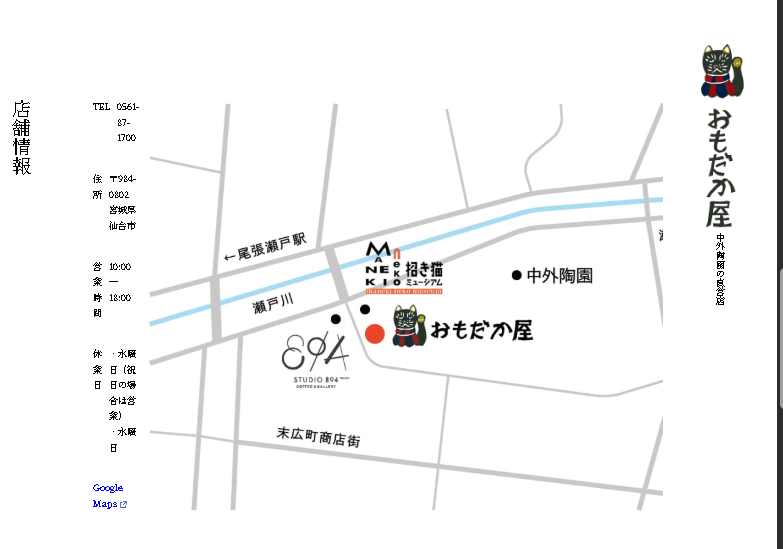


【結論】
Flexboxの子要素はデフォルトで `min-width: auto` が適用されており、中身のテキストや画像の幅より小さくならない。
`min-width: 0` を指定すると「縮んでいいよ」と許可を出せる。
[プレビュー](http://localhost:54321/preview-20260222-172314.html)

★`min-width: 0`を指定しない場合。
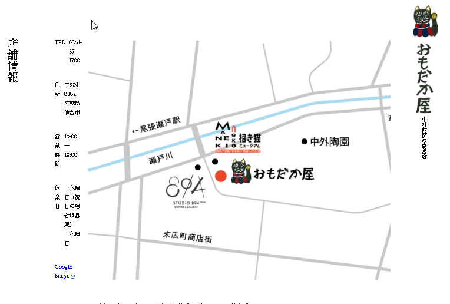


- 自分がはみ出すだけでなく、**隣の要素のスペースも奪う**のが本当の怖さ
- テキストが潰れて汚くなるので `overflow: hidden` + `text-overflow: ellipsis` とセットで使う

【具体例：長いテキストと画像の横並び】
```css
/* ❌ ダメな例：テキストが縮まず画像が押し潰される */
.text { flex: 2; }              /* min-width: auto がデフォルト */
.image { flex: 1; }             /* 残りスペースほぼ0になる */

/* ✅ 正しい例 */
.text {
  flex: 2;
  min-width: 0;              /* 縮小を許可 */
  overflow: hidden;           /* はみ出しを隠す */
  text-overflow: ellipsis;    /* 「…」で省略表示 */
  white-space: nowrap;        /* 1行に保つ */
}
.image { flex: 1; }
```

【補足】
- `min-width: auto` = 「中身より小さくならない！」→ はみ出す
- `min-width: 0` = 「小さくなってOK！」→ ちゃんと縮む
- `overflow: hidden` 系は `min-width: 0` とセットで使うのが実践的
- 同じ問題は `flex-direction: column` のとき `min-height: 0` でも起きる


## 📌 CSS maskプロパティはbackgroundと同じ構造（mask-image / size / position / repeat）

【結論】
`mask` は要素の「見える・見えない」を制御するプロパティ。
`background` と同じ4つのサブプロパティがあり、同じ感覚で使える。

| mask | background | 役割 |
|---|---|---|
| `mask-image` | `background-image` | 形・模様 |
| `mask-size` | `background-size` | 大きさ |
| `mask-position` | `background-position` | 位置 |
| `mask-repeat` | `background-repeat` | 繰り返し |

- マスクの黒い部分 → 見える
- マスクの透明な部分 → 見えない
- Safari対応のため `-webkit-` 付きも併記する

【具体例：左上から斜めにふわっと現れるマスク】
```css
.diagonal-reveal {
  mask-image: linear-gradient(135deg, black 50%, rgba(0,0,0,0.3) 65%, transparent 80%);
  mask-size: 0% 0%;        /* 最初は見えない */
  mask-position: 0% 0%;    /* 左上から */
  mask-repeat: no-repeat;
}

.diagonal-reveal.is-visible {
  animation: diagonalReveal 3.3s forwards;
}

@keyframes diagonalReveal {
  from { mask-size: 0% 0%; }
  to   { mask-size: 300% 300%; }  /* マスクが広がる → 見えるようになる */
}
```

【補足】
- `linear-gradient` の角度・%の細かい数値は覚えなくてOK。使うときに調整する
- `mask-size: 0%→300%` のアニメーションで「ふわっと現れる」表現ができる
- JSの `IntersectionObserver` でスクロール時に `is-visible` を付けてアニメーション発火

---

## 📌 JSでアロー関数の`this`はwindowになる（e.targetを使え）

【結論】
アロー関数 `() => {}` の中で `this` を使うと、イベント対象の要素ではなく**windowオブジェクト**を指す。
イベント対象の要素を取得するには `e.target` を使う。

【具体例：ホバーでアンダーライン】
```js
// ❌ ダメな例（thisがwindowになる）
elem.addEventListener("mouseover", (e) => {
  this.style.textDecoration = "underline";  // エラー！
});

// ✅ 正しい例（e.targetで対象要素を取得）
elem.addEventListener("mouseover", (e) => {
  e.target.style.textDecoration = "underline";
});
```

【補足】
- `function() {}` なら `this` はイベント対象要素を指す
- アロー関数は親スコープの `this` を引き継ぐ（＝大抵window）
- 迷ったら `e.target` を使えば安全

---

## 📌 querySelectorAllで複数要素にイベントをつける（forEachが必要）

【結論】
`querySelectorAll` で取得した複数要素にイベントをつけるには `.forEach()` でループが必要。
`querySelector`（単数）だと1つ目しか取れない。

【具体例：全カードにホバーイベント】
```js
// ❌ 1つしか取れない
const desc = document.querySelector(".case_description");
desc.addEventListener("mouseover", ...);  // 最初の1つだけ

// ✅ 全部に適用
document.querySelectorAll(".case_description").forEach((desc) => {
  desc.addEventListener("mouseover", (e) => {
    e.target.style.textDecoration = "underline";
  });
});
```

【補足】
- `querySelector` → 1つ目だけ返す
- `querySelectorAll` → 全部返す（NodeList）
- NodeListには `.forEach()` が使える

---

## 📌 flex-shrink: 0 はスライダーに必須（カードが縮まないようにする）

【結論】
`flex-shrink: 0` は「親が狭くても縮めるな」という指定。スライダーでカード枚数を制御するには必須。

- デフォルト `flex-shrink: 1` → 親に収まるよう自動で縮む → カードが5枚6枚全部見えちゃう
- `flex-shrink: 0` → 指定幅を維持 → overflow:hidden で4枚だけ表示される

★つまり、widthが５００だとして、width: calc((100% - 6rem) / 4);→「４枚のcardをだしたい」、を正確に計算しても、flex space-betweenする。そうするおと５枚ある場合、自動で500oxに縮める仕様なので、５枚で画面に表示される。

`flex-shrink: 0` は「親が狭くても縮めるな」とい指示で、指定した枚数を画面にいあてはめる。

※以下は実は５枚カードがあるが、４枚だけだすようにしている。
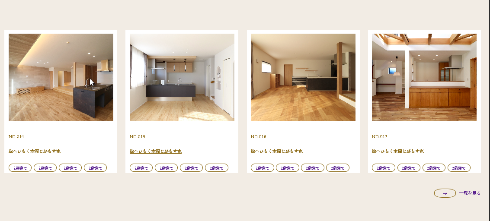


【具体例：4枚カードスライダー】
```css
.case_list {
  overflow: hidden;          /* はみ出た分を隠す */
}

.case_track {
  display: flex;
  gap: 2rem;
  transition: transform 0.5s ease-out;  /* JSでスライド */
}

.case_item {
  width: calc((100% - 6rem) / 4);  /* gap2rem×3を引いて4分割 */
  flex-shrink: 0;                   /* ← これがないと全部縮んで表示される */
}
```


【補足】
- `overflow: hidden` + `flex-shrink: 0` はスライダーのセット
- JSで `translateX` を使ってスライドさせる仕組みと組み合わせる
- `width: calc()` でgap分を引いて計算するのがポイント

---

## ★ アニメーション一覧

### スクロール・フェードイン

| アニメーション | 概要 | プレビュー |
|---|---|---|
| AOS スクロールアニメーション | スクロールで下から表示・スライド・ズーム等。シンプル〜多機能版4パターン | [▶](http://localhost:54321/preview-20260214-082619.html) |
| フェードイン（最新版） | スクロールで要素が下から上に浮き上がる。一度表示した要素を除外してパフォーマンス向上 | [▶](http://localhost:54321/preview-20260215-112528.html) |
| フェードイン（旧版） | スクロール連動で下から上にfadeIn。jQuery + scroll event | [▶](http://localhost:54321/preview-20260215-111256.html) |
| 後ろに引き込まれる | スクロールで画面内に入った瞬間、scale()で縮小しながら奥へ吸い込まれる | — |
| スクロールで画像を拡大 | PC: 画像拡大 / SP: 縮小。ウィンドウ幅900px基準で切替 | — |

### スライダー・スライドショー

| アニメーション | 概要 | プレビュー |
|---|---|---|
| Swiper 基本 | フェード切替・オートプレイ | [▶](http://localhost:54321/preview-20260216-001945.html) |
| Swiper サムネイル連動 | サムネイルクリックでメイン切替 | [▶](http://localhost:54321/preview-20260216-002046.html) |
| Swiper 自動再生+プログレスバー | 残り時間をバーで表示 | [▶](http://localhost:54321/preview-20260216-002406.html) |
| Swiper 多機能版 | 上記全機能の組み合わせ | [▶](http://localhost:54321/preview-20260216-002459.html) |
| 無限スクロール（すき間あり） | Slick.jsで3枚同時表示。padding+centerPaddingでチラ見せ | — |
| 無限スクロール（すき間なし） | CSSの@keyframesだけで左から右へ無限スクロール。ライブラリ不要 | — |
| スライドショー（同じ場所で切替） | 3枚をposition: absoluteで重ねて、animation-delayでタイミングずらし | — |

### テキスト・文字系

| アニメーション | 概要 | プレビュー |
|---|---|---|
| clip-path 文字リビール | clip-path inset()で上から下へ文字が現れる。縦書きに最適 | — |
| ShuffleText 文字シャッフル | 文字がランダムに変化→最終テキストへ収束。ハッカー風UI | — |
| 縦書きメニュー 順次表示 | clip-path + writing-mode: vertical-rl。右から左へ順次リビール | — |

### インタラクション（メニュー・開閉）

| アニメーション | 概要 | プレビュー |
|---|---|---|
| アコーディオン（flex対応） | slideToggle()使用。display: blockをflex上書きするコールバック必須 | — |
| アコーディオン ＋－切替 | 開閉に＋/－を同時切替。.text()とtoggleClass()の組み合わせ | — |
| ハンバーガー 左スライドメニュー | 左からナビがスライドイン。pointer-events: noneでオーバーレイ透過 | — |

### 画像・レイアウト

| アニメーション | 概要 | プレビュー |
|---|---|---|
| 画像ギャラリー（小→大切替） | サムネクリックで大画像切替。attr("src")で画像パス変更 | — |
| 画像を階段式に２列配置 | nth-child(odd/even)で左右交互。text-align制御 | — |
| 動画を画面に配置 | videoタグのautoplay/muted/playsinline属性。object-fitでアスペクト比維持 | — |
| パララックス | data-speed属性でスクロール速度を要素ごとに制御。背景固定+手前スクロール | [▶](./その他/00_サンプルソース/★パララックス.html) |

### 視覚効果

| アニメーション | 概要 | プレビュー |
|---|---|---|
| シャボン玉アニメーション | background-positionをアニメーションで移動。GIFが画面内を落下する演出 | — |
| 吹き出し・会話バルーン | ::beforeで三角形。IntersectionObserverでscale(0.1)→scale(1)の膨張アニメ | [▶](http://localhost:54321/preview-20260215-120351.html) |
| ぼかし・立体など各種 | box-shadow: insetで内側ぼかし。border-bottomで立体感など | — |

---

## 📌 スキル: `/mockup` - スクショからSVG設計図を生成する

【結論】
`/mockup` にスクリーンショットを渡すと、CSS配置情報をアノテーションしたSVG設計図を生成してくれる。HTMLを書く前に構造を整理するために使う。

【具体例】
```
/mockup → 「スクリーンショットを渡してください」
→ スクショを渡す
→ mockup_01_concept.svg が生成される
```

【補足】
- ファイル名は連番: `mockup_01_xxx.svg`（既存ファイルを確認して番号を提案してくれる）
- 色コード: 橙(#ff8800)=relative / 青(#0055ff)=absolute / 緑(#007722)=flex/grid
- 装飾写真はすべてabsolute、通常フローテキスト + absolute写真のシンプル構成が基本
- コメント内に `--` を書くとXMLエラーになるので注意

---

## 📌 HTML ハンバーガーメニューは `<button>` タグを使う

【結論】
クリックして何かを「実行する」要素は `<button>`。`<div>` でも動くが `<button>` にする理由がある。

【具体例】
```html
<!-- ❌ よくある間違い -->
<div id="hamburger_btn" class="hamburger_menu">
  <span class="bar"></span>
</div>

<!-- ✅ 正しい -->
<button type="button" id="hamburger_btn" class="hamburger_menu" aria-label="メニューを開く">
  <span class="bar"></span>
</button>
```

```css
/* button のデフォルトスタイルをリセット */
.hamburger_menu {
  padding: 0;
  font: inherit;
  background-color: transparent;
  border: none; /* 不要なら */
  cursor: pointer;
}
```

【補足】
- `<a>` → 遷移するもの（リンク）
- `<button>` → クリックして何かを実行するもの（ハンバーガー・送信など）
- `<div>` でも `cursor: pointer` は付けられるが、キーボード操作・スクリーンリーダー対応ができない
- `type="button"` を付けないと `form` の中でsubmitとして動くことがあるので明示する

---

## 📌 CSS 親に transform（アニメーション含む）があると position: fixed が壊れる　HTML

【結論】
`position: fixed` の要素は、祖先に `transform` が適用されている要素があると、viewportではなくその要素を基準に配置される。
アニメーションで `transform` を使い `forwards` で状態を保持している場合も同様。

【具体例】
```css
/* ❌ 壊れるパターン */
.header_nav {
  animation: dropDown 1.5s forwards; /* transform: translateY() を使用 */
}
.hamburger_menu {
  position: fixed; /* ← header_nav が基準になってしまう */
}
```

```css
/* ✅ 正しいパターン：transformのない親の直下に置く */
.header_inner {
  position: relative; /* transformなし */
}
.hamburger_menu {
  position: fixed; /* ← viewportが基準になる ✅ */
  animation: dropDown 1.5s forwards; /* 個別にアニメを付与 */
}
```

```html
<!-- ✅ 構造 -->
<div class="header_inner">
  <nav class="header_nav">         <!-- transformアニメあり -->
    <div class="header_nav_list">...</div>
  </nav>
  <!-- fixedにしたい要素はnavの外に出す -->
  <div class="hamburger_menu">...</div>
</div>
```

【補足】
- `transform` を持つ祖先要素は「containing block」になる（viewportの代わり）
- `animation: ... forwards` で終了後もtransformが残り続けるので注意
- `transform: translateY(0)` のゼロ移動でも同様に壊れる
- 解決策：固定したい要素をtransformのない祖先の直下に移動し、個別にアニメを付与する

---

## 📌 CSS Flexbox で要素内を中央配置する鉄板パターン html

【結論】
要素の中身を縦横中央に配置したいときは、以下3つを親要素に書けばOK。

- `display: flex` → 自分をflex containerにする
- `align-items: center` → 子を縦中央に
- `justify-content: center` → 子を横中央に

書く場所は**親**、効果が出るのは**子**（テキストノードも含む）。

【具体例】
```css
.inquiry_link {
  display: flex;
  align-items: center;    /* 縦中央 */
  justify-content: center;/* 横中央 */
  height: 50px;           /* ← 高さがないと縦中央の効果が見えない */
}
```

```html
<a class="inquiry_link" href="#">
  お問い合わせ  ← これが「子」として中央配置される
</a>
```

【補足】
- ボタン・カード・ヘッダーロゴ・モーダルなど幅広く使える
- `height` or `min-height` がないと縦中央が効いてるか見えない
- 1つの要素が「外から見てblock」「内から見てflex container」の2役を同時に持てる

---

## テスト問題  html

これはテストです

---

## 📌 jQuery の `$(function(){})` - HTMLが読み込まれた後に実行されるルール  jquery

【結論】
jQueryでは `$(function() { ... })` の中にコードを書く。
これは「HTMLの読み込みが終わったら実行して」という**お約束のルール**。

- `function` = 命令をまとめた箱（呼ばれたら動く。定義しただけでは動かない）
- `$(function(){})` = HTMLの構造が読み込まれた後、中の命令を自動で実行する

【具体例：ボタンを押したらアラートを出す】
```html
<script src="https://code.jquery.com/jquery-3.7.1.min.js"></script>
```
```js
$(function() {
  // ← ここに書いた命令は、HTMLが読み込まれた後に実行される

  $("#btn").on("click", function() {
    alert("ボタンが押されました");
  });
});
```

【タイミングの比較】
| 書き方 | 実行タイミング |
|---|---|
| `$(function(){})` | HTMLの構造（DOM）が読み込まれたら実行（画像より速い） |
| `window.onload` | 画像・CSS含む**全リソース**が読み込まれたら実行（遅い） |
| `<body>`閉じタグ直前にscriptを書く | HTMLの最後に書けばjQuery不要で同等 |

【補足】

- HTMLより先にJSが動くと「要素がまだ存在しない」のでエラー → だから `$(function(){})` で包む
- jQuery の `$` はjQuery本体の別名（エイリアス）。`jQuery(function(){})` と書いても同じ

---

## 📌 jQuery の `.on("click", function(){})` はイベントリスナー  jquery

【結論】
「この要素がクリックされたら、この命令を実行して」と**事前に登録しておく**仕組み。
登録するだけで、クリックされるまで実行されない。

【具体例】
```js
$(".gallery_img").on("click", function() {
  // クリックされたときだけ実行される
  const imgSrc = $(this).attr("src");   // $(this) = クリックされた要素自身
  $(".gallery_main").attr("src", imgSrc);
});
```

【jQueryとJSの対応】
| jQuery | 素のJS | 意味 |
|---|---|---|
| `$(".gallery_img")` | `querySelectorAll(".gallery_img")` | 要素を選ぶ |
| `.on("click", ...)` | `.addEventListener("click", ...)` | クリック時の処理を登録 |
| `$(this)` | `e.target` | クリックされた要素自身 |

【補足】
- jQueryは `querySelectorAll` + `forEach` + `addEventListener` を1行で書ける短縮版
- `"click"` の部分を変えると他のイベントにも使える（`"mouseover"` `"change"` など）
- `$(this)` は `function(){}` の中でのみ使える（アロー関数 `()=>{}` では使えない）

---


### ul li メニューの作り方

メニューやリストを作るときは、ul と li を使います。navタグはメインメニューのときだけ使用します。

```html
<nav class="header_nav">
  <ul class="header_nav_list">
    <li class="header_nav_item">
      <a href="#menu" class="header_nav_link">MENU</a>
    </li>
    <li class="header_nav_item">
      <a href="#about" class="header_nav_link">ABOUT</a>
    </li>
    <li class="header_nav_item">
      <a href="#location" class="header_nav_link">LOCATION</a>
    </li>
  </ul>
</nav>
```

横並びメニューの基本スタイル

```css
.header_nav_list {
  display: flex;
  list-style: none;
  gap: 3rem;
}

.header_nav_link {
  display: block;
  text-decoration: none;
  color: #333;
  font-size: 1.4rem;
  padding: 1rem;
}
```

`display: block` をaタグに指定することで、paddingが効くようになり、クリック範囲が広がります。

縦書きで横並びにする場合

```html
<ul class="footer_location">
  <li class="nav-item">
    <a href="#">０３｜ＸＸＸＸ｜ＸＸＸＸ</a>
  </li>
  <li class="nav-item">
    <a href="#">〒１０６｜００３２　東京都港区六本木５丁目×××××</a>
  </li>
</ul>
```

```css
.footer_location {
  display: flex;
  writing-mode: vertical-rl;
  flex-direction: column;
  gap: 3rem;
}

.nav-item {
  writing-mode: vertical-rl;
}
```

`writing-mode: vertical-rl` で縦書きにし、`flex-direction: column` で横に並べます。これが縦書きで横並びにする時の呪文です。

縦に並べる場合（文字は横のまま）

```css
.header_nav_list {
  display: flex;
  flex-direction: column;
  list-style: none;
  gap: 2rem;
}

.header_nav_link {
  display: block;
  writing-mode: vertical-rl;
  text-decoration: none;
  padding: 1rem 0;
}
```

この場合は、リンクそれぞれが縦書きになって、縦に積み重なります。


<svg width="300" height="100" xmlns="http://www.w3.org/2000/svg">
  <circle cx="30" cy="50" r="20" fill="#f9e2af">
    <animate attributeName="cx" from="30" to="270" dur="2s" repeatCount="indefinite" direction="alternate"/>
  </circle>
</svg>


▢ 　背景画像は PC と SP で切り替え（`<picture>`タグ or メディア切り替えたい場合は以下のように指定する。
background-image: url("../img/mainvisual-pc.jpg");をするときは
普段とちがって ima src と時と違い　../一度上のフォルダに移動する必要がある

▢ 　ＰＣとスマホで画像を変える場合は、HTML でＳＲＣを指定せずスマホ版で以下のように設定する

<header class="header_area">

```css

★この場合、通常に画像がひろがる
.header_area {
background-image: url("../img/mainvisual-pc.jpg");
background-size: cover; /* 要素いっぱいに広げる */
background-position: center; /* 中央基準で表示 */
}

★　これで設定すると赤玉が画像よりも多くみえる（パディングは内部の背景を広げるためにある。つまり水玉の領域がひろがる）
#school_overview {
  padding: 5rem 0 10rem 0;
  /* 赤い水玉背景（radial-gradientで作る） */
  background-image: url("../img/bg.gif");
  background-size: 75rem 75rem; /* ✅ 固定サイズ */
  background-repeat: repeat; /* ✅ 繰り返し */

  margin-bottom: 10rem;
}
```

▢ ポジションアブソリュートの使い方親に relative、子に absolute を設定します。
親（position: relative）└ 子（position: absolute）← 親を基準に配置される
★ 同じ階層でもできる上は間違い → かならず重ねたい要素をリラティブにする。

HTML 構造-------------------------------------------------

<header class="header_area"> <!-- 親 -->
  <nav>
    <!-- ナビゲーション -->
  </nav>
  ★親のメインヘッダに対して、子階層にセットする
  <div class="header_online">  <!-- 子：これを左下に配置したい -->
    <a href="https://example.com" target="_blank" rel="noopener noreferrer">
      オンラインストアを見る
    </a>
  </div>
</header>
---
ポジションリラティブは子要素に書く必要ある。
.header*area {
position: relative; /* ← これがないと absolute が効かない */
}
/* 子：左下に配置 */
.header*online {
position: absolute; /* 親を基準に配置 */
left: 20px; /* 左から 20px */
bottom: 20px; /* 下から 20px */
}
HTML 構造-------------------------------------------------

▢ 　たてがきは writing-mode: vertical-rl;これは親要素ではなく a タグにかく。

▢ 　 prettier できずいたらすぐ、コパイロットにいってタグをなおしてもらう
▢ 　フレックスは、上にかかれたものから左から順番に記載されることをわすれない。
▢ 　 flex 子フレックスで、width を指定すると、flex1 としているより優先されため、基本、サイズを指定する必要がない場合は flex1 にきめておくと楽。


## 💡 重要ポイント
```
flex: 1 → 「親の中で等分する魔法」
width → 「この幅に固定！」という命令
両方書くと flex: 1 が勝つ！（flex: 1 は flex-basis: 0 を含むため width より優先され、flex-grow: 1 により利用可能なスペースを埋めるように伸縮する）
```
ーーーーーーーーーーーーーーーーーーーーーーーーーーーーーーーーーー
自分でデザインカンプ
▢ 画面をよこにみて、absolute の回数を減らす。(理由、
★Absolute を減らして、流れ（横方向）で作る理由
壊れないから（一番大事）
Absolute は「画鋲で止める」ようなものです。
画面の大きさが変わると、止めた場所がズレてレイアウトが崩壊します。
流れで作れば、画面に合わせて柔軟に動いてくれます。
計算しなくていいから vertical-rl（縦書きモード）を使えば、
h1（ロゴ）の隣に nav（メニュー）が自動的に並びます。
座標を計算して配置する手間がゼロになります。
結論： 「頑張って配置する」のではなく、「勝手に並ぶようにする」のがプロの書き方です。)
header
h1
nav
▢ 　クラスを直接指定する方法タグ名で省略せず　ネストされたクラス名もかならずかく
a タグにもクラス名をかっく
<div class="online_absolute">
  <a href="#" target="_blank" class="online_link">オンラインストアを見る</a>
</div>
▢ 全体像を把握してまとめてパディングをしかける
▢ 　ぜんたいのメインカラーがあれば最初に BODY でいろをぬっておくそうすると ection のエリアでマージンボトムしたときも色がつく
▢ 更新した時途中からブラウザで表示したい場合飛ぶ　リンクする　遷移する
・URL の最後に、　 about をつける　 #移動　#リロード #遷移 #セクション
http://localhost:5500/#about
・HTML のセクションで ID をふる
<section id="about" class="concept_area">
1. 大事(「１」が本命できなかった「２」をする)`
「１」直った原因（推測）
settings.json に fullReload: true を追加した
CSS 保存時も完全リロードするようになった
window.addEventListener("load")が発火するようになった
Live Server を再起動した
設定が反映されるには再起動が必要
古いキャッシュがクリアされた
VSCode を再起動した
拡張機能が正しく読み込まれた
設定ファイルが確実に反映された
「２」
1. 手順：CSS 保存時もリロードさせる設定
   VS Code で Ctrl + , (カンマ) を押して設定を開く。
上の検索バーに live server full と入力する。
出てきた項目の Live Server > Settings: Full Reload にチェックを入れる（オンにする）。
3. javaScript に以下を追加する(これは多分関係ない)
```JavaScript
window.addEventListener('load', () => {
    setTimeout(() => {
        window.location.hash = "";
        window.location.hash = "footer";
    }, 100);
});
```
▢flex で指定した画像に absolute で文字を配置しようとすると、top bottom などと指定した位置と、表示があわなくなる
Flex だと画像の高さが隣のタイトルに合わせられてしまうので、
align-items: flex-start をかけて高さを画像に合わせる必要がある。
▢ うっかりミスサイズが違う��思ったら、Style CSS でフォントサイズを 1400px に指定しているのを忘れていた。
※設計者は、 「ヘッダーは文字が流れるだけだから、縦書き設定だけで十分」
「商品はスマホでレイアウトをガラッと変えたいし、画像との位置関係を調整したいから、Flexbox という強力なツールを使おう」
と判断して使い分けた、ということです。
▢ 　インライン要素は、display blockブロック要素にすることによって、padding、border、width、height が
すべて正確に計算されるようになる。
よく使うインライン要素
<a>: リンク
<span>: テキストのグループ化（装飾用）
<strong> / <b>: 太字
<em> / <i>: 斜体
<label>: フォームのラベル
<small>: 注釈や細目
▢ 　パディングはあくまで中身の文字と文字というか、要素と外の枠ボックスの距離を取るものである。
もしも自分で分からなくなったら、ボーダーで指定するとイメージが開く。
ボーダーを指定せずに、パディングだけして色だけ指定すると、
枠がない色を作ることができる。
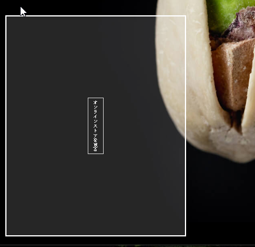
## 🏗 HTML タグの設計図（使い分け）まとめ

### 1. ロゴと見出し

- **h1:** サイトロゴに使用。画像を入れる場合は `h1` で囲む。
  ```html
  <h1 class="logo"></h1>
  ```
- **h2:** セクションのタイトル。日英併記などは `span` を使い、見出しタグの中にインライン要素として配置する。
  ```html
  <h2 class="news_title">
    <span class="title_news">News</span>
    <span class="title_notice">お知らせ</span>
  </h2>
  ```

### 2. 日付とお知らせ / メニュー (dl, dt, dd)

- **用途:** 「項目名（日付・料理名）」と「値（内容・価格）」がセットの時。
- **暗記:** 「dl」だけ打てばサジェストされるので、それを活用する。
  ```html
  <dl class="news_list">
    <div class="news_item">
      <!-- divで囲むとレイアウトしやすい -->
      <dt>2021.01.01</dt>
      <dd>タイトルタイトル...</dd>
    </div>
  </dl>
  ```

### 3. 見出しと詳細説明 (h2 + p)

- **原則:** 見出しは `h2`、説明の文章は `p`。
- **禁止:** `h2` の中に `div` や `p` などを入れることは文法上禁止（インライン要素のみ OK）。
- **構造:** まとめる場合は全体を `div` で囲む。
  ```html
  <div class="fashion_wrapper">
    <h2 class="fashion_title">Fashion & Style</h2>
    <p class="fashion_description">テキストテキスト...</p>
  </div>
  ```

### 4. ナビゲーション (nav)

- メインメニューの場合だけ `nav` を使用する。通常 `nav > ul > li > a` の構造にする。

---

▢ 　 AI にお願いするとき、サンプル SVG
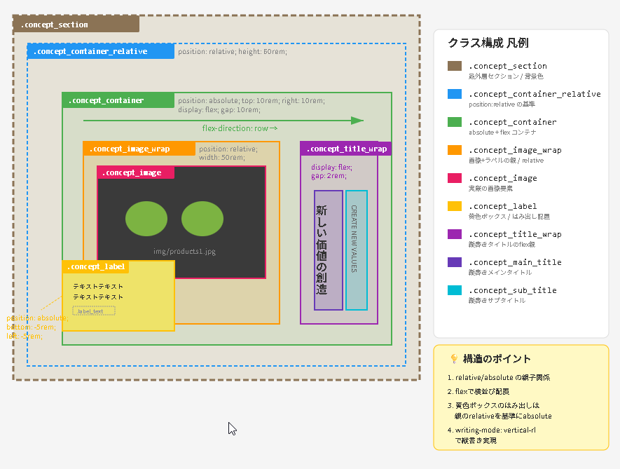

▢GitHub に支持する才能、テンプレート

1. スクリーショットを保存して、立ち上げてお

セクションの画像: 1 画面に収まる範囲のスクリーンショット。
素材（アセット）: 使用する画像ファイル名（例：img/ice-cream.jpg）。
構造の指定: 「ここは dl/dt/dd を使う」「ここは h2 と span の構成」などの指示。


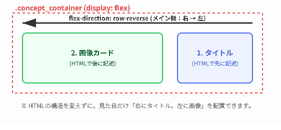

※「軸が逆転して、混乱するのは」
writing-mode: vertical-rl 文字が流れる方向

親が縦書き（NG 例）:
flex directon row（本来「横」） → 「上から下」に並ぶようになる。
column（本来「縦」） → 「右から左」に並ぶようになる。
これが「軸が回転して予測不能になる」原因です。
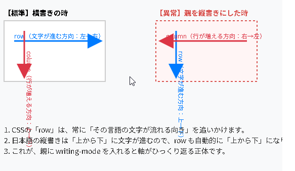

▢Position: absolute;をする場合、

前 ■ position: absolute の親子関係とサイズの一致
画像を基準にテキストを配置したい場合、画像そのものではなく、画像とテキストを包む「親ボックス」を基準点（relative）にするのが鉄則です。

なお、まんなかに記載したい場合は

```css
.test{
position:absolute
left: 0;
right: 0;

margin: 0 auto;

top: 50%;
transform: translateY(-50%); /* ★下に着すぎたものを半分↑に戻す */
}
```

## 親要素に relative をかける理由（画像へのテキスト重ね）

1. 構造の考え方
   親ボックス（.concept_card）は、中にある画像（.concept_img）のサイズに合わせて自動的に伸縮します。そのため、「親の枠」と「画像の枠」は基本的に一致します。

メリット: 画像に直接 absolute をかける必要がなく、レイアウトが崩れにくい。
ポイント: relative は「コンセプトイメージ」ではなく「親のカード」に実施する。

2. 実装コード
   <!-- 親：ここで relative を実施する（基準点） -->
   <div class="concept_card">
     
     <!-- 子：親を基準に自由に移動する -->
     <p class="concept_text">テキストテキスト</p>
   </div>

```css
.concept_card {
position: relative; /_ 親：基準点 _/
}

.concept_text {
width: 35rem;
height: 14rem;
position: absolute; /_ 子：親を基準に浮く _/
bottom: 2rem;
left: 2rem;
}

```

3. なぜサイズが一致するのか
   親要素が「ピッタリ重なっている」ように見えるのは、親要素が子要素（画像）のサイズに合わせて伸縮する性質を持っているからです。

この性質を利用することで

、`画像からの距離を測るのではなく、親ボックスからの距離を指定するだけで、意図した位置（左下など）にテキストを正確に配置できます。`

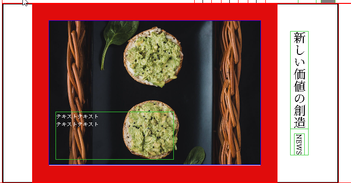

▢ 　大事　暗記　パーセント(%)とレム(rem)の使い分け
使い分けの目安：

文字サイズや余白: rem（画面に合わせて自動拡大縮小）
レイアウトの横幅（カラム）: %（親要素の中での占有率を決定）
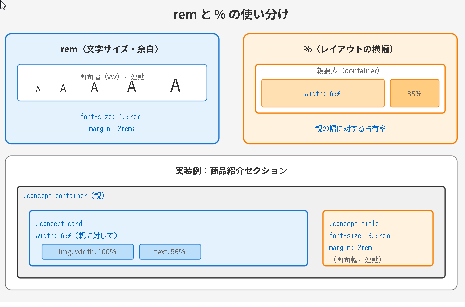

▢ 　問題：仕様書で「幅は % 指定」と言われたけど、% にするとデザインカンプとサイズがズレる。

理由：
% は「親の箱の中で何割を占めるか」を決めるだけで、「画像の大きさ」そのものは制御できないから。

解決策：
% と max-width（rem）を同時に指定する。

```css
.concept_card {
  /* 親の中での占有率（仕様書の指示） */
  width: 65%;

  /* 画像の最大サイズをロック（カンプ通りのサイズ） */
  max-width: 63rem;
}
```

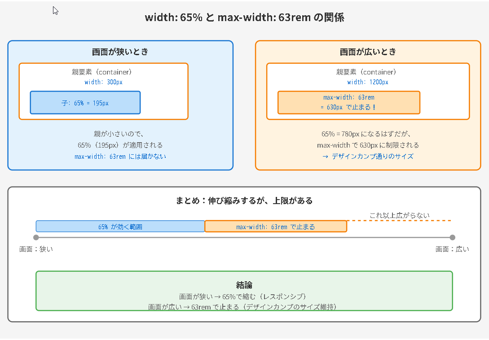

「細かい数字」ではなく「見た目のバランス」を守るのがレスポンシブの鉄則です。

## 分かった一番重要なこと　暗記

まず、
width 100％　
max-width: 140rem
max-width を指定する理由としては
前段のスタイル.css とかで

```css
html {
  font-size: calc(10 / 1400 * 100vw);
  /* 画面幅1280pxで10px*/
}
```

これがないことを想定している。
なぜならば、一緒にサイズが伸びてしまうからあまり意味がない。

もしもスタイルＣＳＳで上記の記述があるならば、以下をしていけばいい。

```css
html {
  /* 10px と 計算値のうち、小さい方が採用されます */
  font-size: min(10px, calc(10 / 1400 * 100vw));
}
```

## ▢ 拡張ツールの見方　暗記
紫・・・その紫色の部分は、justify-content: center; によって生じている Flexbox の余白（整列スペース） です。


▢ 　 📝 縦書きレイアウトの失敗メモ　暗記
`Flexbox` を組み合わせる際の落とし穴」**についての非常に重要なメモです。


【失敗の原因：軸の回転】

`現象`: 親要素に writing-mode: vertical-rl を指定すると、Flexboxの「主軸」と「交差軸」が90度回転します。
`結果`: flex-direction: row なのに要素が縦に並んだり、justify-content（横方向のはず）が上下の制御になったりして、配置の計算が予測不能になります。


【正解の鉄則：役割分担】
`親要素`: 配置（Flexbox）を担当。**横書き（デフォルト）**のままにしておくことで、使い慣れたFlexboxのルールで要素を並べられます。
`子要素`: 文字の向き（writing-mode）を担当。子だけに縦書きを適用することで、親の配置ルールを壊さずに文字だけを縦に流せます。
`メリット`: Flexboxが本来の動きをするため、align-items や gap での微調整が直感的かつ確実に行えます。


```css
/* 親：配置（横並び）だけを行う */
.news_area {
  display: flex;
  flex-direction: row-reverse; /* 右から左へ並べる（縦書きの並び順） */
}

/* 子：中身の文字だけを縦書きにする */
.news_title,
.news_wrapper {
  writing-mode: vertical-rl;
}
```
⇀「親は箱を並べる係、子は文字の向きを決める係」と役割を完全に分けるのが、レイアウトを崩さない最大のコツです。

▢ 　うっかりミス子要素が一つだけなのに‘フレックス‘をかけてしまった。

## ▢ 　手書きの図形の書き方
手書きメモの形式

・画面に情報を混在させず、画面下に「クラス名」を記載し「プロパティ」を書くスタイルに統一します。

## ▢ 　パディング のかけかた
覚え方
（余白の目的）　　　　（使うもの全体に）
共通の余白　　　　　　親の padding
子ごとに違う余白　　　子の margin

今回は「他と合わせる」より「実際の構造に合わせる」が優先二重管理を避けた方が、3 ヶ月後の自分が楽です！

以下の場合は、右と下だけパディングをつける。
それ以外は、子でマージンで別々に管理する。
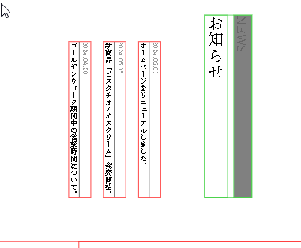

## ▢ 　 writing-mode: vertical-rl
これをかけることによって見方がかわる。flex direction :column;が横配置など

## ▢ 　うっかりミス
見た目が、自分の想定と違うと思った、デザインカンプ 1400px に対して、wrapper でサイズを max-with1200 にしていた。

-----------------------------↑ 上記追記済み　 GitHub インストラクションに

## ▢ メディアクエリ
/_ @media screen and (max-width: 375px) {
_/

## ▢ git ★github ルールに追加する必要なし
1. git の紐づけ

```
git init
git add .
git commit -m "first commit"

git remote add origin https://github.com/あなた/リポジトリ.git


git branch -M main
git push -u origin main

```


2. 最新情報を取得して、強制的に上書き
   git fetch origin
   git reset --hard origin/main

4. コンフリクト

1. 変更マージの下にある。ところでコンフリクトをしている。

もし、クリックして、コンフリクトを解消する。
・カラーのあるところの上に両方マージするみたいな文字がでるのでそれをクリック

・その後、変更マージの右側を＋ボタンをする。

・コミット、プッシュ


## ▢ 　以下のようにして　左右に画像と、その中にテキストを浮かびあがらせるこができる

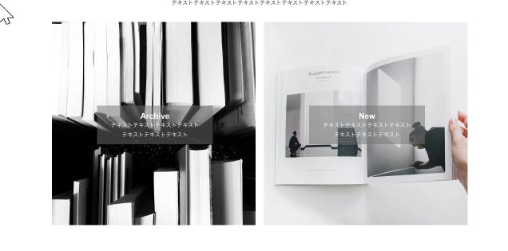

画像へのテキストオーバーレイ構造
`仕組みの解説`
⇀ 画像とその上に表示したいテキストグループを、1つの「親要素（.img_item）」の中に同居させ、CSSで重ね合わせるレイアウトの手法です。

`各要素の役割`

親要素 (.img_item)
⇀ 重なり合う要素の「基準点（枠）」になります。CSSで position: relative を指定します。

画像 (.newspaper_img)
⇀ 土台となるコンテンツです。

重ねる要素 (.img_overlay)
⇀ 画像の上に浮かせる「膜」のような層です。CSSで position: absolute を指定することで、画像の範囲内の自由な位置（左下や中央など）に配置できます。

`この構造にするメリット`
⇀ 1つのセットとして完結しているため、このセットを .img_container 内でFlexboxなどを使って横並びにしたり、数を増やしたりするのが非常に簡単になります。


```css
/* 実装例のイメージ */
.img_item {
  position: relative; /* 基準にする */
}
.img_overlay {
  position: absolute; /* 親を基準に浮かせる */
  bottom: 0;
  left: 0;
  background: rgba(0,0,0,0.5); /* 背景を半透明にすることが多い */
}
```

## position: absolute で中央配置する方法

必要な 3 つの要素
css.overlay {
position: absolute;
left: 0; /_ 1. 基準の左端 _/
`right: 0;          /* 2. 基準の右端 */`
`width: 30rem;      /* 3. 自分の幅 */`
margin: 0 auto; /_ 4. 余りを均等に _/
}``
なぜ全部必要？
要素役割 left: 0; right: 0;「親の左端〜右端が基準」と伝える width 自分の幅を決める margin: 0 auto;余った幅を左右均等に分ける
イメージ図
親要素（position: relative）
┌─────────────────────────────────┐
│← left:0 right:0 →│
│ │
│ auto │ 30rem │ auto │
│ 余白 │ 要素 │ 余白 │
└─────────────────────────────────┘
注意点

親要素に position: relative; が必要
width または max-width がないと margin: auto は効かない
left: 0; right: 0; がないと基準が分からず中央にならない

縦方向も中央にしたい場合
css.overlay {
position: absolute;
top: 0;
bottom: 0;
left: 0;
right: 0;
width: 30rem;
height: 10rem;
margin: auto; /_ 上下左右すべて均等 _/
}

## Flexbox で両端揃え + 隙間を作る　 space between ですき間をつくることができる

space between width center

基本の書き方

```css
css.container {
  display: flex;
  justify-content: space-between;
}

.item {
  width: 49%; /* 合計98%、残り2%が隙間になる */
}
```

★ なぜ space-between？

1.  `両端に張り付き、隙間が自動調整される`
    ┌──────────── 親要素 ────────────┐
    │ ┌─ 49% ─┐ 2% ┌─ 49% ─┐ │
    │ │ item1 │ ← 隙間 → │ item2 │ │
    │ └───────┘ 自動 └───────┘ │
    ↑ 左端 右端 ↑
    └───────────────────────────────┘

2.  親の幅が変わってもレイアウトが崩れない
3.  隙間を計算しなくていい（自動で調整）

gap との違い
「方法」 「隙間」 「両端」
space-between + 自動 端に張り付く
width: % 調整  
gap: 固定値 固定 端に余白が
できることも

`使い分け`

| やりたいこと   | 書き方                            |
| :------------- | --------------------------------- |
| 両端揃え+隙間  | `space-between` + `width: %`      |
| 均等な固定隙間 | `gap`                             |
| 中央寄せ       | `justify-content: center` + `gap` |

3 つ以上並べる場合

```css
css.item {
  width: 32%;  /* 3つ × 32% = 96%、残り4%が隙間 */
```

}
┌─────────────────────────────────┐
│ ┌ 32% ┐ 2% ┌ 32% ┐ 2% ┌ 32% ┐│
│ │ 1 │ gap │ 2 │ gap │ 3 ││
│ └─────┘ └─────┘ └─────┘│
└─────────────────────────────────┘

# Flexbox の order で要素の順番を入れ替える

1. `基本`

- `order` プロパティで要素の表示順序を変更できる
- 数値が小さいほど前に表示される
- デフォルト値は `0`

2. `使い方`

```css
.parent {
  display: flex;
  flex-direction: column;
}

.item-a {
  order: 2; /* 後に表示 */
}

.item-b {
  order: 1; /* 先に表示 */
}
```

3. `実例：レスポンシブで順序変更`

```css
/* PC: 画像 → テキスト */
/* モバイル: テキスト → 画像 に変更 */

@media screen and (max-width: 896px) {
  .container {
    flex-direction: column;
  }

  .image {
    order: 2;
  }

  .text {
    order: 1;
  }
}
```

## ポイント

- HTML の構造を変えずに表示順だけ変更できる
- レスポンシブ対応で便利
- `flex-direction: column` と組み合わせると縦並びの順序も変えられる

### 問題点 width が指定されたボックスが中央寄せされていなかった（inline 要素も中央寄せされない）

### 原因

- `display: block;`で幅を`56rem`に固定していた
- 親要素の`text-align: center;`はテキストのみ中央寄せする
- ブロック要素自体を中央に配置するには`margin: 0 auto;`が必要

★ つまり、width を指定すると、`margin: 0 auto;`が必要　`text-alian:center;ではだめ！！`

### 解決策

```css
.fashion_description {
  display: block;
  width: 56rem;
  margin: 0 auto; /* 追加 */
  font-size: 1.4rem;
  line-height: 1.7rem;
}
```

### height の使い分け

## 背景画像（background-image）

✅ height を指定する
理由：箱の高さがないと画像が見えない

```css
#fashion {
  background-image: url(../img/fashion.jpg);
  height: 520px; /* 必要 */
}
```

### 普通の画像（タグ）

❌ height を指定しない
理由：画像が元々サイズを持ってる

```css
img {
  width: 100%;
  /* heightは書かない */
}
```

---

## ■ Fashion セクション(画像を背景に、なかにテキストを重ね書きする)の作り方

### NG：タグで画像を入れる
⇀しかもここはDIVにかえないといけない。

### OK：CSS で背景画像にする

```html
Fashion & Style テキスト Read More
```

```css
#fashion {
  background-image: url(../img/fashion.jpg);　★
  background-size: cover;
  height: 520px;
  text-align: center;  /* 中央揃え */
  padding-top: 60px;
}
```

---

## ■ 中央揃え

### NG：Flexbox で均等配置

### OK：text-align: center

```css
text-align: center; /* これだけでOK */
```

---

## ■ 覚えておくこと

- 背景画像 = 自分で高さを作る
- 普通の画像 = 勝手に高さがある
  (高さも指定したい場合、
  `width + height + object-fit: cover`)
- 中央揃え = text-align

## シンプルに背景を画像にして、なかに文字をれいれる方法

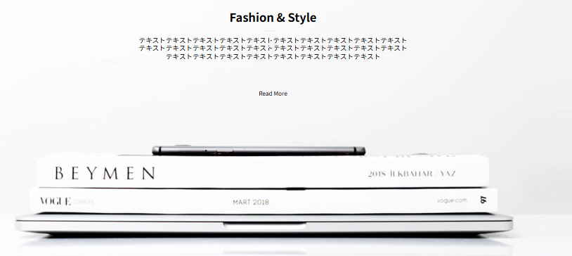

1. 画像を親（section 等）で、指定する。

```css
.fashion_area {
  width: 100%;
  height: 60rem;
  background-image: url("../img/fashion.jpg");
  background-size: cover; /* 要素いっぱいに広げる */
  background-position: center; /* 中央基準で表示 */
}
```

2. コンテナで画像まとめる

```css
.fashion_title {
  font-size: 2.4rem;
  font-weight: bold;
}

.fashion_description {
  display: block;
  font-size: 1.4rem;
}

.fashion_btn {
  display: inline-block;
  font-size: 1.2rem;
}
```

以下だけで完成

```html
<section class="fashion_area">
  <div class="fashion_wrapper">
    <h2 class="fashion_title">Fashion & Style</h2>
    <p class="fashion_description">
      テキストテキストテキストテキストテキストテキストテキストテキストテキストテキスト
      テキストテキストテキストテキストテキストテキストテキストテキストテキストテキスト
      テキストテキストテキストテキストテキストテキストテキストテキスト
    </p>
    <p class="fashion_btn">Read More</p>
  </div>
</section>
```

## なぜ、セクションの先頭は ID なのか？

ID クラスでない理由　クラス　セクション

アンカーリンク（ページ内リンク）のため

アンカーリンクはクラスにとぶことができない。

そのために、

<!-- ナビゲーション -->

<a href="#menu">MENU</a>

<!-- セクション -->
<section id="menu">...</section>

とする

## なぜ 100vh で画面いっぱいなのに min-height 100vh があるか。

height: 100vh 高さが画面サイズぴったりで**「固定」**される。 → 中身の文字などが増えると、枠からあふれて（はみ出して）しまう。

min-height: 100vh 高さは**「最低でも」画面サイズ。 → 中身が増えれば、それに合わせて自動で縦に伸びてくれる**。

結論 スマホなどで文字が折り返して縦に長くなっても背景が途切れないよう、min-height: 100vh を使うのが安全です。

## absolute で画面の中央にもってくる　 translateY 　 relative リラティブ　アブソリュート

margin 0 auto transform: translateY(-50%);

以下のようにすると画面中央にくる

```css
.site_title {
  position: absolute;

  right: 0;
  left: 0;

  margin: 0 auto;

  width: 48rem; ⇀これも必要

  top: 50%;
  transform: translateY(-50%); ★下に着すぎたものを半分↑に戻す
}
```

## 拡張機能

1. paste image
   カレントディレクトリではなくて
   特定のフォルダに保存する方法

```txt
VS Codeの設定（Ctrl + ,）で「paste image」と検索し、以下の通り書き換えてください。

Paste Image: Base Path
${currentFileDir} に変更
Paste Image: Path
images に変更

```

2. Restore Editors

VS Code レイアウト復元ショートカット
Editors をインストール

保存　 Restore Editors: Save Editor Layout
ショートカットキー設定

keybindings.json に追加：
json{
"key": "ctrl+alt+s",
"command": "restoreEditors.save"
},
{
"key": "ctrl+alt+r",
"command": "restoreEditors.restore"
}
使い方

保存: レイアウトを作って Ctrl+Alt+S
復元: Ctrl+Alt+R → リストから選択

3. サイドバーを閉じる
   ショートカットキー設定
   keybindings.json に追加：

{
"key": "escape",
"command": "workbench.action.closeSidebar",
"when": "sideBarVisible && !inQuickOpen && !suggestWidgetVisible"
}

4. CSS Navigation
   HTML のクラスをサジェストなどをする。

## 様々な flex のパターン

dd dl dt css jump 上級

・２カラムのメニュー表を作成する
左側にメニュー　　右にもメニュー
しかも、メニューごとに、
商品名・・・・価格

---

COffee food
aice ・・・100 sand・・・200
aice2 ・・ 200 　　 sand2....300

```html
➁menu-content (flex 親) 　 ➂meny_item（小　coffee等「←」flex 親）
　　➃dl(商品名) ⑤dt（価格） ➂.menu-item（小　food等「⇀」flex 親）
```

## h2 の使い方

## 本体自体を動かすときは、これをすれば、margin bottom や padding

をつかわず移動ででる

transform: translateY(2px);

パディングとマージンボトムとの違い
要するに、要素間のサイズとか、そういったものがなくなる。それ自体が動くから。

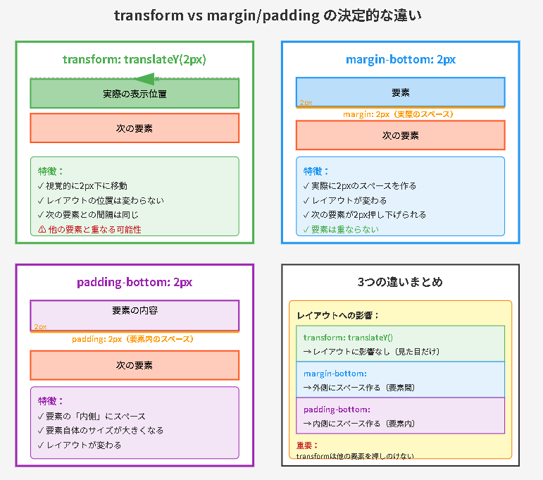!


## テキストなどの幅をサイズに丁度にボックスを調整する

ボタン」や「ラベル」など、背景色をつけつつ中身の文字サイズにピタッと合わせたいときには、inline-block

文字サイズに合わせてボックスのサイズを決めるっていうのをメモ.mdから探してblock = 親の幅いっぱいに広がる箱
inline-block = 中身の幅だけの箱（でも高さと幅を指定できる）


## パララックス　

[プレビュー](http://localhost:54321/preview-20260215-042326.html)

透ける　背景

`background-attachment: fixed;` は背景画像をビューポートに固定するプロパティで、透過効果とは関係ありません。

/* ✨
# `background-attachment: fixed;` の説明

## どういうこと？
背景画像がページのスクロールに追従せず、**画面に貼り付いたまま動かない**状態になります。

## 具体的な動き
- **通常**：ページをスクロールすると背景も一緒に動く
- **fixed**：ページをスクロールしても背景は画面の同じ位置に留まる（コンテンツだけが上下に動く）

## どんな時に使う？

### 1. **パララックス効果**
.hero {
  background-image: url('背景.jpg');
  background-attachment: fixed;
}
→ 背景が固定され、手前のコンテンツだけ動いて奥行き感を演出

/* ✨
# 実際に動くHTMLで説明
[プレビュー](http://localhost:54321/preview-20260214-065437.html)


## 動きの違い

- **🔴 通常部分**：スクロー���で背景も消えていく
- **🟢 固定部分**：スクロールしても背景は画面に張り付いたまま、白いボックスだけが上に移動

→ **「窓から外の景色を見ているような効果」** が `fixed` です！
*/

### 2. **ヘッダー画像の演出**
サイトのトップページなどで、スクロールしても背景画像が動かず、テキストだけが流れていく効果

### 3. **セクション区切り**
各セクション間に固定背景を挟んで、メリハリのあるデザインに

---

**要するに**：「見た目のおしゃれな演出」に使うプロパティです！
*/

##  ★もし画面の途中で固定をいれたい場合 パララックス html
/* ✨
画面の途中でパララックス効果を作る方法は主に2つあります：

## 1. **`background-attachment: fixed;` を使う場合**
そのセクション自体に `fixed` を適用すれば、そのセクションが画面に入ったときに背景が固定されます。

.middle-section {
  background-image: url('image.jpg');
  background-attachment: fixed;
  background-position: center;
  height: 500px;
}

**注意点**: 背景画像は**ビューポート全体**に対して固定されるため、セクションの位置に合わせて `background-position` で調整が必要です。

## 2. **JavaScriptでスクロール連動させる**
より細かい制御が必要な場合は、スクロール量に応じて背景位置を変更します。

window.addEventListener('scroll', () => {
  const scrolled = window.pageYOffset;
  document.querySelector('.middle-section').style.backgroundPositionY = 
    (scrolled * 0.5) + 'px';
});

**実務では**: セクションごとに異なる背景を固定したい場合、`fixed` よりもJavaScriptやCSSの `transform` を使った実装の方が制御しやすいことが多いです。
*/

★JavaScriptを使ったときのイメージ！
[プレビュー](http://localhost:54321/preview-20260215-042746.html)


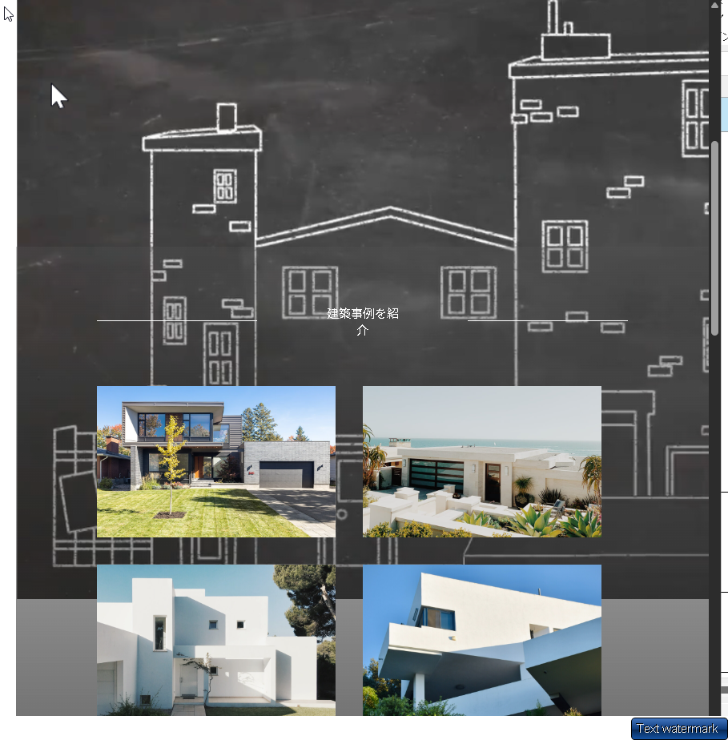

## パララックス効果（視差効果）を実装する際に、背景画像をわざと大きく表示（ズームアップ）させている設定です。 html


「画像を拡大して画面に固定することで、スクロールしたときにダイナミックに景色が変わるように見せている」


background-size: 150%;
【なぜ150%に設定するのか】
`理由`: background-attachment: fixed; を使うと、画像が画面（ビューポート）に固定されます。
`挙動`: 固定された画像は、要素の幅ではなく「画面の幅」を基準にサイズが決まるため、通常の cover 指定だと、意図した部分が隠れたり、画像が小さく見えたりすることがあります。
`解決`: 150% のように数値を大きくすることで、画像の一部を拡大し、スクロールした際の変化（奥行き感）をより強調できます。


```css
.parallax_area {
  /* 背景画像を表示するための最低限の高さが必要（03_mistakes 参照） */
  min-height: 50rem;

  /* 背景画像の指定 (ルール4: パスは ../img/ から開始) */
  background-image: url("../img/your-image.jpg");
  background-repeat: no-repeat;
  background-position: center;

  /* パララックスの設定：背景をスクロールに固定する */
  background-attachment: fixed;

  /* 背景サイズの拡大：デザインカンプに合わせて調整 */
  background-size: 150%;
}
```

※　サイドバー左固定などは　 height を使用する

背景のサイズを大きくする。

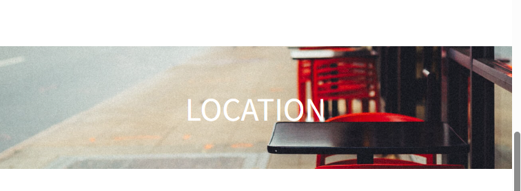


## width を指定して、height を auto にすると自然なかたちになる。 html

# ヘッダータイトル　固定幅　画像指定

とくにボックスに文字があてはまらない時など利用するとよい。また 


暗記ポイント
width のみ指定 → 高さは中身（実際の画像・コンテンツ）の量で伸び縮みする
アスペクト比で決まるのは aspect-ratio を使った時だけ


# サイドバーに固定で表示するときの構文

```css
#header {
  width: 300px;
  height: 100vh;  →　これがないと上部にある文字だけ、下にスクロールしても表示されない。
  position: fixed;
  top: 0;　
  left: 0;
  0: 画面の一番上（上端から 0px の位置）に固定。
　0: 画面の一番左（左端から 0px の位置）に固定。
　※top: 0 と left: 0 は、ヘッダーという 「箱そのも　の」を画面の真ん中ではなく、左上の端（0,0）にピタ　ッと置く という意味です。

  padding: 60px 40px;
  background-color: #fff;
  display: flex;
  flex-direction: column;
}
```

## radius で ◯（丸の形の形をつくる） html

```html
<ul class="feature_list">
  <li class="list">
    <a class="radius" href="#">design</a>
  </li>
</ul>
```

```css
/* aタグで大きな〇を作るロジック radius*/
.radius {
  width: 100%;
  border: solid 1px #fff;
  border-radius: 50%; /* ← これで円になる！ */
  color: #fff;
  display: block;
  padding: calc(50% - 11px) 0; /* 上下のパディングで高さを確保 */
}
```

## justify-content: space-between を使用した際は、子要素にサイズを指定できる。間のギャップは、自動！！ html

「子要素にパーセント（%）や
幅（width）を指定することは【可能】であり、むしろ【必須】に近いテクニック」**

なお、要素別にサイズを決めることも可能
3つ以上の要素がある場合：
もし [30%] [10%] [40%] とバラバラな幅で space-between を使うと、それぞれのアイテムの間の隙間（ギャップ）自体は同じサイズになります。

例）
「2カラムのメニュー表」などで、左側を少し狭く、右側を広くしたい時などに活用できるテクニックです。

・子要素の幅を 30% に指定します。
3個並ぶと：30% + 30% + 30% = 90%
残り：100% - 90% = 10%
この余った 10% が、自動的に2つの隙間（各5%）になります。


## 「文字の上下にある『見えない余白』を限界まで削る」

line-height:1

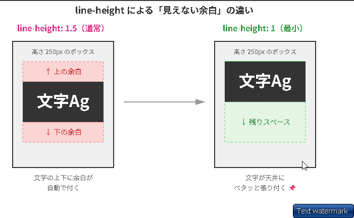


大きなボックス（高さがしっかりあるボックス）で line-height: 1; を使うと、**「文字が天井（一番上）にベタッと張り付いた状態」**になります。
(上の余白が消える)


## AI に確認する際の注意事項

・ソースを渡す
・デザインカンプを渡す
・専門用語をつかう。
例）　たとえば台形とか、逆台形とか　調べる


----------------------------------------------------------------


## ▢ ホバー時にレイアウトを崩さない「枠線」の使い分け（outline vs border）
`【何回なソースはシンプルをこころがける】`

AI にたのんで、必要最小限のソースにしてもらって
確実に理解していく。ソースがおおくあると
必ず混乱するので。

結論：
特定の要素をホバーした際に「ガタッ」と周りが動いてしまうのを防ぐには、border ではなく outline を使う。

1. なぜ border はずれるのか？
   border は**「箱の厚み」**として計算されます。

0px から 3px に変えると、その要素自体のサイズが上下左右に 3px ずつ大きくなります。
大きくなった分、隣にある要素や下の要素を「よいしょ」と押し出してしまうため、画面が揺れます。 2. なぜ outline はずれないのか？
outline は**「箱の外側に描かれる線」**であり、計算上のサイズは 0 です。

太さをどれだけ変えても、要素自体の大きさ（占有スペース）は変わりません。
他の要素に干渉しないため、レイアウトが一切崩れません。 3. 実装の比較 4. 便利なプロパティ：outline-offset
outline は標準では「箱の外側」に線がつきますが、outline-offset を使うと位置を調整できます。

outline-offset: -3px; ：線の厚み分だけ内側に食い込ませる（デザインカンプ通りに作りやすい）。
outline-offset: 2px; ：箱から 2px 浮かせて線をつける。

## サイドメニューーから header メニューに変更する

## 固定サイドバーをけす。

## すでにあるものを移動する

え？ポジションアブソリュートしなくても top とか　 left で位置かえられるの？

`答え：positionを指定すれば使える`
top, left, right, bottom は、position を指定すれば使えます：

```css
❌ これはダメ（デフォルトは static） _/

#navi {
left: -300px; /_ 効かない！ _/
}

/_ ✅ これなら OK _/

#navi {
position: fixed; /_ または absolute, relative _/
left: -300px; /_ 効く！ _/
}

```

・強引に画面の左にけす。
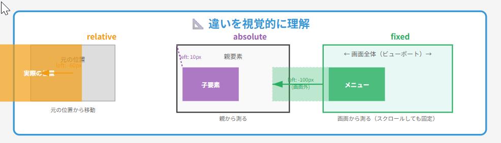


## 三角形の図形の作り方

```css
すでにある要素に対して、疑似要素で、三角を追加する。なお:afterでもbeforeでも同じ。
  contact_card::after {
  content: "";
  display: block;
  position: absolute;
  /* 三角形のサイズ（お好みで調整してください） */
  width: 2.5rem;
  height: 2.5rem;

  bottom: 0.3rem; /* 下端に配置 */
  right: 0.3rem; /* 右端に配置 */

  /* グラデーションを使って直角三角形を作る魔法の記述 */
  /* 「右下から左上に向かって、50%の位置まで黒、残りは透明」という指定です */
  background: linear-gradient(to top left, #000000 50%, transparent 50%);
  /* カードの枠線の上に重なるように z-index を調整 */
  z-index: 2;
}
```


## トップの画面を固定にして、その下のセクションをスクロールするときに、裏の画面をのこして、重ねて表示させる。　詳細は　./その他/疑問・ソーステストあり md を参照

`ソースをみたいときは、82_CSS_JUMP_上級編_ピカソ`
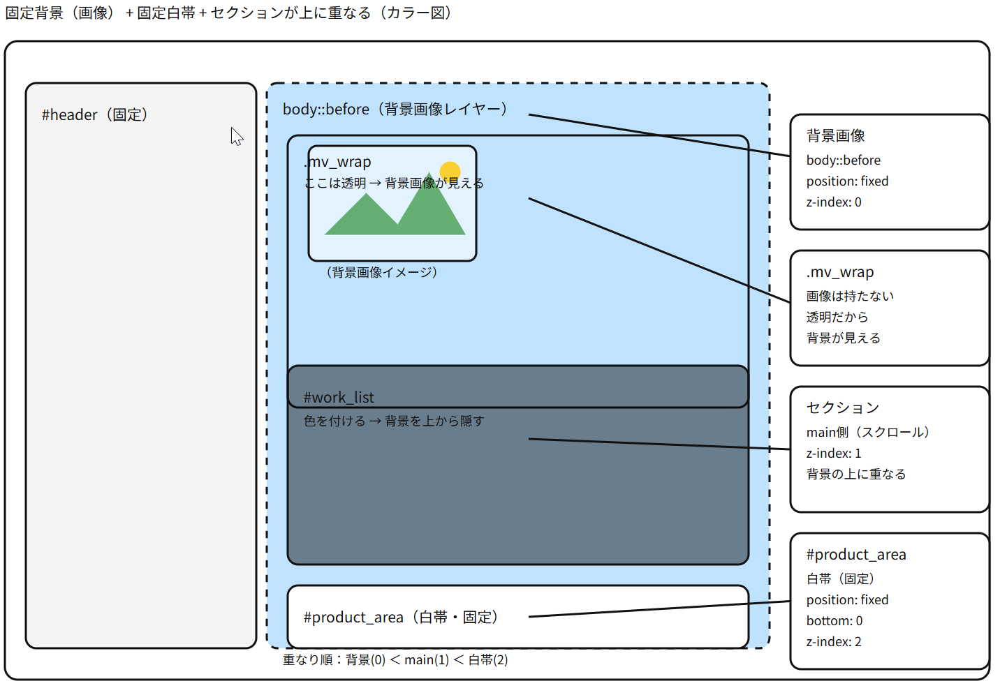

##　命名ルール　規則

▢ 　コメントをしっかりかく。そうすると補完ででてくる。
## ヘッダーを作成するうえでの注意事項

header は
/_ 高さを固定しない（padding 分も含めて自然に） _/
height: auto;
min-height: 6.2rem;

`中身が少ないとき： min-height が優先され、6.2rem の高さになります。`
`中身が増えたとき（文字が改行した時など）： height: auto のおかげで、中身がはみ出さないように高さが 7rem、8rem と自動で伸びます。`

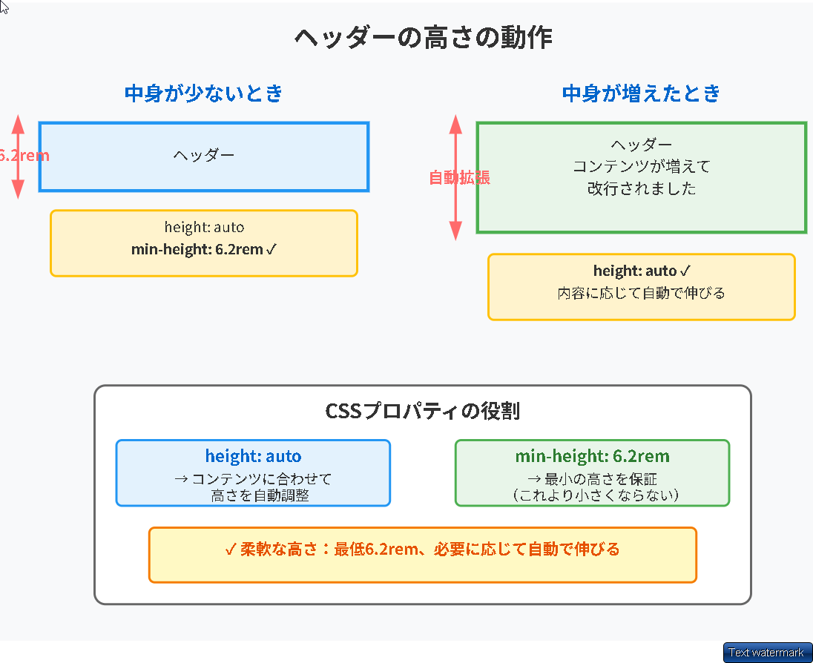

★ 基本は auto 動作して まわりのパディングとかなかみの画像にあわせて伸縮する！！

最低ラインを確保して、ふえたときは auto でまわりのサイズにあわせる

## ショートカットキー　ホットキー

ALT L⇀ 　 O 　ライブサーバー
CTRL 　 SHIft O クラス検索
Ctrl+P → ファイル名入力 → Enter → Alt+B → 
ブラウザ表示
CTRL　：　セクション一覧表示
Ctrl+Shift+7: クイズ起動
Ctrl+Shift+M: メモ検索
Ctrl+Shift+l: セクションリスと表示


## 🛠 問題と解決方法

### 問題 2: ブラウザ幅を狭めてもハンバーガーメニューが表示されない

- **原因:**
  - 通常のブラウザウィンドウのサイズ変更では、ビューポート幅が正しく認識されない場合がある。
- **解決方法:** -　画面のズームの幅をかえる。


## 左右　に枠やマージンやパディングがあって、中央のボックス（width）のサイズをセットしたいとき。
##　またそれを中間にもってきたいとき
コンテンツ幅などに多用する
  width: calc(100% - 40rem);
  margin 0 auto


## メニューが２列あって、同じ幅でフォーマットを構築する際の計算式


```css
.price_area
 {
  width: calc(100% - 40rem);　★コンテンツエリア分残すにはこう記載する。
  margin: 0 auto;
}


/* 各カラム（左・右） 共通クラス*/
/* エリア全体 */
.price_area {
  display: flex;
  justify-content: center;
}

.price_column {
  width: 50%;　　　　★半分ずつなので５０パーセント
  padding: 0 3rem;
  text-align: center;
}

/* 左側のカラム 詳細　みぎにボーダーをつけるなど*/　　★　一応中央線もかいておいた
.left_column {
  border-right: 1px solid black;
}

```

## 背景コンテンツエリアの固定背景固定（パララックス風）の表示を記載したいとき前お物理エリアの背景画像分のサイズを確保したい場合、　シンプルなパララックス

※パララックス・・・視差、画面に奥行きや立体感、没入感を出す演出技法のことを指します


```html
  ・ここに背景画像があるとするパララックス。fixed

  <!-- コンテンツエリア -->
  <main class="main"> ★ここで`padding-top` パララックスのサイズ分を指定するとで、透明なすき間をつくる
    <section class="test_area"></section>
    <section></section>
  </main>
```

```css
.main {
  padding-top: 100vh; ★ここが大事
  /* ❌ ここに色があると、上のpadding部分も白くなっちゃう */
  /* background-color: rgba(255, 255, 255, 0.8); */

  /* ⭕️ なので、ここは透明にする（または行ごと消す） */
  background-color: transparent;　★カラーがこれで透明になる。
}

  .test_area{
  width: 100%;
  height: 150rem; ★ここは今テストなのでこうしているが実際はautoなどでつまった分だけふやしていく。★デザインカンプなどで決まっている場合は、min-height を使う

  margin: 0 auto;
  background-color: rgba(46, 12, 160, 0.8);
}

```
}
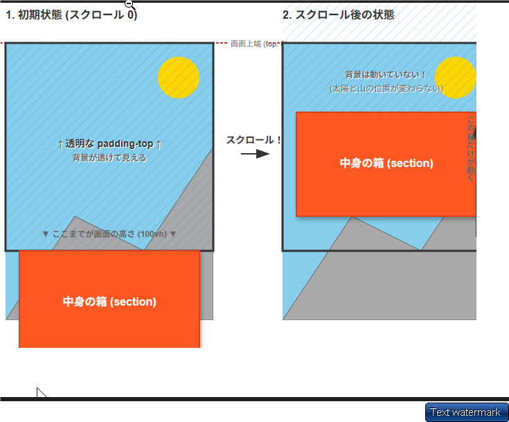


## HTMLの構造
・基本の書き方
`ヘッダーの書き方`
classではなく IDを理由する。
`ログはH1を利用する`
ロゴをH1にするのは、alt属性のテキストが検索エンジンに読み取られるためSEO効果がある。ただし、H1は1ページに1つが推奨されるため、トップページ以外では別の見出しをH1にする場合もある。
```html
<h1 class="site-title">
  <a href="#"></a>
</h1>
```
▢　環境整理  ★環境構築　
SVG表示保存CS+S.ahk　
で使用。　これがあることによって、保存先が以下となる。
★同じツールを家と会社で使い回すための改修
【ポイント　環境変数で環境ごとに以下を設定する】
・KNOWLEDGE_ROOT・・・SVGを保存する先を設定する
ここで取得したフォルダを同じ階層の各プロジェクト用資料などに移動したりする。
## position: fixed はrelativeも兼ねる。つまり、子で Absoluteが指定できる。

✅ position: fixed でも top / right / bottom / left が使える

```css
/* position: fixed = 画面全体を基準に固定 */
.page_container {
    position: fixed;  /* 画面全体を基準 */
    top: 2rem;        /* 上から2rem */
    right: 5rem;      /* 右から5rem */
    z-index: 1200;
}
```

### 📊 fixed vs absolute の違い

| position | 基準 | 画面を伸ばすと |
|----------|------|---------------|
| **fixed** | 画面全体 | 右端からの距離が固定 ✅ |
| **absolute** | 親要素 | 親の幅が変わる → 位置が中央に寄る ❌ |

### 💡 使い分け

```css
/* ❌ absolute: 親要素を基準（画面を伸ばすと位置がズレる） */
#mainVisual_area {
    width: calc(100% - var(--header-side-width)); /* 可変 */
}
.page_container {
    position: absolute;  /* 親要素を基準 */
    right: calc(var(--header-side-width) + 2rem);
    /* → 画面を伸ばすと親の幅が広がる → 中央に寄る */
}

/* ✅ fixed: 画面全体を基準（常に右端から固定距離） */
.page_container {
    position: fixed;  /* 画面全体を基準 */
    right: calc(var(--header-side-width) + 2rem);
    /* → 画面を伸ばしても右端から固定 */
}
```


## サイドバーのメニューの文字列が文字幅だけじゃなくて、文字幅＋残りの余白ありでクリックできてしまう場合

```css
/* メニューリスト 縦 */
.nav_list {
  list-style: none;
  padding: 2rem 0 0; /* 上に2remの余白を指定 */
  margin: 0;
  display: flex;
  flex-direction: column;
  gap: 3rem;
  align-items: flex-start; ★ここで制御する。　stretchなどにすると横全体になる
}

```
  ## 動作の違い

### `align-items: flex-start`（現在の設定）
- 子要素を左端に配置
- 子要素の幅 = **コンテンツ（文字）の幅のみ**
- クリック範囲 = 文字部分だけ ✅

### `align-items: stretch`（デフォルト値）
- 子要素を横幅いっぱいに伸ばす
- 子要素の幅 = **サイドバー全体の幅**
- クリック範囲 = 文字 + 右側の余白全体 ❌


```

## JavaScriptでイベントリスナーを実行したときに動かない。


イベントリスナーのクラスはIDで指定する必要がある。

```HTML
<!-- ヘッダー SPののみ表示-->
<header id="header" class="header">
  <div class="log_img"></div>
</header>

```


**Q: JavaScriptで要素のwidth変更をなめらかにアニメーションさせる設定とは？**

`transition`プロパティをCSSに設定する

JavaScriptで`width`を変更する前に、CSS側で`transition: width 0.3s ease;`などを指定しておくと、値の変化が自動的にアニメーション化される。

例：
```css
.element {
  transition: width 0.3s ease;
}
```

```javascript
element.style.width = '500px'; // なめらかに変化
```

例２）
ゆっくりと　アニメーション。これは左固定メニューバーから、を外部から引っ張りだして表示させるとき


[プレビュー](http://localhost:54321/preview-20260217-012154.html)

```css
.header {
  position: fixed;
  background-color: white;
  /* ▼ 変化を滑らかにする設定はここに書く */★
  transition: transform 0.3s ease-in-out;
}

**`.header` の方だけに書けばOK**です。


**動作説明:**
- ボタンを押すと、`.hidden`クラスが付いたり外れたりする
- メニューが左からスルッと出たり隠れたりする
*/


## オーバーレイ、黒いマスクのつけ方

```html
<!-- オーバーレイ　左固定メニューバーを開いた際に暗くする -->
<div id="overlay" class="overlay"></div>
```

```javascript
const hamburger = document.getElementById("hamburger-btn");
hamburger.addEventListener("click", function () {
  overlay.classList.toggle("open");
```

```css
  /* レスポンシブ ハンバーガーメニューがclickされたらオーバーレイ */
  .overlay.open {
    position: fixed;  
    top: 0;
    left: 0;
    width: 100%;
    height: 100vh;
    background-color: rgba(0, 0, 0, 0.5);
    z-index: 800;
  }
```


## パララックス、レイヤーを重ねるときに必要なこと, 

・親の要素で、fixed は親1箇所のみ

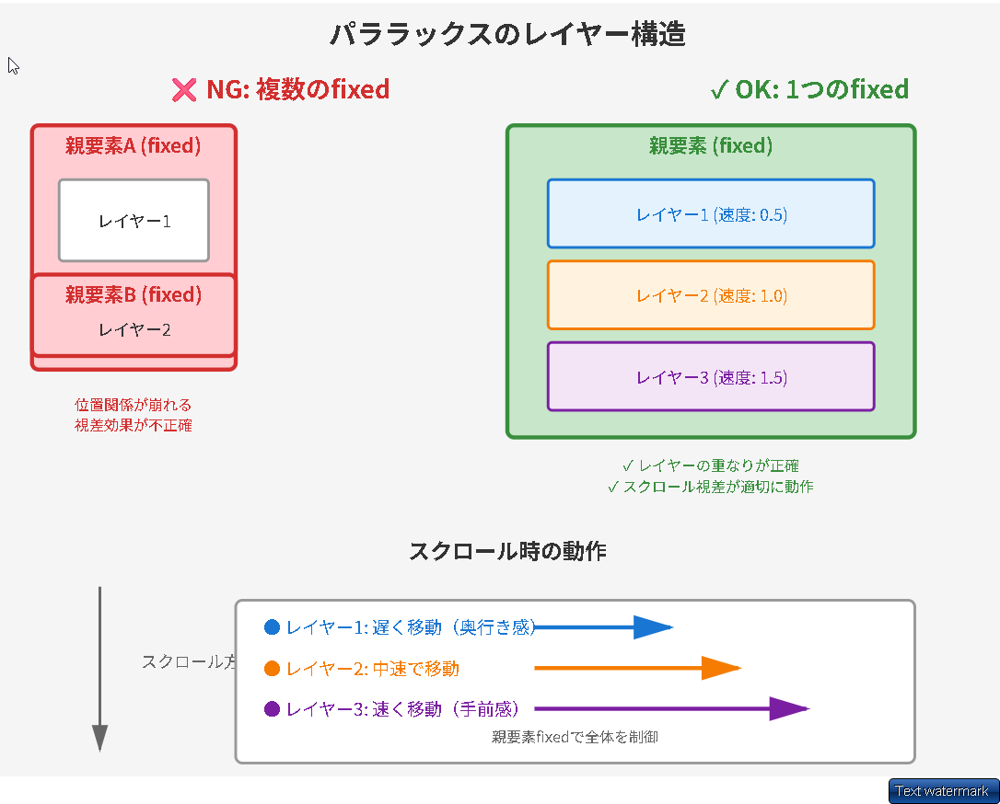


## フレックスボックスにするか、アブソリュートにするかの切り分け

・固定メニュー（ヘッダーがあるような）があって, がある場合、position absolute,　

・ ただ、Flexboxでも、右は下開始、左は上開始とか、そういった柔軟性はある。


## 要素を隠して特定のアクションで出力させたい場合、

```css
.reason_card {
  height: 20rem;
  background: #fff; 
  width: 50%; 
  opacity: 0; ★これでかくしておく。JavaScriptでオンにするまで
  transition: all 0.5s ease-out;　★表示する速度を決める
}

.reason_card--right {　　★これは左右で二つ表示部分があるので、クラスをわけている。
  border-radius: 2rem 0 0 2rem;
  margin-left: auto;　　★ここは直接的に関係ないが、
  　　　　　　　　　　　　左の隙間をすべて埋めるときにこうすると便利。
  transform: translateX(100%); /* ★右に隠す */
}

```

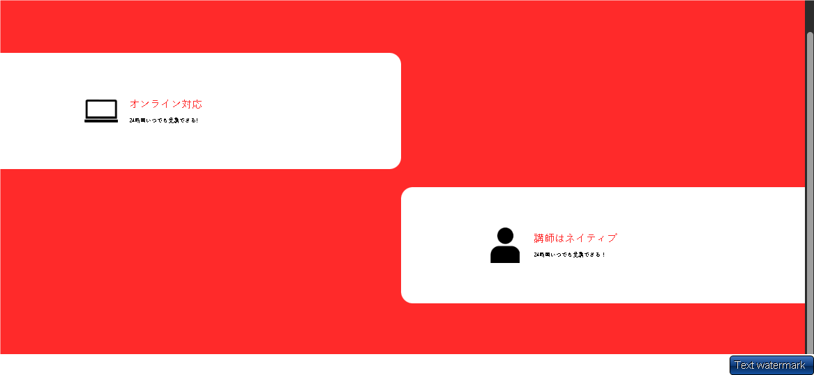


## 専門用語

1. お互いに会話している形式
UIデザインでは一般的に**「吹き出し形式」や
「チャットUI」**と呼ばれます。

2. 脇からひゅーっと出る動き
「スライドイン (Slide-in)」**と言います。

3. CTA（Call To Action）は、日本語で「行動喚起」と呼ばれます。

Webサイトにおいて、訪問者に特定の行動（購入、資料請求、会員登録、お問い合わせなど）を促すためのボタンやリンクのことです。


## JavaScriptとHTMLの関係性

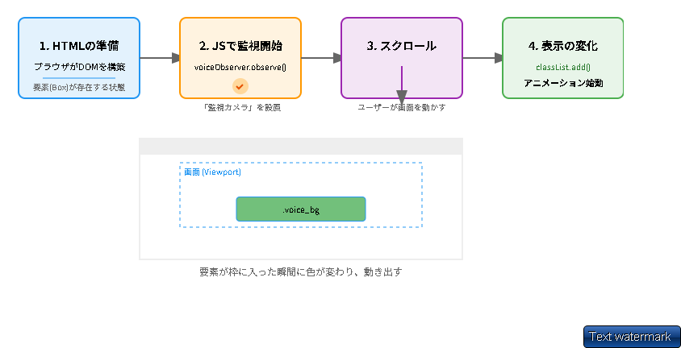


## 親要素でFlexをかけたときに子要素の幅を指定することが可能


```css


.reason_card {
  display: flex; /* 画像とテキストを横並びにする */
  height: 8rem;
  align-items: center; /* 上下中央揃え */
  justify-content: flex-start; /* ★centerからflex-startに変更 */
  background: #fff; /* 背景を白くする */
  padding: 3rem 3rem 3rem 0rem; /* ★左側のパディングを少し増やして位置を調整 */
  width: 90%; /* カードの幅 */ ★ここで子要素の幅を指定する
  opacity: 0; /* JSで表示するまで隠す */
  transition: all 0.5s ease-out;
  border: 0.5rem solid orange;
  }

```


## javaScriptの基本(学習)

```javascript
`値を取得`
$(window)
$(this)

`メソッド`
fadeIn();  画面に表示

----------------------------------------
特定の位置までスクロールしたら要素をフェードイン
// スクロール位置が **520px** に達した際に、
// jQueryの `fadeIn` を使ってふわっと表示させる。
$(window).on("scroll", function () {
  if ($(this).scrollTop() > 520) {
    // #headerはロゴのハンバーガーの親要素
    $("#header").fadeIn();
  } else {
    $("#header").fadeOut();
  }
});

```

## Flex wrapや2つの列を構成する場合、以下のように作成すると良い。

```css
/* 外側（li）で幅を決める */　★あまり意味はない。li は「箱を2列に並べる係」、img は「箱の中で画像をきれいに見せる係」

ようするに　item で２列にして
下で画像を一杯にひろげる（そんなに意味はない）

.gallery_item {
  width: 48%;
  margin-bottom: 6rem;
}

/* 画像でwidth・heightを指定 */
.gallery_img {
  width: 100%;        /* 親（li）いっぱい */
  height: 250px;      /* 高さ固定 */
  object-fit: cover;  /* 比率を保ちつつ、はみ出た分を切る */
}
/* ✨


```

## 文字を中央によせる。（ボックスを中央によせる。フォントサイズ自体をボックスにする）

```html
<section id="information">
  <h1 class="section_title">
    <p class="section_title_text">INFORMATION</p>
  </h1>
</section>
```

```css
.section_title {
  text-align: center;　★中央に寄せたいときはて、本体ではなくて親要素でする。
  margin-bottom: 5rem;
}

.section_title_text {
  display: inline-block;  ★インラインブロックが要素とwidthを一緒にする。
  position: relative;
  color: #fff;
  font-size: 6rem;
  letter-spacing: 0.25em;
  padding-bottom: 0.35em; /* 文字と線の間 */
}

.section_title_text::after {
  content: "";
  position: absolute;
  left: 0;
  bottom: 0;
  width: 100%; /* 文字幅ピッタリ */
  height: 2px;
  background: #fff;
}

```


追加分★★★★★-----------------------

##  住所は<address>タグで囲む

##  共通のクラスを作成した際に一部だけ変更することができる。書き方は以下のようにする。

共通クラス
.section_title {
  text-align: center;
  margin-bottom: 5rem;
}

一部だけ変更したいクラス。このように親のクラス（大事！）をかくことによって、上書きできる
.access_content .section_title {
  margin-bottom: 1rem;
}


## どこを今作業しているか迷うことがあるので、その時には画面、「CSS・画面・HTML!」でリンクを辿ることにする。


## CSSにクラスを書くときは補完(サジェスト)を利用する。クラス名をコピーして、エンターを押して、上のクラス名にまたカーソルを戻す。


##  住所は<address>タグで囲む

##  共通のクラスを作成した際に一部だけ変更することができる。書き方は以下のようにする。

共通クラス
.section_title {
  text-align: center;
  margin-bottom: 5rem;
}

一部だけ変更したいクラス。このように親のクラス（大事！）をかくことによって、上書きできる
.access_content .section_title {
  margin-bottom: 1rem;
}


## どこを今作業しているか迷うことがあるので、その時には画面、「CSS・画面・HTML!」でリンクを辿ることにする。


## CSSにクラスを書くときは補完(サジェスト)を利用する。クラス名をコピーして、エンターを押して、上のクラス名にまたカーソルを戻す。

## モバイルにして、アニメーションなどで画面が広がってなおらない場合は、Windowsの横幅が、規定のサイズをこえて全体によこにそれたら、隠す処理をいれる

  html,
  body {
    overflow-x: hidden;
  }


## 📌 transitionの第1引数は「変化させたいCSSプロパティ名」（自由な名前ではない）

【結論】
`transition: ○○ 0.5s ease` の「○○」には、CSSに存在するプロパティ名を書く。
自分で好きな名前を付けるのではなく、「このプロパティが変わったらアニメーションしてね」という指示。

【具体例】
```css
transition: width 0.5s ease;            /* 幅の変化 */
transition: transform 0.5s ease;        /* 移動・回転の変化 */
transition: opacity 0.5s ease;          /* 透明度の変化 */
transition: background-color 0.5s ease; /* 背景色の変化 */
transition: all 0.5s ease;              /* 全プロパティまとめて */
```

【補足】
- `all` を指定すると全部まとめてアニメーションするが、意図しない変化もアニメーションされるので注意
- 複数指定したいときはカンマで区切る：`transition: width 0.5s, opacity 0.3s;`


## transition: width 0.5s ease　**CSSの`transition`プロパティ**について解説

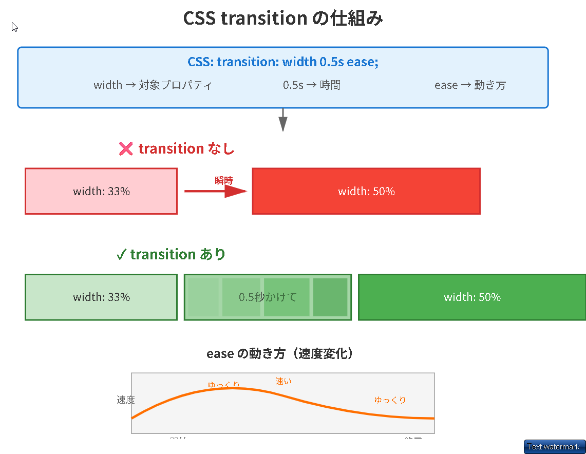

[プレビュー](http://localhost:8080/preview-20260214-025304.html)

.mainvisual_img {
  width: 33%;
  height: 100vh;
  /* ↓ これがあると、JSの変更が「アニメーション」になります */
  /**
    transition: width 0.5s ease; 　★
## 何をしているか

JavaScriptで要素の`width`（横幅）を変更したとき、**瞬時に切り替わるのではなく、なめらかにアニメーションさせる**設定です。

## 仕組み

transition: width 0.5s ease;

この1行で：
- **`width`** → 横幅が変化したときに
- **`0.5s`** → 0.5秒かけて
- **`ease`** → 滑らかに（最初と最後がゆっくり）

アニメーションします。

## 具体例

// JSでwidthを変更
element.style.width = '50%';

- **transitionなし** → 33%から50%へ瞬時に変わる
- **transitionあり** → 33%から50%へ0.5秒かけてなめらかに広がる

つまり、**JSで値を変更するだけで自動的にアニメーション効果が付く**ようにするCSSの設定です。
*/


}

## javascriptスクロールをしても、文字が表示されない。

理由
```javascript
$(window).on("scroll load", function () {
  if ($(this).scrollTop() > 100) {
    $("#site_title .site_title_text").addClass("is-show");
  } else {
    $("#site_title .site_title_text").removeClass("is-show");
  }
});

```
scroll ・・・これだけの場合、画面の途中にいても、そこからスクロールした時しか表示されない。

load・・・これがあることによって、
一度チェックを行い、「あ、今すでにスクロール位置が100pxを超えてるな」と判断してタイトルを出してくれます。

この2つをセットで書くことで、**「いつ、どのタイミングでページを開いても、正しい表示状態にする」**ことができます。

[プレビュー](http://localhost:54321/preview-20260215-031026.html)

★スクロールとロードの違い
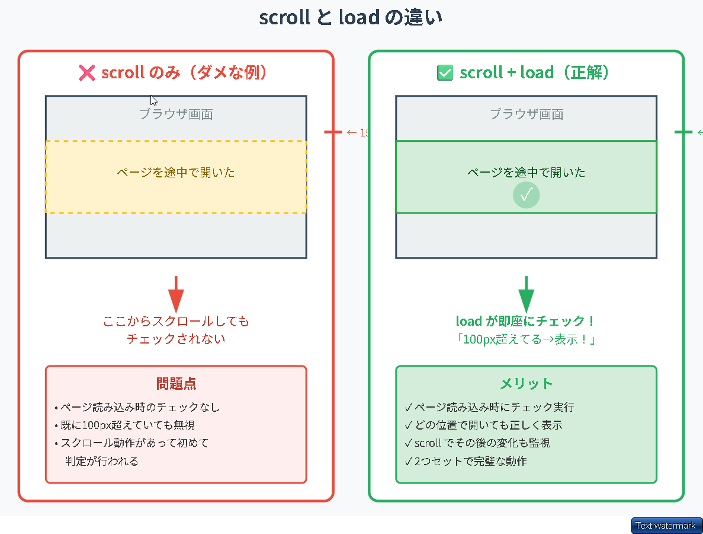


this・・・の中の this
window（ブラウザの画面全体）を指します。

on(イベント名)・・・「〜のとき（イベント発生時）に、この処理を実行せよ」という予約命令です。

`つまり、「画面がスクロールされたときに、その画面自身のスクロール量を取得する」という意味になります。`
（
◎発火タイミング: 画面を「スクロールした時」または「読み込みが完了した時」
◎実行条件: 画面全体（this）のスクロール量が 100px を超えているかどうか
◎処理内容: 条件を満たせばクラスを追加し、満たさなければ削除する）


## aタグに▢で囲むとき、paddingではなくてwidthで横幅を指定する方法

```css
  .contact_msg {
    display: block;(いままでinline-blockだった。)

    width: 100%;
    padding: 4rem 0;
```

ディスプレイをブロックして
widthを１００％にすることによって、画面一杯まで広がる

なぜサイズが一致するのか
`<a> や <span> は「インライン要素」であり、中身の文字数分の幅しか持ちませんが、block に変えることで「一つの大きな箱（ブロック）」になります。`


---

# ━━━━━━━━━━━━━━━━━━━━━━━━━━━━━━━━━━
# 🔴 z-index 問題（統合版）
# ━━━━━━━━━━━━━━━━━━━━━━━━━━━━━━━━━━

## 📌 よくある症状
★要約

親にpoisiton:fixedなどのパララックスをつけたら、親も子も
z-indexをつける。これは必ず対にする！

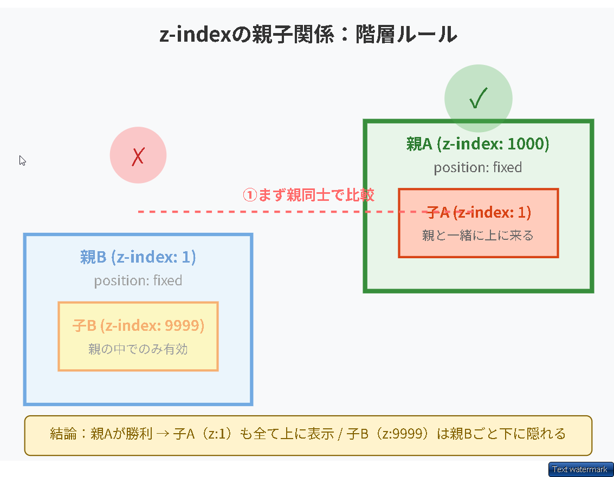


- ハンバーガーメニューがクリックできない
- 要素が他の要素の下に隠れる
- 検証ツールでは押せるのに実画面では押せない
- モーダルやオーバーレイが最前面に来ない

---

## 🔍 原因パターン

### パターン1：親にz-indexがない
```css
/* ❌ ダメな例 */
#header {
  position: fixed;
  /* z-index なし → レイヤー比較に不参加 */
}
.hamburger {
  z-index: 9999; /* 子だけ指定しても意味なし */
}
```

**重要ルール：**
- `position: fixed` の要素は **z-indexを持たないとレイヤー比較に参加しない**（★つまり対で意味がある！！必ず対にする！）
- 子要素に `z-index: 9999` があっても、**親が参加してないと負ける**
---


### パターン2：fixedの親子関係

★基本は親がfixedでその子要素で親要素のなかに
配置するのが基本だから（headerとハンバーガーメニューのように）　
➡　親position : fixedで子はabsoluteにする。

```css
/* ❌ 問題が起きるケース */
/* 親要素：幅 300px、子要素：width 100% + position: fixed */
/* → 子はビューポート基準になり、親の幅が無視される */

.parent {
  width: 300px;
  position: fixed;
}
.child {
  width: 100%;
  position: fixed; /* ← これが原因 */
}
/* 理由：fixedは親要素ではなくビューポート（ブラウザ画面全体）を基準にするため、親要素の幅設定が効かなくなります */
``

**解決策：**
```css
.parent {
  position: fixed;
  width: 300px;
}

.child {
  position: absolute; /* fixed → absolute に変更 */
  width: 100%;        /* これで親の幅が効く */
}
```
  * position: absolute への変更と役割について:
  * 1. 違い： `fixed` は画面全体が基準になるため親の幅を無視しますが、 `absolute` は親を基準にするため親の幅（300px）を守れます。
  * 2. 重要性： 親の箱の中に収めつつ、自由な位置に配置したいなら `absolute` 指定が必須です。

---
### パターン3：位置が画面外
```css
/* ❌ 画面外にあってクリックできない */
.hamburger {
  position: fixed;
  top: -100px; /* 画面の上に隠れてる */
  z-index: 9999;
}
```

→ DevToolsで位置を確認する

---

## ✅ 正しい修正方法

### 1. 親にz-indexを追加
```css
#header {
  position: fixed;
  z-index: 9000; /* ← これで前面に出る */
}
.hamburger {
  z-index: 100; /* 親よりは小さくてOK */
}
```

---

### 2. z-index値の目安
```css
/* 推奨値（プロジェクト内で統一する） */
.main-content {
  z-index: 1;      /* 通常コンテンツ */
}
.fixed-header {
  z-index: 100;    /* 固定ヘッダー */
}
.overlay {
  z-index: 800;    /* オーバーレイ（黒マスク） */
}
.modal {
  z-index: 900;    /* モーダル */
}
.hamburger-menu {
  z-index: 1000;   /* ハンバーガーメニュー */
}
```

### 3. pointer-eventsも併用（推奨）
z-index で重なり順を決めても、「透明なのにクリックを邪魔して下のボタンが押せない」 
というトラブルを防ぐために、この none と auto の切り替えは必須のテクニックです。`とくにオーバレイで使用`

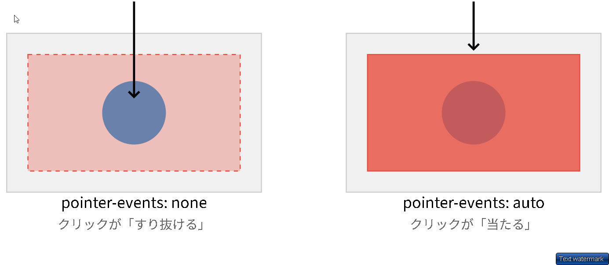

```css
.hamburger {
  position: fixed;
  z-index: 1000;
  pointer-events: auto; /* クリック可能にする（その要素を 「マウスや指で触れる状態（通常の状態）」 に戻す設定です。） */
}
背景を黒くする（普段は隠す）
.overlay {
  position: fixed;
  top: 0;
  left: 0;
  width: 100%;
  height: 100vh;
  background-color: rgba(0, 0, 0, 0.5); /* 半透明の黒 */
  z-index: 800; /* メニュー(1000)より低く、コンテンツ(1)より高く */

  /* 通常時は透明で、かつクリックをすり抜けさせる */
  opacity: 0;
  pointer-events: none; 
  transition: opacity 0.3s;
}

.overlay.open {
  /* メニューが開いたとき：表示してクリックもガードする */
  opacity: 1;
  pointer-events: auto; 
}
```

→ z-indexだけでも回避できるけど、**pointer-events併用が一番安全**

---

## 🔧 デバッグ手順

### 1. DevToolsで確認
1. 要素を右クリック → 検証
2. Computed タブ → z-index の値を確認
3. 親要素も同様に確認

### 2. チェックリスト
- [ ] 親要素に `position` と `z-index` があるか？
- [ ] 子要素の `position` は `absolute` か？（fixedじゃないか）
- [ ] 要素が画面外にないか？
- [ ] 他の要素の `z-index` が大きすぎないか？

---

## 📝 覚えておくこと

1. **`position: fixed` + `z-index` でレイヤーになる**
2. **親に z-index がないと子も道連れで負ける**
3. **検証ツールで押せるのに実画面で押せない → z-index か位置を疑う**
4. **迷ったら z-index: 300 以上をうたがう**
5. **fixedの親子関係では、子は `absolute` にする**

---
トの使い方」セクション


## javaScript バブルソート法

```javascript
function sortArrayAsc(arr) {
  for (let i = 0; i < arr.length - 1; i++) {
    for (let j = 0; j < arr.length - 1 - i; j++) {
      // もし左の数値と右の数値が左の数値が大きい場合、入れ替えを行う
      if (arr[j] > arr[j + 1]) {
        let saveBox = arr[j];
        // 入れ替え。大きいデータを右に移動
        arr[j] = arr[j + 1];
        arr[j + 1] = saveBox;
      }
    }
  }
  return arr;
}
```
【プロンプト】
これが理解できないから、SVGでイメージを作成してもらえる？iとかjのながれがわからない

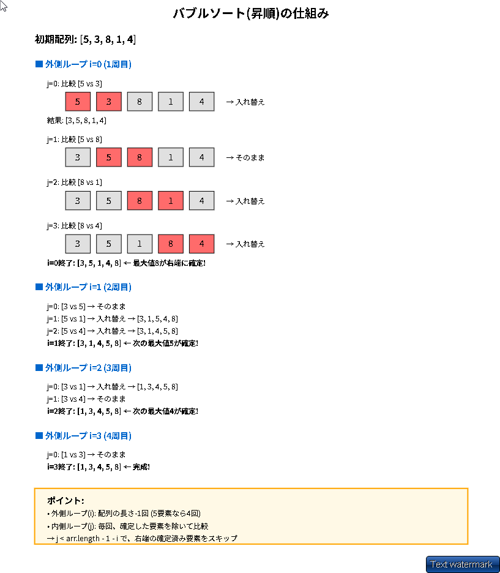


## 実務（コーディング）着手前の準備・手順


### 1. 【現状分析】デザインカンプの把握
*   **共通項の抽出**: 全体のデザインを俯瞰し、共通サイズ・整列ルール（Grid）・共通パーツを洗い出す。
（## 共通化する部品はは、部品なので、マージンとかボトムとかできるだけつけないようにする。）

*   〇**ギミック確認**: アニメーションやホバー時の挙動を事前にすべてチェックする。　特に以下のサンプルをみて、z-indexをきめておく

*   **アナログ出力**: 可能であれば印刷。`section事に開始時に構成をたてる。しかも言葉にしておくことでかってにAIがロジックを作成してくれる`手書きで「構造」や「気づき」を書き込むことで理解を深める。⇀`チェックも大事　ベストプラクティス`


### 2. 【タスク管理】仕様のチェックリスト化
〇（仕様書がある場合）`sankou` フォルダに資料を集約し、AI（Claude Code 等）に読み込ませる準備を行う。

*   [ ] **URL情報**: デモサイト、参考URL（デザイン）
*   [ ] [ ] **ビジュアル資料**: 全体スクリーンショット、
*   [ ] **機能要件**: 実装すべき仕様の一覧


### 3. 【AI・効率化】ツールの活用
スクリーンショットを Gemini 等の AI に投げて初期解析・雛形作成を依頼する。
*   **解析範囲**: 「全体図」で全体像を、「細部図」で複雑な箇所の構造を理解させる。
*   **指示出し**: 特徴的な箇所だけメモ（.txt で可）にまとめ、AI に添付。指示と同時に AI に作業進捗を管理（チェック）させる。


### 5. 【設計ルール】レイアウト設計
*   **柔軟な配置**: 同一画面内の要素幅は原則 `%` を使用し、柔軟に並ぶように設計する。
*   **クラスの分離**: 全体の半分（50%）などの基本割合は共通クラスとし、特殊な箇所は個別クラスで上書きして管理する。

*   **クラスの分離**: 共通の変数は、ルートにかきこんでおく。
・コンテンツ幅が指定されている場合は以下のようにかく（デザインの基本として、**「背景（色や画像）」は画面いっぱいの全幅（100%）に広げ、「実際の中身（テキストやカードなど）」はコンテンツ幅（86rem）**に収めて中央に配置します。）

```css
:root {
  /* ▼ ここで「var(--sidebar-width)」を一括管理！ */
  --sidebar-width: 15rem;
}
.aa{
  left: var(--sidebar-width);
}

/* 例：各セクションの共通設定（必要に応じて追加） */
.voice_bg, 
.overview_bg, 
.cta_bg, 
.footer_link_container {
  max-width: 86rem; /* これが「コンテンツ幅 860px」 */
  margin-left: auto;
  margin-right: auto;
}
```

```html
<div class="menu-wrap">
    右
    <div class="menu-col menu-left">　★★ここがポント共通項目とそれ以外をわける
      <div class="menu-section">
        <h3>Coffee</h3>>
      </div>
    </div>
    左
    <div class="menu-col menu-right">

```

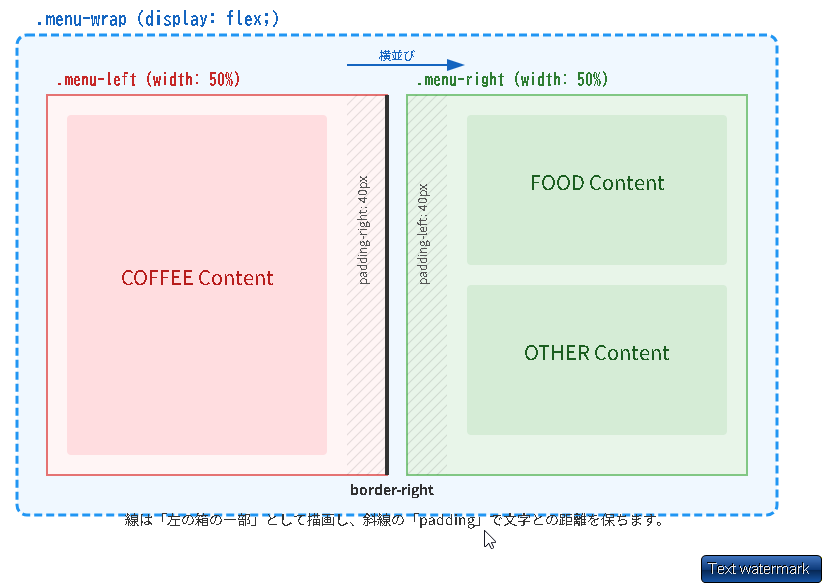

`【ループ】`


★セクション単位でAIにチェックをしてもらう。
あと、３７５REMにして明らかにおかしいところを
修正する
・センターになっていないとか

★まず、PCを完璧に仕上げる。位置とかいい。⇀後戻りがかなり増えるので！！
▢アニメ―ションが正しく動作しているのか。開始位置は問題ないか。


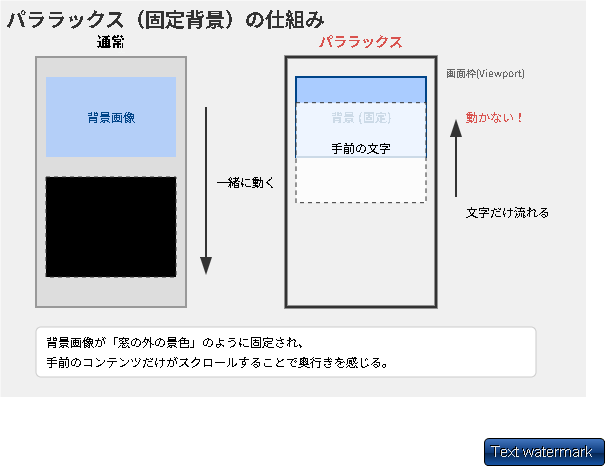


`【コメント】`
・flex なども含めて、サジェストしてくれるのでコメントは詳しく書く
（すべてを書く必要はない。relative と flex はかく）
・  /* ┌─────────────────────────────────────────┐
   │ セクション　 BBBが選ばれる理由　　 背景赤で左右からスライドイン
   └─────────────────────────────────────────┘ */

セクションのコメント直感的にイメージできるぐらい記載する。

`【セマンティック】`

基本的にリスト、複数ならぶものは以下でまとめる
```html
<ul>
  <li>
    
  </li>
    
```

`備考`
・HTML Validato
https://validator.w3.org/nu/#textarea　

・CSS Validator（W3C）
https://jigsaw.w3.org/css-validator/ 

・JSHint
https://jshint.com/ 


`★10分でよいので画面のセクションを`
`自分でイメージできるように暗記する。　かなりスピードに関係する`


`★画像を一つ一つサイズをそろえるより、％で合わせる、サイドのパディングなどが`
`正しければほぼデザインカンプ通りに数値になる`

※専門用語を覚える
・固定サイドメニュー
・逆台形
・グラデーション
・疑似要素（ただの飾り (要素としての意味のないものに使用する。アイコン、下線、枠、吹き出しの三角)
・パララックス（Webデザインにおいて、手前の要素（テキスト等）と奥の要素（背景画像）が異なる速度で動くことを利用して、画面に「奥行き」や「立体感」）
・無限スライダー


【最終チェックリスト】
▢　AIチェック
▢　github,ビジュアライザー,sankouフォルダは削除されているか。
▢　各チェックサイトは通っているか
▢　javaScriptで指定する場合だけ、idをつかう。


## 【前提】ヘッダーを固定して、その中でロゴとメニューを左右に並べたい」という場合、以下のルールになります。（つまりfixedとフレックスボックスを併用する際にきをつけること）

1. (fixedではないflexBox)親ボックスの中に、❌子fixedは置かない⇀　子のfixedが優先されて、意味がなくなるため。
2. しかし、`親が（fixed且つ、flexBox）だったら、子はそれに引きずられてfixedと同じ効果になって ⭕子fixedはよい`。

イメージ図

× ダメなパターン
親（Flex）：「整列して！」
子（Fixed）：「無視！俺は画面の端っこに張り付くぜ！」（親の箱から飛び出す）

〇 正解のパターン
親（Fixed兼Flex）：「俺が画面に張り付く！ 子要素たちはそのまま俺の中で並べ！」
子供たち：「はい！（親の箱の中で、指示通り横に並びつつ固定される

（親fix/flex）で子は、(abosoluteは可能⇀一応子も固定される)

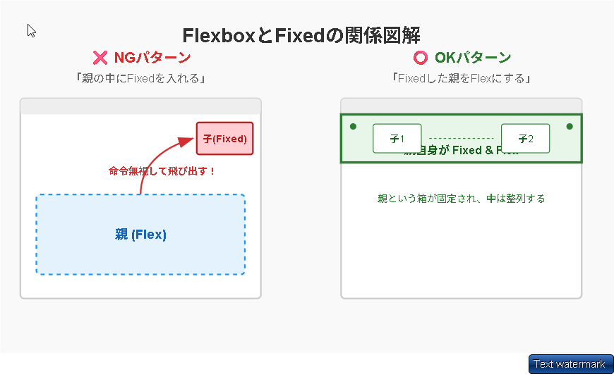


## videoなど画像を使う際は、 比率を保ってトリミングするために、heightとwidthを指定した上で、object-fit: cover;を利用する

そうしないと、画像のアスペクト比とずれていた場合でも、伸び縮みすることなく綺麗にうつる。

➡でもよくわかってないからSVGにして
だって、サイズ指定していたら、アスペクト比がずれていたら、枠のなかにはいらなくて、一部画面からきれたりしない？つまり一部の画像がきれて、全ての像がもれなく綺麗におさまるってことにならなくない？

➡おっしゃる通りです！「全ての像がもれなく収まる」わけではなく、**「枠（箱）からはみ出た部分は切り捨てられる（トリミングされる）」**のが object-fit: cover の仕組みです。


## パディングとマージンの違い
1  ボックス自体のサイズはかわらない
2. margin で確保した部分は「ボックスの外側」になる
3. その「外側」の部分は .feature_item の背景色（白）が塗られない 
4. 結果、親要素（.feature_area や body）の背景色が見える ❌


## 構文　プロパティ　ロジック
`display: none`
・  display: none; /* 初期状態では非表示 */
➡  display: block; /*表示 */

`pointer-events`
・　pointer-events:none: 要素を「すり抜け」させます。透明なオーバーレイなどが背後にあるボタンなどのクリックを邪魔しないようにするために使います。

➡pointer-events:auto:　通常の状態に戻します。メニューが開いた時など、再びクリックに反応させたい場合に使います。


【具体的な問題】
特に、「見た目は透明（opacity: 0）だけど、実際には画面を覆っていて裏側の要素が押せない」といったトラブルを解決するために不可欠な設定です。

例）1. ハンバーガーメニューの背景マスク（オーバーレイ）
状況: メニューが開いた時に画面を暗くする div 要素（.overlay や .mask）が、画面全体を覆うように配置されている。
問題: メニューを閉じた際、opacity: 0（透明）にしただけだと、「透明な巨大な壁」が画面の一番手前に居座り続けます。 その結果、背後にあるはずのサイトのボタンやリンクが一切クリックできなくなります。
解決: 非表示時に pointer-events: none を指定することで、クリック操作を下の要素へ「突き抜け」させます。


## grid（flexも同様）でレイアウトすると、３列などサイズがきまっている。その場合、画像で固定サイズ指定する（固い箱のようなもの,rem通りにうまく動作しない）と、３列の幅いにあわずくずれることがある。そのため画像は％で指定するとよい。％なら、問題なく動作する。

`画像は％で指定するとよい（width: 100%）。 その際、高さは必ず height: auto にする。`（そうしないと画像がビヨーンと縦に伸びて変形してしまうから）

質者・画像サイズがデザインカンプととこなる。

例）

```css
/* レスポンシブ対応の画像基本セット（Grid/Flex共通） */
.feature_image {
  width: 100%;       /* 親要素（Grid/Flexの枠）の幅に合わせる */
  height: auto;      /* 幅に合わせて高さも自動調整（比率維持） */

  aspect-ratio: 3 / 2;   /* 【重要】横3:縦2 の比率で枠を確保する */

  object-fit: cover; /* 枠からはみ出る分はトリミングして埋める */
  display: block;    /* 画像下の謎の余白を消すおまじない */
}
```

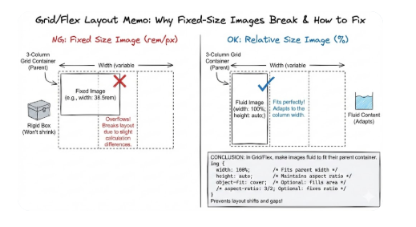


## 可変REMをつかうなら

可変rem使用時	　　　　　　 % or 100% が安全 ✅
固定rem（1rem=10px固定）	rem固定でもOK
見本のCSS	max-width:      100% + %指定


## スライダーについて。３つの画面の一緒に画面に表示、

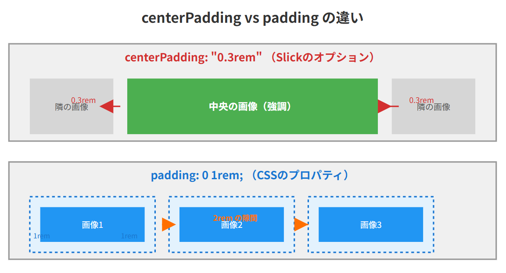

★javaScriptの「slidesToShow: 3」とする。常に３つの画像が画面に表示される。そこでimgの幅を１００％で自動的に均等に割り振られることになる。
画像を均等に中央に配置されることになる。


```css


.slider {
 width: 100%;
}

.slider img {
  width: 100%;
  height: 24rem;
  padding: 0 1rem; /* 左右に余白を追加 */
  box-sizing: border-box; /* paddingを幅に含める */
}
```

```javascript
$(function () {
  $(".slider").slick({
    arrows: false,
    autoplay: true,
    adaptiveHeight: true,
    centerMode: true,
    centerPadding: "0.3rem",
    slidesToShow: 3,
    responsive: [
      {
        breakpoint: 768,
        settings: {
          slidesToShow: 1,
          centerMode: true,
          centerPadding: "5rem",
        },
      },
    ],
  });
});
```

javascriptの「centerPadding」と、CSSの「パディングの違い」

・両社の違い
centerPadding・・・中央を強調	  隣をチラ見せ（0.3remだけ画像をよこから見せる）
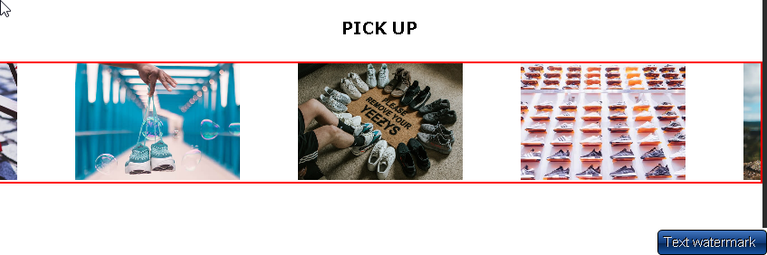  この画像のようにサイズをあげることによって、画像が小さくなり、横のチラ見できる量が増える

padding	・・・画像に隙間	  均等な隙間
つまり二つ組み合わせる。　基本二つのサイズが一緒になることが多いような気がする。


★タブレットにするとずれる。メディアクエリが`767px`
`494`でづれいている。


▢うっかりミス

もしもずれていると, ある特定の位置になると, 画面のサイズ位置がおかしくなる.だから特定の位置だけ, サイズに違和感を感じたら, スタイルCSSと合っているかを確認する. style.cssのサイズとメディアクエリのサイズが異なっていた。


## 実際の画面を模写する場合。
・検証ツールで、cssフォルダのutilityなどのフォルダから
⇀メディアクエリ
⇀コンテンツ幅
⇀セクションの余白
⇀共通の項目
⇀印刷してflexや、abosoluteの構造「勉強中」

などを特定する

・検証ツールで、「要素タブ」を指定し、フレックスを利用しているところを調べる。
・定数をソースのCSSから取得してきて、どこで利用しているかざっくりしらべる。
大体セクション間や、ヘッダーとか。その程度でよし。


## fixed absolute で縦と横をやるときは、  transform: translate(-50%, -50%);　ひとつでまとめないといけない。
★つまり正しく動作しない場合は、同じプロパティがないかチェックする

## <span>は「文の中の一部分だけ色を変えたい」みたいな時に使うものだよ。

## <section class="about_area container_section">
基本のサイズ幅を設定していく　container_section⇀ここにはマージン等を設定。


##  Flex 2階層(階段式)で下揃えするテクニック。かつ、左右の高さをかえる。

Flexで、二段階でflex横並びにしてflex-endをすると両要素が下揃えになる。しかし片側の子要素をheightが100%場合、実際下揃えにならない。「上に子要素が吸い付く。
その場合は孫要素にmargin-top: autoをつけることによって解決する。

【吸い付く理由】子要素の縦フレックスでflex-startがデフォルトになるため、上に配置される
（`justify-content: flex-start` がデフォルト）

【なぜ１００％にするか】親要素の高さ一杯にをあわせるため。`子要素はflexではデフォルト要素分しか高さがない`　height: 100% を指定することで親要素の高さ一杯にひろがる。

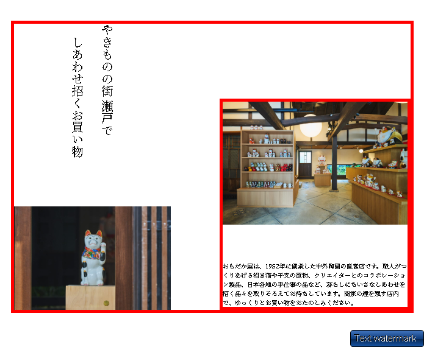

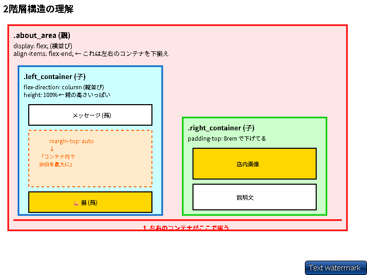 

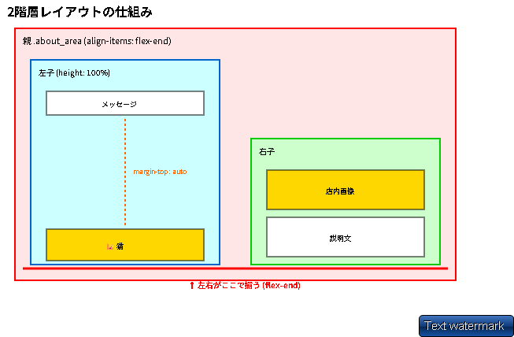

📝 簡潔メモ
🎯 今回の学び：2階層レイアウト
階層構造


親 (.about_area) 
├─ 左子 (.left_container)
│  ├─ メッセージ
│  └─ 猫
└─ 右子 (.right_container)
   ├─ 店内画像
   └─ 説明文
コード

```css
/* 親: 左右を下揃え */
.about_area {
  display: flex;
  align-items: flex-end; /* 左右コンテナを下揃え */
  min-height:60rem 　✖これだと左を１００%にしたとき、基準がないためひろげられない。　height:60rem など固定にする
}

/* 子: 高さ確保 */
.left_container {
  height: 100%;          /* 親の高さいっぱい */
  display: flex;
  flex-direction: column;　★この設定だと左側だけ上に要素があつまる。
}

/* 孫: 下に押す */
.left_cat_img {
  margin-top: auto;      /* 上の余白を最大に */
}
```


## 📌 flexbox子要素を親の高さ100%にする方法 CSS
例）同じボックス内に段差などある場合
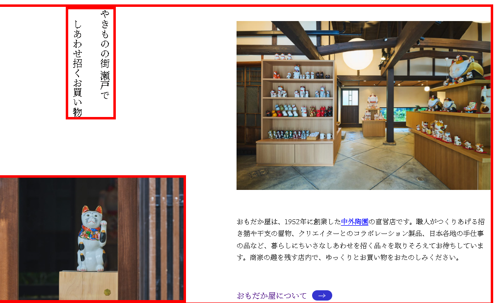

【結論】
- 親に具体的な高さ（`height`）が必要
- `min-height` だけでは子の `height: 100%` が効かない
- `align-self: stretch` で親の `align-items` を個別に上書き可能
（
設定	　　　　　　　意味	　　　　高さの決まり方
min-height: 60rem	最低60rem確保	内容次第で変動
height: 　　60rem	　必ず60rem	　固定値
➡ `子の height: 100% は 固定値が必要`

➡ min-height は「可変」なので基準にできない）

【具体例】
```css
/* ❌ 効かない */
.about_area {
  display: flex;
  align-items: flex-end;
  min-height: 60rem; /* ← これだけだと子がheight: 100%にならない */
}

.left_container {
  height: 100%; /* 効かない */
}
```

```css
/* ✅ 効く */
.about_area {
  display: flex;
  align-items: flex-end;
  height: 60rem; /* ← 具体的な高さを指定 */
}

.left_container {
  align-self: stretch; /* align-items: flex-endを上書き */
  height: 100%; /* これで親の高さいっぱいに伸びる */
}
```

【補足】
- `min-height` は最小高さの指定で、内容に応じて伸びる
- 子要素の `height: 100%` は親の確定した高さを参照
- `align-self` で個別の子要素だけ配置を変更可能


## アニメーションの付け方　後ろに吸い込まれるような

`親要素、

```css
/* └ 左がメッセージと猫画像列 【縦flex】 */
.left_container {
  display: flex;
  flex-direction: column;
  align-items: center;
  height: 100%;
  overflow: hidden;　★これをつけることによって、最初画像が大きくなりすぎない`
}

/* 左下の猫 */
.left_cat_img {
  margin-top: auto;
}
/* 左下の猫 */
.left_cat_img.animate {
  /* forwardsは一回だけinfiniteだと何度も繰り返す */
  animation: slideshow 3s forwards; /*★これで３秒のスライドショーが粉われる　★forwardsは一回限り */
  width: 100%;
  height: auto;
}


★ここで時間ごとの表示の設定　３秒でどう動かくか。
@keyframes slideshow {
  0% {
    opacity: 1;
    transform: scale(1.1); /* 最初は少し大きく */
  }
  5% {
    opacity: 1;
  }
  25% {
    opacity: 1;
    transform: scale(1.05); /* 少し縮小 */
  }
  100% {
    opacity: 1;
    transform: scale(1);
  }
```

```javascript

window.addEventListener("scroll", function () {
  // スクロールがstore_img要素に到達したか確認

  // store_img要素を取得
  const storeImg = document.querySelector(".store_img");
  const manekiNekoImg = document.querySelector(".left_cat_img");

  // 要素の位置を取得(Bounding・・・境界　RectはRectangle・・・座標・大きさ)
  const rect = storeImg.getBoundingClientRect();
  // 要素の位置を取得(招き猫)
  const rectManekiNeko = manekiNekoImg.getBoundingClientRect();

  // ウィンドウ（表示領域）の高さを取得
  const windowHeight = window.innerHeight;

  // 要素の上端がウィンドウの下端に到達したか確認
  if (rect.top <= windowHeight) {
    // アニメーションを開始
    storeImg.classList.add("animate");
  }

  // 要素の上端がウィンドウの下端に到達したか確認(招き猫)
  if (rectManekiNeko.top <= windowHeight) {
    // アニメーションを開始
    manekiNekoImg.classList.add("animate"); ★ここでクラスをつける
  }
});

```


## 要素の中の文字の高さを調整する

```css
  line-height: 2rem;
```


## 検証ツールの味方
・オレンジ・・・・マージン


## なぜなにもないところでパディングをするか。親にパディングをすることで全体にかかるので一元管理できるのと、グリッドやカード系のレイアウトでは親にパディングするのはほぼ定番パターンです。


・ひとつにパディングをする→かける場所はセクション全体
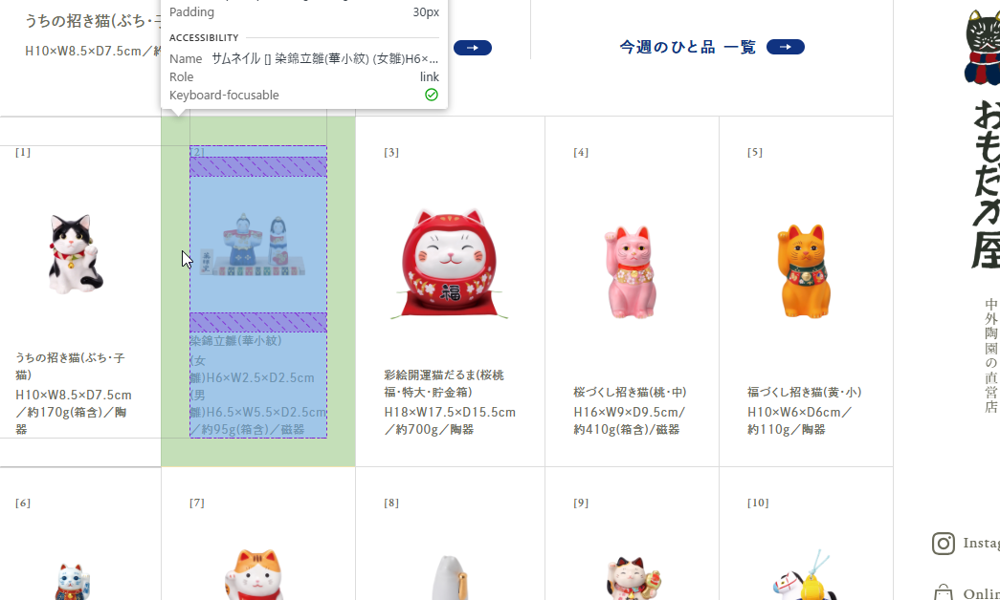


## 画像がない場合は、WEBをひらいて、「新しいtabで画像を開く」でやるとURLでわかる。「https://omodakaya.jp/wp/wp-content/uploads/2026/02/%E3%81%82_%E8%83%8C%E6%99%AF%E3%81%AA%E3%81%97.png」このように　wp-contentなどあればワードプレスの画像


## 縦線を書きたい時、かつボックスのサイズなどとちがってボーダーライトでかけないとき。疑似要素で表示する　aaaa::after 

```css
.weekly_product::after {
  content: "";
  position: absolute;
  right: 0;
  top: 50%; ★　開始位置をずらすことによって中央によせる
  transform: translateY(-50%);
  height: 80%;
  width: 0.1rem;
  background-color: rgb(231, 225, 225);
}
```

## 幅がひろいwidthを文字は文字幅にあわせる
width: fit-content;

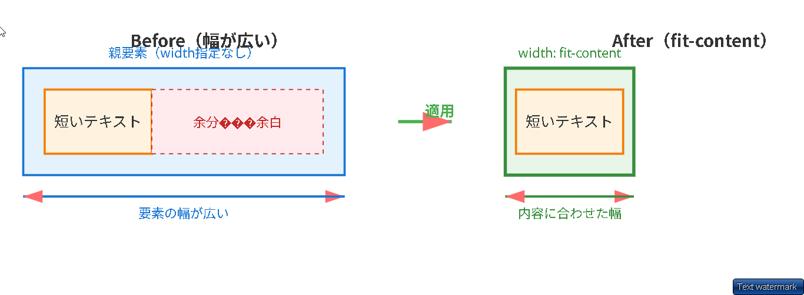

## display:inline_flexと　display:blockの違い。
・display:blockにすると改行がはいってしまい。
下に並ぶ

・inline-flexをすると横にならぶ
# 具体例

## display: block の場合
<div style="display:block">ボタン1</div>
<div style="display:block">ボタン2</div>
<div style="display:block">ボタン3</div>
**結果：**
ボタン1
ボタン2
ボタン3
縦に並ぶ

---

## display: inline-flex の場合
<div style="display:inline-flex; gap:10px">
  <div>ボタン1</div>
  <div>ボタン2</div>
  <div>ボタン3</div>
</div>
**結果：**
ボタン1  ボタン2  ボタン3
横に並び、gap で間隔調整可能


・さらにflexの役割もあるのでgapなで並べるとよい。
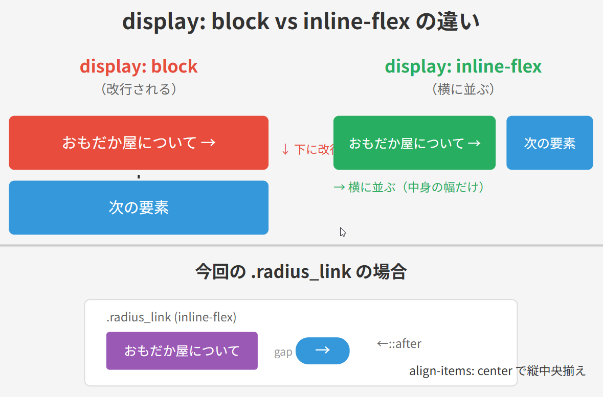


##　flexboxとabsoluteの使い分け
・親に overflow: hidden あり	flexbox ✅
（要素を飛び出す場合があるから、flexboxなら飛び出してよい）
・要素を自由に重ねたい	absolute ✅
モーダル・ツールチップ	absolute ✅

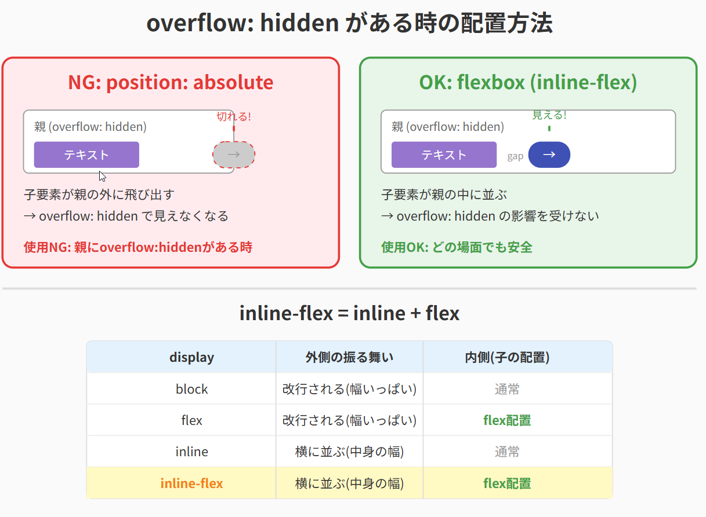

★　absolute/fixed:** 親要素からはみ出した部分が`切り取られて見えなくなります`
`
- **flexbox:** 通常のレイアウトなので、はみ出した部分も表示されます（意図通りに配置可能）

**具体例：**
.parent {
  overflow: hidden;
  position: relative;
}

.child-absolute {
  position: absolute;
  top: -50px; /* 親の外に出る → 見えない ❌ */
}


## このCSSコードは、**Flexboxコンテナの子要素を縦方向（交差軸方向）に引き伸ばして、コンテナの高さいっぱいに広げる**設定です。

align-items: stretch;

.container {
  display: flex;
  height: 200px;
  align-items: stretch; /* 子要素が200pxの高さになる */
}

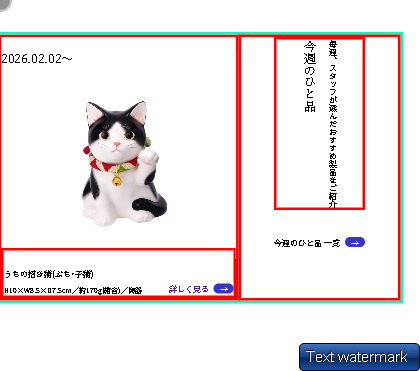


## 要素のなかの矢印などを縦中央、横中央にもってくる　子要素がなくても大丈夫。
<!-- インラインが子要素となる。 -->

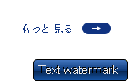

```html
<div class="news_link_container">
  <a href="#" class="news_link_msg">もっと見る</a>
  <a href="#" class="news_link">→</a>
</div>
```

```css
.news_link {
  display: block;
  height: 1.5rem;
  width: 3.5rem;

  color: white;
  background-color: rgb(60, 40, 189);
  border-radius: 2rem;

  ★以下の３行★   子要素「⇀」の位置を変える。
  display: flex;
  align-items: center;
  justify-content: center;
}
```

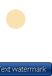


## フレックスの子要素は画像などのもとサイズより小さくならない。例えば画像など大きいサイズをうめるときに、想定した配置にならないときは、
.a{
display flex
}

.b{
flex:2;
min-width: 0;　をつける
}

以下。「地図画像」が画面の幅よりおおきいとき！
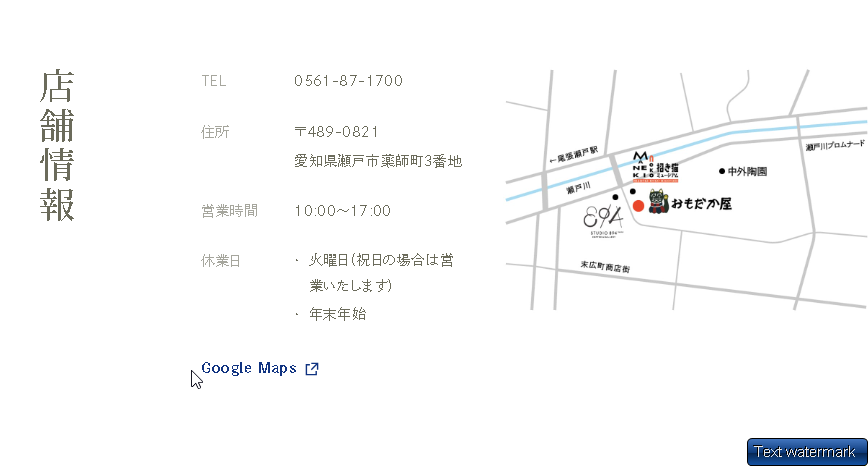


## インライン要素をインライン要素やテーブルセルの垂直方向の配置を指定するCSSプロパティ

 <a href="#" class="google_link">Google Maps</a>

```css
.icon_newtab {
  display: inline-block;
  vertical-align: -0.2rem; ★　これでインライン要素の「縦」位置をかえれる
  margin-left: 0.5rem;
  width: 1.2rem;
  height: 1.2rem;
}
```


## 特定のセクションの下に同じ位置に配置したい場合は、新たにセクションの下にdivをつけることも考える。
    <section>
    </section>

    <!-- ２段目【flex 2列: 店舗情報の枠確有り/枠のみ　アクセス情報のみ】 -->
    <div class="access_container">

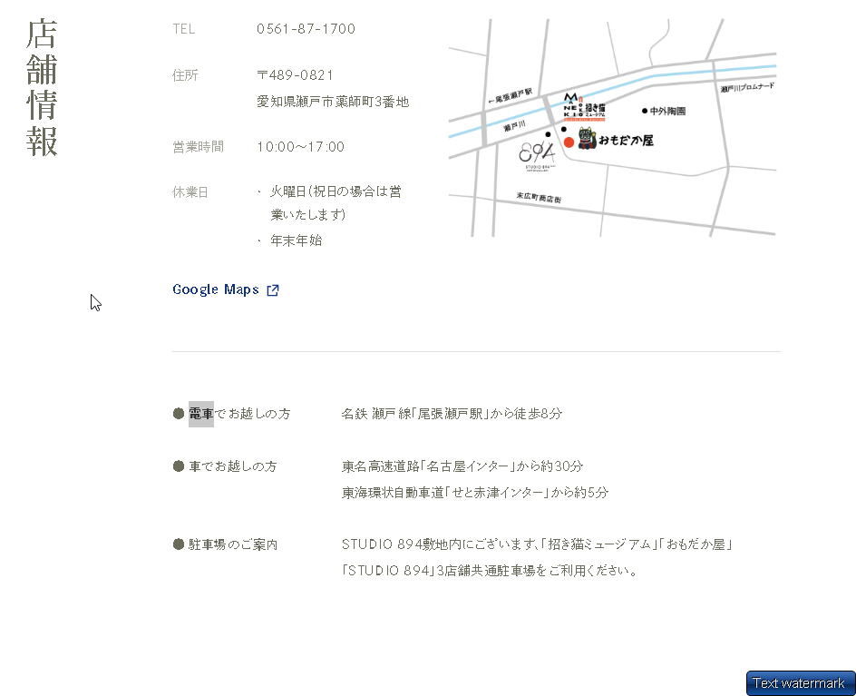


## フレックスの片方の幅が固定で、残りを幅をすべて等び省略した場合は以下のようにする。
widthとflexを利用する。

.access_by {
  width: 15rem;
  font-size: 1.4rem;
  margin-bottom: 3rem;
}

.access_by_detail {
  flex: 1;
  font-size: 1.4rem;
  margin-bottom: 3rem;
}


📋 今回の学び
❌ 間違い（列ごとにまとめる）

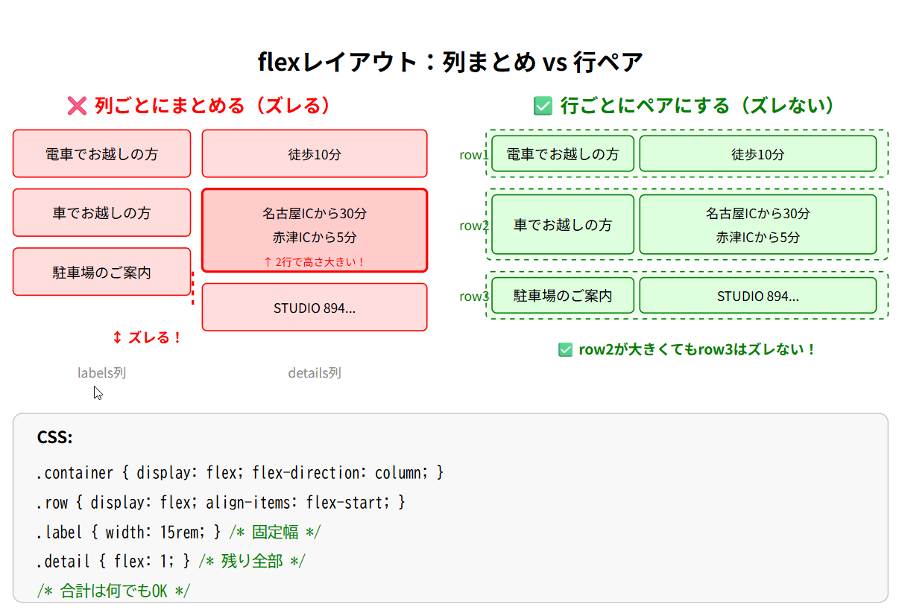

<div class="container">
  <div class="labels">        <!-- ラベル列 -->
    <p>電車でお越しの方</p>
    <p>車でお越しの方</p>
    <p>駐車場のご案内</p>
  </div>
  <div class="details">       <!-- 詳細列 -->
    <p>徒歩10分</p>
    <p>名古屋ICから30分<br>赤津ICから5分</p>  ← 2行で高さズレる
    <p>STUDIO 894...</p>
  </div>
</div>
➡ 2行目の高さが変わると3行目がズレる

## （行ごとにペアにする）

<div class="container">
  <div class="row">
    <p class="label">電車でお越しの方</p>
    <p class="detail">徒歩10分</p>
  </div>
  <div class="row">
    <p class="label">車でお越しの方</p>
    <p class="detail">名古屋ICから30分<br>赤津ICから5分</p>
  </div>
  <div class="row">
    <p class="label">駐車場のご案内</p>
    <p class="detail">STUDIO 894...</p>
  </div>
</div>

.container { display: flex; flex-direction: column; }
.row       { display: flex; align-items: flex-start; }
.label     { width: 15rem; }    /* 固定幅 */
.detail    { flex: 1; }         /* 残り全部 */
💡 ポイント3つ
#	内容
1	ラベルと詳細は同じ行（row）にペアで入れる
2	ラベルは width: 固定値 で揃える
3	詳細は flex: 1 で残りスペースを自動で使う」

[プレビュー](http://localhost:54321/preview-20260215-041759.html)


## 横スクロールアニメーション（無限ループ）


---

# ━━━━━━━━━━━━━━━━━━━━━━━━━━━━━━━━━━
# 🔖 覚えておくと便利なCSSプロパティ集
# ━━━━━━━━━━━━━━━━━━━━━━━━━━━━━━━━━━

```css
/* クリック制御 */
pointer-events: none;        /* クリックを無効化（すり抜け） */
pointer-events: auto;        /* クリックを有効化（通常状態） */

/* 選択制御 */
user-select: none;           /* テキスト選択を禁止 */
-webkit-user-select: none;   /* Safari対応 */

/* スクロール制御 */
overscroll-behavior: contain;  /* スクロール連鎖を防ぐ */
scroll-behavior: smooth;       /* スムーズスクロール */
scroll-snap-type: x mandatory; /* スナップスクロール（横） */
scroll-snap-align: start;      /* スナップ位置 */

/* テキスト */
text-overflow: ellipsis;     /* はみ出したテキストを...に */
white-space: nowrap;         /* テキストを改行させない */
word-break: break-all;       /* 単語の途中でも改行 */
line-clamp: 3;               /* 3行で切り捨て */
-webkit-line-clamp: 3;       /* Safari対応 */

/* 表示/非表示 */
visibility: hidden;          /* 非表示だが場所は確保 */
opacity: 0;                  /* 透明だが場所は確保 */
display: none;               /* 完全に非表示 */

/* 位置調整 */
object-fit: cover;           /* 画像をトリミングして埋める */
object-fit: contain;         /* 画像をそのまま収める */
object-position: center;     /* 画像の基準位置 */

/* レイアウト */
aspect-ratio: 16 / 9;        /* アスペクト比を固定 */
place-items: center;         /* Grid/Flexで中央配置 */
gap: 2rem;                   /* Grid/Flexの隙間 */
isolation: isolate;          /* 新しいスタッキングコンテキスト作成 */

/* 境界 */
box-sizing: border-box;      /* パディング込みでサイズ計算 */
outline: none;               /* フォーカス枠を消す */
resize: none;                /* textareaのリサイズ禁止 */

/* 背景 */
background-size: cover;      /* 背景画像を隙間なく埋める */
background-position: center; /* 背景画像の位置 */
background-attachment: fixed; /* 背景を固定（パララックス） */
backdrop-filter: blur(10px); /* 背景をぼかす */

/* アニメーション */
will-change: transform;      /* GPUアクセラレーション有効化 */
transform: translateZ(0);    /* 3D変換を強制してGPU使用 */
backface-visibility: hidden; /* 裏面を非表示（ちらつき防止） */

/* その他 */
cursor: pointer;             /* マウスカーソルを指に */
cursor: not-allowed;         /* 禁止マーク */
appearance: none;            /* デフォルトスタイルを無効化 */
-webkit-appearance: none;    /* Safari対応 */
mix-blend-mode: multiply;    /* ブレンドモード */
filter: grayscale(100%);     /* グレースケール */
clip-path: circle(50%);      /* 円形に切り抜き */
writing-mode: vertical-rl;   /* 縦書き */

/* Flexbox高度 */
flex-shrink: 0;              /* 縮小を禁止 */
flex-grow: 1;                /* 伸縮を許可 */
flex-basis: 0;               /* 初期サイズを0に */
order: -1;                   /* 並び順を変更 */

/* Grid高度 */
grid-auto-flow: dense;       /* 隙間を詰める */
grid-template-columns: repeat(auto-fit, minmax(200px, 1fr)); /* レスポンシブグリッド */

/* モバイル対応 */
-webkit-overflow-scrolling: touch;  /* iOSの慣性スクロール */
-webkit-tap-highlight-color: transparent; /* タップ時のハイライト消去 */
touch-action: pan-y;         /* 縦スクロールのみ許可 */

/* パフォーマンス */
contain: layout style paint; /* レンダリング最適化 */
content-visibility: auto;    /* 見えない部分の描画をスキップ */
```


## AIへのコメントの指示：CSSにコメントを書いてもらうとき

ここ、ソースみてHTMLも、直感的にわかりやすいコメントつけたして

小カテゴリを以下のように記載するのもてです。　自由にきめてください。
/* ═══════════════════════════════════════════════════════════════════════
   【親】右サイド固定ヘッダー全体（<header id="side_area">）
   画面右端に固定される白い縦長エリア
   ═══════════════════════════════════════════════════════════════════════ */

## 隣接要素
/* ハンバーガーメニューがオープンしたら背景が白の目次のページを表示する。 */
.hamburger_menu.open + .side_nav_overlay {
  display: block;
}


```css 補足
/* + : 直後の1つのみ */
.hamburger_menu.open + .side_nav_overlay { display: block; }

/* ~ : 以降の全兄弟 */
.hamburger_menu.open ~ .side_nav_overlay { display: block; }
```


CSSでは**隣接兄弟セレクタ（`+`）** を使うこと���、特定の要素の**直後にある兄弟要素**のスタイルを変更できます。

このコードの場合：
- `.hamburger_menu.open` の状態が変わると
- その**直後の兄弟要素** `.side_nav_overlay` のスタイルが変わる

ただし、CSSで操作できるのは：
- ✅ 隣接する兄弟要素（`+`）
- ✅ 後続の兄弟要素（`~`）
- ✅ 子孫要素（` `や`>`）

逆に操作できないのは：
- ❌ 親要素
- ❌ 前の兄弟要素

つまり、**CSS単体では「後方・下方向」の要素しか操作できません**。
*/


## 3000万円控除　不動産

不動産	" 最終的に手元に残る金額に対する控除。利益、不動産屋に対する手数料とか、更地も含むのかな？そういった手数料を抜いて、3000万円利益が残った場合、控除がタダになるってこと。 

原則は、家が建っていない「更地」では控除は使えない 。

しかし、以下の三つをみたしていればうれる
・家を取り壊した日から1年以内に、土地の売買契約を結ぶこと 。

・（お母様が）家に住まなくなった日から3年目の年末までに売ること 。

・家を壊してから売買契約の日まで、その土地を駐車場などで貸していないこと（事業に使っていないこと） 。"


## 軽減税率の特例	不動産	

"◉売った家の所有期間が10年を超えている場合 、上記の3,000万円控除を使った後、残った利益（6,000万円以下の部分）にかかる税率が通常より安くなります 。

まず、利益から**「3,000万円特別控除」**を使います 。
そして、控除した後の**「残りの利益」（6,000万円以下の部分）に対して、「軽減税率」**が適用されます 。
その税率は、資料によると10%（ほかに住民税4%）です 。

例）

 4,900万で売れました。更地にするとか不動産手数料がかかり、かかった上で実際入った利益に対しての税に対して3000万円控除が適用されますってことでしょ。さらに3000万円以上の利益にたいしても１０年すんでれば、それを超えるものに対しては軽減税率が適用されるかもしれないってこと？　だから更地、手数料はもちろんかかる


"
## 相続税	不動産

"相続税 → 3,000万＋600万×人数（3人なら4,800万）までは税金なし

家を売るときの3,000万控除 → 売った利益用の別ルール

❗ この2つは「足し算」ではなく、まったく別の税金の仕組み"

## 相続するとき注意したいこと。 不動産 	

相続	もしも自分が相続したら、その年の年末調整の収入が大幅に増えるため、税金が増加する。税金が増加するため、母親名義で売った方がいい。そして、母親名義で売るということは、自宅にいる人が家を売るということであり、3000万円控除も利用できるという理由から、2つの理由から母親が相続人になった方がいい
/* ✨
# 結論：**間違いが多く含まれています**


/* ✨
# 不動産相続の正しい知識

## 基本の誤解を解消
- **相続しても給与所得は増え���い**。相続税と所得税は別物
- 相続財産は年末調整とは無関係

## 居住用不動産の3000万円控除
- **実際に住んでいた人**だけが利用可能
- 母親が住んでいるなら、母親が売却すれば控除を受けられる

## 誰が相続すべきか
- **配偶者控除**（1.6億円まで非課税）は有利だが、母親が亡くなる時の**二次相続**で子供の税負担が重くなる可能性あり
- 一次相続で子も一部相続する方が、トータルの税負担が少ない場合も多い

## 結論
**家族構成・財産額・居住状況で最適解は異なる。必ず税理士に相談を**
*/


## flex-shrink: 0;の説明  html

## 意味
**要素を縮小させない**という指定です。

## 使��道
- Flexboxレイアウトで、親要素の幅が足りなくなった時の動作を制御
- デフォルトは `flex-shrink: 1`（縮小する）
- `0` にすると、**どんなに狭くなっても元のサイズを保つ**

## 具体例
.item {
  flex-shrink: 0;  /* この要素は縮まない */
  width: 200px;    /* 常に200pxを維持 */
}

**使うシーン：**
- アイコンやボタンのサイズを固定したい
- 画像が潰れるのを防ぎたい
- サイドバーの幅を保ちたい
*/


## CSS JUMP ツール

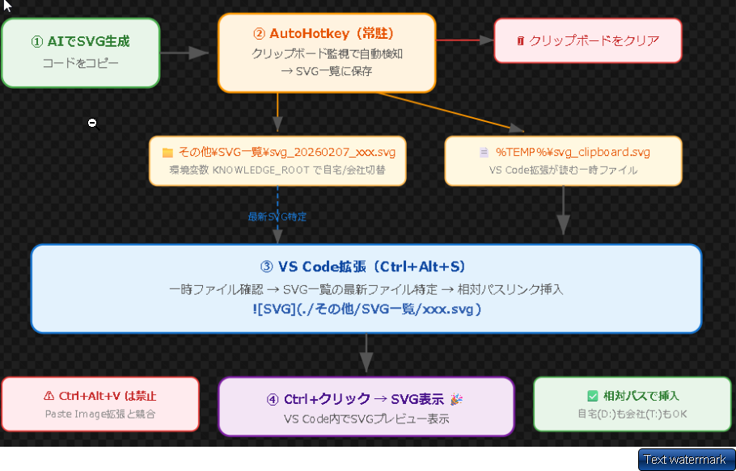

拡張機能の説明は、取説参照


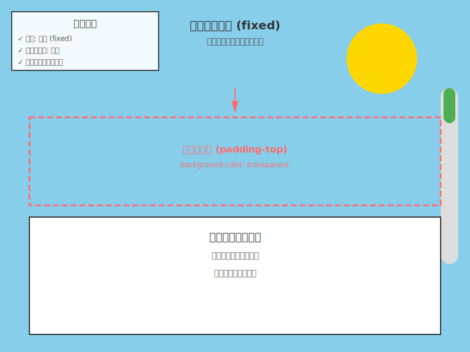


## JavaScript が正しく動作しません。新しいライブラリを追加したものの動作しないのはなぜでしょうか。 html

答えは、ライブラリを script タグで囲む必要があったからです。実際に動作するスクリプトとライブラリのスクリプトを、それぞれ別々に囲む必要があります。

```html
<!-- JavaScript -->
<script src="js/shuffle-text.js"></script>
<script>
  const text = new ShuffleText(document.querySelector("#myText"));
  text.start();
</script>
</body>
```


## 📌 パララックス　position: fixed と子要素の関係 html


★一番これが参考になる。パララックスイメージ
[プレビュー](http://localhost:54321/preview-20260216-012708.html)

【結論】
親が fixed で、子は relative や absolute のようなことができるということです。

別に親は relative である必要はなく、fixed があれば relative の代わりになりつつ、本来の fixed としての意味（固定）も持たせられる、といった形になります

- 親が固定されると、子も一緒に固定される
- fixed は relative の代わりになる + 固定機能も持つ


【具体例：固定背景のパララックス】
```html
<div class="particle-bg">       <!-- fixed -->
  <div class="house"></div>      <!-- relative -->
</div>
```

```css
.particle-bg {
  position: fixed;   /* 画面に固定 */
  top: 0; left: 0;
}

.house {
  position: relative; /* 親の中で配置 */
  /* fixed 不要！親と一緒に固定される */
}
```

【補足】
- fixedは親1箇所のみ
- 子に fixed を付けると親を無視して画面全体を基準に固定される
- パララックスは transform: translateY() で実装

【子のpositionによる違い】
| 子の position | 基準 | 親のpositionを見る？ |
|---|---|---|
| `absolute` | 親（fixed/relative/absolute）を基準に配置 | ✅ 見る |
| `relative` | **自分の元の位置**からずれるだけ | ❌ 見ない |

- 親が `fixed` → 子の `absolute` は親を基準に配置される（`relative` の代わりになる）
- 親が `fixed` → 子の `relative` は自分の元の位置基準（ただし親ごと固定はされる）
- `fixed` / `relative` / `absolute` どれでも子の `absolute` の基準になれる。`static`（デフォルト）だけがなれない


## Claudecodeのスキルズへの追加方法

・～.claude\skills\memo-format\SKILL.md

に追加する。

サンプル-------------------

# 出力先
d:\50_knowledge\01_memo.md に追記

---
name: memo-format
description: 学習メモを指定フォーマットで作成
triggers:
  - メモ作成
  - 学習メモ
  - フォーマットで
---

# 学習メモフォーマット

【結論】
要点を簡潔に

【具体例】
```コード例```

【補足】
- 箇条書き


例）
----------------------------

## 📌 パララックスのシンプルな作り方 html


実際の画像にちかい
[プレビュー](http://localhost:54321/preview-20260216-225151.html)

★なぜリラティブなのか！？
[プレビュー](http://localhost:54321/preview-20260215-035655.html)


【結論】
固定背景 + スクロール前景の2層構造で視差効果を作る

1. 大きくDivセクションを2つ作る
   (a) 1つは背景画像
   (b) 1つは前面画像
2. 1つ目の背景画像には、position: fixed で固定配置させる
3. 2つ目の前面の方には、あえて position: relative を付けて、z-index で前面に持ってくるようにする

暗記ポイント
background-attachment: fixed = `画像`専用の簡単な方法
position: fixed = 要素そのものを固定する汎用的な方法
覚えなくていいこと：z-indexの具体的な数値（-1とか1とか）
➡
普通の背景固定 → background-attachment: fixed（こっちが基本）
動く背景が必要な時だけ → position: fixed + z-index

[プレビュー](http://localhost:54321/preview-20260216-225151.html)
[プレビュー](http://localhost:54321/preview-20260215-035655.html)


あとはJavaScript(`transform: translateY()` )で調整します。

【具体例】
```html
<!-- ➀背景画像（固定） -->
<div class="particle-bg">
  <div class="house-illustration"></div>
</div>

<!-- ➁前面画像（スクロール） -->
<div class="parallax-container">
  <section class="parallax-section">
    <!-- コンテンツ -->
  </section>
</div>
```


```css
/* ➀背景：画面に固定 */
.particle-bg {
  position: fixed;
  z-index: -1;  /* 背景に配置 */
}

/* ➁前面：z-indexで前面に */
.parallax-container {
  position: relative;  /* z-indexを有効化 */
  z-index: 1;          /* 前面に配置 */
  padding-top: 100vh;  /* 最初は背景だけ表示 */
}
```

----------------------------

## 📌 particles.js の基本構成 ライブラリからスライドなどの実装をする場合（星座のような背景）　html

【結論】
CDN読込 → HTML要素準備 → particlesJS()で初期化の3ステップ


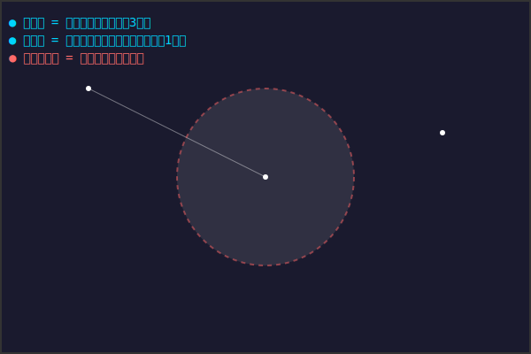

【具体例】
```html
<!-- ➀要素準備 -->
<div id="particles-js"></div>

<!-- ➁CDN読込 -->
<script src="https://cdn.jsdelivr.net/particles.js/2.0.0/particles.min.js"></script>
```

```javascript
/* ➂初期化（script2.js） */
particlesJS("particles-js", {
  particles: {
    number: { value: 80 },           // パーティクル数
    shape: { type: "circle" },       // 形状：円
    size: { value: 3 },              // サイズ：3px
    line_linked: {
      enable: true,                  // 線接続ON
      distance: 150,                 // 接続距離150px
      color: "#ffffff",              // 線色：白
      opacity: 0.4,
      width: 1
    },
    move: {
      enable: true,
      speed: 6                       // 移動速度
    }
  },
  interactivity: {
    events: {
      onhover: { enable: true, mode: "repulse" }  // ホバーで反発
    }
  }
});
```

【補足】
- 第1引数：対象要素のid名（`particles-js`）
- 第2引数：設定オブジェクト
- CDN v2.0.0使用（jsdelivr配信）
- ホバー効果は `repulse`（反発）/ `grab`（つかむ）などが選択可能


## 📌 javaScriptでボタンを追加した際に、ループでそれぞれのボタンを追加した際に、アドイベントリスナーをつけても、該当のボタンがおせない。イベントが発火しない。

ループごとにconstで定義しないと初期化されないため。

変数を宣言していないかった。


## ライブラリのファイルを読み込む時、CDNなどはかならずjsの上に記述する。

```html
    <script src="https://cdn.jsdelivr.net/particles.js/2.0.0/particles.min.js"></script>
    <script src="js/particle_setting.js"></script>
```

## 📌 clamp() が効かないときのデバッグ手順（2026-02-26）

【結論】
clamp()が効かない原因は「構文エラー」か「他のCSSに負けている」の2つ

【具体例】
```css
/* ❌ calc()なし → 無効 */
font-size: clamp(10px, (10 / 1280 * 100vw), 14px);

/* ✅ 事前計算が確実（10 ÷ 1280 × 100 = 0.78125） */
font-size: clamp(10px, 0.78125vw, 14px);
```

【デバッグ手順】
1. DevToolsで取り消し線があるか確認
2. 取り消し線あり → 構文エラー or 他のCSSが上書き
3. 構文が正しいのに効かない → CSSファイルを1つずつ外して原因特定
   - 今回: reset.css の `font-size: 100%` が同じ詳細度で勝っていた

【補足】
- `()` だけでは計算されない。`calc()` が必要
- 同じ詳細度なら後に読み込んだCSSが勝つ（はず）
- それでも効かないときはCSSを1つずつ外して切り分ける


## 📌 clamp() は font-size 以外にも使える（padding, gap, margin 等すべてのサイズ系プロパティ）

【日付】2026-02-26
【結論】
clamp() は font-size 専用ではない。padding, gap, margin, width, height 等、サイズ系プロパティならどこでも使える。
「画面幅に応じて変化させたいけど、大きくなりすぎ/小さくなりすぎを防ぎたい」ときに使う。

- clamp() は **つけたプロパティにしか効かない**
- rem を使う限り、html の font-size 変化の影響を受ける
- 止めたいプロパティには **個別に** clamp() で制限が必要

【具体例】
```css
/* html の font-size を clamp で制御 */
html {
  font-size: clamp(10px, calc(10 / 1280 * 100vw), 16px);
}

/* ❌ font-size だけ clamp → padding/gap は膨張し続ける */
.menu_nav_list {
  font-size: clamp(1rem, calc(16 / 1280 * 100vw), 16px); /* 止まる */
  padding-top: 10rem;  /* 止まらない！ 10 × 16px = 160px まで膨張 */
  row-gap: 12rem;      /* 止まらない！ 12 × 16px = 192px まで膨張 */
}

/* ✅ 全プロパティに clamp をつける → 全部制限できる */
.menu_nav_list {
  font-size: clamp(1rem, calc(16 / 1280 * 100vw), 16px);
  padding-top: clamp(5rem, calc(80 / 1280 * 100vw), 10rem);
  gap: clamp(4rem, calc(64 / 1280 * 100vw), 12rem);
}
```

【補足】
- DevTools の clamp() 内の取り消し線 → 現在の画面幅で使われていない値を示す（エラーではない）
- 「計算済み」タブで実際の値を確認するのが確実
- html の font-size が clamp で変わる環境では、子要素の clamp で `px` と `rem` を混在させても動く


## 📌 rem 指定で大画面の膨張を防ぐ方法（4つの選択肢）

【日付】2026-02-26
【結論】
rem を使いつつ大画面での膨張を防ぐ最適解は **clamp() の中で rem と px を混在させる** こと。
`clamp(最小rem, 推奨rem, 最大px)` で rem ルールを守りつつ px で上限を決められる。

| 方法 | メリット | デメリット |
|------|---------|-----------|
| ① rem の数値を小さくする | 簡単 | 小さい画面で足りなくなる可能性 |
| ② px に変える | 確実に固定 | rem ルールに反する |
| ③ メディアクエリを増やす | rem のまま対応可 | コード量が増える |
| ④ padding/gap にも clamp() | rem のまま＋制限できる | 計算が少し面倒 |

【具体例】
```css
/* ④ の書き方: rem と px を混在させてOK */
.menu_nav {
  padding-top: clamp(5rem, 10rem, 160px);   /* 160px で止まる */
  row-gap: clamp(4rem, 12rem, 192px);       /* 192px で止まる */
}

/* font-size と同じ考え方 */
.menu_nav_list {
  font-size: clamp(1rem, calc(16 / 1280 * 100vw), 16px);  /* 16px で止まる */
}
```

【補足】
- font-size でやったことと同じことを padding/gap にもやるだけ
- clamp() の3つの値は単位がバラバラでもOK（rem, vw, px 混在可）
- ④が最適解: 会社ルール（rem）を守りつつ、大画面の膨張を防げる


## 検証画面のCSS画面への遷移の仕方、計算済みタブ(Computed)画面からギャップなどをクリックする。 html

ソースが表示されるのでクリック
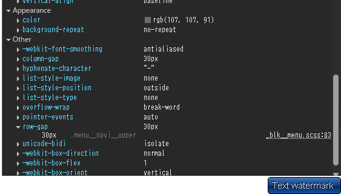

スタイルタブからも可能
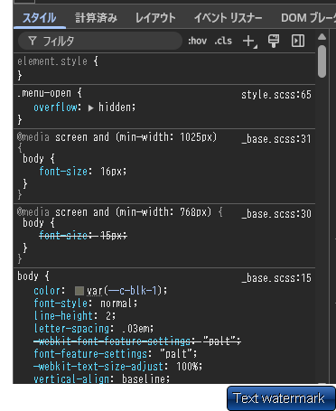


## JavaScriptなどでオープンメニューなどのクラスを追加した際に他のクラスを操作する。　html

`子クラス`（この場合は通常にクラス指定する）
#side_area.open .side_nav_container {


`兄弟セレクタ（~）を使う`(子要素ではない、親が同じ
この場合　 `~ `で兄弟クラスを設定し、さらにそこからの経由で子要素を指定する　`~これで一回親を経由すると考える`) */`
#side_area.open ~ #mainVisual_area .page_container {
  display: none;
}


body（お母さん）
├─ header#side_area（兄）
└─ section#mainVisual_area（弟）
   └─ nav.page_container（弟の子供）

★どのような経由で兄弟、クラスに移動するか！
   [プレビュー](http://localhost:54321/preview-20260215-040633.html)

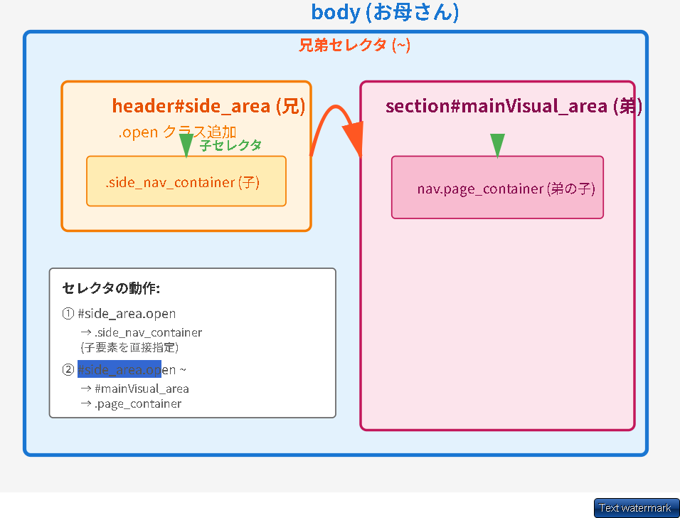
/* ✨
# 回答

**概ね正しいですが、一部表現が不正確です。**

## 正しい点
- `#side_area.open .side_nav_container` は子孫セレクタとして正しい
- `~` は一般兄弟結合子として正しい
- HTML構造の理解は正しい

## 不正確な点

### 「~で一回親を経由する」は**誤り**
- `~` は**親を経由しない**
- **同じ親を持つ後続の兄弟要素**を直接選択する
- `#side_area.open ~ #mainVisual_area` は「openクラスがついたside_areaの**後に続く兄弟**のmainVisual_area」という意味

## 正確な説明
#side_area.open ~ #mainVisual_area .page_container

1. `#side_area.open` を起点に
2. `~` で**後続の兄弟**である `#mainVisual_area` を選択
3. その**子孫要素**の `.page_container` を選択

「親を経由」ではなく「**兄弟関係で横移動**」→「子孫へ降りる」が正確です。
*/


## 📌 ハンバーガーメニュー　兄弟セレクタ（~）でサブメニュー画面表示 html

【結論】
別セクションの要素を消すには兄弟セレクタ（~）を使う。
ハンバーガーメニュークリック時、JSでクラス付与 → CSSで全画面メニュー表示 + 他要素非表示。

【具体例】
```html
<!-- HTML構造 -->
<header id="side_area">         <!-- ここにopenクラス付与 -->
  <div class="side_nav_container"><!-- 通常非表示 → open時に表示 --></div>
</header>
<section id="mainVisual_area">  <!-- 兄弟要素 -->
  <nav class="page_container"><!-- open時に非表示にしたい --></nav>
</section>
```

```css
/* 通常時：サブメニュー非表示 */
.side_nav_container {
  display: none;
}

/* open時：サブメニューを全画面表示 */
#side_area.open .side_nav_container {
  display: flex;
  position: fixed;
  top: 0; left: 0;
  width: 100vw;
  height: 100vh;
  background-color: white;
  z-index: 999;
}

/* open時：兄弟要素の縦書きメニューを非表示 */
#side_area.open ~ #mainVisual_area .page_container {
  display: none;
}
```

```javascript
// JSでクラス付け外し
hamburgerBtn.addEventListener("click", function () {
  hamburgerBtn.classList.toggle("open");
  document.getElementById("side_area").classList.toggle("open");
});
```

【補足】
- `~` = 兄弟セレクタ（同じ親を持つ後ろの要素を指定）
- セクションが違っても、bodyの直下なら兄弟関係
- position: fixed は1箇所のみ（サブメニュー画面のみ）
- z-index で重なり順を制御


## javaScriptのオブジェクトがはいっているかを調べるには html

console.log(typeof ShuffleText);

はいっていれば「function」はいっていなければ「undefined」がかえってくる


## 動画の入れかた

・以下に動画を配置
C:\Users\guest04\Desktop\高橋研三\03_knowledge\その他\00_サンプルソース

・<video controls width="600">
  <source src="../../images/chrome_TVnJAHhbls.mp4" type="video/mp4">
</video>

動画名を指定する。（なおこれは、サンプルソースからみたパス）


## 📌 アニメーションライブラリ デモ管理（Swiper等）skillsの説明 html

【結論】
- `/animation-library-snippet {ライブラリ} {タイプ日本語}` でデモ一式生成
- `index.html` で全ライブラリのデモを一元管理（クライアント向け説明なし）
- ファイル名: `{ライブラリ英語}_{タイプ日本語}.md` （例: swiper_フェード切替.md）
- 必ず4デモ構成（シンプル版→パターン2つ→多機能版）

【具体例：参照場所】
```
# index.html（デモ一覧管理ページ）
\03_knowledge\images\
index.html

# デモHTML（4ファイル）
\03_knowledge\images\
  {library}_demo1_*_simple.html  ← シンプル版（緑枠）
  {library}_demo2_*.html
  {library}_demo3_*.html
  {library}_demo4_*.html

# MDファイル（スニペット）
C:\Users\guest04\Desktop\高橋研三\03_knowledge\その他\00_サンプルソース\
  ★{library}_{タイプ}.md
```

【具体例：コマンド】
```bash
# 新規ライブラリ追加
/animation-library-snippet swiper フェード切替
/animation-library-snippet gsap スクロール連動
/animation-library-snippet anime パララックス

# 生成されるもの
- ★{library}_{タイプ}.md
- 4つのデモHTML
- index.html に新規カード更新
```

【補足】
- デモHTML内に説明パネル禁止（クライアント向けのため）
- 説明は index.html のカードのみ（開発者向け情報）
- シンプル版は必ず最初（学習効率）
- ファイル名は日本語（わかりやすさ優先）
- MD内リンクは相対パス（会社・自宅でパス異なるため）
- パス自動判定機能を `/snippet` と `/memo-format` にも追加済み


## 📌 検証ツールのフレックスボックスの見方、要素、スタイルなどを駆使してフレックスボックスを理解　特に、親spacebetweenで子がflex1の場合 html


## 📌 Flexboxの使い方で、片方はflex1、片方はflexなしの場合、どのような動きをするか。これは隠しメニューなどに使えるので、理解すること。とりあえず上を確保して、下に値があればその分増えていくけど、なければ上の枠で埋め尽くすというイメージ。 html

クラスとプロパティのイメージ
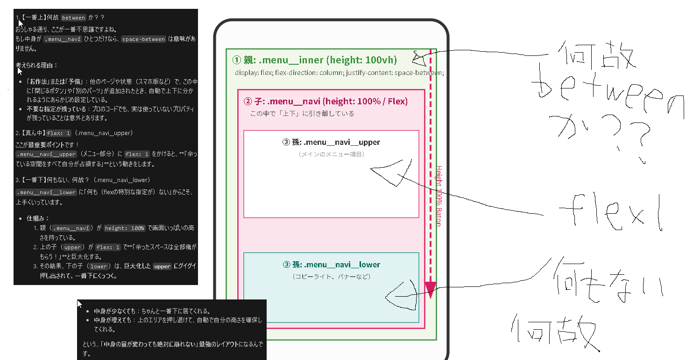


画面イメージ。
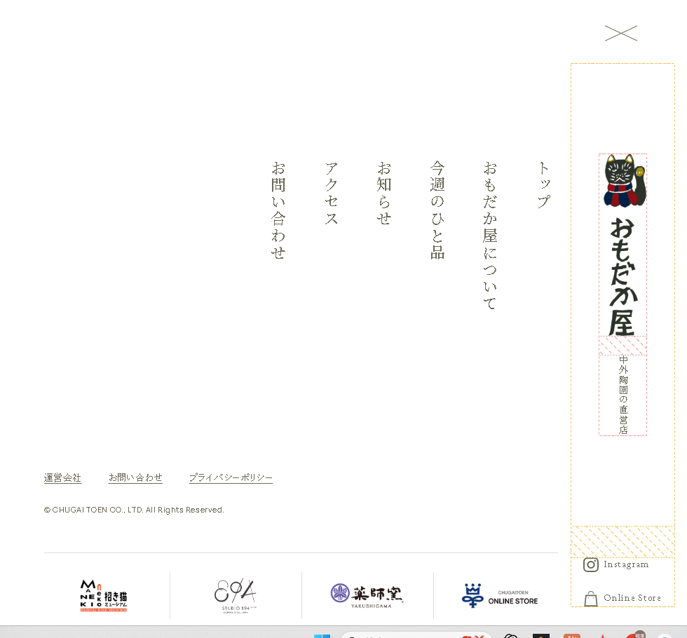
画面イメージ（検証ツールイメージ）
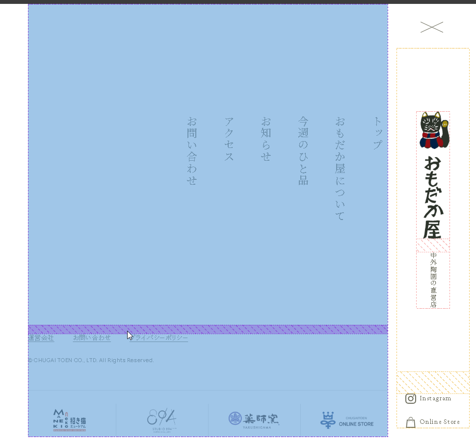


ここが最重要ポイントです！

↓親要素のふたつの子要素（.menu_navi_upperと.menu_navi_lower）
.menu_navi_upper（メニュー部分）に flex: 1 をかける →
余っている空間をすべて自分が占領する という動きをします。

・一番下に何もない（何も flex の指定がない）
.menu_navi_lower
.menu_navi_lower に何も（flex の特別な指定）ないからこそ、
上手くいっています。

・仕組み
親（.menu_navi）が height: 100%（画面いっぱいの高さ）を持っている。
上の子（upper）が flex: 1 で「余ったスペースは全部俺がもらう！」と巨大化する。
その結果、下の子（lower）は、巨大化した upper にグイグイ押し出されて、一番下にくっつく。


## Flexboxを利用するときは、以下でも縦中央に持ってくることができるが、基本は親Flexboxで中央に指定してあげるのがベストプラクティス。 html

.hidden_nav {
  position: absolute; /* 親に対して自由になる */
  top: 50%;           /* 上から50%の位置へ */
  transform: translateY(-50%); /* 自分の高さの半分だけ上に戻る（これでピッタリ中央） */
}

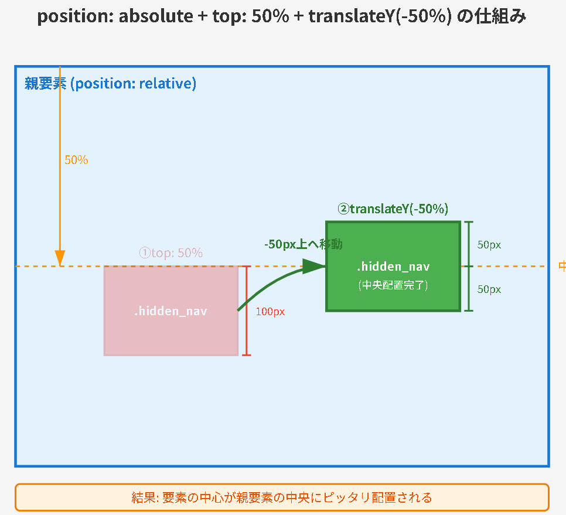


★ベストプラクティス
```css
/* 縦へのflex 100%でcenter【flex】 */
.hidden_nav {
  flex: 1;
  display: flex;
  justify-content: flex-end;
}
.hidden_menu {
  「右」に位置したい場合
}
```


## 兄弟要素の関係（セレクタの問題）: ~（一般兄弟結合子）は、同じ親要素を持つ兄弟間でのみ有効です。 html 

#hamburger_btn は <header id="side_area"> の中にあるため、その外にある .mainVisual_area を直接 ~ で指定することはできません。

✨他のセクションは操作できるのか？
できます。

ただし、CSSの`~`セレクタでは直接指定できないため、**JavaScriptを使う**必要があります。

// 例
hamburger_btn.addEventListener('change', function() {
  document.querySelector('.mainVisual_area').classList.toggle('active');
});

または、HTML構造を変更して、チェックボックスをheaderの外（兄弟要素として）に配置すれば、CSSだけで制御可能になります。
*/


## 表示と非表示にはいくつか種類があって、HTMLやCSSには以下のようなプロパティがある html

1. display: block  レイアウトから削除、
2. opacity: 1.0    透明化
3. visibility: visible は領域を保持したまま非表示、★あまり使用頻度は高くない。エラーメッセージなどに使える

`レイアウトから削除と領域保持の違い`

## **レイアウトから削除** (`display: none`)
- 要素が**完全に消えて、スペースも残らない**
- 他の要素が詰めて配置される
- 例：本棚から本を抜き取ると、隣の本が詰まる

## **領域を保持したまま非表示** (`visibility: hidden`)
- 要素は**見えないが、スペースは残る**
- 他の要素の位置は変わらない
- 例：本を透明にしても、本の場所は空いたまま

## 視覚的なイメージ
元の状態: [A][B][C]

display: none で B を消す
→ [A][C]  ← B のスペースも消える

visibility: hidden で B を消す
→ [A][  ][C]  ← B のスペースは残る
*/


## 先生への質問


以下のことを教えてください。

・一つのアニメーションでも、jQueryやライブラリ、JavaScript、CSSのアニメーションとかも書けるのでしょうか。その書き方は、お客様から指定されるのでしょうか。それとも方向性だけ指定されてちらで決めることがあった場合、どのような書き方をするか任意でしょうか。

・CSSを書く際に、PC、モバイル、PC、モバイルと順番に書いてもいいのでしょうか？それとも、PCのコードを上に、メディアクエリそれ以降がモバイルと固、まとめて書くのがよいでしょうか？

・


▢　
## 📌 セクション高さは固定しない（height → min-height）

【結論】
コンテンツ増減に対応できるよう、セクションはmin-heightまたはautoを使う

【具体例】
```css
/* ❌ 悪い例：固定 */
.about_area {
  height: 60rem;  /* コンテンツが増えるとはみ出す */
}

/* ✅ 良い例：最低限の高さを確保 */
.about_area {
  min-height: 60rem;  /* 最低60rem、増えれば伸びる */
}

/* ✅ または完全自動 */
.about_area {
  height: auto;  /* コンテンツに合わせる */
}
```

【補足】
- 固定高さ → スマホ・タブレットでレイアウト崩れ
- min-height → デザイン維持 + 柔軟性
- レスポンシブ対応に必須

---

## 📌 CSS変数で繰り返し計算を共通化

【結論】
同じ計算式が複数箇所にある → CSS変数で一元管理

【具体例】
```css
/* ❌ 悪い例：同じ計算を3回 */
.news_area {
  width: calc(100% - var(--space-hor-pc) - var(--space-hor-pc-right) - var(--header-side-width));
}
.access_area {
  width: calc(100% - var(--space-hor-pc) - var(--space-hor-pc-right) - var(--header-side-width));
}
.access_container {
  width: calc(100% - var(--space-hor-pc) - var(--space-hor-pc-right) - var(--header-side-width));
}

/* ✅ 良い例：変数化 */
:root {
  --main-content-width: calc(100% - var(--space-hor-pc) - var(--space-hor-pc-right) - var(--header-side-width));
}

.news_area { width: var(--main-content-width); }
.access_area { width: var(--main-content-width); }
.access_container { width: var(--main-content-width); }
```

【補足】
- メリット1: 修正が1箇所で済む
- メリット2: コード量削減
- メリット3: 可読性向上

---

## 📌 JavaScript関数化で重複コード削減

【結論】
同じパターンの処理 → 関数にまとめて再利用

【具体例】
```javascript
// ❌ 悪い例：同じ処理を繰り返し
if (rect.top <= windowHeight) {
  storeImg.classList.add("animate");
}
if (rectManekiNeko.top <= windowHeight) {
  manekiNekoImg.classList.add("animate");
}

// ✅ 良い例：関数化
function addAnimateOnScroll(element) {
  const rect = element.getBoundingClientRect();
  const windowHeight = window.innerHeight;
  
  if (rect.top <= windowHeight) {
    element.classList.add("animate");
  }
}

// 使用
addAnimateOnScroll(storeImg);
addAnimateOnScroll(manekiNekoImg);
```

【補足】
- 要素追加時に関数呼び出すだけ
- バグ修正が1箇所で済む
- テスト・保守が簡単

---

## 📌 要素取得方法の統一（querySelector推奨） html

【結論】
getElementByIdとquerySelectorを混在させず、querySelectorに統一

【具体例】
```javascript
// ❌ 悪い例：混在
const btn = document.getElementById("btn");
const area = document.querySelector("#area");

// ✅ 良い例：querySelector統一
const btn = document.querySelector("#btn");
const area = document.querySelector("#area");
```

【補足】
- querySelectorはID・クラス・属性全対応
- モダンで柔軟（CSS セレクタ使用可）
- コードの一貫性向上
- チーム開発で混乱を防ぐ


## 📌background-image: url("../img/logo_omodakaya-vrt.png");で画像が取得できない　html

htmlをimgタグではなくてdivタグにする必要あり


## メディアクエリ内で当たり前のように設定しているのに、うまくいかない場合、おおもとのPCを崩している可能性があるのでチェックすること html


## PCのＣＳＳを、left 50rem　などを取り消して　メディアクエリでright 1remとかに修正したい場合、left:autoに設定する html


## 📌 CSS変数とメディアクエリでレスポンシブ余白管理 html

【結論】
- CSS変数を `:root` で定義
- メディアクエリで**上書き**して画面サイズごとの余白を変更
- 各要素は `var()` で参照するだけ


★★★　基本きめておくのは、（必須）
1. 左右余白（--space-hor）
2. 上下余白（--space-vrt）
3. セクション間（--section-top/bottom）← これも必須！
4. サイドバー

【具体例】
```css
/* デフォルト（スマホ: ~767px） */
:root {
  --space-hor: 2rem;
  --space-vrt: 12rem;
}

/* タブレット（768px~1024px）でCSSvariable変数を上書き */
@media screen and (min-width: 76.8rem) {
  :root {
    --space-hor: 4rem;  /* 上書き */
    --space-vrt: 16rem;
  }
}

/* PC（1025px~）でCSSvariable変数を上書き */
@media screen and (min-width: 102.5rem) {
  :root {
    --space-hor: 8rem;  /* さらに上書き */
    --space-vrt: 24rem;
  }
}

/* 使用側（画面サイズで自動変更） */
.about_area {
  margin-left: var(--space-hor);  /* スマホ2rem→タブレット4rem→PC8rem */
}
```

【補足】
- 一箇所変更で全セクションに適用
- 保守性・可読性が高い
- `--space-hor` = 左右余白、`--space-vrt` = 上下余白

## 📌 overflow: hidden と height の関係 CSS

【結論】
`overflow: hidden` を使うには、親要素に `height` の指定が必須。`height`、`width` がないと、親が子のサイズに合わせて自動的に伸びるため、`overflow: hidden` は効果を発揮しない。

【具体例】
```css
/* ❌ 効かない（heightなし） */
.right_container {
  overflow: hidden;  /* 親が伸びるので効果なし */
  display: flex;
  flex-direction: column;
}

/* ✅ 効く（height指定あり） */
.right_container {
  overflow: hidden;  /* はみ出しを切り取る */
  display: flex;
  flex-direction: column;
  height: 100%;     ★ /* ← 親の高さに固定 */
}

/* ✅ calc()で微調整も可能 */
.right_container {
  overflow: hidden;
  height: calc(100% - 5rem); ★右下に調整したいとき /* 演算子の前後にスペース必須 */
}
```

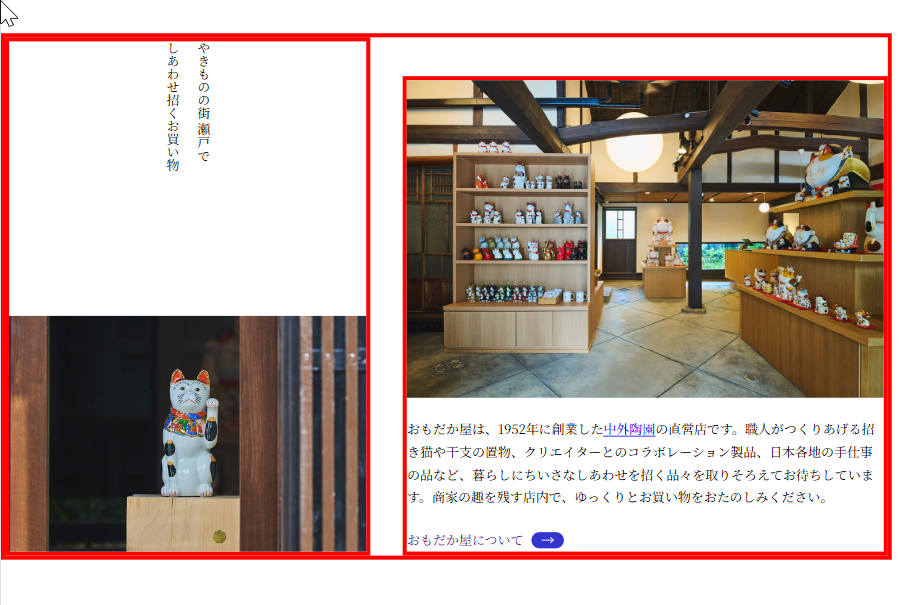

【補足】
- `height` なし → 親が子に合わせて伸びる → `overflow: hidden` 無効
- `height` あり → 親が固定される → はみ出し部分を切り取る
- `calc()` の演算子（+, -, *, /）の前後には必ずスペースが必要
- `height: 100%` は親に固定サイズが必要（`min-height` では動作しない）


---

## 🎯 スクロールアニメーション ()

### 📊  の意味

rect.top = 画面の上端（0px）から要素の上端までの距離
 **スクロールするほど `rect.top` は減少**　`つまりスクロールした位置からの要素までの距離`


### 🔍 値の変化

| スクロール量 | rect.top | 状態 |
|--------------|----------|------|
| 0px | 1200px | 画面外 ❌ |
| 400px | 800px | 画面下端 ⚠️ |
| 600px | 600px | 画面内 ✅ |

➡ **スクロールするほど `rect.top` は減少**

### ✅ 判定条件
```javascript
if (rect.top <= windowHeight) {
  element.classList.add('animate');
}
```

### 📌 重要な値

| 変数 | 意味 | 変動 |
|------|------|------|
| `window.innerHeight` | ブラウザの見える範囲の高さ | 固定 |
| `window.scrollY` | スクロールした距離 | 変動 |
| `rect.top` | 画面上端から要素上端までの距離 | 変動 |

### 🎬 動作イメージ
```
スクロール前:
画面上端 ━━━━━━━━━━━━━━━━━ 0px
    ↕ rect.top = 1200px (遠い)
    800px (innerHeight)
    ↕
画面下端 ━━━━━━━━━━━━━━━━━
────────────────────────────
要素上端 📦

スクロール後:
画面上端 ━━━━━━━━━━━━━━━━━ 0px
    ↕
    600px
    ↕
要素上端 📦 rect.top = 600px ✅
    ↕
    800px (innerHeight)
    ↕
画面下端 ━━━━━━━━━━━━━━━━━

➡ 600 <= 800 → true → アニメーション発動！
```

### 💡 デモファイル
- [scroll-demo.html](../02_作業/00_リンクワーク/HTML自動化/過去の課題/67_猫サイト/scroll-demo.html)
- リアルタイムで値を確認可能


## 📌 メディアクエリで margin を消す方法

【結論】
PCからスマホ用のメディアクエリで値を消すには、`0` を設定する

【具体例】
```css
/* PC */
.element {
  margin-right: 20px;
}

/* スマホ */
@media (max-width: 768px) {
  .element {
    margin-right: 0;  /* 0で消す */
  }
}
```

【補足】
- 継承されたプロパティを打ち消すには `0` を設定
- モバイルファーストという方法もあるが、チームの方針に従う


## 画面幅一杯にひろげたいときwidth100％でもできないとき html

width: 100vw;

## 📌 list-style: none が効かない html

【結論】
`ul { list-style: none; }` だけでは黒丸が消えないことがある。
`ul li { list-style: none; }` のように li にも指定する必要がある。

【具体例】
```html
<ul class="page_nav">
  <li><a href="#">リンク</a></li>
</ul>
```

```css
/* ❌ これだけでは消えないことがある */
.page_nav {
  list-style: none;
}

/* ✅ li にも指定（確実） */
.page_nav li {
  list-style: none;
}
```

【補足】
- ulに指定しても継承されないケースがある
- 念のためliにも指定すると確実
- または `ul, li { list-style: none; }` でまとめて指定

## 📌 ホバーで画像拡大エフェクト html

【結論】
マウスを乗せると画像が拡大、離すと元に戻るエフェクトは、`transition` + `:hover` + `transform: scale()` で実装。

【具体例】
```css
/* 通常状態 */
.weekly_cat_img {
  transition: transform 0.3s ease; /* スムーズに変化 */
  cursor: pointer; /* カーソルをポインターに */
}

/* ホバー時 */
.weekly_cat_img:hover {
  transform: scale(1.2); /* 1.2倍に拡大 */
}
```

【補足】
- `transition` で変化速度を指定（0.3s = 0.3秒）
- `scale(1.2)` で1.2倍に拡大（数値変更で調整可能）
- `ease` でスムーズに（`linear`もあり）
- マウスを離すと自動で元に戻る

[プレビュー](http://localhost:54321/preview-20260215-032945.html)

## .共通クラス:nth-child(2) {display: none;}ここを消すと2つのリンクが消えるんだけど、なぜだろう？  共通クラスを複数に作成するとdisplay none ネストで対応する　配列ではなく html


display: contents を使うと、.left_container と .right_container の子がすべて共通の親（.about_area）の直下として扱われます。そのため、nth-child(2) が意図しない複数の要素（それぞれのコンテナ内の2番目の子）にヒットしている可能性が高いです ❌

⇀親要素がはっきりしなくなるため

/* 非表示「今週のひと品　詳しく見るリンク」  同じ`クラスを指定しているため、ネストで対応`*/
  .weekly_area .weekly_container .weekly_info_container .radius_link {
    display: none;
  }

  [プレビュー](http://localhost:54321/preview-20260215-033142.html)

  
## 📌 同じクラスが複数ある場合の対処法 CSS

【結論】
同じクラスが複数箇所で使われている場合、1箇所だけスタイルを変更したいときは**専用クラスを追加**する

【具体例】
```html
<!-- 元のコード（3箇所で使用） -->
<a href="#" class="radius_link">おもだか屋について</a>
<a href="#" class="radius_link weekly_space">くわしく見る</a>
<div class="radius_link">今週のひと品 一覧</div>

<!-- 1箇所だけ変更したい場合 -->
<div class="radius_link item_list_link">今週のひと品 一覧</div>
```

```css
/* モバイル専用のクラスを追加し場所を変更 */
/* 同じクラスを指定しているため、専用クラスで対応 */
@media (max-width: 768px) {
  .item_list_link {
    transform: translateY(180px); /* 見た目だけ移動 */
  }
}
```

【補足】
- **margin-top**: 親要素の高さも広がる（スペースができる）
- **transform**: 見た目だけ移動、親は広がらない（レイアウトに影響なし）
- **rem単位注意**: `300rem` = 約4800px（超巨大！）→ `px` 使用推奨
- モバイル専用は `@media (max-width: 768px)` 内に記述


## jQueryの拡張機能セットアップ

ひな形が欲しい → 拡張機能「jQuery Code Snippets」（donjayamanne.jquerysnippets など）を入れる

ちゃんと補完したい → プロジェクト直下に jsconfig.json を作って

{ "typeAcquisition": { "include": ["jquery"] } }


## jQuery 構文

// Pタグを要素にいれる
$(".inPTag").append("<p class='myClass'>jQuery</p>");
$(".myClass").slideToggle(2000);
/* ✨
「Toggle」は「切り替え」という意味で、**表示/非表示を切り替える動作**を指します。

`slideToggle()`は：
- **非表示の要素** → スライドしながら**表示**
- **表示中の要素** → スライドしながら**非表示**

このように、実行するたびに**表示状態を自動で切り替える（Toggle）**のが特徴です。

つまり「Slide」は**動き方**、「Toggle」は**切り替え機能**を表しています。現在の状態を判断して逆の動作をする点が「Toggle」の意味です。
*/

動作デモ
[プレビュー](http://localhost:54321/preview-20260214-091739.html)


## JavaScriptなど html
・クラスの追加　element.classList.add("aaa"); 
★クラスリストとaddが必要

・選択するたびにクラスをON/Offする　element.classList.toggle("aaa");　
★クラスリストとトグルが必要


・アコーディオンタグと
非表示のタグは、同じ階層


[プレビュー](http://localhost:54321/preview-20260215-033626.html)

## CSSでの構文 html
ボタンがおされた時は
.要素.クラス{

}
★要素とクラスをブランクなしでくっつける

例）#acc-btn-icon.active {}

## アコーディオンメニューの作り方 html

<!-- 親要素を並列で並べる。アコーディオンのボックス -->

★　親要素を並列で並べる（子要素に記載するのではない。）
```html
    <div class="acc">
      <!-- アコーディオン・選択するとメニュー -->
      <div class="acc-btn" type="button">
        <div class="acc-btn-title">Webディレクター</div>
        <div id="acc-btn-icon"></div>
      </div>
      <!-- 表示エリア flex -->
      <div class="acc-panel">
        <div class="acc-panel-title">Webディレクター</div>
        <div class="acc-panel-description">テキストテキスト</div>
      </div>
    </div>

        <script src="https://code.jquery.com/jquery-3.6.0.min.js">      </script>
    <script src="js/XXXXX.js"></script>
  </body>

  <!-- 　かならず最後にアコーディオンのライブラリを取得すること -->


```

```css
/* アコーディオン・選択するとメニュー */
.acc-btn {
  width: 80%;
  padding: 16px;
  /* border: 1px solid #000; */
  background: #ffd86a;

  display: flex;
  justify-content: space-between;

  border: 0.1px solid blue;
}
.acc-btn-title {
  font-size: 16px;
  display: block;
}

★CSSでインラインの文字を変更する際は、疑似要素を利用する！
（おそらく通常のクラスのプロパティではcontent:"文字"がつかえない）
★クラスが追加された際の書き方は「.クラス名.クラス名　」　
空白をいれない！！

#acc-btn-icon.active::before {
  display: block;
  content: "ー";
  font-size: 20px;
}

#acc-btn-icon::before {
  display: block;
  padding-right: 10px;
  cursor: pointer;
  content: "＋";
}

/* 表示エリア flex */
.acc-panel {
  width: 60%;
  padding: 16px;

  display: flex;
  justify-content: space-between;
}


```

```javascript

// HTMLの読み込みが完了してから中の処理を実行する
const accBtnIcon = document.getElementById("acc-btn-icon");


★クラスを`切り替える`ロジックは　element.classList.toggleとかく。クラスリストがつくことの注意！！！

★スライドトグル($(this).next(".acc-panel").slideToggle(200);)スライドの切り替えを表す。

//ドキュメント読み込み完了を待つ関数（した後）
$(function () {
  // ボタンがクリックされたら、（した後）
  $(".acc-btn").on("click", function () {
    // 複数必要な場合は　nextAll
    $(this).next(".acc-panel").slideToggle(200);
    accBtnIcon.classList.toggle("active");
  });
});


```

## 📌 Claude Code スキル一覧

【結論】
自作スキルは8つ。`/スキル名` で呼び出せる。

【具体例】

### 1. `/snippet` - コードスニペット保存（memo.md連携版） html
- コードを `★{名前}.md` 形式で保存 + memo.mdに自動追記
- 保存先: `D:\50_knowledge\その他\00_サンプルソース\`（自宅）
- 使い方:
  1. `/snippet` 実行
  2. AI が会話履歴から★ポイントを自動抽出して提示
  3. ユーザーが確認・追加・修正
  4. スニペット作成（フルソース + ★ポイントをソース横に配置）
  5. memo.md に自動追記（★ポイント一覧 + リンク）
- 例: `★jQueryアコーディオン_slideToggle_flex対応.md`

### 2. `/memo-format` - 学習メモ作成
- 【結論】【具体例】【補足】フォーマットでメモを追記
- 保存先: `D:\50_knowledge\01_memo.md`（自宅）

### 3. `/animation-library-snippet` - アニメーションライブラリ デモ生成
- Swiper, GSAP, AOS等のアニメーションライブラリの学習用デモを一括生成
- 引数: `<ライブラリ名> <アニメーション種類>`
- 例: `/animation-library-snippet swiper フェード切替`
- 生成物:
  - ★mdファイル（HTML/CSS/JS分離で解説）
  - デモHTML 4つ（①シンプル版 ②③パターン ④多機能版）
  - index.html更新（全ライブラリ統合一覧）
- 保存先: 会社PC `03_knowledge\images\` 配下


mockup


### 4. `/class-auto` - クラス名自動付与
- HTMLの `<タグ>` だけ書く → AIが `class="クラス名"` を全タグに付与
- ルール: `[section]_[element]`（2単語）、状態は `_[state]`（3単語MAX）
- 外枠は `_area`（`_container`禁止）、省略禁止（img/nav除く）

### 5. `/section-auto` - セクション名自動提案
- スクショやURLを渡す → 大セクション名を日本語で一括提案
- HTMLコメント + CSS特徴付きコメントを生成
- `/class-auto` と連携可能（セクション確定後 → クラス名付与）

### 6. `/review-css` - HTML/CSSコードレビュー ✅ 2026-02-19追加
- HTML + CSS を読み込んで改善点を観点ごとに一覧で出す（修正はしない）
- 観点: ①不要ルール ②重複の共通化 ③変数化 ④CSSプロパティ順 ⑤コメント不整合 ⑥セマンティック ⑦構造の重複 ⑧仮クラス名 ⑨アクセシビリティ ⑩AIっぽいコメント
- 優先度付きで出力 → 全部直さなくていい、順番に対処
- 観点は `C:\Users\sensh\.claude\skills\review-css\skill.md` に追記して拡張可能

### 7. `/auto-skeleton` - CSSスケルトン自動生成 ✅ 2026-02-20追加
- HTMLのクラス名からCSSの空ルールセット+コメントを自動生成
- flex/gridには `display` だけ入れる。他は空
- コメントルール:
  - 親: `【flex 横2列: サムネイル + テキスト側】` で子要素を列挙
  - 子: `└ サムネイル（左）` で親との対応を明示（横並びのみ左右ラベル）
  - `└` は最大2つ、flex/gridの直接の子のみ
  - 作成段階用（提出時に `/auto-clean` で削除）
- HTML/CSSコメントはCSS基準で統一

### 8. `/auto-clean` - 提出前クリーンアップ ✅ 2026-02-20追加
- 提出前にHTML/CSSを検査し、開発用の痕跡やミスを検出
- 検出項目:
  - `└` コメント削除
  - デバッグ用CSS（`border: red` 等）
  - AI生成文の検出
  - 共通化候補の提案
  - 命名ミス（ハイフン/キャメル/スペル）
  - TODO/FIXME/空ルール/!important
- 原則: 一覧報告 → ユーザー確認 → 修正

【補足】
- スキル保存先: `C:\Users\sensh\.claude\skills\[スキル名]\`
- 4と5は連携: `/section-auto` → `/class-auto`
- 7と8は連携: `/auto-skeleton`（作成時） → `/auto-clean`（提出時）

##  メモ：jQuery画像切り替えギャラリー実装のポイント・イメージ・下に４つの小さな画像があって、クリックすると上の大きな画像に切り替える html


【気づき】
★object-fit は div には効かない。img タグに設定する必要がある
★Flexbox の gap と width を組み合わせる時は calc で計算が必要
★jQuery の attr() メソッドで HTML 要素の属性を取得・設定できる
★画像切り替えは html() より attr("src") の方が効率的

【ポイント】

★ポイント1: object-fit は img に設定
```css
/* ❌ div に設定 → 効かない */
.gallery_main {  /* div */
  object-fit: contain;
}

/* ✅ img に設定 → 正しく動作 */
.gallery_main {  /* img タグ */
  object-fit: contain;
}
```

★ポイント2: Flex gap + width の calc 計算
```css
.gallery_thumbnails {
  display: flex;
  gap: 10px;  /* 画像間の余白 */
}

.gallery_img {
  /* gap 4箇所分を引いて、5枚で割る */
  width: calc((100% - (10px * 4)) / 5);
}
```
公式: `calc((100% - (gap × (枚数 - 1))) / 枚数)`

★ポイント3: attr() で属性取得・設定
```javascript
// 取得
const src = $(this).attr("src");

// 設定
$(".gallery_main").attr("src", src);
```

★ポイント4: html() vs attr()
```javascript
// ❌ html() で全体生成
$(".gallery_main").html('');

// ✅ attr() で src だけ変更（効率的）
$(".gallery_main").attr("src", src);
```


📋 [詳細ソース](./その他/00_サンプルソース/★jQuery画像小サイズ⇀大に切替ギャラリー.md)


## フィードインする。下から上に、画面スクロールで該当の要素にきたら

メモ：jQueryスクロールアニメーション_not構文と完了済み判定

【気づき】
★jQuery未読込で`$ is not defined`エラー発生
★`:not(.is-visible)`という除外構文を知らなかった
★動的にクラス追加で完了済み判定する仕組みを理解した
★ページ読込時にもチェックが必要（最初から見える要素対応）

【ポイント】

★ポイント1: jQuery読込確認（CDNでもOK）
```html
<!-- CDN -->
<script src="https://code.jquery.com/jquery-3.6.0.min.js"></script>
<!-- work.jsより前に配置必須 -->
<script src="js/work.js"></script>
```

★ポイント2: `:not(.is-visible)` 除外構文
```javascript
// .is-visibleクラスが無い要素だけ処理
$(".news_title_container:not(.is-visible)").each(function () {
  // 一度表示した要素は is-visible が付くので次回スキップ
});
```

★ポイント3: 動的クラス追加で完了判定
```javascript
// 条件満たしたら is-visible クラス追加
$(this).addClass("is-visible");
// → 次回ループ時は :not(.is-visible) で除外される
```

★ポイント4: ページ読込時チェック必須　　★ここから関数を呼び込むイメージ
```javascript
// スクロール時
$(window).scroll(checkNewsAnimation);
// ページ読込時も実行（最初から見える要素対応）
$(document).ready(checkNewsAnimation);
```

★ポイント5: CSS初期状態　★初期表示はけしておく。
```css
.news_title_container {
  opacity: 0;
  transform: translateY(2rem); /* 下に配置 */
  transition: all 0.5s ease;
}
```

📋 [詳細ソース](./その他/00_サンプルソース/★フェードイン「カードを下から上に動かす」（最新）.md)

---

## 文字が上から下に徐々に現れてくるアニメーション
---

▢
メモ：clip-path リビールアニメーション_上から下へ文字表示 特に矢印や文字に使う
テキストライティング効果


【気づき】
★`clip-path: inset()` でマスク効果を作れる
★`inset(上 右 下 左)` の引数順序（時計回り）
/* ✨
## clip-pathプロパティのinset関数について

`clip-path: inset()` は、要素に対して矩形のクリッピング（切り抜き）領域を設定するCSSプロパティです。

## 基本的な動作

要素の上下左右から指定した距離だけ内側にクリッピング領域を作成し、その領域外を非表示にします。これによりマスク効果を実現できます。

## 構文例

`clip-path: inset(10px 20px 30px 40px)` のように記述します。値は上、右、下、左の順序で内側への距離を指定します。

## 具体的な使用例

- `clip-path: inset(0)` - クリッピングなし（全体表示）
- `clip-path: inset(20px)` - 四辺から20px内側をクリッピング
- `clip-path: inset(10px 20px)` - 上下10px、左右20px内側をクリッピング
- `clip-path: inset(0 0 50% 0)` - 下半分を非表示

## 追加機能

`round` キーワードを使うことで角丸効果も追加できます。例：`clip-path: inset(10px round 15px)` は10px内側でクリッピングし、角を15pxの丸みにします。

## 利点

画像やコンテンツを切り抜く際に、追加の要素を作らずにCSSだけで実現できるため、シンプルで効率的です。
*/

/* ✨
## clip-pathプロパティのinset()関数について

`clip-path: inset()` は、要素の表示領域を切り抜いてマスク効果を作成するCSSプロパティです。

## 基本的な動作

要素の外側から内側に向かって切り抜きを行い、指定した範囲のみを表示します。要素の一部を隠すことで、視覚的なマスク効果を実現できます。

## inset()の値の指定方法

`inset(上 右 下 左)` の形式で、各辺からどれだけ内側に切り抜くかを指定します。

例えば `inset(10px 20px 30px 40px)` とすると、上から10px、右から20px、下から30px、左から40pxの位置で切り抜かれます。

## 値の省略パターン

- 1つの値: 全ての辺に適用
- 2つの値: 上下、左右
- 3つの値: 上、左右、下
- 4つの値: 上、右、下、左

## round キーワード

`inset()` では `round` キーワードを使って角丸を指定することも可能です。例: `inset(10px round 5px)` で10pxの切り抜きと5pxの角丸が適用されます。

## 用途

画像やボックスの一部を隠したり、アニメーションで徐々に表示させるエフェクトなどに活用されます。
*/

★リビール（Reveal）アニメーションという手法名を知った


【ポイント】

★ポイント1: clip-path insetの構文
```css
clip-path: inset(上 右 下 左);
/* 各辺からどれだけ切り取るか指定 */
/* 例: inset(0 0 100% 0) = 下から100%カット */

.news_title {
  animation: revealRightToLeft 1.5s ease-out forwards;
}
```

★ポイント2: 上から下へ表示する仕組み
@keyframes revealRightToLeft {
  from {
    clip-path: inset(0 0 100% 0); /* 下を100%隠す */
  }
  to {
    clip-path: inset(0 0 0 0); /* 全て表示 */
  }
}

下部が徐々に見えてくる = 上から下にマスクが外れる

★ポイント3: アニメーション名称

リビール（Reveal）アニメーション（広い概念・📦→🎁 隠れてたものが露出）
└ ワイプ（Wipe）アニメーション（方向指定のリビール・一方向に拭き取るように切り替わる・）
└ カーテン効果（左右対称のリビール・中央から左右に開く／閉じる）
└ テキストライティング効果（テキストライティング・文字専用の段階的リビール）


★リビール実際の画面イメージ
[プレビュー](http://localhost:54321/preview-20260215-190419.html)

```

📋 [詳細ソース](./その他/00_サンプルソース/★clip-path_上から下に文字を表示する仕組み.md)
---

## 📌 セマンティックHTML：ヘッダー構造の改善 html

【結論】
- **ロゴは見出しではない** → `<h1>` → `<div>`
- **サイトタイトルが最重要見出し** → `<h2>` → `<h1>`
- **レイアウト用リストは不要** → `<ul><li>` → `<div>` + `<a>`

【具体例：改善前】
```html
<header>
  <h1 class="logo">              <!-- ❌ ロゴに見出しタグ -->
    <a href="/"></a>
  </h1>
  <nav>
    <ul>                          <!-- ❌ レイアウト用リスト -->
      <li><a href="#">リンク</a></li>
    </ul>
  </nav>
  <h2>サイトタイトル</h2>        <!-- ❌ メインタイトルがh2 -->
</header>
```

【具体例：改善後】
```html
<header>
  <div class="logo">             <!-- ✅ ロゴはdiv -->
    <a href="/"></a>
  </div>
  <nav>
    <div class="nav_list">       <!-- ✅ レイアウトコンテナ -->
      <a href="#" class="nav_link">リンク</a>
    </div>
  </nav>
  <h1>サイトタイトル</h1>        <!-- ✅ メインタイトルはh1 -->
</header>
```

【補足】
- 1ページに`<h1>`は1つ（最重要見出し）
- ロゴ画像は見出しではなくリンク付き画像
- `<ul><li>`は順序性・項目性がある時のみ使う
- レイアウト目的なら`<div>`でシンプルに
- `list-style: none`を使う構造は見直し対象

## 📌 100svh vs 100vh（ビューポート高さの単位） html

【結論】
スマホではアドレスバーの表示/非表示で画面高さが変わる。`svh`はアドレスバー表示時の小さい方を基準にするので、はみ出さない。

【具体例】
```css
.header_inner {
  height: 100svh; /* アドレスバーが出ててもはみ出さない */
}
```

【補足】
- `vh` = アドレスバー考慮しない（変動する）
- `svh` = 最小ビューポート高さ（安全）
- `lvh` = 最大ビューポート高さ
- `dvh` = 動的（リアルタイム追従）
- PCではvhとsvhはほぼ同じ。差が出るのはスマホ

---

## 📌 ドロップダウンアニメーション（上から降りてくる） html

【結論】
要素自体を上から下に移動させるには `@keyframes dropDown と、transform: translateY()` を使う。リビール（clip-path）とは違い、要素が実際に動く。

【具体例】
```css
@keyframes dropDown {
  from {
    opacity: 0;
    transform: translateY(-3rem); /* 上から */
  }
  to {
    opacity: 1;
    transform: translateY(0);
  }
}

.header_logo {
  animation: dropDown 1.5s ease-out forwards;
}
```

【補足】
- リビール = マスクが外れて見える（文字は動かない）
- ドロップダウン = 要素自体が上→下に移動する

---

## 📌 animation-delayで時間差アニメーション html

【結論】
省略記法の4番目がdelay。先のアニメーション完了後に次を開始できる。

【具体例】
```css
/* 省略記法: animation: 名前 時間 イージング 遅延 forwards */
.header_title {
  animation: revealLeftToRight 1.5s ease-out forwards;       /* 0s開始 */
}
.header_logo {
  opacity: 0;  /* ★delay中のチラ見え防止 */
  animation: dropDown 1.5s ease-out 1.5s forwards;           /* 1.5s後 */
}
.header_nav {
  opacity: 0;
  animation: dropDown 1.5s ease-out 2s forwards;             /* 2s後 */
}
```

【補足】
- `opacity: 0` を初期値にしないと、delay中に一瞬表示されてしまう
- `forwards` で最終状態（opacity:1）を維持する
- delay中のチラ見え防止は忘れやすいので注意

---

## 📌 clip-path insetの方向（リビール方向の制御） html

【結論】
`clip-path: inset(上 右 下 左)` で、100%にした辺から0%に開くことでリビール方向を制御する。

要素を「マスク（型抜き）」するプロパティ。


[プレビュー](http://localhost:54321/preview-20260304-022145.html)

【具体例】
```css
/* 左→右リビール */
@keyframes revealLeftToRight {
  from { clip-path: inset(0 100% 0 0); } /* 右を100%隠す */
  to   { clip-path: inset(0 0 0 0); }
}

/* 上→下リビール */
@keyframes revealTopToBottom {
  from { clip-path: inset(0 0 100% 0); } /* 下を100%隠す */
  to   { clip-path: inset(0 0 0 0); }
}
```

【補足】
- `inset(上 右 下 左)` = marginやpaddingと同じ順番
- 右を100%→0% = 左から右に表示
- 下を100%→0% = 上から下に表示

---

## 📌 VS Code Tab Moves Focus問題 html

【結論】
`Ctrl+M` を誤って押すと、Tabキーがインデント/サジェスト確定ではなく、UIのフォーカス移動に切り替わる。

【具体例】
- ステータスバー左下に `Tab Moves Focus` と表示されていたらこのモード
- `Ctrl+M` をもう一度押す → 通常モードに戻る

【補足】
- コーディング中に誤爆しやすいショートカット
- 起動時は正常だが途中から挙動が変わる → これが原因


## 作成したツール一覧
・61_デザインカンプから幅サイズを取得
・62_HTMLからCSSへジャンプ
・64_ループビジュアル拡張機能_anti
・65_HTML自動プレビュー


## javaScriptの流れ　詳細なロジック：
1. 実際のコードより短縮系
2. 新しいロジックなど html


[プレビュー](http://localhost:54321/preview-20260216-173209.html)

▢
## ：jQueryアコーディオン＋/ー切替の失敗ポイントtext,find,next


【気づき】
- `.text("＋")` はセッター、`.text()` はゲッター。if文で比較するなら引数なし
- `$(function(){})` は1回だけ。クリック時は `.click()` の中だけ実行される
- `$(this)` + `.next()` + `.find()` で3つの個別処理を1つにまとめられる
- CSSの `::after` とJSの `.text()` を両方使うと＋が2個出る

【ポイント】

★ゲッターとセッターの違い
```javascript
// ❌ if (plusObj.text("＋")) → 常にtrue
// ✅ if (plusObj.text() === "＋") → 比較できる
```

★$(this)で共通化
```javascript
$("#work, #work1, #work2").click(function () {
  var content = $(this).next();
  var plusObj = $(this).find(".plus, .plus1, .plus2");
});
```

★コピペで動く最小コード（ファイル分離版）

**HTML**
```html
<!doctype html>
<html lang="ja">
<head>
<meta charset="UTF-8" />
<link rel="stylesheet" href="css/accordion.css" />
</head>
<body>

<div class="accordion-title">
  <span>1. WEBディレクター</span>
  <span class="plus"></span>
</div>
<div class="accordion-content">
  <p>仕事内容: テキスト</p>
</div>

<div class="accordion-title">
  <span>2. WEBデザイナー</span>
  <span class="plus"></span>
</div>
<div class="accordion-content">
  <p>募集職種: テキスト</p>
</div>

<script src="https://ajax.googleapis.com/ajax/libs/jquery/3.7.1/jquery.min.js"></script>
<script src="js/accordion.js"></script>
</body>
</html>
```

**CSS（css/accordion.css）**
```css
.accordion-title {
  display: flex;
  justify-content: space-between;
  padding: 10px;
  background: orange;
  cursor: pointer;
  border-top: 1px solid #000;
}
.accordion-content {
  display: none;
  padding: 10px;
}
```

**JavaScript（js/accordion.js）**
```javascript
$(function () {
  $(".plus").text("＋");

  $(".accordion-title").click(function () {
    $(this).next().slideToggle();
    var p = $(this).find(".plus");
    if (p.text() === "＋") {
      p.text("ー");
    } else {
      p.text("＋");
    }
  });
});
```

📋 [詳細ソース](./その他/00_サンプルソース/★jQueryアコーディオン＋ー切替.md)


## 📌 lastScrollTop でスクロール方向を判定する js jQuer スクロールで下に移動したか上に移動したか

【結論】
`lastScrollTop` は「前回のスクロール位置」を記録する変数。
現在のスクロール位置と比較することで、**上下どちらにスクロールしているか**を判定できる。

- `scrollTop > lastScrollTop` → 下スクロール中
- `scrollTop < lastScrollTop` → 上スクロール中
- 比較後に `lastScrollTop = scrollTop` で今回の値を保存（次回比較用）

【具体例：スクロール方向でサイドエリアの表示/非表示】

```css
  #side_area {
    position: fixed;
    top: 0;
    left: 0;
    width: 100%; /* 18rem */
    height: 10rem;
    background-color: #fff;
    z-index: 1000;
    padding: 0rem 1.5rem;

    /* ゆっくり隠す */
    transition: transform 0.3s ease; /* スムーズなアニメーション */
  }

  #side_area.hidden {
    transform: translateY(-100%); /* 上に隠す */
  }
```


```js
let lastScrollTop = 0; // 前回位置の初期値

$(window).on("scroll", function () {
  const scrollTop = $(this).scrollTop(); // 現在位置

  if (scrollTop > lastScrollTop) {
    // 下スクロール → 隠す
    $("#side_area").addClass("hidden");
  } else {
    // 上スクロール → 表示
    $("#side_area").removeClass("hidden");
  }

  lastScrollTop = scrollTop; // 今回の値を保存
});
```

【補足】
- `lastScrollTop` はスクロールイベントの**外側**で宣言（値を保持するため）
- ヘッダやサイドバーの自動非表示によく使うパターン
- 閾値を追加すれば微小スクロールを無視できる（例: `Math.abs(scrollTop - lastScrollTop) > 10`）


## transform 

 transform の用途
1. 要素の移動（translate）

transform: translateX(100px);  /* 横移動 */

2. 中央配置の定番

position: absolute;
top: 50%; left: 50%;
transform: translate(-50%, -50%); /* 自分自身の半分戻す */

```html
<!-- 画面中央に中央配置する -->
<div class="centered_content">
  <p class="tyuou">画面中央配置。</p>
</div>
```
```css
.centered_content {
  height: 10rem;
  position: relative;
}

.tyuou {
  position: absolute;
  top: 50%;
  left: 50%;
  transform: translate(-50%, -50%);
}
```
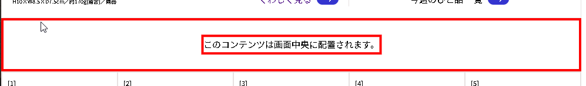

3. 拡大・縮小（scale）
transform: scale(1.2);   /* 1.2倍 */

4. 回転（rotate）
transform: rotate(45deg);  /* 45度回転 */

## AOSの実装手順

https://michalsnik.github.io/aos/

★　スタイルCSSを設定する。➡　AOSのデザイン
    <link href="https://unpkg.com/aos@2.3.1/dist/aos.css" rel="stylesheet" />
★　javaScriptを読み込む　➡　AOSの機能
    <script src="https://unpkg.com/aos@2.3.1/dist/aos.js"></script>

★　ちゃんとCSSにカラーをつけること。


```html
<!doctype html>
<html lang="en">
  <head>
    <meta charset="UTF-8" />
    <meta name="viewport" content="width=device-width, initial-scale=1.0" />
    <!-- work.css" を読み込む -->
    <link rel="stylesheet" href="css/work_AOS.css" />
    <link href="https://unpkg.com/aos@2.3.1/dist/aos.css" rel="stylesheet" />

    <title>Document</title>
  </head>
  <body>
    <!-- クラス名をつける。 -->
    <div class="AOS" data-aos="fade-up" data-aos-anchor-placement="bottom-bottom">
      <h1>テスト</h1>
    </div>

    <script src="https://unpkg.com/aos@2.3.1/dist/aos.js"></script>
    <script>
      AOS.init();
    </script>
    <script src="js/AOS_work.js"></script>
  </body>
</html>
```

```css
.AOS {
  background-color: red;
  width: 400px;
  height: 300px;
}
```

## 📌 jQuery イベントタイミング - $(function) vs $(window).on("load")

【結論】
- `$(function () {})` = HTML読込完了（DOM構築完了）
- `$(window).on("load", ...)` = CSS・画像等**全リソース**DL完了
- ページ更新時は**両方とも再実行**される
- 通常は `$(function...)` で十分

【具体例：実行タイミングの違い】
```javascript
// ⚡ 早い: HTML解析完了後すぐ実行（DOM操作可能）
$(function () {
  $(".btn").click(function () {
    alert("クリック");
  });
});

// 🐌 遅い: 全リソースDL完了後に実行
$(window).on("load", function () {
  // 画像の実寸取得が必要な場合はこっち
  const imgHeight = $("img").height();
  console.log(imgHeight); // → 正確なサイズ
});
```

【実行順序】
```
1. HTML解析開始
   ↓
2. HTML解析完了（DOMツリー構築）
   ↓
   ⚡ $(function () {}) ← ここ
   ↓
3. CSS・画像・外部JS等のDL
   ↓
   🐌 $(window).on("load", ...) ← ここ
```

【補足】
- `$(function...)` = `$(document).ready(...)` の省略形
- 画像サイズ取得・Canvas描画等は `load` イベント必須
- 95%のケースは `$(function...)` でOK
- F5更新時は両方とも毎回実行される


## 📌 jQuery .css() メソッドの3つの使い方 カラーの比較、設定、オブジェクトの設定方法、

【結論】
- ① CSS設定：オブジェクトで複数プロパティをセット
- ② CSS取得：引数にプロパティ名を入れる
- ③ CSS比較：rgb() 形式で比較する

【具体例】
```javascript
// ① セット：オブジェクトで複数設定
$(".acodeTitle").css({
  "color": "red",
  "background-color": "yellow"
});

// ② 取得：プロパティ名を引数に入れる
var color = $(".acodeTitle").css("color");
console.log(color); // → "rgb(255, 0, 0)"

// ③ 比較：rgb形式で比較
if (color === "rgb(255, 0, 0)") {
  // 赤色の場合の処理
}
```

【セットの書き方】
```javascript
// パターン1：オブジェクト（複数まとめて）
.css({"color": "red", "font-size": "20px"})

// パターン2：チェーン（1個ずつ）
.css("color", "red").css("font-size", "20px")

// パターン3：引数2つ（1個だけ）
.css("color", "red")
```

【補足】
- オブジェクトは `:` コロンで「プロパティ: 値」
- 引数は `,` カンマで区切る
- 色の比較は必ず rgb() 形式（"red" や "blue" では比較できない）
- rgb値の確認：`console.log(要素.css("color"))` で確認可能


## 📌 jQuery セレクター - カンマは""の中に入れる（複数クラスを一度に選択する方法）

【結論】
- jQueryのセレクターはCSSと同じくカンマで複数まとめられる
- カンマは " " の中に入れる（引数を分けない）
- CSSのセレクター記法と完全に同じ

【具体例】
```javascript
// ✅ 正しい：カンマは文字列の中
$(".plus, .plus1, .plus2").text("＋");
// → 3つのクラス全て選択される

// ❌ 間違い：カンマで引数を分けている
$(".plus", ".plus1", ".plus2").text("＋");
// → .plus だけが選択される（第2,3引数は無視）
```

【CSSとの対応】
```css
/* CSSでの書き方 */
.plus, .plus1, .plus2 {
  color: red;
}
```

```javascript
/* jQueryでも同じ書き方 */
$(".plus, .plus1, .plus2").css("color", "red");
```

【補足】
- ID と クラス の混在もOK：`$("#work, .test, #btn")`
- カンマで区切ると「OR条件」（どれか1つに該当すれば選択）
- 第2引数以降は「コンテキスト（検索範囲）」として扱われる場合がある
- CSS選択できるものは全てjQueryでも選択可能

## htmlの基本となるfont-size style.cssでも利用。　画面幅によって、サイズを変更する。

```css
html {
  font-size: calc(10 / 1400 * 100vw);
  font-size: clamp(8px, calc(10 / 1400 * 100vw), 10px)
```

---

## 📌 vw vs % とスクロールバーのズレ問題 css

【結論】
`100vw` はスクロールバーを含むが、`100%` は含まない。
`font-size: calc(10 / 1280 * 100vw)` でrem計算すると、rem指定のwidthがスクロールバー分（約15px）大きくなり、`margin: 0 auto` が負の値になって中央からズレる。

- `width: 92rem`（vwベース）→ スクロールバー分ズレる
- `width: 100%` → 親のcontent幅基準なのでズレない

【具体例】
```css
/* NG: vwベースのremで固定幅 → スクロールバー分ズレる */
html { font-size: calc(10 / 1280 * 100vw); }
#work {
  width: 92rem;       /* vw経由で計算 → 親より15px大きい */
  margin: 0 auto;     /* → margin-right: -15px になる！ */
}

/* OK: %指定 → スクロールバー影響なし */
#work {
  width: 100%;         /* 親のcontent幅にフィット */
  box-sizing: border-box; /* padding込みで100% */
}
```

【補足】
- `100vw` = ウィンドウ幅（スクロールバー含む）
- `100%` = 親のcontent幅（スクロールバー除く）
- block要素はwidth未指定でも親幅いっぱいになる（width: auto）
- `width: 100%` + `margin-left: 3rem` → はみ出す！この場合はwidth削除がベスト

---

## 📌 box-sizing: content-box vs border-box css

【結論】
`content-box`（デフォルト）はpaddingがボックス幅に加算される。
`border-box` はpadding込みでwidth指定の幅に収まる。
現場では `border-box` が標準。

- content-box: width = contentのみ → paddingで膨らむ
- border-box: width = content + padding + border → 膨らまない

【具体例】
```css
/* リセットCSS定番（全要素に適用） */
*, *::before, *::after {
  box-sizing: border-box;
}

/* content-box（デフォルト） */
width: 900px; padding-left: 30px;
→ ボックス幅 = 930px（paddingが加算）

/* border-box */
box-sizing: border-box;
width: 900px; padding-left: 30px;
→ ボックス幅 = 900px（固定！content幅が870pxに縮む）
```

【補足】
- デザインカンプとの比較は border-box の方が計算しやすい
- 左距離 + ボックス幅 + 右距離 = 親幅 で一発確認できる
- DevToolsのComputed → box-sizingで確認可能

---

## 📌 margin vs padding の使い分け css

【結論】
marginはボックス自体が移動する（外側の余白）。paddingはボックス内側が広がる。
迷ったらpaddingの方が予測しやすい。marginには相殺（collapse）の罠がある。

- margin = 他の要素との距離（自分が動く）
- padding = 自分の中身との距離（自分が太る）

【具体例】
```css
/* margin: ボックスが移動 */
margin-top: 20px; → 要素が20px下にずれる

/* padding: ボックス内部が広がる */
padding-top: 35px; → 要素のサイズが大きくなる
```

```
margin collapse（相殺）:
  div A  margin-bottom: 30px
  div B  margin-top: 20px
  → 間隔 = 30px（大きい方が勝つ、50pxにならない！）

padding は相殺しない:
  div A  padding-bottom: 30px
  div B  padding-top: 20px
  → 間隔 = 50px（そのまま加算）
```

【補足】
- セクション内の余白 → padding
- セクション間の余白 → margin
- 背景色がある → padding一択（margin部分は背景が塗られない）
- クリック領域を広げたい → padding（marginはクリック範囲外）
- margin collapseは上下のみ発生（左右は発生しない）

---

## 📌 width: 100% + margin-left がある時の注意 css

【結論】
`width: 100%` に `margin-left` を足すと親からはみ出す。
block要素はwidth未指定（auto）なら margin 分だけ自動で縮むので、widthを削除するのがベスト。

【具体例】
```css
/* NG: はみ出す */
.work_list {
  width: 100%;
  margin-left: 3rem;  /* 100% + 3rem = はみ出し！ */
}

/* OK: width削除（autoで自動調整） */
.work_list {
  /* width指定なし = auto */
  margin-left: 3rem;  /* 親幅 - 3rem に自動で縮む */
}

/* OK: calcで引く */
.work_list {
  width: calc(100% - 3rem);
  margin-left: 3rem;
}
```

【補足】
- block要素のデフォルト width: auto は「親のcontent幅 - 自分のmargin」
- width: 100% は「親のcontent幅ちょうど」（marginは考慮しない）
- flexやgridの子要素では挙動が異なる場合あり
```

---

## 📌 transition-delay（トランジション遅延）でアニメーションの開始タイミングをずらす css

【結論】
`transition-delay` は「変化が始まるまでの待ち時間」を決めるプロパティ。
運動会のかけっこで「よーい、ドン！」の後、何秒待ってからスタートするか、みたいなもの。

【具体例】
```css
/* ① すぐに変化する（待ち時間なし） */
.left_msg_line1 {
  opacity: 0;                      /* 最初は見えない */
  transition: opacity 1.5s ease;   /* 1.5秒かけて変化 */
}

/* ② 0.4秒待ってから変化する */
.left_msg_line2 {
  opacity: 0;
  transition: opacity 1.5s ease;
  transition-delay: 0.4s;  /* ← 0.4秒待ってからスタート */
}

/* ③ JavaScriptで .animate クラスがついたら表示 */
.left_msg_line1.animate,
.left_msg_line2.animate {
  opacity: 1;  /* 見えるようにする */
}
```

【transitionの3つのセット】
```
transition: opacity 1.5s ease;
             ↑何を    ↑何秒で  ↑どんな速度で
```
| 部分 | 意味 |
|------|------|
| `opacity` | 透明度（見える・見えない）を変化させる |
| `1.5s` | 1.5秒かけてゆっくり変わる |
| `ease` | 最初ゆっくり→加速→最後ゆっくり（自然な動き） |

【補足】
- `transition-delay: 0s`（初期値）= 待ち時間なし、すぐ動く
- 複数要素を順番に表示したいときに delay をずらすと「1個目→2個目→3個目」と出せる
- 同時に表示したいなら delay を消す（または全部同じ値にする）

---

## 📌 スクロールアニメーションの判定式 `scroll > target - windowHeight + 200` の意味 js jQuery
スクロールした際に表示される。計算式

【結論】
`scrollTop` は「画面の上端」の位置。でも要素は「画面の下端」から見えてくる。
だから **画面の高さ分を引いて「下端の位置」に変換** している。

- `target - windowHeight` = 要素が画面の下端に来るスクロール量
- `+ 200` = 下端よりさらに200px上に来てから発動（余裕をもたせる）

【具体例】
```
scroll = 0（まだスクロールしてない）
target = 1000（要素のページ上端からの位置）
windowHeight = 1000（画面の高さ）

0 > 1000 - 1000 + 200
0 > 200  ← ❌ まだ発動しない

scroll = 300 にスクロールすると：
300 > 1000 - 1000 + 200
300 > 200  ← ✅ 発動！アニメーション開始！
```

```
■ scroll=300 の時の画面の状態：

      ┌─────────────┐ ← 300px（画面の上端 = scrollTop）
      │             │
      │             │
      │    ★ target=1000 ← 画面内に入ってる！
      │             │
      └─────────────┘ ← 1300px（画面の下端 = scroll + windowHeight）
```

```js
// スクロールアニメーション判定の基本形
if (scroll > target - windowHeight + 200) {
  // ↑スクロール量  ↑要素の位置  ↑画面の高さを引く  ↑余裕（少し上で発動）
  $(this).addClass("is-visible");
}
```

【補足】
- `scrollTop` = ページの一番上から「画面の上端」までの距離
- `target（offset().top）` = ページの一番上から「要素」までの距離
- `windowHeight` を引かないと、要素が画面の上端に来るまで発動しない（遅すぎる）
- `+ 200` の数字を大きくすると、もっと手前（画面の中に入ってから）で発動する
- `+ 200` を `+ 0` にすると、画面の下端ギリギリで発動する

---

## 📌 AOS（Animate On Scroll）ライブラリ - スクロールアニメーションを1行で実装 html

【結論】
手書きで書いていたスクロールアニメーション（scroll判定 → クラス追加 → CSS変化）を、HTMLに `data-aos` 属性をつけるだけで実現できるライブラリ。

【具体例】
```html
<!-- ① headにCSS読み込み -->
<link rel="stylesheet" href="https://unpkg.com/aos@2.3.1/dist/aos.css" />

<!-- ② bodyの最後にJS読み込み + 初期化 -->
<script src="https://unpkg.com/aos@2.3.1/dist/aos.js"></script>
<script>
  AOS.init();
</script>

<!-- ③ アニメーションしたい要素に属性を追加 -->

```

【よく使うdata-aos の値】
| 値 | 動き |
|----|------|
| `fade-in` | その場でフェードイン |
| `fade-up` | 下から上にフェードイン |
| `fade-left` | 右から左にフェードイン |
| `fade-right` | 左から右にフェードイン |

【オプション（属性で指定）】
| 属性 | 意味 | 例 |
|------|------|----|
| `data-aos-duration` | アニメーションの時間（ms） | `"1500"` = 1.5秒 |
| `data-aos-delay` | 開始までの待ち時間（ms） | `"400"` = 0.4秒待つ |

【補足】
- CSS/JS/クラス追加の手書きコードが全部不要になる
- PC・モバイル両方で自動で動く（レスポンシブ対応済み）
- 詳細は「AOS 使い方」でググればOK（暗記不要）
---

## 📌 CSS absoluteは何階層でもネストできる（スライドショー+文字重ねの実装パターン）

【結論】
position: absoluteは何階層でも重ねられる。ポイントは「一番近いrelative（またはabsolute）の親」を基準にすること。

- absoluteの中にabsoluteはOK（制限なし）
- z-indexで前後を制御（大きい方が前）
- 兄弟要素同士を重ねるには、親をrelativeにしてそれぞれabsolute/relativeで配置

【具体例：スライドショー + 文字重ね】
```html
<header class="header_area">        <!-- relative：基準 -->
  <div class="bg_image">            <!-- absolute：背景（奥） -->
    <div class="slide slide1"></div> <!-- absolute：スライド画像 -->
    <div class="slide slide2"></div>
    <div class="slide slide3"></div>
  </div>
  <div class="header_inner">        <!-- relative + z-index:1：前面 -->
    <div class="header_logo">...</div>  <!-- absolute -->
    <h1 class="header_title">...</h1>   <!-- absolute -->
  </div>
</header>
```

```css
/* 親：基準 */
.header_area {
  position: relative;
  height: 100svh;
}

/* 背景スライド：裏に敷く */
.bg_image {
  position: absolute;
  top: 0; left: 0;
  width: 100%; height: 100%;
  overflow: hidden;
}

/* 各スライド：bg_imageの中で重ねる */
.slide {
  position: absolute;
  width: 100%; height: 100%;
}

/* 文字エリア：前面に配置 */
.header_inner {
  position: relative;  /* absoluteではなくrelative */
  z-index: 1;          /* bg_imageより前 */
  height: 100%;
}
```

【補足】
- absoluteは「一番近いposition指定済みの親」を基準にする
- relativeの親でもabsoluteの親でもOK（fixedでもOK）
- 兄弟を重ねるパターン：片方absolute（奥）、片方relative+z-index（前）
- background-imageを使わずdivスライドにする理由＝アニメーション制御が自由

---

## 📌 `<a>`タグはcolorを親から継承しない（ブラウザデフォルトが継承より強い）

【結論】
`html { color: #fff }` を指定しても `<a>` タグには効かない。
ブラウザが `a { color: blue }` をデフォルトで持っており、継承より優先されるため。

- 継承はCSS優先度の中で**最も弱い**
- ブラウザデフォルト > 継承

【具体例】
```css
/* ❌ これだけでは<a>は白くならない */
html {
  color: #fff;
}

/* ✅ <a>には明示的に指定する */
.header_nav_link {
  color: #fff;          /* 直接指定 */
  text-decoration: none; /* これも同じ理由で明示指定が必要 */
}
```

【補足】
- `color: inherit` でも親の色を受け取れる
- `text-decoration` も同じ理由でブラウザデフォルト（underline）が効く
- フォーム要素（input, button）も継承しない代表例

---

## 📌 `nth-child`は親の全子要素で数える（クラス名は関係ない）

【結論】
`.class:nth-child(1)` は「親の1番目の子 かつ そのクラスを持つ要素」を意味する。
クラスだけでフィルタして1番目、ではない。

【具体例】
```html
<section>
                      <!-- 1番目の子 -->
                      <!-- 2番目 -->
  <p class="label">            <!-- 7番目 -->
  <h2 class="heading">         <!-- 8番目 -->
  <p class="description">      <!-- 9番目 ← 最初のdescription -->
  <p class="description">      <!-- 10番目 -->
</section>
```

```css
/* ❌ 効かない：親の1番目はimgなのでdescriptionではない */
.description:nth-child(1) {
  margin-top: 8rem;
}

/* ✅ 隣接セレクタで確実に狙う */
.heading + .description {
  margin-top: 8rem;
}
```

【補足】
- `nth-of-type` は**タグの種類**で数える（クラスではない）
- `<p>`の1番目 = `.label` なので `nth-of-type(1)` も期待通りにならない
- 隣接セレクタ `+` が最も確実で読みやすい

---

## 📌 CSS white-space: nowrap でテキストの改行を防ぐ

【結論】
`white-space: nowrap` を指定すると、テキストが折り返さず1行で表示される。
ボタンやラベルなど、改行させたくない要素に使う。

【具体例】
```css
/* 改行させたくないボタン */
.office_label {
  white-space: nowrap;
}
```

```
/* white-space の値一覧 */
normal   → 通常（自動改行する）
nowrap   → 改行しない（1行で表示）
pre      → 改行・スペースをそのまま表示（<pre>と同じ）
pre-wrap → preと同じだが、はみ出したら折り返す
```

【補足】
- `nowrap` だけだとはみ出す場合がある → `overflow: hidden` + `text-overflow: ellipsis` で「...」表示も可能
- flexの子要素が縮まって改行される場合にも有効

## 📌 overflow: hidden は「親」に付ける（子の拡大を切り取るのは親の仕事）

【結論】
`transform: scale()` で子要素を拡大したとき、はみ出しを隠したいなら `overflow: hidden` は**拡大する要素自身ではなく親要素**に付ける。

- `overflow: hidden` = 「自分の中の子がはみ出したら隠す」
- 自分自身に付けても、自分の拡大は隠せない

【具体例：カード画像のホバーズーム】
```html
<div class="case_img_wrap">  <!-- ← ここにoverflow: hidden -->
     <!-- ← ここがscaleで拡大 -->
</div>
```

```css
.case_img_wrap {
  height: 23rem;
  overflow: hidden;  /* 子の拡大がここで切り取られる */
}

.case_img {
  width: 100%;
  height: 100%;
  object-fit: cover;
  transition: transform 0.3s ease-out;
}

.case_img_wrap:hover .case_img {
  transform: scale(1.05);  /* 枠内でズームイン */
}
```

【補足】
- `transform: scale()` はレイアウト（サイズ計算）に影響しない。視覚的に拡大するだけ
- `object-fit: cover` で画像が枠いっぱいに広がり、ズーム時に自然なトリミングになる
- ラッパーなしで親カードに `overflow: hidden` を付けても効く場合があるが、確実なのは専用ラッパー

## 📌 z-indexはposition: static（初期値）には効かない

【結論】
`z-index` を使うには、その要素に `position: relative / absolute / fixed / sticky` のいずれかが必要。`position` 未指定（= `static`）では `z-index` は無視される。

【具体例：テキストを画像の上に表示】
```css
/* ❌ これだとz-indexが効かない */
.concept_heading {
  z-index: 2;  /* position未指定 → 無視される */
}

/* ✅ position: relative を追加 */
.concept_heading {
  position: relative;  /* レイアウトは変わらない */
  z-index: 2;          /* これで効く！ */
}
```

【補足】
- `position: relative` は位置を変えずに `z-index` を有効にする定番テクニック
- `z-index` が効かないときはまず `position` の値を確認する

## 📌 画像の上に文字を読みやすく重ねる方法（brightness + z-index のセット技）

【結論】
画像の上にテキストを重ねて読みにくいとき、**2つをセットで使う**：
1. **画像を暗くする** → `filter: brightness(0.7)`
2. **文字を前に出す** → `position: relative` + `z-index: 1`

この2つは**どちらか片方ではなく、セットで使う**のが基本。

【そのまま動くコード】
```html
<!DOCTYPE html>
<html>
<head>
<style>
  .area {
    position: relative;
    width: 400px;
    height: 300px;
  }
  /* 画像を暗くする */
  .photo {
    position: absolute;
    top: 0;
    left: 0;
  }
  .photo img {
    width: 400px;
    filter: brightness(0.7);  /* ← これで暗くする */
  }
  /* 文字を画像の前に出す */
  .text {
    position: relative;       /* ← z-indexに必要 */
    z-index: 1;               /* ← これで前に出す */
    color: white;
    font-size: 2rem;
    padding: 2rem;
  }
</style>
</head>
<body>
  <div class="area">
    <div class="photo">
      
    </div>
    <p class="text">この文字が読みやすい！</p>
  </div>
</body>
</html>
```

【補足】
- `brightness()` の値: 0=真っ黒、0.7=やや暗い、1=そのまま
- `z-index` は `position` が `static`（初期値）だと**効かない** → `relative` をつける

【別手法：::after で黒い半透明レイヤーを重ねる】
画像自体は変えず、上に暗いレイヤーを乗せる方法。背景画像のある要素に有効。

```css
.concept_img {
  position: relative;  /* ::after の基準になる */
}

.concept_img::after {
  content: "";           /* 必須（空でもOK） */
  position: absolute;
  top: 0;
  left: 0;
  width: 100%;
  height: 100%;
  background: rgba(0, 0, 0, 0.3);  /* 黒30%透明 → 少し暗くなる */
}
```

| 手法 | 特徴 | 向いている場面 |
|---|---|---|
| `filter: brightness(0.7)` | 画像自体を暗くする | `` タグ |
| `::after` + `rgba(0,0,0,0.3)` | 上に暗いレイヤーを乗せる | `background-image` の div |

【覚えるべきポイント】
- 画像の上に文字を置くときは **「画像を暗く」+「文字を前に」のセット** がプロの定番
- `::after` の `content: ""` は必須（書かないと表示されない）
- `::after` は親が `position: relative` であること
- `rgba(0,0,0,0.3)` の最後の数字 = 不透明度（0=透明、1=真っ黒）

## 📌 CSS maskアニメーション：初期状態をCSSで仕込み、JSでクラス付与してアニメ発動（diagonal-reveal パターン）

【結論】
CSSで「見えない初期状態」と「アニメーション定義」を仕込んでおき、JSが `.is-visible` を付けた瞬間にアニメーションが発動する。

- `.diagonal-reveal` → 初期状態（mask-size: 0% = 非表示）
- `@keyframes diagonalReveal` → アニメーション定義（0% → 250%）
- `.diagonal-reveal.is-visible` → JSがクラス付与 → animation 発動

流れ：
1. 初期: `mask-size: 0%` で要素は見えない
2. JSが `.is-visible` を付与（例: スクロールで画面内に入った時）
3. `animation: diagonalReveal` が発動
4. `mask-size` が `0%` → `250%` に変化し、斜め方向に画像が現れる

【具体例】
```css
/* ① アニメーション定義（名前は自由） */
@keyframes diagonalReveal {
  from { mask-size: 0% 0%; }
  to   { mask-size: 250% 250%; }
}

/* ② 初期状態（見えない） */
.diagonal-reveal {
  mask-image: linear-gradient(135deg, black 50%, rgba(0,0,0,0.3) 65%, transparent 80%);
  mask-size: 0% 0%;        /* ← これで非表示 */
  mask-position: 0% 0%;
  mask-repeat: no-repeat;
}

/* ③ JSがis-visibleを付けたら発動 */
.diagonal-reveal.is-visible {
  animation: diagonalReveal 3.3s cubic-bezier(0.4, 0, 0.2, 1) forwards;
}
```

```
初期状態         → アニメ中        → 完了
┌────────┐      ┌────────┐      ┌────────┐
│        │      │▓▓░░    │      │▓▓▓▓▓▓▓▓│
│ 非表示  │  →   │▓▓▓░░   │  →   │▓▓▓▓▓▓▓▓│
│        │      │ ▓▓░░   │      │▓▓▓▓▓▓▓▓│
└────────┘      └────────┘      └────────┘
mask:0%         mask:途中        mask:250%
```

【補足】
- `@keyframes` の名前（`diagonalReveal`）は任意。自分で自由に付けられる
- `forwards` を付けないとアニメ終了後に初期状態（非表示）に戻ってしまう
- `135deg` → 左上から右下へ斜めに表示。角度を変えれば方向も変わる
- `250%` → 100%だと端まで届かない場合があるため大きめに設定
- `-webkit-mask-*` はSafari対応用のプレフィックス。mask-* と両方書くのが安全
- このパターンは mask 以外にも使える（opacity, transform などでも同じ「初期状態 + JS付与 + animation」の構造）

---

## 📌 パララックス（固定背景 + セクションが上に重なる）の作り方 しかも透明で背景画像が少し見える　html

【結論】
セクション1を `position: fixed` で画面に固定し、セクション2が `position: relative` + `z-index` でその上に重なるようにする。（relativeはabsoluteのように親基準で配置されるわけではなく、z-indexを有効にするために付けている）


セクション2には `margin-top: 100vh` で固定セクション分のスペースを確保する。

⚠ よくある間違い:
- `background-attachment: fixed` は**背景画像だけ**固定する。セクション全体（テキスト含む）を固定するには `position: fixed` が必要
- `position: fixed` にすると通常フローから外れるので、次のセクションが最初から重なってしまう → `margin-top` で解決

【具体例：クイズ形式 ― ???に入るものを答えよ】

```css
/* セクション1（固定する側） */
.mainvisual {
  ???: ???;     /* セクション全体を画面に固定する */
  ???: 100%;    /* fixedは幅が消えるので明示する */
  height: 100vh;
  ???: 0;       /* 位置を左上に指定 */
  ???: 0;
  ???: 1;       /* 重なり順（下） */　★　整数である必要がる
}

/* セクション2（上に重なる側） */
.features {
  ???: ???;     /* z-indexを効かせるために必要 */
  ???: 2;       /* 重なり順（上）→ mainvisualより大き値 */
  ???: 100vh;   /* fixedの分のスペースを確保 */　★
  background-color: rgba(160, 16, 16, 0.5); /* 透過で後ろが見える */
}
```

【答え】

```css
.mainvisual {
  position: fixed;
  width: 100%;
  height: 100vh;
  top: 0;
  left: 0;
  z-index: 1;
}

.features {
  position: relative;
  z-index: 2;
  margin-top: 100vh;
  background-color: rgba(160, 16, 16, 0.5);
}
```

※ちなみにセクションが続く場合は、それいこうはrelativeはいらない。
z-index 2だけつけておく


【補足】
- `position: fixed` → 必ず `width` / `top` / `left` もセットで指定する（fixedにすると幅・位置がリセットされるため）
- `z-index` を効かせるには `position`（relative / absolute / fixed など）が必須
- `background-attachment: fixed` ≠ `position: fixed`（背景画像の固定 vs セクション全体の固定、別物！）
- `margin-top: 100vh` → fixedの要素は通常フローから消えるため、次の要素がその分ずれる。100vhで画面1枚分の空白を作る
- 透過で後ろを見せたい場合は `rgba()` の4番目の値を小さくする（0.5 = 半透明、0.3 = かなり透ける）

---

## 📌 flex/gridで列幅やgapがバラバラな場合の使い分け css

【日付】2026-02-26

【結論】
列幅もgapも全部バラバラなら `flex` + 個別 `width` + 個別 `margin`。→なにもつけない。justifyは、デフォルトでflexstartとなる。

gapが均等でよいなら `space-between` が楽。

| 状況 | 方法 |
|------|------|
| 列幅バラバラ + gapは均等 | `flex` + `space-between` + 各子に `width` |
| 列幅もgapもバラバラ | `flex` + 各子に `width` + `margin` |
| 列幅バラバラ + gapは均等 | `grid` + `grid-template-columns: 3fr 7fr` でもOK |

【具体例：space-between（gapが均等でOKな場合）】
```css
.parent {
  display: flex;
  justify-content: space-between;
}

.child_a { width: 50%; }
.child_b { width: 20%; }
.child_c { width: 20%; }
/* 残り10%が子の間に均等配分される */
```

【具体例：margin個別指定（gapもバラバラな場合）】
```css
.parent {
  display: flex;
}

.child_a { width: 50%; }
.child_b { width: 25%; margin-left: 3rem; }
.child_c { width: 25%; margin-left: 1rem; }
```

【補足】
- `grid` の `gap` は全列共通で1つしか指定できない → gapがバラバラならflexを使う
- `fr` 単位は比率指定（`3fr 7fr` = 3:7）で、gapを含めて自動計算してくれる
- `space-between` は子の幅が決まっていれば残りスペースを均等に配分する
- `gap` プロパティも均等のみ → バラバラな間隔には使えない
- `space-between` は余り％を隙間の数で均等割りする → バラバラな間隔にしたいなら使わない
- `margin` で間隔を作るとき `justify-content` は書かなくていい（省略 = flex-start = 左詰め）

---

## 📌 共通クラスを別セクションで使い回すと意図しないスタイルが当たる css

【結論】
共通クラス（例: `.arrow_link`）を別セクションで再利用すると、元のセクション用のスタイル（`margin-left: auto` 等）がそのまま当たってしまう。
**セクション専用のクラス名を作るのが安全。**

★つまり構造がちがうのは、無理をして、共通クラスにしない。

【具体例：失敗パターン】
```css
/* お知らせセクション用に作ったクラス */
.arrow_link {
  margin-left: auto;   /* 右寄せ */
  margin-top: 4rem;
}
```
```html
<!-- お問い合わせセクションでも同じクラスを使った -->
<a class="arrow_link">モデルハウス一覧</a>
<!-- ❌ margin-left: auto が当たって右に寄ってしまう！ -->
```

【具体例：解決パターン】
```html
<!-- セクション専用のクラス名にする -->
<a class="inquiry_arrow_link">モデルハウス一覧</a>
<!-- ✅ 共通クラスの影響を受けない -->
```

【補足】
- flexの `justify-content` が効かない時 → 子の `margin` が上書きしていないか確認
- 親の flex 設定が正しくても、**子の margin-left: auto は flex より強い**
- 対策は2つ：① セクション専用クラスを作る ② 親セレクタで限定（`.inquiry_links .arrow_link { margin-left: 0; }`）

---

## ★あまり参考にならない　clip-path Reveal（下から上） - ホバーで要素を下から上にめくれ上がるように表示
 

【気づき】
- `::before` に `background-color` がないと clip-path は機能しない（透明のまま）
- `inset(100% 0 0 0)` = 上から100%削る = 下から見え始める（直感と逆）
- アイコン自体もRevealさせるには `<span>` でラップして同じ clip-path を適用する

【ポイント】

★ポイント1: background-color 必須
```css
.footer_arrow::before {
  background-color: #da6d00; /* ← ないと透明で何も見えない */
  clip-path: inset(100% 0 0 0);
  transition: clip-path 0.5s ease;
  z-index: -1;
}
```

★ポイント2: inset() の方向（直感と逆）
```css
/* 下から上 = 上を100%削ってスタート */
clip-path: inset(100% 0 0 0); /* 開始：全部非表示 */
clip-path: inset(0 0 0 0);    /* 終了：全部表示 */
/* inset(top right bottom left) */
```

★ポイント3: アイコン自体もRevealさせる → span でラップ
```html
<div class="footer_arrow">
  <span class="footer_arrow_icon">›</span>
</div>
```
```css
.footer_arrow_icon {
  display: block;
  clip-path: inset(100% 0 0 0);
  transition: clip-path 0.5s ease;
}
.footer_arrow:hover .footer_arrow_icon {
  clip-path: inset(0 0 0 0);
}
```

★コピペで動く最小コード（ファイル分離版）

**HTML**
```html
<div class="footer_arrow">
  <span class="footer_arrow_icon">›</span>
</div>
```

**CSS（css/work.css）**
```css
.footer_arrow {
  display: flex;
  align-items: center;
  justify-content: center;
  width: 4rem;
  height: 5rem;
  font-size: 1.5rem;
  border: 0.1rem solid #8b6914;
  border-radius: 45%;
  color: #da6d00;
  position: relative;
  overflow: hidden;
  isolation: isolate;
}
.footer_arrow::before {
  content: "";
  position: absolute;
  inset: 0;
  background-color: #da6d00;
  clip-path: inset(100% 0 0 0);
  transition: clip-path 0.5s ease;
  z-index: -1;
}
.footer_arrow:hover::before {
  clip-path: inset(0 0 0 0);
}
.footer_arrow_icon {
  display: block;
  clip-path: inset(100% 0 0 0);
  transition: clip-path 0.5s ease;
}
.footer_arrow:hover .footer_arrow_icon {
  clip-path: inset(0 0 0 0);
}
```

📋 [詳細ソース](./その他/00_サンプルソース/★clip-path_Reveal_下から上.md)

---

## clip-path Reveal（下から上）改 - 最初表示・ホバーで一瞬消えて下から上に再Reveal　例えばまるの背景のなかに矢印があったばあい、ホバーしたときなど

▶ [デモを見る](./その他/00_サンプルソース/clip-path_Reveal_下から上_demo.html)

[プレビュー](http://localhost:54321/preview-20260224-073046.html)


translate(-50%)→　translate(0のように)

【気づき】
- `transition` では「消えて→再表示」の2ステップは不可 → `@keyframes` 必須
- `0% → 1%` の超短区間で「瞬時消去」を表現できる
- 初期状態は `clip-path` なし（表示のまま）、hover で animation を使う

【ポイント】

★ポイント1: transition は2ステップ不可 → @keyframes
```css
/* ❌ transition は A→B の1方向のみ */

/* ✅ @keyframes で複数ステップ */
@keyframes arrow-reveal {
  0%   { clip-path: inset(0 0 0 0); }
  1%   { clip-path: inset(100% 0 0 0); }
  100% { clip-path: inset(0 0 0 0); }
}
```

★ポイント2: 0%→1% 瞬時消去トリック
- `0% → 1%` の1%区間は短すぎて目に見えない → パッと消えてRevealに見える

★コピペで動く最小コード（ファイル分離版）

**HTML**
```html
<div class="footer_arrow">
  <span class="footer_arrow_icon">›</span>
</div>
```

**CSS（css/work.css）**
```css
.footer_arrow {
  display: flex;
  align-items: center;
  justify-content: center;
  width: 4rem;
  height: 5rem;
  font-size: 1.5rem;
  border: 0.1rem solid #8b6914;
  border-radius: 45%;
  color: #da6d00;
  position: relative;
  overflow: hidden;
  isolation: isolate;
}
.footer_arrow_icon {
  display: block;
}
.footer_arrow:hover .footer_arrow_icon {
  animation: arrow-reveal 0.5s ease forwards;
}
@keyframes arrow-reveal {
  0%   { clip-path: inset(0 0 0 0); }
  1%   { clip-path: inset(100% 0 0 0); }
  100% { clip-path: inset(0 0 0 0); }
}
```


📋 [詳細ソース](./その他/00_サンプルソース/★clip-path_Reveal_下から上.md)

---

## 📌 `<br class="sp-only">` でスマホだけ改行を入れる（display: block で改行できる）

【結論】
`<br>` に `display: none` をかけると改行が消える。`display: block` にすると改行が復活する。
これを使って、PCでは改行なし・スマホでは改行ありを実現できる。

【具体例】
```html
<p>テキスト<br class="sp-only">テキスト</p>
```

```css
.sp-only {
  display: none;       /* PCでは改行なし */
}

@media (max-width: 768px) {
  .sp-only {
    display: block;    /* スマホでは改行あり */
  }
}
```

【補足】
- `display: none` → 要素が消える（改行しない）
- `display: block` → 要素が現れる（改行する）
- `<br>` にクラスをつける数少ない実用例

⚠ よくあるミス:
- `display: inline` では改行は消えない → 必ず `display: none` を使う
- `<br>` の前後にソース改行があると、`<br>` を消したときにスペースが残る
  → 必ず `<p>テキスト<br class="sp-only" />テキスト</p>` と1行で書く

---

## 📌 HTMLソースの改行は半角スペースになる（`<br>`を取るとスペースが出る問題）

※改行のしかた　class = "sp_br"
display:none;


【結論】
HTMLソース内の改行（Enter）は、ブラウザで**半角スペース1つ**に変換される。
`<br>`があるときは改行で見えないが、`<br>`を削除すると「余計なスペース」が現れる。

【具体例】
```html
<!-- NG: brの後にソース改行がある -->
<p>WEBからの<br />
お問い合わせ</p>
<!-- → brを取ると「WEBからの お問い合わせ」（スペースが入る） -->

<!-- OK: 1行で書く -->
<p>WEBからの<br />お問い合わせ</p>
<!-- → brを取ると「WEBからのお問い合わせ」（スペースなし） -->
```

【補足】
- `<br>`を使うときは**前後で改行しない**（1行で書く）のが安全
- Prettierが自動改行する場合は `printWidth` を大きくする（設定 → `prettier.printWidth: 200`）
- これはHTML仕様の仕組み（改行・連続スペース・タブ → 半角スペース1つ）

---

## 📌 似たUI（ハンバーガーメニューとフッター等）を共通化すべきかの判断基準

【結論】
「見た目が似てる」≠「共通化すべき」。
**共通部分が7割以上**なら共通化を検討、**違う部分が多い**なら別クラスの方がメンテしやすい。

【具体例：ハンバーガーメニュー vs フッター】
```
共通: ナビリンク（左右2列）、サブリンク
メニューだけ: お問い合わせ、閉じるボタン
フッターだけ: 会社情報、Instagram、コピーライト、トップへ戻る
→ 共通は3割程度 → 別クラスが正解
```

【補足】
- 共通なのがナビ部分だけなら、別クラスで管理する方が後から修正しやすい
- 無理に共通化すると出し分けが複雑になる
- 判断基準: 共通7割以上 → 共通化検討、それ以下 → 別クラス

---


## 📌 flex-wrap: wrap で「上2列・下1列」レイアウトができる（width指定で列数をコントロール）

【結論】
`flex-wrap: wrap` の親に対して、子要素に `width` を指定することで、
合計が100%を超えた要素は次の行に落ちる。
`width: 100%` にすると必ず単独で1行を占めるため、上N列・下1列のレイアウトが作れる。

【具体例】
```css
/*
  構造:
  <nav .nav>                       ← flex親（wrap）
    <a .nav_item> リンクA          ← 1行目・左（width: 40%）
    <a .nav_item> リンクB          ← 1行目・右（width: 40%）
    <a .nav_inquiry> お問い合わせ  ← 2行目（width: 100% で強制改行）
*/

.nav {
  display: flex;
  flex-wrap: wrap;
}

/* 上2列（各40%、合計80%で同じ行に収まる） */
.nav_item {
  width: 40%;
}

/* 下1列（100%で次の行に強制ラップ） */
.nav_inquiry {
  width: 100%;
}
```

なお間にスペースがはいるので、spaqce-between がいいかも
一番右の20%頃はパディングで右から押し出す。

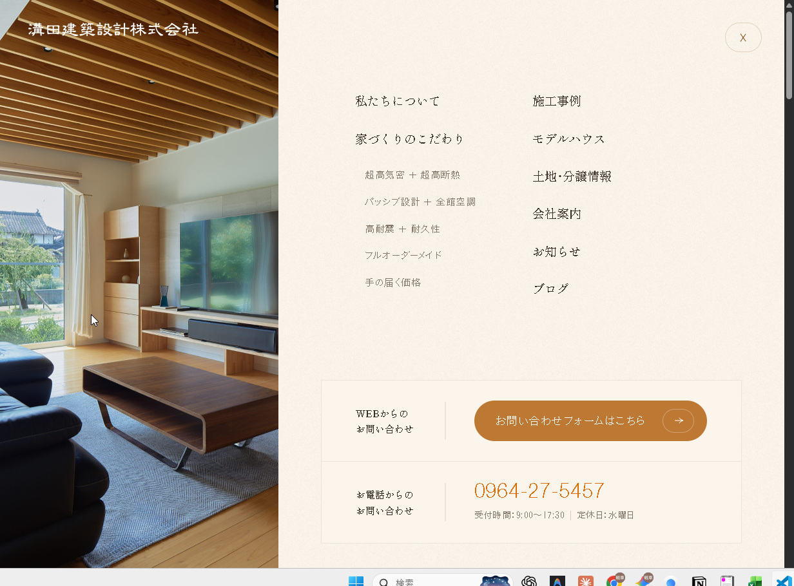

```
┌────────┬────────┬──────┐
│ 40%    │ 40%    │ 20%  │ ← 同じ行（空白あり）
├────────┴────────┴──────┤
│ 100%（menu_inquiry）   │ ← 次の行
└────────────────────────┘
```

【補足】
- 合計が100%未満なら同じ行に残る
- 合計が100%を超えると次の行へ落ちる
- `width: 100%` は「必ず1行まるごと使う」という意味
- `flex-direction: column` なしで使うのがポイント（rowのまま）

## 📌 div背景画像の3点セット（imgタグとの使い分け）

【結論】
背景として画像を使うときは `<div>` + `background-image` の3点セットを使う。
`` タグは flex の中で高さが不安定になるため、装飾画像には使わない。

- `` → コンテンツ画像（商品写真・アイコンなど意味がある）
- `<div>` → 装飾画像（背景・スライド・メニュー画像など）

【具体例】
```css
.menu_img {
  background-image: url("../img/menu/menu01.jpg");  /* 画像指定 */
  background-size: cover;                            /* 領域を埋める */
  background-position: center;                       /* 中央基準でトリミング */
  width: 40%;
  /* heightはflexのstretchに任せる */
}
```

【補足】
- `background-size: cover` だけだと左上基準でトリミングされる
- `background-position: center` で中央を起点にできる
- `object-fit: cover` は `` 専用、`background-size: cover` は `<div>` 専用
- `` に `background-image` を書いても効かない（置換要素のため）

## 📌 position: fixed の5点セット（必ず揃える）

【結論】
`position: fixed` を使うときは5つをセットで書く。
1つでも欠けると表示がおかしくなる。

【具体例】
```css
.overlay {
  position: fixed;   /* 画面に固定 */
  top: 0;            /* 上端に配置 */
  left: 0;           /* 左端に配置 */
  width: 100%;       /* 全幅（fixedは幅がリセットされる） */
  z-index: 100;      /* 重なり順（他の要素と重なるため必須） */
}
```

【補足】
- `width` を忘れると中身の幅に縮む
- `z-index` を忘れると他の要素の下に隠れる
- `height` も必要な場合は `100svh` または `100%` を追加
- `top / left` を忘れると元の位置に残ったまま固定される

## 📌 align-items と align-content の違い（flex-wrap のときに重要）

【結論】
- `align-items` → **1行の中**でのアイテムの縦位置を制御
- `align-content` → **行と行の間**の縦位置を制御（複数行のときだけ効く）

`flex-wrap: wrap` で複数行になったとき、行間を制御したいなら `align-content` を使う。

【具体例】
```css
/*
  構造:
  <nav>           ← flex親
    <a> × 3       ← 1行目（横並び）
    <a> お問い合わせ ← 2行目（折り返し）
*/

/* 複数行レイアウト（行間を上下に広げる） */
.nav {
  display: flex;
  flex-wrap: wrap;
  align-content: space-between; /* 1行目↑ 2行目↓ */
}

/* 各行の中でアイテムを縦中央に */
.nav {
  align-items: center;
}
```

```
【align-content: space-between のイメージ】
┌─────────────────────┐
│ [A]  [B]  [C]       │ ← 1行目（上端）
│                     │
│                     │ ← 行間のスペース
│ [D]                 │ ← 2行目（下端）
└─────────────────────┘

【align-items: center のイメージ】
┌─────────────────────┐
│  [高い]  [低い]     │ ← 行の中で縦中央揃え
└─────────────────────┘
```

★１行目と２行目の行間をつみたいとき
行間をなくす → align-content: flex-start
行間を数値で決める → row-gap
align-items は行の中の縦位置だから行間には関係ない


【補足】
- 1行しかない → `align-content` は効かない（`align-items` だけ使う）
- 複数行（`flex-wrap: wrap`）→ 両方使える
- セットで覚える：`items` = 行内の縦位置 / `content` = 行間の縦位置
- `justify-content` は横方向、`align-content` は縦方向（対になってる）

---

## 📌 子要素を「縦に積む」ときは、子それぞれにabsoluteを付けず、親をabsoluteにして子は普通の流れで並べる　または、div要素の兄弟関係になると縦につまれる。

【日付】2026-02-26
【結論】
背景の上にテキストを重ねて、さらにテキスト同士を縦に並べたいとき、
子要素それぞれに `position: absolute` を付けると「流れから外れる」ので並ばない。
➡ **親を `position: absolute` にして、子は普通の流れ（normal flow）のまま `margin` で間隔調整する**

【具体例】
```html
<section class="mainvisual_area">
  <div class="mainvisual_bg">...</div>  <!-- 背景スライド -->
  <div class="mainvisual_content">      <!-- 親をabsoluteに -->
    <div class="mainvisual_title"></div>     <!-- 普通の流れ -->
    <p class="mainvisual_copy">明日を灯す。</p>  <!-- 普通の流れ -->
  </div>
</section>
```

```css
/* ✅ 正解：親をabsoluteで背景の上に配置、子は流れで並べる */
.mainvisual_content {
  position: absolute;
  bottom: 20%;
  left: 10%;
}

.mainvisual_title {
  /* absoluteなし → 普通の流れ */
}

.mainvisual_copy {
  margin-top: 1rem; /* タイトルとの間隔だけ */
}

/* ❌ 間違い：子それぞれにabsoluteをつけると縦に並ばない */
.mainvisual_title { position: absolute; bottom: 30%; left: 10%; }
.mainvisual_copy  { position: absolute; bottom: 15%; left: 10%; }
```

【補足】
- `position: absolute` の要素は「流れから外れる」→ 次の要素はその存在を無視して配置される
- 子を縦に積みたい場合 → 親をabsoluteにして子は普通の流れ
- 子を重ねたい（重なり合う）場合 → 子それぞれにabsoluteを付ける（別の用途）
- **親がabsoluteで浮くには、祖先に `position: relative`（またはabsolute/fixed）が必要**
  - ３層構造：祖先（relative）→ 親（absolute）→ 子（普通の流れ）
  - `static`（デフォルト）の祖先はabsoluteの基準になれない


## 📌 position: relative は「装飾しない素のキャンバス」に置く（背景divを基準にすると位置がズレる）

【日付】2026-02-26
【結論】
`position: relative` を置く要素は、padding・margin・borderをつけない「純粋なキャンバス」にする。
背景色・装飾・余白は別の子divに任せる。

- 基準にする要素に装飾を加えると、absoluteの子の位置がズレる
- 「基準」と「装飾」は役割を分ける

【具体例：会社セクションの構造】
```html
<section class="company_area">          <!-- ← position: relative（装飾なし） -->
  <div class="company_background">      <!-- ← 背景・装飾・高さを担当 -->
    <div class="company_circle"></div>
  </div>
  <div class="company_photos">          <!-- ← position: absolute（sectionを基準） -->
    × 5
  </div>
  <div class="company_message">         <!-- ← position: absolute（sectionを基準） -->
    ...
  </div>
</section>
```

```css
/* ❌ NGパターン：背景divを基準にすると… */
.company_background {
  position: relative;
  padding-top: 5rem;  /* ← この余白のせいでphotosがズレる */
}

/* ✅ OKパターン：sectionを基準にする */
.company_area {
  position: relative; /* 装飾なし・余白なし */
}
.company_background {
  /* 自由に装飾できる */
}
.company_photos {
  position: absolute;
  top: 0; left: 0; /* sectionの端から正確に配置 */
}
```

【補足】
- `position: relative` の親に `padding` や `margin` をつけると、子の `absolute` の基準点がズレる
- 背景div・装飾div・高さを決めるdiv → すべて別の子divに分担させる
- 「基準になる要素」＝何も装飾しない器（section / main / wrapper）

## 📌 CSS clip-path: ellipse() で波形・カーブ背景を作る　マルを生成する

【日付】2026-02-27
【結論】
`clip-path: ellipse(横% 縦% at X% Y%)` で要素を楕円形に切り抜いてカーブを作れる。
`border-radius` より柔軟で、非対称な波形も作れる。

【具体例】
```css
.company_background {
  clip-path: ellipse(150% 100% at 20% 0%);  ★
}
```

【補足・数値のコツ】
- **150%（横の半径）**: 100%より大きくすると右側になだらかなカーブが長く続く
- **100%（縦の半径）**: 大きくすると波が下に深く（鋭く）えぐれる
- **20% 0%（中心位置）**: 波の「一番深い場所」の基準点
  - 0〜100 の範囲で指定、中心は 50%
  - 70% → 右寄りに波が深くなる
  - 20% → 左寄りに波が深くなる
- `border-radius` との違い: `clip-path` は要素自体を切り抜くため透明部分が生まれる（後ろが透けて見える）

★ツール
[プレビュー](http://localhost:54321/preview-20260227-070142.html)
## 📌 CSS background-image と HTML img の使い分け

【日付】2026-02-27
【結論】
- `` → **コンテンツ**（内容の一部・意味がある画像）
- `background-image` → **装飾**（見た目だけ・なくても意味が伝わる）

判断基準: 「この画像がなくなったら内容が伝わらない？」→ ``

【具体例】
```css
/*
  使い分けの例:
  <section .hero>          ← 背景画像は CSS（装飾）
     社員写真  ← コンテンツなので HTML の img
     ロゴ       ← コンテンツなので HTML の img
*/

/* 装飾的な背景 → CSS で指定 */
.hero {
  background-image: url("../img/hero.jpg");
  background-size: cover;
}
```

【補足】
- `` は alt 属性をつけられる → SEO・アクセシビリティに有利
- `background-image` は alt なし → スクリーンリーダーに無視される
- スライドショー背景・ヒーロー背景 → `background-image`
- 社員写真・商品画像・ロゴ → ``

## 📌 CSS linear-gradient で背景をグラデーションにする

【日付】2026-02-27
【結論】
`background: linear-gradient(方向, 色1 位置, 色2 位置)` で背景をグラデーションにできる。

【具体例】
```css
/* 上から下へ 濃い青 → 明るい青 */
.背景 {
  background: linear-gradient(180deg, #0f467e 0%, #1e83c7 100%);
}
```

【補足】
- `180deg` = 上→下（0deg = 下→上、90deg = 左→右）
- `0%` = グラデーションの開始位置、`100%` = 終了位置
- `background-color` の代わりに `background` で書く（shorthand）
- 3色以上も可: `linear-gradient(180deg, 色A 0%, 色B 50%, 色C 100%)`

▢
メモ：jQuery fadeOut/fadeIn - コールバック関数で画像をフェード切り替え（fadeOut完了後にsrc変更＋fadeIn）

【気づき】
★fadeOutの第2引数（コールバック関数）の中でsrc変更＋fadeInする → 順番が保証される
★メソッドチェーン `.attr("src", imgSrc).fadeIn(300)` で1行にまとめられる

【ポイント】

★ポイント1: fadeOutのコールバックで順番制御
```javascript
// fadeOut(速度, コールバック関数)
$(".gallery_main").fadeOut(1000, 
 () {
  $(this).attr("src", imgSrc).fadeIn(300);
});
```
コールバックを使わないとフェードアウト中に画像が変わってしまう

★ポイント2: メソッドチェーンで属性変更→フェードイン
```javascript
$(this).attr("src", imgSrc).fadeIn(300);
// ↑ src変更        ↑ フェードイン
```
$(this)はコールバック内ではfadeOutした要素自身を指す

★コピペで動く最小コード（ファイル分離版）
```


**HTML**
```html
<!doctype html>
<html lang="ja">
  <head>
    <meta charset="UTF-8" />
    <meta name="viewport" content="width=device-width, initial-scale=1.0" />
    <title>画像切り替え</title>
    <link rel="stylesheet" href="css/画像の切替セクション.css" />
  </head>
  <body>
    <section class="gallery_area">
      
      <div class="gallery_thumbnails">
        
        
        
      </div>
    </section>
    <script src="https://code.jquery.com/jquery-3.6.0.min.js"></script>
    <script src="js/画像切り替え.js"></script>
  </body>
</html>
```

**CSS（css/画像の切替セクション.css）**
```css
.gallery_area { width: 80%; margin: 0 auto; padding-top: 50px; }
.gallery_main { display: block; width: 100%; height: 400px; margin-bottom: 20px; background-color: #eee; object-fit: contain; }
.gallery_thumbnails { display: flex; justify-content: space-between; gap: 10px; }
.gallery_img { width: calc((100% - (10px * 2)) / 3); height: 200px; cursor: pointer; object-fit: cover; }
```

**JavaScript（js/画像切り替え.js）**
```javascript
$(function () {
  $(".gallery_img").on("click", function () {
    const imgSrc = $(this).attr("src");
    $(".gallery_main").fadeOut(1000, function () {
      $(this).attr("src", imgSrc).fadeIn(300);
    });
  });
});
```

📋 [詳細ソース](./その他/00_サンプルソース/★jQuery_fadeOut_fadeIn_画像切り替え.md)

---

## 📌 PHP 変数の基本（宣言不要・スネークケース・ドット結合・配列操作）

【日付】2026-03-03
【結論】
PHPの変数はJavaScriptと違い、型宣言が不要。命名はスネークケースが基本。

### 変数の宣言
- `$` をつけるだけ。`let` `const` などの宣言キーワードは不要
```php
$user_name = "田中";
$age = 25;
```

### 命名規則
- スネークケース（`_` で区切る）が基本
```php
$first_name = "太郎";
$total_price = 1000;
```

### 文字列の結合
- JavaScriptは `+` だが、PHPは `.`（ドット）
```php
$first = "Hello";
$second = "World";
echo $first . " " . $second;  // Hello World
```

### 配列の宣言と末尾追加
```php
// 宣言
$sports = ["野球", "テニス"];

// 末尾に追加（[] を使う）
$sports[] = "サッカー";
// → ["野球", "テニス", "サッカー"]
```

### 配列の要素を削除
```php
// unset で指定した要素を削除
unset($sports[1]);
// → "テニス" が削除される
```

【補足】
- `$` を忘れるとエラーになる
- `.` と `+` を混同しないよう注意
- `unset` は指定インデックスを削除（詰め直しはされない）

### 連想配列の宣言
```php
$user = [
  "name" => "田中",
  "age" => 25,
  "city" => "東京"
];

echo $user["name"];  // 田中
```

---

## 📌 WordPress テーマ作成の全体フロー（どこに何を書くかの早見表）

### ① テーマフォルダを作る
場所: `wp-content/themes/〇〇_theme/`

### ② 必須ファイルを作成
| ファイル | 役割 | 必須のコード |
|---------|------|-------------|
| `style.css` | 共通CSS（テーマ認識に必須） | - |
| `index.php` | テンプレートの基本（必須だが基本触らない） | - |
| `functions.php` | CSS/JS読み込み・機能追加を全部ここに書く | `wp_enqueue_style()` / `wp_enqueue_script()` |
| `header.php` | `<head>`〜`<header>` | `<?php wp_head(); ?>` → CSSを出力 |
| `footer.php` | `<footer>`〜`</body>` | `<?php wp_footer(); ?>` → JSを出力 |

### ③ ページテンプレートを作成
| ファイル | 用途 |
|---------|------|
| `front-page.php` | トップページ |
| `page-〇〇.php` | 固定ページ（〇〇 = スラッグ名） |
| `single.php` | 投稿詳細ページ |

### ④ functions.php に CSS/JS を登録
```php
function enqueue_styles() {
    // CSS読み込み
    wp_enqueue_style('ID名', get_template_directory_uri() . '/css/ファイル.css');
    // JS読み込み（第3引数=依存、第5引数=true→footer読み込み）
    wp_enqueue_script('ID名', get_template_directory_uri() . '/js/ファイル.js', array(), false, true);
    // jQuery使う場合（WordPress同梱・パス不要）
    wp_enqueue_script('jquery');
}
add_action('wp_enqueue_scripts', 'enqueue_styles');
```

### ⑤ 読み込みの流れ（しくみ）
```
functions.php で登録 → add_action() でフックに追加
  ↓
header.php の wp_head()  → 登録されたCSSを <head> 内に出力
footer.php の wp_footer() → 登録されたJSを </body> 直前に出力
```

### ⑥ WordPress管理画面での操作
| 操作 | 場所 |
|------|------|
| テーマ有効化 | 外観 → テーマ |
| 固定ページ作成 | 固定ページ → 新規追加（スラッグ = page-〇〇.phpの〇〇） |
| トップページ設定 | 設定 → 表示設定 → 固定ページを選択 |
| サイト確認 | 管理画面左上「W」右の家マーク → 右クリック → 新しいタブで開く |

### ⑦ テンプレート内でよく使うPHP
| コード | 意味 |
|--------|------|
| `<?php get_header(); ?>` | header.phpを読み込む |
| `<?php get_footer(); ?>` | footer.phpを読み込む |
| `<?php echo esc_url(home_url('/')); ?>` | リンクURL（安全に出力） |
| `<?php echo get_template_directory_uri(); ?>/img/〇〇.png` | 画像パス（PHPファイル内） |
| CSSから: `url(../img/〇〇.png)` | 画像パス（CSSファイル内は相対パスでOK） |

### ⑧ jQuery注意点（WordPress固有）
- `$` は使えない → `jQuery` で書く
- `jQuery(function($){ ... })` で囲めば中は `$` OK
- `array('jquery')` = 自分のJSがjQueryに依存していることを宣言（読み込み順を保証）

---

## 📌 WordPress テーマのフォルダ構造（img・css・jsの役割）

【日付】2026-03-03
【結論】
- テーマフォルダ内に `img/` `css/` `js/` を置いて管理する
- `style.css` はテーマ直下に必須（ないとテーマとして認識されない）
- `css/` フォルダには各ページ固有のCSSを入れる

【具体例】
```
OO_theme/
  img/               ← テーマ専用の画像
  css/               ← 各ページ固有のCSS
    front-page.css
    single.css
  js/                ← JavaScript
  style.css          ← 共通CSS（ここ必須！動かせない）
  index.php          ← 必須「ただし基本はなにもさわらない」
  front-page.php
  header.php
  footer.php
```

| ファイル | 置く場所 | 役割 |
|---------|---------|------|
| `style.css` | テーマ直下（必須） | 全テンプレート共通のCSS |
| `css/〇〇.css` | cssフォルダ内 | 各ページ固有のCSS |

【補足】
- `style.css` と `index.php` がテーマ直下にないとWordPressがテーマとして認識しない
- テーマごとにimg/を分けることで、どの画像がどのテーマか明確になる
- `index.php` は認識用に置くだけで、中身は何も書かない
- トップページの内容は `front-page.php` に書く（HTML/CSSでの `index.html` の役割）
- `header.php` `footer.php` は共通パーツ。1回書けば全ページで使い回せる
- HTML/CSSでは各ページに毎回ヘッダー・フッターを書いていたが、WordPressでは呼び出すだけでOK
- 修正も1ファイル直せば全ページに反映される → 効率的
- `page-〇〇.php` = 固定ページ用テンプレート。〇〇にはページ内容の英単語を入れる
- ファイル名はデザイナーがデザイン時点で指定するので、基本その名前に従う
  - 問い合わせ → `page-contact.php`
  - プライバシーポリシー → `page-privacypolicy.php`
- 画像・リンクのパスは直書き禁止。PHPの関数で動的に生成する
  - 画像: `<?php echo get_template_directory_uri(); ?>/img/logo.png`
  ★SRCの指定は、
  ・?phpで開始！
  ・""の文字列
  ・最後は;でわらせる。ＰＨＰの終わりは; ?>
  覚え方は？ＰＨＰなの？　？＞そうみたい

  のなかで設定して、
  - リンク: `<?php echo home_url('/about/'); ?>`
  - 理由: サーバーの場所によってURLが変わるため
- `header.php` には `</body>` `</html>` は不要。閉じタグは `footer.php` に書く（分割管理のため）

### WordPressのページは2種類ある

**① 固定ページ（page）** = お店の「看板」
- 一度作ったらほぼ変わらない
- 例：会社概要、問い合わせ、プライバシーポリシー、アクセス
- たとえ：レストランの「メニュー表」や「店舗情報」→ 毎日変わらない

**② 投稿ページ（post）** = お店の「チラシ・お知らせ」
- どんどん新しい記事が追加される
- 例：ブログ記事、ニュース、お知らせ、イベント情報
- たとえ：レストランの「本日のおすすめ」や「キャンペーン情報」→ 毎回変わる

| 比較 | 固定ページ | 投稿ページ |
|------|-----------|-----------|
| たとえ | 看板・メニュー表 | チラシ・お知らせ |
| 更新頻度 | ほぼ変わらない | どんどん増える |
| テンプレ | `page-〇〇.php`（一覧） | `single.php`（詳細） |
| 一覧 | なし | `archive.php` で一覧表示 |

### archive.php と single.php の関係
```
archive.php（一覧） → 記事をクリック → single.php（詳細）
```
- `archive.php` = 本棚（記事10個がずらっと並ぶ一覧）
- `single.php` = 本の中身（1つクリックした先の個別ページ）
- この2つはセットで使う

アーカイブPHPは基本記事。それ以外に増やしたい場合は、個別アーカイブ
### archive-〇〇.php / single-〇〇.php（カスタム投稿）
- デザインが違う一覧・詳細は `〇〇` 付きで別テンプレにする
- 〇〇には英単語を入れる（デザイナーの指定に従う）
- 例：商品一覧 → `archive-product.php` / `single-product.php`
- 例：店舗一覧 → `archive-shop.php` / `single-shop.php`

### functions.php（テーマの中枢）
- CSS・JSファイルの読み込み設定、機能の拡張、デフォルト動作の変更を書くファイル
- たとえ：テーマの「コントロールパネル」。裏側の設定を全部ここで管理する
- 多数の関数が書かれており、テーマは最適な状態で設定されている
- ⚠ 触ると正常に動かなくなることがある → **変更時は必ず他の人に報告・確認する**

---

## 📌 Local（ローカル環境）からWordPressを始める手順

【日付】2026-03-03
【結論】
Localを使ってWordPressのローカル環境をセットアップする手順。

### 手順
1. **Localの設定で日本語にする**
2. **インストールフォルダを確認する**
3. **Local側に戻って「Site Folder」を押す** → WordPressのフォルダが開く
4. **テーマを入れる**
   - 場所：`wp-content/themes/` にテーマフォルダを置く
   - 例：`C:\Users\guest04\Local Sites\local-test\app\public\wp-content\themes`
5. **テーマを有効化する**
   - WordPress管理画面 → 外観 → テーマを選んで「有効化」
6. **サイトを表示する**

---

## 📌 WordPressの画像パスは相対パス（img/fv.jpg）だと表示されない → <?php echo get_template_directory_uri(); ?>/img/〇〇 でテーマフォルダのフルURLを取得して書く（URLが深い階層だから相対パスでは届かない）

【日付】2026-03-04
【結論】
- `get_template_directory_uri()` はテーマフォルダまでのフルURLを返す関数
- `echo` をつけないと画面に出力されない → `<?php echo get_template_directory_uri(); ?>` がセット

【具体例】
```php
<!-- ❌ 相対パス → 表示されない -->


<!-- ✅ PHP関数でテーマフォルダのURLを取得 → 表示される -->
/img/fv.jpg" alt="">
```

【補足】
- WordPressのURLは `/wp-content/themes/テーマ名/` のように深い階層になるため、相対パスだと正しい場所を指せない
- `get_template_directory_uri()` はテーマフォルダまでのフルURLを返してくれる
- ただし **CSSから呼ぶ場合は相対パスでOK**（CSSファイル自体がテーマフォルダ内にあるため、相対パスで正しく辿れる）

---

## 📌 WordPressのリンクURLは <?php echo esc_url(home_url('/')); ?> で書く → home_url()でURL取得 + esc_url()で安全化する二重構造（関数の中に関数がある・内側から実行される）

【日付】2026-03-04
【結論】
- `esc_url` = escape URL の略。危険な文字を無害化する
- `home_url('/about/')` のようにパスを変えれば別ページへのリンクも作れる
- 画像パスは `get_template_directory_uri()`、リンクURLは `esc_url(home_url())` → 用途が違う

【具体例】
```php
<!-- ✅ リンクの書き方 -->
<a href="<?php echo esc_url(home_url('/')); ?>">トップへ</a>

<!--
  実行順序:
  ① home_url('/')         → "http://local-test.local/" を取得
  ② esc_url(①の結果)      → 安全なURLに変換
  ③ echo ②の結果          → HTMLに出力
-->
```

【補足】
- `echo` = 「出力して」という命令。関数だけ書いても画面には出ない、`echo` がないと表示されない
- `<?php echo 〇〇; ?>` はWordPressでよく使うセットで覚える

---

## 📌 WordPress固定ページは管理画面で作成 → タイトルを入力してスラッグにURLを設定する → スラッグ「about」と書くと page-about.php が自動で使われる
★おそらくwordPressの飛び先を設定する。　これは固定ページ

★設定画面のイメージ
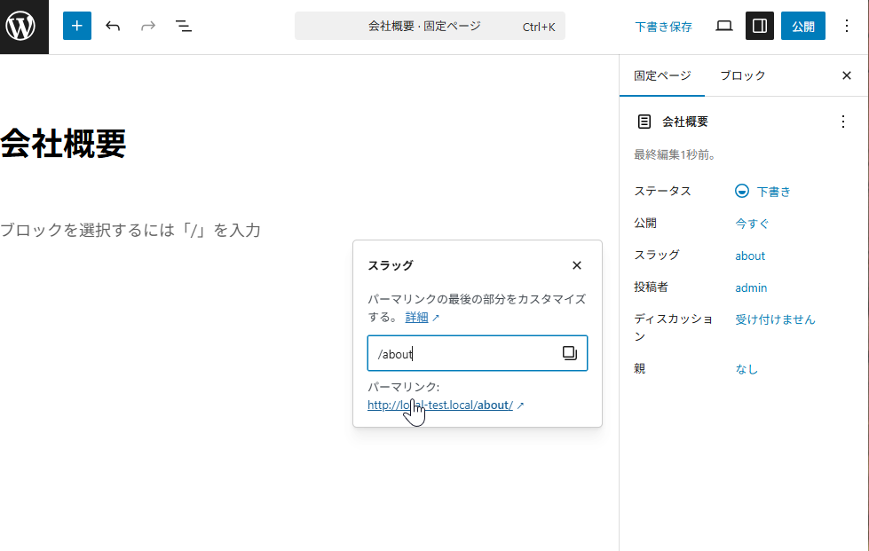

【日付】2026-03-04
【結論】
- スラッグ = URLの末尾になる文字列（例: `about` → `/about/`）
- テンプレートファイル名 `page-〇〇.php` の「〇〇」とスラッグが一致すると自動で使われる

【具体例】
```
■ 固定ページ作成手順
1. 管理画面 → 固定ページ → 「新規固定ページを追加」
2. タイトルを入力（例：「会社概要」）
3. スラッグにURLを設定（例：about）
4. 公開する

■ スラッグとテンプレートの対応
  スラッグ: about    → テンプレ: page-about.php
  スラッグ: contact  → テンプレ: page-contact.php
```

| 固定ページ | スラッグ | テンプレートファイル |
|-----------|---------|-------------------|
| 会社概要 | about | `page-about.php` |
| お問い合わせ | contact | `page-contact.php` |

【補足】
- URLが `/about/` になる固定ページを作ると、「`page-about.php`」 が自動で使われる
★ ヘッダーのリンクから `/about/` に遷移すると、`page-about.php` の内容が表示される
-
 同じ手順でお問い合わせ（contact）なども作れる

---

## 📌 WordPressのCSS読み込みは <head>に直書きNG → functions.php に wp_enqueue_style('識別名', パス) で書く（WordPress本体のCSSと競合するから）

【日付】2026-03-04
【結論】
- 第1引数 = 自分でつけるID名（WordPress内部で重複管理に使う）、第2引数 = CSSファイルのパス
- パスは `get_template_directory_uri() . '/css/〇〇.css'` で作る
- `.`（ドット）はPHPの文字列結合（JSの `+` と同じ）、`,`（カンマ）が引数の区切り

【全体のながれ】

★「CSS読み込みの全体の流れ: ① functions.php で `wp_enqueue_style()` → ② `add_action()` で登録 → ③ header.php の `wp_head()` で実行・出力」


【具体例】
```php
// functions.php ※ 2行セットで書く

// ① 定義（何を読み込むか）← 関数名は自分で自由に決める
function enqueue_style(){
    wp_enqueue_style('reset', get_template_directory_uri() . '/css/reset.css');
}
//                    ↑第1引数: ID名    ↑第2引数: パス（. で文字列結合して1つにしている）

※日本語約「wp_enqueue_style」・・・「WordPressのCSS読み込みリストに順番に並ばせる」

// ② 登録（いつ実行するか → WordPressに「このタイミングで①を呼んで」と伝える）
add_action('wp_enqueue_scripts', 'enqueue_style');
//          ↑決まり文句（丸暗記）    ↑①で作った関数名を文字列で渡す（名前が一致しないと動かない）
```

| 引数 | 内容 | 例 |
|------|------|-----|
| wp_enqueue_style 第1引数 | スタイルの識別名（自分でつける） | `'reset'` |
| wp_enqueue_style 第2引数 | CSSファイルのパス | `get_template_directory_uri() . '/css/reset.css'` |
| wp_enqueue_style 第3〜5 | 省略可（今は覚えなくてOK） | - |
| add_action 第1引数 | フックの名前（決まり文句） | `'wp_enqueue_scripts'` |
| add_action 第2引数 | 実行したい関数名（①と同じ名前） | `'enqueue_style'` |

【補足】
- ①だけ書いても動かない（定義しただけで誰も呼ばない）
- ②だけ書いても動かない（呼ぼうとしても関数が存在しない）
- **必ず①定義 + ②登録の2行セット**で覚える
- `enqueue`（エンキュー）= 「キュー（順番待ちの列）に追加する」→ だから読み込み順を制御できる
- `functions.php` は全ページ共通で動く設定ファイル → ここに書いたCSS読み込みは全ページに適用される
- `wp_head()` = header.php の `</head>` 直前に必ず書く。これが登録されたCSSを全部出力するトリガー
「CSS読み込みの全体の流れ: ① functions.php で `wp_enqueue_style()` → ② `add_action()` で登録 → ③ header.php の `wp_head()` で実行・出力」
- 1つの関数内に `wp_enqueue_style()` を複数書けば、全部順番に読み込まれる
- 同じID名（第1引数）を2回書いても、2回目は自動で無視される（重複読み込み防止）
- `wp_head()` は自分が定義したCSS以外に**WordPressのデフォルトCSS**も読み込む → header.php に `wp_head()` を忘れずに書く
- デフォルトCSS = WordPress本体が持っている管理バー・Gutenbergエディタ等のスタイル。自分では書いていないが裏で自動適用される
- CSSファイルを追加するときは `wp_enqueue_style()` を1行ずつ増やすだけでOK:

```php
★基本すべての必要なCSSを追記する
function enqueue_style(){
    wp_enqueue_style('reset', get_template_directory_uri() . '/css/reset.css');
    wp_enqueue_style('header', get_template_directory_uri() . '/css/header.css');
    wp_enqueue_style('footer', get_template_directory_uri() . '/css/footer.css');
    wp_enqueue_style('about', get_template_directory_uri() . '/css/about.css');
    wp_enqueue_style('front-page', get_template_directory_uri() . '/css/front-page.css');
    // ↑ 追加のCSSはここに1行ずつ追加していく
}
add_action('wp_enqueue_scripts', 'enqueue_style');
```
【関連】→ 「wp_enqueue_script」で検索（JS読み込みの書き方・引数の意味）
【関連】→ 「wp_footer」で検索（footer.phpでJSを出力するトリガー）

<!-- 📝 WordPress関数読み込みの仕組み（図解） -->

```html
<!DOCTYPE html>
<html lang="ja">
<head>
<meta charset="UTF-8">
<style>
body { font-family: sans-serif; padding: 20px; background: #f5f5f5; }
.container { max-width: 800px; margin: 0 auto; }
.step { background: white; padding: 20px; margin: 20px 0; border-radius: 8px; box-shadow: 0 2px 4px rgba(0,0,0,0.1); }
.step-title { font-size: 20px; font-weight: bold; color: #2271b1; margin-bottom: 15px; }
.code-box { background: #282c34; color: #abb2bf; padding: 15px; border-radius: 4px; font-family: monospace; margin: 10px 0; }
.arrow { text-align: center; font-size: 40px; color: #2271b1; margin: 10px 0; }
.highlight { background: #ffd700; padding: 2px 5px; border-radius: 3px; }
.flow { display: flex; align-items: center; justify-content: space-around; margin: 20px 0; }
.box { background: #e7f3ff; border: 2px solid #2271b1; padding: 15px; border-radius: 8px; text-align: center; min-width: 150px; }
.ng { background: #ffe7e7; border-color: #d63638; }
.ok { background: #e7ffe7; border-color: #00a32a; }
</style>
</head>
<body>

<div class="container">
  <h1>📘 WordPress CSS読み込みの仕組み</h1>

  <!-- ステップ1 -->
  <div class="step">
    <div class="step-title">① 定義（レシピを書く）</div>
    <div class="code-box">
function enqueue_style() {<br>
&nbsp;&nbsp;wp_enqueue_style('reset', get_template_directory_uri() . '/css/reset.css');<br>
}
    </div>
    <p>📝 <strong>やること:</strong> 「reset.cssを読み込む」という<span class="highlight">レシピを作成</span></p>
    <p>⚠️ これだけでは<strong>実行されない</strong>（料理本に書いただけ）</p>
  </div>

  <div class="arrow">⬇️</div>

  <!-- ステップ2 -->
  <div class="step">
    <div class="step-title">② 登録（いつ作るか予約する）</div>
    <div class="code-box">
add_action('wp_enqueue_scripts', 'enqueue_style');
    </div>
    <p>📌 <strong>やること:</strong> WordPressに「<span class="highlight">wp_enqueue_scriptsのタイミング</span>で①を実行して！」と予約</p>
    <p>🎯 WordPressが自動でレシピ通り実行してくれる</p>
  </div>

  <div class="arrow">⬇️</div>

  <!-- 実行タイミング -->
  <div class="step">
    <div class="step-title">🚀 実際の動き</div>
    <svg width="100%" height="200" style="margin: 20px 0;">
      <rect x="50" y="20" width="150" height="60" fill="#2271b1" rx="5"/>
      <text x="125" y="55" text-anchor="middle" fill="white" font-size="14" font-weight="bold">WordPress起動</text>
      
      <path d="M 200 50 L 270 50" stroke="#333" stroke-width="2" marker-end="url(#arrow)"/>
      <text x="235" y="40" text-anchor="middle" font-size="12" fill="#d63638">「wp_enqueue_scripts」</text>
      <text x="235" y="70" text-anchor="middle" font-size="12" fill="#d63638">のタイミング！</text>
      
      <rect x="270" y="20" width="150" height="60" fill="#00a32a" rx="5"/>
      <text x="345" y="50" text-anchor="middle" fill="white" font-size="12" font-weight="bold">enqueue_style()</text>
      <text x="345" y="65" text-anchor="middle" fill="white" font-size="11">関数を実行</text>
      
      <path d="M 345 80 L 345 120" stroke="#333" stroke-width="2" marker-end="url(#arrow)"/>
      
      <rect x="270" y="120" width="150" height="60" fill="#ffd700" rx="5"/>
      <text x="345" y="145" text-anchor="middle" font-size="12" font-weight="bold">reset.css</text>
      <text x="345" y="165" text-anchor="middle" font-size="11">読み込み完了✅</text>
      
      <defs>
        <marker id="arrow" markerWidth="10" markerHeight="10" refX="9" refY="3" orient="auto">
          <path d="M0,0 L0,6 L9,3 z" fill="#333"/>
        </marker>
      </defs>
    </svg>
  </div>

  <div class="step">
    <div class="step-title">⚠️ よくある間違い</div>
    
    <div class="flow">
      <div class="box ng">
        <strong>❌ ①だけ</strong><br>
        定義したけど<br>誰も呼ばない<br>
        → <strong>動かない</strong>
      </div>
      
      <div class="box ng">
        <strong>❌ ②だけ</strong><br>
        呼ぼうとしたけど<br>関数がない<br>
        → <strong>エラー</strong>
      </div>
      
      <div class="box ok">
        <strong>✅ ①+②セット</strong><br>
        定義して<br>登録もした<br>
        → <strong>正常動作</strong>
      </div>
    </div>
  </div>

  <div class="step" style="background: #fff3cd; border-left: 4px solid #ffc107;">
    <div class="step-title">💡 覚え方</div>
    <p style="font-size: 18px; margin: 10px 0;">
      <strong>①定義</strong> = 料理のレシピを書く 📖<br>
      <strong>②登録</strong> = 「夕食時に作って」と予約 ⏰<br>
      <strong>両方必要</strong> = レシピだけあっても作らないと食べられない 🍳
    </p>
  </div>

</div>

</body>
</html>
```

**ポイント:**
- ①は「設計図」②は「実行指示」
- 必ず2行セットで書く
- add_actionが「フック（引っ掛ける場所）」に関数を登録している

---

## 📌 WordPressのJS読み込みもCSS同様に functions.php で wp_enqueue_script() を使う → CSSとの違いは引数が多い（依存・バージョン・読み込み位置を指定する）

【日付】2026-03-04
【結論】
- CSS読み込み（`wp_enqueue_style`）と同じ仕組み。`<script>` タグを直書きしない
- 第5引数の `true` が重要 → `</body>` 前に読み込まれる（`false` だと `<head>` 内）

【具体例】
```php
// functions.php ※ CSS読み込みと同じく2行セット

// ① 定義
function enqueue_script(){
    wp_enqueue_script('main', get_template_directory_uri() . '/js/main.js', array(), '1.0.0', true);
    //                 ↑ID名   ↑パス                                        ↑依存なし ↑バージョン ↑body末尾に読み込む
}

// ② 登録（add_actionは同じ）
add_action('wp_enqueue_scripts', 'enqueue_script');
```

| 引数 | 内容 | 例 |
|------|------|-----|
| 第1（$handle） | スクリプトの識別名 | `'main'` |
| 第2（$src） | JSファイルのパス | `get_template_directory_uri() . '/js/main.js'` |
| 第3（$deps） | 依存スクリプト（なければ `array()`） | `array()` |
| 第4（$ver） | バージョン | `'1.0.0'` |
| 第5（$in_footer） | 読み込み位置 | `true` = body末尾 / `false` = head内 |

【補足】
- CSSは `wp_enqueue_style`、JSは `wp_enqueue_script` → **style か script かの違いだけ**
- `add_action` のフック名はどちらも `'wp_enqueue_scripts'`（同じ）
- JSは基本 `true`（body末尾）にする → ページの読み込みが速くなる
- 実際の `functions.php` では CSS読み込みとJS読み込みを**同じファイルに続けて書く**（別ファイルではない）
- 「ID名（第1引数）は任意」（自分で自由に決める）。ただし他のスクリプトが依存する場合、そのID名を `$deps`（第3引数）で指定する
【関連】→ 「wp_enqueue_style」で検索（CSS読み込みの書き方・functions.phpの構成）
【関連】→ 「wp_footer」で検索（footer.phpでJSを出力するトリガー）

---

## 📌 position: absoluteの場合、縦100vhで縦サイズを指定していた場合、bottomから指定したらやrem指定すると で場合ずれる。

【日付】2026-03-04
【結論】
親が `height: 100vh` のとき、子に `bottom: rem` を使うと環境（画面サイズ）によって位置がずれる。
`top` で指定するか、`%` で指定すれば安定する。

| 指定方法 | 結果 |
|----------|------|
| `bottom: rem` + 親が `100vh` | ❌ 環境によってずれる |
| `top: rem` | ✅ 上から固定なのでずれにくい |
| `top/bottom: %` | ✅ 親の高さの割合なので安定 |

【具体例】
```html ★たて１００vhで指定
  <section .mainvisual_area>   ← position: relative / height: 100vh（可変）
    <video .mainvisual_video>  ← position: absolute / 火の動画
```

```css
/* ❌ NG: 環境によってずれる */
.mainvisual_video {
  position: absolute;
  bottom: 18rem; /* ← 100vhと組み合わせると危険 */
}

/* ✅ OK: topで上から固定 */
.mainvisual_video {
  position: absolute;
  top: 30rem; /* ← 上から固定なのでずれにくい */
}

/* ✅ OK: %で割合指定 */
.mainvisual_video {
  position: absolute;
  bottom: 25%; /* ← 親の高さの25%の位置 */
}
```

【補足】
- `100vh` はディスプレイの高さに依存 → 自宅と会社でピクセル数が違う
- `rem` は固定値 → ディスプレイが変わっても同じ距離
- 結果：親の高さだけが変わって子の距離は変わらず → ズレる
- ヘッダー下に置く要素は `top` 指定が自然で安定
   - 管理画面左上の「W」の右にある家マーク → 右クリック → 新しいタブで開く

---

## 📌 mix-blend-mode: screen で動画の黒い部分を透過させる

【日付】2026-03-04
【結論】
動画（または画像）の黒い部分を背景に透過させたいとき、
★画像を取得した際に、画像自体が背景がある場合がある。黒で
その背景を取り除く場合あ。

`mix-blend-mode: screen` を使う。

【具体例】
```css
.mainvisual_video {　→　画像の親要素
  mix-blend-mode: screen; /* 黒→透明、白→そのまま表示 */
}
```

【補足】
- `screen` = 黒(#000)が完全に透明になる。白は白のまま残る
- 炎・煙・光など「黒背景の素材」に使うと自然に合成できる
- `multiply`（乗算）は逆：白が透明になる → 白背景の素材に使う

---

## 📌 ホバーでテキストが下から上にスライド → ::afterで文字を下に隠し、hover時にtranslateY(-100%)で元テキストごと上に押し出す

【日付】2026-03-04
【結論】
疑似要素（`::after`）で同じ文字を下に隠しておき、ホバー時に両方を上に動かすことで「文字が入れ替わるように見える」アニメーション。

- 画面上には常に2つの文字列が存在している（1つは見える、1つは下に隠れている）
- `overflow: hidden` で枠外を隠すのがカギ

【具体例】
```css
/*
  <a .header_nav_item>        ← overflow: hidden（枠の外は見えない）
    <span .header_text>       ← 通常時に見える文字
      ::after                 ← 下に隠れている同じ文字（data-textから取得）
*/

.header_nav_item {
  overflow: hidden; /* 枠からはみ出たら見えない */
}

.header_text {
  display: block;
  transition: transform 0.3s ease;
}

/* 同じ文字を下に待機させる */
.header_text::after {
  content: attr(data-text); /* HTMLのdata-text属性の値を表示 */
  position: absolute;
  transform: translateY(100%); /* 自分の高さ分だけ下に隠れている */
  left: 0;
}

/* ホバーで全体を上に押し出す → 元の文字が消えて、下の文字が現れる */
.header_text:hover {
  transform: translateY(-100%);
}
```

```html
<a class="header_nav_item" href="#">
  <span class="header_text" data-text="会社概要">会社概要</span>
</a>
```

【補足】
- `attr(data-text)` = HTML属性の値をCSSで読み込む
- `translateY(100%)` = 自分の高さ分だけ下へ（隠れる位置）
- `translateY(-100%)` = 自分の高さ分だけ上へ（入れ替わる）

---

## 📌 WordPress footer.php に wp_footer() を書く → JSが `</body>` 直前で読み込まれる（wp_head()のJS版・書かないとJSが動かない）

【日付】2026-03-04
【結論】
`wp_footer()` は `wp_head()` のJS版。footer.phpの `</body>` 直前に書く。
`wp_enqueue_script()` の第5引数を `true` にしたJSは、`wp_footer()` の位置で出力される。

- `wp_head()` → CSSを `<head>` 内に出力
- `wp_footer()` → JSを `</body>` 直前に出力
- 両方書かないとfunctions.phpの登録が反映されない

【具体例】
```php
<!-- footer.php -->
<footer class="footer">
    <small>&copy; Test株式会社 All Rights Reserved.</small>
</footer>

<?php wp_footer(); ?>   ← ★ここ！</body>の直前
</body>
</html>
```

【補足】
- JSは基本 `</body>` 直前で読み込む → ページ描画を邪魔しない（表示が速くなる）
- `wp_enqueue_script()` の第5引数 `true` = footer読み込み（`wp_footer()`から出力）
- `wp_enqueue_script()` の第5引数 `false`（デフォルト） = head読み込み（`wp_head()`から出力）
- `wp_footer()` を書き忘れると、`true` 指定したJSが一切読み込まれない
【関連】→ 「wp_enqueue_script」で検索（JS読み込みの書き方・引数の意味）
【関連】→ 「wp_enqueue_style」で検索（CSS読み込みの書き方・functions.phpの構成）
【関連】→ 「wp_head」で検索（header.phpでCSS/JSを出力するトリガー）

---

## 📌 WordPress にはjQueryが最初から入っている → wp_enqueue_script('jquery') だけで使える（CDN読み込み不要）

【日付】2026-03-04
【結論】
WordPressにはjQueryが同梱されている。`wp_enqueue_script('jquery')` と書くだけで有効化される。
CDNやファイルのパス指定は不要（第2引数なし）。

【具体例】
```php
// functions.php
function enqueue_script(){
    wp_enqueue_script('jquery'); // WordPressに同梱されているjQueryを読み込む
}
add_action('wp_enqueue_scripts', 'enqueue_script');
```

【補足】
- `'jquery'` はWordPressが予約しているID名 → パス不要で読み込める
- 自分のJSでjQueryを使う場合、`$deps` に `array('jquery')` を指定すると読み込み順が保証される：
```php
wp_enqueue_script('my-script', get_template_directory_uri() . '/js/main.js', array('jquery'), false, true);
```
- WordPressのjQueryは `$` ではなく `jQuery` で書く（`$` は他ライブラリと競合防止のため無効）
- `jQuery(function($){ ... })` で囲めば中では `$` が使える（実務ではこの書き方が多い）
- jQueryとJavaScriptは別物ではない。**jQueryはJavaScriptで作られた道具箱（ショートカット集）**
- `array('jquery')` = 「このJSファイルはjQueryを使うから**先に読み込んでね**」という順番指定
```
読み込み順: ① jquery（道具箱） → ② main.js（道具箱を使う自分のコード）
```
- 先にjQueryが読み込まれていないと `jQuery is not defined` エラーになる
- 会社でjQuery多用 → 覚える必要あり（素のJSでも同じことはできるが、既存コードがjQueryなら合わせる）
【関連】→ 「wp_enqueue_script」で検索（JS読み込みの書き方・引数の意味）
【関連】→ 「wp_footer」で検索（footer.phpでJSを出力するトリガー）jQueryをワードプレスでつかいたい