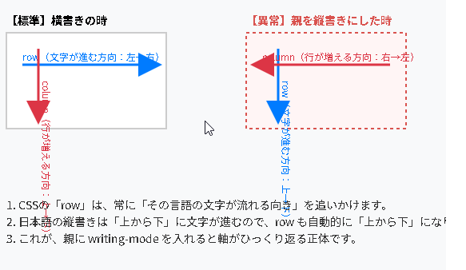
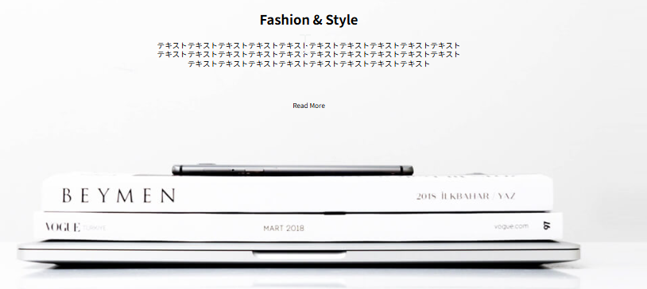
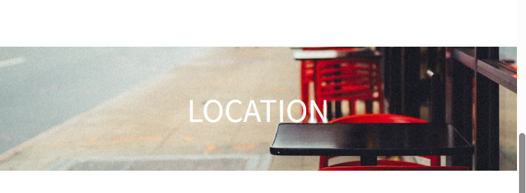
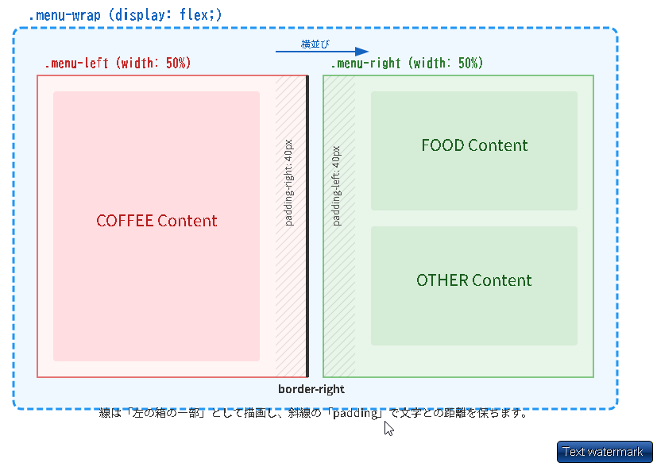
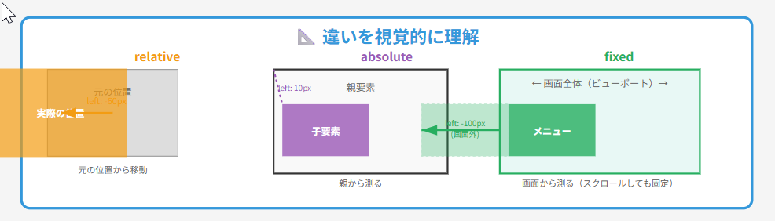
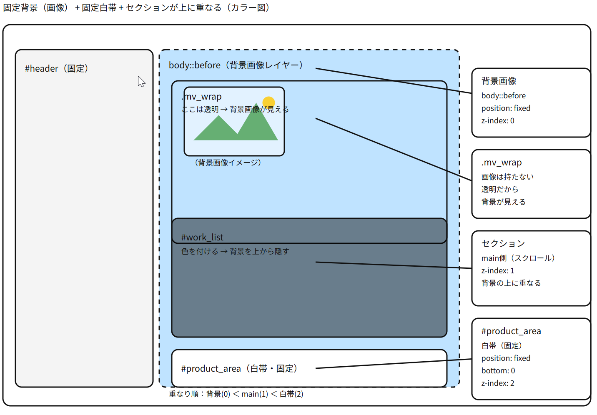
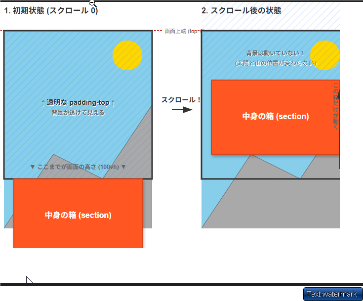

▢ 　背景画像は PC と SP で切り替え（`<picture>`タグ or メディア
切り替えたい場合は以下のように指定する。
background-image: url("../img/mainvisual-pc.jpg");をするときは
普段とちがって ima src と時と違い　../一度上のフォルダに移動する必要がある

▢ 　ＰＣとスマホで画像を変える場合は、HTML でＳＲＣを指定せず
スマホ版で以下のように設定する

<header class="header_area">
.header*area {
background-image: url("../img/mainvisual-pc.jpg");
background-size: cover; /* 要素いっぱいに広げる */
background-position: center; /* 中央基準で表示 */
}

▢ ポジションアブソリュートの使い方
親に relative、子に absolute を設定します。
親（position: relative）└ 子（position: absolute）← 親を基準に配置される
★ 同じ階層でもできる上は間違い → かならず重ねたい要素をリラティブにする。

HTML 構造-------------------------------------------------

<header class="header_area"> <!-- 親 -->
  <nav>
    <!-- ナビゲーション -->
  </nav>
  ★親のメインヘッダに対して、子階層にセットする
  <div class="header_online">  <!-- 子：これを左下に配置したい -->
    <a href="https://example.com" target="_blank" rel="noopener noreferrer">
      オンラインストアを見る
    </a>
  </div>
</header>
---
ポジションリラティブは子要素に書く必要ある。
.header*area {
position: relative; /* ← これがないと absolute が効かない */
}
/* 子：左下に配置 */
.header*online {
position: absolute; /* 親を基準に配置 */
left: 20px; /* 左から 20px */
bottom: 20px; /* 下から 20px */
}
HTML 構造-------------------------------------------------

▢ 　たてがきは writing-mode: vertical-rl;
これは親要素ではなく a タグにかく。

▢ 　 prettier できずいたらすぐ、コパイロットにいってタグをなおしてもらう

▢ 　フレックスは、上にかかれたものから左から順番に記載されることをわすれない。

▢

<ul class="footer_location">
<!-- └ 子フレックス -->
<li class="nav-item">
<a href="#">０ ３ | Ｘ Ｘ Ｘ Ｘ | Ｘ Ｘ Ｘ Ｘ</a>
</li>
<li class="nav-item">
<a href="#">〒 １ ０ ６ | ０ ０ ３ ２ 　 東 京 都 港 区 六 本 木 ５ 丁 目 × × × × ×</a>
</li>
</ul>

nav-item が縦書きにならない
.footer_location {
display: flex;
gap: 3rem;
writing-mode: horizontal-tb;
}

縦書きで「横並び」にしたい時の呪文 CSS 答え
.target {

display: flex;
writing-mode: vertical-rl; /_ 縦書きにする _/
flex-direction: column; /_ 横に並べるための必須スイッチ _/
}

▢ 　 flex 子フレックスで、width を指定すると、flex1 としているより
優先されるため、基本、サイズを指定する必要がない場合は flex1 にきめておくと楽。

ーーーーーーーーーーーーーーーーーーーーーーーーーーーーーーーーーー
自分でデザインカンプ
▢ 　画面をよこにみて、absolute の回数を減らす。(理由、
★Absolute を減らして、流れ（横方向）で作る理由
壊れないから（一番大事）
Absolute は「画鋲で止める」ようなものです。
画面の大きさが変わると、止めた場所がズレてレイアウトが崩壊します。
流れで作れば、画面に合わせて柔軟に動いてくれます。
計算しなくていいから vertical-rl（縦書きモード）を使えば、
h1（ロゴ）の隣に nav（メニュー）が自動的に並びます。

座標を計算して配置する手間がゼロになります。
結論： 「頑張って配置する」のではなく、「勝手に並ぶようにする」のがプロの書き方です。)

header
h1
nav

▢ 　クラスを直接指定する方法
タグ名で省略せず　ネストされたクラス名もかならずかく
a タグにもクラス名をかっく

<div class="online_absolute">
  <a href="#" target="_blank" class="online_link">オンラインストアを見る</a>
</div>

▢ 全体像を把握してまとめてパディングをしかける

▢nav はメインメニューの場合だけ使用する

  <nav class="header_nav">
    <ul class="header_nav_list">
      <li class="header_nav_item">
        <a href="#menu" class="header_nav_link">MENU</a>
      </li>
      <li class="header_nav_item">
        <a href="#about" class="header_nav_link">ABOUT</a>
      </li>
      <li class="header_nav_item">
        <a href="#location" class="header_nav_link">LOCATION</a>
      </li>
    </ul>
  </nav>

````css
/* 1. リストを横に並べる */
.header_nav_list {
  display: flex;
  list-style: none; /* 点を消す */
  gap: 3rem; /* 項目間の余白 */
}

/* 2. リンクのクリック範囲を広げる */
.header_nav_link {
  display: block; /* padding を効かせるために必須（ルール3） */
  text-decoration: none;
  color: #333; /* 文字色 */
  font-size: 1.4rem;
  padding: 1rem; /* 上下左右に余白を作って押しやすくする */
}
```css ※縦書きしたい場合、 .header_nav_list {
  display: flex;
  flex-direction: column; /* 縦に並べる（文字は横のまま） */
  list-style: none;
  gap: 2rem;
}

.header_nav_link {
  display: block;
  writing-mode: vertical-rl; /* 文字を縦書きにする */
  text-decoration: none;
  padding: 1rem 0;
}
````

▢ 　ぜんたいのメインカラーがあれば最初に BODY でいろをぬっておくそうすると section のエリアでマージンボトムしたときも色がつく

▢ 更新した時途中からブラウザで表示したい場合
飛ぶ　リンクする　遷移する

・URL の最後に、　 about をつける　 #移動　#リロード #遷移 #セクション
http://localhost:5500/#about
・HTML のセクションで ID をふる

<section id="about" class="concept_area">

1. 大事(「１」が本命できなかった「２」をする)`

「１」直った原因（推測）

settings.json に fullReload: true を追加した

CSS 保存時も完全リロードするようになった
window.addEventListener("load")が発火するようになった

Live Server を再起動した

設定が反映されるには再起動が必要
古いキャッシュがクリアされた

VSCode を再起動した

拡張機能が正しく読み込まれた
設定ファイルが確実に反映された

「２」

1. 手順：CSS 保存時もリロードさせる設定
   VS Code で Ctrl + , (カンマ) を押して設定を開く。

上の検索バーに live server full と入力する。

出てきた項目の Live Server > Settings: Full Reload にチェックを入れる（オンにする）。

3. javaScript に以下を追加する(これは多分関係ない)

```JavaScript
window.addEventListener('load', () => {
    setTimeout(() => {
        window.location.hash = "";
        window.location.hash = "footer";
    }, 100);
});
```

▢flex で指定した画像に absolute で文字を配置しようとすると、top bottom などと指定した位置と、表示があわなくなる
Flex だと画像の高さが隣のタイトルに合わせられてしまうので、
align-items: flex-start をかけて高さを画像に合わせる必要がある。

▢ うっかりミス
サイズが違うと思ったら、Style CSS でフォントサイズを 1400px に指定しているのを忘れていた。

※設計者は、 「ヘッダーは文字が流れるだけだから、縦書き設定だけで十分」
「商品はスマホでレイアウトをガラッと変えたいし、画像との位置関係を調整したいから、Flexbox という強力なツールを使おう」
と判断して使い分けた、ということです。

▢ 　インライン要素は、display block
ブロック要素にすることによって、padding、border、width、height が
すべて正確に計算されるようになる。
よく使うインライン要素

<a>: リンク
<span>: テキストのグループ化（装飾用）
<strong> / <b>: 太字
<em> / <i>: 斜体
<label>: フォームのラベル
<small>: 注釈や細目

▢ 　パディングはあくまで中身の文字と文字というか、
要素と外の枠ボックスの距離を取るものである。
もしも自分で分からなくなったら、ボーダーで指定するとイメージが開く。
ボーダーを指定せずに、パディングだけして色だけ指定すると、
枠がない色を作ることができる。


## 🏗 HTML タグの設計図（使い分け）まとめ

### 1. ロゴと見出し

- **h1:** サイトロゴに使用。画像を入れる場合は `h1` で囲む。
  ```html
  <h1 class="logo"></h1>
  ```
- **h2:** セクションのタイトル。日英併記などは `span` を使い、見出しタグの中にインライン要素として配置する。
  ```html
  <h2 class="news_title">
    <span class="title_news">News</span>
    <span class="title_notice">お知らせ</span>
  </h2>
  ```

### 2. 日付とお知らせ / メニュー (dl, dt, dd)

- **用途:** 「項目名（日付・料理名）」と「値（内容・価格）」がセットの時。
- **暗記:** 「dl」だけ打てばサジェストされるので、それを活用する。
  ```html
  <dl class="news_list">
    <div class="news_item">
      <!-- divで囲むとレイアウトしやすい -->
      <dt>2021.01.01</dt>
      <dd>タイトルタイトル...</dd>
    </div>
  </dl>
  ```

### 3. 見出しと詳細説明 (h2 + p)

- **原則:** 見出しは `h2`、説明の文章は `p`。
- **禁止:** `h2` の中に `div` や `p` などを入れることは文法上禁止（インライン要素のみ OK）。
- **構造:** まとめる場合は全体を `div` で囲む。
  ```html
  <div class="fashion_wrapper">
    <h2 class="fashion_title">Fashion & Style</h2>
    <p class="fashion_description">テキストテキスト...</p>
  </div>
  ```

### 4. ナビゲーション (nav)

- メインメニューの場合だけ `nav` を使用する。通常 `nav > ul > li > a` の構造にする。

---

▢ 　 AI にお願いするとき、サンプル SVG


▢GitHub に支持する才能、テンプレート

1. スクリーショットを保存して、立ち上げてお

セクションの画像: 1 画面に収まる範囲のスクリーンショット。
素材（アセット）: 使用する画像ファイル名（例：img/ice-cream.jpg）。
構造の指定: 「ここは dl/dt/dd を使う」「ここは h2 と span の構成」などの指示。

▢FORMAT によって、
セクションごとで
左右逆に全く同じデザインなんだけど、
flex-direction: row-reverse; を使用する。

row: 左から右へ（1, 2, 3）
row-reverse: 右から左へ（3, 2, 1）


※「軸が逆転して、混乱するのは」
writing-mode: vertical-rl 文字が流れる方向

親が縦書き（NG 例）:
flex directon row（本来「横」） → 「上から下」に並ぶようになる。
column（本来「縦」） → 「右から左」に並ぶようになる。
これが「軸が回転して予測不能になる」原因です。


▢Position: absolute;をする場合、

前 ■ position: absolute の親子関係とサイズの一致
画像を基準にテキストを配置したい場合、画像そのものではなく、画像とテキストを包む「親ボックス」を基準点（relative）にするのが鉄則です。

なお、まんなかに記載したい場合は

```css
.test{
position:absolute
left: 0;
right: 0;

margin: 0 auto;

top: 50%;
transform: translateY(-50%); /* ★下に着すぎたものを半分↑に戻す */
}
```

## おやに absolute をかける理由

1. 構造の考え方
   親ボックス（.concept_card）は、中にある画像（.concept_img）のサイズに合わせて自動的に伸縮します。そのため、「親の枠」と「画像の枠」は基本的に一致します。

メリット: 画像に直接 absolute をかける必要がなく、レイアウトが崩れにくい。
ポイント: relative は「コンセプトイメージ」ではなく「親のカード」に実施する。

2. 実装コード
   <!-- 親：ここで relative を実施する（基準点） -->
   <div class="concept_card">
     
     <!-- 子：親を基準に自由に移動する -->
     <p class="concept_text">テキストテキスト</p>
   </div>

```css
.concept_card {
position: relative; /_ 親：基準点 _/
}

.concept_text {
width: 35rem;
height: 14rem;
position: absolute; /_ 子：親を基準に浮く _/
bottom: 2rem;
left: 2rem;
}

```

3. なぜサイズが一致するのか
   親要素が「ピッタリ重なっている」ように見えるのは、親要素が子要素（画像）のサイズに合わせて伸縮する性質を持っているからです。

この性質を利用することで

、画像からの距離を測るのではなく、親ボックスからの距離を指定するだけで、意図した位置（左下など）にテキストを正確に配置できます。


▢ 　大事　暗記　パーセント(%)とレム(rem)の使い分け

使い分けの目安：

文字サイズや余白: rem（画面に合わせて自動拡大縮小）
レイアウトの横幅（カラム）: %（親要素の中での占有率を決定）


▢ 　問題：
仕様書で「幅は % 指定」と言われたけど、% にするとデザインカンプとサイズがズレる。

理由：
% は「親の箱の中で何割を占めるか」を決めるだけで、「画像の大きさ」そのものは制御できないから。

解決策：
% と max-width（rem）を同時に指定する。

```css
.concept_card {
  /* 親の中での占有率（仕様書の指示） */
  width: 65%;

  /* 画像の最大サイズをロック（カンプ通りのサイズ） */
  max-width: 63rem;
}
```


「細かい数字」ではなく「見た目のバランス」を守るのがレスポンシブの鉄則です。

## 分かった一番重要なこと　暗記

まず、
width 100％　
max-width: 140rem
max-width を指定する理由としては
前段のスタイル.css とかで

```css
html {
  font-size: calc(10 / 1400 * 100vw);
  /* 画面幅1280pxで10px*/
}
```

これがないことを想定している。
なぜならば、一緒にサイズが伸びてしまうからあまり意味がない。

もしもスタイルＣＳＳで上記の記述があるならば、以下をしていけばいい。

```css
html {
  /* 10px と 計算値のうち、小さい方が採用されます */
  font-size: min(10px, calc(10 / 1400 * 100vw));
}
```

## ▢ 拡張ツールの見方　暗記

紫・・・その紫色の部分は、justify-content: center; によって生じている Flexbox の余白（整列スペース） です。

## ▢ 　マージンとパディングの違い

暗記
親要素から見れば、子要素はパッディングで設定する。子要素同士から見れば、マージンで他の距離を取る。

つまり。おやで最初にパディングを
とるのがわかりやすい。

▢ 　 📝 縦書きレイアウトの失敗メモ　暗記

❌ 失敗パターン（親で縦書き）

```css
.news_area {
  writing-mode: vertical-rl; /* 親に設定 */
  display: flex;
  flex-direction: row-reverse;
}

何が起きる： flexの軸も一緒に回転して、配置が予測できなくなる


✅ 正解パターン（子だけ縦書き）　

css
/* 親：横書きのまま、配置だけ制御 */
.news_area {
  display: flex;
  flex-direction: row-reverse;
}

/* 子：文字だけ縦書き */
.news_title,
.news_wrapper {
  writing-mode: vertical-rl;
}
```

**なぜ良い：** flex は普通に動く、中の文字だけ縦になる

---

### 🎯 覚え方

```
親 → 配置（flex）
子 → `文字の向き`（writing-mode）

役割を分ける！
```


▢ 　うっかりミス
子要素が一つだけなのに‘フレックス‘をかけてしまった。

## ▢ 　手書きの図形の書き方

手書きメモの形式

・画面に情報を混在させず、画面下に「クラス名」を記載し「プロパティ」を書くスタイルに統一します。

## ▢ 　パディング のかけかた

覚え方
（余白の目的）　　　　（使うもの全体に）
共通の余白　　　　　　親の padding
子ごとに違う余白　　　子の margin

今回は「他と合わせる」より「実際の構造に合わせる」が優先二重管理を避けた方が、3 ヶ月後の自分が楽です！

以下の場合は、右と下だけパディングをつける。
それ以外は、子でマージンで別々に管理する。


## ▢ 　 writing-mode: vertical-rl

これをかけることによって見方がかわる。flex direction :column;が横配置など

## ▢ 　うっかりミス

見た目が、自分の想定と違うと思った、デザインカンプ 1400px に対して、wrapper でサイズを max-with1200 にしていた。

-----------------------------↑ 上記追記済み　 GitHub インストラクションに

## ▢ メディアクエリ

/_ @media screen and (max-width: 375px) {
_/

## ▢ git 個人メモ、★github ルールに追加する必要なし

1. git の紐づけ

```
git remote add origin https://github.com/あなた/リポジトリ.git

git branch -M main
git push -u origin main

```

2. おかしいと思ったらこの 1 行だけ打ってください。

git remote -v
・「あれ？知らない URL だ」→ フォルダ間違い確定
・「合ってる」→ 他の原因

※作業したいフォルダ（今回は 50_knowledge）を直接 VS Code で開く。

3. 最新情報を取得して、強制的に上書き
   git fetch origin
   git reset --hard origin/main

## コンフリクト

1. 変更マージの下にある。ところでコンフリクトをしている。

もし、クリックして、コンフリクトを解消する。
・カラーのあるところの上に両方マージするみたいな文字がでるのでそれをクリック

・その後、変更マージの右側を＋ボタンをする。

・コミット、プッシュ

## ▢ 　以下のようにして　左右に画像と、その中にテキストを

浮かびあがらせることができる


画像と、もう一つのボックス（浮き上がらせるテキスト・img_overlay）を並列にして、img_item でポジションをする

<div class="img_container">
  <!-- 1つ目の画像セット -->
  <div class="img_item">
    
    <div class="img_overlay">
      <h3 class="img_title">Archive</h3>
      <p class="img_text">テキストテキストテキストテキスト<br>テキストテキストテキスト</p>
    </div>
  </div>

  <!-- 2つ目の画像セット -->
  <div class="img_item">
    
    <div class="img_overlay">
      <h3 class="img_title">New</h3>
      <p class="img_text">テキストテキストテキストテキスト<br>テキストテキストテキスト</p>
    </div>
  </div>
</div>

## position: absolute で中央配置する方法

必要な 3 つの要素
css.overlay {
position: absolute;
left: 0; /_ 1. 基準の左端 _/
`right: 0;          /* 2. 基準の右端 */`
`width: 30rem;      /* 3. 自分の幅 */`
margin: 0 auto; /_ 4. 余りを均等に _/
}
なぜ全部必要？
要素役割 left: 0; right: 0;「親の左端〜右端が基準」と伝える width 自分の幅を決める margin: 0 auto;余った幅を左右均等に分ける
イメージ図
親要素（position: relative）
┌─────────────────────────────────┐
│← left:0 right:0 →│
│ │
│ auto │ 30rem │ auto │
│ 余白 │ 要素 │ 余白 │
└─────────────────────────────────┘
注意点

親要素に position: relative; が必要
width または max-width がないと margin: auto は効かない
left: 0; right: 0; がないと基準が分からず中央にならない

縦方向も中央にしたい場合
css.overlay {
position: absolute;
top: 0;
bottom: 0;
left: 0;
right: 0;
width: 30rem;
height: 10rem;
margin: auto; /_ 上下左右すべて均等 _/
}

## Flexbox で両端揃え + 隙間を作る　 space between ですき間をつくることができる

space between width center

基本の書き方

```css
css.container {
  display: flex;
  justify-content: space-between;
}

.item {
  width: 49%; /* 合計98%、残り2%が隙間になる */
}
```

★ なぜ space-between？

1.  `両端に張り付き、隙間が自動調整される`
    ┌──────────── 親要素 ────────────┐
    │ ┌─ 49% ─┐ 2% ┌─ 49% ─┐ │
    │ │ item1 │ ← 隙間 → │ item2 │ │
    │ └───────┘ 自動 └───────┘ │
    ↑ 左端 右端 ↑
    └───────────────────────────────┘

2.  親の幅が変わってもレイアウトが崩れない
3.  隙間を計算しなくていい（自動で調整）

gap との違い
「方法」 「隙間」 「両端」
space-between + 自動 端に張り付く
width: % 調整  
gap: 固定値 固定 端に余白が
できることも

`使い分け`

| やりたいこと   | 書き方                            |
| :------------- | --------------------------------- |
| 両端揃え+隙間  | `space-between` + `width: %`      |
| 均等な固定隙間 | `gap`                             |
| 中央寄せ       | `justify-content: center` + `gap` |

3 つ以上並べる場合

```css
css.item {
  width: 32%;  /* 3つ × 32% = 96%、残り4%が隙間 */
```

}
┌─────────────────────────────────┐
│ ┌ 32% ┐ 2% ┌ 32% ┐ 2% ┌ 32% ┐│
│ │ 1 │ gap │ 2 │ gap │ 3 ││
│ └─────┘ └─────┘ └─────┘│
└─────────────────────────────────┘

# Flexbox の order で要素の順番を入れ替える

1. `基本`

- `order` プロパティで要素の表示順序を変更できる
- 数値が小さいほど前に表示される
- デフォルト値は `0`

2. `使い方`

```css
.parent {
  display: flex;
  flex-direction: column;
}

.item-a {
  order: 2; /* 後に表示 */
}

.item-b {
  order: 1; /* 先に表示 */
}
```

3. `実例：レスポンシブで順序変更`

```css
/* PC: 画像 → テキスト */
/* モバイル: テキスト → 画像 に変更 */

@media screen and (max-width: 896px) {
  .container {
    flex-direction: column;
  }

  .image {
    order: 2;
  }

  .text {
    order: 1;
  }
}
```

## ポイント

- HTML の構造を変えずに表示順だけ変更できる
- レスポンシブ対応で便利
- `flex-direction: column` と組み合わせると縦並びの順序も変えられる

### 問題点 width が指定されたボックスが中央寄せされていなかった（inline 要素も中央寄せされない）

### 原因

- `display: block;`で幅を`56rem`に固定していた
- 親要素の`text-align: center;`はテキストのみ中央寄せする
- ブロック要素自体を中央に配置するには`margin: 0 auto;`が必要

★ つまり、width を指定すると、`margin: 0 auto;`が必要　`text-alian:center;ではだめ！！`

### 解決策

```css
.fashion_description {
  display: block;
  width: 56rem;
  margin: 0 auto; /* 追加 */
  font-size: 1.4rem;
  line-height: 1.7rem;
}
```

### height の使い分け

## 背景画像（background-image）

✅ height を指定する
理由：箱の高さがないと画像が見えない

```css
#fashion {
  background-image: url(../img/fashion.jpg);
  height: 520px; /* 必要 */
}
```

### 普通の画像（タグ）

❌ height を指定しない
理由：画像が元々サイズを持ってる

```css
img {
  width: 100%;
  /* heightは書かない */
}
```

---

## ■ Fashion セクション(画像を背景に、なかにテキストを重ね書きする)の作り方

### NG：タグで画像を入れる

### OK：CSS で背景画像にする

```html
Fashion & Style テキスト Read More
```

```css
#fashion {
  background-image: url(../img/fashion.jpg);　★
  background-size: cover;
  height: 520px;
  text-align: center;  /* 中央揃え */
  padding-top: 60px;
}
```

---

## ■ 中央揃え

### NG：Flexbox で均等配置

### OK：text-align: center

```css
text-align: center; /* これだけでOK */
```

---

## ■ 覚えておくこと

- 背景画像 = 自分で高さを作る
- 普通の画像 = 勝手に高さがある
  (高さも指定したい場合、
  `width + height + object-fit: cover`)
- 中央揃え = text-align

## シンプルに背景を画像にして、なかに文字をれいれる方法



1. 画像を親（section 等）で、指定する。

```css
.fashion_area {
  width: 100%;
  height: 60rem;
  background-image: url("../img/fashion.jpg");
  background-size: cover; /* 要素いっぱいに広げる */
  background-position: center; /* 中央基準で表示 */
}
```

2. コンテナで画像まとめる

```css
.fashion_title {
  font-size: 2.4rem;
  font-weight: bold;
}

.fashion_description {
  display: block;
  font-size: 1.4rem;
}

.fashion_btn {
  display: inline-block;
  font-size: 1.2rem;
}
```

以下だけで完成

```html
<section class="fashion_area">
  <div class="fashion_wrapper">
    <h2 class="fashion_title">Fashion & Style</h2>
    <p class="fashion_description">
      テキストテキストテキストテキストテキストテキストテキストテキストテキストテキスト
      テキストテキストテキストテキストテキストテキストテキストテキストテキストテキスト
      テキストテキストテキストテキストテキストテキストテキストテキスト
    </p>
    <p class="fashion_btn">Read More</p>
  </div>
</section>
```

## なぜ、セクションの先頭は ID なのか？

ID クラスでない理由　クラス　セクション

アンカーリンク（ページ内リンク）のため

アンカーリンクはクラスにとぶことができない。

そのために、

<!-- ナビゲーション -->

<a href="#menu">MENU</a>

<!-- セクション -->
<section id="menu">...</section>

とする

## なぜ 100vh で画面いっぱいなのに min-height 100vh があるか。

height: 100vh 高さが画面サイズぴったりで**「固定」**される。 → 中身の文字などが増えると、枠からあふれて（はみ出して）しまう。

min-height: 100vh 高さは**「最低でも」画面サイズ。 → 中身が増えれば、それに合わせて自動で縦に伸びてくれる**。

結論 スマホなどで文字が折り返して縦に長くなっても背景が途切れないよう、min-height: 100vh を使うのが安全です。

## absolute で画面の中央にもってくる　 translateY 　 relative リラティブ　アブソリュート

margin 0 auto transform: translateY(-50%);

以下のようにすると画面中央にくる

```css
.site_title {
  position: absolute;

  right: 0;
  left: 0;

  margin: 0 auto;

  width: 48rem; ⇀これも必要

  top: 50%;
  transform: translateY(-50%); ★下に着すぎたものを半分↑に戻す
}
```

## 拡張機能

1. paste image
   カレントディレクトリではなくて
   特定のフォルダに保存する方法

```txt
VS Codeの設定（Ctrl + ,）で「paste image」と検索し、以下の通り書き換えてください。

Paste Image: Base Path
${currentFileDir} に変更
Paste Image: Path
images に変更

```

2. Restore Editors

VS Code レイアウト復元ショートカット
Editors をインストール

保存　 Restore Editors: Save Editor Layout
ショートカットキー設定

keybindings.json に追加：
json{
"key": "ctrl+alt+s",
"command": "restoreEditors.save"
},
{
"key": "ctrl+alt+r",
"command": "restoreEditors.restore"
}
使い方

保存: レイアウトを作って Ctrl+Alt+S
復元: Ctrl+Alt+R → リストから選択

3. サイドバーを閉じる
   ショートカットキー設定
   keybindings.json に追加：

{
"key": "escape",
"command": "workbench.action.closeSidebar",
"when": "sideBarVisible && !inQuickOpen && !suggestWidgetVisible"
}

4. CSS Navigation
   HTML のクラスをサジェストなどをする。

## 様々な flex のパターン

dd dl dt css jump 上級

・２カラムのメニュー表を作成する
左側にメニュー　　右にもメニュー
しかも、メニューごとに、
商品名・・・・価格

---

COffee food
aice ・・・100 sand・・・200
aice2 ・・ 200 　　 sand2....300

```html
➁menu-content (flex 親) 　 ➂meny_item（小　coffee等「←」flex 親）
　　➃dl(商品名) ⑤dt（価格） ➂.menu-item（小　food等「⇀」flex 親）
```

## h2 の使い方

## 本体自体を動かすときは、これをすれば、margin bottom や padding

をつかわず移動ででる

transform: translateY(2px);

パディングとマージンボトムとの違い
要するに、要素間のサイズとか、そういったものがなくなる。それ自体が動くから。

!

## テキストなどの幅をサイズに丁度にボックスを調整する

#inline block #幅　一杯

block = 親の幅いっぱいに広がる箱
inline-block = 中身の幅だけの箱（でも高さと幅を指定できる）

## フレックス(flex)でコンテンツを複数超(2 行)に折り返しをしたいとき

/_ ul タグテキストを４つにわける親要素 _/
#wrap #折り返し #

```css
.about_item_list{
  display: flex;
  flex-wrap: wrap;
  gap: 2rem;
  margin-bottom: 4rem;
```

## パララックス　

透ける　背景

画像の後ろがすけさせるる。
background-attachment: fixed;

これを背景に設定するだけ。

## 透けた背景が、デザインカンプよりサイズがおおきい

background-size: 150%;
画像のサイズを調整

```css
.parallax_area {
  /* 背景画像を表示するための最低限の高さが必要（03_mistakes 参照） */
  min-height: 50rem;

  /* 背景画像の指定 (ルール4: パスは ../img/ から開始) */
  background-image: url("../img/your-image.jpg");
  background-repeat: no-repeat;
  background-position: center;

  /* パララックスの設定：背景をスクロールに固定する */
  background-attachment: fixed;

  /* 背景サイズの拡大：デザインカンプに合わせて調整 */
  background-size: 150%;
}
```

※　サイドバー左固定などは　 height を使用する

背景のサイズを大きくする。



## 子要素の箱ボックスを中央に寄せる方法

子要素が width が設定されてないけど
中央にもってきたい場合。マージン　 0 auto
がつかえない。

親要素で　 text-align: center;

## width を指定して、height を auto にすると自然なかたちになる。

# ヘッダータイトル　固定幅　画像指定

とくにボックスに文字があてはまらない時など利用するとよい。また height は基本しようしないので、
その理由からも多用するとよい。

## フレック(flex)の構造 　

基本、親で指定(flex),子でうける
さらに孫で具体的にデータを記載する
・ただし子で直接コーディングしない。
・子要素ではサイズなどを指定する

例）

```html
<div class="menu_content"> ⇀　ここでflex
    <div class="menu_item"> ⇀　受ける
      <!-- 小見出し -->
      <h3 class="title">C</h3>
      <dl class="menu_list">
        <dt>ブレンドコーヒー</dt>
        <dd>&yen;500</dd>
      </dl>
    </div>

    <div class="menu_item">
      <!-- 小見出し -->
      <h3 class=title">COFFEE</h3>
      <dl class="menu_list">
        <dt>ブレンドコーヒー</dt>
        <dd>&yen;500</dd>
      </dl>
    </div>
  </div>
<div>
```

```css
  .menu_content{
    display:flex;
    flex-wrap: wrap; ★必要であれば
  }

  .menu_item{
    width 40%
  }
```

# サイドバーに固定で表示するときの構文

```css
#header {
  width: 300px;
  height: 100vh;  →　これがないと上部にある文字だけ、下にスクロールしても表示されない。
  position: fixed;
  top: 0;　
  left: 0;
  0: 画面の一番上（上端から 0px の位置）に固定。
　0: 画面の一番左（左端から 0px の位置）に固定。
　※top: 0 と left: 0 は、ヘッダーという 「箱そのも　の」を画面の真ん中ではなく、左上の端（0,0）にピタ　ッと置く という意味です。

  padding: 60px 40px;
  background-color: #fff;
  display: flex;
  flex-direction: column;
}
```

## radius で ◯（丸の形の形をつくる）

```html
<ul class="feature_list">
  <li class="list">
    <a class="radius" href="#">design</a>
  </li>
</ul>
```

```css
/* aタグで大きな〇を作るロジック radius*/
.radius {
  width: 100%;
  border: solid 1px #fff;
  border-radius: 50%; /* ← これで円になる！ */
  color: #fff;
  display: block;
  padding: calc(50% - 11px) 0; /* 上下のパディングで高さを確保 */
}
```

## justify-content: space-between を使用した際は、子要素にサイズを指定できる。間のギャップは、自動！！

「子要素にパーセント（%）や
幅（width）を指定することは【可能】であり、むしろ【必須】に近いテクニック」**

なお、要素別にサイズを決めることも可能
3つ以上の要素がある場合：
もし [30%] [10%] [40%] とバラバラな幅で space-between を使うと、それぞれのアイテムの間の隙間（ギャップ）自体は同じサイズになります。

例）
「2カラムのメニュー表」などで、左側を少し狭く、右側を広くしたい時などに活用できるテクニックです。

・子要素の幅を 30% に指定します。
3個並ぶと：30% + 30% + 30% = 90%
残り：100% - 90% = 10%
この余った 10% が、自動的に2つの隙間（各5%）になります。

## 「文字の上下にある『見えない余白』を限界まで削る」

line-height:1

大きなボックス（高さがしっかりあるボックス）で line-height: 1; を使うと、**「文字が天井（一番上）にベタッと張り付いた状態」**になります。
(上の余白が消える)

## AI に確認する際の注意事項

・ソースを渡す
・デザインカンプを渡す
・専門用語をつかう。
例）　たとえば台形とか、逆台形とか　調べる

## 作業（業務）本番などを始める前にすること。

開始　実務　手順

・全体のデザインカンプをみて、どこのサイズが同じか
どこがそろっているかを調べる。アニメーションなども確認する。
（できれば印刷するといい・手書きもいい）

・できれば仕様もチェックボックスつきでおいておく
（仕様書がある場合）
【ツール】　スクショをとって、gemini に丸投げする。
・全体スクショ
・スクショ毎

・特徴的な場所をかいていく。
とりあえず全部かくと大変。
なので、AI にまるなげでつくらせる。
・これは txt でいい。さらに、それを AI にも添付する。
knowledge ファイルにおいて、日々 ☑ をさせる。コパイロットに

★ 必ず修正も新規も自分でおおまかな図をかく。
・クラス名
・階層

メモは残しておく！！！➡SVG で印刷するのがベスト

【設計ルール】
・同じ画面上、幅は必ず％をもちいて均等に配置する。⇀ 　一部違うところはあるのがほとんどなので、割合（50％）などとクラスはわける


```html
<div class="menu-wrap">
    右
    <div class="menu-col menu-left">　★★ここがポント共通項目とそれ以外をわける
      <div class="menu-section">
        <h3>Coffee</h3>>
      </div>
    </div>
    左
    <div class="menu-col menu-right">

```



`【ループ】`
・HTML と。CSS 同時にセクションを書き終わったら、仕様書とともに check する時間をやる。AI

※専門用語を覚える
・固定サイドメニュー
・逆台形
・グラデーション
・疑似要素

・CSS 修正作業時には両ウインドウに CSS をならべてする。

`【コメント】`
・flex なども含めて、サジェストしてくれるのでコメントは詳しく書く
（すべてを書く必要はない。relative と flex はかく）

## ▢ ホバー時にレイアウトを崩さない「枠線」の使い分け（outline vs border）

`【何回なソースはシンプルをこころがける】`

AI にたのんで、必要最小限のソースにしてもらって
確実に理解していく。ソースがおおくあると
必ず混乱するので。

結論：
特定の要素をホバーした際に「ガタッ」と周りが動いてしまうのを防ぐには、border ではなく outline を使う。

1. なぜ border はずれるのか？
   border は**「箱の厚み」**として計算されます。

0px から 3px に変えると、その要素自体のサイズが上下左右に 3px ずつ大きくなります。
大きくなった分、隣にある要素や下の要素を「よいしょ」と押し出してしまうため、画面が揺れます。 2. なぜ outline はずれないのか？
outline は**「箱の外側に描かれる線」**であり、計算上のサイズは 0 です。

太さをどれだけ変えても、要素自体の大きさ（占有スペース）は変わりません。
他の要素に干渉しないため、レイアウトが一切崩れません。 3. 実装の比較 4. 便利なプロパティ：outline-offset
outline は標準では「箱の外側」に線がつきますが、outline-offset を使うと位置を調整できます。

outline-offset: -3px; ：線の厚み分だけ内側に食い込ませる（デザインカンプ通りに作りやすい）。
outline-offset: 2px; ：箱から 2px 浮かせて線をつける。

## サイドメニューーから header メニューに変更する

## 固定サイドバーをけす。

## すでにあるものを移動する

え？ポジションアブソリュートしなくても top とか　 left で位置かえられるの？

`答え：positionを指定すれば使える`
top, left, right, bottom は、position を指定すれば使えます：

```css
❌ これはダメ（デフォルトは static） _/

#navi {
left: -300px; /_ 効かない！ _/
}

/_ ✅ これなら OK _/

#navi {
position: fixed; /_ または absolute, relative _/
left: -300px; /_ 効く！ _/
}

```

・強引に画面の左にけす。


## ハンバーガーメニューの追加方法

```html
<nav id="navi">
  <!-- メニュー -->
  <ul class="nav_menu_list">
    <li><a class="link" href="#">私たちについて</a></li>
    <li><a class="link" href="#">サービス</a></li>
    <li><a class="link" href="#">商品情報</a></li>
    <li><a class="link" href="#">展示会</a></li>
    <li><a class="link" href="#">暮らしの日記</a></li>
    <li><a class="link" href="#">会社概要</a></li>
  </ul>
  <!-- メニュー２ -->
  <ul class="nav_menu_list">
    <li><a href="#">Twitter</a></li>
    <li><a href="#">facebook</a></li>
    <li><a href="#">instagram</a></li>
  </ul>
</nav>

★★★以下の二つのクラスを追加する。
<!-- ↓↓↓ ここに2つ追加するだけ ↓↓↓ -->
<div class="hamburger">
  <span></span>
  <span></span>
  <span></span>
</div>

<div id="mask"></div>

</header>
```

↓

## 三角形の図形の作り方

```css
すでにある要素に対して、疑似要素で、三角を追加する。なお:afterでもbeforeでも同じ。
  contact_card::after {
  content: "";
  display: block;
  position: absolute;
  /* 三角形のサイズ（お好みで調整してください） */
  width: 2.5rem;
  height: 2.5rem;

  bottom: 0.3rem; /* 下端に配置 */
  right: 0.3rem; /* 右端に配置 */

  /* グラデーションを使って直角三角形を作る魔法の記述 */
  /* 「右下から左上に向かって、50%の位置まで黒、残りは透明」という指定です */
  background: linear-gradient(to top left, #000000 50%, transparent 50%);
  /* カードの枠線の上に重なるように z-index を調整 */
  z-index: 2;
}
```


## トップの画面を固定にして、その下のセクションをスクロールするときに、裏の画面をのこして、重ねて表示させる。　詳細は　./その他/疑問・ソーステストあり md を参照

`ソースをみたいときは、82_CSS_JUMP_上級編_ピカソ`


##　命名ルール　規則

▢ 　コメントをしっかりかく。そうすると補完ででてくる。

## ヘッダーを作成するうえでの注意事項

header は
/_ 高さを固定しない（padding 分も含めて自然に） _/
height: auto;
min-height: 6.2rem;

`中身が少ないとき： min-height が優先され、6.2rem の高さになります。`
`中身が増えたとき（文字が改行した時など）： height: auto のおかげで、中身がはみ出さないように高さが 7rem、8rem と自動で伸びます。`

★ 基本は auto 動作して まわりのパディングとかなかみの画像にあわせて伸縮する！！

最低ラインを確保して、ふえたときは auto でまわりのサイズにあわせる

## うっかりミス　ハンバーガーメニューや

レイヤー重ね処理など

fixed がつくと画面ウィンドウの基準になるので、親要素 Xrem で子要素 100％(fix)だと
子が採用される。

➡ その場合、親要素 fix 子要素 fix の場合
posion relative absolute をかけて

子要素から fixed をはずすことによって
親のサイズがいかされる。

```css
  /* 右上のハンバーガーメニューを表示する */
  .hamburger {
    position: fixed;
    top: 1.5rem;
    right: 1.5rem;
    width: 3rem;
    height: 3rem;
    cursor: pointer;
    z-index: 100; /* 一番上に表示 */
  }

  /* ハンバーガーメニューの横線を作成 */
  .hamburger_line {
    position: absolute;  ★特にリラティブはいらない。
    top: 0;
    right: 0;
    height: 0.3rem;
    width: 100%;
    background: #121212;
    border: 1px solid #121212;
  }
```

# ハンバーガーメニューが押せない問題

## 症状

- スマホ表示（レスポンシブ）でハンバーガーメニューがクリックできない
- 検証ツールでは押せる、実際の画面では押せない

## 原因

1. ハンバーガーの位置が画面外だった
2. 親要素（#header）に z-index がなく、他の要素の下に隠れていた

## ポイント

`position: fixed` の要素は **z-index を持たないとレイヤー比較に参加しない**。
子要素に z-index: 9999 があっても、親が参加してないと負ける。

## 修正


### 1. z-index の追加

```css
/* 修正前 */
#header {
  position: fixed;
  /* z-index なし → レイヤー比較に不参加 */
}

/* 修正後 */
#header {
  position: fixed;
  z-index: 9000; /* これで前面に出る */
}
```

## 覚えておくこと

- `position: fixed` + `z-index` でレイヤーになる
★　親に z-index がないと子も道連れで負ける
- 検証ツールで押せるのに実画面で押せない → z-index か位置を疑う

## ショートカットキー　ホットキー

ALT L⇀ 　 O 　ライブサーバー
CTRL 　 SHIft O クラス検索


## 🛠 問題と解決方法

### 問題 2: ブラウザ幅を狭めてもハンバーガーメニューが表示されない

- **原因:**
  - 通常のブラウザウィンドウのサイズ変更では、ビューポート幅が正しく認識されない場合がある。
- **解決方法:** -　画面のズームの幅をかえる。


## 左右　に枠やマージンやパディングがあって、中央のボックス（width）のサイズをセットしたいとき。
##　またそれを中間にもってきたいとき
コンテンツ幅などに多用する
  width: calc(100% - 40rem);
  margin 0 auto


## メニューが２列あって、同じ幅でフォーマットを構築する際の計算式


```css
.price_area
 {
  width: calc(100% - 40rem);　★コンテンツエリア分残すにはこう記載する。
  margin: 0 auto;
}


/* 各カラム（左・右） 共通クラス*/
/* エリア全体 */
.price_area {
  display: flex;
  justify-content: center;
}

.price_column {
  width: 50%;　　　　★半分ずつなので５０パーセント
  padding: 0 3rem;
  text-align: center;
}

/* 左側のカラム 詳細　みぎにボーダーをつけるなど*/　　★　一応中央線もかいておいた
.left_column {
  border-right: 1px solid black;
}

```

## 背景コンテンツエリアの固定背景固定（パララックス風）の表示を記載したいとき前お物理エリアの背景画像分のサイズを確保したい場合、　シンプルなパララックス


```html
  ・ここに背景画像があるとするパララックス。fixed

  <!-- コンテンツエリア -->
  <main class="main"> ★ここでpadding-top パララックスのサイズ分を指定するとで、透明なすき間をつくる
    <section class="test_area"></section>
    <section></section>
  </main>
```

```css
.main {
  padding-top: 100vh; ★ここが大事
  /* ❌ ここに色があると、上のpadding部分も白くなっちゃう */
  /* background-color: rgba(255, 255, 255, 0.8); */

  /* ⭕️ なので、ここは透明にする（または行ごと消す） */
  background-color: transparent;　★カラーがこれで透明になる。
}

  .test_area{
  width: 100%;
  height: 150rem; ★ここは今テストなのでこうしているが実際はautoなどでつまった分だけふやしていく。★デザインカンプなどで決まっている場合は、min-height を使う

  margin: 0 auto;
  background-color: rgba(46, 12, 160, 0.8);
}

```
}



## HTMLの構造

・基本の書き方

`ヘッダーの書き方`
classではなく IDを理由する。

`ログはH1を利用する`
ロゴはH1って、文字ないのになぜか右SEO対策
```html
<h1 class="site-title">
  <a href="#"></a>
</h1>
```