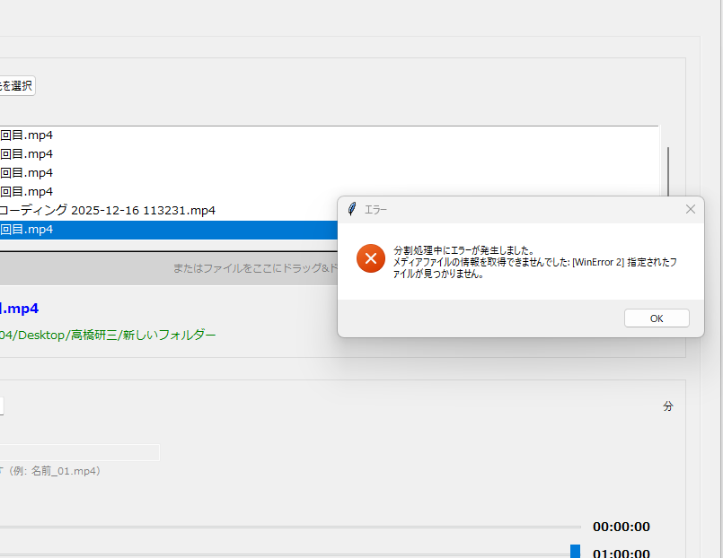
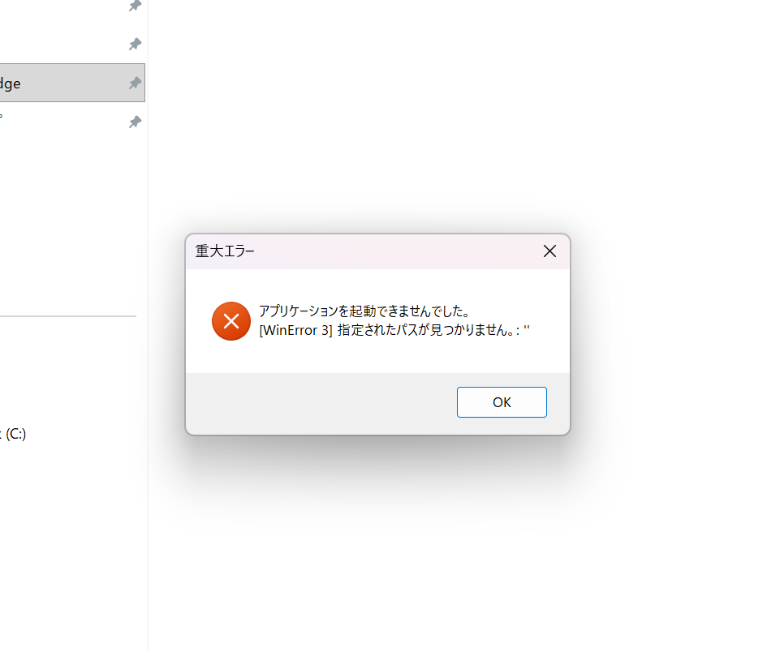
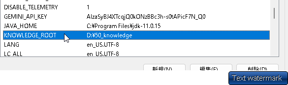
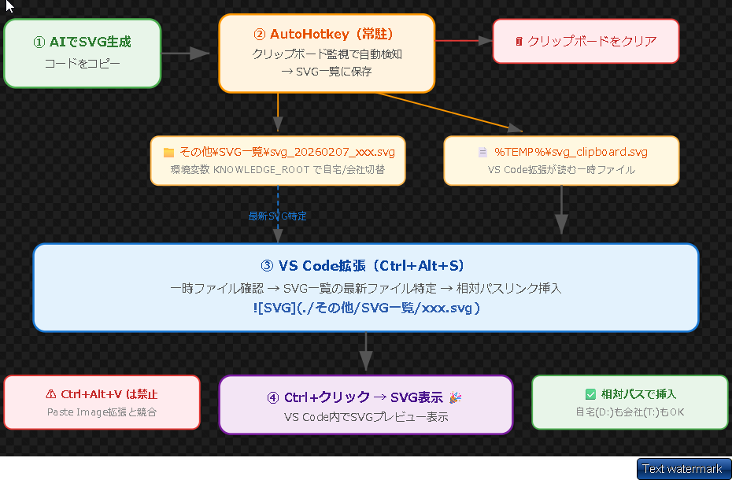

## 拡張機能


▢　MV3.4 分割ツールのダウンロード


▢ 検証ツールで サイズを指定すると、メディアクエリがPCのときの
flexBoxのアイコンの位置で表示される


# 自宅でやること


上記のエラーで分割ツールがエラーがおきる。
時間も表示されない。


-----------------------------------------------------


▢ Alt-Bで, SVGをブラウザで開く.AHK
ALT+Bでブラウザ表示.ahk

・保存パスを変える必要がある。☑
・chatGptで修正する


家
▢動画分割ツール使ったら以下のエラーがでた



##  家にかってから、
で


##　長期的

作成・チェック時のルールをさらにブラッシュアップしていく


ーーーーーーーーーーーーーーーーーーーーーーーーーーーー


## 覚えておくべき共通ルール

ーーーーーーーーーーーーーーーーーーーーーーーーーー
`【チェック＆作成時の注意事項】`
・命名規則チェック　接続部分が_になっているか？
NG　例）
side-area
↓
side_areaに修正　

・英単語のアルファベットなどが違えばがあれば修正
・共通化できるところがあれば、共通化する

例）
サイドバー　

・px表記があればremに統一する。
　10px 1remとする。

・HTMLはとくにコメントがお客様にみえるところなので正確な文章にする。
例）とりあえず～　暫定的等　NG

・コメント等に「debug」の文字がないか⇀削除

・CSSに関して、固定で設定する必要性がなければ（例）画像サイズなどは基本固定。しかし説明などは、基本指定しない。してもwidthだけとか。widthは省略する。
とりあえず、その場合ユーザー(自分に)に報告する。


・AIらしい。コメント
・idはjavascript利用時、リンクで飛ばす時、のみに仕様する。それ以外はclassを利用する。あれば修正

・ALT属性にただしく名前が記載されているか

・整合性があわないもの

例）
・画像が４つならんでいるのに、コメントが「５社が横並びにしている。」など

・JavaScriptなどで「責任（役割）」が混ざってる。
箇所を特定し、修正する。

例）　片方がconst hamburgerBtn =　document.getElementByIdで取得するように統一するなど

// ハンバーガーメニュークリック時にクラス（open）を付け外しする
const hamburgerBtn = document.getElementById("hamburger_btn");

hamburgerBtn.addEventListener("click", function () {
  // ボタン自身に .open を付けて「×」にする
  hamburgerBtn.classList.toggle("open");
  document.getElementById("side_area").classList.toggle("open");
});


・セマンティックな構成になっているか
・メニューはUL,LIでつくられているか。　navが必要な場合も確認
ユーザーに
  <ul class="header_nav_list">
      <li class="header_nav_item">
        <a href="#menu" class="header_nav_link">MENU</a>
      </li>
      <li class="header_nav_item">
        <a href="#about" class="header_nav_link">ABOUT</a>
      </li>
      <li class="header_nav_item">
        <a href="#location" class="header_nav_link">LOCATION</a>
      </li>
    </ul>

・コンテンツ幅がある場合、
その設定がされているか？
ある場合、定数で共通化させる
```css
/* 定数を定義 */
:root {
  --contents_padding: 3rem;
  --contents_main_width: 80rem;
}

```
ーーーーーーーーーーーーーーーーーーーーーーーーーーーー


## 覚えておくべき共通ルーCSS　JUMP　インストール手順

【初回】
必要なもの
css-jumper フォルダ一式

STEP 1️⃣ フォルダを配置
C:\tools\css-jumper\   ← 日本語パスは避ける

STEP 2️⃣ Chrome拡張をインストール
chrome://extensions/ を開く
右上 「デベロッパーモード」ON
「パッケージ化されていない拡張機能を読み込む」
css-jumper フォルダを選択
表示された 拡張機能ID をメモ（例: hoplahamgadnacgmihmaceglgeopkfeg）

STEP 3️⃣ setup.bat を実行
setup.bat をダブルクリック → ID入力 → Enter
自動で行われること:

処理	内容
JSONファイル更新	native-host/com.cssjumper.open_vscode.json にexeパス設定
レジストリ登録	HKCU\Software\Google\Chrome\NativeMessagingHosts\...
vscode://登録	HKCU\Software\Classes\vscode\shell\open\command

STEP 4️⃣ Chrome再起動
完全に閉じて再起動（タスクトレイも確認）

STEP 5️⃣ 動作確認
拡張機能アイコン → プロジェクトパス設定
Live ServerでHTML開く
Alt+クリック → VS Codeで該当CSS行が開けばOK

⚠ トラブルシューティング
症状	対処
Native Messaging失敗	setup.bat再実行 → Chrome再起動
VS Code開かない	start vscode://file/C:/test.txt:1 をコマンドプロンプトで確認
拡張機能動かない	chrome://extensions で再読み込み + ページリロード


【2回目以降】
▢　修正したファイルを置き換える。

Chrome拡張:

css-jumper/ を配置
chrome://extensions → デベロッパーモード → フォルダ読み込み → ID取得
setup.bat 実行 → ID入力
Chrome再起動
VS Code拡張:

◯別ツールも
Ctrl+Shift+P → 「Install from VSIX」→ vsix選択
設定 → cssToHtmlJumper.claudeApiKey にAPIキー入力
リロード


▢　新規機能　HTMLからCSSでjuｍｐ
メモ

【機能追加】
・CTRL　SHIft　iでインタイン系質問
・赤枠追加　コマンドパレットから「赤枠削除」
・CSSホバーで両方ひかる
・cssToHtmlJumper　⇀入力　


▢　CSS JUMP バージョンアップ　

準備するもの
・フォルダ毎
・ahk SVG表示保存CS
・VSIX


手順
・VSIXをインストール
・セッティングjsonに以下をコピー

 "cssToHtmlJumper.claudeApiKey": "",
  "cssToHtmlJumper.memoFilePath": "D:\\50_knowledge\\01_memo.md",
  "cssToHtmlJumper.geminiApiKey": "",
  "cssToHtmlJumper.quizCategory": "全て",
  "cssToHtmlJumper.quizCategories": ["html", "不動産", "プライベート"],

・環境変数にパスを設定⇀会社ではできないため、AHKに直接パスを入力することになった。



・全体イメージ。AHKとのからみ。
⇀SVG表示時、直接クリップボートにコピーせず、一時ファイル。【AHK】
⇀拡張機能が一時ファイルからSVGを取得。【拡張機能】
⇀（PNGファイルはクリップボードにのこっているはず。SVGだけきえる。）



 VS Code設定を開く（Ctrl+,）
editor.multiCursorModifier を検索
ctrlCmd に変更


VS Code設定（Ctrl+,）を開く
CSS to HTML Jumper で検索
Target Files を変更
設定例
設定値	説明
**/index.html	index.htmlのみ（デフォルト）
**/*.html	全HTMLファイル
**/index.html, **/about.html	複数指定


## 環境整理　Googleドライブにある。
SVG表示保存CS+S.ahk　
で使用。　これがあることによって、保存先が以下となる。
★同じツールを家と会社で使い回すための改修
【ポイント　環境変数で環境ごとに以下を設定する】
・KNOWLEDGE_ROOT・・・SVGを保存する先を設定する
★環境変数KNOWLEDGE_ROOTに、ナレッジのフォルダをセットする⇀★現在会社では環境変数が設定できないため、ソースコードに直接入力している。家との差異が生じている。

ここで取得したフォルダを同じ階層の各プロジェクト用資料などに移動したりする。


## sCodeからブラウザ表示.ahk
Ctrl+P → ファイル名入力 → Enter → Alt+B → ブラウザ表示
これで奥深いフォルダのSVGもサクッと確認できるね。


◯会社のcss-to-html-jumper-1.0.0.vsixをインストール


## loop-visualizer-1.0.17.vsix　　
・解説
・ループビジュアライズ
 ┌─────────────────────────────┬──────────────────────────┬──────────────┐
  │           設定名            │           用途           │    検索語    │
  ├─────────────────────────────┼──────────────────────────┼──────────────┤
  │ loopVisualizer.apiKey       │ Claude API Key（図解用） │ loop api     │
  ├─────────────────────────────┼──────────────────────────┼──────────────┤
  │ loopVisualizer.geminiApiKey │ Gemini API Key（解説用） │ loop gemini  │
  ├─────────────────────────────┼──────────────────────────┼──────────────┤
  │ loopVisualizer.geminiModel  │ Geminiモデル選択         │ loop model   │
  ├─────────────────────────────┼──────────────────────────┼──────────────┤
  │ loopVisualizer.model        │ Claudeモデル選択         │ loop model   │
  ├─────────────────────────────┼──────────────────────────┼──────────────┤
  │ loopVisualizer.outputDir    │ HTML出力先               │ loop output  │
  ├─────────────────────────────┼──────────────────────────┼──────────────┤
  │ loopVisualizer.timeout      │ タイムアウト             │ loop timeout │
  └─────────────────────────────┴──────────────────────────┴──────────────
