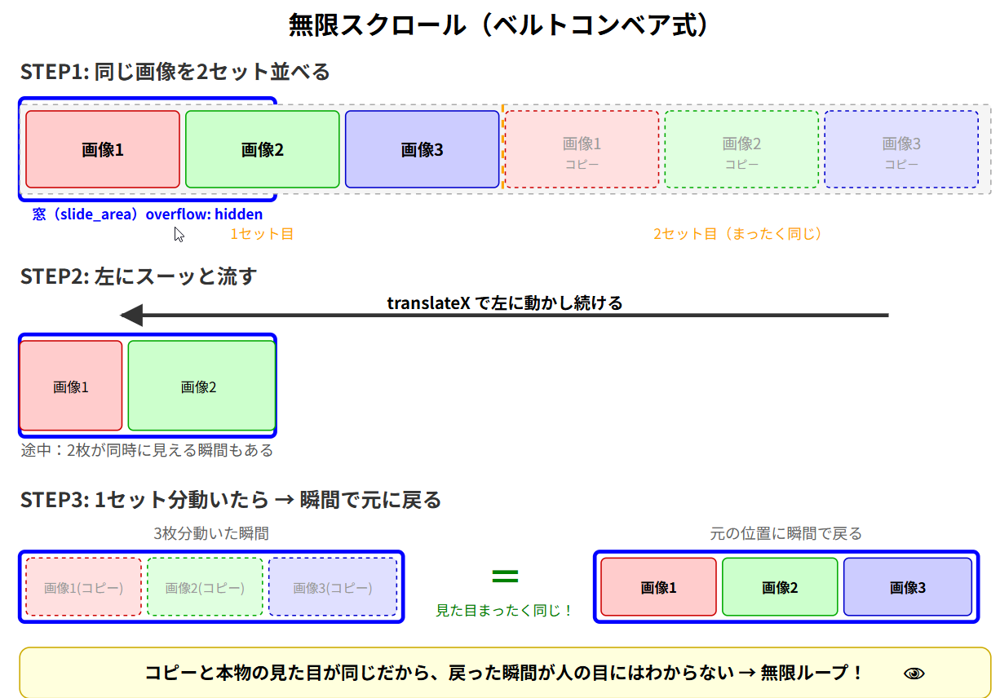

```html


    <!-- ===============================================
     スライドショー尾（画像が左からながれてくるようにする）   
     =============================================== -->
    <section class="slide_area">
      <div class="slide_track">
        
        
        
        <!-- 2セット目（同じ画像を繰り返す） -->
        
        
        
      </div>
    </section>
```
    


```css


.slide_area {
  width: calc(100% - var(--header-side-width));
  margin-bottom: var(--section-bottom);
  height: auto;
  border: 0.5rem solid red;
  overflow: hidden;
}

.slide_track {
  display: flex;
  animation: scroll 20s linear infinite;
}

.slide_track img {
  width: calc(100vw - var(--header-side-width)); /* ← ここを変える */
  flex-shrink: 0; /* 縮ませない！ */
  object-fit: cover; /* 比率を保ってはみ出し切り */
}

@keyframes scroll {
  0%   { transform: translateX(0); }
  100% { transform: translateX(calc(-3 * (100vw - var(--header-side-width)))); }
}

```

/* ✨
# flex-shrink: 0; の説明

## 意味
**要素を縮小させない**という指定です。

## 使��道
- Flexboxレイアウトで、親要素の幅が足りなくなった時の動作を制御
- デフォルトは `flex-shrink: 1`（縮小する）
- `0` にすると、**どんなに狭くなっても元のサイズを保つ**

## 具体例
.item {
  flex-shrink: 0;  /* この要素は縮まない */
  width: 200px;    /* 常に200pxを維持 */
}

**使うシーン：**
- アイコンやボタンのサイズを固定したい
- 画像が潰れるのを防ぎたい
- サイドバーの幅を保ちたい
*/