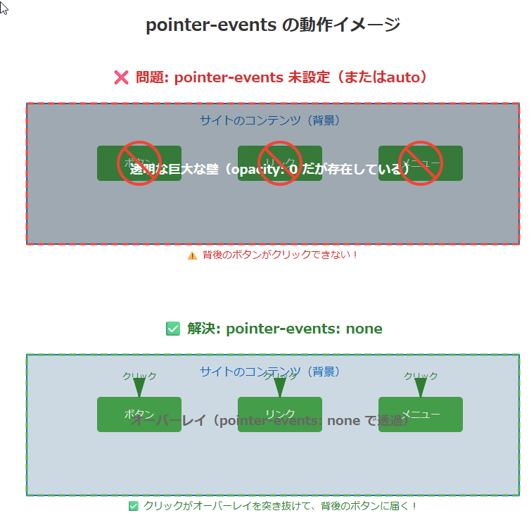

## ハンバーガーメニュー実装


---


ーーーーーーーーーーーーーーーーーーーーーーーーーーーーーーーーーー
【その他　ハンバーガー見本】

```html


 <!-- ハンバーガーメニュー -->
      <div id="hamburger_btn" class="hamburger_menu">
        <span class="bar"></span>
        <span class="bar"></span>
        <span class="bar"></span>
      </div>

      <!-- オーバーレイ -->
      <div id="mask"></div>

      <!-- ナビゲーションメニュー -->
      <nav id="g_nav">
        <ul class="nav_list">
          <li><a class="nav_link" href="#pickup">PICK UP</a></li>
          <li><a class="nav_link" href="#feature">FEATURE</a></li>
          <li><a class="nav_link" href="#contact">CONTACT</a></li>
        </ul>
        <ul class="sns_list">
          <li>
            <a class="sns_link" href="https://twitter.com/" target="_blank"
              >Twitter</a
            >
          </li>
          <li>
            <a class="sns_link" href="https://www.facebook.com/" target="_blank"
              >facebook</a
            >
          </li>
          <li>
            <a
              class="sns_link"
              href="https://www.instagram.com/"
              target="_blank"
              >Instagram</a
            >
          </li>
        </ul>
      </nav>

```

```css
:root {
  --side_header: 30rem; /* これがないとメニューが隠れない、または出てこない */
}

/* ハンバーガーメニュー */
.hamburger_menu {
  position: fixed;
  top: 1.5rem;
  right: 2rem;
  width: 4.5rem;
  height: 4.5rem;
  cursor: pointer;
  z-index: 1000; /* メニューが他の要素より前に表示されるようにする */
  background-color: white;
}

/* ハンバーガーメニューのバー */
.bar {
  position: absolute;
  transition: 0.3s;
  left: 0;
  height: 0.4rem;
  width: 100%;
  background: black;
}


.bar:nth-child(1) {
  top: 0.8rem;
}
.bar:nth-child(2) {
  top: 2.2rem;
}
.bar:nth-child(3) {
  top: 3.6rem;
}

/* ┌─────────────────────────────────────────┐
   │ ハンバーガーメニュークリック時の動作       │
   └─────────────────────────────────────────┘ */

/* ハンバーガーメニューがおされたら、「×」にする */
.hamburger_menu.open .bar:nth-child(1) {
  transform: rotate(45deg);
  top: 2rem;
  border: 0.5rem solid rgb(0, 47, 255);
}
.hamburger_menu.open .bar:nth-child(2) {
  opacity: 0;
}
.hamburger_menu.open .bar:nth-child(3) {
  transform: rotate(-45deg);
  top: 2rem;
}

/* オーバーレイ　ハンバーガーメニュークリック時に、背景を暗くする（スライドメニュ―以外かつハンバーガーは推せるようにする） */
#mask {
  position: fixed;
  top: 0;
  left: 0;
  width: 100%;
  height: 100vh;
  background-color: rgba(0, 0, 0, 0.5);
  z-index: 900; /* オーバーレイが他の要素より前に表示されるようにする */
  display: none; /* 初期状態では非表示 */
  pointer-events: none; /* クリックですりぬけさせる。 */
}

/* ハンバーガーが押下されてオーバーレイが表示 */
#mask.open {
  display: block; /* openクラスが付与されたら表示 */
  pointer-events: auto; /* クリックを有効にする */
}

/* ナビゲーションメニュー  */
#g_nav {
  position: fixed;
  top: 0;
  left: calc(var(--side_header) * -1);
  width: var(--side_header);
  height: 100vh;
  background-color: rgb(10, 9, 9);
  z-index: 1000; /* ナビゲーションが他の要素より前に表示されるようにする */
  transition: left 0.3s ease;
}

/* 固定にナビゲーション内の　リンク（a）タグ */
.nav_link {
  border-top: 0.1rem solid white;

  display: block;

  /* 左に空間をあけて、そこから線と文字を始める */
  margin: 7rem 2rem 0 2rem;
  padding: 3rem 0 3rem 0;

  font-size: 1.8rem;
  font-weight: bold;
  color: white;
  text-decoration: none;
}

```

```javascript
// ハンバーガーメニュークリック時にクラス（open）を付け外しする
const hamburgerBtn = document.getElementById("hamburger_btn");
const mask = document.getElementById("mask");
const gNav = document.getElementById("g_nav");


hamburgerBtn.addEventListener("click", function () {
  // オーバーレイを表示・非表示にする(openにする・外す)
  mask.classList.toggle("open");
  // ボタン自身に .open を付けて「×」にする
  hamburgerBtn.classList.toggle("open");
  // ナビゲーションメニューを表示・非表示にする
  gNav.classList.toggle("open");
});

/*=================================================
オーバーレイ（黒い背景）をクリックした際にメニューを閉じる
===================================================*/

mask.addEventListener("click", function () {
  // オーバーレイを非表示にする
  mask.classList.remove("open");
  // ボタン自身の「×」を元に戻す
  hamburgerBtn.classList.remove("open");
  // ナビゲーションメニューを非表示にする
  gNav.classList.remove("open");
});


★１２８行
`pointer-events`
・　pointer-events:none: 要素を「すり抜け」させます。透明なオーバーレイなどが背後にあるボタンなどのクリックを邪魔しないようにするために使います。

➡pointer-events:auto:　通常の状態に戻します。メニューが開いた時など、再びクリックに反応させたい場合に使います。


【具体的な問題】
特に、「見た目は透明（opacity: 0）だけど、実際には画面を覆っていて裏側の要素が押せない」といったトラブルを解決するために不可欠な設定です。

例）1. ハンバーガーメニューの背景マスク（オーバーレイ）
状況: メニューが開いた時に画面を暗くする div 要素（.overlay や .mask）が、画面全体を覆うように配置されている。
問題: メニューを閉じた際、opacity: 0（透明）にしただけだと、「透明な巨大な壁」が画面の一番手前に居座り続けます。 その結果、背後にあるはずのサイトのボタンやリンクが一切クリックできなくなります。
解決: 非表示時に pointer-events: none を指定することで、クリック操作を下の要素へ「突き抜け」させます。


★大事
