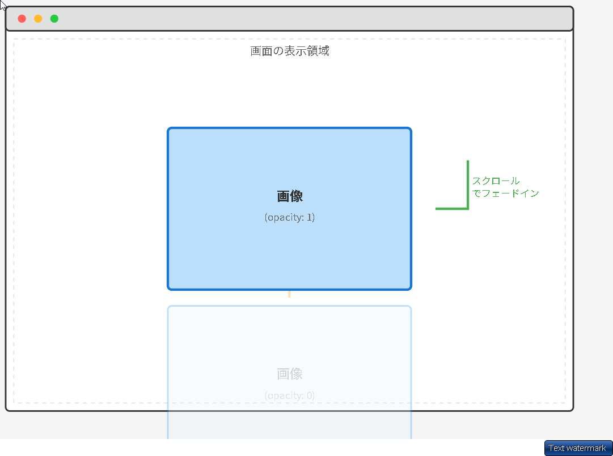

```html

```


```css
/* フェードイン初期状態 */
.feature_image {
  width: 38.5rem;
  height: 25.7rem;
  object-fit: cover;

  /* フェードインの初期状態 */
  opacity: 0;
  transform: translateY(2rem);
  transition: all 1s;
}
```


```javascript
/*=================================================
画像のフェードイン
===================================================*/
$(window).scroll(function () {
  // feature_item の画像すべてに対して処理
  $(".feature_item img").each(function () {
    // スクロールした距離
    let scroll = $(window).scrollTop();
    // この画像までの距離
    let target = $(this).offset().top;
    // 画面の高さ
    let windowHeight = $(window).height();

    // 画像が画面下から20rem入ったら表示
    if (scroll > target - windowHeight + 200) {
      $(this).css("opacity", "1");
      $(this).css("transform", "translateY(0)");
    }
  });
});
```