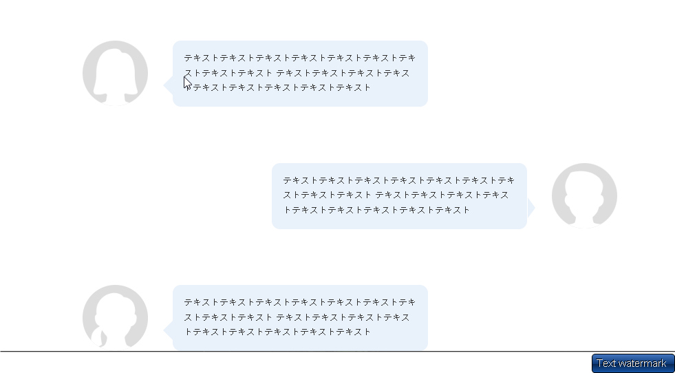

```html

<div class="voice_bg">
  <!-- フレックスで左右にイメージとテキスト（吹き出し）を並べる -->
  <div class="voice_card">
    
    <div class="voice_text">
      テキストテキストテキストテキストテキストテキストテキストテキストテキスト
テキストテキストテキストテキストテキストテキストテキストテキストテキスト
    </div>
  </div> 
  <div class="voice_card right_speech">
    
    <div class="voice_text">
      テキストテキストテキストテキストテキストテキストテキストテキストテキスト
テキストテキストテキストテキストテキストテキストテキストテキストテキスト
    </div>  
  </div>
  <div class="voice_card">
    
    <div  class="voice_text">
      テキストテキストテキストテキストテキストテキストテキストテキストテキスト
テキストテキストテキストテキストテキストテキストテキストテキストテキスト
    </div>
  </div>
</div>
```


```css

/* 背景・フレックスで３人分の吹き出し  */
.voice_bg {
  width: 100%;
  background-color: #ffffff;
  padding: 12rem 20rem 0;

  display: flex;

  flex-direction: column;
  gap: 10.3rem;
}

<!-- フレックスで左右にイメージとテキスト（吹き出し）を並べる -->
.voice_card {
  display: flex;
  justify-content: flex-start;
  gap: 4.6rem;
  opacity: 0; /* JSで表示するまで隠す */
}

.img_voice {
  display: block;
  width: 12rem;
  height: 12rem;
  object-fit: cover;
  border-radius: 50%;
  flex-shrink: 0; /* フレックスアイテムが縮小しないようにする */
  background-color: #ddd; /* 白シルエット用の背景 これがないとうまくアイコンが表示されない！！*/ 
}


/* 吹き出し部分　▢ */
.voice_text {
  width: 46.8rem;
  line-height: 2.7rem;
  color: #333333;　/*文字*/
  background-color: #e9f1fb; /* 吹き出しの色 */
  padding: 2rem;
  font-size: 1.6rem;
  border-radius: 1.5rem;
  position: relative;
}


/* 吹き出しの三角形（左側） */
.voice_text::before {
  content: "";            /* 必須：中身は空でOK */
  position: absolute;     /* 親(.voice_text)を基準に自由に動かす */
  bottom: 2rem;           /* 下から2remの位置 */
  left: -1.8rem;          /* 左に1.8remはみ出させる */
  width: 0;               /* 幅0 */
  height: 0;              /* 高さ0（枠線だけで形を作る） */
  border-top: 2rem solid transparent;    /* 上の枠線を透明に */
  border-bottom: 2rem solid transparent; /* 下の枠線を透明に */
  border-right: 2rem solid #e9f1fb;      /* 右の枠線に色をつけて「左向きの三角」にする */
}


★メッセージの吹き出し位置を逆にしたい場合　　★これは二つのクラスを指定しているわけではなく、「子孫セレクタ」　右の吹き出しのときだけ、角をかえる
/* 右寄せの吹き出し：三角形の位置と向きを上書き */
.right_speech .voice_text::before {
  /* 位置を左から右へ */
  left: auto;
  right: -1.5rem;

  /* 三角形の向きを右向きにする */
  border-right: none; /* 右向きの三角形を消す */
  border-left: 1.5rem solid #e9f1fb;
}

/* 画面内に入った時にバルーンのように表示する is-visibleはJavaScriptで設定*/
.voice_card.is-visible {
  animation: balloon 0.5s ease-out forwards;
}


/* 背景から突然現れるDOMが出力されるアニメーション */
@keyframes balloon {
  0% {
    transform: scale(0.1); /* ★最初は小さく */
    opacity: 0; /* ★透明 */
  }
  100% {
    transform: scale(1); /* ★元のサイズに */
    opacity: 1; /* ★表示 */
  }
}


```


```javascript

// 音声吹き出し部分のアニメーション
const voiceSection = document.querySelector(".voice_bg");

const voiceObserver = new IntersectionObserver((entries) => {
  entries.forEach((entry) => {
    if (entry.isIntersecting) {
      // 全ての.voice_cardを取得してクラスを追加
      const voiceCards = entry.target.querySelectorAll(".voice_card");
      voiceCards.forEach((card) => {
        card.classList.add("is-visible");
      });
      voiceObserver.unobserve(entry.target); // ★1回だけ
    }
  });
});

//は、**「指定した要素（voiceSection）の監視をスタートしてね」**という命令です。
voiceObserver.observe(voiceSection);
```