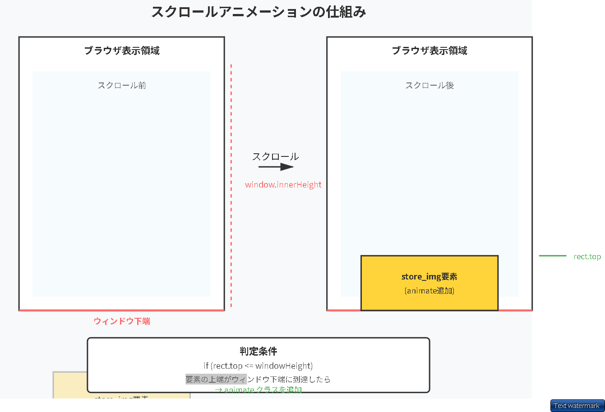

```css


/* └ 右が店内画像と成り立ち説明列 【縦flex】 */
.right_container {
  display: flex;
  flex-direction: column;
  gap: 6rem;
  overflow: hidden; /* ここに追加：中身の画像が拡大しても、この枠からはみ出さないようにする */

  border: 0.5rem solid red;
}

.store_img {
  width: 100%;
  height: auto;
}

.store_img.animate {
  animation: slideshow 3s forwards;
}

@keyframes slideshow {
  0% {
    opacity: 1;
    transform: scale(1.1); /* 最初は少し大きく */
  }
  5% {
    opacity: 1;
  }
  25% {
    opacity: 1;
    transform: scale(1.05); /* 少し縮小 */
  }
  100% {
    opacity: 1;
    transform: scale(1);
  }


  ```



  ```javascript
  // スクロールされたときにアニメーションを表示する。

window.addEventListener("scroll", function () {
  // スクロールがstore_img要素に到達したか確認

  // store_img要素を取得
  const storeImg = document.querySelector(".store_img");

  // 要素の位置を取得(Bounding・・・境界　RectはRectangle・・・座標・大きさ)
  // (スクロールした瞬間に毎回、位置がかわる)現在のブラウザの表示画面（ビューポート）の左上」を基準とした座標
  const rect = storeImg.getBoundingClientRect();

  // ウィンドウ（表示領域）の高さを取得
  const windowHeight = window.innerHeight;

  // 要素の上端がウィンドウの下端に到達したか確認
  if (rect.top <= windowHeight) {
    // アニメーションを開始
    storeImg.classList.add("animate");
  }
});


  ```