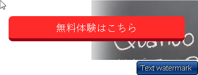

## ボタンを立体にみせる。



```html
<a class="slide_btn" href="#">無料体験はこちら</a>
```

```css
.slide_btn {
  display: block;
  height: 6.1rem;
  line-height: 6.1rem;
　border-radius: 1rem;
  text-align: center;
  font-size: 2.4rem;

  color: white;
  background-color: #ff2a2a;
  border-bottom: 6px solid #9a0413;　★ここの色を実態（今回は赤）より暗くすることで立体感がでる

  z-index: 15; /* ぼかしの下に配置 */  ★これはなにかの写真の上などにボタンがある場合
}
```


## メインビジュアルなどの画像を回りを、いい感じにぼかす（線がみえないように）


画像の周りをぼかす（内側シャドウ）

```css
.bg_image {
  height: 72rem;
  margin: 11.5rem 0rem 36rem 36rem;
  position: relative;
  overflow: visible;

  border: 1px solid #fff;
}

.bg_image::after {
  content: "";
  position: absolute; 
  top: 0;
  left: 0;
  width: 100%;
  height: 100%;
  
  box-shadow: inset 0px 0px 20px 20px #fff;  /* ★内側にぼかし */
  
  pointer-events: none;  /* ★クリック透過 */
}
```


★ポイント:

値	説明
inset	        外側ではなく内側に影
0px 0px	        X・Y方向のずれなし
20px (3番目)	ぼかしの強さ（大きいほどぼやける）
20px (4番目)	影の広がり
#fff	       白でぼかす → 画像の縁がふんわり

比較:
50px 20px → 激しいぼかし
20px 20px → 控えめなぼかし（見本と同じ）