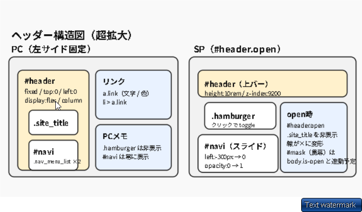

## ハンバーガーメニュー実装


---

### ステップ 1：横バーを表示する

**HTML**

```html
<div class="hamburger">
  <span class="hamburger_line"></span>
  <span class="hamburger_line"></span>
  <span class="hamburger_line"></span>
</div>
```

**CSS**

```css
  /* 右上のハンバーガーメニューを表示する */
  .hamburger {
    position: fixed;
    top: 1.5rem;
    right: 1.5rem;
    width: 3rem;
    height: 3rem;
    cursor: pointer;
    z-index: 100; /* 一番上に表示 */
  }


    /* ハンバーガーメニューの横線を作成 */
  .hamburger_line {
    position: absolute;　★これは親要素からに対してかけられている。
    なぜなら、フレックスにするかというと
    子要素のwidth: 100%;　をきかせるためにやっている。
    親子fixedだと、子のwidth:100％が適用されるので、
    （つまりこの、親がwidth３rem,子がそれを100%利用するのが
    成り立つ）

    /* ゆっくり動作する */
    transition: 0.3s;
    top: 0;
    right: 0;
    height: 0.3rem;
    width: 100%;
    background: #121212;
    border: 1px solid #121212;
  }

  ★下わざわざかく理由。あとで線の角度をかえて×ボタンにするため。

  .hamburger_line:nth-child(1) {
    top: 0.5rem;
  }
  .hamburger_line:nth-child(2) {
    top: 1.3rem;
  }
  .hamburger_line:nth-child(3) {
    top: 2.1rem;
  }

```

**確認ポイント**

- ✅ 右上に 3 本線が表示される
- ✅ クリックしてもまだ何も起きない（これで OK）


ーーーーーーーーーーーーーーーーーー


### ステップ ２：クリック時にハンバーガメニューを × にかえる。

```css
★ハンバーガメニュークリックした段階で以下の設定（×メニューに）javascriptできりかえる
★　header.openとすることで、ヘッダーにopenクラスが追加したら発動する。

・ヘッダーにオープンが追加された場合のかきかた
  header.open
  .hamburger_line:nth-child {
  top: 1.3rem;
  transform: rotate(45deg);
}
　　★角度をかえる #header.open .hamburger_line:nth-child {
  opacity: 0;
}
　★消す #header.open .hamburger_line:nth-child {
  top: 1.3rem;
  transform: rotate(-45deg);
}
```

## openクラスをheaderにつける方法

★ハンバーガーメニューをクリックしたら、
headerに　openをつける

```javascript
 $(".hamburger").on("click", function () {
    $("#header").toggleClass("open");
  });

```

---

### ナビを「左側に隠す」実装のポイント

#### 1. なぜ左側に配置して隠すのか？
- **直感的な操作**: 多くのアプリやサイトで採用されている形式で、ユーザーがメニューの場所を理解しやすい。
- **スライドの実装**: CSSで「画面外（マイナスの位置）」に配置し、ボタンクリックで「0（画面内）」に移動させるだけで、スムーズなスライド表示が作れる。

#### 2. 実装の仕組み（シンプル版）
1. **初期状態**: `#navi`(左側のメニューバー)
 を `position: fixed;`（常に固定される） にし、`left: -300px;`（メニュー幅分）で画面外に追い出す。

2. **実行時**: ボタンクリックで `#header` に `open` クラスを付与。

3. **表示状態**: `.open` がついた時だけ `#navi` を `left: 0;` に上書きして表示させる。


#### 3. 大事なこと・注意点
- **z-index の管理**: ナビがコンテンツの下に潜り込まないよう、高い値を設定する。
- **背景マスクの連動**: メニューが出ている間、背景を触らせないためのマスク（`#mask`）黒いますく。も一緒に表示/非表示させるのが一般的。


#### 4. 基本コード（省略版）
```css
#navi {
  position: fixed;
  left: -300px; /* 画面外へ */
  transition: all 0.5s; /* アニメーション速度 */
}

/* openクラスがついたら画面内に戻す */
#header.open #navi {
  left: 0;
}
```

---

メモつまったところ---------------------------------------------

# ハンバーガーメニューが押せない問題

## 症状
- スマホ表示（レスポンシブ）でハンバーガーメニューがクリックできない
- 検証ツールでは押せる、実際の画面では押せない

## 原因
1. 親要素（#header）に z-index がなく、他の要素の下に隠れていた

## ポイント
`position: fixed` の要素は **z-index を持たないとレイヤー比較に参加しない**。
子要素に z-index: 9999 があっても、親が参加してないと負ける。

## 修正


### 1. z-indexの追加
```css
/* 修正前 */
#header {
  position: fixed;
  /* z-index なし → レイヤー比較に不参加 */
}

/* 修正後 */
#header {
  position: fixed;
  z-index: 9000;  /* これで前面に出る */
}
```

## 覚えておくこと
- `position: fixed` + `z-index` でレイヤーになる
★親に z-index がないと子も道連れで負ける
- 検証ツールで押せるのに実画面で押せない → z-index か位置を疑う


ーーーーーーーーーーーーーーーーーーーーーーーーーーーーーーーーーー
【その他　ハンバーガー見本】

```html


    <!-- ハンバーガーメニュー -->
    <div id="hamburger-btn" class="hamburger_menu">
      <span class="bar"></span>
      <span class="bar"></span>
      <span class="bar"></span>
    </div>

```

```css


    /* ハンバーガーメニュー */
.hamburger_menu {
  position: fixed;
  top: 1.5rem;
  right: 2rem;
  width: 4.5rem;
  height: 4.5rem;
  cursor: pointer;
  z-index: 1000; /* メニューが他の要素より前に表示されるようにする */
  background-color: white;
}

.bar {
  position: absolute;
  transition: 0.3s;
  left: 0;
  height: 0.4rem;
  width: 100%;
  background: black;
}

.bar:nth-child(1) {
  top: 0.8rem;
}
.bar:nth-child(2) {
  top: 2.2rem;
}
.bar:nth-child(3) {
  top: 3.6rem;
}

/* ┌─────────────────────────────────────────┐
   │ ハンバーガーメニュークリック時の動作       │
   └─────────────────────────────────────────┘ */

/* ハンバーガーメニューがおされたら、「×」にする */
.hamburger_menu.open .bar:nth-child(1) {
  transform: rotate(45deg);
  top: 2rem;
}
.hamburger_menu.open .bar:nth-child(2) {
  opacity: 0;
}
.hamburger_menu.open .bar:nth-child(3) {
  transform: rotate(-45deg);
  top: 2rem;
}

```