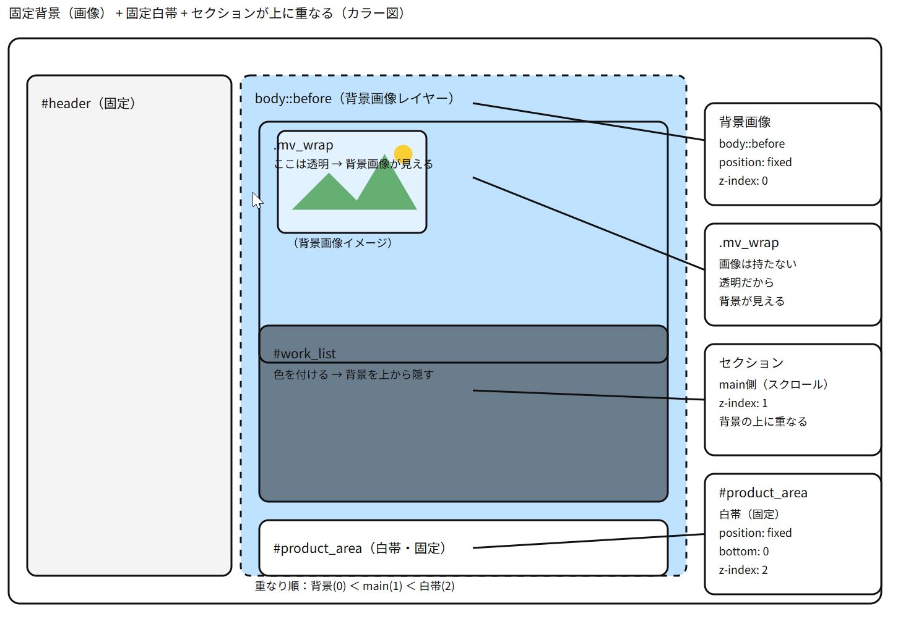

▢ 　どうやって `about-item`で flex をかけるはずなのに、h3 だけ真ん中に配置できるのか？

  

    

      <h3 class="item-title">COFFEE</h3>
      <ul>
        <li>テキストテキストテキスト</li>
        <li>テキストテキストテキスト</li>
        <li>テキストテキストテキスト</li>
        <li>テキストテキストテキスト</li>
      </ul>
      <a href="#" class="btn">Read More</a>
    

  

</section>

## トップの画面を固定にして、その下のセクションをスクロールするときに、裏の画面をのこして、重ねて表示させる。

[図解エクセルを開く](./２重レイヤーのしくみ（fixed、zindex等）.xlsx)

`目的（これを作る）`

左：サイドバー 300px 固定
右：背景画像は固定（スクロールしても動かない）
右の下：白い帯が画面下に固定（常に見える）
スクロールすると、次のセクションが背景の上に重なる

`コピペ用CSS（そのまま使ってOK）`
`① 右側の背景を「固定」で敷く`
body {
background: #fff;
}

/_ 右側だけに固定背景を置く _/
body::before {
content: "";
position: fixed; /_ スクロールしても動かない _/
top: 0;
bottom: 0;
left: 300px; /_ 左のサイドバー分だけ右へ _/
width: calc(100% - 300px); /_ 右側だけの幅 _/
background: url("../img/chrome_qJcZNA8Xrm.png") center/cover no-repeat;

z-index: 0; /_ 背景なので一番うしろ _/
pointer-events: none; /_ クリックを邪魔しない _/
}

`/* mainの中身を背景より前に */`
main {
position: relative; /_ z-index を効かせるため _/
z-index: 1; /_ 背景(0)より前 _/
}

`② 最初の画面（mv）を「白帯ぶん短く」する`

`白帯の高さを 160px にする例：`

.mv*wrap {
margin-left: 300px;
height: calc(100vh - 160px); /* 画面の高さ - 白帯 160px \_/
}

`③ 画面下の白帯を「固定」する（ここが重要）`#product*area {
position: fixed; /* 画面に固定 _/
left: 300px;
bottom: 0;
width: calc(100% - 300px);
height: 160px; /_ 白帯の高さ _/
background: #fff;
z-index: 2; /_ main(1)より前 → 常に見える \_/
}

`④ 次のセクションが白帯に食い込まないようにする`
#work*list {
margin-top: 160px; /* 白帯の高さと同じ数字 \_/
margin-left: 300px;
}

透過（重なる感じ）を出すなら

黒っぽいセクション：

#work*list {
background: rgba(0, 0, 0, 0.6); /* 半透明の黒 \_/
}

白っぽいセクション：

#flow*area,
#contact_area {
background: rgba(255, 255, 255, 0.9); /* 半透明の白 \_/
margin-left: 300px;
}

※注意：background-color: #fff; が後ろにあると透過が消えるから、透過したい場所では消す。
超重要ルール（覚えるのはこれだけ）
白帯の高さが 160px なら
#product_area の height: 160px;
mv_wrap の height: calc(100vh - 160px);
#work_list の margin-top: 160px;
この 3 つの数字は必ず同じ にする

`結論：`
`① 背景は body::before で固定`
`② 白帯は #product_area を position: fixed で下に固定`
`③ 白帯の高さと同じぶん、mv_wrap を短くして` `#work_list を下げる`
これで見本の動きになります。

`サンプルHTML　シンプル版`

<!doctype html>
<html lang="ja">
<head>
  <meta charset="utf-8" />
  <meta name="viewport" content="width=device-width, initial-scale=1" />
  <title>最小HTML</title>
</head>

<body>
  <!-- 左：固定サイドバー -->
  <header id="header">
    <h1 class="site_title">LOGO</h1>
    <nav id="navi">
      <a href="#">menu</a>
    </nav>
  </header>

  <!-- 右：背景の上に重なるメイン -->
  <main>
    <!-- 最初の画面（背景だけ見えるエリア） -->
    

    

    <!-- 画面下に固定する白帯（あなたのCSSだと #product_area） -->
    
    <section id="product_area"></section>

    <!-- スクロールすると、ここが背景の上にかぶさってくる -->
    <section id="work_list">
      <h2>セクション</h2>
      
ここに内容

    </section>

  </main>
</body>
</html>

`ソースをみたいときは、82_CSS_JUMP_上級編_ピカソ`

この仕組みの要点（メモ）
① 背景（固定）

body::before を使って 右側だけに固定背景を敷く

position: fixed だから スクロールしても背景が動かない

② 中身（スクロール）

main は z-index:1 にして 背景より前に出す

だからセクションが背景の上に「かぶさる」

★ #product_area（白帯）の説明（重要）
#product_area の役割

画面下に固定される白い帯

見本みたいに「最初から下に白が見えてる」状態を作る

スクロールしても 常に画面の下に居続ける

#product_area が必要な理由

背景が固定でずっと見えるので、そのままだと「ずっと背景だけ」になりやすい

そこで 白帯を固定で置くことで

最初の画面に「白い余白」ができる

デザインが締まる（“足場”ができる）

#product_area の必須指定

position: fixed; → スクロールしても動かない

bottom: 0; → 画面の下に貼り付く

left: 300px; width: calc(100% - 300px);
→ 左の固定サイドバーを避けて、右側だけに出す

height: 160px;（例） → 白帯の高さ

z-index: 2; → main よりさらに前に出して常に見える

③ 白帯がある時の「調整ルール」（ここだけ超大事）

白帯を height:160px にしたら、同じ数字を 3 か所に入れる。

白帯そのもの

#product_area { height: 160px; }

最初のメインビジュアルを短くする

.mv_wrap { height: calc(100vh - 160px); }
→ 画面下に白帯が見える

次のセクションを白帯ぶん下げる

#work_list { margin-top: 160px; }
→ スクロール時に白帯へ食い込まない

この「数字そろえる」が崩れると、

白帯にくっつく / かぶる / 余白がズレる
が起きる。

結論（1 行）

#product_area は「画面下に固定する白い帯」。固定した分だけ、上（mv）を短くして、次（work_list）を同じ高さ分下げる。
