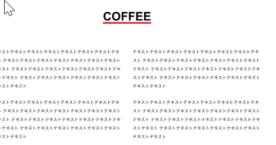

▢ 　どうやって `about-item`で flex をかけるはずなのに、h3 だけ真ん中に配置できるのか？

  

    

      <h3 class="item-title">COFFEE</h3>
      <ul>
        <li>テキストテキストテキスト</li>
        <li>テキストテキストテキスト</li>
        <li>テキストテキストテキスト</li>
        <li>テキストテキストテキスト</li>
      </ul>
      <a href="#" class="btn">Read More</a>
    

  

</section>

