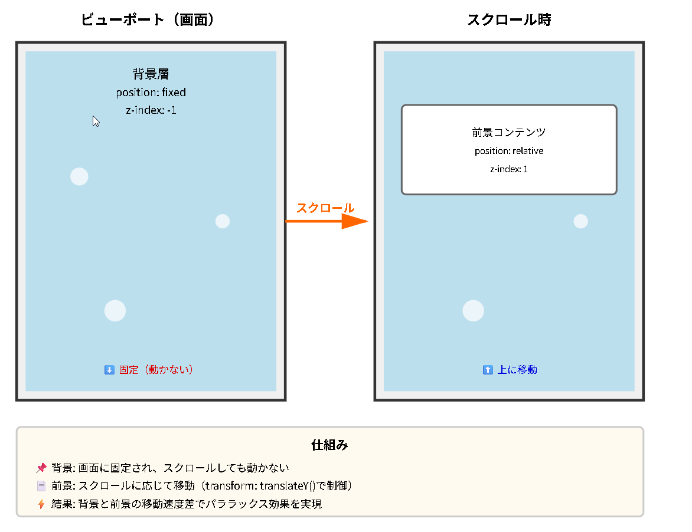
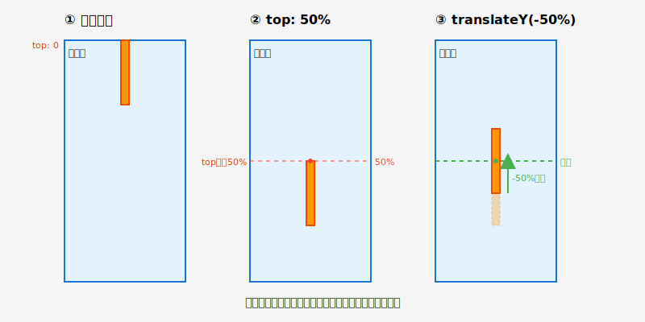
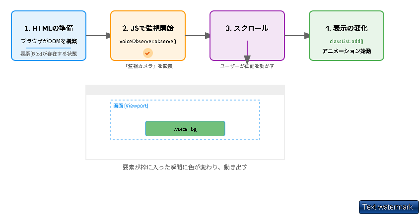
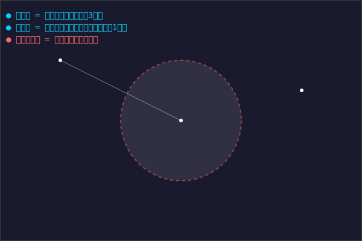
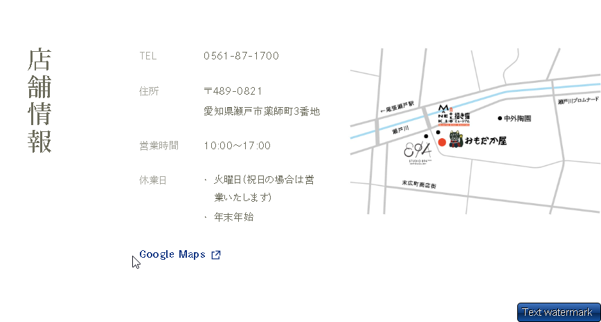
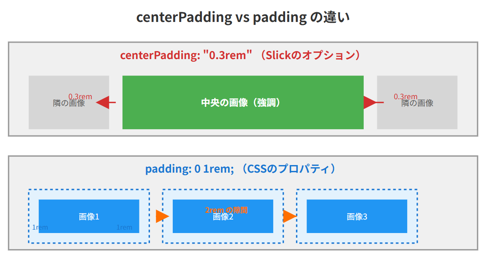
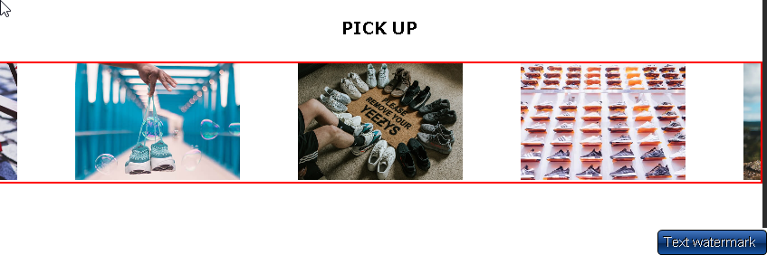
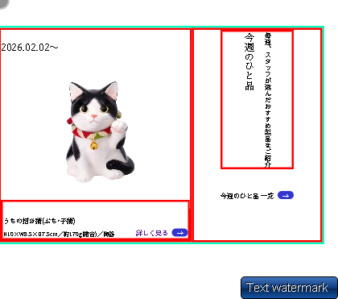

# 全て

**Q: 共通クラスを上書きする書き方は？**

親要素のクラスを指定してから共通クラスを記述することで上書きできます。

`.親クラス .共通クラス { プロパティ: 値; }`

━━━━━━━━━━━━━━━━━━━━━━━━━━━━━━━━━━━━━━━━

**Q: 文字の高さを調整するCSSプロパティは？**

line-height


━━━━━━━━━━━━━━━━━━━━━━━━━━━━━━━━━━━━━━━━

**Q: 背景画像表示にheight指定が必要な理由は？**

背景画像は要素の「背景」として表示されるため、要素自体に高さがないと表示領域が確保されず、画像が見えないからです。


━━━━━━━━━━━━━━━━━━━━━━━━━━━━━━━━━━━━━━━━

**Q: ヘッダーの高さはどのように設定する？**

ヘッダーの高さは `height: auto` と `min-height: 6.2rem` を組み合わせて設定します。これにより、基本は中身に応じて自動で伸縮し、最低でも6.2remの高さを確保できます。

━━━━━━━━━━━━━━━━━━━━━━━━━━━━━━━━━━━━━━━━

**Q: z-indexでレイヤーになる組み合わせは？**

# z-indexでレイヤーになる組み合わせ

以下の組み合わせでz-indexが有効になります：

1. **`position: fixed` + `z-index`**
2. **`position: absolute` + `z-index`**
3. **`position: relative` + `z-index`**
4. **`position: sticky` + `z-index`**

メモからは特に **`position: fixed` + `z-index`** の組み合わせが明記されており、fixed要素の子要素には `absolute` を使用することが推奨されています。

━━━━━━━━━━━━━━━━━━━━━━━━━━━━━━━━━━━━━━━━

**Q: AIに確認する際、渡すものは？**

AIに確認する際、渡すものは「ソース」と「デザインカンプ」です。

━━━━━━━━━━━━━━━━━━━━━━━━━━━━━━━━━━━━━━━━

**Q: フレックスで画像が小さくならない対策は？**

フレックスアイテムの`.b`に`min-width: 0;`を指定します。

これにより、flexアイテ��のデフォルトの最小幅制約が解除され、画像が親要素の幅に応じて縮小できるようになります。


━━━━━━━━━━━━━━━━━━━━━━━━━━━━━━━━━━━━━━━━

**Q: `align-items: stretch;`で子要素はどうなる？**

子要素が親要素の高さ（200px）に引き伸ばされます。


━━━━━━━━━━━━━━━━━━━━━━━━━━━━━━━━━━━━━━━━

選択されたテキストにある `background-attachment: fixed;` は、背景画像をスクロールさせずに固定するプロパティであり、背景を「透けさせる（透明度を変える）」ためのものではありません。

背景を透けさせるには、一般的に opacity プロパティや、色の指定に rgba() を使用します。それぞれの具体的な使い方を説明します。
1. 要素全体を透けさせる (opacity)
要素（文字も背景もすべて）の透明度を一括で変更します。値は 0（完全に透明）から 1（不透明）の間で指定します。

.box {
  background-color: blue;
  opacity: 0.5; /* 50%の透明度 */
}
2. 背景色だけを透けさせる (rgba)
中の文字などはくっきり見せたまま、背景の色だけを透けさせたい場合に最もよく使われる方法です。

.box {
  /* rgba(赤, 緑, 青, 透明度) */
  background-color: rgba(0, 0, 255, 0.5); /* 青色を50%の透明度に */
}
3. 背景画像だけを透けさせる
背景画像（background-image）自体に透明度を設定するプロパティは存在しないため、擬似要素（::before など）を背後に敷いて、その opacity を調整するのが一般的です。

.box {
  position: relative;
  z-index: 0;
}

.box::before {
  content: "";
  position: absolute;
  top: 0; right: 0; bottom: 0; left: 0;
  z-index: -1;
  background-image: url('image.jpg');
  background-size: cover;
  opacity: 0.3; /* 画像の濃さを30%にする */
}


補足：background-attachment: fixed; とは？
これは、画面をスクロールしても背景画像が一緒に動かず、その場に留まるような視覚効果（パララックス効果など）を作るために使われるプロパティです。透明度とは別の機能です。


━━━━━━━━━━━━━━━━━━━━━━━━━━━━━━━━━━━━━━━━

**Q: ロゴのHTMLでIDを使う理由は？**

メモには「classではなく IDを理由する」という記述がありますが、具体的な理由は記載されていません。一般的には、ロゴは1ページに1つしか存在しない要素であるため、IDを使用すると考えられます。

`補足：ロゴにIDを使う理由について`**`
記載内容は概ね正しいです。
- ロゴは通常1ページに1つだけ存在
- IDは一意の要素に使用する（ページ内で1つだけ）
- JavaScriptでの操作やページ内リンクでも特定しやすい

という理由から、ロゴには`id`属性を使うのが一般的です。


━━━━━━━━━━━━━━━━━━━━━━━━━━━━━━━━━━━━━━━━
☑
**Q: マージンとパディング、親から子への距離は？**

親から子への距離は**パディング**で設定します。
/* ✨
- **パディング（padding）**: 要素の内側の余白。親要素の境界線から子要素（内容）までの距離を設定します。
- **マージン（margin）**: 要素の外側の余白。他の要素との距離を設定します。

したがって、「親から子への距離はパディングで設定する」という説明は**本当のこと**です。
*/


━━━━━━━━━━━━━━━━━━━━━━━━━━━━━━━━━━━━━━━━
☑
**Q: 疑似要素で縦線中央配置に使うCSSプロパティは？**

`top: 50%` と `transform: translateY(-50%)`


━━━━━━━━━━━━━━━━━━━━━━━━━━━━━━━━━━━━━━━━

**Q: パララックスでレイヤーを重ねるのに必要なこと？**

親の要素で、fixedは親1箇所のみに設定する必要があります。


━━━━━━━━━━━━━━━━━━━━━━━━━━━━━━━━━━━━━━━━
# 不動産


**Q: 相続税の基礎控除額は？**

3,000万円 + 600万円 × 法定相続人の数

このコードは、**日本の相続税における基礎控除額の計算式**を示しています。

**内容:**
- 相続税には一定額まで課税されない「基礎控除」があります
- その計算式は：**3,000万円 + (600万円 × 法定相続人の数)**

**具体例:**
- 法定相続人が3人の場合：3,000万円 + 600万円 × 3 = **4,800万円**
- 相続財産がこの基礎控除額以下なら相続税はかかりません

━━━━━━━━━━━━━━━━━━━━━━━━━━━━━━━━━━━━━━━━


**Q: 幅がひろいwidthを文字は文字幅にあわせる**
width: fit-content;


━━━━━━━━━━━━━━━━━━━━━━━━━━━━━━━━━━━━━━━━

**Q: 3000万円控除後の利益にかかる軽減税率は？**


10%（ほかに住民税4%）です。
/* ✨
いいえ、必ずかかるわけではありません。

**軽減税率が適用されるのは特定の���件を満たした場合のみ**です。

主な条件：
- **マイホーム（居住用財産）を売却**したこと
- **所有期間が10年超**であること
- 3000万円の特別控除を適用した後も利益が残る場合

つまり、3000万円控除で利益がゼロになれば税金はかかりませんし、上記の条件を満たさなければ通常の税率（所有期間5年超で20.315%）が適用されます。
/* ✨
あなたの場合、**軽減税率が適用されます**。

**理由：**
- ✅ マイホーム（自��）として居住
- ✅ 所有期間40年（10年超の条件クリア）
- ✅ 3000万円控除後も利益が残る

**税率：**
- 利益6000万円まで：**所得税10% + 住民税4% = 計14%**
- 6000万円超の部分：所得税15% + 住民税5% = 計20%

**例：**
売却利益が4000万円の場合
→ 4000万円 - 3000万円（控除）= 1000万円
→ 税金：1000万円 × 14% = **140万円**

通常の長期譲渡税率（20.315%）より有利です。
*/


━━━━━━━━━━━━━━━━━━━━━━━━━━━━━━━━━━━━━━━━

**Q: 相続で税金が増えるのはなぜ？**

相続した財産を売却すると、その売却益が収入として加算され、年末調整の収入が大幅に増えるため、税金が増加します。

━━━━━━━━━━━━━━━━━━━━━━━━━━━━━━━━━━━━━━━━

**Q: 相続税と家売却控除は別ルール？**

はい、相続税と家売却控除は別ルールです。

相続税は相続時に適用される基礎���除で、家を売却した際の譲渡所得税の3,000万円控除とは全く別の税制です。それぞれ独立して適用されるため、足し算にはなりません。


━━━━━━━━━━━━━━━━━━━━━━━━━━━━━━━━━━━━━━━━


━━━━━━━━━━━━━━━━━━━━━━━━━━━━━━━━━━━━━━━━

**Q: 相続するとき注意したいこと。**

相続財産の売却益は年末調整の対象外。母親名義で売却する方が有利な場合もあるが、理由が誤っている。

相続による不動産取得自体は年末調整の収入に含まれない。ただし、居住用不動産を売却する際の3000万円特別控除は居住者本人が適用を受けられるため、母親が居住していれば母親名義での売却が税制上有利になる可能性がある。相続税や譲渡所得税を含めた総合的な検討が必要。
# その他

**Q: 画面いっぱいの「固定」と「最低限」の違いは？**

「固定」は高さが画面サイズで固定され、中身が増えるとはみ出してしまいます��「最低限」は高さが最低でも画面サイズで、中身が増えれば自動で伸びてくれます。

# html


━━━━━━━━━━━━━━━━━━━━━━━━━━━━━━━━━━━━━━━━

**Q: パララックスとは**

画面に奥行きや立体感、没入感を出すための演出技法のことです。視差を利用して、背景とコンテンツが異なる速度でスクロールすることで、立体的な効果を生み出します。

実装では、背景画像を`fixed`で固定し、メインコンテンツに`padding-top`で透明な隙間を作ることで、背景が透けて見えるようにします。この際、`background-color: transparent`で背景を透明にすることが重要です。


━━━━━━━━━━━━━━━━━━━━━━━━━━━━━━━━━━━━━━━━

**Q: 検証ツールでメディアクエリを特定するには？**

検証ツールで、cssフォルダのutilityなどのフォルダからメディアクエリを特定しま���。

・検証ツールで、「要素タブ」を指定し、フレックスを利用しているところを調べる。
・定数をソースのCSSから取得してきて、どこで利用しているかざっくりしらべる。
大体セクション間や、ヘッダーとか。その程度でよし。

━━━━━━━━━━━━━━━━━━━━━━━━━━━━━━━━━━━━━━━━

**Q: パディングは親の何？**

覚え方
（余白の目的）　　　　（使うもの全体に）
共通の余白　　　　　　親の padding
子ごとに違う余白　　　子の margin

今回は「他と合わせる」より「実際の構造に合わせる」が優先二重管理を避けた方が、3 ヶ月後の自分が楽です！

以下の場合は、右と下だけパディングをつける。
それ以外は、子でマージンで別々に管理する。


━━━━━━━━━━━━━━━━━━━━━━━━━━━━━━━━━━━━━━━━

**Q: JavaScriptバブルソートの交換条件は？**

## バブルソートの交換条件

**交換条件：`arr[j] > arr[j + 1]`**

左側の要���が右側の要素より大きい場合に、2つの要素を入れ替えます。これにより、大きい値が徐々に右側（配列の末尾）へ移動していきます。

## iとjの流れ

**外側ループ（i）：**
- 配列全体を何回走査するかを制御
- `i = 0, 1, 2, ...` と増加
- i回目のループで、後ろからi番目までがソート済みになる

**内側ループ（j）：**
- 隣接する要素を比較する位置を制御
- `j = 0` から `arr.length - 1 - i` まで
- 各ステップで `arr[j]` と `arr[j+1]` を比較し、必要に応じて交換
- iが増えるごとに比較範囲が狭まる（既にソート済みの部分は比較不要）

**動作例：** `[5, 3, 8, 2]` の場合
- i=0: 全体を比較 → 最大値8が末尾へ
- i=1: 末尾を除いて比較 → 2番目に大きい値が後ろから2番目へ
- i=2: さらに範囲を狭めて比較

━━━━━━━━━━━━━━━━━━━━━━━━━━━━━━━━━━━━━━━━

**Q: インライン要素の縦位置を揃えるCSSプロパティは？**


 <a href="#" class="google_link">Google Maps
  
 </a>

```css
.icon_newtab {
  display: inline-block;
  vertical-align: -0.2rem; ★　これでインライン要素の「縦」位置をかえれる
  margin-left: 0.5rem;
  width: 1.2rem;
  height: 1.2rem;
}
```

━━━━━━━━━━━━━━━━━━━━━━━━━━━━━━━━━━━━━━━━

**Q: HTML要素の矢印を縦横中央に配置するCSSプロパティは？**

**答え**

```css
display: flex;
align-items: center;
justify-content: center;
```

**説明**

Flexboxレイアウトを使用して、子要素を縦横中央に配置する3つのプロパティの組み合わせ。`display: flex`でFlexboxを有効にし、`align-items: center`で縦方向、`justify-content: center`で横方向の中央揃えを実現する。

**メモ内容の要約**

矢印「→」をボタン内で縦横中央に配置するために使用。親要素（`.news_link`）にこの3つのプロパティを指定することで、インライン要素である`<a>`タグ内のテキストコンテンツを中央配置している。

**例：**

```css
.news_link {
  display: block;
  height: 1.5rem;
  width: 3.5rem;
  color: white;
  background-color: rgb(60, 40, 189);
  border-radius: 2rem;
  /* 子要素「→」の位置を変える */
  display: flex;
  align-items: center;
  justify-content: center;
}
```

━━━━━━━━━━━━━━━━━━━━━━━━━━━━━━━━━━━━━━━━

**Q: Flexboxの親要素がfixedである場合、子要素のposition:fixedはどのように振る舞うか？**

**親要素が `position: fixed` かつ `display: flex` の場合、子要素の `position: fixed` は親のfixedに引きずられて親の中で配置される**

★要するに↓を理解する！！

```css
/* 親要素 */
.parent {
  position: fixed;
  display: flex;
  /* 子要素はこの中で整列される */
}

/* 子要素 */
.child {
  position: fixed; /* または absolute */
  /* 親のfixedに引きずられる */
}

**理由**: 親の `position: fixed` が「位置の基準点」を作るため、子の `fixed` もその基準点（=親）に従う

→ **結果的に、親子ともに fixed でも Flexbox レイアウトが崩れない**
*/


━━━━━━━━━━━━━━━━━━━━━━━━━━━━━━━━━━━━━━━━
☑
**Q: スクロール位置が520pxになったら要素をふわっと表示させるJavaScriptのメソッドは？**

fadeIn()

jQueryのメソッドで、非表示の要素をフェードイン（徐々に表示）させる��スクロール位置の判定と組み合わせて、特定の位置に達したら要素をふわっと表示できる。

例：
```javascript
$(window).on("scroll", function () {
  if ($(this).scrollTop() > 520) {
    $("#header").fadeIn();
  }
});
```


━━━━━━━━━━━━━━━━━━━━━━━━━━━━━━━━━━━━━━━━
☑
**Q: z-indexが意図通りに機能しない場合、まず確認すべき親要素のプロパティは何ですか？**

親要素の `position` プロパティ

z-indexはposition指定された要素間でのみ機能するた���、親要素にposition（relative/absolute/fixed等）が設定されているか確認が必要。未設定だとスタッキングコンテキストが正しく形成されない。


━━━━━━━━━━━━━━━━━━━━━━━━━━━━━━━━━━━━━━━━

**Q: パララックス効果を固定背景とスクロール前景の2層構造で作る際、前景要素を背景より手前に表示するために使用するCSSプロパティは何？**

z-index

position: relative（またはabsolute/fixed）と組み合わせて要素の重なり順を制御。値が大きいほど手前に表示される。

例：
```css
.parallax-container {
  position: relative;
  z-index: 1;  /* 前面に配置 */
}
.particle-bg {
  position: fixed;
  z-index: -1;  /* 背景に配置 */
}
```


━━━━━━━━━━━━━━━━━━━━━━━━━━━━━━━━━━━━━━━━

**Q: デザインカンプの幅とwrapperのmax-width設定で発生した「うっかりミス」の原因は？**

デザインカンプの幅（1400px）とwrapperのmax-width設定値（1200px）が一致していなかった。

デザインカンプの幅を確認せずにwrapperのmax-widthを設定したため、200pxの差異が発生し、想定と異なる見た目になった。
/* ✨
## 回答

**必要なことです。**重要な意味があります。

### 理由
- **デザインと実装の一致**: デザインカンプ（デザイン見本）の幅と、実際のコードで設定するmax-widthを揃えないと、デザイナーが意図した見た目と異なるサイトになってしまいます。

- **200pxの差の影響**: この場合、デザインより200px狭く表示されるため、
  - レイアウトが崩れる
  - 余白のバランスが変わる
  - 文字の折り返し位置がずれる
  
### 教訓
デザインカンプを作る・受け取る際は、**必ず幅の数値を確認してからコーディングする**習慣をつけることが大切です。

このような「うっかりミス」を防ぐための基本的な確認事項として紹介されています。
*/
/* ✨
いいえ、逆です。

**「デザインカンプの幅 = max-widthに設定する最大幅」**という意味です。

- デザインカンプが1400pxなら、**1400pxまでは広げてOK**
- それ以上（1401px以上）には広がらないように制限する

つまり「**この幅を最大として、それ以上は広げるな**」という設定です。

ブラウザを広げても、コンテンツは1400pxで止まり、両サイドに余白ができます。
*/


━━━━━━━━━━━━━━━━━━━━━━━━━━━━━━━━━━━━━━━━

**Q: display:inline_flexと　display:blockの違い。**

`display: inline-flex`は横並び、`display: block`は縦並び（改行が入る）。

`inline-flex`は���素自体がインライン要素として振る舞いながら内部はFlexboxになるため、他の要素と横に並ぶ。`block`はブロック要素として幅いっぱいに広がり、次の要素は下に配置される。
/* ✨
# display: inline-flex の使い分け

## 使用場面

**`display: inline-flex`** を使うのは：
- **複数のFlexコンテナを横に並べたいとき**
- ボタン群、タグ、バッジなど小さな部品を文章中や横並びに配置したいとき

**`display: flex`** （blockベース）を使うのは：
- **ページレイアウト全体やセクション単位**での配置
- ナビゲーションバー、カード一覧など、幅いっぱい使いたいとき

## 例

/* inline-flex: 複数のボタングループを横並びに */
.button-group {
  display: inline-flex;
  gap: 5px;
  margin-right: 20px;
}

/* flex: ヘッダー全体のレイアウト */
.header {
  display: flex;
  justify-content: space-between;
}

## 結論
- **`inline-flex`** = 要素自体は横並び、内部もFlexbox
- **`flex`（block）** = 要素自体は縦積み（幅100%）、内部はFlexbox

**ほとんどの場合は `display: flex` を使います。** `inline-flex`は特殊な場面向けです。
*/


━━━━━━━━━━━━━━━━━━━━━━━━━━━━━━━━━━━━━━━━

**Q: 実務（コーディング）着手前の準備・手順**

デザインカンプを分析→タスクをチェックリスト化→AIで雛形作成→手書きで構��図を描く→CSS設計ルールに沿ってコーディング

・セクション固有の幅をあらいだす
・共通のサイズを洗い出す。
・フォントなどもあらいだす？


まず全体を俯瞰して共通パーツ・Grid・アニメーションを洗い出し、HTML階層構造とクラス名を定義。その後、`セクション単位でPC版を完璧に仕上げてから`レスポンシブ対応へ進む。

```css
:root {
  --sidebar-width: 15rem;
}
.voice_bg, .overview_bg {
  max-width: 86rem;
  margin-left: auto;
  margin-right: auto;
}
```

```html
<div class="menu-wrap">
  <div class="menu-col menu-left">
    <div class="menu-section">
      <h3>Coffee</h3>
    </div>
  </div>
  <div class="menu-col menu-right">
  </div>
</div>
```

━━━━━━━━━━━━━━━━━━━━━━━━━━━━━━━━━━━━━━━━

**Q: 📌 パララックス position: fixed と子要素の関係**

親に `position: fixed` を指定すると、子要素は `relative` や `absolute` で親を基準に配置でき、親と一緒に画面に固定される。

パララックス実装では、背景コンテナを `fixed` で固定し、子要素は `relative` で配置。子に `fixed` を付けると親を無視して画面基準になるため不要。

例：
```html
<div class="particle-bg">       <!-- fixed -->
  <div class="house"></div>      <!-- relative -->
</div>
```
```css
.particle-bg {
  position: fixed;
  top: 0; left: 0;
}
.house {
  position: relative; /* 親と一緒に固定される */
}
```
/* ✨
# 回答

ようするに親がfixで子もfixだとだめなんですか？？？？？

**ダメではないですが、意図と違う動きになります。**　→ようするにサイドメニューのように
サイドメニュー(fixed)があって、子がfixedだと画面全体からの
配置になるので、想定した配置にならない。


## 理由

- **親が `fixed`、子も `fixed`** の場合：
  - 子は親を無視して**画面全体を基準**に配置される
  - 親と子が別々の位置に固定される

- **親が `fixed`、子が `relative` や `absolute`** の場合：
  - 子は親を基準に配置される
  - 親と子が一体となって固定される

## パララックスでは

背景コンテナ（親）と装飾要素（子）を**一緒に固定したい**ので、子には `relative` や `absolute` を使います。

子に `fixed` を付けると親から独立してしまい、一緒に配置できなくなるため避けるべきです。
*/


━━━━━━━━━━━━━━━━━━━━━━━━━━━━━━━━━━━━━━━━

**Q: パララックス効果で固定背景とスクロール前景の2層構造を作るには、どのようなCSSプロパティとJavaScript関数で調整しますか？**


`position: fixed`（背景）+ `position: relative`（前景）+ `z-index` + `transform: translateY()`

背���を`position: fixed; z-index: -1`で固定し、前景を`position: relative; z-index: 1`で前面配置。JavaScriptで`transform: translateY()`を使いスクロール量に応じて要素を動かす。

【具体例】
```html
<!-- ➀背景画像（固定） -->
<div class="particle-bg">
  <div class="house-illustration"></div>
</div>

<!-- ➁前面画像（スクロール） -->
<div class="parallax-container">
  <section class="parallax-section">
    <!-- コンテンツ -->
  </section>
</div>
```

```css
.particle-bg {
  position: fixed;
  z-index: -1;
}
.parallax-container {
  position: relative;
  z-index: 1;
  padding-top: 100vh;
}
```

━━━━━━━━━━━━━━━━━━━━━━━━━━━━━━━━━━━━━━━━

**Q: JavaScriptで要素の幅をなめらかに変化させる設定は何と呼ばれますか？**

transition（トランジション）

CSSのtransitionプロパティで、要素のwidthなどのプロパティ変化にアニメーション効果を付与できます。JavaScriptでスタイルを変更すると、指定した時間でなめらかに変化します。

例：
```css
.element {
  transition: width 0.3s ease;
}
```
```javascript
element.style.width = '500px'; // なめらかに変化
```

━━━━━━━━━━━━━━━━━━━━━━━━━━━━━━━━━━━━━━━━

**Q: CSSで縦線を疑似要素で表示する際、開始位置を垂直方向中央に配置するために`transform`プロパティと組み合わせて使われる値は？**

`top: 50%;`

疑似要素の開始位置（top端）を親要素の50%の位置に配置し、`transform: translateY(-50%)`で自身の高さの半分だけ上に戻すことで、縦線の中心を垂直方向の中央に揃える。

例：
```css
.weekly_product::after {
  top: 50%;
  transform: translateY(-50%);
}
```




━━━━━━━━━━━━━━━━━━━━━━━━━━━━━━━━━━━━━━━━
☑
**Q: 画面の横幅が規定サイズを超えて隠す処理を入れるCSSプロパティは？**

overflow-x: hidden;

画面の横幅が規定サイズを超えた部分を非表示にするプロパティ。横スクロールを防ぎたい場合に使用。

例：
```css
html,
body {
  overflow-x: hidden;
}
```

━━━━━━━━━━━━━━━━━━━━━━━━━━━━━━━━━━━━━━━━
☑
**Q: flex:1 が設定された子要素は、親要素の余白をどのように埋めますか？**


`★これはグローバルメニューなどに使われる。下の要素が積もったときだけ増えていく。使用にできる。`

余っている空間をすべて自分が占領する

親要素が高さ100%を持つとき、flex: 1 を���定した子要素が余白すべてを占有し、他の子要素を端に押し出す。下の要素に flex 指定がないため、上の要素が伸びて下要素は自然に最下部に配置される。

```css
.menu_navi {
  height: 100%;
}
.menu_navi_upper {
  flex: 1; /* 余白を全占領 */
}
.menu_navi_lower {
  /* flex指定なし → 下に押し出される */
}
```


━━━━━━━━━━━━━━━━━━━━━━━━━━━━━━━━━━━━━━━━
☑
**Q: `overflow: hidden` が親要素で効果を発揮するために、親要素に指定が必須なプロパティは何？**

`height`

`height` がないと親要素は子のサイズに合わせて自動的に伸びるため、`overflow: hidden` は効果を発揮しない。`height`、`width` を指定することで親の高さが固定され、はみ出した部分が切り取られる。

例：
```css
.right_container {
  overflow: hidden;
  height: 100%;  /* 親の高さに固定 */
}

/* calc()で微調整も可能 */
.right_container {
  overflow: hidden;
  height: calc(100% - 5rem);  /* 演算子の前後にスペース必須 */
}
```


━━━━━━━━━━━━━━━━━━━━━━━━━━━━━━━━━━━━━━━━

**Q: UIデザインで会話形式の表示を何と呼びますか？**

「吹き出し形式」または「チャットUI」

会話のやり取りを吹き出しで表現する��ンターフェースデザインの呼称。メッセージアプリやチャットボットなどで一般的に使われる。


━━━━━━━━━━━━━━━━━━━━━━━━━━━━━━━━━━━━━━━━

**Q: クリック操作を無効化し、要素をすり抜けさせるCSSプロパティは何？**

pointer-events: none;

クリック操作を無効化し、マウスイベントを下の要素へすり抜���させる。オーバーレイやローディング画面で使用される。

例：
```css
/* クリックを無効化（すり抜け） */
pointer-events: none;

/* クリックを有効化（通常状態） */
pointer-events: auto;　⇀オーバーレイをおす。つまり底はさわらせない。
```

━━━━━━━━━━━━━━━━━━━━━━━━━━━━━━━━━━━━━━━━

**Q: 背景画像の後ろを透けさせるCSSプロパティは？**

background-attachment: fixed;

背景画像を固定することで、スクロール時にコンテンツ��背景の上を通過し、画像の後ろが透けて見える効果を実現できる。

例：
```css
.element {
  background-attachment: fixed;
}
```
/* ✨
いいえ、**間違っています**。

`background-attachment: fixed;` は背景画像をビューポートに固定するプロパティで、透過効果とは関係ありません。

**背景を透けさせる**正しいプロパティは：
- `opacity` （要素全体を透過）
- `background-color: rgba()` （背景色のみ透過）
- `backdrop-filter` （背景をぼかして透過効果）

質問文の説明は`background-attachment`の効果を誤解しています。
*/

<!DOCTYPE html>
<html lang="ja">
<head>
<style>
  body { margin: 0; font-family: sans-serif; }
  
  /* 固定背景のセクション */
  .fixed-bg {
    height: 100vh;
    background-image: url('https://picsum.photos/1200/800');
    background-attachment: fixed; /* ←これがポイント */
    background-size: cover;
    background-position: center;
  }
  
  /* 通常背景のセクション（比較用） */
  .normal-bg {
    height: 100vh;
    background-image: url('https://picsum.photos/1200/801');
    background-attachment: scroll; /* 通常 */
    background-size: cover;
  }
  
  .content {
    background: rgba(255,255,255,0.9);
    padding: 50px;
    margin: 200px auto;
    max-width: 600px;
  }
</style>
</head>
<body>

<div class="normal-bg">
  <div class="content">
    <h2>🔴 通常の背景（scroll）</h2>
    <p>スクロールすると背景も一緒に動きます</p>
  </div>
</div>

<div class="fixed-bg">
  <div class="content">
    <h2>🟢 固定背景（fixed）</h2>
    <p>スクロールしても背景は動かず、<br>このボックスだけが動きます</p>
  </div>
</div>

<div style="height:100vh; background:#333; color:white; display:flex; align-items:center; justify-content:center;">
  <h2>下にもコンテンツ</h2>
</div>

</body>
</html>


━━━━━━━━━━━━━━━━━━━━━━━━━━━━━━━━━━━━━━━━

**Q: 要素が非表示でも領域を確保するCSSプロパティは？**

visibility: hidden
★あまり使用頻度は高くない。エラーメッセージなどに使える
要素を非表示にしつつ、レイアウト上の領域は保持する。display: noneと違い、他の要素の配置に影響を与えない。

```css
.element {
  visibility: hidden; /* 透明だが場所は確保 */
}
```

[プレビュー](images/preview-20260214-023149.html)

━━━━━━━━━━━━━━━━━━━━━━━━━━━━━━━━━━━━━━━━

**Q: `position: fixed` でレイヤー化する際に、親要素の `z-index` が関係するのはなぜですか？**

`position: fixed` の要素も、親要素に `z-index` が設定されていると、その親のスタッキングコンテキスト内に閉じ込められるため。

親に `z-index` がない場合、子の `fixed` 要素は独立したレイヤーとして機能するが、親に `z-index` があると、他の要素との重なり順は親の `z-index` によって決まる。子がいくら高い `z-index` を持っていても、親のレイヤーが下なら道連れで負ける。
/* ✨
# position: fixed と親要素の z-index の関係
**結果**: Fixed要素が上に表示される ✅
/* ✨

## 理由

- **親に `z-index` がない** → 子の `fixed` 要素は独立してルート直下のレイヤーになる
- **親に `z-index` がある** → 新しいスタッキングコンテキストが作られ、子はその中に閉じ込められる
- 親同士を比較すると `parent1(z:1) < parent2(z:2)` なので、子がいくら高���ても負ける
*/


━━━━━━━━━━━━━━━━━━━━━━━━━━━━━━━━━━━━━━━━

**Q: CSSの`transition`プロパティは、どのような変化をアニメーション化するのか？**

CSSプロパティの値が変化するとき、その変化を滑らかなアニメーションにする。

JavaScriptなどで要素のスタイルが変更された際、瞬時に切り替わるのではなく、指定した時間をかけて徐々に変化させる。

例：
```css
.mainvisual_img {
  width: 33%;
  transition: width 0.5s ease;
}
/* widthが変更されると0.5秒かけて滑らかに変化 */
```
/* ✨
# CSS Transitionのデモ

以下のHTMLをコピーして、ブラウザで開いてください：


## 💡 ポイント

- **上のボックス**：瞬時に変化（カクカク）
- **真ん中のボックス**：0.5秒かけて滑らかに変化
- **下のボックス**：幅・高さ・色・角丸・回転が同時にアニメーション


━━━━━━━━━━━━━━━━━━━━━━━━━━━━━━━━━━━━━━━━

**Q: GitでGitHubリポジトリへ紐づける際の、リモートリポジトリURL指定コマンドは？**

git remote add origin <リポジトリURL>

**意味**: 「`https://github.com/user/repo.git`というリモートリポジトリに`origin`という名前をつけて登録する」


※（Git）- デフォルトのリモート接続先

originは慣例的なリモート名。

━━━━━━━━━━━━━━━━━━━━━━━━━━━━━━━━━━━━━━━━

**Q: アニメーションライブラリのデモを生成するコマンドは？**

`/animation-library-snippet {ライブラリ} {タイプ日本語}`

指定したアニメーションライブラリのデモ一式（4パターンのHTML + MDスニペット）を自動生成し、index.htmlに追加するコマンド。

例：
```bash
/animation-library-snippet swiper フェード切替
/animation-library-snippet gsap スクロール連動
```


━━━━━━━━━━━━━━━━━━━━━━━━━━━━━━━━━━━━━━━━

**Q: JavaScriptでオブジェクトが関数として定義されているか確認するtypeof演算子の返り値は？**

オブジェクトが関数として定義されていれば「function」、定義されていなければ「undefined」

typeof演算子は変数や関数の型を文字列で返す。関数が存在するかの確認に使われる。

```javascript
console.log(typeof ShuffleText);
// 定義済み → "function"
// 未定義 → "undefined"
```

━━━━━━━━━━━━━━━━━━━━━━━━━━━━━━━━━━━━━━━━

**Q: Flexの2階層レイアウトで、高さを揃えずに下揃えを実現するには、孫要素に何を設定すべきか？**

`margin-top: auto`

子要素を`height: 100%`で親の高さいっぱいに広げた場合、縦フレッ��スのデフォルト（`justify-content: flex-start`）により孫要素が上に詰まる。孫要素に`margin-top: auto`を設定すると上の余白が最大化され、下揃えになる。

★なお親要素はmin-heightではなく
heightをつかうこと。


```css
.left_container {
  height: 100%;
  display: flex;
  flex-direction: column;
}

.left_cat_img {
  margin-top: auto; /* 下揃えを実現 */
}
```
/* ✨

`min-height: XX`は「最小の高さがXX」という意味で、**少なくともXX以上の高さを確保する**という指定になります。

- 中身が少なくても、最低XXの高さは維持されます
- 中身が多ければ、XXを超えて自動的に伸びます
*/


━━━━━━━━━━━━━━━━━━━━━━━━━━━━━━━━━━━━━━━━

**Q: レスポンシブデザインで、画面幅375px以下のスタイルを適用するには、どのCSS構文を使用しますか？**

@media screen and (max-width: 375px)

画面幅が375px以下の時にスタイルを適用するメディ��クエリ。max-widthは指定値以下で有効になる。

```css
@media screen and (max-width: 375px) {
  /* 375px以下のスタイル */
}
```


━━━━━━━━━━━━━━━━━━━━━━━━━━━━━━━━━━━━━━━━

**Q: 指定されたメモの内容に基づき、簡潔なクイズ問題を1つ生成します。

画面幅に応じて変動するフォントサイズの範囲は、最小値と最大値でどう規定されていますか？**

最小値10px、最大値16px

clampを使い「10px」「(10 / 1280 * 100vw)」「16px」の3値で指定。画面幅に応じて中間値が適用され、範囲を超えないよう制限される。

```css
font-size: clamp(10px, calc(10 / 1280 * 100vw), 16px);
```


━━━━━━━━━━━━━━━━━━━━━━━━━━━━━━━━━━━━━━━━

**Q: スクロールしても背景が画面に張り付いたまま、白いボックスだけが上に移動する効果を実現するCSSプロパティは何？**

background-attachment: fixed;

スクロールしても背景画像が画面に固定され、コンテンツだけが動く「窓から景色を見る」ような視差効果を実現できる。ヘッダー画像の演出やセクション区切りのおしゃれな演出に使う。

```css
background-attachment: fixed;
```


━━━━━━━━━━━━━━━━━━━━━━━━━━━━━━━━━━━━━━━━

**Q: CDNから読み込むJavaScriptファイルは、どの要素の上に記述すべきか？**

particle_setting.js の上（前）に記述すべき

CDNのparticles.min.jsはライブラリ本体で、particle_setting.jsはそれを利用する設定ファイル。依存関係があるため、ライブラリを先に読み込む必要がある。

[プレビュー](http://localhost:54321/preview-20260214-045210.html)


/* ✨
particles.jsライブラリを使った**パーティクル（粒子）アニメーション背景**です。

画面上に多数の点や線が動き、インタラクティブに反応する視覚効果を作成します。Webサイトのヒーローセクションやトップページでよく使われる、モダンでダイナミックな演出です。
*/


━━━━━━━━━━━━━━━━━━━━━━━━━━━━━━━━━━━━━━━━

**Q: JavaScriptで要素にクラスを追加する際に、クラスリストと共によく使われるメソッドは？**

add()

要素のclassListに対してクラス名を追加するメソッド。クラスの付与により��CSSスタイルの適用や要素の状態管理を行う。

例：
```javascript
element.classList.add("aaa");
element.classList.toggle("aaa");　選択するたびにクラスをON/Offする　
```


━━━━━━━━━━━━━━━━━━━━━━━━━━━━━━━━━━━━━━━━

**Q: Flexboxで子要素が親要素の幅を超えても元のサイズを保つには？**

`flex-shrink: 0` を子要素に指定する

Flexboxの子要素は初期値が `flex-shrink: 1` で、親���狭いと自動縮小される。`0` にすると縮小を無効化し、元のサイズを維持する。

例：
```css
.child {
  flex-shrink: 0;
}
```
/* ✨
## 具体的な使用例

### 📱 よくある使用シーン

**1. 横スクロール可能なカード一覧**
<div class="container">
  <div class="card">カード1</div>
  <div class="card">カード2</div>
  <div class="card">カード3</div>
  <div class="card">カード4</div>
</div>

<style>
.container {
  display: flex;
  overflow-x: auto; /* 横スクロール */
  gap: 10px;
}
.card {
  flex-shrink: 0; /* ★重要：カードが潰れない */
  width: 200px;
  height: 150px;
  background: lightblue;
}
</style>
→ スマホで商品一覧を横スクロールする時など

**2. アイコン+テキストのボタン**
<button class="btn">
  <span class="icon">🔍</span>
  <span class="text">検索する</span>
</button>

<style>
.btn {
  display: flex;
  width: 100px; /* 狭い幅 */
}
.icon {
  flex-shrink: 0; /* アイコンは縮めない */
  width: 24px;
}
.text {
  overflow: hidden; /* テキストは省略 */
  white-space: nowrap;
}
</style>
→ アイコンサイズは固定、テキストだけ調整したい時

**ポイント**: 特定の要素だけ「絶対に縮めたくない」時��使う！
*/


**ポイント**: `flex-shrink: 0` で特定要素を固定サイズに保つ！
*/


━━━━━━━━━━━━━━━━━━━━━━━━━━━━━━━━━━━━━━━━

**Q: JavaScriptでスクロール時に特定の要素を表示・非表示させるコードで、要素が表示されない原因は？**

`scroll`イベントのみでロード時の判定がないため

ページ読み込み時点でスクロ���ル位置が100pxを超えていても、`scroll`イベントだけでは判定されない。`load`イベントを追加することで、初期表示時にもスクロール位置をチェックし、正しい表示状態にできる。

```javascript
$(window).on("scroll load", function () {
  if ($(this).scrollTop() > 100) {
    $("#site_title .site_title_text").addClass("is-show");
  } else {
    $("#site_title .site_title_text").removeClass("is-show");
  }
});

[プレビュー](http://localhost:54321/preview-20260216-013048.html)


**動作のポイント:**
- 100px以上スクロールでタイトルがバウンドしながら表示
- リアルタイム���スクロール位置を表示
- 立体的な影と滑らかなアニメーション
- 上下スクロールで動作を確認可能


```

[プレビュー](http://localhost:54321/preview-20260215-031026.html)

━━━━━━━━━━━━━━━━━━━━━━━━━━━━━━━━━━━━━━━━

**Q: パララックス効果は、固定背景とスクロール前景の何層構造で作られる？**

2層構造（固定背景 + スクロール前景）

背景を`position: fixed`で固定、前景を`position: relative`と`z-index: 1`で前面配置することで視差効果を実現。前景に`padding-top: 100vh`を設定すると最初は背景のみ表示される。

```html
<!-- 背景（固定） -->
<div class="particle-bg"></div>
<!-- 前景（スクロール） -->
<div class="parallax-container"></div>
```

```css
.particle-bg {
  position: fixed;
  z-index: -1;
}
.parallax-container {
  position: relative;
  z-index: 1;
  padding-top: 100vh;
}
```
/* ✨
# なぜ `relative` なのか

## `relative` を使う理由

**通常のドキュメントフローを��持するため**

- `relative`: 要素が**スペースを占有**したまま配置される
- スクロール可能な高さが**自動的に生成**される
- コンテンツ量に応じてページ全体の高さが決まる

## `absolute` だとダメな理由

/* ❌ absolute の場合 */
.parallax-container {
  position: absolute; /* ドキュメントフローから外れる */
  z-index: 1;
}

**問題点:**
- 要素が**スペースを占有しない**
- スクロールバーが出ない（ページ高さ = 0）
- `padding-top: 100vh` が無意味に

## 実装の流れ

1. **背景**: `fixed` で画面に固定
2. **前景**: `relative` でスペース確保 → スクロール領域を生成
3. ユーザーがスクロール → 前景だけ動き、背景は固定 → **視差効果**

💡 **要するに**: `relative` じゃないとスクロール自体が発生しない


[プレビュー](http://localhost:54321/preview-20260215-035019.html)

★なぜリラティブなのか！？
[プレビュー](http://localhost:54321/preview-20260215-035655.html)

━━━━━━━━━━━━━━━━━━━━━━━━━━━━━━━━━━━━━━━━

**Q: `background-attachment: fixed;` は背景画像と何の関係がある？**

背景画像をビューポートに固定する

スクロールしても背景画像が動かず、その���に固定表示される。視差効果（パララックス）の実装などに使用される。

```css
.hero {
  background-image: url('image.jpg');
  background-attachment: fixed;
}
```
[プレビュー](http://localhost:54321/preview-20260215-042326.html)
/* ✨
画面の途中でパララックス効果を作る方法は主に2つあります：

## 1. **`background-attachment: fixed;` を使う場合**
そのセクション自体に `fixed` を適用すれば、そのセクションが画面に入ったときに背景が固定されます。

.middle-section {
  background-image: url('image.jpg');
  background-attachment: fixed;
  background-position: center;
  height: 500px;
}

**注意点**: 背景画像は**ビューポート全体**に対して固定されるため、セクションの位置に合わせて `background-position` で調整が必要です。

## 2. **JavaScriptでスクロール連動させる**
より細かい制御が必要な場合は、スクロール量に応じて背景位置を変更します。

window.addEventListener('scroll', () => {
  const scrolled = window.pageYOffset;
  document.querySelector('.middle-section').style.backgroundPositionY = 
    (scrolled * 0.5) + 'px';
});

**実務では**: セクションごとに異なる背景を固定したい場合、`fixed` よりもJavaScriptやCSSの `transform` を使った実装の方が制御しやすいことが多いです。
*/

★JavaScriptを使ったときのイメージ！
[プレビュー](http://localhost:54321/preview-20260215-042746.html)


`コードサンプル`
```javascript
window.addEventListener('scroll', () => {
  const scrolled = window.pageYOffset;
  const section = document.querySelector('.middle-section');
  
  // セクションが画面内に入ったら背景位置を調整
  section.style.backgroundPositionY = (scrolled * 0.5) + 'px';
});
```

[プレビュー](http://localhost:54321/preview-20260216-011726.html)

/* ✨
# 覗き穴エフェクトの実装例

画面の途中で特定の要素だけをくり抜いて背景を見せる方法です。

<!DOCTYPE html>
<html lang="ja">
<head>
<style>
  body {
    margin: 0;
    height: 300vh;
  }
  
  .overlay {
    position: fixed;
    top: 0;
    left: 0;
    width: 100%;
    height: 100vh;
    background: #000;
    pointer-events: none;
  }
  
  .peephole {
    position: absolute;
    top: 50%;
    left: 50%;
    width: 300px;
    height: 300px;
    transform: translate(-50%, -50%);
    border-radius: 50%;
    box-shadow: 0 0 0 100vmax rgba(0, 0, 0, 0.9);
    transition: all 0.3s;
  }
  
  .background {
    position: fixed;
    width: 100%;
    height: 100vh;
    background: url('背景画像.jpg') center/cover;
    z-index: -1;
  }
</style>
</head>
<body>
  <div class="background"></div>
  <div class="overlay">
    <div class="peephole"></div>
  </div>

<script>
window.addEventListener('scroll', () => {
  const scrolled = window.pageYOffset;
  const windowHeight = window.innerHeight;
  const totalScroll = document.body.scrollHeight - windowHeight;
  
  const peephole = document.querySelector('.peephole');
  const background = document.querySelector('.background');
  
  // スクロール量に応じて覗き穴のサイズを変更
  const startScroll = windowHeight * 0.3;
  const endScroll = windowHeight * 1.5;
  
  if (scrolled < startScroll) {
    peephole.style.opacity = '0';
  } else if (scrolled > endScroll) {
    peephole.style.opacity = '0';
  } else {
    peephole.style.opacity = '1';
    const size = 200 + (scrolled - startScroll) * 0.5;
    peephole.style.width = size + 'px';
    peephole.style.height = size + 'px';
  }
  
  // 背景をパララックスで動かす
  background.style.backgroundPositionY = (scrolled * 0.5) + 'px';
});
</script>
</body>
</html>

**ポイント:**
- `box-shadow`で覗き穴以外を暗くする
- スクロール位置で覗き穴の表示/サイズを制御
- 背景は固定でパララックス効果を追加
*/
/* ✨
以下、実際に動作する覗き穴エフェクトのHTMLです。背景画像の代わりにグラデ��ションを使用しています。


**動作内容：**
- 最初は画面が暗い状態
- スクロールする��中央に円形の覗き穴が出現
- さらにスクロールすると覗き穴が徐々に拡大
- 背景はカラフルなグラデーションと回転する星
- スクロール終盤で覗き穴が消える

このHTMLをコピーしてブラウザで開くとすぐに体験できます！
*/


```

━━━━━━━━━━━━━━━━━━━━━━━━━━━━━━━━━━━━━━━━

**Q: `position: fixed`と`z-index`でレイヤーになる親要素に`z-index`がない場合、子はどのように振る舞う？**

親に z-index がないと、子要素も同じスタッキングコンテキストに属さず、他の要��との重なり順で「道連れで負ける」。

`position: fixed`の要素に`z-index`を指定すると新しいスタッキングコンテキストが生成されるが、親に`z-index`がない場合、子要素の`z-index`値に関わらず親の重なり順に従う。解決策は親にも適切な`z-index`（300以上推奨）を設定すること。

━━━━━━━━━━━━━━━━━━━━━━━━━━━━━━━━━━━━━━━━

**Q: JavaScriptはHTML要素をどのように操作できますか？**

getElementById()やquerySelector()でHTML要素を取得し、innerHTMLやtextContentでテキストを変更���styleでスタイルを操作できる。

要素の取得後、プロパティやメソッドを使って内容・属性・スタイルを動的に変更することで、ページを対話的にできる。

例：
```javascript
document.getElementById("demo").innerHTML = "Hello JavaScript";
/* ✨
# innerHTML

JavaScriptのプロパティで、HTML要素の中身（内部のHTMLコード）を取得したり書き換えたりするために使います。

**例:**
// HTML要素の中身を取得
let content = document.getElementById("myDiv").innerHTML;

// HTML要素の中身を変更
document.getElementById("myDiv").innerHTML = "<p>新しい内容</p>";

HTMLタグごと操作できるため、テキストだけでなく構造も変更可能です。
*/

```




━━━━━━━━━━━━━━━━━━━━━━━━━━━━━━━━━━━━━━━━

**Q: マウスホバーで画像拡大するエフェクトは、CSSのどのプロパティと疑似クラスを組み合わせて実装しますか？**

`transition` + `:hover` + `transform: scale()`

`transition`で変化速度を指定し、`:hover`疑似ク���スで`transform: scale()`を適用。マウスを乗せると拡大、離すと自動で元に戻る。

例：
```css
.weekly_cat_img {
  transition: transform 0.3s ease;
}
.weekly_cat_img:hover {
  transform: scale(1.2);
}
```

[プレビュー](http://localhost:54321/preview-20260215-032945.html)


━━━━━━━━━━━━━━━━━━━━━━━━━━━━━━━━━━━━━━━━

**Q: `width` を指定し `height` を `auto` にすると、どのような状態になるか？**

アスペクト比を保ったまま高さが自動調整される

widthで横幅を固定すると、heightがautoの場合は元の画像や要素の縦横比を維持したまま高さが自動計算される。メモにある「heightは基本使用しない」理由は、この自動調整により自然なレイアウトが保たれるため。

```css
img {
  width: 300px;
  height: auto; /* 縦横比を保って高さが自動調整 */
}
```


━━━━━━━━━━━━━━━━━━━━━━━━━━━━━━━━━━━━━━━━

**Q: particles.jsの初期化で必要な3つのステップは何？**

CDN読込 → HTML要素準備 → particlesJS()で初期化

CDNでライブラリを読み込み、id付���div要素を用意し、particlesJS関数で設定を渡して初期化する。

例：
```html
<!-- ➀要素準備 -->
<div id="particles-js"></div>
<!-- ➁CDN読込 -->
<script src="https://cdn.jsdelivr.net/particles.js/2.0.0/particles.min.js"></script>
```
```javascript
/* ➂初期化 */
particlesJS("particles-js", {
  particles: {
    number: { value: 80 },
    shape: { type: "circle" },
    size: { value: 3 },
    line_linked: { enable: true, distance: 150 },
    move: { enable: true, speed: 6 }
  }
});
```




━━━━━━━━━━━━━━━━━━━━━━━━━━━━━━━━━━━━━━━━

**Q: JavaScriptライブラリが正しく動作しない原因は？**

ライブラリと実行コードを別々の script タグで囲んでいなかった

ライブラリの��み込み（src属性付き）と実際の実行コードは、それぞれ独立した script タグで記述する必要があります。

例：
```html
<!-- JavaScript -->
<script src="js/shuffle-text.js"></script>
<script>
  const text = new ShuffleText(document.querySelector("#myText"));
  text.start();
</script>
```

━━━━━━━━━━━━━━━━━━━━━━━━━━━━━━━━━━━━━━━━

**Q: CSSで要素の横幅変化を滑らかにアニメーションさせるプロパティは？**

transition

要素のプロパティ変化にアニメーション効果を付けるプロパティ。width���指定すれば横幅変化が滑らかになる。

例：
```css
transition: width 0.5s ease;

実際のアニメーションイメージ
[プレビュー](http://localhost:54321/preview-20260216-010620.html)


/* ✨
# CSSトランジションの実装方法


.element {
  width: 100px;
  transition: width 0.5s ease;
}

.element:hover {
  width: 200px;
}

## 説明

- **width**: 変化させるプロパティ
- **0.5s**: アニメーション時間（0.5秒）
- **ease**: 変化の速度曲線（ゆっくり始まり→速く→ゆっくり終わる）

要素の`width`が変更されると、0.5秒かけて滑らかに変化します。

## よくある使い方
- `:hover`で幅を変える
- JavaScriptでクラスを追加/削除して幅を変える
*/

```

クリックしたときに画像のサイズを一瞬大きく変更するのは、何でしょうか？


【具体例】
```css
/* 通常状態 */
.weekly_cat_img {
  transition: transform 0.3s ease; /* スムーズに変化 */
  cursor: pointer; /* カーソルをポインターに */
}

/* ホバー時 */
.weekly_cat_img:hover {
  transform: scale(1.2); /* 1.2倍に拡大 */
}

━━━━━━━━━━━━━━━━━━━━━━━━━━━━━━━━━━━━━━━━

**Q: Flexboxで子要素が元サイズより小さくならない制約を回避するには？**

`min-width: 0;` を子要素に指定する

Flexboxの子要素はデフォルトで`min-width: auto;`が��用され、コンテンツサイズより小さくならない。`min-width: 0;`で縮小を許可し、画像などの大きな要素がコンテナからはみ出すのを防ぐ。

```css
.a {
  display: flex;
}
.b {
  flex: 2;
  min-width: 0;
}
```




━━━━━━━━━━━━━━━━━━━━━━━━━━━━━━━━━━━━━━━━

**Q: JavaScriptでスライダーに常に3つの画像を表示させるには、`slidesToShow` の値をいくつに設定しますか？**

3

`slidesToShow: 3` と設定すると、常に3つの画像が画面に表示される。各画像は自��的に均等な幅で配置される。

```javascript
$(".slider").slick({
  slidesToShow: 3,
  centerMode: true,
  centerPadding: "0.3rem",
});
```


  この画像のようにサイズをあげることによって、画像が小さくなり、横のチラ見できる量が増える

[プレビュー](http://localhost:54321/preview-20260216-014223.html)
━━━━━━━━━━━━━━━━━━━━━━━━━━━━━━━━━━━━━━━━

**Q: CSSセレクタで兄弟関係の横移動と子孫選択を表現する記述は？**

`~` で兄弟要素を選択後、スペースで子孫要素へ降りる

`~`（後続兄弟結合子）で同階層の兄弟要素へ横移動し、その後スペース（子孫結合子）で配下の要素を選択。親を経由せず兄弟→子孫の順で辿る。

```css
#side_area.open ~ #mainVisual_area .page_container
```


━━━━━━━━━━━━━━━━━━━━━━━━━━━━━━━━━━━━━━━━

**Q: Flexboxコンテナの子要素を縦方向に引き伸ばすCSSプロパティは？**

align-items: stretch;

Flexboxコンテナの子要素を交差軸（縦方向）いっぱいに引き伸ばす。コンテナに高さを指定すると、子要素がその高さまで自動的に伸びる。

例：
```css
.container {
  display: flex;
  height: 200px;
  align-items: stretch; /* 子要素が200pxの高さになる */
}
```




