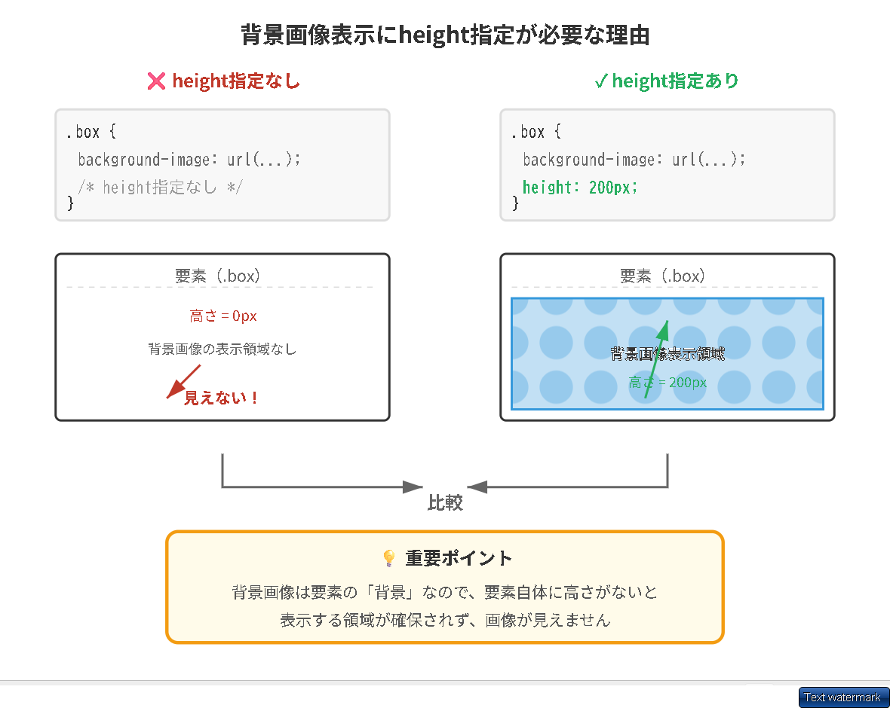
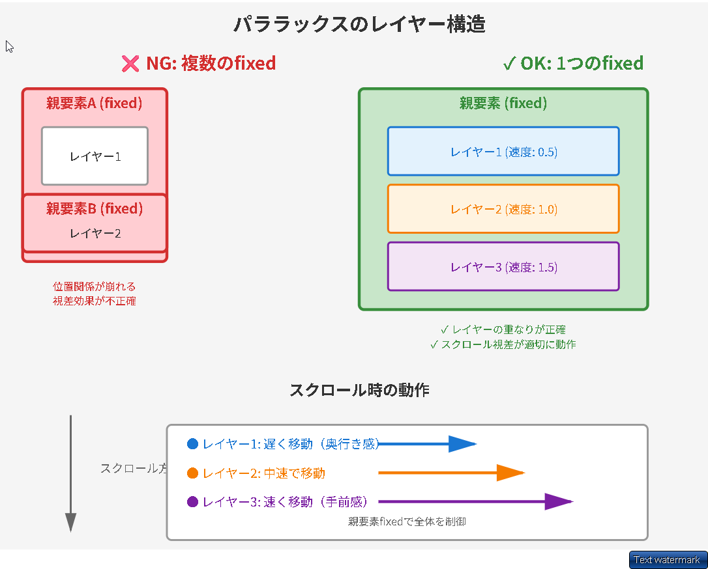
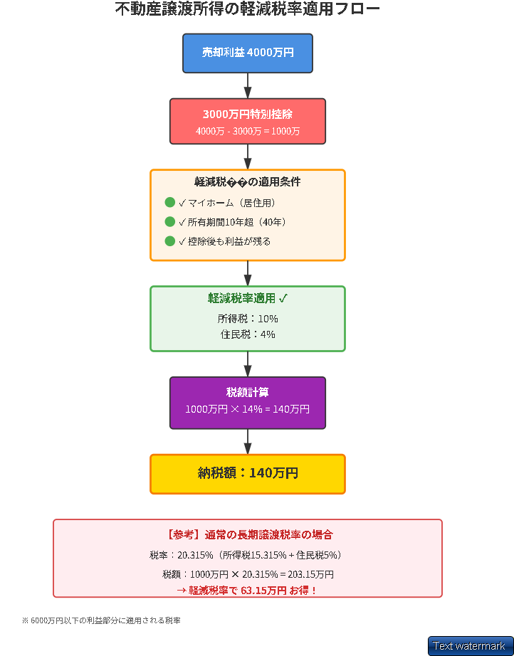
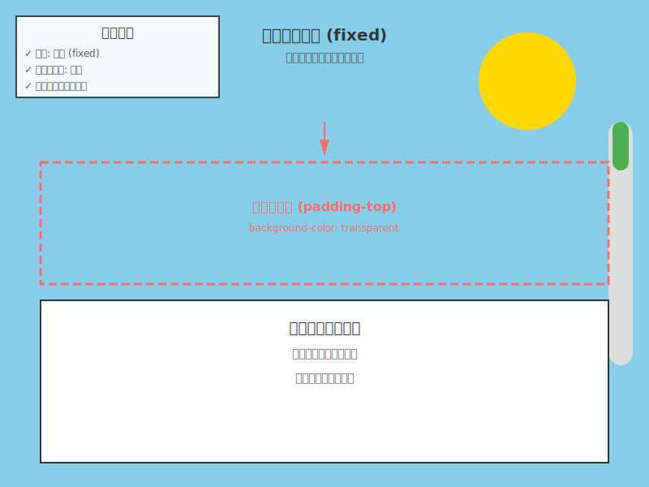
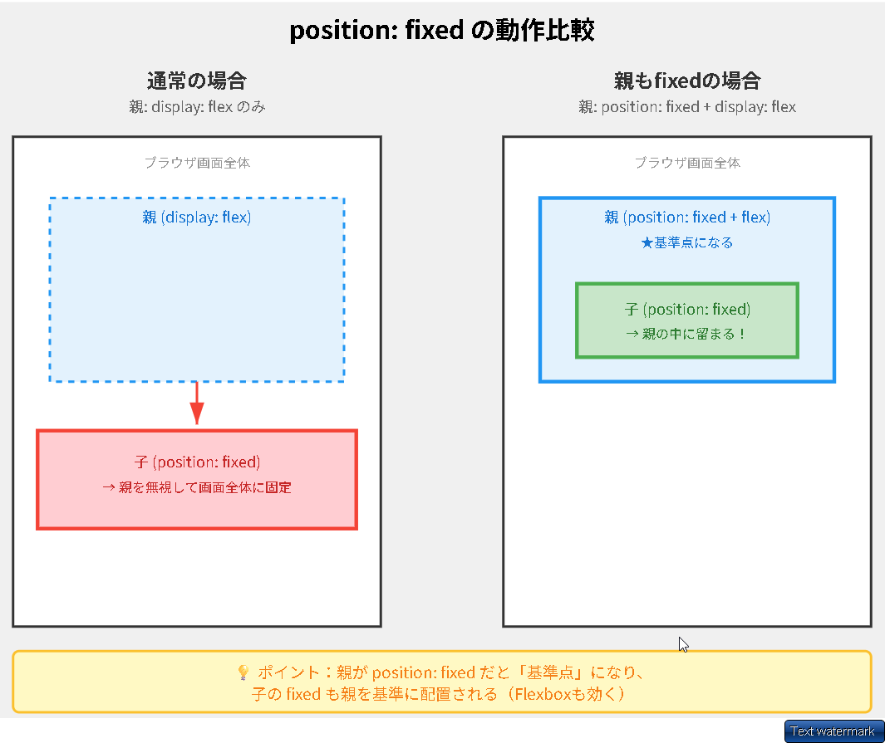

# 全て

**Q: 共通クラスを上書きする書き方は？**

親要素のクラスを指定してから共通クラスを記述することで上書きできます。

`.親クラス .共通クラス { プロパティ: 値; }`

━━━━━━━━━━━━━━━━━━━━━━━━━━━━━━━━━━━━━━━━

**Q: 文字の高さを調整するCSSプロパティは？**

line-height


━━━━━━━━━━━━━━━━━━━━━━━━━━━━━━━━━━━━━━━━

**Q: 背景画像表示にheight指定が必要な理由は？**

背景画像は要素の「背景」として表示されるため、要素自体に高さがないと表示領域が確保されず、画像が見えないからです。




━━━━━━━━━━━━━━━━━━━━━━━━━━━━━━━━━━━━━━━━

**Q: ヘッダーの高さはどのように設定する？**

ヘッダーの高さは `height: auto` と `min-height: 6.2rem` を組み合わせて設定します。これにより、基本は中身に応じて自動で伸縮し、最低でも6.2remの高さを確保できます。

━━━━━━━━━━━━━━━━━━━━━━━━━━━━━━━━━━━━━━━━

**Q: z-indexでレイヤーになる組み合わせは？**

# z-indexでレイヤーになる組み合わせ

以下の組み合わせでz-indexが有効になります：

1. **`position: fixed` + `z-index`**
2. **`position: absolute` + `z-index`**
3. **`position: relative` + `z-index`**
4. **`position: sticky` + `z-index`**

メモからは特に **`position: fixed` + `z-index`** の組み合わせが明記されており、fixed要素の子要素には `absolute` を使用することが推奨されています。

━━━━━━━━━━━━━━━━━━━━━━━━━━━━━━━━━━━━━━━━

**Q: AIに確認する際、渡すものは？**

AIに確認する際、渡すものは「ソース」と「デザインカンプ」です。

━━━━━━━━━━━━━━━━━━━━━━━━━━━━━━━━━━━━━━━━

**Q: フレックスで画像が小さくならない対策は？**

フレックスアイテムの`.b`に`min-width: 0;`を指定します。

これにより、flexアイテ��のデフォルトの最小幅制約が解除され、画像が親要素の幅に応じて縮小できるようになります。


━━━━━━━━━━━━━━━━━━━━━━━━━━━━━━━━━━━━━━━━

**Q: `align-items: stretch;`で子要素はどうなる？**

子要素が親要素の高さ（200px）に引き伸ばされます。


━━━━━━━━━━━━━━━━━━━━━━━━━━━━━━━━━━━━━━━━

選択されたテキストにある background-attachment: fixed; は、背景画像をスクロールさせずに固定するプロパティであり、背景を「透けさせる（透明度を変える）」ためのものではありません。

背景を透けさせるには、一般的に opacity プロパティや、色の指定に rgba() を使用します。それぞれの具体的な使い方を説明します。
1. 要素全体を透けさせる (opacity)
要素（文字も背景もすべて）の透明度を一括で変更します。値は 0（完全に透明）から 1（不透明）の間で指定します。

.box {
  background-color: blue;
  opacity: 0.5; /* 50%の透明度 */
}
2. 背景色だけを透けさせる (rgba)
中の文字などはくっきり見せたまま、背景の色だけを透けさせたい場合に最もよく使われる方法です。

.box {
  /* rgba(赤, 緑, 青, 透明度) */
  background-color: rgba(0, 0, 255, 0.5); /* 青色を50%の透明度に */
}
3. 背景画像だけを透けさせる
背景画像（background-image）自体に透明度を設定するプロパティは存在しないため、擬似要素（::before など）を背後に敷いて、その opacity を調整するのが一般的です。

.box {
  position: relative;
  z-index: 0;
}

.box::before {
  content: "";
  position: absolute;
  top: 0; right: 0; bottom: 0; left: 0;
  z-index: -1;
  background-image: url('image.jpg');
  background-size: cover;
  opacity: 0.3; /* 画像の濃さを30%にする */
}


補足：background-attachment: fixed; とは？
これは、画面をスクロールしても背景画像が一緒に動かず、その場に留まるような視覚効果（パララックス効果など）を作るために使われるプロパティです。透明度とは別の機能です。


━━━━━━━━━━━━━━━━━━━━━━━━━━━━━━━━━━━━━━━━

**Q: ロゴのHTMLでIDを使う理由は？**

メモには「classではなく IDを理由する」という記述がありますが、具体的な理由は記載されていません。一般的には、ロゴは1ページに1つしか存在しない要素であるため、IDを使用すると考えられます。

`補足：ロゴにIDを使う理由について`**`
記載内容は概ね正しいです。
- ロゴは通常1ページに1つだけ存在
- IDは一意の要素に使用する（ページ内で1つだけ）
- JavaScriptでの操作やページ内リンクでも特定しやすい

という理由から、ロゴには`id`属性を使うのが一般的です。


━━━━━━━━━━━━━━━━━━━━━━━━━━━━━━━━━━━━━━━━

**Q: マージンとパディング、親から子への距離は？**

親から子への距離は**パディング**で設定します。
/* ✨
- **パディング（padding）**: 要素の内側の余白。親要素の境界線から子要素（内容）までの距離を設定します。
- **マージン（margin）**: 要素の外側の余白。他の要素との距離を設定します。

したがって、「親から子への距離はパディングで設定する」という説明は**本当のこと**です。
*/


━━━━━━━━━━━━━━━━━━━━━━━━━━━━━━━━━━━━━━━━

**Q: 疑似要素で縦線中央配置に使うCSSプロパティは？**

`top: 50%` と `transform: translateY(-50%)`


━━━━━━━━━━━━━━━━━━━━━━━━━━━━━━━━━━━━━━━━

**Q: パララックスでレイヤーを重ねるのに必要なこと？**

親の要素で、fixedは親1箇所のみに設定する必要があります。



━━━━━━━━━━━━━━━━━━━━━━━━━━━━━━━━━━━━━━━━
# 不動産


**Q: 相続税の基礎控除額は？**

3,000万円 + 600万円 × 法定相続人の数

このコードは、**日本の相続税における基礎控除額の計算式**を示しています。

**内容:**
- 相続税には一定額まで課税されない「基礎控除」があります
- その計算式は：**3,000万円 + (600万円 × 法定相続人の数)**

**具体例:**
- 法定相続人が3人の場合：3,000万円 + 600万円 × 3 = **4,800万円**
- 相続財産がこの基礎控除額以下なら相続税はかかりません

━━━━━━━━━━━━━━━━━━━━━━━━━━━━━━━━━━━━━━━━


**Q: 幅がひろいwidthを文字は文字幅にあわせる**
width: fit-content;


━━━━━━━━━━━━━━━━━━━━━━━━━━━━━━━━━━━━━━━━

**Q: 3000万円控除後の利益にかかる軽減税率は？**


10%（ほかに住民税4%）です。
/* ✨
いいえ、必ずかかるわけではありません。

**軽減税率が適用されるのは特定の���件を満たした場合のみ**です。

主な条件：
- **マイホーム（居住用財産）を売却**したこと
- **所有期間が10年超**であること
- 3000万円の特別控除を適用した後も利益が残る場合

つまり、3000万円控除で利益がゼロになれば税金はかかりませんし、上記の条件を満たさなければ通常の税率（所有期間5年超で20.315%）が適用されます。
/* ✨
あなたの場合、**軽減税率が適用されます**。

**理由：**
- ✅ マイホーム（自��）として居住
- ✅ 所有期間40年（10年超の条件クリア）
- ✅ 3000万円控除後も利益が残る

**税率：**
- 利益6000万円まで：**所得税10% + 住民税4% = 計14%**
- 6000万円超の部分：所得税15% + 住民税5% = 計20%

**例：**
売却利益が4000万円の場合
→ 4000万円 - 3000万円（控除）= 1000万円
→ 税金：1000万円 × 14% = **140万円**

通常の長期譲渡税率（20.315%）より有利です。
*/


━━━━━━━━━━━━━━━━━━━━━━━━━━━━━━━━━━━━━━━━

**Q: 相続で税金が増えるのはなぜ？**

相続した財産を売却すると、その売却益が収入として加算され、年末調整の収入が大幅に増えるため、税金が増加します。

━━━━━━━━━━━━━━━━━━━━━━━━━━━━━━━━━━━━━━━━

**Q: 相続税と家売却控除は別ルール？**

はい、相続税と家売却控除は別ルールです。

相続税は相続時に適用される基礎���除で、家を売却した際の譲渡所得税の3,000万円控除とは全く別の税制です。それぞれ独立して適用されるため、足し算にはなりません。


━━━━━━━━━━━━━━━━━━━━━━━━━━━━━━━━━━━━━━━━


# その他

**Q: 画面いっぱいの「固定」と「最低限」の違いは？**

「固定」は高さが画面サイズで固定され、中身が増えるとはみ出してしまいます��「最低限」は高さが最低でも画面サイズで、中身が増えれば自動で伸びてくれます。

# html


━━━━━━━━━━━━━━━━━━━━━━━━━━━━━━━━━━━━━━━━

**Q: パララックスとは**

画面に奥行きや立体感、没入感を出すための演出技法のことです。視差を利用して、背景とコンテンツが異なる速度でスクロールすることで、立体的な効果を生み出します。

実装では、背景画像を`fixed`で固定し、メインコンテンツに`padding-top`で透明な隙間を作ることで、背景が透けて見えるようにします。この際、`background-color: transparent`で背景を透明にすることが重要です。





━━━━━━━━━━━━━━━━━━━━━━━━━━━━━━━━━━━━━━━━

**Q: 検証ツールでメディアクエリを特定するには？**

検証ツールで、cssフォルダのutilityなどのフォルダからメディアクエリを特定しま���。

・検証ツールで、「要素タブ」を指定し、フレックスを利用しているところを調べる。
・定数をソースのCSSから取得してきて、どこで利用しているかざっくりしらべる。
大体セクション間や、ヘッダーとか。その程度でよし。

━━━━━━━━━━━━━━━━━━━━━━━━━━━━━━━━━━━━━━━━

**Q: パディングは親の何？**

覚え方
（余白の目的）　　　　（使うもの全体に）
共通の余白　　　　　　親の padding
子ごとに違う余白　　　子の margin

今回は「他と合わせる」より「実際の構造に合わせる」が優先二重管理を避けた方が、3 ヶ月後の自分が楽です！

以下の場合は、右と下だけパディングをつける。
それ以外は、子でマージンで別々に管理する。


━━━━━━━━━━━━━━━━━━━━━━━━━━━━━━━━━━━━━━━━

**Q: JavaScriptバブルソートの交換条件は？**

## バブルソートの交換条件

**交換条件：`arr[j] > arr[j + 1]`**

左側の要���が右側の要素より大きい場合に、2つの要素を入れ替えます。これにより、大きい値が徐々に右側（配列の末尾）へ移動していきます。

## iとjの流れ

**外側ループ（i）：**
- 配列全体を何回走査するかを制御
- `i = 0, 1, 2, ...` と増加
- i回目のループで、後ろからi番目までがソート済みになる

**内側ループ（j）：**
- 隣接する要素を比較する位置を制御
- `j = 0` から `arr.length - 1 - i` まで
- 各ステップで `arr[j]` と `arr[j+1]` を比較し、必要に応じて交換
- iが増えるごとに比較範囲が狭まる（既にソート済みの部分は比較不要）

**動作例：** `[5, 3, 8, 2]` の場合
- i=0: 全体を比較 → 最大値8が末尾へ
- i=1: 末尾を除いて比較 → 2番目に大きい値が後ろから2番目へ
- i=2: さらに範囲を狭めて比較

━━━━━━━━━━━━━━━━━━━━━━━━━━━━━━━━━━━━━━━━

**Q: インライン要素の縦位置を揃えるCSSプロパティは？**


 <a href="#" class="google_link">Google Maps
  
 </a>

```css
.icon_newtab {
  display: inline-block;
  vertical-align: -0.2rem; ★　これでインライン要素の「縦」位置をかえれる
  margin-left: 0.5rem;
  width: 1.2rem;
  height: 1.2rem;
}
```

━━━━━━━━━━━━━━━━━━━━━━━━━━━━━━━━━━━━━━━━

**Q: HTML要素の矢印を縦横中央に配置するCSSプロパティは？**

**答え**

```css
display: flex;
align-items: center;
justify-content: center;
```

**説明**

Flexboxレイアウトを使用して、子要素を縦横中央に配置する3つのプロパティの組み合わせ。`display: flex`でFlexboxを有効にし、`align-items: center`で縦方向、`justify-content: center`で横方向の中央揃えを実現する。

**メモ内容の要約**

矢印「→」をボタン内で縦横中央に配置するために使用。親要素（`.news_link`）にこの3つのプロパティを指定することで、インライン要素である`<a>`タグ内のテキストコンテンツを中央配置している。

**例：**

```css
.news_link {
  display: block;
  height: 1.5rem;
  width: 3.5rem;
  color: white;
  background-color: rgb(60, 40, 189);
  border-radius: 2rem;
  /* 子要素「→」の位置を変える */
  display: flex;
  align-items: center;
  justify-content: center;
}
```

━━━━━━━━━━━━━━━━━━━━━━━━━━━━━━━━━━━━━━━━

**Q: Flexboxの親要素がfixedである場合、子要素のposition:fixedはどのように振る舞うか？**

**親要素が `position: fixed` かつ `display: flex` の場合、子要素の `position: fixed` は親のfixedに引きずられて親の中で配置される**

★要するに↓を理解する！！

```css
/* 親要素 */
.parent {
  position: fixed;
  display: flex;
  /* 子要素はこの中で整列される */
}

/* 子要素 */
.child {
  position: fixed; /* または absolute */
  /* 親のfixedに引きずられる */
}

**理由**: 親の `position: fixed` が「位置の基準点」を作るため、子の `fixed` もその基準点（=親）に従う

→ **結果的に、親子ともに fixed でも Flexbox レイアウトが崩れない**
*/


━━━━━━━━━━━━━━━━━━━━━━━━━━━━━━━━━━━━━━━━

**Q: スクロール位置が520pxになったら要素をふわっと表示させるJavaScriptのメソッドは？**

fadeIn()

jQueryのメソッドで、非表示の要素をフェードイン（徐々に表示）させる��スクロール位置の判定と組み合わせて、特定の位置に達したら要素をふわっと表示できる。

例：
```javascript
$(window).on("scroll", function () {
  if ($(this).scrollTop() > 520) {
    $("#header").fadeIn();
  }
});
```


━━━━━━━━━━━━━━━━━━━━━━━━━━━━━━━━━━━━━━━━

**Q: z-indexが意図通りに機能しない場合、まず確認すべき親要素のプロパティは何ですか？**

親要素の `position` プロパティ

z-indexはposition指定された要素間でのみ機能するた���、親要素にposition（relative/absolute/fixed等）が設定されているか確認が必要。未設定だとスタッキングコンテキストが正しく形成されない。
