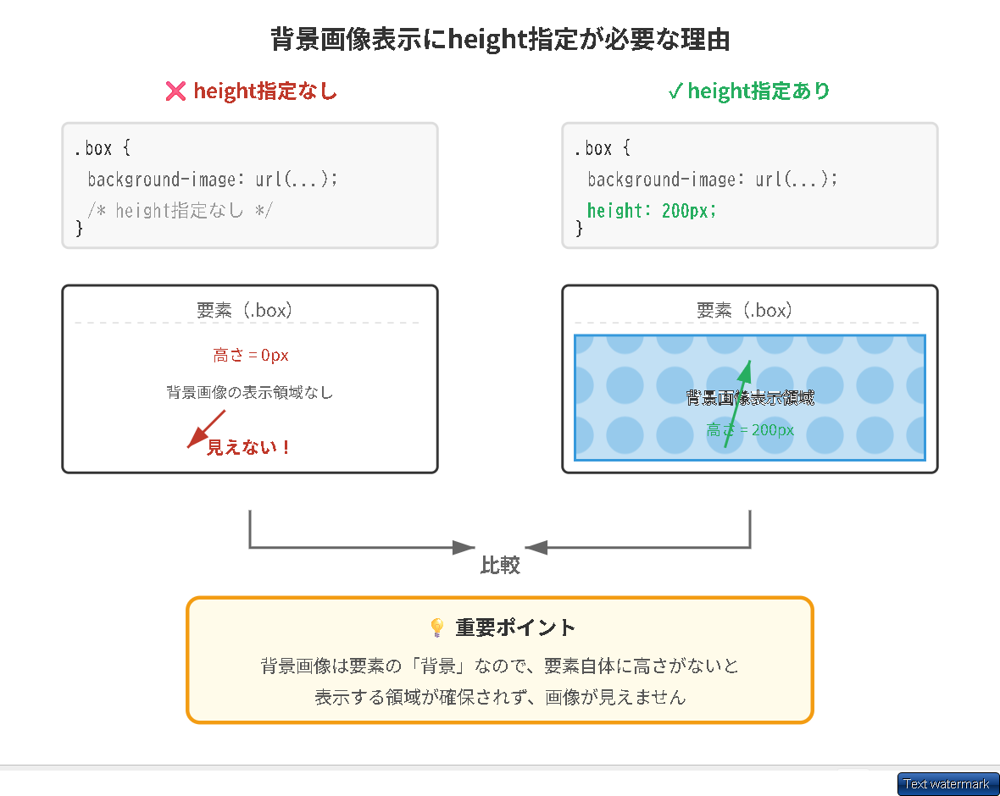
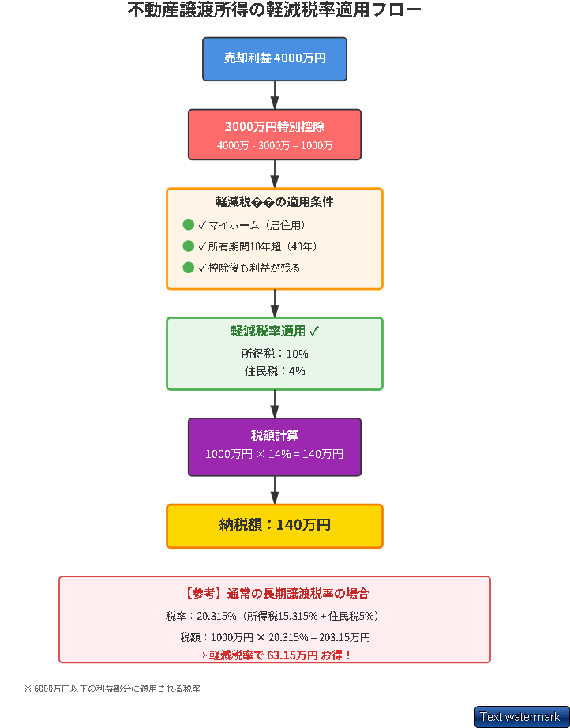
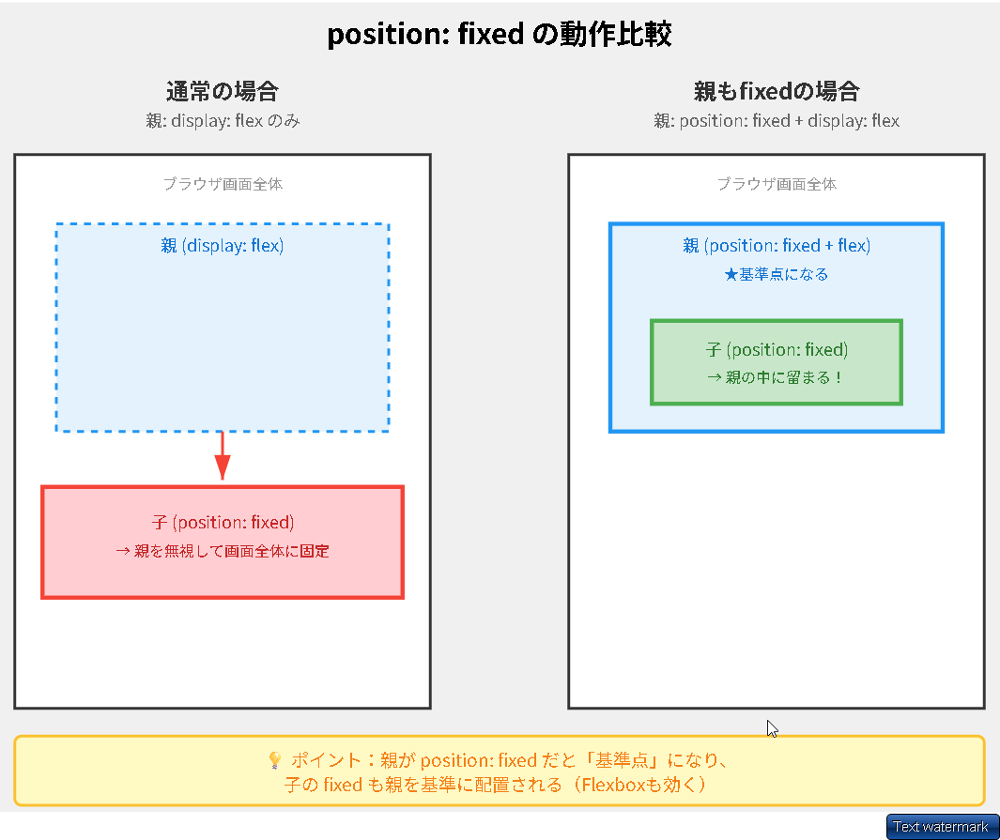
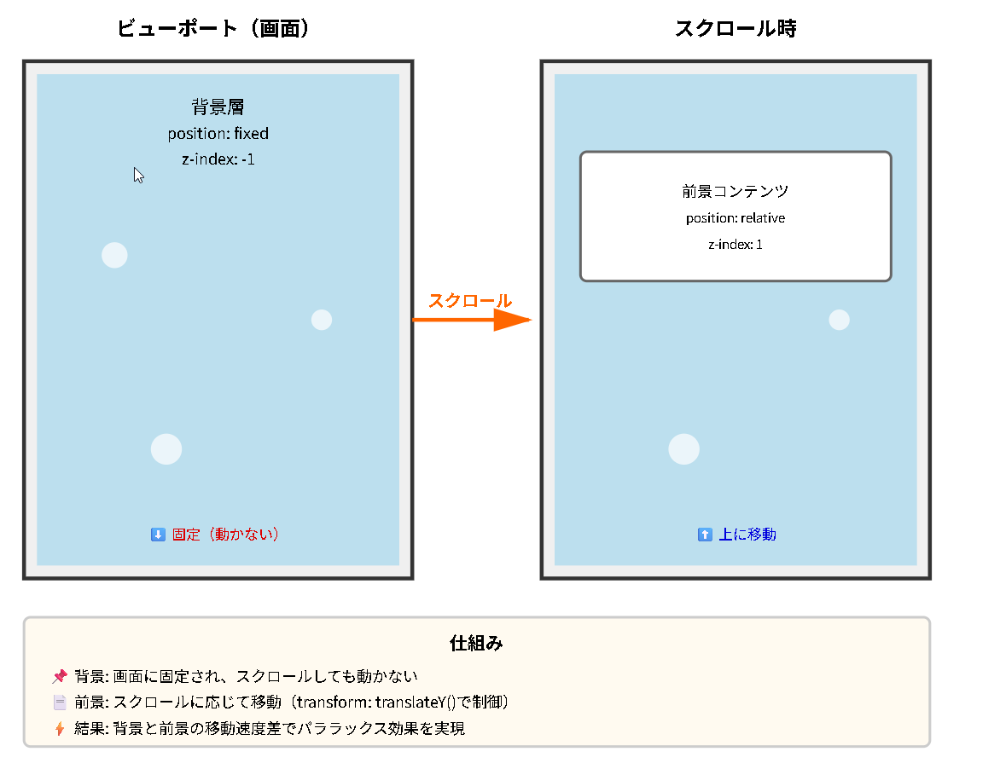
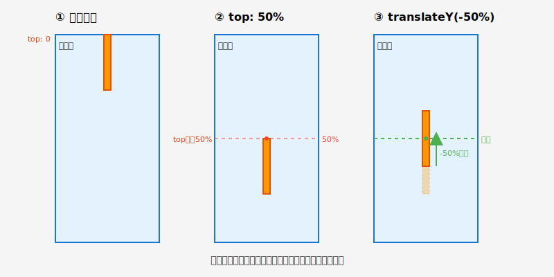

# 全て

**Q: 共通クラスを上書きする書き方は？**

親要素のクラスを指定してから共通クラスを記述することで上書きできます。

`.親クラス .共通クラス { プロパティ: 値; }`

━━━━━━━━━━━━━━━━━━━━━━━━━━━━━━━━━━━━━━━━

**Q: 文字の高さを調整するCSSプロパティは？**

line-height


━━━━━━━━━━━━━━━━━━━━━━━━━━━━━━━━━━━━━━━━

**Q: 背景画像表示にheight指定が必要な理由は？**

背景画像は要素の「背景」として表示されるため、要素自体に高さがないと表示領域が確保されず、画像が見えないからです。




━━━━━━━━━━━━━━━━━━━━━━━━━━━━━━━━━━━━━━━━

**Q: ヘッダーの高さはどのように設定する？**

ヘッダーの高さは `height: auto` と `min-height: 6.2rem` を組み合わせて設定します。これにより、基本は中身に応じて自動で伸縮し、最低でも6.2remの高さを確保できます。

━━━━━━━━━━━━━━━━━━━━━━━━━━━━━━━━━━━━━━━━

**Q: z-indexでレイヤーになる組み合わせは？**

# z-indexでレイヤーになる組み合わせ

以下の組み合わせでz-indexが有効になります：

1. **`position: fixed` + `z-index`**
2. **`position: absolute` + `z-index`**
3. **`position: relative` + `z-index`**
4. **`position: sticky` + `z-index`**

メモからは特に **`position: fixed` + `z-index`** の組み合わせが明記されており、fixed要素の子要素には `absolute` を使用することが推奨されています。

━━━━━━━━━━━━━━━━━━━━━━━━━━━━━━━━━━━━━━━━

**Q: AIに確認する際、渡すものは？**

AIに確認する際、渡すものは「ソース」と「デザインカンプ」です。

━━━━━━━━━━━━━━━━━━━━━━━━━━━━━━━━━━━━━━━━

━━━━━━━━━━━━━━━━━━━━━━━━━━━━━━━━━━━━━━━━

**Q: `align-items: stretch;`で子要素はどうなる？**

子要素が親要素の高さ（200px）に引き伸ばされます。


━━━━━━━━━━━━━━━━━━━━━━━━━━━━━━━━━━━━━━━━

選択されたテキストにある `background-attachment: fixed;` は、背景画像をスクロールさせずに固定するプロパティであり、背景を「透けさせる（透明度を変える）」ためのものではありません。

背景を透けさせるには、一般的に opacity プロパティや、色の指定に rgba() を使用します。それぞれの具体的な使い方を説明します。
1. 要素全体を透けさせる (opacity)
要素（文字も背景もすべて）の透明度を一括で変更します。値は 0（完全に透明）から 1（不透明）の間で指定します。

.box {
  background-color: blue;
  opacity: 0.5; /* 50%の透明度 */
}
2. 背景色だけを透けさせる (rgba)
中の文字などはくっきり見せたまま、背景の色だけを透けさせたい場合に最もよく使われる方法です。

.box {
  /* rgba(赤, 緑, 青, 透明度) */
  background-color: rgba(0, 0, 255, 0.5); /* 青色を50%の透明度に */
}
3. 背景画像だけを透けさせる
背景画像（background-image）自体に透明度を設定するプロパティは存在しないため、擬似要素（::before など）を背後に敷いて、その opacity を調整するのが一般的です。

.box {
  position: relative;
  z-index: 0;
}

.box::before {
  content: "";
  position: absolute;
  top: 0; right: 0; bottom: 0; left: 0;
  z-index: -1;
  background-image: url('image.jpg');
  background-size: cover;
  opacity: 0.3; /* 画像の濃さを30%にする */
}


補足：background-attachment: fixed; とは？
これは、画面をスクロールしても背景画像が一緒に動かず、その場に留まるような視覚効果（パララックス効果など）を作るために使われるプロパティです。透明度とは別の機能です。

★背景を固定する2つの方法の使い分け：
- 普通の背景固定 → `background-attachment: fixed`（こっちが基本・簡単）
- 動く背景が必要な時だけ → `position: fixed` + `z-index`（汎用的）


━━━━━━━━━━━━━━━━━━━━━━━━━━━━━━━━━━━━━━━━

**Q: ロゴのHTMLでIDを使う理由は？**

メモには「classではなく IDを理由する」という記述がありますが、具体的な理由は記載されていません。一般的には、ロゴは1ページに1つしか存在しない要素であるため、IDを使用すると考えられます。

`補足：ロゴにIDを使う理由について`**`
記載内容は概ね正しいです。
- ロゴは通常1ページに1つだけ存在
- IDは一意の要素に使用する（ページ内で1つだけ）
- JavaScriptでの操作やページ内リンクでも特定しやすい

という理由から、ロゴには`id`属性を使うのが一般的です。


━━━━━━━━━━━━━━━━━━━━━━━━━━━━━━━━━━━━━━━━
☑
**Q: マージンとパディング、親から子への距離は？**

親から子への距離は**パディング**で設定します。
/* ✨
- **パディング（padding）**: 要素の内側の余白。親要素の境界線から子要素（内容）までの距離を設定します。
- **マージン（margin）**: 要素の外側の余白。他の要素との距離を設定します。

したがって、「親から子への距離はパディングで設定する」という説明は**本当のこと**です。
*/


━━━━━━━━━━━━━━━━━━━━━━━━━━━━━━━━━━━━━━━━
# 不動産


**Q: 相続税の基礎控除額は？**

3,000万円 + 600万円 × 法定相続人の数

このコードは、**日本の相続税における基礎控除額の計算式**を示しています。

**内容:**
- 相続税には一定額まで課税されない「基礎控除」があります
- その計算式は：**3,000万円 + (600万円 × 法定相続人の数)**

**具体例:**
- 法定相続人が3人の場合：3,000万円 + 600万円 × 3 = **4,800万円**
- 相続財産がこの基礎控除額以下なら相続税はかかりません

━━━━━━━━━━━━━━━━━━━━━━━━━━━━━━━━━━━━━━━━


**Q: 幅がひろいwidthを文字は文字幅にあわせる**
width: fit-content;


━━━━━━━━━━━━━━━━━━━━━━━━━━━━━━━━━━━━━━━━

**Q: 3000万円控除後の利益にかかる軽減税率は？**


10%（ほかに住民税4%）です。
/* ✨
いいえ、必ずかかるわけではありません。

**軽減税率が適用されるのは特定の���件を満たした場合のみ**です。

主な条件：
- **マイホーム（居住用財産）を売却**したこと
- **所有期間が10年超**であること
- 3000万円の特別控除を適用した後も利益が残る場合

つまり、3000万円控除で利益がゼロになれば税金はかかりませんし、上記の条件を満たさなければ通常の税率（所有期間5年超で20.315%）が適用されます。
/* ✨
あなたの場合、**軽減税率が適用されます**。

**理由：**
- ✅ マイホーム（自��）として居住
- ✅ 所有期間40年（10年超の条件クリア）
- ✅ 3000万円控除後も利益が残る

**税率：**
- 利益6000万円まで：**所得税10% + 住民税4% = 計14%**
- 6000万円超の部分：所得税15% + 住民税5% = 計20%

**例：**
売却利益が4000万円の場合
→ 4000万円 - 3000万円（控除）= 1000万円
→ 税金：1000万円 × 14% = **140万円**

通常の長期譲渡税率（20.315%）より有利です。
*/


━━━━━━━━━━━━━━━━━━━━━━━━━━━━━━━━━━━━━━━━

**Q: 相続で税金が増えるのはなぜ？**

相続した財産を売却すると、その売却益が収入として加算され、年末調整の収入が大幅に増えるため、税金が増加します。

━━━━━━━━━━━━━━━━━━━━━━━━━━━━━━━━━━━━━━━━

**Q: 相続税と家売却控除は別ルール？**

はい、相続税と家売却控除は別ルールです。

相続税は相続時に適用される基礎���除で、家を売却した際の譲渡所得税の3,000万円控除とは全く別の税制です。それぞれ独立して適用されるため、足し算にはなりません。


━━━━━━━━━━━━━━━━━━━━━━━━━━━━━━━━━━━━━━━━


━━━━━━━━━━━━━━━━━━━━━━━━━━━━━━━━━━━━━━━━

**Q: 相続するとき注意したいこと。**

相続財産の売却益は年末調整の対象外。母親名義で売却する方が有利な場合もあるが、理由が誤っている。

相続による不動産取得自体は年末調整の収入に含まれない。ただし、居住用不動産を売却する際の3000万円特別控除は居住者本人が適用を受けられるため、母親が居住していれば母親名義での売却が税制上有利になる可能性がある。相続税や譲渡所得税を含めた総合的な検討が必要。

━━━━━━━━━━━━━━━━━━━━━━━━━━━━━━━━━━━━━━━━

**Q: 家屋を取り壊した土地を売却する際、3000万円控除を受けるための条件は？**

(1)取壊しから1年以内に売買契約、(2)居住しなくなった日から3年目の年末までに��却、(3)取壊し後、売買契約まで事業利用していないこと

これら3条件を満たせば、更地でも居住用財産の3000万円特別控除が適用可能。

⚠ ファクトチェック：
「利益が3000万円残った場合、控除がタダになる」は誤りです。正しくは、譲渡所得（売却益）から最大3000万円を控除でき、控除後の所得に対して課税されます。控除額は売却益が3000万円未満ならその金額まで。
# その他

**Q: 画面いっぱいの「固定」と「最低限」の違いは？**

「固定」は高さが画面サイズで固定され、中身が増えるとはみ出してしまいます��「最低限」は高さが最低でも画面サイズで、中身が増えれば自動で伸びてくれます。

# html


━━━━━━━━━━━━━━━━━━━━━━━━━━━━━━━━━━━━━━━━

**Q: パララックスとは**

→ 詳しい解説・コード例は「📌 パララックスとは何か？ position: fixed と子要素の関係」に集約済み


━━━━━━━━━━━━━━━━━━━━━━━━━━━━━━━━━━━━━━━━

**Q: 検証ツールでメディアクエリを特定するには？**

検証ツールで、cssフォルダのutilityなどのフォルダからメディアクエリを特定しま���。

・検証ツールで、「要素タブ」を指定し、フレックスを利用しているところを調べる。
・定数をソースのCSSから取得してきて、どこで利用しているかざっくりしらべる。
大体セクション間や、ヘッダーとか。その程度でよし。

━━━━━━━━━━━━━━━━━━━━━━━━━━━━━━━━━━━━━━━━

**Q: パディングは親の何？**

覚え方
（余白の目的）　　　　（使うもの全体に）
共通の余白　　　　　　親の padding
子ごとに違う余白　　　子の margin

今回は「他と合わせる」より「実際の構造に合わせる」が優先二重管理を避けた方が、3 ヶ月後の自分が楽です！

以下の場合は、右と下だけパディングをつける。
それ以外は、子でマージンで別々に管理する。


━━━━━━━━━━━━━━━━━━━━━━━━━━━━━━━━━━━━━━━━

**Q: JavaScriptバブルソートの交換条件は？**

## バブルソートの交換条件

**交換条件：`arr[j] > arr[j + 1]`**

左側の要���が右側の要素より大きい場合に、2つの要素を入れ替えます。これにより、大きい値が徐々に右側（配列の末尾）へ移動していきます。

## iとjの流れ

**外側ループ（i）：**
- 配列全体を何回走査するかを制御
- `i = 0, 1, 2, ...` と増加
- i回目のループで、後ろからi番目までがソート済みになる

**内側ループ（j）：**
- 隣接する要素を比較する位置を制御
- `j = 0` から `arr.length - 1 - i` まで
- 各ステップで `arr[j]` と `arr[j+1]` を比較し、必要に応じて交換
- iが増えるごとに比較範囲が狭まる（既にソート済みの部分は比較不要）

**動作例：** `[5, 3, 8, 2]` の場合
- i=0: 全体を比較 → 最大値8が末尾へ
- i=1: 末尾を除いて比較 → 2番目に大きい値が後ろから2番目へ
- i=2: さらに範囲を狭めて比較

━━━━━━━━━━━━━━━━━━━━━━━━━━━━━━━━━━━━━━━━

**Q: インライン要素の縦位置を揃えるCSSプロパティは？**


 <a href="#" class="google_link">Google Maps
  
 </a>

```css
.icon_newtab {
  display: inline-block;
  vertical-align: -0.2rem; ★　これでインライン要素の「縦」位置をかえれる
  margin-left: 0.5rem;
  width: 1.2rem;
  height: 1.2rem;
}
```

━━━━━━━━━━━━━━━━━━━━━━━━━━━━━━━━━━━━━━━━

**Q: HTML要素の矢印を縦横中央に配置するCSSプロパティは？**

**答え**

```css
display: flex;
align-items: center;
justify-content: center;
```

**説明**

Flexboxレイアウトを使用して、子要素を縦横中央に配置する3つのプロパティの組み合わせ。`display: flex`でFlexboxを有効にし、`align-items: center`で縦方向、`justify-content: center`で横方向の中央揃えを実現する。

**メモ内容の要約**

矢印「→」をボタン内で縦横中央に配置するために使用。親要素（`.news_link`）にこの3つのプロパティを指定することで、インライン要素である`<a>`タグ内のテキストコンテンツを中央配置している。

**例：**

```css
.news_link {
  display: block;
  height: 1.5rem;
  width: 3.5rem;
  color: white;
  background-color: rgb(60, 40, 189);
  border-radius: 2rem;
  /* 子要素「→」の位置を変える */
  display: flex;
  align-items: center;
  justify-content: center;
}
```

━━━━━━━━━━━━━━━━━━━━━━━━━━━━━━━━━━━━━━━━

**Q: Flexboxの親要素がfixedである場合、子要素のposition:fixedはどのように振る舞うか？**

**親要素が `position: fixed` かつ `display: flex` の場合、子要素の `position: fixed` は親のfixedに引きずられて親の中で配置される**

★要するに↓を理解する！！

```css
/* 親要素 */
.parent {
  position: fixed;
  display: flex;
  /* 子要素はこの中で整列される */
}

/* 子要素 */
.child {
  position: fixed; /* または absolute */
  /* 親のfixedに引きずられる */
}

**理由**: 親の `position: fixed` が「位置の基準点」を作るため、子の `fixed` もその基準点（=親）に従う

→ **結果的に、親子ともに fixed でも Flexbox レイアウトが崩れない**
*/


━━━━━━━━━━━━━━━━━━━━━━━━━━━━━━━━━━━━━━━━
☑
**Q: スクロール位置が520pxになったら要素をふわっと表示させるJavaScriptのメソッドは？**

fadeIn()

jQueryのメソッドで、非表示の要素をフェードイン（徐々に表示）させる��スクロール位置の判定と組み合わせて、特定の位置に達したら要素をふわっと表示できる。

例：
```javascript
$(window).on("scroll", function () {
  if ($(this).scrollTop() > 520) {
    $("#header").fadeIn();
  }
});
```


━━━━━━━━━━━━━━━━━━━━━━━━━━━━━━━━━━━━━━━━
☑
**Q: z-indexが意図通りに機能しない場合、まず確認すべき親要素のプロパティは何ですか？**

親要素の `position` プロパティ

z-indexはposition指定された要素間でのみ機能するた���、親要素にposition（relative/absolute/fixed等）が設定されているか確認が必要。未設定だとスタッキングコンテキストが正しく形成されない。


━━━━━━━━━━━━━━━━━━━━━━━━━━━━━━━━━━━━━━━━

**Q: パララックス効果を固定背景とスクロール前景の2層構造で作る際、前景要素を背景より手前に表示するために使用するCSSプロパティは何？**

z-index（※詳しい解説・コード例はパララックスのQ&Aに集約済み）


━━━━━━━━━━━━━━━━━━━━━━━━━━━━━━━━━━━━━━━━

**Q: デザインカンプの幅とwrapperのmax-width設定で発生した「うっかりミス」の原因は？**

デザインカンプの幅（1400px）とwrapperのmax-width設定値（1200px）が一致していなかった。

デザインカンプの幅を確認せずにwrapperのmax-widthを設定したため、200pxの差異が発生し、想定と異なる見た目になった。
/* ✨
## 回答

**必要なことです。**重要な意味があります。

### 理由
- **デザインと実装の一致**: デザインカンプ（デザイン見本）の幅と、実際のコードで設定するmax-widthを揃えないと、デザイナーが意図した見た目と異なるサイトになってしまいます。

- **200pxの差の影響**: この場合、デザインより200px狭く表示されるため、
  - レイアウトが崩れる
  - 余白のバランスが変わる
  - 文字の折り返し位置がずれる
  
### 教訓
デザインカンプを作る・受け取る際は、**必ず幅の数値を確認してからコーディングする**習慣をつけることが大切です。

このような「うっかりミス」を防ぐための基本的な確認事項として紹介されています。
*/
/* ✨
いいえ、逆です。

**「デザインカンプの幅 = max-widthに設定する最大幅」**という意味です。

- デザインカンプが1400pxなら、**1400pxまでは広げてOK**
- それ以上（1401px以上）には広がらないように制限する

つまり「**この幅を最大として、それ以上は広げるな**」という設定です。

ブラウザを広げても、コンテンツは1400pxで止まり、両サイドに余白ができます。
*/


━━━━━━━━━━━━━━━━━━━━━━━━━━━━━━━━━━━━━━━━

**Q: display:inline_flexと　display:blockの違い。**

`display: inline-flex`は横並び、`display: block`は縦並び（改行が入る）。

`inline-flex`は���素自体がインライン要素として振る舞いながら内部はFlexboxになるため、他の要素と横に並ぶ。`block`はブロック要素として幅いっぱいに広がり、次の要素は下に配置される。
/* ✨
# display: inline-flex の使い分け

## 使用場面

**`display: inline-flex`** を使うのは：
- **複数のFlexコンテナを横に並べたいとき**
- ボタン群、タグ、バッジなど小さな部品を文章中や横並びに配置したいとき

**`display: flex`** （blockベース）を使うのは：
- **ページレイアウト全体やセクション単位**での配置
- ナビゲーションバー、カード一覧など、幅いっぱい使いたいとき

## 例

/* inline-flex: 複数のボタングループを横並びに */
.button-group {
  display: inline-flex;
  gap: 5px;
  margin-right: 20px;
}

/* flex: ヘッダー全体のレイアウト */
.header {
  display: flex;
  justify-content: space-between;
}

## 結論
- **`inline-flex`** = 要素自体は横並び、内部もFlexbox
- **`flex`（block）** = 要素自体は縦積み（幅100%）、内部はFlexbox

**ほとんどの場合は `display: flex` を使います。** `inline-flex`は特殊な場面向けです。
*/


━━━━━━━━━━━━━━━━━━━━━━━━━━━━━━━━━━━━━━━━

**Q: 実務（コーディング）着手前の準備・手順**

デザインカンプを分析→タスクをチェックリスト化→AIで雛形作成→手書きで構��図を描く→CSS設計ルールに沿ってコーディング

・セクション固有の幅をあらいだす
・共通のサイズを洗い出す。
・フォントなどもあらいだす？


まず全体を俯瞰して共通パーツ・Grid・アニメーションを洗い出し、HTML階層構造とクラス名を定義。その後、`セクション単位でPC版を完璧に仕上げてから`レスポンシブ対応へ進む。

```css
:root {
  --sidebar-width: 15rem;
}
.voice_bg, .overview_bg {
  max-width: 86rem;
  margin-left: auto;
  margin-right: auto;
}
```

```html
<div class="menu-wrap">
  <div class="menu-col menu-left">
    <div class="menu-section">
      <h3>Coffee</h3>
    </div>
  </div>
  <div class="menu-col menu-right">
  </div>
</div>
```

━━━━━━━━━━━━━━━━━━━━━━━━━━━━━━━━━━━━━━━━

**Q: 📌 パララックスとは何か？ position: fixed と子要素の関係**

パララックス（視差効果）= 背景とコンテンツが異なる速度でスクロールし、奥行き・立体感を出す演出技法。
2層構造（固定背景 + スクロール前景）で実装する。

親に `position: fixed` を指定すると、子要素は `relative` や `absolute` で親を基準に配置でき、親と一緒に画面に固定される。
背景コンテナを `fixed` で固定し、子要素は `relative` で配置。子に `fixed` を付けると親を無視して画面基準になるため不要。

例：
```html
<div class="particle-bg">       <!-- fixed -->
  <div class="house"></div>      <!-- relative -->
</div>
```
```css
.particle-bg {
  position: fixed;
  top: 0; left: 0;
}
.house {
  position: relative; /* 親と一緒に固定される */
}
```
/* ✨
# 回答

ようするに親がfixで子もfixだとだめなんですか？？？？？

**ダメではないですが、意図と違う動きになります。**　→ようするにサイドメニューのように
サイドメニュー(fixed)があって、子がfixedだと画面全体からの
配置になるので、想定した配置にならない。


## 理由

- **親が `fixed`、子も `fixed`** の場合：
  - 子は親を無視して**画面全体を基準**に配置される
  - 親と子が別々の位置に固定される

- **親が `fixed`、子が `relative` や `absolute`** の場合：
  - 子は親を基準に配置される
  - 親と子が一体となって固定される

## パララックスでは

背景コンテナ（親）と装飾要素（子）を**一緒に固定したい**ので、子には `relative` や `absolute` を使います。

子に `fixed` を付けると親から独立してしまい、一緒に配置できなくなるため避けるべきです。
*/


━━━━━━━━━━━━━━━━━━━━━━━━━━━━━━━━━━━━━━━━

**Q: パララックス効果で固定背景とスクロール前景の2層構造を作るには、どのようなCSSプロパティとJavaScript関数で調整しますか？**


`position: fixed`（背景）+ `position: relative`（前景）+ `z-index` + `transform: translateY()`

背���を`position: fixed; z-index: -1`で固定し、前景を`position: relative; z-index: 1`で前面配置。JavaScriptで`transform: translateY()`を使いスクロール量に応じて要素を動かす。

【具体例】
```html
<!-- ➀背景画像（固定） -->
<div class="particle-bg">
  <div class="house-illustration"></div>
</div>

<!-- ➁前面画像（スクロール） -->
<div class="parallax-container">
  <section class="parallax-section">
    <!-- コンテンツ -->
  </section>
</div>
```

```css
.particle-bg {
  position: fixed;
  z-index: -1;
}
.parallax-container {
  position: relative;
  z-index: 1;
  padding-top: 100vh;
}
```

★なぜ `relative` であって `absolute` ではないのか？
- `relative`: 要素がスペースを占有したまま → スクロール可能な高さが自動生成される
- `absolute`: ドキュメントフローから外れる → ページ高さ=0、スクロールバーが出ない
- 前景は `z-index: 1` で手前に、背景は `z-index: -1` で奥に配置する

━━━━━━━━━━━━━━━━━━━━━━━━━━━━━━━━━━━━━━━━

**Q: CSSで縦線を疑似要素で表示する際、開始位置を垂直方向中央に配置するために`transform`プロパティと組み合わせて使われる値は？**

`top: 50%;`

疑似要素の開始位置（top端）を親要素の50%の位置に配置し、`transform: translateY(-50%)`で自身の高さの半分だけ上に戻すことで、縦線の中心を垂直方向の中央に揃える。

例：
```css
.weekly_product::after {
  top: 50%;
  transform: translateY(-50%);
}
```




━━━━━━━━━━━━━━━━━━━━━━━━━━━━━━━━━━━━━━━━
☑
**Q: 画面の横幅が規定サイズを超えて隠す処理を入れるCSSプロパティは？**

overflow-x: hidden;

画面の横幅が規定サイズを超えた部分を非表示にするプロパティ。横スクロールを防ぎたい場合に使用。

例：
```css
html,
body {
  overflow-x: hidden;
}
```

━━━━━━━━━━━━━━━━━━━━━━━━━━━━━━━━━━━━━━━━
☑
**Q: flex:1 が設定された子要素は、親要素の余白をどのように埋めますか？**


`★これはグローバルメニューなどに使われる。下の要素が積もったときだけ増えていく。使用にできる。`

余っている空間をすべて自分が占領する

親要素が高さ100%を持つとき、flex: 1 を���定した子要素が余白すべてを占有し、他の子要素を端に押し出す。下の要素に flex 指定がないため、上の要素が伸びて下要素は自然に最下部に配置される。

```css
.menu_navi {
  height: 100%;
}
.menu_navi_upper {
  flex: 1; /* 余白を全占領 */
}
.menu_navi_lower {
  /* flex指定なし → 下に押し出される */
}
```


━━━━━━━━━━━━━━━━━━━━━━━━━━━━━━━━━━━━━━━━
☑
**Q: `overflow: hidden` が親要素で効果を発揮するために、親要素に指定が必須なプロパティは何？**

`height`

`height` がないと親要素は子のサイズに合わせて自動的に伸びるため、`overflow: hidden` は効果を発揮しない。`height`、`width` を指定することで親の高さが固定され、はみ出した部分が切り取られる。

例：
```css
.right_container {
  overflow: hidden;
  height: 100%;  /* 親の高さに固定 */
}

/* calc()で微調整も可能 */
.right_container {
  overflow: hidden;
  height: calc(100% - 5rem);  /* 演算子の前後にスペース必須 */
}
```


━━━━━━━━━━━━━━━━━━━━━━━━━━━━━━━━━━━━━━━━

**Q: UIデザインで会話形式の表示を何と呼びますか？**

「吹き出し形式」または「チャットUI」

会話のやり取りを吹き出しで表現する��ンターフェースデザインの呼称。メッセージアプリやチャットボットなどで一般的に使われる。


━━━━━━━━━━━━━━━━━━━━━━━━━━━━━━━━━━━━━━━━

**Q: クリック操作を無効化し、要素をすり抜けさせるCSSプロパティは何？**

pointer-events: none;

クリック操作を無効化し、マウスイベントを下の要素へすり抜���させる。オーバーレイやローディング画面で使用される。

例：
```css
/* クリックを無効化（すり抜け） */
pointer-events: none;

/* クリックを有効化（通常状態） */
pointer-events: auto;　⇀オーバーレイをおす。つまり底はさわらせない。
```

━━━━━━━━━━━━━━━━━━━━━━━━━━━━━━━━━━━━━━━━

**Q: 要素が非表示でも領域を確保するCSSプロパティは？**

visibility: hidden
★あまり使用頻度は高くない。エラーメッセージなどに使える
要素を非表示にしつつ、レイアウト上の領域は保持する。display: noneと違い、他の要素の配置に影響を与えない。

```css
.element {
  visibility: hidden; /* 透明だが場所は確保 */
}
```

[プレビュー](images/preview-20260214-023149.html)

━━━━━━━━━━━━━━━━━━━━━━━━━━━━━━━━━━━━━━━━

**Q: `position: fixed` でレイヤー化する際に、親要素の `z-index` が関係するのはなぜですか？**

`position: fixed` の要素も、親要素に `z-index` が設定されていると、その親のスタッキングコンテキスト内に閉じ込められるため。

親に `z-index` がない場合、子の `fixed` 要素は独立したレイヤーとして機能するが、親に `z-index` があると、他の要素との重なり順は親の `z-index` によって決まる。子がいくら高い `z-index` を持っていても、親のレイヤーが下なら道連れで負ける。
/* ✨
# position: fixed と親要素の z-index の関係
**結果**: Fixed要素が上に表示される ✅
/* ✨

## 理由

- **親に `z-index` がない** → 子の `fixed` 要素は独立してルート直下のレイヤーになる
- **親に `z-index` がある** → 新しいスタッキングコンテキストが作られ、子はその中に閉じ込められる
- 親同士を比較すると `parent1(z:1) < parent2(z:2)` なので、子がいくら高���ても負ける
*/


━━━━━━━━━━━━━━━━━━━━━━━━━━━━━━━━━━━━━━━━

**Q: CSSの`transition`プロパティは、どのような変化をアニメーション化するのか？**

CSSプロパティの値が変化するとき、その変化を滑らかなアニメーションにする。
JavaScriptなどで要素のスタイルが変更された際、瞬時に切り替わるのではなく、指定した時間をかけて徐々に変化させる。

★ `transition: width 0.5s ease` の第1引数は**任意の名前ではなく、変化させたいCSSプロパティ名**。

構文: `transition: プロパティ名 時間 加速曲線;`
- `ease` = 最初と最後が緩やかに変化する（デフォルト）

例1）幅の変化をなめらかに：
```css
.mainvisual_img {
  width: 33%;
  transition: width 0.5s ease;
}
/* JSで width を変更すると 0.5秒かけて滑らかに変化 */
```

```javascript
element.style.width = '500px'; // transition があるのでなめらかに変化
```

例2）サイドバーを引き出すアニメーション：
```css
.header {
  position: fixed;
  transition: transform 0.3s ease-in-out; /* ★変化前に書いておく */
}

.header.hidden {
  transform: translateX(-100%); /* 要素分だけ左に移動 */
}
```


━━━━━━━━━━━━━━━━━━━━━━━━━━━━━━━━━━━━━━━━

**Q: GitでGitHubリポジトリへ紐づける際の、リモートリポジトリURL指定コマンドは？**

git remote add origin <リポジトリURL>

**意味**: 「`https://github.com/user/repo.git`というリモートリポジトリに`origin`という名前をつけて登録する」


※（Git）- デフォルトのリモート接続先

originは慣例的なリモート名。

━━━━━━━━━━━━━━━━━━━━━━━━━━━━━━━━━━━━━━━━

**Q: アニメーションライブラリのデモを生成するコマンドは？**

`/animation-library-snippet {ライブラリ} {タイプ日本語}`

指定したアニメーションライブラリのデモ一式（4パターンのHTML + MDスニペット）を自動生成し、index.htmlに追加するコマンド。

例：
```bash
/animation-library-snippet swiper フェード切替
/animation-library-snippet gsap スクロール連動
```


━━━━━━━━━━━━━━━━━━━━━━━━━━━━━━━━━━━━━━━━

**Q: JavaScriptでオブジェクトが関数として定義されているか確認するtypeof演算子の返り値は？**

オブジェクトが関数として定義されていれば「function」、定義されていなければ「undefined」

typeof演算子は変数や関数の型を文字列で返す。関数が存在するかの確認に使われる。

```javascript
console.log(typeof ShuffleText);
// 定義済み → "function"
// 未定義 → "undefined"
```

━━━━━━━━━━━━━━━━━━━━━━━━━━━━━━━━━━━━━━━━

**Q: Flexの2階層レイアウトで、高さを揃えずに下揃えを実現するには、孫要素に何を設定すべきか？**

`margin-top: auto`

子要素を`height: 100%`で親の高さいっぱいに広げた場合、縦フレッ��スのデフォルト（`justify-content: flex-start`）により孫要素が上に詰まる。孫要素に`margin-top: auto`を設定すると上の余白が最大化され、下揃えになる。

★なお親要素はmin-heightではなく
heightをつかうこと。


```css
.left_container {
  height: 100%;
  display: flex;
  flex-direction: column;
}

.left_cat_img {
  margin-top: auto; /* 下揃えを実現 */
}
```
/* ✨

`min-height: XX`は「最小の高さがXX」という意味で、**少なくともXX以上の高さを確保する**という指定になります。

- 中身が少なくても、最低XXの高さは維持されます
- 中身が多ければ、XXを超えて自動的に伸びます
*/


━━━━━━━━━━━━━━━━━━━━━━━━━━━━━━━━━━━━━━━━

**Q: レスポンシブデザインで、画面幅375px以下のスタイルを適用するには、どのCSS構文を使用しますか？**

@media screen and (max-width: 375px)

画面幅が375px以下の時にスタイルを適用するメディ��クエリ。max-widthは指定値以下で有効になる。

```css
@media screen and (max-width: 375px) {
  /* 375px以下のスタイル */
}
```


━━━━━━━━━━━━━━━━━━━━━━━━━━━━━━━━━━━━━━━━

**Q: 指定されたメモの内容に基づき、簡潔なクイズ問題を1つ生成します。

画面幅に応じて変動するフォントサイズの範囲は、最小値と最大値でどう規定されていますか？**

最小値10px、最大値16px

clampを使い「10px」「(10 / 1280 * 100vw)」「16px」の3値で指定。画面幅に応じて中間値が適用され、範囲を超えないよう制限される。

```css
font-size: clamp(10px, calc(10 / 1280 * 100vw), 16px);
```


━━━━━━━━━━━━━━━━━━━━━━━━━━━━━━━━━━━━━━━━

━━━━━━━━━━━━━━━━━━━━━━━━━━━━━━━━━━━━━━━━

**Q: CDNから読み込むJavaScriptファイルは、どの要素の上に記述すべきか？**

particle_setting.js の上（前）に記述すべき

CDNのparticles.min.jsはライブラリ本体で、particle_setting.jsはそれを利用する設定ファイル。依存関係があるため、ライブラリを先に読み込む必要がある。

[プレビュー](http://localhost:54321/preview-20260214-045210.html)


/* ✨
particles.jsライブラリを使った**パーティクル（粒子）アニメーション背景**です。

画面上に多数の点や線が動き、インタラクティブに反応する視覚効果を作成します。Webサイトのヒーローセクションやトップページでよく使われる、モダンでダイナミックな演出です。
*/


━━━━━━━━━━━━━━━━━━━━━━━━━━━━━━━━━━━━━━━━

**Q: JavaScriptで要素にクラスを追加する際に、クラスリストと共によく使われるメソッドは？**

add()

要素のclassListに対してクラス名を追加するメソッド。クラスの付与により��CSSスタイルの適用や要素の状態管理を行う。

例：
```javascript
element.classList.add("aaa");
element.classList.toggle("aaa");　選択するたびにクラスをON/Offする　
```


━━━━━━━━━━━━━━━━━━━━━━━━━━━━━━━━━━━━━━━━

**Q: Flexboxで子要素が親要素の幅を超えても元のサイズを保つには？**

`flex-shrink: 0` を子要素に指定する

Flexboxの子要素は初期値が `flex-shrink: 1` で、親���狭いと自動縮小される。`0` にすると縮小を無効化し、元のサイズを維持する。

例：
```css
.child {
  flex-shrink: 0;
}
```
/* ✨
## 具体的な使用例

### 📱 よくある使用シーン

**1. 横スクロール可能なカード一覧**
<div class="container">
  <div class="card">カード1</div>
  <div class="card">カード2</div>
  <div class="card">カード3</div>
  <div class="card">カード4</div>
</div>

<style>
.container {
  display: flex;
  overflow-x: auto; /* 横スクロール */
  gap: 10px;
}
.card {
  flex-shrink: 0; /* ★重要：カードが潰れない */
  width: 200px;
  height: 150px;
  background: lightblue;
}
</style>
→ スマホで商品一覧を横スクロールする時など

**2. アイコン+テキストのボタン**
<button class="btn">
  <span class="icon">🔍</span>
  <span class="text">検索する</span>
</button>

<style>
.btn {
  display: flex;
  width: 100px; /* 狭い幅 */
}
.icon {
  flex-shrink: 0; /* アイコンは縮めない */
  width: 24px;
}
.text {
  overflow: hidden; /* テキストは省略 */
  white-space: nowrap;
}
</style>
→ アイコンサイズは固定、テキストだけ調整したい時

**ポイント**: 特定の要素だけ「絶対に縮めたくない」時��使う！
*/


**ポイント**: `flex-shrink: 0` で特定要素を固定サイズに保つ！
*/


━━━━━━━━━━━━━━━━━━━━━━━━━━━━━━━━━━━━━━━━

**Q: JavaScriptでスクロール時に特定の要素を表示・非表示させるコードで、要素が表示されない原因は？**

`scroll`イベントのみでロード時の判定がないため

ページ読み込み時点でスクロ���ル位置が100pxを超えていても、`scroll`イベントだけでは判定されない。`load`イベントを追加することで、初期表示時にもスクロール位置をチェックし、正しい表示状態にできる。

```javascript
$(window).on("scroll load", function () {
  if ($(this).scrollTop() > 100) {
    $("#site_title .site_title_text").addClass("is-show");
  } else {
    $("#site_title .site_title_text").removeClass("is-show");
  }
});

[プレビュー](http://localhost:54321/preview-20260216-013048.html)


**動作のポイント:**
- 100px以上スクロールでタイトルがバウンドしながら表示
- リアルタイム���スクロール位置を表示
- 立体的な影と滑らかなアニメーション
- 上下スクロールで動作を確認可能


```

[プレビュー](http://localhost:54321/preview-20260215-031026.html)

━━━━━━━━━━━━━━━━━━━━━━━━━━━━━━━━━━━━━━━━

**Q: `background-attachment: fixed;` は背景画像と何の関係がある？**

背景画像をビューポートに固定する

スクロールしても背景画像が動かず、その���に固定表示される。視差効果（パララックス）の実装などに使用される。

```css
.hero {
  background-image: url('image.jpg');
  background-attachment: fixed;
}
```

/* ✨
画面の途中でパララックス効果を作る方法は主に2つあります：

## 1. **`background-attachment: fixed;` を使う場合**
そのセクション自体に `fixed` を適用すれば、そのセクションが画面に入ったときに背景が固定されます。

.middle-section {
  background-image: url('image.jpg');
  background-attachment: fixed;
  background-position: center;
  height: 500px;
}

**注意点**: 背景画像は**ビューポート全体**に対して固定されるため、セクションの位置に合わせて `background-position` で調整が必要です。


## 2. **JavaScriptでスクロール連動させる**
より細かい制御が必要な場合は、スクロール量に応じて背景位置を変更します。

```javascript
window.addEventListener('scroll', () => {
  // scrollY → 現在のスクロール量を取得
  const scrolled = window.scrollY;
  //背景画像の縦位置を操作(backgroundPositionY)
  document.querySelector('.middle-section').style.backgroundPositionY = 
    (scrolled * 0.5) + 'px';
});
```

**実務では**: セクションごとに異なる背景を固定したい場合、`fixed` よりもJavaScriptやCSSの `transform` を使った実装の方が制御しやすいことが多いです。
*/

★JavaScriptを使ったときのイメージ！
[プレビュー](http://localhost:54321/preview-20260215-042746.html)


`コードサンプル`
```javascript
window.addEventListener('scroll', () => {
  const scrolled = window.pageYOffset;
  const section = document.querySelector('.middle-section');
  
  // セクションが画面内に入ったら背景位置を調整
  section.style.backgroundPositionY = (scrolled * 0.5) + 'px';
});
```

[プレビュー](http://localhost:54321/preview-20260216-011726.html)

/* ✨
# 覗き穴エフェクトの実装例

画面の途中で特定の要素だけをくり抜いて背景を見せる方法です。

<!DOCTYPE html>
<html lang="ja">
<head>
<style>
  body {
    margin: 0;
    height: 300vh;
  }
  
  .overlay {
    position: fixed;
    top: 0;
    left: 0;
    width: 100%;
    height: 100vh;
    background: #000;
    pointer-events: none;
  }
  
  .peephole {
    position: absolute;
    top: 50%;
    left: 50%;
    width: 300px;
    height: 300px;
    transform: translate(-50%, -50%);
    border-radius: 50%;
    box-shadow: 0 0 0 100vmax rgba(0, 0, 0, 0.9);
    transition: all 0.3s;
  }
  
  .background {
    position: fixed;
    width: 100%;
    height: 100vh;
    background: url('背景画像.jpg') center/cover;
    z-index: -1;
  }
</style>
</head>
<body>
  <div class="background"></div>
  <div class="overlay">
    <div class="peephole"></div>
  </div>

<script>
window.addEventListener('scroll', () => {
  const scrolled = window.pageYOffset;
  const windowHeight = window.innerHeight;
  const totalScroll = document.body.scrollHeight - windowHeight;
  
  const peephole = document.querySelector('.peephole');
  const background = document.querySelector('.background');
  
  // スクロール量に応じて覗き穴のサイズを変更
  const startScroll = windowHeight * 0.3;
  const endScroll = windowHeight * 1.5;
  
  if (scrolled < startScroll) {
    peephole.style.opacity = '0';
  } else if (scrolled > endScroll) {
    peephole.style.opacity = '0';
  } else {
    peephole.style.opacity = '1';
    const size = 200 + (scrolled - startScroll) * 0.5;
    peephole.style.width = size + 'px';
    peephole.style.height = size + 'px';
  }
  
  // 背景をパララックスで動かす
  background.style.backgroundPositionY = (scrolled * 0.5) + 'px';
});
</script>
</body>
</html>

**ポイント:**
- `box-shadow`で覗き穴以外を暗くする
- スクロール位置で覗き穴の表示/サイズを制御
- 背景は固定でパララックス効果を追加
*/
/* ✨
以下、実際に動作する覗き穴エフェクトのHTMLです。背景画像の代わりにグラデ��ションを使用しています。


**動作内容：**
- 最初は画面が暗い状態
- スクロールする��中央に円形の覗き穴が出現
- さらにスクロールすると覗き穴が徐々に拡大
- 背景はカラフルなグラデーションと回転する星
- スクロール終盤で覗き穴が消える

このHTMLをコピーしてブラウザで開くとすぐに体験できます！
*/

```
```
━━━━━━━━━━━━━━━━━━━━━━━━━━━━━━━━━━━━━━━━

**Q: `position: fixed`と`z-index`でレイヤーになる親要素に`z-index`がない場合、子はどのように振る舞う？**

親に z-index がないと、子要素も同じスタッキングコンテキストに属さず、他の要��との重なり順で「道連れで負ける」。

`position: fixed`の要素に`z-index`を指定すると新しいスタッキングコンテキストが生成されるが、親に`z-index`がない場合、子要素の`z-index`値に関わらず親の重なり順に従う。解決策は親にも適切な`z-index`（300以上推奨）を設定すること。
```

━━━━━━━━━━━━━━━━━━━━━━━━━━━━━━━━━━━━━━━━

**Q: JavaScriptはHTML要素をどのように操作できますか？**

getElementById()やquerySelector()でHTML要素を取得し、innerHTMLやtextContentでテキストを変更���styleでスタイルを操作できる。

要素の取得後、プロパティやメソッドを使って内容・属性・スタイルを動的に変更することで、ページを対話的にできる。

例：
```javascript
document.getElementById("demo").innerHTML = "Hello JavaScript";
/* ✨
# innerHTML

JavaScriptのプロパティで、HTML要素の中身（内部のHTMLコード）を取得したり書き換えたりするために使います。

**例:**
// HTML要素の中身を取得
let content = document.getElementById("myDiv").innerHTML;

// HTML要素の中身を変更
document.getElementById("myDiv").innerHTML = "<p>新しい内容</p>";

HTMLタグごと操作できるため、テキストだけでなく構造も変更可能です。
*/

```


━━━━━━━━━━━━━━━━━━━━━━━━━━━━━━━━━━━━━━━━

**Q: マウスホバーで画像拡大するエフェクトは、CSSのどのプロパティと疑似クラスを組み合わせて実装しますか？**

`transition` + `:hover` + `transform: scale()`

`transition`で変化速度を指定し、`:hover`疑似ク���スで`transform: scale()`を適用。マウスを乗せると拡大、離すと自動で元に戻る。

例：
```css
.weekly_cat_img {
  transition: transform 0.3s ease;
}
.weekly_cat_img:hover {
  transform: scale(1.2);
}
```

[プレビュー](http://localhost:54321/preview-20260215-032945.html)


━━━━━━━━━━━━━━━━━━━━━━━━━━━━━━━━━━━━━━━━

**Q: `width` を指定し `height` を `auto` にすると、どのような状態になるか？**

アスペクト比を保ったまま高さが自動調整される

widthで横幅を固定すると、heightがautoの場合は元の画像や要素の縦横比を維持したまま高さが自動計算される。メモにある「heightは基本使用しない」理由は、この自動調整により自然なレイアウトが保たれるため。

```css
img {
  width: 300px;
  height: auto; /* 縦横比を保って高さが自動調整 */
}
```


━━━━━━━━━━━━━━━━━━━━━━━━━━━━━━━━━━━━━━━━

**Q: particles.jsの初期化で必要な3つのステップは何？**

CDN読込 → HTML要素準備 → particlesJS()で初期化

CDNでライブラリを読み込み、id付���div要素を用意し、particlesJS関数で設定を渡して初期化する。

例：
```html
<!-- ➀要素準備 -->
<div id="particles-js"></div>
<!-- ➁CDN読込 -->
<script src="https://cdn.jsdelivr.net/particles.js/2.0.0/particles.min.js"></script>
```
```javascript
/* ➂初期化 */
particlesJS("particles-js", {
  particles: {
    number: { value: 80 },
    shape: { type: "circle" },
    size: { value: 3 },
    line_linked: { enable: true, distance: 150 },
    move: { enable: true, speed: 6 }
  }
});
```


━━━━━━━━━━━━━━━━━━━━━━━━━━━━━━━━━━━━━━━━

**Q: JavaScriptライブラリが正しく動作しない原因は？**

ライブラリと実行コードを別々の script タグで囲んでいなかった

ライブラリの��み込み（src属性付き）と実際の実行コードは、それぞれ独立した script タグで記述する必要があります。

例：
```html
<!-- JavaScript -->
<script src="js/shuffle-text.js"></script>
<script>
  const text = new ShuffleText(document.querySelector("#myText"));
  text.start();
</script>
```

━━━━━━━━━━━━━━━━━━━━━━━━━━━━━━━━━━━━━━━━

クリックしたときに画像のサイズを一瞬大きく変更するのは、何でしょうか？


【具体例】
```css
/* 通常状態 */
.weekly_cat_img {
  transition: transform 0.3s ease; /* スムーズに変化 */
  cursor: pointer; /* カーソルをポインターに */
}

/* ホバー時 */
.weekly_cat_img:hover {
  transform: scale(1.2); /* 1.2倍に拡大 */
}

━━━━━━━━━━━━━━━━━━━━━━━━━━━━━━━━━━━━━━━━

**Q: Flexboxで子要素が元サイズより小さくならない制約を回避するには？**

【どんな時に使う】
flex子要素の中身が親の幅を突き破って出てくる時だけ

普通に収まっている時はつけなくてOK。

`min-width: 0;` を子要素に指定する

Flexboxの子要素はデフォルトで`min-width: auto;`が��用され、コンテンツサイズより小さくならない。`min-width: 0;`で縮小を許可し、画像などの大きな要素がコンテナからはみ出すのを防ぐ。

```css
.a {
  display: flex;
}
.b {
  flex: 2;
  min-width: 0;
}
```

つけないイメージ。


[プレビュー](http://localhost:54321/preview-20260222-172314.html)

★注意：`min-width: 0` だけだとテキストが潰れて汚くなる。セットで使う：
- `min-width: 0` → 縮小を許可
- `overflow: hidden` + `text-overflow: ellipsis` → 見た目をキレイに保つ
- 「自分がはみ出す」だけでなく、**隣の要素を潰してしまう**のが本当の怖さ


━━━━━━━━━━━━━━━━━━━━━━━━━━━━━━━━━━━━━━━━

**Q: JavaScriptでスライダーに常に3つの画像を表示させるには、`slidesToShow` の値をいくつに設定しますか？**

3

`slidesToShow: 3` と設定すると、常に3つの画像が画面に表示される。各画像は自��的に均等な幅で配置される。

```javascript
$(".slider").slick({
  slidesToShow: 3,
  centerMode: true,
  centerPadding: "0.3rem",
});
```


  この画像のようにサイズをあげることによって、画像が小さくなり、横のチラ見できる量が増える

[プレビュー](http://localhost:54321/preview-20260216-014223.html)
━━━━━━━━━━━━━━━━━━━━━━━━━━━━━━━━━━━━━━━━

**Q: CSSセレクタで兄弟関係の横移動と子孫選択を表現する記述は？**

`~` で兄弟要素を選択後、スペースで子孫要素へ降りる

`~`（後続兄弟結合子）で同階層の兄弟要素へ横移動し、その後スペース（子孫結合子）で配下の要素を選択。親を経由せず兄弟→子孫の順で辿る。

```css
#side_area.open ~ #mainVisual_area .page_container
```


━━━━━━━━━━━━━━━━━━━━━━━━━━━━━━━━━━━━━━━━

**Q: Flexboxコンテナの子要素を縦方向に引き伸ばすCSSプロパティは？**

align-items: stretch;

Flexboxコンテナの子要素を交差軸（縦方向）いっぱいに引き伸ばす。コンテナに高さを指定すると、子要素がその高さまで自動的に伸びる。

例：
```css
.container {
  display: flex;
  height: 200px;
  align-items: stretch; /* 子要素が200pxの高さになる */
}
```


━━━━━━━━━━━━━━━━━━━━━━━━━━━━━━━━━━━━━━━━

**Q: 要素のレイヤーを重ねる際、親要素の`fixed`指定で考慮すべき点は？**

fixedは親要素の1箇所のみに指定する
（複数重ねることも可能）

複数の親要素にfixedを指定すると、レイヤ��構造が複雑になり意図しない表示崩れが起きる。固定配置が必要な要素は1つの親に集約して管理する。


━━━━━━━━━━━━━━━━━━━━━━━━━━━━━━━━━━━━━━━━

**Q: 要素を親要素より前面に出すために、親要素に指定すべきCSSプロパティは何？**

z-index

重なり順を制御するプロパティ。position（fixed/absolute/relative等）と併用し��大きい値ほど前面に表示される。親要素に適切な値を設定することで、子要素も含めて他の要素より前面に配置できる。

```css
#header {
  position: fixed;
  z-index: 9000; /* 親を前面に */
}
.hamburger {
  z-index: 100; /* 親より小さくてOK */
}
```


━━━━━━━━━━━━━━━━━━━━━━━━━━━━━━━━━━━━━━━━

**Q: CSSで、ある要素の直後にある兄弟要素をスタイル変更するには、どのセレクタを使う？**

隣接兄弟セレクタ（`+`）

ある要素の直後にある兄弟要素のみにスタイルを適用���る。要素Aの状態変化に応じて、その直後の要素Bを操作したい場合に使用。

例：
```css
.hamburger_menu.open + .side_nav_overlay {
  display: block;
}
```

```css 補足
/* + : 直後の1つのみ */
.hamburger_menu.open + .side_nav_overlay { display: block; }

/* ~ : 以降の全兄弟 */
.hamburger_menu.open ~ .side_nav_overlay { display: block; }
```

━━━━━━━━━━━━━━━━━━━━━━━━━━━━━━━━━━━━━━━━

**Q: `fixed`または`absolute`要素を縦横中央配置する際に、`translate`プロパティで指定すべき値は？**

`-50% -50%`

`top: 50%; left: 50%;` と組み合わせて使用し、要素自身の幅・高さの半分だけ戻すことで中央配置を実現します。

例：
```css
.center {
  position: absolute;
  top: 50%;
  left: 50%;
  translate: -50% -50%;
}

実務ではまだ transform: translateX(100px);
の方が主流

fixedに限らずabosoluteでも利用かのう
- `absolute`: 親要素（`position`が`static`以外）を��準に配置
- `fixed`: ビューポート（画面）を基準に配置

どちらも`top`、`left`、`right`、`bottom`が使用可能です。
*/


━━━━━━━━━━━━━━━━━━━━━━━━━━━━━━━━━━━━━━━━

**Q: CSSで共通クラスの一部だけ変更するには、どのように記述しますか？**

「祖先要素のクラス」のクラスを前に付けて詳細度を上げる

`.親クラス .共通クラス` のように記述することで、共通クラスのスタイルを部分的に上書きできる。

例：
```css
.section_title {
  text-align: center;
  margin-bottom: 5rem;
}

.access_content .section_title {
  margin-bottom: 1rem;
}
```


━━━━━━━━━━━━━━━━━━━━━━━━━━━━━━━━━━━━━━━━

**Q: `flex: 1`と`width`を両方指定した場合、どちらの命令が優先される？**

`width`が優先される

`flex`プロパティは`flex-basis`（初期サイズ）を含むため、`width`を上書きします。ただし`flex: 1`は伸縮を許可するので、最終的な幅は親要素の空きスペースに応じて変化します。

✅ メモ修正済み

━━━━━━━━━━━━━━━━━━━━━━━━━━━━━━━━━━━━━━━━

**Q: HTMLでロゴの箇所に、SEO対策として推奨される見出しタグはどれですか？**

H1タグ

ロゴ部分にH1タグを使用し、img要素のalt属性にサイト名を記述すること��、検索エンジンにページの主題を伝える。

例：
```html
<h1 class="site-title">
  <a href="#"></a>
</h1>
```

✅ メモ修正済み


━━━━━━━━━━━━━━━━━━━━━━━━━━━━━━━━━━━━━━━━

**Q: `overflow: hidden`が親要素で効果を発揮するには、どのようなCSSプロパティの指定が必須ですか？**

`height` または `width` の明示的な指定が必須。

親要素にサイズ指定がないと、子に合わせて自動的に伸びるため`overflow: hidden`は効果を発揮しない。高さ制限には`height: 100%`や`calc()`が使える。

例：
```css
/* ✅ 効く */
.right_container {
  overflow: hidden;
  height: 100%; /* 親の高さに固定 */
}

/* ✅ calc()で微調整 */
.right_container {
  overflow: hidden;
  height: calc(100% - 5rem); /* 演算子前後にスペース必須 */
}
```

[プレビュー](http://localhost:54321/preview-20260220-173603.html)


━━━━━━━━━━━━━━━━━━━━━━━━━━━━━━━━━━━━━━━━

**Q: UIデザインで会話形式の表示を指す「吹き出し形式」や「チャットUI」と呼ぶものは？**

吹き出し形式、チャットUI

会話形式のUIデザインで、メッセージを吹き出しで表示する形式。メッセンジャーアプリなどでよく使われ、左右交互に表示することで対話を視覚的に表現します。

━━━━━━━━━━━━━━━━━━━━━━━━━━━━━━━━━━━━━━━━

**Q: CSSで要素のクリック操作を無効化するには、どのプロパティを使用しますか？**

pointer-events: none;

クリック操作を無効化し、マウスイベントを要素の下に透過させる。auto で通常状態に戻せる。

例：
```css
/* クリックを無効化（すり抜け） */
pointer-events: none;

/* クリックを有効化（通常状態） */
pointer-events: auto;
```


━━━━━━━━━━━━━━━━━━━━━━━━━━━━━━━━━━━━━━━━

**Q: アニメーションライブラリのデモを生成するコマンドは？**

`/animation-library-snippet {ライブラリ} {タイプ日本語}`

アニメーションライブラリのデモ一式（4つのHTML + MDスニペット + index.html更新）を自動生成するコマンド。

例：
```bash
/animation-library-snippet swiper フェード切替
/animation-library-snippet gsap スクロール連動
```

生成されるファイル：
- `swiper_フェード切替.md`（スニペット）
- 4つのデモHTML（simple版→パターン2→多機能版）
- `index.html`（デモ一覧に自動追加）


━━━━━━━━━━━━━━━━━━━━━━━━━━━━━━━━━━━━━━━━

**Q: JavaScriptで要素にクラスを追加するために必要なクラスリストのメソッドは？**

classList.add()

要素にクラスを追加するメソッド。classList.toggle()はクラスの追加/削除を交互に切り替える。

例：
```javascript
element.classList.add("aaa");
```

[プレビュー](http://localhost:54321/preview-20260215-033626.html)

━━━━━━━━━━━━━━━━━━━━━━━━━━━━━━━━━━━━━━━━

**Q: Flexboxで親要素の幅が足りない時、子要素が元のサイズを保つ`flex-shrink`の値は？**

`flex-shrink: 0`　指定したどおりの数値で納めろよ！かってにサイズに適用するな！


この値により、親要素の幅が不足しても子要素は縮小せず、元のサイズを維持します。デフォルトの`1`では自動的に縮小されます。


━━━━━━━━━━━━━━━━━━━━━━━━━━━━━━━━━━━━━━━━

**Q: JavaScriptでスクロール時に特定の要素が表示されない場合、`scrollTop()`の値が100より小さい時の`#site_title .site_title_text`要素の状態を制御するクラス操作は何？**

removeClass("is-show")

スクロール位置が100px以下の場合、`is-show`クラスを削除して要素を非表示状態にする。

例：
```javascript
$(window).on("scroll load", function () {
  if ($(this).scrollTop() > 100) {
    $("#site_title .site_title_text").addClass("is-show");
  } else {
    $("#site_title .site_title_text").removeClass("is-show");
  }
});
```

※
scroll ・・・これだけの場合、画面の途中にいても、そこからスクロールした時しか表示されない。

load・・・これがあることによって、
一度チェックを行い、「あ、今すでにスクロール位置が100pxを超えてるな」と判断してタイトルを出してくれます。


この2つをセットで書くことで、**「いつ、どのタイミングでページを開いても、正しい表示状態にする」**ことができます。

[プレビュー](http://localhost:54321/preview-20260215-031026.html)


━━━━━━━━━━━━━━━━━━━━━━━━━━━━━━━━━━━━━━━━

**Q: 視差効果を2層構造で実現するための「固定背景」と「スクロール前景」の基本的な作り方は？**

背景にposition: fixed、前景にposition: relativeを指定し、z-indexで重なり順を制御する。

背景は画面に固定され、前景は通常通りスクロールすることで視差効果が生まれる。position: relativeは前景のz-indexを有効化するために必要。

例：
```css
/* 背景：画面に固定 */
.particle-bg {
  position: fixed;
  z-index: -1;
}

/* 前景：z-indexで前面に */
.parallax-container {
  position: relative;
  z-index: 1;
  padding-top: 100vh;
}
```

暗記ポイント
background-attachment: fixed = `画像`専用の簡単な方法
position: fixed = 要素そのものを固定する汎用的な方法
覚えなくていいこと：z-indexの具体的な数値（-1とか1とか）
➡
普通の背景固定 → background-attachment: fixed（こっちが基本）
動く背景が必要な時だけ → position: fixed + z-index

[プレビュー](http://localhost:54321/preview-20260216-225151.html)
[プレビュー](http://localhost:54321/preview-20260215-035655.html)

━━━━━━━━━━━━━━━━━━━━━━━━━━━━━━━━━━━━━━━━

**Q: `position: fixed` と `z-index` の関係で、親要素の `z-index` がない場合に影響を受けるのは？**

`position: fixed` の子要素（および同じスタッキングコンテキスト内の要素）

親要素に `z-index` がないと、その親のスタッキングコンテキストが形成されず、子要素の `z-index` が他の要素との重なり順で負けることがある。

⚠ ファクトチェック：
「fixedの親子関係では、子は `absolute` にする」は誤りです。`position: fixed` は常にビューポート基準で配置されるため、親子関係の概念は位置指定において成立しません（スタッキングコンテキストは別）。

※暗記ポイント
fixed の中に配置したい子 → absolute を使う
fixed の中に fixed → 両方バラバラに画面基準になるので意味がない


━━━━━━━━━━━━━━━━━━━━━━━━━━━━━━━━━━━━━━━━

**Q: マウスオーバーで画像拡大するエフェクトは、CSSのどのプロパティで実装しますか？**

`transition` + `:hover` + `transform: scale()`

`transition`でアニメーション速度を指定し、`:hover`時に`transform: scale()`で拡大。マウスを離すと自動で元に戻る。

例：
```css
.weekly_cat_img {
  transition: transform 0.3s ease;
  cursor: pointer;
}
.weekly_cat_img:hover {
  transform: scale(1.2);
}
```

[プレビュー](http://localhost:54321/preview-20260215-032945.html)


━━━━━━━━━━━━━━━━━━━━━━━━━━━━━━━━━━━━━━━━

**Q: CSSで高さを自動にするために、widthを指定するとどのような形状になるか？**

widthのみ指定すると、高さはコンテンツ量に応じて自動的に伸びる長方形になる��

widthで横幅を固定し、heightを指定しないことで、テキストや子要素の量に応じて縦方向に柔軟に拡張される。レスポンシブ対応やコンテンツの可変表示に適している。

例：
```css
#header {
  width: 300px;
  height: 100vh;
  position: fixed;
  top: 0;
  left: 0;
  padding: 60px 40px;
}
```

暗記ポイント
width のみ指定 → 高さは中身の量で伸び縮みする
アスペクト比で決まるのは aspect-ratio を使った時だけ

暗記ポイント
画像サイズとデザイン指定が違う → object-fit: cover をセットで書く
width + height だけだと画像が歪む

━━━━━━━━━━━━━━━━━━━━━━━━━━━━━━━━━━━━━━━━

**Q: particles.js を使った背景実装は、CDN読込・要素準備・particlesJS()初期化の何ステップで完了しますか？**

3ステップ

CDN読込 → HTML要素準備 → particlesJS()初期化の順で完了。第1引数に要���id、第2引数に設定オブジェクトを渡す。

例：
```html

<!-- ②CDN読込 -->
<script src="https://cdn.jsdelivr.net/particles.js/2.0.0/particles.min.js"></script>

<!-- ①要素準備 -->
<div id="particles-js"></div>

```
```javascript
/* ③初期化 */
particlesJS("particles-js", {
  particles: {
    number: { value: 80 },
    shape: { type: "circle" },
    size: { value: 3 },
    move: { enable: true, speed: 6 }
  }
});
```


━━━━━━━━━━━━━━━━━━━━━━━━━━━━━━━━━━━━━━━━

**Q: JavaScriptライブラリを機能させるためにscriptタグで囲むべきものは？**

ライブラリファイルのパス（src属性で指定）と、実際の実行コード

ライブラリの読み込みと実行コードは別々の`<script>`タグで分けて記述する必要があります。

例：
```html
<!-- ライブラリの読み込み -->
<script src="js/shuffle-text.js"></script>
<!-- 実行コード -->
<script>
  const text = new ShuffleText(document.querySelector("#myText"));
  text.start();
</script>
```

⚠ ファクトチェック：
`<script src="..."></script>`で読み込み、実行コードは別の`<script>`タグ内に記述します。
それぞれを個別のscriptタグとして配置します。


━━━━━━━━━━━━━━━━━━━━━━━━━━━━━━━━━━━━━━━━

**Q: CSSで`open`クラスが追加された`#side_area`の兄弟要素から`#mainVisual_area`の子要素を非表示にするにはどのセレクタを使うか？**

`#side_area.open ~ #mainVisual_area .page_container`

「`~`で一回親を経由する」は誤りです。`~`は親を経由せず、同じ階層の後続兄弟要素を直接選択します。

```css
#side_area.open ~ #mainVisual_area .page_container {
  display: none;
}
```

⚠ ファクトチェック：


   [プレビュー](http://localhost:54321/preview-20260215-040633.html)


━━━━━━━━━━━━━━━━━━━━━━━━━━━━━━━━━━━━━━━━


━━━━━━━━━━━━━━━━━━━━━━━━━━━━━━━━━━━━━━━━

**Q: `100vw`と`100%`でスクロールバーの扱いに違いがあるのはなぜ？**

`100vw`はビューポート全体の幅（スクロールバー含む）、`100%`は親要素のコンテンツ幅（スクロールバー除く）を基準とするため。

`100vw`ベースでfont-sizeを設定し、remで固定幅を指定すると、スクロールバー分（約15px）だけ親要素より大きくなり、`margin: 0 auto`で中央配置がズレる。`100%`指定なら親のコンテンツ幅に収まるため影響を受けない。

```css
/* NG: vwベースのremで固定幅 → ズレる */
html { font-size: calc(10 / 1280 * 100vw); }
#work {
  width: 92rem;    /* スクロールバー分大きい */
  margin: 0 auto;  /* margin-right: -15px に */
}

/* OK: %指定 */
#work {
  width: 100%;
}
```

幅指定には100%を使えば安全

━━━━━━━━━━━━━━━━━━━━━━━━━━━━━━━━━━━━━━━━

**Q: CSSの`transform`プロパティは、要素の移動以外にどのような用途で使われますか？**

拡大・縮小（scale）、回転（rotate）、中央配置

scaleで要素のサイズ変更、rotateで回転が可能。また、`translate(-50%, -50%)`とposition: absoluteを組み合わせて、要素を親要素の中央に配置する手法として頻繁に使われる。

例：
```css
.tyuou {
  position: absolute;
  top: 50%;
  left: 50%;
  transform: translate(-50%, -50%);
}
```


━━━━━━━━━━━━━━━━━━━━━━━━━━━━━━━━━━━━━━━━

**Q: Webページでメニューやリストを作る際に、一般的に使われるHTMLタグの組み合わせは？**

`<ul>` と `<li>` の組み合わせ

リストやメニューの構造化に使用。ナビゲーションの場合は `<nav>` で全体を囲み、リンクは `<a>` タグで実装する。

例：
```html
<nav class="header_nav">
  <ul class="header_nav_list">
    <li class="header_nav_item">
      <a href="#menu" class="header_nav_link">MENU</a>
    </li>
    <li class="header_nav_item">
      <a href="#about" class="header_nav_link">ABOUT</a>
    </li>
  </ul>
</nav>
```

⚠ ファクトチェック：
「navタグはメインメニューのときだけ使用」は不正確です。主要なナビゲーション以外にも、フッターナビゲーションやサイドバーナビゲーションなど、サイト内の重要なリンク群には`<nav>`を使用できます。

「ポジションリラティブは子要素に書く必要ある」は誤りです。正しくは`position: relative`は親要素に、`position: absolute`は子要素に指定します。

━━━━━━━━━━━━━━━━━━━━━━━━━━━━━━━━━━━━━━━━

**Q: `<a>`タグの文字色は、CSSの継承よりブラウザのデフォルト設定が優先されるのはなぜ？**

`<a>`タグはブラウザが`a { color: blue }`等のデフォルトスタイルを持っており、継承（CSS優先度で最も弱い）より優先されるため。

継承で色を適用したい場合は`a { color: inherit }`か、直接色を指定する必要がある。

例：
```css
/* ❌ これだけでは<a>は白くならない */
html {
  color: #fff;
}
/* ✅ <a>には明示的に指定する */
.header_nav_link {
  color: #fff;
  text-decoration: none;
}
```

━━━━━━━━━━━━━━━━━━━━━━━━━━━━━━━━━━━━━━━━

**Q: CSS maskアニメーション：初期状態をCSSで仕込み、JSでクラス付与してアニメ発動（diagonal-reveal パターン）

【結論】
CSSで「見えない初期状態」と「アニメーション定義」を仕込んでおき、JSが `.is-visible` を付けた瞬間にアニメーションが発動する。

- `.diagonal-reveal` → 初期状態（mask-size: 0% = 非表示）
- `@keyframes diagonalReveal` → アニメーション定義（0% → 250%）
- `.diagonal-reveal.is-visible` → JSがクラス付与 → animation 発動

流れ：
1. 初期: `mask-size: 0%` で要素は見えない
2. JSが `.is-visible` を付与（例: スクロールで画面内に入った時）
3. `animation: diagonalReveal` が発動
4. `mask-size` が `0%` → `250%` に変化し、斜め方向に画像が現れる

【具体例】
```css
/* ① アニメーション定義（名前は自由） */
@keyframes diagonalReveal {
  from { mask-size: 0% 0%; }
  to   { mask-size: 250% 250%; }
}

/* ② 初期状態（見えない） */
.diagonal-reveal {
  mask-image: linear-gradient(135deg, black 50%, rgba(0,0,0,0.3) 65%, transparent 80%);
  mask-size: 0% 0%;        /* ← これで非表示 */
  mask-position: 0% 0%;
  mask-repeat: no-repeat;
}

/* ③ JSがis-visibleを付けたら発動 */
.diagonal-reveal.is-visible {
  animation: diagonalReveal 3.3s cubic-bezier(0.4, 0, 0.2, 1) forwards;
}
```

```
初期状態         → アニメ中        → 完了
┌────────┐      ┌────────┐      ┌────────┐
│        │      │▓▓░░    │      │▓▓▓▓▓▓▓▓│
│ 非表示  │  →   │▓▓▓░░   │  →   │▓▓▓▓▓▓▓▓│
│        │      │ ▓▓░░   │      │▓▓▓▓▓▓▓▓│
└────────┘      └────────┘      └────────┘
mask:0%         mask:途中        mask:250%
```

【補足】
- `@keyframes` の名前（`diagonalReveal`）は任意。自分で自由に付けられる
- `forwards` を付けないとアニメ終了後に初期状態（非表示）に戻ってしまう
- `135deg` → 左上から右下へ斜めに表示。角度を変えれば方向も変わる
- `250%` → 100%だと端まで届かない場合があるため大きめに設定
- `-webkit-mask-*` はSafari対応用のプレフィックス。mask-* と両方書くのが安全
- このパターンは mask 以外にも使える（opacity, transform などでも同じ「初期状態 + JS付与 + animation」の構造）

━━━━━━━━━━━━━━━━━━━━━━━━━━━━━━━━━━━━━━━━

**Q: `ul`要素の黒丸を消すために、`li`要素にも`list-style: none;`を指定する必要があるのはなぜですか？**

**実際には`li`要素に指定する必要はありません。**

`list-style`は継承プロパティなので、`ul`に指定すれば`li`に継承されて黒丸は消えます。`ul li`と書く必要はありません。

例：
```css
/* これだけで十分 */
.page_nav {
  list-style: none;
}
```

⚠ ファクトチェック：
「ulに指定しても継承されないケースがある」は誤りです。`list-style`は継承プロパティなので、`ul`に指定すれば必ず`li`に継承されます。`li`に別途指定する必要はありません。


━━━━━━━━━━━━━━━━━━━━━━━━━━━━━━━━━━━━━━━━

**Q: CSSでテキストの改行を防ぐプロパティは何ですか？**

`white-space: nowrap`

テキストを1行で表示し、自動改行を防ぐ。ボタンやラベルなど改行させたくない要素に使用する。

例：
```css
/* 改行させたくないボタン */
.office_label {
  white-space: nowrap;
}
```

━━━━━━━━━━━━━━━━━━━━━━━━━━━━━━━━━━━━━━━━

**Q: `querySelectorAll`で取得した複数要素にイベントを付与するには何が必要？**

`.forEach()` でループ

`querySelectorAll` はNodeListを返すため、各要素に対して個別に `addEventListener` を適用するにはループが必要。

例：
```js
// ❌ 1つしか取れない
const desc = document.querySelector(".case_description");
desc.addEventListener("mouseover", ...);  // 最初の1つだけ

// ✅ 全部に適用
document.querySelectorAll(".case_description").forEach((desc) => {
  desc.addEventListener("mouseover", (e) => {
    e.target.style.textDecoration = "underline";
  });
});
```

━━━━━━━━━━━━━━━━━━━━━━━━━━━━━━━━━━━━━━━━

**Q: 本体を動かす際にmargin-bottomやpaddingを使わずに済むCSSプロパティは？**

transform: translateY()

要素自体を視覚的に移動させるプロパティ。margin-bottomやpaddingと違い、要素間のサイズや配置に影響を与えずに本体だけを動かせる。

例：
```css
transform: translateY(2px);
```

!


━━━━━━━━━━━━━━━━━━━━━━━━━━━━━━━━━━━━━━━━


━━━━━━━━━━━━━━━━━━━━━━━━━━━━━━━━━━━━━━━━

**Q: 要素を上から下に動かすCSSアニメーションで、要素自体が実際に動くのは？**

`transform: translateY()` を使ったアニメーション

`@keyframes` と `transform: translateY()` で要素自体が上から下へ実際に移動する。`clip-path` のリビールと違い、要素の位置が変わる。

例：
```css
@keyframes dropDown {
  from {
    opacity: 0;
    transform: translateY(-3rem); /* 上から */
  }
  to {
    opacity: 1;
    transform: translateY(0);
  }
}
.header_logo {
  animation: dropDown 1.5s ease-out forwards;
}
```

━━━━━━━━━━━━━━━━━━━━━━━━━━━━━━━━━━━━━━━━

**Q: `clip-path: inset()`でリビール方向を制御するために、100%にした辺から0%にするとは、どの辺を指しますか？**

リビールさせたい方向の**反対側の辺**を100%にする

左→右にリビールなら右を100%、上→下にリビールなら下を100%にしてから0%にする。


※要素を「マスク（型抜き）」するプロパティ。

例：
```css
/* 左→右リビール */
@keyframes revealLeftToRight {
  from { clip-path: inset(0 100% 0 0); } /* 右を100%隠す */
  to   { clip-path: inset(0 0 0 0); }
}
/* 上→下リビール */
@keyframes revealTopToBottom {
  from { clip-path: inset(0 0 100% 0); } /* 下を100%隠す */
  to   { clip-path: inset(0 0 0 0); }
}
```

[プレビュー](http://localhost:54321/preview-20260304-022145.html)


━━━━━━━━━━━━━━━━━━━━━━━━━━━━━━━━━━━━━━━━

**Q: HTML読込完了と全リソースDL完了、どちらのタイミングでjQueryコードを実行したいですか？**

通常は `$(function () {})` で十分。画像サイズ取得など全リソースのロードが必要な場合のみ `$(window).on("load", ...)` を使う。

`$(function () {})` はHTML解析完了後すぐ実行されDOM操作可能。`$(window).on("load", ...)` はCSS・画像等の全リソースDL完了後に実行される。どちらもページ更新時に再実行される。

```javascript
// ⚡ 早い: HTML解析完了後すぐ実行（DOM操作可能）
$(function () {
  $(".btn").click(function () {
    alert("クリック");
  });
});
// 🐌 遅い: 全リソースDL完了後に実行
$(window).on("load", function () {
  // 画像の実寸取得が必要な場合はこっち
  const imgHeight = $("img").height();
  console.log(imgHeight); // → 正確なサイズ
});
```

━━━━━━━━━━━━━━━━━━━━━━━━━━━━━━━━━━━━━━━━

**Q: CSSで背景をグラデーションにする`linear-gradient`の基本的な構文は？**

`background: linear-gradient(方向, 色1 位置, 色2 位置)`

方向��角度（`180deg`=上→下、`0deg`=下→上、`90deg`=左→右）で指定し、色と位置をパーセントで記述する。3色以上も可能。

例：
```css
/* 上から下へ 濃い青 → 明るい青 */
.背景 {
  background: linear-gradient(180deg, #0f467e 0%, #1e83c7 100%);
}
```

⚠ ファクトチェック：
「`0deg` = 下→上」は誤りです。正しくは `0deg` = 下→上ではなく「真上方向（12時方向）」で、`180deg` = 真下方向（6時方向）です。また、「`90deg` = 左→右」は正しくは「右方向（3時方向）」です。

━━━━━━━━━━━━━━━━━━━━━━━━━━━━━━━━━━━━━━━━

**Q: 要素のサイズが内容に合わせて縮小しないように指定するCSSの指定は？**

flex-shrink: 0;

Flexboxアイテムが内容より小さくならない���うに縮小を無効化する指定。デフォルトは1（縮小する）。

例：
```css
.item {
  flex-shrink: 0;
}
```

## 具体例
.item {
  flex-shrink: 0;  /* この要素は縮まない */
  width: 200px;    /* 常に200pxを維持 */
}

**使うシーン：**
- アイコンやボタンのサイズを固定したい
- 画像が潰れるのを防ぎたい
- サイドバーの幅を保ちたい
*/


━━━━━━━━━━━━━━━━━━━━━━━━━━━━━━━━━━━━━━━━

**Q: clip-path Revealで「瞬時消去」を表現するには@keyframesを使う理由は何？**

transitionは「A→B」の1方向のみで、「消えて→再表示」��2ステップを表現できないため。　→　translate(-50%)→　translate(0のように)

@keyframesなら複数ステップ（0%表示 → 1%消去 → 100%再表示）を定義でき、0%→1%の超短区間で「瞬時消去」を実現できる。

例：
```css
@keyframes arrow-reveal {
  0%   { clip-path: inset(0 0 0 0); }
  1%   { clip-path: inset(100% 0 0 0); }
  100% { clip-path: inset(0 0 0 0); }
}
```

[プレビュー](http://localhost:54321/preview-20260224-073046.html)

━━━━━━━━━━━━━━━━━━━━━━━━━━━━━━━━━━━━━━━━

**Q: WordPressでCSSファイルを読み込む際に`functions.php`で`wp_enqueue_style()`関数を使用する理由は何ですか？**

読み込み順の制御・重複防止・WordPressの仕組みへの統合

`wp_enqueue_style()`で読み込み順を管理し、同じIDの重複読み込みを自動防止。`add_action()`で`wp_enqueue_scripts`フックに登録し、`wp_head()`実行時に出力される仕組み。直接`<link>`を書くと順序制御や重複防止ができない。

例：
```php
// ① 定義（何を読み込むか）
function enqueue_style(){
    wp_enqueue_style('reset', get_template_directory_uri() . '/css/reset.css');
}
// ② 登録（いつ実行するか）
add_action('wp_enqueue_scripts', 'enqueue_style');
```

⚠ ファクトチェック：
メモの日付「2026-03-04」は未来日付ですが、内容自体に技術的誤りはありません。

[プレビュー](http://localhost:54321/preview-20260304-172501.html)


━━━━━━━━━━━━━━━━━━━━━━━━━━━━━━━━━━━━━━━━

**Q: Grid/Flexレイアウトで画像が変形するのを防ぐために、画像のwidthプロパティに指定すべき値は？**

`width: 100%`

親要素（Grid/Flexの枠）の幅に合わせつつ、`height: auto` で高さを自動調整することで画像の比率を維持し、変形を防ぐ。

⚠ **デザインカンプに合わせたい場合は `height: auto` は使わない**
- カンプ通り → `width: Xrem; height: Xrem;` + `object-fit: cover`（rem固定）
- 様々な画像を統一感よく並べる → `width: 100%` + `aspect-ratio` + `object-fit: cover`

例：
```css
/* レスポンシブ対応の画像基本セット（Grid/Flex共通） */
.feature_image {
  width: 100%;       /* 親要素（Grid/Flexの枠）の幅に合わせる */
  height: auto;      /* 幅に合わせて高さも自動調整（比率維持） */
  aspect-ratio: 3 / 2;   /* 【重要】横3:縦2 の比率で枠を確保する */
  object-fit: cover; /* 枠からはみ出る分はトリミングして埋める */
  display: block;    /* 画像下の謎の余白を消すおまじない */
}
```


━━━━━━━━━━━━━━━━━━━━━━━━━━━━━━━━━━━━━━━━

**Q: JavaScriptでCSSのハイフン付きプロパティを操作する際、どのように変換されるか？**

CSSのハイフン付きプロパティは、ハイフンを削除し次の文字を大文字にしたキャメルケースに変換される。

要するにクラス名の書き方とjavascriptの書き方は違うってことね。

`background-color` → `backgroundColor`、`font-size` → `fontSize` のように変換し、`要素.style.プロパティ名` で直接書き換えられる。

例：
```js
function move() {
  const box = document.getElementById("box");
  box.style.transform = "translateX(200px)";
}
```


━━━━━━━━━━━━━━━━━━━━━━━━━━━━━━━━━━━━━━━━

**Q: ブラウザ幅を狭めてもハンバーガーメニューが表示されない原因は何ですか？**

ハンバーガーメニューが表示されない原因は、CSSのメディアクエリ設定ミス、JavaScriptの初期化・イベントリスナー未設定、CSSの詳細度やz-indexの問題などが考えられます。

━━━━━━━━━━━━━━━━━━━━━━━━━━━━━━━━━━━━━━━━

**Q: コンテンツとして必須な画像はHTMLのどの要素で指定する？**

``要素

コンテンツの一部として意味がある画像（���員写真・商品画像・ロゴなど）に使用。「この画像がなくなったら内容が伝わらない？」という基準で判断。alt属性でSEO・アクセシビリティに対応できる。

例：
```css
/* 装飾的な背景 → CSS で指定 */
.hero {
  background-image: url("../img/hero.jpg");
  background-size: cover;
}
```

```html
<!-- コンテンツなので HTML の img -->


```

━━━━━━━━━━━━━━━━━━━━━━━━━━━━━━━━━━━━━━━━

**Q: CSSで要素の疑似要素を使って三角形を作成するには、どのようなプロパティを使用しますか？**

linear-gradient を使用した background プロパティ

グラデー���ョンで「50%の位置まで色、残りは透明」と指定することで三角形を表現できる。疑似要素に content, display, position と組み合わせて使用。

[プレビュー](http://localhost:54321/preview-20260304-200644.html)

例：
```css
.contact_card::after {
  content: "";
  display: block;
  position: absolute;
  width: 2.5rem;
  height: 2.5rem;
  bottom: 0.3rem;
  right: 0.3rem;
  background: linear-gradient(to top left, #000000 50%, transparent 50%);
  z-index: 2;
}
```

